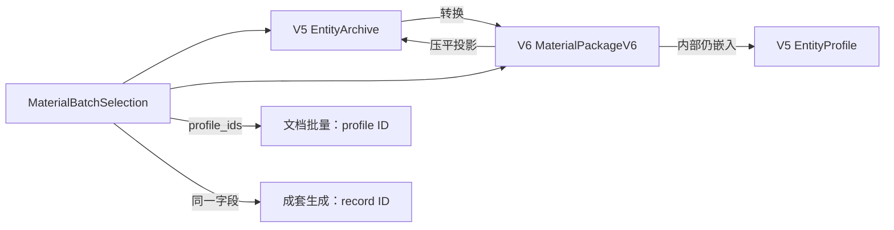
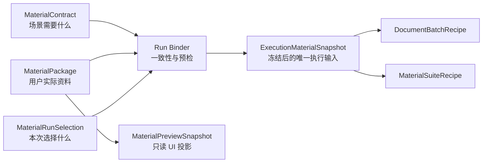

# 资料包顶层统一架构决策

状态：**已按本决策完成首次发布前的一次性切换**

日期：2026-07-31

适用范围：通用版、试卷版、论文版、公文版的资料导入、资料编辑、资料库、批量生成、成套生成和执行前预览。

## 1. 结论

项目尚未正式发布，因此不为 V3、V4、V5、V6 建立产品级兼容链，也不继续修补
`EntityArchive -> MaterialPackageV6 -> EntityArchive` 的双向转换。

最终采用以下方案：

1. 运行时只存在一个顶层资料模型：`MaterialPackage`。
2. 首次正式发布的落盘契约从 `schema_version = 1` 开始，不沿用开发期的
   V3/V4/V5/V6 产品含义。
3. `EntityArchive`、`EntityProfile`、`MaterialPackageV6` 和兼容转换函数退出资料域。
4. 包、分组、记录使用创建时生成且终身不变的技术 ID；名称、顺序、路线和文种都不再参与
   ID 推导。
5. 资料定义、运行选择、执行快照、预览投影和执行结果是五种不同对象，不再塞进同一个
   `MaterialBatchSelection`。
6. 编辑器直接编辑分层资料模型，不再把分层数据压平为 profile 后再反推所属层。
7. 场景/方案拥有“需要什么资料”的契约，资料包只拥有“实际提供了什么资料”；
   模板/母版拥有“如何放入文档”的规则。
8. 加载器只做严格读取和验证，不修剪、不补默认值、不改 ID、不迁移版本。
9. 外部 Excel、CSV、JSON 等只先进入 `MaterialImportDraft`；所有归一化都发生在导入确认前，
   不发生在正式资料包加载时。
10. 开发期用户资料和旧内置样例不进入正式发布数据：用户草稿清理，内置资料按新契约人工
    重建并校对。

这不是一次“V6 完善”，而是正式发布前取消错误演进历史、建立产品第一版资料域。

## 2. 文档地位

本文是资料域的专项架构决策，遵守
[`ARCHITECTURE_GUARDRAILS.md`](./ARCHITECTURE_GUARDRAILS.md) 的依赖方向：

```text
UI -> application use cases -> domain contracts -> infrastructure adapters
```

本文不替代项目总收口账
[`PROJECT_CLOSURE_EXECUTION_PLAN_2026-07-30.md`](../product/PROJECT_CLOSURE_EXECUTION_PLAN_2026-07-30.md)，
但取代历史审计记录中关于 V3/V4/V5/V6 继续兼容、以 `EntityArchive.archive_name`
作为长期资料包权威、以及把 V6 投影回 V5 执行的设计结论。

历史审计仍作为问题证据保留，不再作为目标架构。

## 3. 为什么必须现在重置

### 3.1 当前不是“两个版本”，而是两个同时生效的权威

当前核心对象关系如下：



这会产生四个无法靠局部补丁消除的问题：

- 包内容有两个权威：`archive.profiles` 和 `material_package.records`。
- 记录身份有两个命名空间：`profile_id` 和 `record_id`。
- 记录值有两份：`MaterialRecord.values` 和 `MaterialRecord.profile`。
- 同一个 `profile_ids` 字段在两个执行功能中代表不同实体。

只要保留双向转换，任何一边新增字段、资源或语义，另一边都可能静默丢失或改变。

### 3.2 本轮只读审计结果

审计对象为当前工作区 `config_library/material_packages/**/package.json` 和相关运行时代码。

| 项目 | 结果 | 意义 |
|---|---:|---|
| 真正的资料包 `package.json` | 20 | 不含资源目录中的 manifest/receipt |
| V3 | 5 | 当前加载器全部拒绝 |
| V4 | 1 | 当前加载器拒绝 |
| V5 | 14 | 其中 1 个结构不完整，当前加载器拒绝 |
| 可由当前 V5 加载器读取 | 13 | 不是全部库存 |
| 转 V6 后记录 ID 改变 | 12 / 13 | 选择、元数据和外部引用会断开 |
| 记录 ID 为空的可读用户包 | 6 | 当前只能按名称/顺序临时生成身份 |
| 资料模型引用面 | `EntityArchive` 22 个源码文件，`EntityProfile` 30 个源码文件 | 已进入多条核心链路 |

六个公文内置包的 ID 会发生如下变化：

```text
official:notice   -> record-official-notice
official:letter   -> record-official-letter
official:minutes  -> record-official-minutes
official:report   -> record-official-report
official:request  -> record-official-request
official:approval -> record-official-approval
```

与此同时，公文方案仍保存：

```json
"default_material_profile_id": "official:notice"
```

因此这不是单文件格式问题，而是跨场景、选择、执行和测试的身份契约冲突。

### 3.3 已确认的行为风险

#### A. 选择 ID 在转换后失配

`MaterialSuiteGenerationDetail.set_material_batch_selection()` 把 archive 转成 V6
package，但不同时把 `MaterialBatchSelection.profile_ids` 转成 record ID。后续成套编译以
V6 record ID 查找，会得到“选择包含未知记录”以及“没有选中的活动记录”。

反方向也不成立：若成套界面把新的 record ID 发布回 Bridge，旧 archive 中仍保存旧
profile ID，文档批量选择会匹配零项。

#### B. 空 ID 依赖名称和顺序，编辑即可能换身份

旧资料没有 ID 时，当前转换根据 profile 名称和列表位置生成记录 ID。只调整顺序，
`record-Alpha-1`、`record-Beta-2` 就可能变为 `record-Beta-1`、`record-Alpha-2`。

同步逻辑随后把它们视为新记录，生命周期、分组和来源定位都可能重置。

#### C. 压平后反推层级会改变用户数据

当前同步通过“与继承层相等就删除”的方式猜测一个值属于共享层、分组层还是记录层。
当共享层 `x=A`、分组层 `x=B`、记录层显式覆盖 `x=A` 时，往返后记录层 `x=A` 会被删除，
最终解析结果错误地变成分组层 `x=B`。

这是信息论上的不可逆：压平结果只剩一个 `x=A`，无法知道它是继承值还是显式覆盖值。
继续改善猜测算法也不能恢复已经丢失的所有权信息。

#### D. “严格加载”仍会静默归一化

V6 校验复用 V5 profile，并在 dataclass `__post_init__` 中修剪字符串、补名称、覆盖
profile ID/name、丢弃类型不符的嵌套值。部分非法输入不会被原样拒绝，而会被构造成另一份
有效对象。

正式加载器必须满足：

```text
输入非法 -> 明确拒绝
输入合法 -> 语义和值完全不变
```

不能满足：

```text
输入非法 -> 猜测作者意图 -> 静默改成另一份数据
```

#### E. 资源和放置规则混在资料记录中

当前 `EntityProfile` 同时保存：

- 字段值和字段别名；
- 图片文件与图片角色；
- 图片放置规则；
- 内容文件与插入规则；
- 附件文件与附件角色规格；
- 时间线和字段函数。

其中“文件/内容是什么”属于资料，“允许哪些角色”属于资料契约，“如何插入文档”属于
模板/母版。三类所有权混在一个 profile 后，复制、预览、执行和保存都必须理解全部领域，
也导致旧复制路径容易漏掉新字段。

#### F. 文件系统身份没有统一约束

当前不同保存器对大小写重复、Windows 保留名和路径组件采用不同规则。资料对象可以接受
`Case`/`case` 或 `CON`，到 bundle 发布或输出目录阶段才失败。

技术 ID 不应直接来自用户输入，也不应在不同层重复实现路径安全规则。

### 3.4 预发布阶段保留兼容的成本高于清理成本

现有旧文件均为开发期数据，没有已发布安装包、外部客户数据或公开 API 需要保障。
此时保留四代加载器会带来：

- 每个新功能必须维护多份模型和转换；
- 测试会把开发期偶然行为固化为长期产品契约；
- 真正的语义错误会被“兼容”掩盖成读时修复；
- 首次发布即背负迁移、双写、回退和数据恢复责任。

因此正式决策是：**接受开发期数据清理，不接受运行时兼容债务。**

## 4. 顶层边界

### 4.1 五种对象必须分离



| 对象 | 唯一职责 | 是否持久化 |
|---|---|---|
| `MaterialContract` | 定义字段、资源角色、允许作用域、必填条件和兼容执行配方 | 是，随产品配置发布 |
| `MaterialPackage` | 保存用户/内置的具体资料事实和资源引用 | 是 |
| `MaterialRunSelection` | 保存本次运行选择的 package revision 和 record IDs | 会话级，可选恢复 |
| `ExecutionMaterialSnapshot` | 保存已验证、已解析、不可变的执行输入和来源回执 | 随执行记录保存 |
| `MaterialPreviewSnapshot` | 给 UI 显示包名、当前记录、完整度和资源计数 | 否，可随时重建 |

执行结果和报告另行保存，绝不回写资料包。

### 4.2 工作模式、场景、资料契约、模板的所有权

| 信息 | 唯一 owner |
|---|---|
| 当前是通用/试卷/论文/公文 | Work mode |
| 本次任务的公文文种、试卷类型等 | Scene / task selection |
| 所需字段、字段类型、允许作用域、资源角色 | `MaterialContract` |
| 具体字段值、图片、内容和附件 | `MaterialPackage` |
| 图片/内容放到文档哪里、版式如何 | Template / master contract |
| 选择哪些记录生成 | `MaterialRunSelection` |
| 最终解析值和资源清单 | `ExecutionMaterialSnapshot` |

特别规定：

- `official:notice` 这类文种身份不再兼任资料记录 ID。
- 公文文种由任务显式选择；资料中若声明文种，只做一致性校验，不能反向偷偷改变任务。
- 场景不再保存 `default_material_profile_id`。
- 场景可以选择性保存 `default_material_package_id` 作为内置演示入口，但不能指定包内记录，
  也不能在找不到时回退到“第一条”。
- 一个资料包只声明一个根 `material_contract_id`。复合字段/资源契约由 contract 内部组合，
  不让 package 保存语义不清的 schema ID 列表。

## 5. 唯一领域模型

### 5.1 `MaterialPackage`

目标模型如下，名称为概念约束，不要求所有类放在一个文件：

```text
MaterialPackage
├── package_id                 immutable
├── display_name
├── work_mode_id
├── material_contract_id
├── shared_scope
├── groups[]
├── records[]
└── metadata                  非业务身份，不参与解析

MaterialGroup
├── group_id                   immutable
├── display_name
├── scope
└── metadata

MaterialRecord
├── record_id                  immutable
├── display_name
├── group_id | null            显式引用，不从字段猜测
├── lifecycle                  draft | active | disabled | archived
├── scope
└── origin                     导入来源，仅审计，不参与身份

MaterialScope
├── fields
├── resources
├── derivations
└── timelines
```

模型中没有：

- `profiles`；
- 嵌套 `EntityProfile`；
- `declared_field_keys`；
- `field_aliases`；
- `field_scopes`；
- `override_fields`；
- `assets_dir`、`asset_paths`、`asset_items` 多套资源来源；
- 图片/内容插入规则和附件角色规格。

### 5.2 字段作用域

解析顺序固定为：

```text
contract defaults
    < package shared
    < group
    < record
    < run override
```

规则：

1. key 在较低层出现，就表示该层明确拥有该值。
2. key 缺席才表示继承。
3. 空字符串是显式值，可以遮蔽继承值；若字段必填，执行预检会报告为空。
4. 删除当前层 key 才表示恢复继承。
5. 保存和编辑时禁止自动去重继承相等值。
6. 每个解析结果保留 `owner_scope` 和来源，供预览、审计和错误报告使用。

因此不再需要 `override_fields`，也不需要从压平值猜测 owner。

`MaterialContract` 为每个字段声明：

```text
field key
value type
allowed owner scopes
required condition
normalization policy for import only
whether run override is allowed
```

包中出现 contract 未声明字段、字段出现在不允许的层、或类型不符时，正式加载失败。

### 5.3 字段别名

字段别名只属于：

- 导入映射；
- 模板 placeholder contract；
- 用户在导入确认界面的临时选择。

`MaterialPackage` 永远只保存 canonical field key。别名不复制进每条记录，也不参与运行时
多轮猜测。

### 5.4 派生值和时间线

确实属于某个资料包的计算参数可保存在 `derivations`/`timelines`，但必须是有版本、可验证的
typed specification，并引用 contract 已声明字段。

通用算法、默认公式和可用 preset 由 `MaterialContract`/domain registry 拥有。包不能保存
任意代码、任意函数名或加载时无法验证的嵌套字典。

解析器必须在执行前检测：

- 未知字段引用；
- 未知 preset/version；
- 循环依赖；
- 输出字段所有权冲突；
- 非确定性输入；
- 时间线锚点缺失。

### 5.5 资源

资料包只保存资源实例，不保存文档放置规则。

```text
package/group/record scope
    resources[canonical_role]
        -> ResourceBinding[]
            -> content-addressed object
```

每个 `ResourceBinding` 至少包含：

```text
object_id       sha256:<64 hex>
media_type
original_name   仅展示
size
```

规则：

- 图片角色、附件角色、内容角色由 `MaterialContract` 声明。
- token、anchor、尺寸、环绕、插入顺序等由 template/master contract 声明。
- 外部绝对路径不能进入正式 `package.json`。
- 文件先复制到包内对象目录并计算 hash，随后 package 才能引用。
- 加载时验证路径 containment、对象存在、大小和 hash。
- 一个角色如何合并由 contract 显式声明，默认是 lower scope `replace`；需要 `append`
  的角色必须单独声明，禁止对所有资源采用一个隐式字典合并算法。

## 6. 身份契约

### 6.1 ID 格式

新对象创建时使用标准库 UUID4 生成一次：

```text
package_id = pkg_<32 lowercase hex>
group_id   = grp_<32 lowercase hex>
record_id  = rec_<32 lowercase hex>
```

例如：

```text
pkg_4f3a7d0ff6d44f31850a93e239541356
rec_098067f0c80e4dd48db5b919bf976e5d
```

约束：

- 技术 ID 不由名称、序号、文种、路线、路径或用户输入生成。
- ID 创建后不可编辑。
- 重命名、排序、移动分组、修改路线均不改变 ID。
- package ID 在资料库全局唯一；group/record ID 在包内唯一。
- 外部引用记录时使用 `(package_id, record_id)`，不能只保存 record ID。
- 内置数据的 ID 生成一次后写入仓库，不使用每次启动时的确定性名称 hash。
- UI 默认不展示技术 ID，诊断详情可以展示。

统一使用小写 hex 后，大小写重复和 Windows 保留名不再成为实体身份问题。

### 6.2 Revision

`revision` 是 canonical `package.json` 字节的 SHA-256，不写回被计算的 JSON，避免自引用。

所有编辑命令携带：

```text
package_id
expected_revision
operation
```

保存时若仓库当前 revision 已变化，返回明确冲突，不覆盖另一个窗口或进程的修改。

## 7. 唯一落盘契约

### 7.1 文件布局

```text
config_library/material_packages/
└── <work_mode_id>/
    ├── builtin/
    │   └── <package_id>/
    │       ├── package.json
    │       └── objects/sha256/<digest>
    └── user/
        └── <package_id>/
            ├── package.json
            └── objects/sha256/<digest>
```

`builtin/user` 是 repository entry 的来源，不写入 package 业务数据。

显示名称只存在 `package.json` 中，目录名永远使用 package ID，避免重命名目录、同名覆盖、
非法路径字符和本地化名称碰撞。

### 7.2 JSON 骨架

```json
{
  "kind": "alavette.material_package",
  "schema_version": 1,
  "package_id": "pkg_4f3a7d0ff6d44f31850a93e239541356",
  "display_name": "华东项目资料包",
  "work_mode_id": "official",
  "material_contract_id": "official_document_material_v1",
  "shared_scope": {
    "fields": {
      "organization_name": "某某单位"
    },
    "resources": {},
    "derivations": {},
    "timelines": {}
  },
  "groups": [
    {
      "group_id": "grp_75eefdb710364e7baad8a5777a52cfb2",
      "display_name": "第一批",
      "scope": {
        "fields": {},
        "resources": {},
        "derivations": {},
        "timelines": {}
      },
      "metadata": {}
    }
  ],
  "records": [
    {
      "record_id": "rec_098067f0c80e4dd48db5b919bf976e5d",
      "display_name": "关于……的通知",
      "group_id": "grp_75eefdb710364e7baad8a5777a52cfb2",
      "lifecycle": "active",
      "scope": {
        "fields": {
          "title": "关于……的通知",
          "body": "正文"
        },
        "resources": {},
        "derivations": {},
        "timelines": {}
      },
      "origin": {
        "source_kind": "xlsx",
        "sheet": "资料",
        "row": 2
      }
    }
  ],
  "metadata": {}
}
```

正式 schema 应继续为每个字典规定精确 key、值类型、长度和大小上限；上例只表达顶层所有权，
不是允许任意 `metadata` 无限扩展。

### 7.3 原子保存

保存顺序固定：

1. 获取 package 级跨进程文件锁。
2. 读取当前 revision，与 `expected_revision` 比较。
3. 在同文件系统临时目录验证并写入新对象。
4. 先把 content-addressed objects 发布到最终对象目录；同 hash 对象只校验、不覆盖。
5. 生成 canonical JSON，完成全量验证。
6. 原子替换 `package.json`。
7. 重新读取并计算 revision，返回已提交快照。
8. 释放文件锁。

对象先发布、JSON 后切换，因此崩溃最多留下未引用对象，不会让 package 引用不存在的文件。
未引用对象由显式垃圾回收任务处理，不能在普通保存过程中猜测并删除。

禁止：

- 先覆盖目标再验证；
- 依赖进程内 `RLock` 充当多进程保护；
- 资料包保存成功后才补写关键 manifest；
- 自动覆盖同名输出；
- 使用未校验的用户字符串拼接路径。

## 8. 严格读取与导入边界

### 8.1 正式加载器

正式加载器只接受：

```text
kind == alavette.material_package
schema_version == 1
```

处理顺序必须是：

```text
JSON parse
-> exact wire-shape validation
-> semantic validation
-> typed construction
-> canonical serialization equality check
-> immutable snapshot
```

必须拒绝：

- 缺键、多键和未知版本；
- 空、带空白或不合格式的技术 ID；
- 重复 ID、悬空 group/record/resource 引用；
- 名称为空；
- 非 canonical field key；
- contract 不允许的字段或作用域；
- lifecycle 非法；
- 资源越界、缺失或 hash 不符；
- 嵌套类型错误、NaN/Infinity、bool 冒充整数；
- 构造后内容与 wire payload 不一致。

加载器不得：

- `strip()` 后继续；
- 自动补名称或 ID；
- 把错误 lifecycle 改成 `active`；
- 把坏的 mapping 改成空字典；
- 丢弃未知项；
- 读取 V3/V4/V5/V6；
- 调用 migration；
- 在失败后回退到 builtin、首项或默认包。

### 8.2 外部导入

外部数据经过独立流程：

```text
source file
-> MaterialImportDraft
-> diagnostics + column/role mapping
-> user confirmation
-> ID allocation
-> canonical MaterialPackage
-> strict save/reload
```

只有 `MaterialImportDraft` 可以保存：

- 原始列名和别名候选；
- 被修剪前的字符串；
- 缺失 ID；
- 重复行；
- 待确认的类型转换；
- 外部绝对路径。

用户确认后才创建正式 ID、复制资源并产出 canonical package。导入失败不改变当前资料包。

### 8.3 开发期旧资料

默认处理是删除，不在产品中迁移：

- 删除 V3/V4/V5 用户草稿；
- 删除 V6 实验文件；
- 删除隐藏模式下的开发资料包；
- 逐个重建真正需要发布的 builtin；
- 不是产品级内容的 `default_test_package` 改为测试 fixture，不进入配置库。

若某份开发资料确实不可替代，可以临时使用仓库外的一次性提取脚本，把内容转换成 import
draft 后人工确认。该脚本：

- 不放入 `src`；
- 不被运行时调用；
- 不进入安装包；
- 不形成 `load_any`；
- 完成一次提取后删除。

这属于人工数据抢救，不属于版本兼容。

## 9. 编辑与应用服务

### 9.1 UI 不直接改领域对象

资料编辑器通过 application commands 操作：

```text
CreatePackage
RenamePackage
AddGroup
RenameGroup
AddRecord
RenameRecord
MoveRecord
SetRecordLifecycle
SetField
RemoveField
BindResource
RemoveResource
SetDerivation
SetTimeline
SavePackage
```

每个命令显式包含目标 scope 和目标 ID，不允许通过当前选中索引或显示名称定位。

application service 返回：

```text
CommandResult
├── updated_snapshot
├── revision
└── issues[]
```

UI 只保留：

- 当前 `package_id/revision`；
- 当前选中的 group/record ID；
- dirty 状态；
- 可重建的 view model。

### 9.2 Bridge 不是资料权威

`PanelBridge` 只传递：

- `MaterialPackageRef`；
- `MaterialRunSelection`；
- `MaterialPreviewSnapshot`；
- typed issues。

Bridge 不再存整份可变 `EntityArchive`，也不保存一份 archive 和一份 package。

预览链固定为：

```text
MaterialPackage snapshot
-> PreviewProjector
-> MaterialPreviewSnapshot
-> Bridge
-> QuickExecutionDetail
```

预览不得回退读取执行上下文或按 ID 反查并猜测名称。

### 9.3 UI 异常边界

Qt signal handler 不允许让解析/加载异常越过槽函数并打印 traceback。

repository/application boundary 把失败转换为：

```text
MaterialIssue
├── code
├── path
├── message
├── severity
└── remediation
```

UI 展示可操作错误，保持旧选择和旧 revision 不变。未知编程错误记录日志并显示统一失败状态，
不能把部分转换后的选择发布给其他面板。

## 10. 统一执行链

### 10.1 运行选择

```text
MaterialRunSelection
├── package_id
├── package_revision
├── selected_record_ids[]
├── runtime_field_overrides
└── runtime_resource_overrides
```

这里不存在 `profile_ids`、`archive`、`material_package`、`source_path` 或可变
`base_context`。

约束：

- selected record 必须属于指定 package revision；
- ID 顺序是明确的执行顺序；
- 重复 ID 拒绝，不静默去重；
- disabled/archived/draft 记录被选择时明确报错；
- 空选择的含义由 recipe 明确规定，不自动等于全部记录。

### 10.2 Binder

application 层的唯一 binder 同时读取：

- 当前 scene/task identity；
- scene 要求的 `MaterialContract`；
- 指定 revision 的 `MaterialPackage`；
- `MaterialRunSelection`；
- template/master contract；
- output policy。

完成以下预检后生成不可变 `ExecutionMaterialSnapshot`：

1. work mode 完全一致；
2. material contract 完全一致；
3. task document type 与资料声明不矛盾；
4. 所有 selected records 存在且可执行；
5. 所有层级字段和资源解析成功；
6. 必填字段/资源完整；
7. derivation/timeline 可确定执行；
8. template/master 支持全部字段和资源角色；
9. 输出路径均位于 output root 内；
10. 所有输出路径在写入前已完成大小写无关碰撞检查。

任何一项失败都不创建可执行 snapshot。

### 10.3 执行快照

快照至少冻结：

```text
run_id
scene/task identity
package_id + package_revision
selected record IDs
resolved field values + provenance
verified resource objects + hashes
contract IDs + versions
template/master IDs + revisions
recipe ID + version
output plan
preflight receipt
```

执行器只能消费 snapshot，不能：

- 重新打开 package 路径；
- 重新解析外部资源目录；
- 从 Bridge 补值；
- 从第一条记录猜默认；
- 反向写入编辑态 package。

### 10.4 文档批量与成套生成

两者是 recipe，不是两套资料模型：

| Recipe | 含义 |
|---|---|
| `DocumentBatchRecipe` | 对每个 selected record 处理同类输入/模板并生成一份或多份文档 |
| `MaterialSuiteRecipe` | 按 package/group/record emit scope 生成一组异构产物 |

两者都只读取相同的 `ExecutionMaterialSnapshot`。`profile_id` 术语从资料执行链删除。

输出统一采用：

```text
preflight all paths
-> stage all artifacts
-> validate all artifacts
-> commit as one declared delivery set
-> emit result receipt
```

默认冲突策略是 fail，不覆盖已有文件。

## 11. 源码分层建议

目标目录职责：

```text
src/domain/materials/
    ids.py
    model.py
    contract.py
    validation.py
    resolver.py

src/application/materials/
    commands.py
    queries.py
    import_workflow.py
    run_binding.py
    preview_projection.py

src/infrastructure/materials/
    json_codec.py
    repository.py
    object_store.py
    file_lock.py

src/ui/
    ... widgets and presenters only
```

约束：

- domain 不依赖 Qt、文件系统和现有 `config.library`。
- application 依赖 domain ports，不依赖具体 widget。
- infrastructure 实现 repository/object store。
- UI 不导入 JSON codec 或直接读写资料包文件。
- pipeline/document modules 依赖 frozen execution contract，不依赖 repository。

## 12. 现有类型的最终去向

| 当前对象/函数 | 最终处理 |
|---|---|
| `EntityArchive` | 从资料运行时删除；若未来另有非资料实体归档需求，另建独立领域对象 |
| `EntityProfile` | 删除；字段和资源进入 `MaterialRecord.scope` |
| `MaterialPackageV6` | 由不带版本后缀的 `MaterialPackage` 替代 |
| `MaterialValueScope` | 由严格的 `MaterialScope` 替代，不做构造期修剪 |
| `MaterialBatchSelection` | 拆成 `MaterialRunSelection` 与 recipe-specific request |
| `MaterialExecutionContext` 的资料字段 | 由 `ExecutionMaterialSnapshot` 替代 |
| `MaterialPreviewSnapshot` | 保留为只读投影，但只从 canonical package 构造 |
| `material_package_v6_from_archive` | 删除 |
| `synchronize_material_package_from_archive` | 删除 |
| `MaterialPackageV6.to_entity_archive` | 删除 |
| `migrate_entity_archive_to_v6` | 删除 |
| `load_material_package_any` | 删除 |
| V3/V4/V5/V6 validator/codec | 删除 |
| `_legacy_record_identity` 及兼容 ID 修补 | 删除 |
| `default_material_profile_id` | 从 scene contract 删除 |
| `profile_ids`（资料选择语义） | 改为 `selected_record_ids` |

当前为阻止 `official:approval` 立即崩溃而加入的 legacy ID 清洗，只能视为诊断期止血；
在本架构落地时必须随兼容转换模块一起删除，不能成为正式身份规则。

## 13. 实施顺序

以下是一次整体重构的施工顺序，不是多版本兼容路线。

### Phase 0：冻结决策和失败用例

- 将本文纳入架构审查。
- 为 ID、scope owner、strict codec、resource containment、selection 和 snapshot 写目标契约测试。
- 为当前已复现的 ID 失配、顺序换 ID、scope 往返损失和 UI traceback 写反例测试。
- 停止给 V5/V6 compatibility path 增加新能力。

### Phase 1：建立新 domain 和 strict codec

- 实现 ID value objects、`MaterialContract`、`MaterialPackage`、resolver 和 validator。
- 实现 schema version 1 codec。
- 实现 canonical JSON、revision、package lock、CAS repository 和 object store。
- 此阶段新代码不导入旧 archive/profile。

### Phase 2：统一所有生产者

- 新建、复制、Excel/CSV/JSON 导入全部产出 `MaterialImportDraft` 或 canonical package。
- 字段映射、图片、内容、附件和时间线生产者改为新命令。
- 删除任何继续制造 `fields + declared_field_keys + empty field_scopes` 的路径。

### Phase 3：统一编辑和预览

- 资料面板改为 commands/queries。
- Bridge 改为 ref、selection 和 preview。
- 快速执行预览只消费新 projection。
- builtin 只读；复制 builtin 创建新 package ID，并把资源完整 vendoring 到 user bundle。

### Phase 4：统一执行

- 建立 binder 和 frozen snapshot。
- 文档批量切到 `DocumentBatchRecipe`。
- 成套生成切到 `MaterialSuiteRecipe`。
- Pipeline 和专用 assembler 只读取 snapshot。

### Phase 5：数据重建和一次性切换

- 清理全部开发期 user packages。
- 隐藏模式资料不进入发布树。
- 逐个重建并人工校对需要发布的 builtin。
- 删除场景中的 `default_material_profile_id`，分离公文文种 identity。
- composition root 一次性切到新 application service。

### Phase 6：删除旧链

- 删除旧模型、codec、migration、adapter 和兼容测试。
- 删除 V3/V4/V5/V6 fixture；保留的格式破坏样例放在新 codec 的 invalid fixtures。
- 运行源码/AST 门禁，防止旧类型重新进入资料域。
- 全量回归、真实 UI 链路和安装包干净环境验证通过后才允许发布。

施工分阶段是为了可验证；主干最终状态不允许 dual read、dual write、feature flag 或运行时 fallback。

## 14. 校对与测试矩阵

### 14.1 Domain

- ID 只创建一次，rename/reorder/move 不改变 ID。
- group 引用完整，删除 group 必须先移动/删除其 records。
- lifecycle 无隐式默认。
- lower scope 显式空值能遮蔽继承。
- lower scope 与 inherited 值相等时往返不丢 owner。
- resolver 为每个值返回正确 provenance。
- derivation cycle 和未知引用 fail-closed。

### 14.2 Codec

- exact keys、exact primitive types、有限数值。
- load -> save 得到 canonical 等价字节。
- 任何非法输入不被修剪成合法对象。
- future/legacy version 全部拒绝。
- 大小写、空白、Unicode 混淆和超长输入覆盖。
- 构造前后 wire payload 完全一致。

### 14.3 Repository

- package revision CAS 冲突。
- 两进程并发保存只有一个成功。
- object 成功、JSON 失败时旧包仍可读。
- JSON 切换后所有 object 都存在且 hash 正确。
- symlink/reparse/path traversal/Windows reserved path 被阻断。
- builtin/user 同 package ID 不允许 shadow；复制必须获得新 ID。

### 14.4 Import

- 原始值和归一化值分开显示。
- 重复/空 ID 不进入正式 package。
- 列别名只停留在 draft。
- 外部资源先 copy/hash 后绑定。
- 任一步失败不改变现有 package。

### 14.5 Application/UI

- 所有命令按 ID 定位，不按 index/name。
- stale revision 显示冲突，不静默覆盖。
- load/validation 错误不越过 Qt slot。
- 失败后 Bridge 保持上一份有效 selection/preview。
- 重命名、记录切换和资源修改实时更新 preview。
- preview 不反查路径、不读取 execution fallback。

### 14.6 Execution

- scene mode、contract、document type 冲突全部阻断。
- unknown/duplicate/inactive selected record 阻断。
- document batch 和 suite 对同一 snapshot 得到同一字段/资源解析结果。
- output collision 在任何写入前被发现。
- stage 中途失败不留下半成品，不覆盖旧 final。
- 执行期间修改 package 不影响已冻结 run。
- 执行结果不回写 package。

### 14.7 Release guard

最终运行时代码必须满足：

```text
MaterialPackageV3/V4/V5/V6        0 references
EntityArchive in material flow    0 references
EntityProfile in material flow    0 references
load_material_package_any         0 references
migrate_*material_package*        0 references
archive + package dual storage    0 occurrences
profile_ids as material selection 0 occurrences
```

四个正式工作模式的真实 smoke 均须覆盖：

- 无资料；
- 单记录；
- 多记录；
- 资源绑定；
- 保存后重启；
- 执行前修改；
- 输出冲突；
- 损坏 package。

隐藏模式不计入正式资料包发布矩阵，也不携带开发资料进入安装包。

## 15. 发布验收标准

以下条件必须全部满足，才可声明资料域完成：

1. 运行时只有一个 canonical `MaterialPackage`。
2. 配置库只有 `schema_version = 1` 的正式 package。
3. 没有兼容 loader、migration、dual read 或 dual write。
4. 编辑、预览、批量和成套使用相同的 package/revision/record identity。
5. 包内没有 profile 副本，没有分层值的压平反写。
6. 所有字段和资源都有唯一 contract owner。
7. package 可连同对象目录独立复制到另一台机器并严格加载。
8. loader 对非法输入只拒绝，不修复。
9. 所有 UI 边界返回 typed issue，不出现未处理槽函数 traceback。
10. 两种生成 recipe 只消费 frozen snapshot。
11. 输出发布具备完整 preflight、staging、commit 和 rollback 证据。
12. 旧格式、旧 fixture 和开发用户资料不进入安装包。
13. 定向测试、四模式真实链路、全量测试和干净安装包门禁全部通过。

## 16. 明确不做

- 不把 V6 修成“更好的兼容层”。
- 不保留首次发布前的格式版本历史。
- 不允许读取时自动迁移。
- 不为开发用户草稿提供长期恢复承诺。
- 不让 package ID、record ID 同时承担文种、路线或显示名称。
- 不在资料包中保存模板放置规则。
- 不以通过旧测试为理由保留错误的双模型契约。
- 不把隐藏的标书版、技术文档版、报告版纳入本轮深度建设或发布资料库存。

## 17. 最终判断

真正合理的终点不是让 V5 和 V6 “都能跑”，而是让系统能够对以下问题各给出唯一答案：

```text
资料是什么？             MaterialPackage
需要什么资料？           MaterialContract
本次选了什么？           MaterialRunSelection
执行实际使用了什么？     ExecutionMaterialSnapshot
界面显示什么？           MaterialPreviewSnapshot
资料如何进入文档？       Template/Master + Recipe
```

当前 traceback 是双身份冲突最先暴露出的症状，不是根因。继续增加 ID 清洗、回退和迁移报告，
只会延后下一次失败。项目未发布正是唯一可以低成本删除这条历史链的窗口；应一次完成模型、
身份、落盘、编辑和执行边界的统一，再继续开发资料包功能。

## 18. 2026-07-31 落地与校对记录

### 18.1 已完成状态

- 运行时代码只保留 `MaterialPackage` V1、`MaterialPackageRef`、
  `MaterialRunSelection`、`ExecutionMaterialSnapshot` 和
  `MaterialPreviewSnapshot` 这一套对象边界。
- V3/V4/V5/V6、`EntityArchive`、`EntityProfile`、旧 batch/context、
  兼容 loader、双向转换和公文专用旧资料样例入口已从资料运行链删除。
- 配置库共有 9 个严格 V1 内置资料包：通用、试卷、论文各 1 个，公文 6 个；
  仅分布在通用版、试卷版、论文版、公文版。
- 标书版、技术文档版、报告版保留稳定模式身份但状态为 `hidden`，不进入标题栏、
  本轮资料库存和正式验收矩阵。
- 资料编辑器直接编辑 V1 package/group/record/scope，并通过 revision CAS 保存；
  Bridge 只发布 ref、selection、preview 和 typed issues。
- 文档批量与成套生成都使用 `selected_record_ids`；失败重试结果也统一为
  `retry_eligible_record_ids`，不再沿用 `profile_ids`。
- 公文文种属于任务状态，不再由 scene 中的资料 profile 反向决定。

### 18.2 交互面板回归的原因与修正

曾出现的“交互面板丢失”不是 V1 架构的必然结果，而是实施时把
`WorkbenchPanel` 整体替换成了一个最小执行表单。该替换误删了原工作台的
master/detail 外壳、功能导航、绑定卡、资料预览、输出卡、执行反馈以及延迟加载入口，
属于 UI 恢复范围判断错误。

最终处理不是恢复旧资料模型，而是：

1. 恢复原有富交互工作台外壳和非资料功能；
2. 保留 9 个工作台详情目的地及其延迟加载；
3. 仅把资料选择、预览、批量、成套和执行控制器的输入改接 V1；
4. 套件“打开资料”直接进入唯一的 V1 资料包编辑器，不再跳转已删除的旧时间线子页；
5. 运行前资料为不可变快照，编辑必须回到资料包页面并发布新 revision。

因此，顶层统一与富交互界面并不冲突：被删除的是双模型和兼容路径，不是产品交互层。

### 18.3 本轮额外排除的潜在雷点

- **只读映射深拷贝**：V1 selection/preview 内含 `mappingproxy`，Bridge 现采用
  “不可变值直接复用、外层 evidence 容器复制”，不再 `deepcopy` 冻结值。
- **模式回滚的过期 Qt 信号**：模式默认资源加载失败时，外层目标模式信号仍可能继续分发。
  标题栏、资料面板和工作台现只投影 Bridge 的最终权威模式；资料面板在模式未真正改变时
  不重载、不覆盖刚恢复的 ref/selection/preview/issues。
- **关闭与切换事务**：V1 资料编辑器已补齐保存、放弃、取消、commit、rollback、finalize；
  保存后下游场景提交失败时，磁盘恢复旧 snapshot，编辑器恢复未保存 draft。
- **旧公文资料入口**：删除对已移除
  `official_document_material_package` 的运行时导入，统一使用
  `material_package_selector_options`。
- **记录身份残留命名**：工作台的失败项、重试项和终端 payload 全部改为 record ID 术语。

### 18.4 验收证据

本轮定向验收共 129 项，全部通过：

| 验收组 | 结果 |
|---|---:|
| 工作台结构、导航、套件入口与关闭 | 24 / 24 |
| MaterialPackage V1、应用、导入、文档批量、成套、发布门禁 | 29 / 29 |
| 配置库、选择器、Bridge 与四模式共享状态 | 52 / 52 |
| 标题栏四模式、脏数据事务、失败回滚与不可变快照 | 24 / 24 |

另完成：

- 主窗口离屏构造成功；
- 通用、试卷、论文、公文连续循环切换 12 次成功；
- 标题栏可见模式严格为 4 个；
- 工作台 9 个详情目的地在切换过程中保持存在；
- Python 编译检查通过；
- 源码门禁确认旧资料模型、旧公文资料入口、旧 profile 重试字段为 0 引用；
- 最新结构截图保存为 `artifacts/workbench_v1_restored.png`。

全项目 `pytest -q` 在 10 分钟执行窗口内未完成并被超时终止，因此本记录不虚报
“全项目全量通过”。本次架构切换和工作台恢复以以上 129 项定向回归为完成门槛；
后续发布流水线仍应在无时限的 CI 环境执行全量测试。
