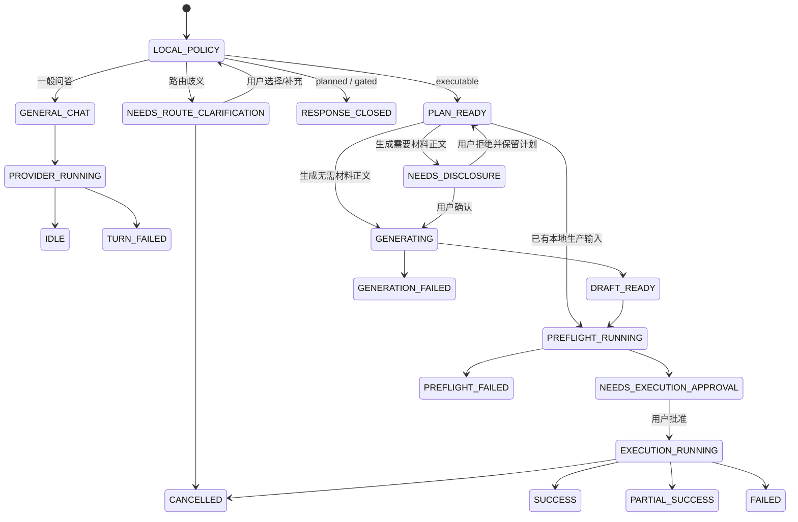

# AI 核心闭环与全场景边界用例、POC 与最短路径审计

> 日期：2026-07-29  
> 审计覆盖：Alavette Form 一级 AI 功能及当前注册的自然语言场景、操作类型和专业边界  
> 当前产品范围：只定义一级 AI 文档助手现有主链，不自动开启 planned/gated 场景建设  
> 本轮性质：先定义产品行为和验收用例，不新增业务入口，不以零散补丁代替闭环

## 1. 结论

当前不能表述为“所有场景下的所有 AI 功能已经闭环”。

代码中共有 23 条自然语言场景路由，AI 将需求分为 6 类操作：

1. `transform`：处理已有文档；
2. `author`：从需求或资料起草内容；
3. `review`：分析、检查或审阅；
4. `batch`：批量生成；
5. `import`：PDF、OCR、LaTeX 等导入转换；
6. `author_master`：创建或改造母版。

因此能力矩阵共有 `23 × 6 = 138` 个单元。按当前
`resolve_assistant_capability()` 的实际结果统计：

| 当前状态 | 单元数 | 占比 | 正确含义 |
|---|---:|---:|---|
| `executable` | 25 | 18.1% | 代码允许进入 Assistant 生产计划，不等于每个场景都有独立真实产物 E2E |
| `planned` | 65 | 47.1% | 已识别需求，但不能执行；应明确说明并阻止通用降级 |
| `gated` | 48 | 34.8% | 必须经过专业能力、插件或人工确认边界；安全阻断不等于业务闭环 |

其中：

- `transform`：9 个可执行、6 个 planned、8 个 gated；
- `author`：7 个可执行、8 个 planned、8 个 gated；
- `review`：9 个可执行、6 个 planned、8 个 gated；
- `batch`、`import`、`author_master`：当前均为 0 个可执行场景。

当前 23 × 6 冻结矩阵如下。`E` = executable，`P` = planned，
`G` = gated：

| route_id | 场景 | transform | author | review | batch | import | author_master |
|---|---|:---:|:---:|:---:|:---:|:---:|:---:|
| `quick_formatting_general` | 通用快速排版 | E | E | E | P | P | P |
| `quick_bilingual_formatting` | 双语排版，不含翻译审阅 | E | E | E | P | P | P |
| `personal_career_formatting` | 个人职业文档 | E | E | E | P | P | P |
| `chinese_academic_thesis` | 中文论文/课程论文 | E | E | E | P | P | P |
| `english_journal_submission` | 英文期刊投稿 | P | P | P | P | P | P |
| `exam_teaching_versions` | 试卷与教学版本 | E | E | E | P | P | P |
| `bidding_document_authoring` | 标书正文生成与排版 | E | E | E | P | P | P |
| `bidding_qualification_archive` | 投标资质归档 | E | P | E | P | P | P |
| `official_policy_documents` | 公文/会议/政策文档 | E | P | E | P | P | P |
| `technical_long_document` | 技术长文档 | E | E | E | P | P | P |
| `project_application_package` | 项目申报与评审包 | P | P | P | P | P | P |
| `product_sales_document` | 产品/白皮书/售前文档 | P | P | P | P | P | P |
| `contract_delivery_package` | 合同审阅与签署交付 | P | P | P | P | P | P |
| `hr_batch_documents` | 人事批量文档 | P | P | P | P | P | P |
| `fixed_form_batch_documents` | 固定表单/证书批量 | P | P | P | P | P | P |
| `finance_quote_documents` | 财务报价与附件报告 | G | G | G | G | G | G |
| `regulated_disclosure_documents` | 受监管披露归档 | G | G | G | G | G | G |
| `ip_patent_manual_boundary` | 专利/IP 专业边界 | G | G | G | G | G | G |
| `legal_document_manual_boundary` | 法律文档专业边界 | G | G | G | G | G | G |
| `medical_regulatory_manual_boundary` | 医疗/药品监管边界 | G | G | G | G | G | G |
| `bilingual_review_documents` | 双语翻译与术语审阅 | G | G | G | G | G | G |
| `import_pdf_thesis_boundary` | PDF 论文导入边界 | G | G | G | G | G | G |
| `import_ai_conversion_boundary` | OCR/PDF/LaTeX/复杂转换边界 | G | G | G | G | G | G |

所以当前最准确的产品结论是：

- **试卷生成**和**标书正文生成**已经具备最强的 Assistant 真产物闭环证据；
- **投标资质归档**已具备资料包交付闭环，但不支持 AI 从零起草资质事实；
- **公文**底层装配链较完整，但 Assistant 从零起草仍未闭环；
- 其余标记为 `executable` 的通用、双语排版、个人职业、中文论文、技术长文场景，主要证明了路由和共享生产合同可用，仍应补场景级真文件 E2E；
- 6 个 planned 场景只是“识别但不执行”；
- 8 个 gated 场景目前主要实现了“安全不越界”，并没有在 Assistant 对话里完成可见、可恢复的插件/人工交接。

### 1.1 本次审计边界修正

“审计所有场景”只表示所有已注册场景都必须有确定行为，不能解释为：

- 23 个场景都要在当前版本变成可执行；
- 6 类操作都要纳入本次 POC；
- planned 场景自动进入开发排期；
- gated 场景必须立即接入专业插件；
- AI 要取代 Form 现有工作台、装配器、批量引擎或资料管理；
- 为了通过场景覆盖而在 UI 中增加一批暂不可用入口。

本次真正需要定义和验证的是一级 AI 文档助手的核心用户任务：

```text
用户描述目标或添加材料
→ AI 理解并确认
→ AI 形成可审阅计划
→ 用户补充/批准
→ Form 使用已有生产能力执行
→ AI 返回真实交付结果
```

23 条路由在本轮只有三种责任：

1. 已支持场景必须进入正确主链；
2. 不支持场景必须准确说明边界，不能伪执行；
3. 歧义场景必须先澄清，不能偷走通用路径。

### 1.2 AI 与 Form 的职责边界

| 层级 | 当前应该负责 | 当前不应该负责 |
|---|---|---|
| AI 对话层 | 理解目标、识别场景、询问关键缺口、解释边界、生成或修订内容草稿、展示计划和结果 | 直接操作 DOCX XML、在 UI 文案里实现业务规则、无确认执行、虚构专业事实 |
| Assistant 应用层 | 把对话转成类型化 plan，冻结输入角色、generation、production、delivery 合同 | 按 23 个场景复制控制器、绕开 capability registry |
| Form 生产层 | 读取文件、预检、应用方案/模板/资料、装配 DOCX、发布交付物、校验完整性 | 根据自由文本猜用户意图、替 AI 进行专业内容判断 |
| 用户/专业角色 | 提供事实、确认关键选择、批准执行、完成专业判断 | 被要求理解内部 route/profile/validator ID |

因此 AI 功能的 POC 是“对话驱动 Form”，不是“在 AI 页面重做一个 Form”。

### 1.3 当前范围判定表

| 能力 | 当前 POC | 说明 |
|---|:---:|---|
| 一级 AI 独立页面与对话 Composer | 是 | 保持 Design 的核心交互结构，但不恢复无业务链的侧栏功能 |
| 添加 DOCX/资料并显示输入角色 | 是 | 文件必须进入类型化 source/material 合同 |
| 自然语言识别与必要澄清 | 是 | 覆盖 23 条路由是为了避免误执行 |
| 已有 DOCX 的计划、预检、批准、输出 | 是 | 核心路径 A |
| 已有试卷或标书生成链的对话闭环 | 是 | 核心路径 B，只复用现有链 |
| planned/gated 的准确阻断 | 是 | 核心路径 C，完成的是回复闭环 |
| 所有 23 个场景都能生成文档 | 否 | 不属于本轮承诺 |
| AI 批量生成入口 | 否 | 底层 batch 存在也不自动纳入 |
| PDF/OCR/LaTeX 导入 | 否 | 只保留识别和边界回复 |
| AI 生成/改造母版 | 否 | 高风险资源生命周期，当前不开放 |
| 专业插件和人工 handoff 调度 | 否 | 只保留 gate，不建设调度中心 |
| 重做 Form 方案/模板/资料包管理 | 否 | AI 只引用并投影现有 Form 资源 |
| 所有真实云 Provider 的发布验证 | 否 | POC 可用确定性 Provider；正式发布另行验收 |
| 安装包、多 DPI、Office 视觉验收 | 否 | 属于生产发布门禁，不是 POC 范围 |

## 2. 不能再混用的四种“闭环”

### 2.1 识别闭环

系统能稳定判断用户说的是哪个场景；存在歧义时会让用户明确选择，不偷偷选择一个近似场景。

识别闭环只证明“听懂了”，不证明“做得出来”。

### 2.2 回复闭环

AI 能准确说明：

- 它理解了什么；
- 还缺什么；
- 当前能做什么、不能做什么；
- 下一步动作是什么；
- 是否会调用模型、读取文件、写入输出目录；
- 成功时交付什么，失败时保留什么。

planned/gated 场景可以达到回复闭环，但不能因此称为业务闭环。

### 2.3 POC 闭环

当前一级 AI 功能的 POC 至少要用一条受控最短路径证明用户价值：

```text
用户意图
  → 确定性路由
  → 只补关键缺口
  → 可审阅的结构化计划
  → 内容生成或已有文件处理
  → 领域校验
  → 执行前预检
  → 用户明确批准
  → 专用/共享装配器
  → 必需交付物完整性验证
  → 可打开、可重试的结果回执
```

POC 不是“模型返回了文字”，也不是“按钮能点”。没有真实文件、没有必需产物校验、没有失败关闭，就不算 POC。

但这不要求为 23 个场景分别建设 23 个 POC。当前只需证明三种核心旅程：

1. **已有文档处理**：用户添加 DOCX，AI 形成处理计划，Form 输出新 DOCX；
2. **AI 内容生成后生产**：用户给出目标/材料，AI 生成经校验的中间产物，Form 输出目标文档；
3. **不支持或歧义请求**：AI 准确澄清或阻断，不出现伪生成动作。

试卷和标书可作为第 2 类旅程的现有证据，不等于要求继续新增行业场景。

### 2.4 生产闭环

POC 之外还要满足：

- API 配置、网络超时、限流、鉴权失败可恢复；
- 输入、资料、模板和批准摘要在执行期间不会漂移；
- 取消、崩溃恢复、重复提交、并发执行有确定语义；
- 不覆盖原文件，不因部分成功误报整体成功；
- 交付包不泄漏本地绝对路径和内部配置 ID；
- 安装包、真实用户目录、Office/渲染环境经过验证；
- 专业场景的人工或插件回执能回到原会话继续执行。

## 3. POC 的统一定义

### 3.1 POC 必须回答的六个问题

任何准备从 planned/gated 升级为可执行的场景，都必须先写清楚：

1. **用户要得到什么**：不是泛称“文档”，而是具体交付物；
2. **最少需要什么输入**：正文、模板、字段、资料包、专业确认分别是谁提供；
3. **AI 可以决定什么**：结构、措辞、章节建议，还是只能整理已有事实；
4. **AI 不能决定什么**：报价、法律结论、资质、医学结论、引用来源等；
5. **用什么验证成功**：结构校验、字段完整性、文件存在、版本差异、清单回执；
6. **失败时用户如何继续**：补资料、重试生成、更换配置、转人工或返回工作台。

### 3.2 POC 的最小验收条件

一级 AI 功能只有同时满足以下条件，才能从“界面可用”升级为“核心 POC 已闭环”：

| 编号 | 层级 | 验收条件 |
|---|---|---|
| POC-01 | 核心 | 代表性用户说法能唯一命中正确场景 |
| POC-02 | 核心 | 缺失关键输入时只询问必要信息，不生成伪内容 |
| POC-03 | 核心 | AI 首次答复明确场景、输入角色、交付物和边界 |
| POC-04 | 核心 | 计划使用类型化字段，不依赖 UI 文案反推业务 |
| POC-05 | 核心 | AI 产物先经过校验，再允许进入 Form 生产 |
| POC-06 | 核心 | 执行前展示本次真正生效的输入、方案/模板、资料、输出和交付 |
| POC-07 | 核心 | 用户明确批准确定计划后才执行 |
| POC-08 | 核心 | 至少生成一份真实目标文件，不修改源文件 |
| POC-09 | 核心 | 必需交付物存在、非空、类型正确后才显示成功 |
| POC-10 | 质量证明 | 失败不留下半套正式产物，原有交付不被破坏 |
| POC-11 | 质量证明 | 结果卡可打开文件/目录，并能从原需求重试 |
| POC-12 | 质量证明 | 自动化覆盖三种核心旅程及关键失败路径 |

### 3.3 最短路径不等于绕过合同

最短路径只减少首版变量，不删除安全步骤。首个 POC 可以限定：

- 一个明确场景；
- 一种输入格式；
- 一个默认方案和模板；
- 一个已存在的终端装配器；
- 一个本地确定性测试 Provider；
- 一种默认交付组合；
- 一次显式批准；
- 一套可重复的测试样本。

首个 POC 不要求同时支持：

- 所有云模型和所有 Provider；
- 所有文档格式；
- 多人协作和远端审阅；
- 无限规模批量；
- 自动生成新母版；
- 尚未接入的专业插件；
- 每一种交付版本组合。

## 4. AI 首次答复行为契约

### 4.1 命中可执行场景

首次答复必须按以下顺序组织：

1. 一句话确认目标和场景；
2. 列出本次将读取的输入及其角色；
3. 只列真正阻塞执行的待补充项；
4. 明确将生成或处理的交付物；
5. 明确 AI 不会替用户决定的事实；
6. 提供唯一的下一动作。

示例：

> 我会按“试卷与教学版本”处理，先根据你的要求生成并校验题稿，再组装学生卷和答案卷。当前还缺年级、学科和题目结构；如有题源文件，可作为参考材料添加，不会覆盖原文件。

### 4.2 路由歧义

AI 只做澄清，不生成计划、不读取无关文件、不启动通用写作。

示例：

> 这份双语文档，你是只需要保持中英文内容不变并统一排版，还是需要检查翻译和术语一致性？

用户选择后必须重建新的确定性计划，不能继续使用歧义计划。

### 4.3 未命中专用场景

当前实现会提示“使用当前或通用工作模式”。这条路径存在过宽风险。

目标行为应为：

- 简单、明确的通用排版可让用户确认“按通用文档处理”；
- 涉及专业判断、复杂交付或不明确文档类型时先询问；
- 不得因为没有命中路由就默认拥有任意文档生成能力。

### 4.4 planned 场景

AI 必须说明“场景已识别，但当前不能生产”，且不显示生成、预检、执行按钮。

应同时告诉用户：

- 当前缺的是哪一段能力；
- 是否有不误导的替代路径；
- 替代路径会失去什么；
- 后续闭环需要的输入与终端。

不能只回复“尚未支持”，也不能偷偷退回通用 DOCX。

### 4.5 gated 场景

AI 必须区分三个阶段：

1. 可自动准备的材料和结构；
2. 必须由专业插件或人工完成的判断；
3. 收到可验证回执后才能继续的生产步骤。

仅显示一句“需要专业能力或导入确认”属于安全阻断，不是交接闭环。完整 gated POC 还需要：

- 交接包；
- 交接对象；
- 当前状态；
- 必需回执字段；
- 失败/超时策略；
- 回执返回后恢复原任务的入口。

### 4.6 Provider 未配置或调用失败

- 本地演示必须显式标记“本地演示”，不得冒充云端生成；
- 云端模型未配置时保留用户原请求，并提供“配置后重试”；
- 超时、限流、解析失败应保留草稿和计划，不要求用户重新输入；
- 模型文本未经验证不能直接成为成功产物。

### 4.7 执行成功

成功答复不能只写“已完成”，必须包含：

- 交付物名称与用途；
- 输出目录；
- 必需版本完整性；
- 警告或降级项；
- 打开文件、打开目录、查看报告、重试等动作。

## 5. 23 个场景的用户用例与预期

表中“当前判断”依据 Assistant 能力注册、计划行为和直接测试证据，不把底层存在某个模块自动等同于 Assistant 闭环。

本节是**行为覆盖表**，不是功能承诺表，也不是开发路线图。planned/gated 行中的
“最短 POC”仅描述“如果未来明确授权升级，需要达到什么结果”，不代表本轮要实现。

### 5.1 当前允许执行的九个路由

| 用例 | 用户输入与预期 | AI 首次答复行为 | POC 成功定义 | 当前判断 |
|---|---|---|---|---|
| UC-01 通用快速排版 | “把这份 DOCX 统一标题、正文、表格和页眉页脚。”用户预期得到不覆盖原件的格式化 DOCX | 确认只处理排版；说明源文件、默认方案/模板和输出位置；不改写正文 | 一份输入 DOCX → 预检 → 批准 → 一份非空格式化 DOCX + 报告 | 可执行；有计划/工具测试，仍需补该路由独立真文件 E2E |
| UC-02 双语排版 | “中英文内容不要改，只统一双语文档格式。”用户不希望 AI 翻译或审校 | 明确这是排版而非翻译审阅；保留语言内容；发现歧义先问“排版/翻译审阅” | 双语 DOCX 内容不被改写，样式统一，输出差异可审计 | 可执行；路由测试存在，缺路由级真文件 E2E |
| UC-03 个人职业文档 | “整理我的简历/个人陈述。”用户预期职业文档清晰但事实不被虚构 | 区分“排版已有简历”和“根据资料起草”；缺履历事实时不得补造 | 现有 DOCX 格式化，或授权资料生成职业文档；事实缺失显式待补 | 可执行；当前直接测试证据偏路由样例，E2E 较弱 |
| UC-04 中文论文/课程论文 | “按学校要求整理中文论文”或“根据提纲起草课程论文” | 区分格式参考、正文材料和生产输入；不得编造引用；格式要求分析本身只读 | 已有论文 → 格式化 DOCX，或提纲/资料 → 校验后的 Markdown → DOCX | 可执行；共享 narrative 生成和 thesis 模式存在，缺专属真文件 E2E |
| UC-06 试卷/教学版本 | “生成一份八年级数学试卷，学生卷和答案卷。” | 询问年级、学科、题型/题量、难度、是否含解析；说明会先校验题稿再组装版本 | 结构化题稿通过校验；学生卷无答案；答案卷含答案；两份 DOCX 均非空 | 已形成最强 E3 闭环，有真实学生卷/答案卷、版本差异和失败关闭测试 |
| UC-07 标书正文生成 | “根据项目资料生成投标文件。” | 明确需要标书资料包、公司名称、项目名称、法定代表人、Logo、公章；不得虚构资质/业绩/报价 | AI 正文通过内容校验，字段和图片由本地资料包确定性装配；交付 DOCX/副本/清单/资料包 | 已形成 E3 闭环，有正文生成、字段图片消费和完整交付包测试 |
| UC-08 投标资质归档 | “把这些资质、证书、公章材料整理成投标附件包。” | 明确是归档整理而非起草资质；列出缺失材料、附件命名和交付清单 | 已有材料 → 原件/副本/附件包/归档与资料清单；不创建不存在的资质事实 | transform/review 及资料包交付较完整；author 正确保持 planned |
| UC-09 公文/会议政策文档 | “把这份通知整理成正式公文”或“根据会议资料生成纪要” | 处理已有公文时先确认文种；从零起草时需确认文种、主送、事实与签发边界 | 已有 DOCX + 文种 + 资料 → 公文 DOCX、内部审阅版、归档清单；可选 PDF 降级有回执 | transform/review 可执行，底层公文装配完整；author 尚未闭环，缺 Assistant 入口 E3 |
| UC-10 技术长文档 | “整理 SOP/接口手册/技术说明书”或“根据资料起草技术文档” | 确认结构、版本、术语和代码/图表边界；未提供的技术事实不得生成 | 已有技术 DOCX 或授权资料 → 章节清晰的最终 DOCX + 校验报告 | 可执行；共享 narrative/generic 链存在，缺路由级真实技术样本 E2E |

### 5.2 当前为 planned 的六个路由

| 用例 | 用户输入与预期 | 正确 AI 答复 | 最短 POC | 当前判断 |
|---|---|---|---|---|
| UC-05 英文期刊投稿 | “按目标期刊要求整理 manuscript 和 cover letter。” | 确认目标期刊、作者信息、稿件和规则来源；不声称已验证最新出版规范 | 一份 DOCX + 一份用户确认的期刊规则 → 投稿稿、cover letter、检查报告 | 全操作 planned；有路由/边界测试，无生产闭环 |
| UC-11 项目申报包 | “根据指南和资料生成项目申报书及评审包。” | 区分申报指南、事实材料、预算和承诺；缺少事实时标记待补 | 指南 + 资料包 → 申报正文 DOCX + 评审摘要 + 材料清单 | 全操作 planned；已有 report 模式映射，但未开放闭环 |
| UC-12 产品/白皮书/售前 | “根据产品资料生成白皮书/售前方案。” | 明确读者、用途、可引用卖点和禁止虚构的数据 | 产品资料 → 客户版 DOCX + 事实来源清单 | 全操作 planned；配置证据较多，但 Assistant 不执行 |
| UC-13 合同审阅与签署交付 | “整理合同审阅版和签署版。” | 区分格式/交付整理与法律审查；法律判断进入 gated | 已有合同 + 签署字段 → 审阅副本、签署副本、交付清单 | 全操作 planned；不能降级为通用写作 |
| UC-14 人事批量文档 | “按员工表批量生成 offer/证明。” | 明确模板、数据列、隐私边界、命名和每人独立输出；先给批次预检 | 一个固定模板 + 一份表格 → 每人一份 DOCX；单项失败隔离并可重试 | Assistant batch 仍 planned；底层批量能力不能替代对话入口闭环 |
| UC-15 固定表单/证书批量 | “用名单批量生成证书/固定表单。” | 明确模板锚点、数据映射、输出命名和重复记录处理 | 一个固定模板 + 一份表格 → 每记录一份 DOCX + 批次报告 | Assistant batch 仍 planned；最适合成为首个批量 POC |

### 5.3 当前为 gated 的八个路由

| 用例 | 用户输入与预期 | 正确 AI 答复 | gated POC 成功定义 | 当前判断 |
|---|---|---|---|---|
| UC-16 财务报价/附件报告 | “根据成本表生成客户报价和预算附件。” | AI 可整理资料和格式，报价计算口径与审批必须由财务确认 | 生成待审报价包 → 财务插件/人工确认 → 回执返回 → 客户版与内部版交付 | 全操作 gated；有 gate 配置/阻断测试，无 Assistant 可见交接闭环 |
| UC-17 受监管披露归档 | “生成 ESG/年报披露审阅包。” | 不宣称合规；列出数据来源、披露范围、审阅和外部鉴证要求 | 待审披露包 → 合规/鉴证回执 → 董事会审阅版/公开版/归档版 | 全操作 gated；底层边界合同较多，业务交接仍未闭环 |
| UC-18 专利/IP | “根据技术交底生成专利草案。” | AI 只能整理技术材料，专利性、权利要求和法律结论需专业人员 | 技术交底包 → 专利专业插件/代理人 → 有签名/状态的回执 → 文档整理 | 全操作 gated；当前只安全阻断 |
| UC-19 法律文档 | “审查合同法律风险。” | 区分格式整理和法律意见；不得以通用模型答复代替律师判断 | 待审合同包 → 法律专业回执 → 标注版和问题清单 | 全操作 gated；当前只安全阻断 |
| UC-20 医疗/药品监管 | “生成医疗注册材料/药品申报材料。” | 不生成临床或监管结论；说明需要合格专业审查和来源证据 | 资料整理包 → 专业审查回执 → 受控版本交付 | 全操作 gated；当前只安全阻断 |
| UC-21 双语翻译审阅 | “检查双语合同术语一致性。” | 与“只做双语排版”明确分流；说明术语库、目标语言和专业审阅边界 | 双语源文档 + 术语库 → 差异清单 → 翻译审阅回执 → 审阅副本 | 全操作 gated；当前只安全阻断 |
| UC-22 PDF 论文导入 | “把 PDF 论文导入后按中文论文格式整理。” | 先做 OCR/转换和置信度确认，确认后的可编辑正文再移交中文论文场景 | PDF → 转换产物 + 置信度报告 → 用户确认 → thesis 场景继续处理 | 路由、handoff 配置和审计测试完整；实际导入及回流对话未闭环 |
| UC-23 OCR/PDF/LaTeX/复杂图导入 | “把扫描件/LaTeX/PDF 转成可编辑 Word。” | 明确转换类型、不可可靠识别的区域和人工确认点 | 导入产物 + 页/块级置信度 + 待确认项 → 用户确认 → 目标场景继续 | 全操作 gated；当前只有边界声明，没有 Assistant 导入执行 |

## 6. 六类 AI 操作的最短路径

当前 POC 只把 `transform`、`author` 和必要的只读 `review` 纳入主链。
`batch`、`import`、`author_master` 只需要有正确识别和边界回复，本轮不因其出现在
分类器中就自动进入实施范围。

### 6.1 transform：已有文档处理

最短路径：

```text
选择 DOCX
→ 路由确认
→ 只读分析
→ 展示方案/模板/资料/输出
→ 预检
→ 批准
→ 已有终端装配器
→ 新 DOCX + 报告
```

首个验收场景应为 UC-01。它最少涉及内容生成风险，可用来锁定 Assistant 与 Workbench 的共用执行合同。

### 6.2 author：从需求或资料生成

最短路径：

```text
目标 + 必需事实
→ 场景提示词
→ 模型生成领域中间产物
→ 领域校验
→ 用户审阅/批准
→ 终端装配
→ 交付完整性校验
```

现有参考实现：

- 结构化内容：UC-06 试卷；
- 叙事内容 + 资料确定性装配：UC-07 标书。

任何新 author 场景都应复用这两个模式之一，不能在 UI 控件中新增场景分支。

### 6.3 review：分析而不直接生产

最短路径：

```text
输入文件/规则
→ 明确审阅口径
→ 只读分析
→ 问题按证据定位
→ 输出审阅报告
→ 用户选择是否转入 transform
```

“分析标准样稿格式”属于 review，不应把标准样稿本身送入生产。

### 6.4 batch：批量生成（当前 POC 范围外）

如果未来单独授权 Assistant 批量能力，最小验证对象可以选择固定表单，而不是先做人事：

```text
一个固定模板 + 一份 XLSX/CSV
→ 字段映射预览
→ 前 3 条样例预检
→ 批准批次
→ 每条记录独立执行
→ 单项失败隔离
→ 成功/失败/重试清单
```

选择 UC-15 的原因：

- 隐私和业务规则少于人事场景；
- 可直接复用已有批量 runner、命名和失败隔离；
- 用户价值容易由“输入 N 行，得到 N 份独立文档”验证；
- 不需要让 AI 推断人员事实。

### 6.5 import：导入与转换（当前 POC 范围外）

如果未来单独授权导入能力，最小验证对象可以选择文本型 PDF：

```text
单个可选择文本的 PDF
→ 转换为可编辑中间产物
→ 页级置信度报告
→ 用户确认低置信度项
→ 明确 handoff 到中文论文
→ 重新建立 thesis 计划
```

第一版不应同时做扫描 OCR、LaTeX、公式、复杂图和版面重建。先用文本型 PDF 证明“导入—确认—回流”。

### 6.6 author_master：母版生成（当前 POC 范围外）

该操作不应作为近期 POC。母版不是普通内容文件，它需要：

- 可验证的占位符协议；
- 样式、分节、页眉页脚、版心和交付版本合同；
- 兼容性与回滚；
- 用户资源生命周期管理；
- 样张验证。

最短路径也应是“复制现有母版并受控改造”，而不是模型直接生成 DOCX 母版。

## 7. 三种终端架构，不按 23 个场景堆分支

### 7.1 通用文档终端

适用：通用排版、双语排版、个人职业、论文、技术长文，以及后续项目申报、产品文档。

统一输入：

- 已有 DOCX；或
- 经 `content-ir-v2` 校验的叙事 Markdown。

统一输出：

- 目标 DOCX；
- 预检/处理报告；
- 可选资料包。

场景差异放在：

- `route/family/profile` 配置；
- 提示词 profile；
- 资料 schema；
- 交付 preset；
- validator。

不要放在 Conversation UI 的 `if route_id == ...`。

### 7.2 结构化领域终端

适用：试卷、公文、固定表单，以及后续需要严格字段的合同/申报。

统一原则：

- AI 只生成结构化领域中间产物；
- 本地 validator 决定能否进入装配；
- 本地 assembler 决定 DOCX；
- 交付 verifier 决定能否显示成功。

### 7.3 外部/人工 gate 终端

适用：财务、披露、专利、法律、医疗、翻译审阅、导入转换。

这是未来扩展时应复用的架构边界，不属于当前一级 AI POC 的交付项。本轮只要求这些
请求不越权、不回退到通用生成。

统一交接合同应包含：

- `handoff_id`；
- 原任务与计划摘要；
- 输入材料清单及摘要；
- 请求的专业动作；
- 当前状态；
- 目标插件/人工角色；
- 必需回执字段；
- 过期时间与超时策略；
- 失败原因；
- 恢复原任务所需 token。

当前仓库已有多项 external handoff 审计配置，但 Assistant 计划卡没有实际 handoff 动作。因此这些场景仍是“有边界合同、无对话交接终端”。

## 8. 当前实现的关键差异

### 8.1 “路由类型是 planned_family”与“运行时可执行”不是同一概念

`chinese_academic_thesis`、`exam_teaching_versions`、`bidding_qualification_archive`、
`official_policy_documents`、`technical_long_document` 的路由类型仍为 `planned_family`，
但因为被列入 `_CLOSED_ROUTE_IDS`，部分操作实际是 executable。

如果 UI、审计文档或统计只看 `route_type`，会得出错误结论。发布读数必须以
`resolve_assistant_capability(route, operation)` 为准。

### 8.2 `executable` 仍不是场景级 E2E 证据

当前直接证据层级：

| 证据级别 | 含义 | 当前代表 |
|---|---|---|
| E1 | 路由和能力状态测试 | 23 个路由均有一定覆盖 |
| E2 | 计划、validator 或 assembler 可独立工作 | 通用计划、公文装配等 |
| E3 | Assistant 需求 → 真实文件/交付包 → 完整性验证 | 试卷、标书正文、资质归档 |
| E4 | 真实 Provider、安装包、真实 Office/视觉环境 | 尚未完成统一全场景验证 |

不能因为 25 个能力单元返回 `executable`，就声称 25 个都已达到 E3。

### 8.3 planned/gated 的首次回复过于通用

当前 planned 回复核心是：

> 该场景尚未形成可验证的 Assistant 生产闭环，当前不会按通用文档降级执行。

当前 gated 回复核心是：

> 该需求需要经过专业能力或导入确认边界，当前不会回退到通用文档自动执行。

两者安全方向正确，但缺少：

- 场景专属的缺失能力；
- 用户仍可完成的准备动作；
- 目标交接对象；
- 回执格式；
- 返回原任务的恢复动作。

### 8.4 gated 配置成熟度不等于用户交接闭环

测试中能验证 external handoff contract、gate、置信度报告字段和阻断策略。
但 Assistant 对非 executable 计划不显示动作，用户不能从对话卡真正：

- 准备交接包；
- 发起插件/人工交接；
- 查看处理状态；
- 导入回执；
- 从原任务继续。

因此当前 gated 的正确状态是“安全阻断已闭环，业务交接未闭环”。

### 8.5 未命中路由仍存在通用化过宽风险

路由未命中时当前会沿用当前或通用工作模式。建议增加显式规则：

- 只有简单格式化请求可以一键确认通用处理；
- 包含专业结论、批量、导入、母版、复杂交付的未命中请求必须澄清；
- 未命中不允许直接从 Prompt 生成正式专业文档。

### 8.6 Assistant batch 与底层 batch 是两回事

仓库已有公文批量、通用批量 runner、失败隔离和报告等能力，不代表
Assistant 的 `batch` 操作已闭环。当前 capability registry 对所有非 gated 路由
仍统一降级为 planned。需要的是一条类型化的 Assistant 批次计划桥，而不是再写一套批量引擎。

### 8.7 真实云 Provider 与视觉交付仍是发布缺口

现有本地确定性 Provider 可以证明工程合同，但不能代替：

- 用户真实 API Key；
- 真实模型响应波动；
- 超时、限流、鉴权失败；
- 大输入截断；
- 真实 DOCX 页面视觉；
- 安装包环境中的 Office/LibreOffice 兼容性。

## 9. 验收用例设计

### 9.1 每个场景的基础用例

每条路由至少具备：

| 用例类型 | 预期 |
|---|---|
| 唯一命中 | 一条代表性表达唯一命中目标 route |
| 常见别名 | 中文、英文或业务简称仍命中同一 route |
| 反例 | 相邻场景词不误命中 |
| 歧义 | 明确返回候选和用户问题，不生成计划 |
| 操作分类 | transform/author/review/batch/import/master 结果正确 |
| 能力状态 | 6 类操作状态与冻结矩阵一致 |
| 首次回复 | 场景、输入、交付、边界、下一动作完整 |

### 9.2 三条核心旅程的 POC 用例

当前不要求 25 个 executable 单元分别建设一套 POC。第 10 节选定的三条核心旅程
合计至少覆盖：

1. 成功路径；
2. 缺输入；
3. 输入类型错误；
4. 模型产物不符合 schema；
5. 资料缺失；
6. 预检失败；
7. 批准后输入或模板漂移；
8. 装配中断；
9. 必需交付物缺失；
10. 重试后成功且不重复覆盖。

### 9.3 planned 场景的负向用例

- 不产生 `generate_content_draft`；
- 不产生 `preflight`；
- 不打开通用执行链；
- 不把 planned 内部 ID 暴露给用户；
- 明确给出缺失能力与可选替代；
- 重新输入已支持场景后能正常恢复。

### 9.4 gated 场景的负向与交接用例

现阶段至少验证：

- 不产生正式专业结论；
- 不生成误导性正式文件；
- 不绕过 gate；
- 不因选择通用模式而解除 gate。

如果未来明确授权 handoff POC，还要验证：

- 交接包字段完整；
- 未验证回执不能继续；
- 回执对象、原任务和输入摘要一致；
- 回执过期或输入漂移会阻断；
- 回执失败后可重新发起；
- 成功回执可恢复到正确场景，不回到通用模式。

### 9.5 全局发布用例

以下属于生产发布验证，不应反向扩大当前 POC；但在对外宣称正式发布前必须完成：

- Provider 未配置；
- API Key 错误；
- 超时和限流；
- 模型返回空文本；
- 模型返回解释/代码围栏而不是目标格式；
- 用户中途取消；
- 应用崩溃后恢复；
- 同一计划重复批准；
- 输出目录无权限；
- 文件被占用；
- 结果目录已有旧文件；
- 交付清单泄漏本地路径；
- 多 DPI 和长文本布局；
- 安装包环境真实启动。

## 10. 当前 POC 的严格范围

### 10.1 本轮应当证明的三条路径

#### 路径 A：已有 DOCX → AI 计划 → Form 输出

代表用例：UC-01 通用快速排版。

验收重点：

- 文件添加后在对话中可见；
- AI 不把输入文件当成不受控正文发给 Provider；
- AI 说明采用的模式、方案、模板和输出；
- 用户批准后进入已有 Form 预检/执行链；
- 原文件不变，结果卡指向真实新文件。

#### 路径 B：用户目标/材料 → AI 中间产物 → Form 输出

代表证据：现有 UC-06 试卷或 UC-07 标书，不新增第三套行业生成链。

验收重点：

- AI 生成的是有明确 schema/validator 的中间产物；
- 未通过校验不能进入装配；
- 资料事实和图片由本地确定性绑定；
- 交付版本完整后才成功；
- AI 回复与实际交付一致。

#### 路径 C：歧义/planned/gated → 澄清或安全终止

代表用例：

- 双语排版与翻译审阅之间的歧义；
- 英文期刊投稿 planned；
- 法律/医疗 gated。

验收重点：

- 不出现生成、预检或执行动作；
- 不回退为通用正式文档；
- 不暴露内部配置 ID；
- 用户改为已支持需求后，可重新建立正常计划。

### 10.2 本轮明确不做

除非用户后续单独授权，本轮不把以下事项转成实现任务：

- 让全部 23 条路由可执行；
- 建设新的项目申报、产品白皮书、合同、人事或固定表单 AI 场景；
- 接入财务、法律、医疗、专利、翻译质量等专业插件；
- 建设通用外部 handoff 调度中心；
- 打通 AI 批量入口；
- 实现 PDF/OCR/LaTeX 导入引擎；
- 开放 AI 生成/改造母版；
- 为每个场景复制一套对话 UI；
- 用本轮 POC 承诺所有真实云 Provider 和安装环境均已发布可用。

### 10.3 本轮可以做但不能扩大业务边界的工作

- 冻结 23 × 6 能力状态，防止误开放；
- 改善 planned/gated 的用户可理解回复；
- 修复已有核心路径中的断链；
- 补 UC-01 及现有试卷/标书路径的回归证据；
- 统一 plan、preflight、approval、result 的投影；
- 删除没有动作来源或没有结果去向的伪控件；
- 补 Provider 失败后的原请求保留和重试。

## 11. 何时才允许扩展 POC

新增场景或操作必须先出现明确的产品决策，而不能由审计文档自行推出。至少需要确认：

1. 用户要新增哪个具体场景或操作；
2. 它是否属于 AI 对话职责，而非 Form 现有页面职责；
3. 必需输入和交付物是否能冻结；
4. 是否有可复用 validator 和 terminal assembler；
5. 专业事实由谁确认；
6. 是否接受新增配置、资源或外部依赖；
7. 对应失败和退出路径是什么。

未经过该决策，planned/gated 只保持“识别与正确回复”，不能因为存在 route、family、
schema、测试或底层 runner 就自动提升为本轮开发目标。

## 12. 最终发布判定规则

对外状态应使用以下枚举，避免“支持/不支持”过于粗糙：

| 状态 | 对外含义 |
|---|---|
| `business_closed` | 用户可在 Assistant 中拿到已验证交付物 |
| `poc_closed` | 一条受控最短路径完整，尚未覆盖全部生产环境 |
| `response_closed` | 能正确识别、说明和阻断，但不能交付业务结果 |
| `handoff_closed` | 专业/导入任务能生成交接包、获得回执并恢复 |
| `planned` | 已定义需求和目标合同，尚无可执行路径 |
| `unsupported` | 不在当前产品边界内，且没有已承诺的后续路径 |

按当前证据：

- UC-06、UC-07：可视为本地环境 `business_closed`，真实云/安装/视觉仍需 E4；
- UC-08：transform/review 的资料交付可视为本地 `business_closed`，author 为 planned；
- UC-01、UC-02、UC-03、UC-04、UC-10：代码允许执行，但发布表述宜先定为 `poc_closed/待补场景 E3`；
- UC-09：transform/review 为 `poc_closed`，author 为 planned；
- UC-05、UC-11～UC-15：`planned`；
- UC-16～UC-23：当前为 `response_closed`，不能标记 `handoff_closed`。

## 13. 本轮建议的验收出口

本文通过以下检查后才可作为下一轮实现基线：

1. 23 条路由与代码注册表一一对应；
2. 138 个能力单元统计可由代码重算；
3. 每个场景都有用户输入、预期答复、最小交付和当前判断；
4. POC 条件同时覆盖成功和失败关闭；
5. 最短路径复用现有 router、capability、validator、assembler 和 delivery verifier；
6. planned/gated 不被误称为业务闭环；
7. 后续实现按终端类型扩展，不在 Assistant UI 堆 23 套条件分支。

本轮的核心不是继续增加入口，而是先把每个入口的“承诺、输入、AI 行为、验证和交付”冻结为可执行契约。只有满足该契约的场景，才应从 planned/gated 升级为可执行。

## 14. 进一步深度审计：当前真正的问题在哪里

继续沿着三条 POC 路径向下检查后，当前主要矛盾已经可以从“功能数量不足”收敛为四类链路问题：

| 类型 | 当前事实 | 直接后果 |
|---|---|---|
| 顺序问题 | Provider 回复和附件披露发生在本地路由、能力状态和计划建立之前 | 模型可能先回复，随后本地才发现歧义、planned 或 gated |
| 身份问题 | 同一个 DOCX 在对话中只有“附件”身份，没有在发送前固定为生产输入、参考材料或格式样稿 | 本地排版输入也会被当成正文发送；资料可能重复发送 |
| 证据问题 | 输入文件、方案、模板有哈希，资料包运行上下文只有进程内快照 | 重启后资料状态无法按计划恢复，审批也没有绑定资料快照 |
| 状态问题 | 计划候选、路由澄清、内容生成、预检和执行由多处字符串状态共同驱动 | 局部测试通过不等于状态转移完整，容易出现“提示阻断但动作仍可继续” |

当前真实顺序是：

```text
用户发送
→ 自动建立一次性附件正文披露许可
→ Provider 读取对话与附件正文并回复
→ 判断是否像“文档动作”
→ 生成“是否创建本地计划”候选卡
→ 用户再次点击
→ 本地路由、能力门禁和计划才真正建立
```

合理顺序应当是：

```text
用户发送
→ 本地意图/路由/能力策略
├─ 一般问答：进入 Provider
├─ 歧义：本地澄清，不披露附件
├─ planned/gated：本地说明并安全结束，不披露附件
└─ executable：先建立只读临时计划
   ├─ 已有 DOCX 处理：正文默认只留在本地
   └─ AI 内容生成：确认材料角色与披露范围后才进入 Provider
→ 本地校验
→ 预检
→ 用户批准
→ Form 生产与交付校验
```

这不是要求把自然语言路由做成另一个 AI。它只需要回答几个确定性问题：

1. 这是一般聊天，还是文档任务；
2. 文档任务是可执行、歧义、planned，还是 gated；
3. 当前附件是什么角色；
4. 是否真的需要把正文交给 Provider；
5. 下一张卡应该是澄清、计划、披露确认，还是安全终止。

## 15. POC 的唯一状态机与责任归属

### 15.1 建议冻结的顶层状态



### 15.2 三个用户决定已经足够

| 决定 | 含义 | 是否必需 |
|---|---|:---:|
| D0 发送请求 | 用户提交目标，不代表允许读取或上传任何附件正文 | 是 |
| D1 正文披露 | 仅当 AI 生成/分析确实需要材料正文时，确认本次发送对象、模型和范围 | 条件必需 |
| D2 生产批准 | 确认当前计划、输入、资源、资料和输出后创建文件 | 是 |

“创建本地执行计划”和“执行本地预检”本身都是只读动作，不应各自再占用一次无信息增量的用户确认。保留多余确认不会增加安全性，只会把快速执行变成四到五次点击。

### 15.3 状态所有者

| 状态域 | 唯一所有者 | 禁止行为 |
|---|---|---|
| 路由与能力状态 | 本地 policy/router/capability | Provider 自行宣布场景可执行 |
| 附件角色与披露 | Assistant 应用层 | 由“附件存在”直接推导“发送全文” |
| 内容草稿状态 | generation contract + validator | UI 根据模式猜中间产物类型 |
| 生产状态 | DocumentJobController/Form | 对话卡直接写入“成功” |
| 交付状态 | delivery verifier | 只有 executor 返回 success 就显示全部成功 |

现有实现的积极基础是：交互卡正文不会再次进入 Provider 历史，执行结果也会先投影为不包含绝对路径的公开摘要。这两项边界应保留。

## 16. 路径 A：已有 DOCX → Form 输出

### 16.1 当前已成立的部分

- 计划可绑定输入文件、模式、场景、模板和输出目录；
- 预检会绑定计划指纹、输入文件哈希、场景、模板和必要母版指纹；
- 批准后如果输入文件或配置漂移，执行会拒绝；
- Form 生产使用单所有者 lease 和执行 journal；
- 输入文件默认不覆盖，交付物必须是实际存在、可打开的文件；
- 执行中断可从 journal 恢复终态，不能恢复成功回执时会失败关闭。

### 16.2 当前未闭环的部分

1. **本地排版依赖 Provider 可用。**  
   Composer 没有可用模型时无法发送，而 `_send_message()` 也先解析 Provider。即使任务只是
   “统一这份 DOCX 的格式”，也不能先建立本地计划。

2. **生产输入正文会在计划建立之前发送。**  
   `attachment_disclosure_fields()` 对任意附件都返回 `document_text`；因此纯本地 transform
   也会把 DOCX 正文放入 Provider 请求。一次性 grant 能防止未授权读取和中途漂移，但不能证明
   这次读取是必要的。

3. **披露不是用户可见的独立决定。**  
   Composer 内存在“本次发送将读取附件正文”标签，但 `set_document_path()` 没有显示它。
   一级 AI 页面又隐藏了上下文侧栏。因此代码里存在披露文案，不等于一级页面用户在发送前能看到。

4. **缺少面板级纵向 E2E。**  
   当前已有生产适配层的“计划 → 预检 → 批准 → 执行”测试，但没有找到一条与试卷用例同等级的
   “一级页面添加既有 DOCX → 对话请求 → 计划 → 真输出 DOCX”的完整测试。

5. **计划候选点击冗余。**  
   Provider 完成后还需要点击“创建本地执行计划”，但这个动作既不读取新数据，也不创建文件。

### 16.3 路径 A 的目标最短路径

```text
添加 DOCX
→ 输入“统一格式/套用当前方案”
→ 本地识别为 production_input
→ 自动形成只读计划和预检
→ 用户确认并生成
→ Form 生成新 DOCX
→ 交付校验与结果卡
```

默认 AI 答复应明确：

> 已识别为已有文档处理。`文件名.docx` 将仅作为本地生产输入，正文不会发送给模型。将使用当前方案、模板和输出目录创建新文件，不覆盖原文件。

只有用户明确要求“分析正文、总结内容、依据正文重写”时，才将角色从
`production_input` 增加或转换为 `reference_material`，进入 D1 披露。

## 17. 路径 B：目标/材料 → AI 中间产物 → Form 输出

### 17.1 试卷链是当前最完整的基准

试卷路径已经具备：

- 独立 `exam` 中间产物，而不是通用 DOCX；
- 题号、题型选项、分值覆盖、题量、总分、答案分组、解析要求等结构校验；
- 模型产物不合格时阻断；
- 学生卷、答案卷等交付选择写入 typed contract；
- 面板级“需求 → AI 题稿 → 预检 → 批准 → 两份 DOCX”E2E；
- 缺少任何必需交付物时，success 会被改为 failed。

因此试卷不是“某个按钮能点”，而是路径 B 应复用的领域链标准。

### 17.2 通用叙事/标书中间产物弱于试卷

通用叙事内容和标书都声明使用 `content-ir-v2`，但生成入口的前置校验实际只直接保证：

- 非空；
- 不超过长度限制；
- 不含 NUL；
- 不允许直接 OOXML；
- 可编译为内容 fragment 并组成审阅 DOCX。

标书 Prompt 要求“封面信息、项目理解、响应内容、实施方案和承诺事项”，但当前没有与试卷类似的
标书领域 validator 去逐项确认这些章节、必需 Token、事实缺口和禁止内容。现有测试能证明 Token
和本地图片槽位可工作，不能证明任意模型输出都满足完整标书正文合同。

### 17.3 资料缺失目前是提示，不是执行门禁

对“生成一份投标标书正文”且没有资料包的计划，当前实际结果是：

```text
capability = executable
unresolved_questions = 缺标书资料包、三个关键字段、Logo、公章
可见动作 = 生成并校验内容
```

进一步用最小标书 Markdown 绑定草稿后执行预检，实际得到：

```text
unresolved_questions 仍存在
preflight.ready = True
preflight.issues = ()
```

原因是：

- 计划动作先判断“是否需要生成”，后判断“是否存在 unresolved_questions”；
- 草稿结果卡无条件给出“在本地检查并继续”；
- `build_preflight()` 不检查计划中的未解决问题；
- 预检也不接收资料包上下文。

所以“生成最终标书前请补充”当前只是文案，尚未形成真正的 fail-closed 门禁。

### 17.4 材料正文可能被重复发送

`from_material` 当前可能发生两次 Provider 披露：

1. 用户首次发送对话时，附件正文随通用对话发送；
2. 用户点击“生成并校验内容”后，同一材料又通过内容生成服务发送。

两个请求都有独立 grant 和指纹校验，权限机制本身是严格的；但产品语义不清：

- 第一次只是理解任务，通常只需要文件名和角色；
- 第二次才是真正的内容生成，才需要材料正文；
- 用户看不到两次发送的区别，也不能只批准第二次。

合理行为是首次只做本地路由和计划，D1 后仅向内容生成请求发送一次必要材料。

### 17.5 材料快照没有跨重启闭环

当前 `_turn_material_snapshots` 和 `_plan_material_snapshots` 是 `AssistantPanel` 的内存字典。
它们能保证同一进程中“发送时资料”不被后来工作台状态替换，但：

- 不写入 session；
- 不写入 DocumentPlan；
- 不写入 PreflightReceipt；
- 不写入 ExecutionApproval；
- 重启后执行使用空 `MaterialExecutionContext()` 回退。

这意味着输入 DOCX、方案和模板均能按哈希恢复，标书字段、Logo、公章等材料却不能。

### 17.6 路径 B 的目标门禁

```text
PLAN_READY
→ 检查阻断型资料缺口
├─ 有缺口：NEEDS_MATERIALS，只允许补充/更换资料
└─ 无缺口：NEEDS_DISCLOSURE
   → 用户确认材料正文发送范围
   → GENERATING
   → 领域 validator
   ├─ 不通过：GENERATION_FAILED，可修订/重试
   └─ 通过：DRAFT_READY
      → 绑定材料快照摘要
      → PREFLIGHT
      → D2 批准
      → Form 装配
      → delivery verifier
```

“待补充”还需要区分：

| 类型 | 示例 | 是否允许继续 |
|---|---|:---:|
| blocker | 标书资料包、必需字段、Logo、公章、试卷题目结构 | 否 |
| user_choice | 学生卷/答案卷、公文文种 | 选择后继续 |
| warning | 可选章节、非关键样式提醒 | 是 |

不能继续让所有内容都进入一个没有机器语义的 `unresolved_questions: tuple[str]`。

## 18. 路径 C：歧义、planned 与 gated 的真实闭环

### 18.1 当前入口覆盖存在空洞

下表是直接调用当前 router、operation classifier、capability resolver 和
`requests_form_document_action()` 的结果：

| 用户表达 | 路由结果 | 能力结果 | 会进入本地计划候选 | 当前风险 |
|---|---|---|:---:|---|
| 处理这份双语文档 | 歧义：双语排版/翻译审阅 | 未形成目标能力 | 否 | 只得到通用模型回复，确定性澄清不出现 |
| 检查翻译和术语一致性 | 翻译审阅 | gated | 否 | 专业门禁不会成为本地可见卡 |
| 审查合同法律风险 | 合同交付 | planned | 否 | 法律风险表达被归到 planned，而非法律 gated |
| 生成合同法律审查报告 | 法律边界 | gated | 是 | 会先发给 Provider，再显示本地门禁 |
| 起草一份专利权利要求 | 专利边界 | gated | 是 | 会先发给 Provider，再显示本地门禁 |
| 分析这份医疗注册材料 | 医疗边界 | gated | 否 | 可能停留在一般对话 |
| 根据成本表做客户报价 | 产品售前 | planned | 否 | 财务与售前边界未被前置澄清 |
| 把 PDF 论文转成 Word 并排版 | PDF 导入边界 | gated | 是 | 能建门禁，但顺序仍在 Provider 之后 |
| 只做排版 | 歧义 | planned 计划 | 是 | 会得到无动作计划卡，回答无法确定性续接 |

因此：

> “路由表中定义了 gated”不等于“用户所有相关说法都会在发送前被 gated”。

### 18.2 确定性歧义与 Provider 问题卡不是同一条链

已有 Provider continuation 可以：

- 显示问题卡；
- 保存 continuation cursor；
- 把用户选项补回原始请求；
- 再次调用 Provider；
- 之后建立计划候选。

但本地 router 发现歧义发生在 Provider 完成和计划候选确认之后。此时：

- 非 executable 计划没有动作；
- 计划里的澄清问题只是文本；
- 用户短答不会自动关联原始路由请求；
- 短答本身还可能再次被错误路由。

目标应该是本地 `clarification_id`：

```text
root_query + frozen_workspace + attachment_roles + candidate_routes
→ 用户选择一个明确选项
→ 使用 root_query + selected_route 重新解析
→ 产生 plan 或 response_closed
```

该链不需要 Provider continuation，也不应重新披露附件。

### 18.3 planned/gated 的 POC 终态

当前 POC 不建设外部插件或人工 handoff。正确的终态只需做到：

- 在 Provider 和附件披露前识别；
- 明确说出识别到的业务类型；
- 明确说出当前不能执行的动作；
- 不显示生成、预检、批准或“通用模式继续”；
- 给出不越界的替代动作，例如修改为“仅做格式排版”；
- 用户修改请求后创建一条新计划，不污染原任务状态。

这叫 `response_closed`，不是 `business_closed`，也不是 `handoff_closed`。

## 19. 附件角色与披露契约

### 19.1 发送前必须先确定角色

| 角色 | 用途 | 默认向 Provider 发送 | 是否进入 Form 生产 |
|---|---|:---:|:---:|
| `production_input` | 已有 DOCX 的本地排版、套模板、格式修复 | 否，只可发送文件名/类型等最小元数据 | 是 |
| `reference_material` | AI 起草所依据的正文材料 | 仅在 D1 后发送一次必要正文 | 否，生成后由新中间产物进入生产 |
| `standard_format_reference` | 分析标准样稿的版式规则 | 默认只发有界格式证据；语义分析另行确认正文 | 否 |
| `structured_source` | 已校验试卷 Markdown 等领域产物 | 否，直接交本地 assembler | 是 |
| `generated_production_input` | AI 生成并校验后的叙事 DOCX | 否 | 是 |

角色应冻结在本轮请求和计划中，不能由后续自然语言重新解释同一个历史附件。

### 19.2 D1 披露卡的最小信息

需要显示：

- 将读取哪个文件；
- 读取的是正文、格式证据，还是两者；
- 发送到哪个 Provider/模型；
- 本次用途；
- 是否只限本次；
- 文件内容变化后许可失效；
- “继续”和“仅本地处理/取消”两个明确结果。

当前 grant 已经具备 provider、model、refs、fields、fingerprints 和 once scope，
缺的主要是**前置角色决策和一级页面可见确认**，不是重新实现一套权限系统。

### 19.3 会话附件的生命周期

当前 session 会保留 `context_refs`，后续消息会继续使用仍存在的文件。目标规则应是：

- 生产计划建立后，附件角色归属于该 plan，而不是无限期归属于整段对话；
- 一次性披露只对一个明确请求有效；
- 后续一般聊天不自动重新发送正文；
- 更换文件或文件哈希变化会使原计划和原披露失效；
- 结果卡中的本地路径不进入下一轮 Provider 历史。

## 20. 计划、资料、预检与批准必须绑定同一事实

### 20.1 当前已经绑定

- `plan_id`、revision 和 plan fingerprint；
- production input 文件哈希；
- scene、template 和必要 master 指纹；
- output root 与覆盖策略；
- 生成中间产物的类型、role、schema 和 digest；
- 必需交付物集合。

### 20.2 当前尚未绑定

- 资料包 ID、版本和内容摘要；
- 资料字段快照摘要；
- 图片/附件资产摘要；
- 阻断型缺失项；
- 用户在计划中看到的资料清单；
- Provider 首次回复与最终本地计划是否一致。

建议计划中增加一个类型化、可持久化的 `material_snapshot_ref`，至少包含：

```text
snapshot_id
package_id
schema_ids
field_manifest_digest
asset_manifest_digest
material_context_digest
created_at
```

PreflightReceipt 将 `material_context_digest` 纳入 evidence；ExecutionApproval 通过
preflight hash 间接批准同一资料事实；执行前再次计算，不一致就返回
`material_changed_after_preflight`。

这不是把整个资料包复制进对话 session，而是保存可恢复引用和不可抵赖摘要。

## 21. 计划卡与批准卡的信息完整性

### 21.1 当前计划卡的缺失信息

当前事实区主要显示：

- 输入；
- 模式；
- 方案；
- 模板；
- 输出；
- 交付。

但对用户决定最关键的以下信息没有稳定显示：

- 识别到的任务/场景；
- 当前能力状态；
- 附件角色；
- 是否会发送正文；
- 资料包名称与完整性；
- 生成中间产物的类型；
- 阻断项和警告的区别。

`from_material` 计划在草稿生成前没有 production input，因此计划卡还会显示
“输入：由 AI 生成”，同时不显示作为材料的 DOCX 名称。这会让用户无法判断文件到底被怎样使用。

### 21.2 批准卡的最小事实

最终 D2 批准卡应在一张卡中重述：

| 信息 | 示例 |
|---|---|
| 动作 | 创建 2 份试卷文档 / 创建 1 份格式化 DOCX |
| 本地输入 | `原稿.docx` 或 `exam-xxx.md` |
| 输入来源 | 本地文件 / AI 已校验题稿 |
| 方案与模板 | 可读名称 |
| 资料 | `高频参考方案`，字段 12，图片 4，完整 |
| 交付 | 学生卷、答案卷 / 最终文档 |
| 输出 | 目录名称 |
| 原文件策略 | 不覆盖 |
| 风险 | 无阻断项；2 条非阻断提示 |

哈希应保留在审计数据中，不必用一串截断哈希替代用户真正关心的事实。

## 22. 现有测试证据与必须补齐的 POC 用例

### 22.1 当前证据等级

| 路径 | 当前最强证据 | 判断 |
|---|---|---|
| A 已有 DOCX | production adapter 层计划/哈希/批准/漂移拒绝 | 底层闭环较强，缺一级面板纵向 E2E |
| B 试卷 | 一级面板到学生卷、答案卷真文件 E2E | 当前最完整 |
| B 标书 | 内容编译、Token/图片资料装配、真文件 E2E | 正向链较强，缺资料阻断与材料审批绑定 |
| C planned/gated | capability/plan 负向测试 | 计划建立后能阻断，但入口前置覆盖不完整 |
| C 歧义 | router 与非生成计划测试、Provider continuation 测试 | 两套澄清机制未连接 |

### 22.2 路径 A 最小验收用例

| ID | Given / When | Then |
|---|---|---|
| A-01 | 添加 DOCX，要求统一格式 | 本地识别 production_input，不向 Provider 发送正文 |
| A-02 | Provider 未配置，但请求纯本地排版 | 仍可建立本地计划和预检 |
| A-03 | 预检通过后修改输入文件 | 执行拒绝，原文件不变 |
| A-04 | 修改 scene/template 后执行 | 执行拒绝并要求重新预检 |
| A-05 | 完整一级页面流程 | 新 DOCX 存在、可打开、结果卡可访问 |
| A-06 | 执行中断且无成功 journal | 不误报成功，可重新预检 |

### 22.3 路径 B 最小验收用例

| ID | Given / When | Then |
|---|---|---|
| B-01 | 带材料生成内容 | 首次路由不发正文，D1 后只披露一次 |
| B-02 | 模型返回空、OOXML 或错误 schema | validator 阻断，不进入预检 |
| B-03 | 标书缺资料包/关键字段/Logo/公章 | 只显示补资料动作，预检不可 ready |
| B-04 | 草稿缺标书必需章节或 Token | 标书 validator 阻断 |
| B-05 | 预检后资料包字段或图片变化 | 执行拒绝并要求重新预检 |
| B-06 | 应用重启后恢复计划 | 能恢复同一材料快照，不能回退为空资料 |
| B-07 | 试卷只交付一份但合同要求两份 | 整体失败，不显示“全部完成” |
| B-08 | 标书资料齐全 | 正文、字段和图片均装配，原材料不变 |

### 22.4 路径 C 最小验收用例

| ID | Given / When | Then |
|---|---|---|
| C-01 | “处理这份双语文档” | Provider 调用次数为 0，本地显示双语排版/翻译审阅选择 |
| C-02 | 选择“双语排版” | 保留原始请求和附件，建立 executable plan |
| C-03 | 选择“翻译审阅” | 显示 gated 终态，无生产动作 |
| C-04 | “分析医疗注册材料” | Provider 调用次数为 0，不披露附件正文 |
| C-05 | “审查合同法律风险” | 进入法律/合同边界澄清，不静默归入通用合同交付 |
| C-06 | planned 场景 | 无 generate/preflight/approve 动作 |
| C-07 | gated 后改为“只做格式排版” | 建立新计划，不复用原 gated 状态 |
| C-08 | 歧义回答后刷新/重启 | clarification_id、原请求与选择仍可恢复 |

### 22.5 发布级但不扩大 POC 的用例

真实 Provider、安装包、Office 和视觉环境不应被塞进本轮业务实现，但发布前至少要单独验证：

- API Key 错误、限流、超时和空响应；
- 超长材料截断提示；
- Windows 安装环境中的真实 DOCX 输出；
- 不同 DPI 下长对话、计划卡和批准卡；
- 输出文件占用、目录无权限和同名文件；
- 崩溃恢复后材料、计划、预检和 journal 一致。

## 23. 差异优先级与不越界实施边界

### 23.1 P0：不修复就不能宣称三条 POC 路径完整

1. 本地路由/能力策略必须前置到 Provider 和附件披露之前；
2. 歧义必须有可恢复的本地 clarification，而不是无动作文本；
3. 附件必须先确定角色，纯生产输入默认不发送正文；
4. 一级页面必须让 D1 披露真实可见；
5. 阻断型资料缺口必须使预检 fail-closed；
6. 材料快照必须持久化，并纳入 preflight/approval 证据；
7. 标书需有与其承诺相匹配的领域 validator，不能只依赖 Prompt。

### 23.2 P1：影响快速执行和可理解性

1. 自动建立只读临时计划，删除无信息增量的“创建本地执行计划”点击；
2. 计划卡显示任务、状态、附件角色、资料包和披露范围；
3. 批准卡重述用户真正批准的事实；
4. `DocumentJob` 使用一个受验证的状态转移表，纳入
   `plan_candidate/needs_route_clarification/needs_disclosure/needs_materials`；
5. 补路径 A 的一级页面纵向 E2E。

### 23.3 P2：发布硬化

- 真实 Provider 波动；
- 安装包与 Office 兼容；
- 长文视觉与性能；
- 失败文案和恢复入口一致性。

### 23.4 本次仍然不做

以上分析没有改变第 10 节的范围。它不授权：

- 新增批量 AI 链；
- 新增 PDF/OCR/LaTeX 导入实现；
- 接入法律、医疗、财务、专利或翻译审阅插件；
- 新建 23 套场景 UI；
- 把侧栏或工作台功能复制到一级 AI 页面；
- 为了修复入口门禁而重写 Form 生产引擎。

本轮应修的是三条现有主路径共享的前置策略、证据和状态契约，而不是继续增加功能数量。

## 24. 修复前的最终判断（保留为审计基线）

当前实现不能称为“只迁移了一个壳子”：对话运行时、计划、内容生成、预检、批准、Form
执行、journal、恢复和交付校验都存在真实代码与测试，试卷和标书正向链也能形成真文件。

但也不能称为“迁移已经完整”：

- Design 侧看得见的附件/对话体验没有对应到完整的附件角色和披露语义；
- Flow 侧的 continuation、typed result 和恢复能力没有与本地确定性路由形成同一状态机；
- 路由与门禁发生得太晚；
- 标书资料缺失只提示不阻断；
- 材料快照不跨重启，也未进入批准证据；
- 已有 DOCX 快速排版缺少一级页面纵向 E2E；
- 通用叙事/标书 validator 的强度低于页面对用户作出的承诺。

所以最合理的下一步不是继续“补卡片、补按钮”，而是先把以下共享契约一次性收口：

```text
LOCAL_POLICY
+ ATTACHMENT_ROLE
+ DISCLOSURE_DECISION
+ TYPED_PLAN
+ PERSISTED_MATERIAL_SNAPSHOT
+ PREFLIGHT_EVIDENCE
+ EXECUTION_APPROVAL
+ DELIVERY_VERIFICATION
```

当 A、B、C 三组用例全部通过后，一级 AI 功能才可以被定义为：

> 能在不误披露、不越权、不丢资料、不绕过批准的前提下，把可执行文档任务交给 Form，
> 并对歧义、未建设和专业受限请求给出确定、可恢复的终态。

## 25. 修复前的审计验证记录（保留为审计基线）

### 25.1 文档与注册表一致性

- Markdown 按 UTF-8 读取，无替换字符；
- 一级编号章节从 1 连续到 25；
- 23 条运行时 route 均能在本文找到；
- UC-01～UC-23 完整；
- Markdown 代码围栏成对；
- A-01～A-06、B-01～B-08、C-01～C-08 均已记录。

### 25.2 回归结果

本次只执行与分析结论直接相关的回归：

```text
tests/test_assistant_plan_builder.py
tests/test_assistant_production_adapter.py
tests/test_assistant_content_generation.py
tests/test_assistant_session_recovery.py
tests/test_assistant_capability_pipeline.py
5 个关键 AssistantPanel 纵向/交互用例
```

结果：

```text
57 passed in 62.99s
```

关键面板用例包括：

- 标准格式样稿的只读证据分析；
- 发送时资料快照在同一进程内保持；
- Provider 问题卡 continuation；
- 通用 Prompt → 草稿 → 预检 → 批准 → DOCX；
- 试卷 Prompt → 领域题稿 → 预检 → 批准 → 学生卷/答案卷。

### 25.3 缺口复现结果

本次还执行了两个只读/临时目录探针：

1. 对 9 条高风险或歧义表达同时调用 router、operation classifier、capability resolver 和
   `requests_form_document_action()`，确认多条 gated/planned/ambiguous 请求不会进入本地计划候选；
2. 对无资料包的标书计划编译最小 Markdown、绑定生成草稿并执行预检，确认：

```text
unresolved_questions 仍包含资料包、关键字段、Logo、公章
preflight.ready = True
preflight.issues = ()
```

因此第 18 节的入口门禁空洞和第 17.3 节的资料阻断缺口均为可复现事实。

### 25.4 验证结论的边界

`57 passed` 证明本文标记为“当前已成立”的底层和正向链没有被本次审计误读；
它不代表第 23.1 节的 P0 缺口已经修复。相反，缺口探针证明当前测试集尚未覆盖这些失败模式。

本文本轮仅更新分析与验收基线，没有修改 Assistant 或 Form 业务代码。

## 26. 闭环修复与再次审计

> 本节记录第 23 节问题被实际修复后的状态。第 24～25 节仍保留修复前事实，
> 用于说明缺口来源，不再代表当前结论。

### 26.1 本轮边界重新确认

本轮 POC 只闭环三条既有主路径：

1. 已有 DOCX 的纯本地快速执行；
2. 经明确披露授权的 AI 内容生成，再交给 Form 生产；
3. 歧义、未建设或专业受限请求的本地澄清/确定终态。

本轮没有新增批量 AI、侧栏二级业务、PDF/OCR/LaTeX 导入、专业审阅插件或新的业务场景页面。
这些能力既不是主链闭环的前置条件，也不能通过增加按钮替代底层契约。

### 26.2 P0 缺口闭环矩阵

| 原 P0 | 当前实现 | 验证结论 |
|---|---|---|
| Provider 与披露前缺少本地策略 | `request_policy` 在 Provider 调用和附件正文读取前完成 executable / ambiguous / planned / gated / general 分流 | A/B/C 面板用例均断言受限路径 Provider 调用为 0 |
| 歧义只有无动作文本 | 本地 `clarification_id` 保存根请求、附件角色和候选路由；用户选择后从根请求恢复并重新建计划 | “处理这份双语文档”可恢复到“双语排版”计划，或关闭为受限终态 |
| 附件正文可能被误发 | 附件先冻结为 `production_input`、`reference_material`、`standard_format_reference`、`structured_source` 或 `generated_production_input` | production input 与 structured source 默认不发正文；格式样稿默认只发格式证据 |
| D1 不可见 | 一级会话真实显示披露卡，列明文件、字段、Provider/模型、一次性用途和继续/拒绝动作 | 拒绝时正文从未进入 Provider；重新请求产生新的授权 ID |
| 标书材料缺口不阻断 | 计划使用类型化 blocker；资料包、关键字段、Logo、公章等缺失时只提供“补充所需材料” | `preflight` 返回 `plan_blocked:*`，不能进入批准与执行 |
| 材料未跨重启绑定 | `MaterialContextSnapshot` 保存资料包、冻结字段、资产清单及内容摘要；计划、预检、批准和执行复用同一摘要 | 重启后仍恢复原快照；材料漂移在 executor 调用前被拒绝 |
| 标书只依赖 Prompt | 增加标书领域校验，检查必需章节、结构化字段和禁止由模型伪造的图片/印章占位 | 缺章节或出现 Provider 自造图片 token 时阻断生成 |

### 26.3 P1 可理解性与快速执行闭环

1. 可执行本地请求会直接生成只读计划，不再要求用户点击“创建本地执行计划”。
2. 新流程不再创建 `plan_candidate`。代码中保留的同名分支只负责读取旧会话和显示“已失效”，
   不具有新建、点击或继续执行能力。
3. 计划卡显示任务、操作、输入、方案、模板、材料、交付、输出和数据范围。
4. 批准卡重新陈述输入、操作、方案、模板、材料、交付、输出、数据范围与原文件策略。
   哈希和指纹只保存在 `evidence`，不再替代用户可读事实。
5. `DocumentJob` 使用集中式状态转移表，覆盖：

```text
draft / resolving_context
├─→ needs_route_clarification
├─→ needs_data_disclosure
├─→ provider_running ↔ response_waiting → response_ready
├─→ response_closed
└─→ plan_ready
    ├─→ content_generation_ready → content_generation_running → content_draft_ready
    └─→ preflight_running → preflight_failed / needs_execution_approval
                            needs_execution_approval → execution_running
                                                       ├─→ success
                                                       ├─→ partial_success
                                                       ├─→ failed
                                                       └─→ cancelled
```

非法跳转会被拒绝；`plan_candidate` 只作为旧数据迁移源存在。
材料缺口不伪装成一个笼统的 job 状态，而是保存在类型化 plan blocker 中；
因此 UI 能显示具体缺什么，`preflight` 也能以同一 blocker fail-closed。

### 26.4 三条 POC 最短路径的最终行为

| 路径 | 最短用户操作 | 系统行为 | 终态 |
|---|---|---|---|
| A：已有 DOCX | 添加 DOCX → 输入“统一格式” → 检查并继续 → 批准 | 全程不调用 Provider；冻结输入和计划；预检后生成新 DOCX；原文件字节不变 | `completed`，结果卡可访问新文件 |
| B1：试卷生成 | 输入试卷要求 → D1（仅在含参考材料时）→ 审阅计划 → 批准 | AI Markdown 先经领域校验并投影为 `structured_source`，再由 Form 组装学生卷和答案卷 | 两份交付物均存在才算成功 |
| B2：标书生成 | 选择资料包 → D1 → 审阅计划 → 批准 | 正文、字段、图片按快照装配；缺资料或领域校验失败时 fail-closed | 齐全则生成 DOCX；不齐全则停在补资料 |
| C1：歧义 | 添加 DOCX → 输入“处理这份双语文档” → 选择明确路由 | Provider 调用为 0；从根请求和冻结附件恢复 | 可执行路由进入新计划，受限路由进入 `response_closed` |
| C2：未建设/专业受限 | 输入专业分析、审阅或未实现交付请求 | Provider 调用为 0；不披露正文；不显示生成、预检或批准动作 | `response_closed`，只给不越界替代方向 |

试卷链路本轮额外发现并修复了一个真实缺陷：AI 生成的结构化题稿虽已投影到
`entity_data`，但恢复冻结材料快照时会被 `field_values_frozen=True` 隔离。现在题稿同时合并到
`frozen_field_values`，且用户已批准的冻结字段优先，因此既不会丢失 AI 题稿，也不会覆盖用户事实。

### 26.5 最终交互与几何检查

最终渲染确认：

- 一级 AI 页面保留对话功能区与必要会话列表，没有恢复已明确删除的项目、计划、长期记忆或技能中心；
- Design 的网格背景、文件卡、用户气泡、正文层级、问题卡、披露卡、计划卡、批准卡和底部输入框已进入同一视觉体系；
- 正文、一级标题、二级标题、列表、代码与图片采用独立排版规则，不再共用一组行高；
- 宽屏与紧凑宽度均无横向溢出，输入框固定在底部，长会话由正文区域滚动；
- 失效的临时进度卡不会在恢复会话后继续显示；
- 披露卡与批准卡分别只承担“是否发送材料”和“是否执行本地生产”两个决定，不混合职责；
- 批准界面不再展示空材料摘要或截断哈希。

视觉证据：

```text
artifacts/assistant_active_conversation_overview_final_20260729.png
artifacts/assistant_active_conversation_final_20260729.png
artifacts/assistant_active_conversation_streaming_final_20260729.png
artifacts/assistant_active_conversation_compact_final_20260729.png
artifacts/assistant_disclosure_final_20260729.png
artifacts/assistant_execution_approval_final_20260729.png
```

### 26.6 最终自动化验证

最终回归按契约分组执行，以避免工作区内并行 pytest 进程造成的资源竞争。各组均正常退出：

```text
核心架构、能力、内容生成、continuation、contracts       52 passed
对话投影、正文样式与交互组件                             13 passed
执行租约、Form 工具、材料快照、计划、Provider、恢复等    85 passed
AssistantPanel 一级页面纵向交互                          51 passed
----------------------------------------------------------------
合计                                                    201 passed
```

关键纵向证据包括：

- Path A：已有 DOCX → 本地计划 → 预检 → 批准 → 新 DOCX，Provider 调用为 0；
- Path B：Prompt/授权材料 → 校验题稿 → 预检 → 批准 → 学生卷与答案卷；
- Path B：标书缺材料 fail-closed、坏章节/伪造图片 token 被领域 validator 拒绝；
- Path C：歧义本地澄清可恢复，专业受限请求在 Provider 与正文披露前关闭；
- D1 拒绝、重新授权、一次性正文发送与格式证据最小发送；
- 重启后材料快照恢复及执行前材料漂移拒绝；
- `DocumentJob` 合法状态路径通过、非法跳转被拒绝；
- 宽屏、紧凑宽度、正文层级、附件卡和底部输入框几何契约。

### 26.7 “没有堆补丁”的架构判断

本轮没有为每个场景各写一套入口。共享职责仍然只有一份：

```text
request_policy             决定是否本地执行、澄清、关闭或进入 Provider
attachment_role            决定附件能否及如何披露
session_coordinator         维护会话与受验证的 DocumentJob 状态
plan_builder               形成类型化计划、材料需求和 blocker
MaterialContextSnapshot    冻结生产事实并提供内容摘要
production_adapter         负责预检、批准证据、执行和交付验证
conversation_presentation  把持久化事实投影为 Design 风格组件
```

因此，试卷、标书和已有 DOCX 共享同一套权限、计划、快照、批准与交付骨架；
场景差异只位于路由、领域 validator 和最终 assembler，没有在面板事件中继续堆条件分支。

### 26.8 仍然存在但不应越界塞入本轮的发布级验证

以下是发布硬化，不是本轮 POC 闭环缺口，也不能在无真实环境时宣称完成：

- 真实远程 Provider 的错误密钥、限流、超时、断流及超长材料策略；
- Windows 安装包、不同 Office 版本、文件占用、无写权限目录和杀毒软件拦截；
- 多种 DPI、超长对话与大图片下的性能和视觉回归；
- 操作系统级强制崩溃后的 journal、材料快照和输出目录恢复演练。

这些项目应进入独立的发布验收清单，不应新增一级功能、侧栏入口或业务按钮。

### 26.9 当前最终结论

以本文件定义的 POC 边界判断，一级 AI 文档功能现已形成闭环：

> 输入先经过本地能力与披露策略；可执行任务形成类型化计划并冻结材料事实；
> 用户分别批准材料披露和本地执行；Form 只接收校验后的生产输入；
> 执行结果必须满足完整交付合同；歧义和受限请求具有确定、可恢复且不越界的终态。

当前不再存在第 23.1 节所列 P0 阻断项。第 26.8 节为发布级外部环境验证，
不改变本轮 POC 已闭环的结论。
