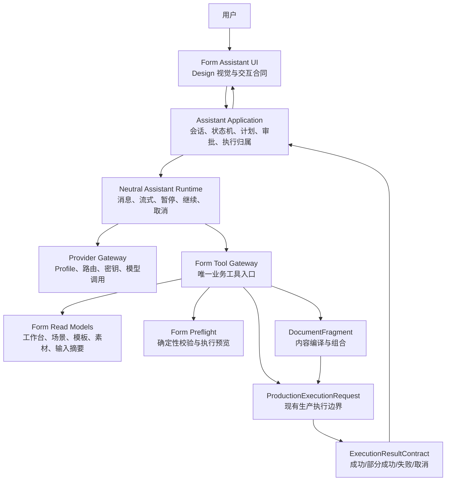
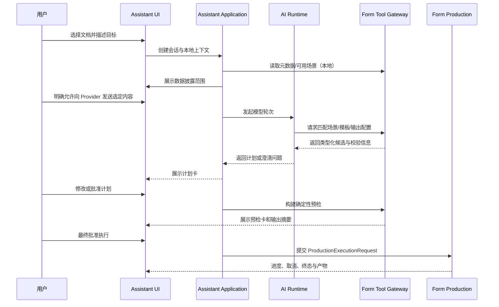
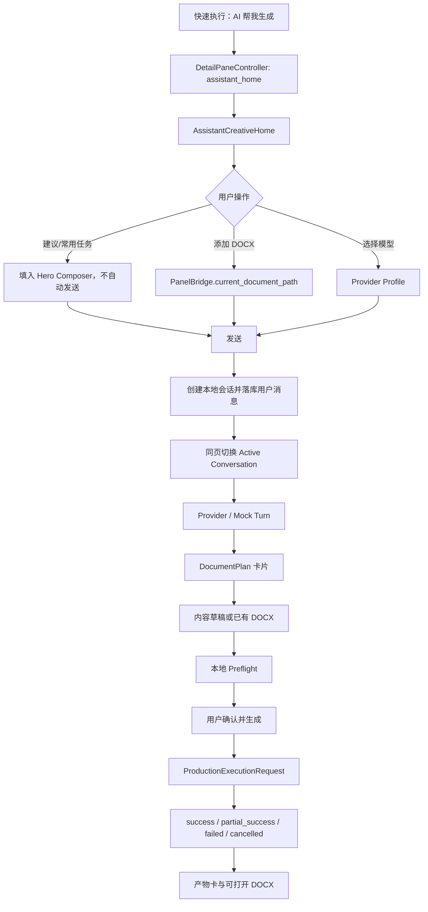
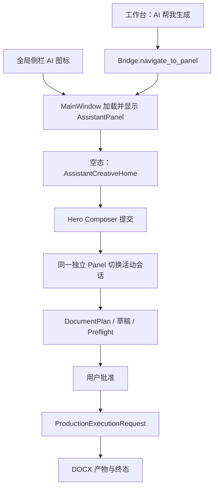
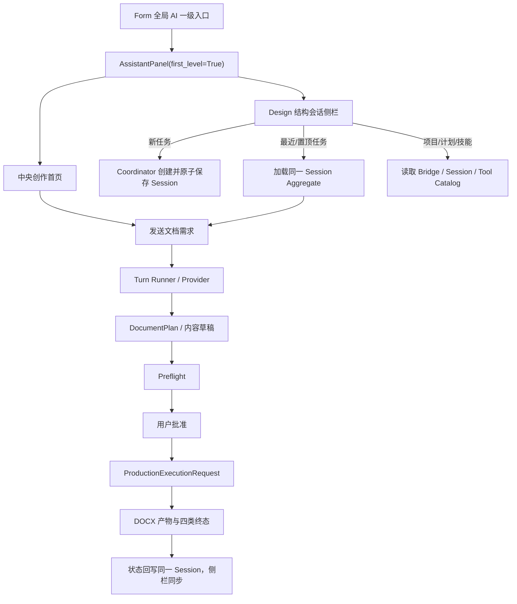
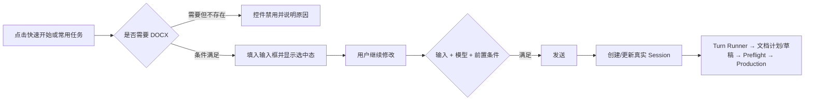
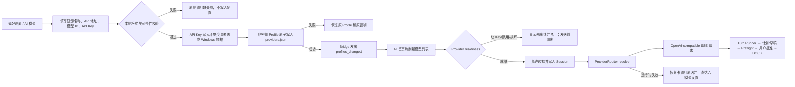
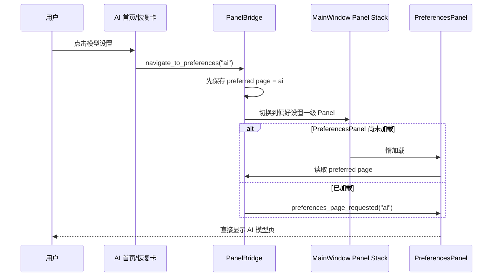
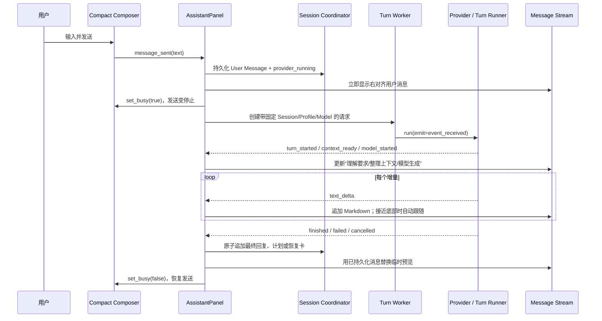

# Alavette Form AI 文档助手：Design UI 与 Flow 底层能力迁移深度分析

> 文档状态：方案已实施；2026-07-16 第三次纠偏为“Form 全局一级功能 + 独立 AssistantPanel，面板内部不迁移 Alavette 会话/上下文侧栏”；第 27 节覆盖第 7 节早期建议及第 25、26 节已废弃宿主。最终实现与验收证据见 `assistant_migration_implementation_2026-07-16.md`  
> 分析日期：2026-07-16  
> 目标产品：Alavette Form V1.0  
> 参考产品：Alavette Design、Alavette Flow  
> 本文范围：迁移分析、目标架构、实施拆分、风险与验收门禁；代码落地结果由独立实施记录承接

---

## 1. 结论先行

建议采用“**Design 定义体验、Flow 提供中立运行时、Form 保持业务主权**”的三源融合方案，而不是直接复制任一项目。

具体落地原则如下：

1. **UI 视觉和交互基线来自 Alavette Design**：保留其空态 Hero、会话区、消息流、输入器、附件、右侧上下文与结果预览等体验。
2. **实际 UI 代码优先以 Flow 后期模块化版本为载体**：Flow 的 Assistant UI 已经按照 Design 原版重新校准，同时将早期数千行大组件拆分为 Shell、会话栏、消息流、预览区等模块，迁移风险远低于直接复制 Design 原始大组件。
3. **底层只抽取 Flow 的中立能力**：会话、消息、流式事件、Provider 路由、密钥管理、取消、澄清问题、权限暂停、审批后续跑等可以迁移；ProjectOps、工作流任务、产品记忆、Flow Action、Flow Artifact 语义必须排除。
4. **所有文档生产仍由 Form 现有链路负责**：AI 只生成类型化意图、配置草稿、内容片段和工具调用请求，不直接写 OOXML，不直接操作 `python-docx`，也不绕过预检、审批和执行结果契约。
5. **把“AI 回答完成”和“文档生产完成”建成两套状态机**：模型成功回复不等于文档成功输出；生产结果必须继续使用 Form 的 `success / partial_success / failed / cancelled` 终态。
6. **第一阶段先做好“已有 DOCX 的 AI 编排与排版”**，第二阶段再开放“从需求/素材生成内容并输出 DOCX”。前者能够最大化复用当前 Form 能力，也最容易控制回归面。

最终目标不是把 Flow 嵌进 Form，而是在 Form 内形成一个边界清楚的 `assistant` 子系统：

```text
Design 体验规范
       ↓
Form Assistant UI / Application
       ↓
Flow 中立 Runtime + Provider 能力（抽取、改名、去业务化）
       ↓
Form Tool Gateway（唯一业务入口）
       ↓
Form 现有场景、模板、素材、预检、执行和结果系统
```

该方案在功能完整度、可维护性和不引入新问题之间最平衡。

---

## 2. 背景与问题定义

Alavette Form 当前是本地优先、场景驱动的文档处理工作台，已经具备：

- 工作模式与自然语言场景路由；
- 场景、模板、素材、主题和输出配置；
- 输入文档预检、不可变快照、执行进度与取消；
- 成功、部分成功、失败、取消的统一结果；
- 类型化内容素材与 DOCX 组合能力；
- AI 模板编写的半人工导出/导入契约。

缺少的并不是一条新的文档渲染引擎，而是一个能够把用户意图转换为现有能力调用的交互层：

- 用户用自然语言说明要做什么；
- AI 理解上下文并提出最少的澄清问题；
- AI 给出可审阅的执行计划；
- 用户明确授权数据传输和文件生产；
- 系统调用 Form 的确定性能力完成输出；
- AI 解释结果、失败原因和下一步操作。

因此，这次迁移的核心应是“**对话式编排层**”，不是“把一个聊天框接到大模型”。

---

## 3. 目标、非目标与成功标准

### 3.1 目标

1. 在 Form 中提供原生、一致的 AI 文档助手入口。
2. 复用 Design 成熟的对话 UI 与交互语言。
3. 复用 Flow 经验证的会话、运行时、Provider 和暂停恢复能力。
4. 让 AI 能够安全调用 Form 的场景、模板、素材、内容片段和文档生产能力。
5. 保持本地优先、输入不可变、显式授权、结果可审计等现有产品原则。
6. 在 800×540 最小窗口和常见缩放比例下保持可用。
7. 保持现有非 AI 工作流完全可用，AI 功能可以独立关闭或回退。

### 3.2 非目标

本次不应顺带引入以下能力：

- Flow 的 ProjectOps、工作流 Job、Action、产品记忆或业务实体；
- AI 自动发布、分享、发送邮件或上传第三方空间；
- AI 绕过用户确认直接覆盖原文件或现有输出；
- 模型直接生成或修改 OOXML/DOCX 压缩包；
- 用新的在线后端替换 Form 的本地生产引擎；
- 迁移 Flow 的完整桌面 UI、完整依赖树或完整测试树；
- 在 MVP 中引入 QtWebEngine、QtPdf、MathJax 等非必要依赖。

### 3.3 可衡量的成功标准

- 未经明确授权，不向 Provider 发送正文、图片或素材内容。
- 输入文档哈希在一次 AI 任务前后保持不变。
- 所有实际文档输出都经过 Form 预检与 `ProductionExecutionRequest`。
- AI 会话可以重启恢复，执行中的任务不会因切换会话丢失归属。
- Provider 失败、取消、权限等待、澄清等待均有明确 UI 终态或等待态。
- API Key 不进入会话文件、日志、问题报告和导出文档。
- 关闭 AI 功能后，现有工作台测试和生产路径行为不变。
- 打包产物不依赖本机的 Alavette Flow 或 Alavette Design 目录。

---

## 4. 当前代码与参考项目审计摘要

### 4.1 Alavette Form 当前可直接复用的能力

| 能力 | 当前承载 | 迁移后的角色 |
|---|---|---|
| UI 状态与页面导航 | [`src/ui/bridge.py`](../../src/ui/bridge.py) | 只由 Assistant Application 通过明确命令读取或更新，模型不得直接访问 |
| 面板注册 | [`src/ui/panel_registry.py`](../../src/ui/panel_registry.py) | 注册 `assistant` 独立一级面板；Provider 配置仍由偏好设置承载 |
| 自然语言场景路由 | [`src/config/scene_natural_request_router.py`](../../src/config/scene_natural_request_router.py) | 作为 AI 之前或 AI 之后的确定性路由工具 |
| 生产执行边界 | [`src/services/production_execution.py`](../../src/services/production_execution.py) | AI 生产动作的唯一提交入口 |
| 执行结果契约 | [`src/services/execution_result_contract.py`](../../src/services/execution_result_contract.py) | 文档任务终态和产物展示的权威来源 |
| 类型化内容 | [`src/config/content_materials.py`](../../src/config/content_materials.py) | 模型内容输出的目标结构，而不是 OOXML |
| 内容编译与组合 | `src/services/material_content/` | 将类型化内容转换为现有生产链路可消费的输入 |
| AI 模板编写契约 | [`src/config/template_authoring_contract.py`](../../src/config/template_authoring_contract.py) | 复用哈希、指纹、严格 JSON、导入验证的安全设计 |
| 主题与基础控件 | `src/shared/ui/` | 复用 Form 主题，建立 Design Token 适配层 |

现有架构测试禁止非 UI 层导入 `src.ui`，也限制低层模块反向依赖 `src.services`。新 Assistant 子系统必须沿用这一规则，不应为了迁移 Flow 而打破现有分层。

### 4.2 Alavette Design 的可迁移价值

Design 最有价值的是“产品交互合同”，包括：

- 空会话的 Hero 输入体验；
- 活跃会话的紧凑输入器；
- 会话列表、消息流、附件与右侧上下文区的关系；
- 计划、进度、产物和恢复操作在对话中的呈现；
- Provider 设置和模型选择的交互方式。

但是 Design 原始 `conversation_panel.py`、`task_workspace.py`、`task_composer.py`、`task_message_stream.py` 体积很大，并直接依赖 Flow/ProjectOps 业务类型。它们不适合原文件复制，只适合用作视觉、结构和行为参照。

### 4.3 Alavette Flow 的可迁移价值

Flow 后期已经把 Assistant UI 拆成更清晰的模块，并重新以 Design 原版校准视觉几何。更重要的是，Flow 已经具备一套较成熟的中立 AI 运行能力：

- 类型化 Assistant Runtime Result；
- Provider 启动、流式事件、失败、取消；
- 用户澄清问题的暂停和继续；
- 工具权限申请的暂停和继续；
- 工作流审批的暂停和继续；
- 会话存储、草稿、固定、搜索和导航投影；
- Provider Profile、路由、密钥存储和运行时解析。

Flow 的问题在于业务层远大于 Form 所需范围。完整迁移会带入 ProjectOps、Action、Workflow、Memory、Skills、Artifact 等语义，同时其运行环境偏向 Python 3.11、完整 PySide6 6.7；Form 当前是 Python 3.10 与 `PySide6_Essentials>=6.6.0`。因此只能按合同抽取，不能整体依赖。

### 4.4 当前工作区风险

审计时工作区存在大量未提交状态（快照约 791 项）。正式实施前必须先做基线确认：

1. 明确哪些是用户现有改动；
2. 建立可回退的提交或分支；
3. 记录当前测试基线；
4. 后续每一阶段只改动明确列出的文件。

如果跳过这一步，任何 AI 迁移回归都难以和原有工作区变化区分。

---

## 5. 方案比较与选择

| 方案 | 优点 | 主要问题 | 结论 |
|---|---|---|---|
| 直接复制 Design 全部对话 UI | 视觉还原最快 | 大组件、Flow 业务耦合、难测试、难升级 | 否决 |
| 直接把 Flow 作为本地依赖 | 能力看似完整 | Python/Qt 版本冲突、包体膨胀、业务泄漏、部署依赖外部目录 | 否决 |
| 完整复制 Flow Assistant 目录 | 避免外部依赖 | 仍会复制大量 ProjectOps/Artifact/Workflow 语义，维护面过大 | 否决 |
| 从零重写 AI 全栈 | 表面最干净 | 会重新踩会话恢复、流式取消、权限续跑、Provider 路由等问题 | 不推荐 |
| **合同驱动的选择性抽取** | 兼顾成熟能力和 Form 边界，可逐步验证 | 需要前期梳理合同和适配器 | **推荐** |

推荐方案不是机械地“拷哪些文件”，而是按下面的顺序迁移：

1. 冻结 Form 业务合同；
2. 定义 Assistant 自己的中立合同；
3. 抽取 Flow 中实现这些合同所需的最小代码；
4. 用 Form Tool Gateway 消化所有业务差异；
5. 用 Design 交互基线重构 UI，而不是继续携带 Flow 业务名词。

---

## 6. 目标架构



### 6.1 各层所有权

| 层 | 应该负责 | 不应该负责 |
|---|---|---|
| Assistant UI | 展示、输入、选择、确认、响应式布局 | 直接调用 Provider、写配置、执行 DOCX |
| Assistant Application | 会话、状态、计划、权限流程、执行归属 | 文档格式细节、Provider SDK 细节 |
| Neutral Runtime | 消息、模型轮次、工具调度、暂停继续、取消 | Form 业务事实、最终文档所有权 |
| Provider Gateway | 模型解析、请求、流式事件、健康与密钥 | 决定是否可上传、决定业务动作是否合法 |
| Form Tool Gateway | 权限判定、参数校验、调用现有服务、结果转换 | 自建第二套生产逻辑 |
| Form Domain/Services | 场景、模板、素材、预检、生产、结果 | 聊天会话和模型协议 |

### 6.2 最关键的边界规则

1. Runtime 不导入 `src.ui`。
2. Provider 层不导入 Form 的 scene/template/production 类型。
3. Assistant UI 不直接导入 Provider SDK。
4. 模型不持有 `PanelBridge`、Qt Widget 或 `python-docx` 对象。
5. 所有 Qt 状态更新回到主线程执行。
6. 所有持久写和文档生产必须经过显式工具、权限策略和预检。
7. 所有业务结果都转换成 Assistant 合同后再进入会话，不把内部异常对象直接展示给用户。

---

## 7. UI 与交互迁移设计

### 7.1 产品入口

建议设置两个入口：

1. 在主侧边栏“工作台”之后增加 **AI 文档助手**；
2. 在工作台关键操作区增加 **AI 帮我生成/排版** 快捷按钮，打开 Assistant 并带入当前工作台上下文。

Provider、模型、密钥、隐私默认值放在“偏好设置 > AI”，不作为主侧边栏一级页面。用户的主要心智是完成文档，而不是管理模型。

### 7.2 页面结构

宽屏布局建议：

| 区域 | 标准宽度 | 作用 |
|---|---:|---|
| 会话栏 | 240dp | 新建、搜索、固定、重命名、删除、任务状态 |
| 中央对话区 | 自适应 | 空态 Hero、消息流、问题/计划/审批/结果卡片、输入器 |
| 上下文栏 | 280dp | 当前输入、附件、素材、模板、来源、输出和产物 |

响应式规则：

- 宽屏：三栏常驻；
- 中等宽度：右侧上下文收起为 Drawer；
- 小于约 900px：会话栏和上下文栏都改为 Drawer，中央对话区独占；
- 800×540 最小窗口下，不允许操作按钮被裁剪，主输入器始终可达；
- 100%、150%、175% 缩放分别做视觉验收，不能只按像素截图判断。

### 7.3 空态与活跃态

**空态**采用 Design 的 Hero Composer：

- 标题：例如“描述你想完成的文档”；
- 输入框是视觉焦点；
- 快捷意图应替换为 Form 语义，例如：
  - “统一这份文档的标题和正文格式”；
  - “根据素材生成一份项目汇报”；
  - “套用现有模板并输出正式版”；
  - “检查排版问题并给出修复计划”。

**活跃态**改为底部紧凑 Composer：

- 保留附件、停止、发送、模型入口；
- 会话主轴只由 Shell 控制宽度，消息卡片不各自计算主宽度；
- 当前待回答问题必须在消息流中展开，不能隐藏到设置页；
- 一次只展开当前问题，选项超过两项时不要强行多列；
- 长中文、长路径、长模板名必须换行或省略并提供完整提示。

### 7.4 消息流中的业务卡片

不要把所有状态都降级成普通 Markdown 文本。建议建立这些类型化卡片：

| 卡片 | 用途 | 主操作 |
|---|---|---|
| 澄清问题卡 | 补充文档类型、受众、格式、缺失素材 | 选择/填写/继续 |
| 数据披露卡 | 告知将发送给哪个 Provider 的哪些数据 | 允许一次/拒绝/修改范围 |
| 工具权限卡 | 请求读取全文、写配置或执行生产 | 允许一次/本会话允许/拒绝 |
| 生成计划卡 | 展示 AI 将如何选择场景、模板、素材和输出 | 修改/批准 |
| 预检卡 | 展示确定性校验结果和风险 | 修复/返回/继续 |
| 执行审批卡 | 最后确认输出目录、文件数量、覆盖策略 | 开始执行 |
| 进度卡 | 显示生产阶段、进度、当前文件、取消入口 | 取消/后台继续 |
| 产物卡 | 成功、部分成功、失败、文件链接和失败项 | 打开/重试/查看详情 |
| 恢复卡 | Provider、网络、权限、文件锁等恢复操作 | 重试/换模型/更换目录 |

### 7.5 上下文栏信息分组

右侧上下文栏只展示当前会话真正影响任务的内容：

- 当前输入文档及其哈希/更新时间；
- 已选择的场景、模板和主题；
- 用户附加的素材和图片；
- AI 引用的来源；
- 输出目录、命名与覆盖策略；
- 已生成产物。

“选中附件”与“授权上传附件”必须是两个不同状态。附件进入会话并不自动意味着它可以发送给云端模型。

### 7.6 主题适配策略

Design 与 Form 的基础控件存在部分同名但实现并不一致。建议：

1. 使用 Form 当前主题系统作为唯一 Token 来源；
2. 建立小型 `AssistantDesignTokens` 适配层，把 Design 中的间距、圆角、焦点色、消息背景映射到 Form Token；
3. 只移植组件结构和状态，不覆盖全局 Palette、字体或 StyleSheet；
4. 新控件优先组合 `src/shared/ui/` 中现有基础控件；
5. 避免把 Flow/Design 的应用级样式表复制进来。

这可以显著降低主题污染、控件状态冲突和高 DPI 回归。

---

## 8. 两条核心用户流程

### 8.1 流程 A：对已有 DOCX 进行 AI 编排和排版（MVP）



这里 AI 的价值是选路、解释、补全配置和降低操作成本；最终排版仍由 Form 现有能力完成。

### 8.2 流程 B：从需求与素材生成文档（第二阶段）

1. 用户描述目标文档并添加素材；
2. AI 先生成结构化大纲；
3. 用户确认大纲、受众、语气和篇幅；
4. AI 输出类型化 `DocumentFragment`，例如 HeadingBlock、ParagraphBlock、ListBlock、TableBlock、ImageBlock；
5. 本地验证器检查结构、长度、引用、图片和表格约束；
6. Content Compiler/Composer 将片段转换成生产输入；
7. Form 再执行模板、主题、输出和结果流程。

严格禁止“模型输出 base64 DOCX/OOXML，然后直接落盘”。这会绕开结构验证、安全检查、可编辑性和 Form 的格式主权。

---

## 9. 双状态机设计

### 9.1 为什么必须分开

Flow 的 Assistant Runtime 关注一次模型轮次是否启动、等待权限、等待问题、失败或完成；Form 的生产执行关注文档是否预检通过、是否获得执行批准、是否输出成功。两者可以并行或先后发生，不能用一个 `status` 字段混在一起。

### 9.2 Assistant Turn 状态机

```text
idle
  -> context_ready
  -> provider_running
      -> waiting_user_question -> provider_running
      -> waiting_data_permission -> provider_running
      -> waiting_tool_permission -> provider_running
      -> blocked
      -> failed
      -> cancelled
      -> completed
```

建议保留 Flow 已验证的 started/context_ready/provider_started/waiting/blocked/failed/cancelled/completed 语义，但对外统一成 Form 命名，并去除 ProjectOps/Workflow 专属字段。

### 9.3 Document Job 状态机

```text
draft
  -> resolving_context
  -> plan_ready
  -> preflight_running
      -> preflight_failed -> plan_ready
      -> needs_execution_approval
  -> execution_queued
  -> execution_running
      -> success
      -> partial_success
      -> failed
      -> cancelled
```

如果当前模型轮次需要权限或问题，Document Job 可以停留在 `resolving_context` 或 `plan_ready`，而不是伪装成执行中。

### 9.4 状态组合示例

| Assistant Turn | Document Job | UI 含义 |
|---|---|---|
| `provider_running` | `resolving_context` | AI 正在分析需求 |
| `waiting_user_question` | `resolving_context` | 等待用户补充信息 |
| `completed` | `plan_ready` | AI 计划已完成，但文档尚未执行 |
| `completed` | `execution_running` | 对话轮次结束，Form 正在本地生产 |
| `failed` | `draft` | 模型失败，尚未影响文档 |
| `completed` | `partial_success` | AI 正常，文档只有部分产物成功 |

---

## 10. 核心数据合同

下面字段是建议的边界合同，不要求照搬 Flow 的类名。

### 10.1 AssistantTurnRequest

```text
turn_id
session_id
user_message
provider_profile_id
model_id
local_context_refs[]
disclosure_grant_id?
conversation_cursor?
```

请求只携带本次明确选择的上下文引用。读取全文和向 Provider 展开内容必须由 Data Disclosure 层完成。

### 10.2 AssistantRuntimeResult

```text
status
visible_text
source_refs[]
proposed_actions[]
confirmation_requests[]
artifacts[]
process_steps[]
tool_audit[]
provider_audit
citation_audit[]
public_reasoning_summary?
continuation_ref?
error?
```

需要继承 Flow 的一个重要约束：Runtime Result 不写产品事实。它描述模型和工具发生了什么，但不能把模型输出直接当成 Form 的权威场景、模板或生产结果。

### 10.3 DocumentPlan

```text
plan_id
revision
intent
input_document_ref?
work_mode_id
scene_ref?
template_ref?
theme_ref?
material_refs[]
content_fragment_refs[]
output_policy
warnings[]
unresolved_questions[]
created_by_turn_id
```

每次用户或 AI 修改计划都增加 `revision`，预检和批准必须绑定具体 revision，避免用户批准 A 后系统执行 B。

### 10.4 DisclosureGrant

```text
grant_id
session_id
provider_id
model_id
allowed_refs[]
allowed_fields[]
text_character_count
image_count
created_at
expires_at?
scope = once | session
```

如果 Provider、模型、文件哈希或发送字段改变，旧授权不得静默复用。

### 10.5 ExecutionApproval

```text
approval_id
session_id
plan_id
plan_revision
preflight_hash
input_hash
output_root
overwrite_policy
approved_at
```

生产执行前重新验证这些值。任一关键值变化，都应回到审批卡而不是继续执行。

### 10.6 AssistantArtifactRef

```text
artifact_id
kind
display_name
local_path_ref?
mime_type?
origin = model | tool | production
execution_result_ref?
integrity_hash?
```

Assistant 的 Artifact 只是引用。文档产物的真实性和终态仍由 `ExecutionResultContract` 决定。

---

## 11. Form Tool Gateway 设计

### 11.1 工具分级

| 等级 | 行为 | 例子 | 默认策略 |
|---|---|---|---|
| L0 | 读取本地非敏感元数据 | 列出工作模式、场景名称 | 可自动 |
| L1 | 读取本地正文或完整素材 | 解析 DOCX 全文、读取图片 | 明确展示用途，按策略授权 |
| L2 | 向云端 Provider 发送内容 | 发送正文、图片、素材字段 | 必须显式数据披露授权 |
| L3 | 修改会话内草稿 | 修改计划、生成内容片段 | 可撤销，保留修订 |
| L4 | 持久化业务配置 | 保存模板、修改工作区配置 | 必须确认 |
| L5 | 生成/覆盖文件 | 运行生产、重试输出 | 预检后最终确认 |
| L6 | 外部发布或分享 | 上传、发送邮件、发布 | V1 不支持 |

### 11.2 第一批只读工具

- `get_current_workspace_state`
- `inspect_input_document`
- `list_work_modes`
- `match_scene_request`
- `list_scene_candidates`
- `list_template_candidates`
- `list_material_candidates`
- `list_output_presets`
- `build_preflight_preview`
- `get_execution_result`

只读工具也不能返回无界数据。应返回适合模型消费的摘要、稳定 ID、版本和可选字段，而不是序列化整个 Qt/配置对象。

### 11.3 会话草稿工具

- `select_work_mode_draft`
- `bind_scene_draft`
- `bind_template_draft`
- `bind_materials_draft`
- `set_output_policy_draft`
- `draft_document_outline`
- `generate_document_fragments`
- `update_document_fragment`

这些工具只更新 `DocumentPlan` 草稿，不立即修改全局工作台。

### 11.4 需要确认的工具

- `apply_plan_to_workspace`
- `save_template_configuration`
- `run_document_production`
- `retry_file_production`
- `replace_existing_output`

每个工具都必须具备：

- 稳定工具名和 schema 版本；
- 输入参数验证；
- 风险等级；
- 幂等键或重复调用保护；
- 取消支持；
- 审计摘要；
- 类型化成功/失败结果；
- 不向模型暴露完整本地绝对路径的脱敏策略。

### 11.5 禁止提供给模型的工具

- 任意 Shell/PowerShell 执行；
- 任意文件系统读写；
- 任意 Python 代码执行；
- 直接修改 OOXML；
- 直接访问 `PanelBridge` 属性；
- 直接修改场景/模板目录中的文件；
- 无范围的“搜索整个电脑”。

AI 工具必须是窄接口、白名单和类型化的。

---

## 12. Provider、隐私与密钥策略

### 12.1 Provider 迁移范围

可以从 Flow 抽取：

- Provider Profile schema；
- OpenAI-compatible/Anthropic-native 等中立适配器；
- 模型路由与运行时解析；
- 流式文本和取消事件；
- 健康检查、错误归一化、重试建议；
- Secret Store 接口及 Windows Keyring 实现。

不应迁移：

- Flow 产品默认 Provider 选择；
- Flow 项目级 Profile 查找规则；
- 绑定 ProjectOps 身份的模型路由；
- 把环境变量或明文配置作为默认密钥存储的行为。

### 12.2 数据披露清单

每次首次发送敏感上下文前，UI 应展示：

- Provider 与模型；
- 将发送的文档/素材名称；
- 正文字符数；
- 图片数量；
- 具体字段，例如标题、正文、表格、批注；
- 是仅本次允许还是本会话允许；
- 拒绝后仍可使用哪些本地能力。

“文件已添加到上下文”不等于“同意上传”。

### 12.3 密钥存储

推荐顺序：

1. Windows Credential Manager/Keyring；
2. 受控环境变量，适合企业部署；
3. 明文文件只作为显式开发模式，并显示风险警告。

密钥不得出现在：

- 会话 JSON/SQLite；
- 日志；
- 崩溃报告；
- Provider 请求摘要；
- 复制到剪贴板的诊断信息；
- 文档元数据。

### 12.4 日志与审计

默认日志只记录：

- session/turn/tool 的短 ID；
- Provider/模型标识；
- 状态迁移；
- 耗时、字符数、图片数；
- 错误类别和可公开摘要；
- 权限是否授予，不记录授权内容正文。

完整 Prompt、正文、绝对路径和 Secret 均不应默认记录。

---

## 13. 会话、存储、并发与恢复

### 13.1 存储位置

Form 已有 `.alavette_form` / `Alavette-Form` 命名约定。建议新增统一存储定位器：

```text
%LOCALAPPDATA%/Alavette-Form/assistant/
  sessions/
  indexes/
  drafts/
  continuations/
  cache/
```

如果 `LOCALAPPDATA` 不可用，再回退到：

```text
~/.alavette_form/assistant/
```

不要把会话数据放入项目根的 `config_library`，也不要运行时共享或实时读取 `.alavette-flow`。

### 13.2 会话存储合同

每个会话至少保存：

- schema version；
- session ID、标题、创建/更新时间；
- 消息和类型化卡片引用；
- 当前 DocumentPlan revision；
- 待恢复 continuation；
- 关联的执行任务 ID；
- 附件引用、哈希和披露状态；
- 当前 Provider Profile 的引用，不保存 Secret。

写入应使用临时文件 + 原子替换，或小型 SQLite 事务。崩溃后不能留下“半条消息却已执行工具”的不一致状态。

### 13.3 会话迁移

如果未来希望导入 Flow Provider Profile，应做一次性、显式、版本化导入：

- 只导入中立 Provider 配置；
- Secret 重新绑定或由 Keyring 迁移；
- 不导入 Flow 会话、任务、记忆和工作流；
- 导入完成后 Form 使用自己的副本。

### 13.4 执行租约

当前 Form 工作台本质上只有一个活动执行 Worker。Assistant 必须建立全局 `ExecutionLease`：

- 同一时刻只允许一个文件生产任务拥有租约；
- 用户切换会话时，执行继续，并保持归属原会话；
- 会话栏显示运行、等待、完成和失败状态；
- 第二个任务进入队列或明确提示冲突，不静默替换当前 Worker；
- 取消必须针对 execution ID，不能使用“当前会话”猜测。

### 13.5 恢复规则

- Provider 流中断：保留已显示内容，但标记不完整，允许重试或换模型；
- 等待权限/问题：保存 continuation ref，重启后恢复卡片；
- 执行中崩溃：启动时询问生产服务的真实状态，不能仅依赖会话记录；
- 输出成功但 UI 未收到事件：通过 execution ID 对账并补建产物卡；
- 输入文件哈希变化：旧计划失效，重新预检和审批。

---

## 14. 迁移矩阵

### 14.1 分级定义

| 级别 | 含义 |
|---|---|
| A | 可按中立合同最小抽取，改名和依赖整理后迁入 |
| B | 可复用实现思路或主体代码，但必须适配 Form 合同 |
| C | 仅作为视觉/行为/测试参考，不复制主体代码 |
| D | 禁止进入 MVP |

### 14.2 Alavette Design

| 来源模块 | 级别 | 处理方式 |
|---|---|---|
| 原始 Conversation Panel | C | 提取布局、空态、活跃态和焦点行为；不复制大组件 |
| Task Workspace | C | 参考三区结构和响应式行为，移除 Task/ProjectOps 语义 |
| Task Composer | C/B | 参考输入器行为；用 Form 控件重新组合 |
| Task Message Stream | C | 参考消息宽度、卡片和滚动行为；重建类型化卡片 |
| Provider Settings 视觉 | C/B | 保留信息架构，用 Form Preference 页面承载 |
| 全局 Theme/Palette | D | 禁止覆盖 Form 全局主题 |
| ProjectOps 文案与快捷项 | D | 替换为文档生成/排版语义 |

### 14.3 Alavette Flow

| 来源模块 | 级别 | 处理方式 |
|---|---|---|
| `assistant_shell_widgets` | B | 作为 Design 视觉实现载体，重写 imports 和业务事件 |
| `assistant_global_shell` | B | 保留宽度所有权、折叠和主结构 |
| `assistant_session_rail` | B | 保留会话导航交互，对接 Form Session Store |
| `assistant_conversation_stream` | B | 保留消息投影机制，替换内容类型 |
| `assistant_preview_panel` | B | 改为 Form 上下文/产物栏，删除 Flow Artifact 语义 |
| Assistant Kernel result/event/cancel | A/B | 抽取中立合同与状态迁移测试 |
| Turn Runner | B | 去掉 ProjectOps context/action，接 Tool Gateway |
| Session Coordinator/Store | B | 更换存储路径、schema 与执行归属 |
| Assistant UI ViewModel/Navigation | B | 保留单一会话真相源原则 |
| Tool Runtime/Permission Contract | A/B | 保留暂停续跑与审计，重建风险等级 |
| Provider Profiles/Secrets/Routing | A/B | 抽取最小 Provider 能力，适配 Python/Qt 版本 |
| Flow Actions/Workflow Jobs | D | 不迁移 |
| Product Memory/Skills | D | 不迁移 |
| ProjectOps Tools/Context | D | 不迁移 |
| Flow Artifact 所有权 | D/B | 只保留中立引用结构，Form 结果合同拥有最终产物 |
| QtPdf/QtWebEngine/MathJax 预览 | D | MVP 使用 Form 现有预览和 Markdown 能力 |

### 14.4 Alavette Form

| 当前模块 | 策略 |
|---|---|
| PanelBridge | 保持 UI 边界，只通过 Assistant Application 命令交互 |
| Scene Natural Request Router | 直接复用为确定性工具，AI 负责解释歧义而非替代路由 |
| Production Execution | 原样保留为唯一执行入口，可增加 Assistant Adapter |
| Execution Result Contract | 原样保留终态并映射为产物卡 |
| Content Materials | 作为模型生成内容的类型化边界 |
| Material Compiler/Composer | 第二阶段用于“从素材生成文档” |
| Template Authoring Contract | 复用严格 schema、hash 和 fingerprint 设计 |
| Shared UI/Theme | 优先组合和适配，不建立第二套全局主题 |

---

## 15. 建议的目标目录

```text
src/assistant/
  contracts/
    messages.py
    runtime_result.py
    document_plan.py
    permissions.py
    artifacts.py
  application/
    session_coordinator.py
    turn_controller.py
    document_job_controller.py
    execution_lease.py
  runtime/
    turn_runner.py
    continuation_store.py
    model_gateway/
    providers/
  tools/
    registry.py
    policy.py
    read_tools.py
    draft_tools.py
    production_tools.py
  adapters/
    workspace_state_adapter.py
    scene_router_adapter.py
    material_adapter.py
    production_adapter.py
    result_adapter.py
  storage/
    paths.py
    session_store.py
    schema_migrations.py
  ui/
    assistant_panel.py
    shell.py
    session_rail.py
    conversation_stream.py
    composer.py
    context_panel.py
    cards/
  tests/
```

如果项目希望继续严格执行“非 UI 层不得导入 `src.ui`”，可以将 `src/assistant/ui` 视作 UI 层并把规则扩充为：

- `src/assistant/contracts|runtime|storage|tools` 不得导入 `src.ui` 或 `src.assistant.ui`；
- `src/assistant/runtime/providers` 不得导入 `src.services`；
- 只有 `src/assistant/adapters` 可以面向 Form Services；
- UI 只能面向 Application/Contracts，不能直连 Adapters。

这种端口/适配器结构能阻止 Flow 业务依赖在后续开发中重新渗入。

---

## 16. 兼容性、依赖与许可证

### 16.1 Python 与 PySide6

迁移基线应以 Form 为准：Python 3.10、`PySide6_Essentials>=6.6.0`。从 Flow 抽取代码时：

- 不使用 Python 3.11 专属语法或标准库行为；
- 不假设完整 `PySide6` 已安装；
- 不直接使用 `QtPdf`、`QtWebEngineCore` 或其他 Essentials 之外模块；
- 所有可选 Provider SDK 都应延迟导入并给出可理解的缺失提示；
- UI 信号连接、线程取消和对象销毁在 PySide6 6.6 上做验证。

### 16.2 Markdown、公式和预览

MVP 复用 Form 当前 `markdown-it-py`、QTextDocument/现有 Markdown Preview 和 `pypdfium2`。公式可以先显示为代码或纯文本，不应为了公式渲染立刻引入 QtWebEngine 与 MathJax。

### 16.3 Provider SDK

优先保留 HTTP/协议适配的窄接口。若 SDK 增加依赖，应满足：

- 可选依赖，不影响无 AI 模式启动；
- 打包可控；
- 版本锁定和超时明确；
- 代理、证书、取消、流式行为有测试；
- SDK 异常统一转换为 Provider Error，不泄漏内部栈到 UI。

### 16.4 许可证与来源记录

Design 和 Flow 为 MIT 时，复制或改编的文件仍应：

- 保留适当版权和许可证声明；
- 在迁移文件头或 `THIRD_PARTY_NOTICES` 中记录来源文件与版本/提交；
- 记录实质性修改；
- 不复制未确认授权的图标、字体或第三方 vendor 资产；
- 不在 MVP 中携带无使用价值的大型第三方资源。

---

## 17. 错误、进度和结果映射

### 17.1 错误分类

| 分类 | 示例 | UI 处理 |
|---|---|---|
| Provider 配置 | 未设置 Key、模型不存在 | 打开 AI 设置，保留草稿 |
| Provider 网络 | 超时、限流、服务不可用 | 重试/换模型，不影响文档 |
| 数据权限 | 用户拒绝正文上传 | 提供仅本地能力或缩小范围 |
| 工具参数 | 模型给出无效场景/模板 ID | 工具返回结构化校验错误，让模型修正 |
| 预检失败 | 模板缺失、输出不可写 | 回到计划/输出设置 |
| 执行失败 | 文件锁、单文件失败 | 使用 Form 结果契约和失败项 |
| 取消 | 用户停止模型或生产 | 分别取消 turn 或 execution |
| 恢复失败 | continuation schema 过期 | 保留消息，提示重新发起 |

### 17.2 进度来源

进度必须标注来源：

- AI 分析进度：来自 Runtime Event，只能表达阶段，不能伪造百分比；
- 工具进度：来自工具本身；
- 文档生产进度：来自现有 Production Execution；
- 文件产物状态：来自 Execution Result Contract。

不要用模型文本“已完成”驱动进度条，也不要让模型猜测文件是否落盘。

### 17.3 部分成功

`partial_success` 不能被包装成普通成功。产物卡应分别展示：

- 已成功文件；
- 失败文件及可公开原因；
- 是否可以只重试失败项；
- 重试是否会覆盖已有成功产物。

---

## 18. 分阶段实施计划

### Phase 0：冻结边界与建立基线（2–3 人日）

- 清点并隔离当前工作区改动；
- 跑现有架构、生产、场景、模板和内容测试；
- 记录 Python/PySide6/打包基线；
- 锁定迁移来源文件和许可证信息；
- 建立“禁止迁移清单”。

**门禁**：无法解释当前测试失败或工作区差异时，不进入 Phase 1。

### Phase 1：合同与 Mock UI（4–6 人日）

- 定义 AssistantTurn、RuntimeResult、DocumentPlan、Permission、ArtifactRef；
- 建立 Assistant Panel、Shell、会话栏、消息流和上下文栏；
- 用 Mock Runtime 演示问题、计划、审批、进度和结果卡；
- 验证三种窗口宽度与三种缩放比例。

**门禁**：UI 不依赖 Flow/ProjectOps 类型；无 Provider 也能完整运行 Mock 流程。

### Phase 2：中立 Runtime 与 Provider（5–7 人日）

- 抽取 Turn Runner、类型化事件、取消和 continuation；
- 抽取 Provider Profile、Secret Store、Router；
- 接入一个 OpenAI-compatible Provider 和 Mock Provider；
- 建立数据披露清单和日志脱敏。

**门禁**：断网、限流、取消、等待问题、等待权限和重启恢复全部通过测试。

### Phase 3：Form Tool Gateway 与已有 DOCX MVP（7–10 人日）

- 建立只读、草稿、确认三类工具；
- 复用自然语言场景路由；
- 生成 DocumentPlan 并对接现有工作台状态；
- 建立预检 hash、执行审批和生产 Adapter；
- 支持已有 DOCX 的 AI 配置与排版。

**门禁**：AI 不能绕过 `ProductionExecutionRequest`；输入哈希不变；拒绝授权时无网络正文请求。

### Phase 4：执行归属、结果和恢复（7–10 人日）

- 实现全局 Execution Lease；
- 会话切换时保持任务归属；
- 映射进度、取消和四类结果终态；
- 支持部分成功、失败项重试和启动恢复。

**门禁**：切换/删除/重命名会话不会取消或串错执行任务。

### Phase 5：从素材生成内容（7–12 人日）

- AI 生成大纲和 `DocumentFragment`；
- 建立结构、引用、图片、表格和长度验证；
- 对接 Content Compiler/Composer；
- 增加内容局部修改与重新生成。

**门禁**：任何模型内容都必须经过 schema 校验；没有直接 OOXML 路径。

### Phase 6：包装、隐私与回归（5–8 人日）

- PyInstaller/安装包测试；
- 无 AI 依赖模式测试；
- Keyring、日志、崩溃恢复与数据清理测试；
- 完整回归、性能和 UI 视觉验收；
- 更新第三方声明和用户隐私说明。

### 粗略投入

- 已有 DOCX 的 AI 编排 MVP：约 20–30 人日；
- 加上从需求/素材生成完整文档：约 30–45 人日；
- 若同时支持多个 Provider、企业代理和复杂图片理解，需另行增加范围。

---

## 19. 测试矩阵与验收门禁

### 19.1 架构测试

- Assistant Contracts 不导入 Qt、UI、Services；
- Runtime 不导入 Form UI；
- Provider 不导入 Form 业务；
- UI 不导入 Provider SDK；
- 禁止出现 `alavette_flow` 运行时包依赖；
- 禁止 ProjectOps/Workflow Job/Action 类型进入 `src/assistant` 公共合同。

### 19.2 合同测试

- 所有 schema 有版本；
- 未知扩展字段的保留/拒绝策略明确；
- 旧会话迁移可回滚；
- Plan revision、input hash、preflight hash 不匹配时拒绝执行；
- Tool Result 能稳定序列化和恢复。

### 19.3 Provider 测试

- 无 Key、错误 Key、模型不存在；
- 超时、限流、流中断、服务端 5xx；
- 用户取消前/中/后；
- 换模型、换 Provider 后旧授权失效；
- 代理和证书失败；
- 日志中不存在 Key、正文、图片内容和完整路径。

### 19.4 权限测试

- 未授权时网络请求体不含正文；
- 拒绝后工具不会执行；
- “允许一次”不跨下一轮复用；
- “本会话允许”只对相同 Provider、模型和数据范围有效；
- 预检后计划改变必须重新审批；
- 覆盖已有输出必须单独确认。

### 19.5 会话与并发测试

- 新建、搜索、固定、重命名、删除；
- 草稿跨切换恢复；
- 执行时切换会话；
- 第二个执行任务的排队/冲突提示；
- 应用重启后恢复等待问题、权限和执行状态；
- 删除会话时不误删生产产物；
- 同一 continuation 不可重复消费。

### 19.6 文档生产测试

- 输入哈希不变；
- success/partial_success/failed/cancelled 全映射；
- 多文件输出和单文件失败；
- 文件锁、无写权限、磁盘空间不足；
- 用户取消时临时文件清理；
- 重试不会重复覆盖已成功文件，除非明确选择；
- 产物卡路径与真实 Result 一致。

### 19.7 UI 测试

- 800×540、1200×800、宽屏；
- 100%、150%、175% DPI；
- 长中文、长文件名、长模型名；
- 选项 1、2、3、6 项的布局；
- 键盘导航、焦点顺序、Enter/Shift+Enter；
- 流式输出时滚动锚点；
- Drawer 打开/关闭后焦点返回；
- 浅色、深色、高对比主题；
- 无 Provider 时设置引导不阻塞现有工作台。

### 19.8 打包与离线测试

- 目标机器没有 Design/Flow 源码仍可运行；
- 没有可选 Provider SDK 时 Form 正常启动；
- 离线时本地场景匹配、预检和非 AI 工作流可用；
- 不意外包含 QtWebEngine/QtPdf/MathJax；
- Keyring 能力不可用时给出安全降级而非明文静默保存。

---

## 20. 风险登记表

| 风险 | 概率 | 影响 | 预防/缓解 |
|---|---:|---:|---|
| 复制 Design 大组件带入 Flow 业务 | 高 | 高 | 只取视觉合同，采用模块化 Shell 重建 |
| Flow Runtime 隐含 ProjectOps 类型 | 高 | 高 | 先定义 Form 中立合同，再抽实现；架构测试禁词/禁依赖 |
| Python/Qt 版本不兼容 | 中 | 高 | 以 Form 3.10/Essentials 6.6 为基线，逐文件验证 |
| AI 绕过生产预检 | 中 | 极高 | Tool Gateway 唯一入口，执行审批绑定 hash/revision |
| 用户误以为附件必然不上传 | 中 | 高 | 独立数据披露状态和可视清单 |
| 会话状态与执行状态串线 | 中 | 高 | 双状态机、Execution Lease、稳定 execution ID |
| API Key 或正文进入日志 | 中 | 极高 | Secret Store、字段白名单、日志自动扫描测试 |
| UI 在最小窗口不可用 | 高 | 中 | 响应式 Drawer、早期 Mock UI 验收 |
| 新依赖导致包体/启动时间上涨 | 中 | 中 | 可选依赖、延迟导入、禁止 QtWebEngine MVP |
| AI 内容不稳定或结构损坏 | 高 | 高 | 只接受 DocumentFragment，schema + 本地编译验证 |
| 现有脏工作区掩盖回归 | 高 | 高 | Phase 0 基线、分支/提交、文件清单 |
| 迁移后无法追溯上游来源 | 中 | 中 | 来源清单、许可证、迁移注记和合同测试 |

---

## 21. 明确禁止的捷径

以下实现方式短期看似快，但会显著增加后续问题：

1. 在 Form 中 `import alavette_flow` 并依赖桌面上的 Flow 源码；
2. 将 Design 原始 Conversation Panel 整文件复制后逐个修 import；
3. 让模型直接调用 `python-docx` 或写 OOXML；
4. 发送附件时默认把全文上传，不做数据披露；
5. 把 API Key 存进普通 JSON 设置；
6. 用一套状态同时表示模型和文档生产；
7. 用聊天文本关键词判断“是否成功”；
8. 允许模型直接改 `PanelBridge` 或工作台全局状态；
9. 为公式/网页预览直接引入 QtWebEngine；
10. 把 Provider 设置做成唯一入口，导致没有 Key 时整个 Form 不可用；
11. 将 Flow 的 Session Store 作为 Form 的实时数据源；
12. 在没有基线和回滚点的脏工作区上大规模迁移。

---

## 22. 待决策项与推荐默认值

| 决策项 | 推荐默认值 | 原因 |
|---|---|---|
| 第一版能力 | 已有 DOCX 的 AI 编排/排版 | 最大化复用，风险最小 |
| 首个 Provider | OpenAI-compatible + Mock | 覆盖面广，便于测试 |
| 多 Provider | 合同预留，UI 首版可只开放 1–2 个 | 控制测试矩阵 |
| 会话存储 | 本地版本化 Store | 保持本地优先和可恢复 |
| Secret | Windows Keyring | 不落普通文件 |
| 数据授权 | 默认逐次授权，可选本会话 | 降低误上传风险 |
| 计划审批 | 默认开启 | 文档生产属于高影响动作 |
| 输出覆盖 | 默认禁止 | 保持输入/产物安全 |
| 内容生成格式 | DocumentFragment | 可验证、可组合、可渲染 |
| UI 代码来源 | Flow 模块化实现 + Design 视觉合同 | 避免 Design 大组件耦合 |
| Flow Profile 导入 | 后续一次性导入 | 避免实时共享数据源 |
| 公式渲染 | MVP 降级为文本/代码 | 避免新增 WebEngine |

---

## 23. 建议的第一版功能清单

### 必须有

- 全局侧栏中的 AI 一级功能和独立 AssistantPanel；工作台保留“AI 帮我生成”快捷跳转，Panel 内部不迁移会话/上下文侧栏；
- 会话新建、切换、重命名、删除、草稿恢复；
- Provider Profile、Keyring 和连接检查；
- 文本消息、附件引用和流式输出；
- 数据披露、澄清问题、计划审批、执行审批卡；
- 场景/模板/素材候选读取和计划生成；
- 对已有 DOCX 的预检与生产；
- 进度、取消、四类结果终态、产物打开；
- 日志脱敏、输入不变校验、重启恢复；
- AI 功能关闭/未配置时不影响 Form。

### 可以延后

- 多 Provider 智能路由；
- 图片理解；
- 复杂公式预览；
- 从素材生成完整长文；
- 局部内容重写与版本对比；
- 会话导入导出；
- 企业代理与统一密钥下发；
- 外部发布、分享和团队协作。

---

## 24. 最终建议

实施时应把“移植”理解为三类工作：

1. **Design → 体验合同**：视觉、布局、交互、焦点与响应式规则；
2. **Flow → 中立基础设施**：会话、运行时、Provider、流式、取消、暂停与恢复；
3. **Form → 产品事实与生产主权**：场景、模板、素材、内容、预检、文档生产和结果。

最合理的第一步不是复制 UI，而是先落地 `AssistantRuntimeResult`、`DocumentPlan`、`DisclosureGrant`、`ExecutionApproval` 和 Tool Policy 五组合同，再用 Mock Runtime 把整条 UI 状态链跑通。只有这些边界稳定后，才开始抽取 Flow 的实现。

这样做可以确保：

- Design 的交互体验不会被 Flow 业务语义绑架；
- Flow 的成熟运行能力不会反向控制 Form 的文档系统；
- Form 的已有生产能力不会被 AI 重新实现一遍；
- 每一阶段都有独立开关、测试门禁和回退路径；
- 后续增加 Provider、图片理解或内容生成时，不需要再次推翻架构。

从产品与工程两方面看，这是当前最清晰、功能最完整、且最不容易引入新问题的迁移路径。

---

## 25. 第一次宿主纠偏（已废弃）：工作台嵌套功能卡

> 本节保留用于记录错误决策及其原因，不再代表当前实现。把完整助手嵌进 `QuickExecutionDetail` 的一张 Card，会把截图中的一级创作首页降级成表单中的次级区块；第 26 节为当前唯一有效结论。

### 25.1 问题复盘

首次实现把 AI 注册为 `PANEL_SPECS` 中的独立主面板，同时让工作台“AI 帮我生成”按钮发出 `navigate_to_panel(assistant_index)`。这会产生三个实际问题：

1. 交互窗口是否存在取决于全局侧栏入口、面板索引和懒加载是否同时成立；任一处未进入新包，用户只会看到按钮跳转失败或完全看不到入口。
2. AI 被表现成与“工作台、方案、模板、资料包”并列的产品域，但它本质上是文档生成流程的编排方式，不是新的业务事实源。
3. 工作台状态和 AI 页面分离，用户在输入文件、方案、模板与对话之间反复切页，执行上下文不够直观。

本轮原生主窗口检查证明源码中的独立面板确实存在；用户看不到它的直接原因还包括现有 `dist/Alavette-Form_V1.0` 为 2026-07-12 的旧构建，而 AI 源码修改发生在 2026-07-16。该结论说明“源码存在”不能替代“最终启动物可见”的验证。

### 25.2 已废弃的宿主结构

第一次纠偏当时采用以下宿主，现已删除：

```text
MainWindow
  └─ WorkbenchPanel
       └─ QuickExecutionDetail
            ├─ 输入文档
            ├─ AI 文档生成（一级功能卡，唯一 AssistantPanel 实例）
            ├─ 处理方案与模板
            ├─ 资料/试卷来源
            ├─ 输出
            └─ 执行输出
```

具体约束：

- `PANEL_SPECS` 不再包含 `assistant`，全局侧栏不再显示 AI 图标。
- `AssistantPanel(embedded=True)` 由工作台持有，并直接挂在 `AI 文档生成` 的 `DesignSystemCard` 内。
- 嵌入态不显示 240px 会话栏和 280px 上下文栏；保留居中消息流、模型选择、新对话、历史对话下拉、消息输入、停止、计划、预检、批准和产物卡。
- “AI 帮我生成”不再导航到另一页面，只展开并滚动定位到该一级功能区块。
- 区块可收起；这既保留可见入口，也规避内层消息滚动区与工作台外层滚动区长期争夺滚轮的问题。
- 工作台关闭时同时等待普通生产任务和 AI 任务退出，避免把 AI 线程留在已销毁的 Qt 父对象下。

### 25.3 底层可执行链路（后续继续沿用）

```text
工作台一级 AI 区块
  → 用户需求
  → Provider/Mock 响应
  → DocumentPlan（版本、修订、指纹）
  ├─ 已有 DOCX：绑定当前输入文件
  └─ 无输入文件：Markdown → 本地校验 → DocumentFragment → 草稿 DOCX
  → Form 本地预检
  → 用户“确认并生成文档”
  → ExecutionApproval + 全局租约
  → ProductionExecutionRequest
  → success / partial_success / failed / cancelled
  → 产物卡与执行日志
```

UI 宿主改变没有复制或旁路任何底层逻辑。计划、预检、批准、生产和终态仍使用原合同，因此不存在“工作台一条链、侧栏另一条链”的双实现。

### 25.4 第一次方案当时的完整性边界

| 能力 | 当前状态 | 结论 |
|---|---|---|
| 提示词生成完整 DOCX | 已真实接通并端到端成功 | 可用 |
| 已有 DOCX 的自然语言编排与排版 | 已真实接通，复用同一计划/预检/生产链 | 可用 |
| Mock / OpenAI-compatible Provider 配置与连接测试 | 已接通 | 可用 |
| 本地会话、草稿、历史切换、重启恢复 | 已接通；嵌入态用下拉代替侧栏 | 可用 |
| 输入不可变、计划指纹、预检后批准、全局租约 | 已接通 | 可用 |
| 选取附件后把正文加入模型上下文 | `context_refs` 与 `DisclosureGrant` 合同存在，但当前嵌入 UI 没有附件/披露授权入口，`ContentGenerationRequest.context_text` 仍为空 | 未完成，不能宣称支持 |
| Provider 原生工具调用与 L0–L6 权限弹窗 | Tool Permission Runtime 与测试存在，但当前 Provider 协议仍以文本响应为主，未接到嵌入消息流 | 未完成，保留合同不等于产品可用 |
| 云端直接分析当前文档正文 | 未授权正文不会上传，当前也没有完整授权 UI | 未完成；这是安全缺省，不是隐藏能力 |
| 外部发布、分享、邮件发送 | 永久禁用/不在本期范围 | 非目标 |

因此，当前可以准确称为“文档生成与排版生产链完整”，不能扩大为“所有上下文上传、附件理解和 Agent 工具能力完整”。

### 25.5 第一次方案当时的防回归设计

- 单一 UI 宿主：没有全局 AI 页面索引，不存在侧栏与工作台状态漂移。
- 单一运行实例：同一 `AssistantPanel` 同时拥有会话、worker、计划和生产回执。
- 单一生产入口：仍只调用 Form 的 `ProductionExecutionRequest`。
- 可收起但不销毁：避免收起导致运行中任务丢失；再次展开仍显示同一会话。
- 历史对话使用下拉：移除侧栏不等于丢失会话恢复入口。
- 显式关闭协作：工作台关闭前同时停止普通执行 worker 与助手 worker。
- 原生字体与页面渲染验收：无头 Qt 方框字不作为产品结论，必须以 Windows 原生截图和 Word COM 页面为准。

### 25.6 第一次方案当时的验证证据（不作为当前验收）

- 自动化组合回归：`164 passed`。
- 新宿主专项回归：`71 passed`；覆盖无全局 AI Panel、嵌入态无侧栏、历史切换、收起/展开、按钮不导航、线程关闭。
- 原生主窗口视觉检查：中文、卡片层级、历史下拉、模型选择、消息流、输入器、收起按钮均无裁切；全局侧栏无 AI 图标。
- 实际提示词端到端：`生成一份项目进展报告` 最终 `job_status=success`，产物真实存在。
- DOCX 页面检查：Word COM 渲染 `status=ready`、`renderer=word_com`、无 issues；一级章标题、二级标题、项目符号与正文无重叠或截断。
- 发布清洁度：原生验证产生的本地日志已清理，发布外壳回归重新通过。
- 独立 PyInstaller 验证包：首次启动检查真实发现 `count_profiles/config_library` 数据目录和延迟导入模块未被旧脚本收集；补齐 `--add-data`、`--collect-submodules` 与必要 hidden imports 后，第四版新包出现真实 `Alavette Form V1.0` 主窗口并正常退出（exit code 0）。
- 新包原生截图确认：全局侧栏无 AI 图标，输入文档之后直接显示“AI 文档生成”一级功能区块；历史对话与本地演示 Provider 可见。

---

## 26. 第二次纠偏（已废弃）：工作台一级详情页

> 本节正确恢复了中央创作首页，却仍错误地把 AI 放在 Workbench 的内部详情控制器中。用户进一步明确，AI 必须是 Form 全局一级功能并拥有独立 Panel。第 27 节为当前唯一有效宿主结论。

### 26.1 用户指出的真实问题

上一版虽然去掉了全局 AI 侧栏，却仍然把 `AssistantPanel` 放进“快速执行”详情中的 `AI 文档生成` Card。该实现有四个根本偏差：

1. **层级错误**：参考图的 Hero 是主内容区一级页面，不是输入文档之后的次级卡片。
2. **组件错误**：参考图的核心是大尺寸 Composer、智能建议和常用任务；上一版实际呈现的仍是聊天面板空态。
3. **交互错误**：“AI 帮我生成”只展开并滚动卡片，没有进入真正的创作首页状态。
4. **信息架构错误**：即使会话栏被隐藏，历史下拉、折叠按钮和卡片标题仍然占据首页首屏，破坏了参考图的焦点。

因此，正确修复不是继续美化 Card，而是撤销该宿主，并把创作首页作为工作台详情控制器中的一等页面。

### 26.2 参考源码与迁移边界

本次按以下参考组件拆解截图，而不是凭截图重新猜布局：

| 参考项目组件 | 真实职责 | Form 目标组件 | 迁移方式 |
|---|---|---|---|
| Flow `conversation/new_task_view.py::NewTaskView` | 空会话/新任务一级首页、网格背景、标题、Hero、建议、任务网格 | `AssistantCreativeHome` | 迁移结构、几何和状态语义 |
| Flow `conversation/task_composer.py::TaskComposer(mode="hero")` | 大输入器、附件、模型、状态、发送 | `AssistantHeroComposer` | 用 Form Qt/Theme/Provider 接口重建 |
| Flow `assistant_global_shell.py::AssistantCreativeTasks` | 智能建议、常用任务、管理与新增 | `AssistantCreativeHome` 的建议与任务区 | 保留交互，内容改为文档语义 |
| Flow `message_submitted` | 首条消息进入会话运行时 | `message_sent → AssistantPanel._send_message` | 直接接入已有 Form Assistant Application |
| Design/Flow 会话栏、上下文栏 | 全局任务导航和上下文辅助 | 不迁移到首页 | 用户明确排除；嵌入态始终隐藏 |

迁移后的源码不在运行时依赖本机的 Design/Flow 目录，也不复制它们的全局主题、业务实体或 ProjectOps 工作流。

### 26.3 最终宿主结构

```text
MainWindow
  └─ WorkbenchPanel
       ├─ Workbench Navigation（Form 原有导航，不新增 AI 卡）
       └─ DetailPaneController
            ├─ quick_execute  → QuickExecutionDetail
            ├─ table_chart / formula / ...
            └─ assistant_home → AssistantPanel(embedded=True)
                                  ├─ Empty: AssistantCreativeHome
                                  └─ Active: 消息流 + 紧凑输入器
```

关键约束：

- `PANEL_SPECS` 继续不注册 `assistant`，应用全局侧栏没有 AI 入口。
- `QuickExecutionDetail` 不再创建、持有或折叠任何 Assistant Card。
- `AssistantPanel` 是 `DetailPaneController` 的同级详情页，不是 `QuickExecutionDetail` 的子区块。
- “AI 帮我生成”调用 `show_detail("assistant_home")`；点击 Form 原有“快速执行”导航即可返回。
- 空态隐藏助手顶部聊天工具条、会话栏和上下文栏，只显示截图中的中央一级功能块。
- 首条消息落库后，同一详情页原位切换到活动会话；不会跳转到另一个全局页面，也不会创建第二个 Assistant 实例。
- 再次进入时若已有活动消息则恢复当前会话；没有消息时才显示创作首页，避免运行中链路被首页覆盖。

### 26.4 UI 控件逐项映射

| 参考图控件 | 当前实现 | 交互结果 |
|---|---|---|
| 蓝色竖线 + Sparkles + “今天要创作什么？” | `AssistantCreativeHome` 标题区 | 一级视觉锚点 |
| 倾斜网格与淡色块背景 | `paintEvent` 使用 Form Theme Token 绘制 | 不引入位图和外部资源 |
| 220px Hero Composer | `AssistantHeroComposer` | Enter 发送、Shift+Enter 换行 |
| 回形针 | DOCX 文件选择器 | 写入 `PanelBridge.current_document_path`，供计划/预检/生产使用 |
| 地球 | 保留位置但禁用，并给出“尚未接入”提示 | 不伪装联网能力，不扩大 Provider 权限 |
| 书签 | 常用任务菜单 | 选择后填入输入器，不自动执行 |
| 状态环 | 原生 `QPainter` 绘制 | 就绪/处理中状态，不依赖特殊字体 |
| 模型下拉 | Provider Profile 列表 | 首次会话创建前的选择也能写入会话 |
| 圆形发送按钮 | `message_sent` | 创建/更新会话并启动现有 Turn Worker |
| 智能建议 | 3 个文档语义 Chip | 只填充提示词，保留用户审阅机会 |
| 常用任务 | 2 列任务网格 | 选择提示词；支持新增和删除本地自定义任务 |
| 继续/管理/新增 | 任务区头部操作 | 无可恢复草稿时“继续”明确禁用；管理和新增可用 |

### 26.5 最终状态链路



这条链路只有一个会话所有者、一个 Worker 集合和一个生产入口。UI 宿主变化不会复制计划、预检或执行逻辑。

### 26.6 不引入新问题的设计判断

| 风险 | 处理方式 |
|---|---|
| 参考 UI 与 Form 主题冲突 | 只用 `get_theme()` Token，不复制应用级样式表 |
| 快速任务误触发生产 | 点击只填充文本，发送与批准仍由用户完成 |
| 首次模型选择丢失 | 创建首个 Session 时显式读取当前 Provider/Profile |
| 附件等同于云端上传 | 附件只绑定 Form 工作区；当前不宣称已向 Provider 上传正文 |
| 联网图标造成虚假能力 | 控件禁用并解释原因，待底层授权链完成后再开放 |
| 双宿主/双状态 | 删除 `QuickExecutionDetail` 的 Assistant Card，仅保留一个详情页实例 |
| 运行中再次进入丢失会话 | `show_entry()` 优先恢复有消息的活动会话 |
| 会话页出现额外侧栏 | embedded 模式永久隐藏 session/context rail；首页连顶部工具条也隐藏 |
| 退出时遗留线程 | Workbench 继续统一等待普通执行和 Assistant Worker 结束 |

### 26.7 功能完整度与诚实边界

当前已完整接通：

- 创作首页 → 首条消息 → 活动会话的原位状态切换；
- 文档任务快捷提示、自定义任务、草稿、会话和模型选择；
- DOCX 选择与 Form 当前文档上下文绑定；
- 提示词生成 Markdown → `DocumentFragment` → 草稿 DOCX；
- 计划 → 本地预检 → 用户批准 → `ProductionExecutionRequest` → 真实 DOCX；
- 会话恢复、取消、执行租约、四类终态和产物打开。

当前明确不宣称：

- 地球图标对应的联网检索；
- 自动把附件正文发送给云端模型；
- Provider 原生 Tool Call 已经覆盖所有 L0–L6 权限交互；
- 外部发布、邮件或团队空间写入。

这些边界通过禁用态、提示文案和既有审批合同表达，不用“按钮存在”冒充“底层已接通”。

### 26.8 验证门禁

最终验收必须同时满足：

1. UI 源码中不存在 `attach_assistant_widget`、`assistant_block` 或 `_assistant_card`。
2. 工作台点击入口后，`DetailPaneController.current_detail is AssistantPanel`。
3. 空态首页的 Assistant Header、Session Rail、Context Rail 均不可见。
4. 建议按钮只填词；附件更新 Bridge；模型选择写入首个 Session。
5. 发送后同一页面显示活动消息流，Session/Context Rail 仍不可见。
6. 端到端从提示词推进到 `document_job.status == "success"`，且 `primary_output_path` 为真实 `.docx`。
7. 助手/工作台专项回归、编译检查和架构边界全部通过。
8. 视觉截图中 Hero 宽度约占详情区 74%–80%，没有退化成窄卡片或三栏聊天页。

---

## 27. 第三次纠偏与最终宿主：独立一级功能、独立面板

### 27.1 最终语义澄清

“不需要侧边栏那个”和“独立的一级功能”指向两类不同的导航结构：

| 结构 | 是否需要 | 原因 |
|---|---|---|
| Form 最左侧全局一级功能栏 | **需要** | AI 与工作台、方案、模板、资料包同级，必须有独立入口和 Panel |
| Alavette Design/Flow 的会话栏、项目栏、上下文栏 | **不需要** | 用户只要求迁移中央创作首页，不要把参考产品的内部导航一起复制 |
| Workbench 内部详情导航 | **不承载 AI** | 否则 AI 仍从属于“快速执行”，不是一级产品能力 |

前两次错误分别是“做成工作台嵌套 Card”和“做成工作台内部 Detail”。两者都保留了错误的所有权：Assistant 仍由 Workbench 创建或承载。最终方案必须把所有权交给 MainWindow 的一级面板系统。

### 27.2 最终信息架构

```text
MainWindow
  ├─ TitleBar
  ├─ Sidebar
  │    ├─ workbench
  │    ├─ scene
  │    ├─ template
  │    ├─ assets
  │    ├─ assistant  ← 新增的全局一级功能
  │    ├─ theme      ← bottom
  │    └─ preferences← bottom
  └─ panel_stack
       ├─ WorkbenchPanel
       ├─ ScenePanel
       ├─ TemplatePanel
       ├─ AssetsPanel
       ├─ AssistantPanel(embedded=True) ← 独立、唯一实例
       ├─ ThemePanel
       └─ PreferencesPanel
```

这里的 `embedded=True` 只表示使用“中心区域壳”，隐藏 Assistant 自己的 Session Rail 和 Context Rail；它不表示嵌入 Workbench。AssistantPanel 仍是 `MainWindow.panel_stack` 的一级页面。

### 27.3 代码所有权与导航

| 职责 | 最终所有者 | 约束 |
|---|---|---|
| 一级功能声明 | `src/ui/panel_registry.py::PANEL_SPECS` | `assistant` 位于 `assets` 后、bottom 分组前 |
| 一级图标 | `src/ui/icons/catalog.py::SIDEBAR_ICONS` | 使用 `sparkles`，跟随全局侧栏主题与选中态 |
| 面板创建 | `create_panel("assistant", bridge)` | 懒加载唯一 `AssistantPanel(embedded=True)` |
| 主窗口生命周期 | `MainWindow.panel_stack` | 切页不销毁，会话和 Worker 保持在同一实例 |
| 工作台快捷入口 | `WorkbenchPanel._open_assistant` | 只发出 `navigate_to_panel(assistant_index)`，不创建或持有助手 |
| 中央首页 | `AssistantCreativeHome` | 保留第 26 节完成的 Hero、建议、任务与 Composer |
| 活动会话与生产 | `AssistantPanel` | 继续复用原计划、预检、批准和生产链 |

### 27.4 最终交互链



侧栏直接进入和工作台快捷入口最终汇聚到同一个 MainWindow Panel，不存在第二个 Assistant 实例或两套会话状态。

### 27.5 防回归条件

1. `PANEL_SPECS` 必须包含 `assistant`，顺序位于 `assets` 与 `theme` 之间。
2. `SIDEBAR_ICONS["assistant"] == "sparkles"`。
3. `create_panel("assistant", bridge)` 返回 `AssistantPanel`，并且 `_embedded is True`。
4. Workbench 的 `_detail_map` 不得包含 `assistant_home`，也不得存在 `_assistant_panel` 成员。
5. 工作台按钮只发出全局 Assistant 面板索引。
6. MainWindow 选中 Assistant 后，`panel_stack.currentWidget()` 必须是 AssistantPanel。
7. 空态下 Assistant Header、Session Rail、Context Rail 均不可见。
8. 发送后仍在同一全局 Panel 内进入活动会话，并继续完成真实 DOCX 链路。

### 27.6 最终视觉证据

Windows 原生完整主窗口验证结果：

- `assistant_index = 4`；
- 侧栏第 5 个主功能按钮 `nav_id = assistant`，Sparkles 图标选中态正确；
- `current_panel = AssistantPanel`；
- `header/session_rail/context_rail = False/False/False`；
- 中央创作首页独占主内容区，没有 Workbench 的“快速执行”内部导航栏；
- 原生截图：`artifacts/assistant_first_level_panel_native.png`。

---

## 附录 A：本次分析参考

### Form 仓库

- [`docs/product/Alavette_Form_V1.0_Reverse_Engineered_PRD.md`](../product/Alavette_Form_V1.0_Reverse_Engineered_PRD.md)
- [`src/services/production_execution.py`](../../src/services/production_execution.py)
- [`src/services/execution_result_contract.py`](../../src/services/execution_result_contract.py)
- [`src/config/scene_natural_request_router.py`](../../src/config/scene_natural_request_router.py)
- [`src/config/content_materials.py`](../../src/config/content_materials.py)
- [`src/config/template_authoring_contract.py`](../../src/config/template_authoring_contract.py)
- [`tests/test_architecture_boundaries.py`](../../tests/test_architecture_boundaries.py)

### 本地参考项目

- `C:\Users\70768\Desktop\Alavette Design`
- `C:\Users\70768\Desktop\Alavette Flow`
- Flow Design Rebase、Active Interaction Reconstruction、Session Navigation Audit、Runtime Integrity Audit 等设计审计文档
- Flow Assistant Shell、Session Rail、Conversation Stream、Preview Panel、Assistant Kernel、Model Gateway、Provider Routing 与 Secret Store 实现

> 正式迁移前，应把具体来源文件、提交版本、许可证和实际抽取范围登记为单独的 migration manifest，避免仅依赖本地路径和当前目录状态。

---

## 28. 第四次纠偏：恢复 Design 会话侧栏，停止把中央首页当作完整 UI 迁移

> 本节覆盖第 27 节中“无需 Alavette 助手内部侧栏”的结论。最新需求已经明确：AI 是 Form 的全局一级功能，但该一级功能内部仍必须拥有 Design 设计的独立会话/任务侧栏。`AssistantPanel(embedded=True)` 的中心独占方案属于错误执行。

### 28.1 问题定性

用户关于“是不是只迁移了一个壳子”的判断，对纠偏前的 **UI 层**成立：

- 已接通的会话、Provider、计划、预检、批准、文档生产和恢复链是真实逻辑，不是演示壳；
- 但 `create_panel("assistant")` 使用 `AssistantPanel(embedded=True)`，主动隐藏了 Session Rail 和 Context Rail；
- 中央 `AssistantCreativeHome` 是按参考图在 Form 控件体系中重建的首页，不是 `Alavette Design::ConversationPanel` 的完整组件迁移；
- 因此之前的结果是“真实底层 + 中央首页重建”，不是“Design 完整 AI 交互面迁移”。

### 28.2 原始 Design 源码证据

| 原始模块 | 原始职责 | 纠偏前状态 | 本轮处理 |
|---|---|---|---|
| `conversation/conversation_panel.py::ConversationPanel` | 组合侧栏、新任务、活动任务、长期记忆、技能中心 | 未迁移组合结构 | 恢复“侧栏 + 中央 Stack”的一级面板结构 |
| `conversation/session_sidebar.py::SessionSidebar` | 对话/委托、新任务、工作导航、置顶、最近任务、拖拽、任务菜单 | 被 `embedded=True` 完全隐藏 | 在 `src/assistant/ui/session_sidebar.py` 做 Form 语义适配迁移 |
| `conversation/new_task_view.py::NewTaskView` | 中央创作空态 | 以 `AssistantCreativeHome` 重建 | 保留已接通的 Form 版本，避免复制 Flow 状态 |
| `conversation/task_workspace.py::TaskWorkspace` | 活动消息与交互卡 | 以 Assistant 活动消息页重建 | 继续复用现有真实文档链 |
| `long_term_memory_view.py` | 跨会话学习、审核、删除 | 未迁移 | 明确显示能力缺口，不把会话记录冒充长期记忆 |
| `skill_center_view.py` | 技能浏览与引导创作 | 未迁移 | 先展示 Form 当前真实注册 Tool Catalog，不伪造技能创作能力 |

不能把原始 `SessionSidebar` 文件直接复制进 Form。它依赖 `alavette_flow.app.ai` 的长期记忆、技能中心、Conversation State、ProjectOps、主题、菜单和持久化合同；直接复制会形成第二套任务模型和第二份状态仓库。正确做法是迁移其 **信息架构、交互语义和视觉层级**，由 Form 的 `AssistantSessionCoordinator` 作为唯一会话所有者。

### 28.3 纠偏后的信息架构

```text
MainWindow
  ├─ Form Global Sidebar
  │    └─ assistant（全局一级功能）
  └─ AssistantPanel(first_level=True)
       ├─ AssistantSessionSidebar（Design 适配迁移，240px）
       │    ├─ 对话 / 委托
       │    ├─ 新任务
       │    ├─ 项目 / 计划 / 长期记忆 / 技能中心
       │    ├─ 置顶任务
       │    └─ 最近任务
       └─ Center Stack
            ├─ AssistantCreativeHome
            ├─ Active Conversation
            └─ Capability View
```

`first_level=True` 与 `embedded=True` 明确互斥：

- `embedded=True` 仅保留给真正需要中心嵌入的调用方，仍然隐藏内部栏；
- `first_level=True` 显示 Design 会话侧栏、隐藏 Form 旧的右侧 Context Rail；
- Context 仍由 `PanelBridge` 和会话合同持有，不能在右侧再制造一份可编辑副本。

### 28.4 侧栏交互与真实状态映射

| Design 交互 | Form 唯一状态源 | 当前结果 |
|---|---|---|
| 新任务 | `AssistantSessionCoordinator.create_session` | 创建真实本地会话并进入创作首页 |
| 最近任务 | `AssistantSessionStore.list_summaries` | 按未置顶区展示，组内最新优先 |
| 置顶 | `AssistantSession.pinned` | 菜单或跨区拖拽写回同一会话文件 |
| 打开任务 | `load_session(session_id)` | 恢复 Provider、消息、草稿、计划、Continuation 和文档任务 |
| 重命名 | `coordinator.rename` | 原子保存并刷新标题 |
| 删除 | `coordinator.delete_session` | 运行中任务先阻止删除；产物文件不随会话删除 |
| 运行状态 | `turn_status + document_job.status` | 侧栏显示运行/完成/异常标记 |
| 项目 | `PanelBridge` 当前文档、模式、方案、模板 | 展示真实共享上下文，可跳转 Form 工作台 |
| 计划 | 会话 `active_plan / pending_continuation / document_job` | 汇总真实待执行、待恢复任务，不建第二份计划表 |
| 技能中心 | `build_form_tool_registry(...).public_catalog()` | 展示当前实际注册工具及说明 |
| 长期记忆 | 无对应 Form 后端 | 明确“尚未迁移”，不把历史消息伪装成记忆 |
| 委托 | 无可持久化委托运行时 | 恢复入口并明确不可执行，不伪造后台任务 |

### 28.5 完整交互链



这条链的关键是：侧栏只发用户意图，`AssistantPanel` 继续拥有 Coordinator 和 Worker；侧栏本身不保存会话 JSON、不启动 Provider、不直接生产文档。

### 28.6 不引入新问题的约束

1. 不在运行时导入 `C:\Users\70768\Desktop\Alavette Design` 或 `Alavette Flow`。
2. 不复制 Flow 的 ProjectOps、Memory、Skill 或 Delegate 状态合同。
3. 不让项目/计划入口点击无响应；有真实 Form 投影时展示投影，无后端时显示明确能力边界。
4. 不恢复旧的右侧 Context Rail，以免侧栏和 Bridge 双向修改相同上下文。
5. 不以 UI 按钮存在作为底层能力完成的证据。
6. `embedded` 和 `first_level` 互斥，防止一个 Panel 同时进入两种布局生命周期。
7. 小窗口仍可把会话侧栏放入左侧 Drawer；大窗口恢复固定 240px 布局。
8. 所有会话管理动作完成后统一调用 `replace_sessions`，避免置顶区、最近区和 Header 历史选择不同步。

### 28.7 本轮视觉与自动化门禁

- 全局 Sparkles 一级图标选中；
- 内部 240px 会话侧栏可见，右 Context Rail 不可见；
- “对话/委托、新任务、项目、计划、长期记忆、技能中心、置顶、最近任务”结构完整；
- 真实会话可在最近与置顶区之间切换，能打开、重命名和删除；
- 技能中心能列出真实 Tool Catalog；计划页只汇总真实 Session 状态；
- 中央首页、活动会话和文档生产链不另建实例；
- Windows DirectWrite 原生视觉证据：`artifacts/assistant_first_level_with_design_sidebar_native.png`。

### 28.8 尚未完成的原始能力（不能再写成“完整迁移”）

以下是明确的后续产品能力，不属于本轮已经完成的内容：

- Flow 长期记忆的候选抽取、审核、遗忘和作用域策略；
- 可创建、安装、审核的技能中心；
- 可跨重启恢复的委托任务调度器；
- Design 原始任务图标选择和同组持久排序；
- 项目/计划的完整独立领域模型。

因此准确结论应为：**Design AI 一级交互结构和真实会话侧栏已适配迁移；Form 文档生成链保持完整；Flow 专属 Memory/Skill/Delegate 领域能力仍未迁移，并在 UI 中诚实暴露边界。**

---

## 29. 最终功能收敛：无完整链路的入口直接删除

> 本节覆盖第 28 节关于“保留入口并显示能力边界”的处理。最终产品规则改为：只有端到端链路真实完成的功能才能出现在一级 AI 侧栏；只读投影、未实现说明和占位页也不应占用正式入口。

### 29.1 完整性复核结论

| 原可见入口 | 实际完成度 | 最终处理 |
|---|---|---|
| 委托 | 没有可持久化、可取消、可恢复的委托调度器 | 删除 Tab、信号和说明页 |
| 项目 | 只有当前 Bridge 上下文摘要，不是 Design 项目域 | 删除入口和投影页 |
| 计划 | 只有 Session 状态汇总，不是计划创建/调度/恢复闭环 | 删除入口和汇总页 |
| 长期记忆 | 没有记忆抽取、审核、遗忘和作用域后端 | 删除入口和未实现说明页 |
| 技能中心 | 只有 Tool Catalog 只读列表，没有技能生命周期 | 删除入口和目录页 |

上述功能不是“隐藏”或“禁用”，而是从 `AssistantSessionSidebar`、`AssistantPanel` 的信号连接、中央 Stack、样式和专用图标中整体删除。

### 29.2 最终保留侧栏

```text
AssistantSessionSidebar
  ├─ 对话
  ├─ 新任务
  ├─ 置顶
  │    ├─ 拖拽任务以置顶
  │    └─ 置顶会话列表
  └─ 最近任务
       └─ 最近会话列表
```

保留项全部具备真实闭环：

- 新任务 → 创建并原子保存 Session；
- 最近任务 → 按更新时间读取真实 Session Summary；
- 打开任务 → 恢复草稿、消息、Provider、计划、Continuation 和文档任务；
- 置顶/取消置顶 → 写回 `AssistantSession.pinned`；
- 重命名/删除 → Coordinator 原子更新；
- 发送 → Turn Runner → 内容草稿/DocumentPlan → Preflight → 批准 → Production → DOCX 终态。

### 29.3 中央区同步清理

中央 `QStackedWidget` 从三页收敛为两页：

1. `AssistantCreativeHome`；
2. `Active Conversation`。

已删除 `Capability View` 及 `_show_sidebar_navigation`、`_on_sidebar_mode_changed`、`_show_utility_surface` 等路径。这样不存在通过代码或快捷方式重新打开残留占位页的入口。

### 29.4 最终验收标准

1. 侧栏可见按钮只能是“对话”和“新任务”。
2. “委托、项目、计划、长期记忆、技能中心”不得出现在 QWidget 树或 Assistant 源码中。
3. Center Stack 页数固定为 2。
4. 置顶、最近任务、会话菜单和紧凑 Drawer 继续工作。
5. 文档生成端到端链路继续产出真实 DOCX。
6. Windows DirectWrite 原生截图：`artifacts/assistant_first_level_closed_flows_native.png`。

最终结论：**当前不是 Alavette Design 全功能复刻，而是只保留已在 Form 中形成真实闭环的 Design 会话交互；未完成的五类业务入口已全部删除。**

---

## 30. 中央创作页二次纠偏：内容比例与背景完整恢复

### 30.1 问题确认

上一版 `AssistantCreativeHome` 只完成了功能壳层，中央页仍有两类偏差：

1. 背景使用固定斜线和四个轴对齐矩形近似，缺少 Design 原页的双向透视、网格对齐面片、动态渐隐和输入区避让；
2. 内容区左右边距、最大宽度、Hero 高度、任务行高度和上下留白均与 `NewTaskView` 不一致，导致参考图中的层次被压成一块较满的内容面板。

因此，“背景没有完全还原”判断成立，而且不是单独换一张底图能解决的问题；必须连同中央布局一起纠正。

### 30.2 几何参数对齐

| 项目 | 纠偏前 | Design 基线/纠偏后 |
|---|---:|---:|
| 页面边距 | `48, 34, 48, 44` | `72, 34, 72, 48` |
| 上/下弹性留白 | `2 : 3` | `3 : 2` |
| 中央宽度 | 最大 1080、直接扩展 | `min(1180, max(860, available × 0.78))` |
| 标题强调线 | `5 × 48` | `4 × 44` |
| 标题图标盒 | `38 × 38` | `34 × 34` |
| Hero Composer | 220–248 可变 | 220 固定，外层稳定槽 240 |
| 建议 Chip | 高 34 | 高 32 |
| 常用任务行 | 高 56 | 高 50 |
| 常用任务区域 | 内容直接撑高 | 固定 150，可滚动，始终显示 3 行 |
| 双列间距 | 36 | 34 |

这组参数不是追求某一张固定分辨率的像素硬编码。中央宽度会随可用空间变化，大屏保持参考图的聚焦宽度，小屏收敛到实际可用宽度；任务区不会因为新增自定义任务无限撑长页面。

### 30.3 背景恢复方案

背景继续由 Form 原生 Qt 绘制，不引入图片资源和运行时外部依赖：

```text
42px 基础网格
  → x/y 双向倾斜变换（0.12 / -0.08）
  → 超出视口的 overscan 网格
  → 网格交点组成 1–3 × 1–2 单元的斜四边形
  → 同屏目标 20–28 个稀疏面片
  → 7.8–12.0 秒淡入、停留、淡出
  → 面片之间避免重叠
  → Hero Composer 周围 18px 禁绘
```

网格线使用主题 `text_hint` 的低透明度，而不是较重的边框色；面片也从相同主题色派生。这样浅色主题下能形成参考图里的纸面层次，切换主题时又不会出现写死的蓝灰色块。

动画定时器只在页面可见且允许动画时运行；页面隐藏立即停止，重新显示再恢复，避免一级页切走后仍持续重绘。

### 30.4 功能链保持不变

视觉纠偏没有复制第二套业务状态：

- Hero 发送仍进入 `AssistantPanel._send_message`；
- Provider 选择仍写入首个真实 Session；
- 文档附件仍通过 `PanelBridge.current_document_path` 进入同一上下文；
- 建议和常用任务只填充输入框，不会绕过用户自动发送；
- 新增/管理常用任务继续写入原有 `QSettings`，超过 3 行时在固定视窗内滚动；
- 活动会话仍沿用 Turn Runner → 内容草稿/DocumentPlan → Preflight → 批准 → Production → DOCX 链路。

### 30.5 验证口径

新增几何回归覆盖：中央宽度公式、220/240 Hero 稳定高度、150px 任务视窗、50px 任务行、网格两个轴向的倾斜增量，以及页面隐藏后动画定时器停止。

原生 DirectWrite 视觉证据：

- 大窗：`artifacts/assistant_first_level_optimized_background_native.png`；
- 紧凑窗：`artifacts/assistant_first_level_optimized_compact_native.png`。

视觉复核确认：大窗内容约占可用中央区 70%，背景面片与透视网格同向并避开输入框；紧凑模式下标题、Hero、三个建议和两列三行任务仍完整，没有横向溢出。

最终自动化结果：

- `test_assistant*.py` 全栈回归：73 passed / 46.67s；
- Workbench 一级 AI 路由 + 提示词到真实 DOCX 端到端：2 passed / 39.74s；
- 新增几何、任务滚动、建议填充和附件定向回归：3 passed / 1.22s；
- `python -m compileall -q src/assistant tests/test_assistant_panel.py`：通过；
- 最终原生几何：`home=1360×1000`、`center=948×606`、`hero=220`、`task_view=150`、截图时动态面片 27 个。

最终结论：**本轮恢复的是完整中央创作页，而不只是一个输入框壳子；背景、布局节奏、固定任务视窗和既有交互链已经统一到同一个 `AssistantCreativeHome`。**

---

## 31. 中央页交互完整性与意义审计

### 31.1 审计标准

中央页的每个可见控件必须同时回答六个问题：

1. 用户为什么要点；
2. 它读取哪个真实状态源；
3. 点击后产生什么结果；
4. 用户如何确认结果已经发生；
5. 前置条件不足或保存失败时如何恢复；
6. 是否支持键盘和辅助技术理解。

只满足视觉占位、不具备真实结果的控件不能继续保留。

### 31.2 原问题与最终处理

| 原控件/文案 | 问题 | 最终处理 |
|---|---|---|
| “智能建议” | 实际是固定提示词，不是动态推荐 | 改为“快速开始”，明确点击只填入、不自动发送 |
| 联网图标 | 没有进入当前文档执行链 | 整体删除 |
| 书签图标 | 重复展示下方相同任务 | 整体删除 |
| 无标签圆环 | 没有独立、可验证的状态含义 | 整体删除 |
| “继续” | 永久禁用，没有草稿恢复入口 | 整体删除 |
| 空输入发送 | 按钮显示可用，点击却无结果 | 空输入时真实禁用，并显示“输入任务内容后发送” |
| 模型下拉 | 有真实 Provider 状态，但视觉与语义弱 | 增加“模型”标签、说明和共享 `StyledComboBox` |
| 图标式附件 | 只能依赖 Tooltip 猜含义 | 显示“添加材料”；已有 DOCX 时改为“更换材料” |
| 常用任务单行标题 | 不说明产物和前置条件 | 增加一行结果描述、键盘激活、选中态和完成图标 |
| 管理任务 | 只能直接删除，没有确认和编辑 | 补齐新增、编辑、确认删除、上限、重复名和保存回滚 |

### 31.3 最终可见交互

```text
Hero Composer
  ├─ 添加材料 / 更换材料（DOCX → PanelBridge）
  ├─ 输入任务（Enter 发送，Shift+Enter 换行）
  ├─ 模型（ProviderProfile）
  └─ 发送（满足输入、模型和动作前置条件后才可用）

快速开始
  ├─ 生成文档初稿
  ├─ 检查结构与格式（需要 DOCX）
  └─ 检查交付完整性（需要 DOCX）

常用任务
  ├─ 4 个可从需求开始的任务
  ├─ 2 个需要 DOCX 的修改/排版任务
  ├─ 管理任务（仅有自定义任务时可用）
  └─ 新增任务（最多 12 个）
```

### 31.4 发送可用性合同

```text
can_send =
  interaction_enabled
  AND input.strip() 非空
  AND provider_profile 存在且已就绪
  AND blocking_requirement 为空
```

Provider 就绪要求配置存在、已启用且云端配置能够从环境变量或 Windows 凭据管理器读取 API Key。`blocking_requirement` 当前用于“已选择需要现有文档的任务，但 DOCX 被移除”场景。此时不清空用户输入，而是在 Composer 底部显示“请先添加 DOCX”，并禁用发送；用户重新添加文档即可继续，也可以把输入改写为不依赖文档的普通任务来解除约束。

### 31.5 主要交互链

#### 快捷任务



任务选择不会创建会话，也不会自动调用模型；只有显式发送才进入真实运行时。

#### 材料

```text
添加材料
  → 仅允许 DOCX
  → PanelBridge.set_current_document_path
  → 附件 Chip 显示文件名
  → “添加材料”变为“更换材料”
  → 依赖文档的任务立即解锁

移除材料
  → Bridge 清空路径
  → Chip 隐藏
  → 依赖文档的任务重新禁用
  → 若当前已选择依赖文档的任务，则阻止发送并给出恢复提示
```

#### 自定义任务

```text
新增（名称 + 提示词）
  → 重名检查 / 12 个上限
  → QSettings 同步保存
  → 成功后重建任务并滚动到新增项

编辑
  → 保留原值供修改
  → 重名检查
  → 保存成功后重建

删除
  → 二次确认
  → 只删除快捷任务，不删除已有对话

持久化失败
  → 内存状态回滚
  → 重建修改前任务
  → 明确显示保存失败
```

### 31.6 可发现性与可访问性

- 快速任务和任务行均提供“只填入、不自动发送”的可访问说明；
- 常用任务支持鼠标、Enter、Return 和 Space；
- 焦点、悬停、选中和禁用是四种不同视觉状态；
- 选中任务使用强调背景和完成图标；
- 需要 DOCX 的任务在禁用时直接显示“需先添加 DOCX”；
- 大窗显示键盘提示，紧凑窗为模型与发送保留空间；阻断提示不受宽度隐藏；
- 管理按钮在没有自定义任务时禁用并说明原因，而不是打开空菜单。

### 31.7 自动化与原生验证

- `tests/test_assistant_panel.py`：18 passed；
- `test_assistant*.py` 全栈：75 passed / 29.28s；
- Workbench 一级 AI 路由 + 提示词到真实 DOCX：2 passed / 30.27s；
- 覆盖空输入发送、无后端控件不存在、动作选中但不自动发送、DOCX 前置条件动态解锁、移除材料后的阻断、手动改写解除阻断、键盘选择、自定义任务新增/编辑/确认删除和保存失败回滚；
- 初始原生状态：`artifacts/assistant_first_level_interaction_complete_native.png`；
- 选择任务后的状态：`artifacts/assistant_first_level_interaction_selected_native.png`；
- 紧凑模式：`artifacts/assistant_first_level_interaction_compact_native.png`。

最终结论：**当前中央页不再用无意义图标模拟功能。保留控件都有真实状态源、结果、反馈和失败路径；未闭环或重复的入口已经删除。**

---

## 32. 背景可见性与 API 配置全链路审计

### 32.1 背景是否丢失

结论不是“绘制代码被删除”，而是“视觉强度和首帧确定性不足”：

- 透视网格一直由 `AssistantCreativeHome.paintEvent` 绘制；
- 原网格线透明度只有 12/255，在高亮显示器、截图缩放和较白主题下接近不可见；
- 动态面片创建时从 0 透明度开始淡入，页面刚出现的首帧可能只剩极浅网格；
- 因此功能上存在背景，感知上却很像背景丢失。

最终修正：

- 网格线提高到仍然克制、但可以稳定识别的 20/255；
- 增加四组与透视方向一致的固定环境面片，首帧无需等待动画就有纸面层次；
- 动态面片继续保留，页面隐藏时停止定时器；
- 固定层、动态层和网格线全部从主题色派生，不写死某个蓝灰颜色；
- 增加真实像素采样回归，避免以后只剩数学函数、实际截图却看不到背景。

原生验证图：`artifacts/assistant_background_restored_native.png`。

### 32.2 API 配置支持边界

当前实现的准确定位是 **OpenAI-compatible Chat Completions 流式接口**，不是任意厂商原生 SDK：

| 能力 | 当前状态 |
|---|---|
| OpenAI-compatible `POST /chat/completions` | 已实现 |
| SSE 增量文本 | 已实现 |
| 401/403/404/429/5xx/超时处理 | 已实现 |
| 输出前有限重试与指数退避 | 已实现 |
| 请求中止和响应关闭 | 已实现 |
| API Key 脱敏 | 已实现 |
| Windows 凭据安全保存 | 已实现 |
| 环境变量覆盖 | 已实现 |
| 原生 Anthropic Messages API | 未声明支持 |
| OpenAI Responses API | 未声明支持 |
| OAuth/企业 SSO | 未声明支持 |
| 在线自动发现模型列表 | 未实现，模型 ID 由用户明确填写 |

因此 GLM、DeepSeek、公司网关或其他服务只有在提供兼容的 Chat Completions 端点时才能直接接入；不应仅凭“有 API Key”就宣称任意接口都能工作。

### 32.3 配置到发送的最终链路



### 32.4 本轮发现并修正的 API 断点

| 原断点 | 风险 | 修正 |
|---|---|---|
| Profile 存在即视为模型可用 | 缺少 API Key 仍可点击发送，错误延迟到请求后 | 新增不联网的 readiness 检查；未就绪项禁用，发送前阻断 |
| 新配置允许不填 API Key 保存 | 首页出现一个必然失败的配置 | 新云端配置必须具备有效密钥才写入 |
| Profile 与密钥分两步写入但无补偿 | 第二步失败可能留下半配置 | 保存失败恢复原 Profile/密钥；新配置失败清理临时密钥 |
| 修改表单后仍可点连接测试 | 实际测试旧配置，反馈与屏幕内容不一致 | 表单变更即标记未保存并禁用测试，保存后恢复 |
| 切换配置会静默丢弃编辑 | 用户以为修改已保留 | 切换前二次确认，拒绝时恢复原选项 |
| 删除配置无风险确认 | 历史会话可能突然失去 Provider | 明确提示影响，删除凭据失败时恢复 Profile |
| 运行时失败只有技术错误且无动作 | 用户不知道去哪里修 | 映射常见错误为中文原因，恢复卡增加“打开 AI 模型设置” |
| 配置刷新会把尚未建会话的选择重置为本地演示 | 用户选择被静默覆盖 | 热刷新时保留当前首页选择 |
| 内置本地演示显示 API 示例占位 | 容易误以为本地演示会访问示例地址 | 明确显示“不使用网络”“不需要 API Key” |

### 32.5 数据与安全边界

- `providers.json` 只保存名称、端点、模型 ID、超时和非密钥扩展字段；API Key 不进入该文件；
- 手动保存的密钥进入 Windows Credential Manager；环境变量采用 Profile 作用域名称并具有读取优先级；
- 连接测试只发送固定 `OK`，元数据明确 `contains_document_content=False`；
- Provider 错误返回前会把当前 API Key 替换为 `<redacted>`；
- `extra_body` 不能覆盖最终的 `model`、`messages` 和 `stream=True`；
- 选择文件不等于上传，文档正文和素材仍受独立披露/授权链约束。

### 32.6 当前机器真实状态与验证边界

本机只读检查结果：Profile 存储可读，当前共有 1 个配置且 1 个就绪；该配置是内置“本地演示”。Windows Credential Manager 后端在当前环境可用。**当前没有外部云端 Profile，因此不能伪称已用用户的真实 API Key 完成公网调用。**

云端链路通过内存密钥、模拟流式 Transport 和 Provider Router 回归验证；真实端点的最终验收仍应由用户在设置中保存自己的兼容端点后点击“连接测试”。连接测试成功只证明端点、Key 和模型可调用，不会发送文档内容。

最终自动化结果：

- Assistant 合同、Provider、偏好设置、存储、运行时和 UI 全栈：82 passed / 34.15s；
- 偏好设置通用回归、Workbench 一级 AI 路由与提示词到真实 DOCX：9 passed / 27.35s；
- 新增覆盖背景真实像素、Provider readiness、缺 Key 阻断、保存失败回滚、旧配置测试防误触、设置到首页热同步和恢复卡设置导航；
- `python -m compileall` 与 `git diff --check`：通过。

视觉证据：

- 背景恢复：`artifacts/assistant_background_restored_native.png`；
- API 设置页：`artifacts/assistant_api_configuration_native.png`；
- 缺少 API Key 的发送前阻断：`artifacts/assistant_api_unready_blocked_native.png`。

最终结论：**背景没有再被删除，但此前确实弱到接近“感知丢失”，本轮已修成首帧稳定可见。API 的主要执行链原本存在，但发送前就绪判断、事务回滚和恢复入口不完整；这些断点已补齐，同时明确不把 OpenAI-compatible 支持夸大成任意厂商 API 支持。**

---

## 33. 第三轮完整性审计：模型状态、直达设置与失败恢复

### 33.1 为什么上一轮仍然会让人感到“不完善”

上一轮已经打通 Profile、API Key、Router 和 SSE，但“能请求”不等于“状态可信”。本轮从用户可见的状态连续性重新审计，发现了以下真实断点：

| 断点 | 用户感知 | 风险 | 本轮处理 |
|---|---|---|---|
| 恢复卡只能跳到偏好设置默认页 | 点了“AI 模型设置”仍要自己找入口 | 恢复链名义上存在、实际不直达 | Bridge 先记录 `ai` 目标页，再切换一级 Panel，同时向已加载设置页发送页级信号 |
| 首页和活动会话缺少主动设置入口 | 只能失败后再去配置 | 可发现性差 | 首页与活动会话输入器均增加模型选择和设置入口 |
| 连接测试只显示一次性文字 | 重进页面后不知是否测试过 | “本地就绪”被误认为“网络已验证” | 持久化 `local / untested / success / failed`、最后测试时间和脱敏失败原因 |
| 连接测试过程可切换配置 | 返回结果可能显示在另一个 Profile 上 | 测试对象与结果归属错位 | 启动测试时捕获 Profile ID，锁定选择器、表单和操作按钮，按捕获 ID 回写 |
| 修改 Profile 的模型 ID 后，历史 Session 仍显示旧 ID | 头部显示与实际 Gateway 不一致 | 审计身份混乱 | 发送前以 Profile ID 为主键，将会话的模型 ID 快照同步为当前值 |
| Provider 失败只能打开设置 | 修好后需重新输入 | 恢复操作未闭环 | 解析失败和运行时失败均保留原请求，提供“重新发送” |
| 非嵌入模式的历史会话下拉框未隐藏 | 一级会话头部被空控件覆盖 | 模式隔离失效，界面像被裁切 | 只在 `embedded=True` 时显示该控件，增加非嵌入模式回归 |
| 编辑 Profile 时重建整个对象 | 只改名称也会丢失验证状态 | 隐藏的超时、启用状态和 `extra_body` 被静默重置 | 保留未在 UI 中编辑的字段；只在地址、模型或 Key 变更时将验证状态回退为“未测试” |

### 33.2 模型状态必须分三层

| 状态层 | 数据来源 | 回答的问题 | 是否阻止发送 |
|---|---|---|---:|
| 本地就绪度 | `ProviderRouter.readiness` | Profile 存在吗、已启用吗、类型支持吗、Key 可读吗 | 否则阻止 |
| 最后连接验证 | `ProviderProfile.connection_status` | 上次主动测试成功、失败还是未测试 | 不单独阻止 |
| 本次运行时 | Session / Turn result | 当前请求运行、成功、失败还是取消 | 失败后进入恢复卡 |

连接测试是历史观测，不是永久保证；网络、配额和服务端状态都可在测试后改变。因此“上次失败”不会永久锁死发送，“已验证”也不会绕过本次运行时错误处理。

### 33.3 设置直达链的时序



这个顺序避免惰加载竞态：如果先切换 Panel、后发页级意图，刚创建的设置页可能仍停在“关于软件”。

### 33.4 Profile 身份与会话身份一致性

- Profile ID 是配置的稳定主键；Model ID 是 Profile 当前的执行属性，Session 保留快照用于审计；
- 当同一 Profile ID 的 Model ID 被编辑时，下一次发送前同步 Session 快照，保证请求、头部显示和 Provider 审计使用同一 ID；
- 连接测试以启动时捕获的 Profile ID 为结果归属，测试期间锁定表单，不使用完成时的下拉框当前值。

### 33.5 API 链的真实 HTTP 边界验证

新增本机回环 HTTP 服务端，不注入假 Transport，实际走完：

```text
ProviderProfileStore
  → MemorySecretStore（测试密钥）
  → ProviderRouter.resolve
  → urllib HTTP POST
  → /v1/chat/completions
  → Authorization: Bearer <secret>
  → model=document-model, stream=true
  → text/event-stream → delta "OK" → [DONE]
  → ProviderProbeResult(success=True)
```

该验证能证明配置、密钥、路由、真实 HTTP 请求和 SSE 解析之间没有脱节。它不会被夸大为“已验证所有公网厂商”；当前仍仅承诺 OpenAI-compatible Chat Completions SSE。

### 33.6 背景与界面完整性复核

- 透视网格、固定环境面片和动态面片仍由 `AssistantCreativeHome` 绘制，本轮模型状态修正没有替换或遮挡背景；
- 首页模型名后显示“本地 / 未测试 / 已验证 / 上次失败 / 未就绪”，并提供齿轮设置入口；
- 活动会话头部只保留会话名和会话操作；当前模型状态和设置入口归位到紧凑输入器；非嵌入模式的历史会话选择器已确认隐藏；
- 恢复卡同时给出“打开 AI 模型设置”和“重新发送”，不再只告诉用户出错。

原生视觉证据：

- `artifacts/assistant_model_status_and_settings_native.png`：首页背景、模型状态和设置入口；
- `artifacts/assistant_api_status_native.png`：直达 AI 模型页与连接状态；
- `artifacts/assistant_provider_recovery_native.png`：活动会话头部与失败恢复动作。

### 33.7 最终验证结果

| 验证门禁 | 结果 | 覆盖 |
|---|---:|---|
| Assistant 全栈回归 | 88 passed | 合同、会话、存储、Provider、偏好设置、背景、恢复卡、生成与生产链 |
| 偏好设置 / Bridge / Workbench 边界 | 24 passed | 页级直达、模块切换、工作台导航和布局 |
| Provider 专项 | 11 passed | 密钥分离、readiness、SSE、重试、脱敏和真实 HTTP 回环 |
| Python 编译 | passed | `python -m compileall -q src tests` |
| 补丁格式 | passed | `git diff --check`；只有仓库原有的换行符提示，无空白错误 |
| Windows 原生截图 | passed | 首页、AI 设置、失败恢复三个状态 |

### 33.8 仍然不能过度声明的边界

1. 当前机器没有用户的真实云端 Profile 和 API Key，因此没有伪称已通过用户厂商的公网验证；
2. Azure OpenAI 的特殊路径/查询参数、`api-key` Header、Anthropic Messages、OpenAI Responses、OAuth/SSO 仍不在当前声明范围内；
3. “已验证”只是上次手动连接测试的观测，不代表服务永久可用；
4. 正文、图片或素材的外发仍受独立披露/授权链约束，连接测试不发送文档内容。

本轮最终结论：**不再只是“配置页 + 可发请求”的壳。模型状态已拆分为本地就绪、最后验证和本次运行三层；设置能从首页、活动会话和恢复卡直达；测试结果有稳定归属；失败后可修复并重试；同时修复了会话头部覆盖和编辑配置静默丢字段两个额外问题。**

---

## 34. 活动对话工作区纠偏：为什么上一版仍然不是 Design 的真实对话框

> **2026-07-17 复核更正：本节已被后续源码级审计推翻，不再作为完成性结论。** 详细差异、动态 P0 复现、Flow Side Channel 缺口和新的迁移门禁见 `AI文档助手活动对话与Flow链路等价性深度校验_2026-07-17.md`。尤其需要更正：Design 活动任务工作区使用纯 `bg_window`，不是首页斜网格；当前消息流是轻量近似层；跨会话存在输入丢失；Flow Runtime Result 多数字段未被消费。

### 34.1 结论先行

用户指出的问题成立。此前迁移完成了一级入口、会话侧栏、空态创作首页、Provider、Session 和文档生产链，但**进入会话后的活动工作区仍然沿用 Form 原有的通用 `ChatBubble + MessageInput`**。这意味着看起来像“迁移了 Design 的外壳”，而真正高频使用的对话区没有完成迁移。

本轮按 `Alavette Design/alavette_host/desktop_qt/conversation/` 下的 `task_workspace.py`、`task_header.py`、`task_composer.py`、`task_message_stream.py`、`message_item_widgets.py` 和 `message_render_types.py` 重新逐层对照，纠正结果如下：

1. 活动消息不再使用饱和蓝色通用气泡和 AI 头像；
2. 用户消息改为阅读列内右对齐的浅色气泡，AI 回复改为透明无头像 Markdown 阅读区；
3. 旧的矩形 `MessageInput + 发送 + 外置停止` 被 154px 紧凑 Task Composer 替换；
4. 模型状态和设置从标题栏归位到 Composer，标题栏只负责会话身份与会话操作；
5. 活动页恢复与首页连续的透视网格背景，但采用静态低对比版本，避免滚动和流式输出时重复动画；
6. `AssistantTurnWorker.event_received` 现在真正接入 UI，生成中可见阶段状态和增量文本；
7. 运行时发送按钮原位切换为停止按钮，不再出现含义割裂的外置矩形按钮；
8. 消息列、交互卡和输入器分别按 860 / 820 / 960px 上限响应式居中，紧凑窗口不溢出。

### 34.2 根因不是单一 CSS，而是四个边界错位

| 错位 | 旧实现 | 用户感知 | 本轮处理 |
|---|---|---|---|
| 渲染组件错位 | 活动消息直接实例化共享 `ChatBubble` | 用户气泡过重、AI 带头像、整页像普通客服聊天 | 新建 `AssistantConversationMessage`，按角色使用两种不同表面 |
| Composer 错位 | 活动页使用共享 `MessageInput`，首页才使用 Design Hero Composer | 进入会话后输入体验突然退化，像换了产品 | 将同一 Composer 抽象成 `hero / compact` 两种模式，状态源完全复用 |
| 流式事件断链 | Worker 有 `event_received`，Panel 只连接 `finished` | 点击发送后长时间无反馈，像卡死 | 连接所有 Turn 事件并投影为实时状态与增量 Markdown |
| 信息层级错位 | 模型选择、设置和会话标题挤在 Header | 标题栏像工具栏，Composer 又缺少本次发送身份 | Header 只保留会话；Provider 与停止控制回到 Composer |

因此，仅改圆角、颜色或把输入框做大都不能解决问题。必须让 **消息合同、任务状态、输入控制和会话身份** 在同一活动工作区内重新对齐。

### 34.3 Design 到 Form 的精确映射

| Design 合同 | Design 几何/行为 | Form 实现 | 说明 |
|---|---|---|---|
| `TaskHeader` | 56px；文件图标、任务名、更多操作 | `assistant_panel._header_widget` | 宽屏不再显示“对话”按钮和 Provider；紧凑模式保留对话抽屉入口 |
| `TaskMessageStream` | 860px 阅读列；像素滚动；跳到最新 | `AssistantConversationMessage` + `QScrollArea` | 新增“回到最新消息”；只有接近底部时才跟随流式输出 |
| User item | 最大 640px、右对齐、浅色表面 | `assistant_user_bubble` | 不再使用主色大气泡，不显示用户头像 |
| Assistant item | 最大 820px、透明、无头像、可选择 | `_AutoHeightMarkdown` | 使用 Qt Markdown，外层滚动而不是消息内部滚动，提供真实复制动作 |
| Typed card | 位于同一阅读列 | `AssistantInteractionCard` | 继续保留 Form 的计划、披露、预检、批准、产物和恢复合同 |
| Compact composer | 154px；52px 编辑区；32px 圆形发送 | `AssistantHeroComposer(mode="compact")` | Provider readiness、附件、草稿同步与设置导航复用同一实现 |
| Busy send | 发送按钮原位切换为停止 | `set_busy()` + `cancel_requested` | Turn、内容生成、预检和本地执行统一使用，不再显示外置停止按钮 |

这里没有直接复制 Design 的大型 Delegate、ProjectOps、长期记忆或 Flow 产品存储。目标代码继续使用 Form 的 `AssistantMessage`、`AssistantSessionCoordinator`、Provider Router 和 Document Job Controller，避免引入第二套事实源。

### 34.4 最终活动对话链



重要一致性规则：

- 临时流式预览只属于启动它的 `session_id + turn_id`；切换对话不会把内容显示到错误会话；
- 最终消息只在 Worker 完成后由 Coordinator 持久化，临时预览不会写入 Session；
- 失败或取消时清除临时预览，再显示类型化恢复卡；
- 用户主动向上滚动后不会被每个 delta 强制拉到底部，而是出现“回到最新消息”；
- 停止按钮调用现有 Cancellation Token，不会绕过 Provider 和本地执行的取消边界。

### 34.5 背景为什么之前会“像丢失”

此前透视网格只由 `AssistantCreativeHome` 绘制。进入活动会话后 Stack 切到普通 `QWidget`，消息滚动区和 Composer Host 又使用不透明背景，所以活动页确实没有首页的背景连续性。

本轮增加 `AssistantConversationSurface`：

- 使用与首页一致的 42px、双轴倾斜网格和低对比环境面片；
- 消息 Viewport、Host、阅读列和 Composer Host 均改为透明；
- 输入器和类型化卡片仍使用实体白色表面，确保文字对比度；
- 活动页不启用随机动态面片，避免流式重排时产生视觉噪声和无意义绘制开销。

因此现在是“同一视觉空间的两个状态”：空态首页偏创作引导，活动页偏稳定阅读，不是两个互不相关的页面。

### 34.6 删除或拒绝迁入的空链

遵循“链路不完整就不展示”的要求，本轮没有把以下 Design 控件做成装饰：

- Web 联网、书签、长期记忆、技能中心、ProjectOps Dock：Form 当前没有完整领域合同，不展示；
- Assistant 来源明细入口：当前 `source_refs` 没有完整的可读详情与打开策略，因此不显示一个不可操作的“来源”按钮；
- 推理折叠面板：当前 Provider 合同只承诺可见文本，不伪造 reasoning；
- Design 的重试/来源大型 Delegate：恢复重试继续通过 Form 类型化恢复卡完成，不导入第二套动作系统。

保留的控件都有明确结果：附件修改 Bridge 文档上下文；模型选择写入 Session 身份；齿轮直达 AI 设置；复制写入系统剪贴板；更多菜单执行固定、重命名、删除；停止进入真实取消链。

### 34.7 API 配置链是否受影响

本轮只移动 Provider 控件的呈现位置，没有改变配置与请求事实源：

```text
Preferences AI page
  → ProviderProfileStore + Credential Manager
  → Bridge profiles_changed
  → Hero Composer 与 Compact Composer 同步刷新
  → Session 固定 profile_id / model_id
  → ProviderRouter.resolve
  → Turn Worker / SSE events
  → 活动消息流
```

两个 Composer 调用同一个 `set_provider_profiles()`，使用相同 readiness、状态文本和选中 ID；活动 Composer 不维护第二份 Profile 列表。缺 Key、停用或损坏配置仍在发送前阻断，运行时失败仍进入“设置 + 重试”恢复卡。OpenAI-compatible 支持边界和第 32–33 节的安全限制均未扩大。

### 34.8 本轮验证

| 验证项 | 结果 | 证明内容 |
|---|---:|---|
| 活动对话结构回归 | passed | 不再使用旧气泡；Compact Composer 高度、按钮、Provider 归属和 Header 层级固定 |
| 流式投影回归 | passed | context/text delta 在持久化前可见；停止信号真实发出 |
| Assistant 全栈 | 91 passed | 合同、存储、Provider、偏好设置、Session、恢复、生成、生产和 UI；包含真实 Worker 在完成前投影 delta |
| Python 编译 | passed | 新消息表面、Composer 和 Panel 无语法错误 |
| Windows 原生宽屏 | passed | 消息列、卡片、背景和 Composer 的实际 DirectWrite 渲染 |
| Windows 原生生成中 | passed | 增量回复、状态文案和原位停止按钮 |
| Windows 原生紧凑窗口 | passed | 抽屉入口、消息换行、卡片和 Composer 不溢出 |

原生视觉证据：

- `artifacts/assistant_active_conversation_native.png`；
- `artifacts/assistant_active_conversation_streaming_native.png`；
- `artifacts/assistant_active_conversation_compact_native.png`。

最终结论：**上一版的活动对话区确实没有正确迁移，本轮已经从“外壳一致”推进到“实际会话工作区一致”。现在消息、状态、输入、停止、模型身份、类型化卡片、背景与响应式布局属于同一条可验证链；没有底层合同的 Design 装饰控件继续不迁入。**
