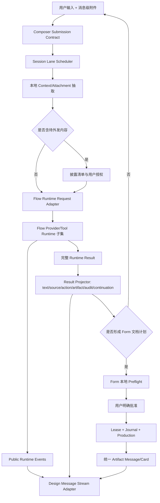

# AI 文档助手活动对话与 Flow 链路等价性深度校验

> 日期：2026-07-17<br>
> 性质：只读审计、动态探针与迁移方案，不包含功能修复<br>
> 本文结论优先于 `AI文档助手Design与Flow迁移深度分析_2026-07-16.md` 第 34 节。第 34 节关于“活动工作区一致”“活动页恢复网格背景”“最终链已完整”的判断，经本轮源码级复核后均不能成立。

## 1. 结论先行

当前实现不是“Alavette Design 活动对话 UI 已完整迁移 + Alavette Flow 底层已完整迁移”，准确状态是：

1. **一级功能入口、会话侧栏、空态创作首页和 Form 自有文档生产链已经存在。** 这部分不是纯静态壳。
2. **活动对话区只是按 Design 若干几何常量重新实现的轻量近似层，不是 Design `TaskMessageStream / TaskComposer / TaskWorkspace` 的等价迁移。**
3. **活动页斜网格背景是迁移错误。** Design 新任务首页有创作背景；Design 活动任务工作区源码明确使用纯 `bg_window`。当前把首页背景扩展到活动页，造成阅读噪声，也与权威源码相反。
4. **Flow 底层只抽取了极简 Provider 文本流和若干合同，并未迁入 Flow V3 的上下文装配、附件投影、工具循环、权限/问题续跑、来源、产物、审计、恢复和每会话调度主链。**
5. **存在一个已动态复现的 P0：旧会话运行中切到新会话，新会话首页仍可点击发送；请求被全局 Worker 静默拒绝，但输入文本已经清空。**
6. **“添加材料”与“分析当前文档”的界面含义大于真实能力。** 当前普通对话请求不读取或发送 DOCX 正文；`local_context_refs` 在 Runner 中没有被消费；UI 也没有建立 `context_refs`。选中的 DOCX 主要用于后续本地确定性计划和生产。
7. **API 配置的本地链路相对扎实，但不是任意模型 API 完整支持。** 密钥分离、配置回滚、连接测试、Chat Completions SSE、请求前就绪判断可用；当前机器没有云端 Profile，不能声明已完成真实公网端到端验证。
8. **Form 的计划—预检—批准—执行—产物链值得保留。** 问题不在于这条链不存在，而在于它和 Design 消息交互、Flow Runtime Result 的完整投影、会话并发归属尚未闭环。

因此，本轮最终判定为：

| 维度 | 判定 | 是否可称“完整迁移” |
|---|---|---:|
| 一级信息架构 | 基本成立 | 否，仍有响应式和会话运行归属缺口 |
| 空态创作首页 | 视觉与基础操作部分成立 | 否 |
| 活动对话 UI | 轻量近似，关键交互缺失 | **否** |
| Design 消息流等价性 | 未成立 | **否** |
| Flow V3 Runtime 等价性 | 未成立，仅有合同/Provider 子集 | **否** |
| API 本地配置链 | 基本成立，有明确协议边界 | 只能称“OpenAI-compatible Chat Completions 子集可用” |
| Form 文档生产安全链 | 主链成立 | 可称“Form 自有生产链已接通”，不能等同 Flow 完整迁移 |

---

## 2. 权威基线与校验方法

### 2.1 冻结的源码基线

| 基线 | 路径 | Git HEAD |
|---|---|---|
| 当前 Form | `C:\Users\70768\Desktop\Lark-Formatter 1.0\Lark-Formatter V1.0` | `9284471e0f182d9ee2174b631f53dbb726ded740` |
| Alavette Design | `C:\Users\70768\Desktop\Alavette Design` | `cb51361710c3edd853144c310b3f7636e9833df1` |
| Alavette Flow | `C:\Users\70768\Desktop\Alavette Flow` | `80560581b54f0817ab05f1efa3536253477cc755` |

本轮把以下证据按优先级使用：

1. Design/Flow 当前源码与测试；
2. 用户提供的 Design 首页截图和 Form 页面截图；
3. 当前 Form 原生 Qt 截图；
4. 当前 Form 动态行为探针；
5. 现有测试是否真正覆盖对应声明。

截图只能证明某个状态“能画出来”，不能证明消息动作、来源、附件、滚动、会话归属、失败恢复和产物链完整。

### 2.2 关键文件规模只作为结构证据

规模本身不等于质量，但能证明当前不是源组件的直接等价移植：

| 文件 | 行数 | 角色 |
|---|---:|---|
| Design `task_message_stream.py` | 8762 | 自定义 Model/Delegate、富消息、选择、滚动、来源、附件、产物、问题、恢复等 |
| Design `task_composer.py` | 1770 | Hero/Compact、附件、上下文、模型、推理、访问策略、Busy/Recovery |
| Design `task_workspace.py` | 1463 | Header、消息流、Composer、队列、来源通知、上下文、Drop Zone |
| 当前 `conversation_view.py` | 284 | 用户气泡、一个 Markdown 文本框、状态和复制 |
| 当前 `turn_runner.py` | 149 | 单次 Provider 文本流转发 |

当前 `src/assistant` 共 54 个 Python 文件、约 8656 行，其中 Runtime + Tools 约 1566 行；Flow 仅 `alavette_platform/runtime` 就约 10373 行，另有 Model Gateway、Provider、Memory、Artifact、Skill 等独立域。结论不是“代码越多越好”，而是当前明确采用了**重建子集**，不能再用“原始完整迁移”描述。

---

## 3. Design UI 的权威结构是什么

### 3.1 新任务页与活动任务页是两个不同表面

Design 的新任务页负责“今天要创作什么”、大输入器、建议与常用任务，允许使用低对比创作背景。

Design 的活动任务页由以下结构构成：

```text
TaskWorkspace
├─ TaskHeader (56px)
└─ body
   ├─ main
   │  ├─ TaskMessageStream (QListView + Model + Delegate)
   │  └─ composer_wrap
   │     ├─ ObjectContextRow
   │     ├─ Queue Notice
   │     ├─ Source Reference Notice
   │     └─ TaskComposer(mode="compact")
   ├─ TaskContextPanel
   └─ ObjectContextPanelHost
```

`task_workspace.py:793-808` 对 `task_workspace`、`task_workspace_main`、`task_workspace_body`、`task_composer_wrap` 都明确设置 `background: t.bg_window`。因此：

- 首页网格可以保留；
- 活动消息阅读区应使用纯背景；
- 当前 `AssistantConversationSurface.paintEvent()` 在活动页重新绘制倾斜网格和面片，是推测性重建，不是 Design 迁移。

### 3.2 Design 消息流不是一组 QTextEdit

Design `TaskMessageStream` 使用 `QListView + MessageListModel + MessageListDelegate`，核心能力包括：

- 860px 阅读列、820px AI 内容、640px 用户气泡；
- 段落、H1/H2/H3、列表、引用、分割线、代码块、表格、数学块；
- 跨消息/跨块文本选择与复制；
- 链接命中、拖动阈值与来源打开；
- 用户消息附件缩略图、附件横向滚动与打开；
- Assistant 来源条、来源按钮和活动来源状态；
- 复制、引用、编辑、重试；
- 产物打开/另存、候选动作、权限、问题、恢复、取消；
- 代码块内部横纵滚动；
- 流式显隐节奏、状态动画、过程摘要；
- 几何变化时保存像素滚动锚点；
- 用户主动离开底部后抑制自动跟随；
- Viewport 内圆形“跳到最新消息”覆盖按钮；
- 多问题选择、跳过、自定义答案与提交。

当前 `AssistantConversationMessage` 只实现：

```text
user: QLabel + 浅色 bubble
assistant: QTextEdit.setMarkdown + live status + copy button
```

这不是同一交互合同。

### 3.3 Design Composer 的真实合同

Design Compact Composer 的 154px 高度只是外形的一部分，还包括：

- 多附件与粘贴/拖放；
- 附件生命周期和移除；
- 对象上下文选择；
- Web、长期记忆等真实工具状态；
- Provider/Model/Reasoning/Access Mode；
- 上下文预算环；
- Pending Recovery / Waiting Question 输入门禁；
- Busy 时原位停止；
- Prompt Preset；
- 当前回合默认值快照。

当前 Compact Composer 复用了 Form 首页 Composer，已实现 154px、单个 DOCX、Provider、设置、草稿、发送/停止，但没有迁入上述完整状态机。因此几何接近不等于交互等价。

---

## 4. 当前 UI 差异清单

### 4.1 一级结构与空态首页

| 项目 | Design | 当前 Form | 判定 | 处理建议 |
|---|---|---|---|---|
| 一级入口 | AI 对话作为主功能 | `assistant` 已进入 Form 一级导航 | 基本一致 | 保留 |
| 会话侧栏 | 对话/新任务/置顶/最近任务，另有 Project/Plan/Memory/Skill | 当前保留会话、新任务、置顶、最近任务 | **合理裁剪** | 不恢复无底层链路入口 |
| 委托 Tab | Design 有独立委托语义 | 当前没有 | 合理缺省 | Form 没有委托领域合同前不展示 |
| 首页标题/Hero/建议/常用任务 | Design 创作首页 | 当前已重建 | 部分一致 | 继续用截图和源码校正尺寸，不等同源组件 |
| 首页背景 | 低对比透视网格 | 当前有网格 | 基本一致 | 只保留在空态首页 |
| “添加材料” | 多种材料/附件语义 | 只选择一个全局 DOCX | 含义过宽 | 文案应明确“选择待处理 DOCX”，或补齐真正附件链 |
| 项目/计划/长期记忆/技能中心 | Design 有真实页面/域 | 当前已删除 | **正确** | 不应为了像截图恢复死入口 |

### 4.2 活动对话工作区

| 项目 | Design 权威行为 | 当前行为 | 差异级别 |
|---|---|---|---:|
| 活动页背景 | 纯 `bg_window` | 首页斜网格继续铺到消息页 | **P1 错误迁移** |
| Header | 56px、文件图标、标题、更多、已开对象、上下文切换 | 56px、图标、标题、更多；紧凑时变“对话”按钮 | 部分一致 |
| 消息容器 | Model/Delegate 增量更新 | 每次完整 Render 都销毁并重建所有消息 QWidget | **P1** |
| 用户消息 | 右对齐、最大/最小阅读宽度、附件、Hover 动作 | 右对齐浅气泡，无附件/编辑/引用 | P1 |
| AI 消息 | 富块 Delegate，无头像，来源/过程/动作 | 单个 QTextEdit Markdown + 复制 | **P1** |
| Markdown | 专用段落/标题/代码/表格/引用布局 | Qt `setMarkdown()` 默认渲染 | P1 |
| 链接 | 命中测试并发出来源/链接动作 | 动态探针显示 `LinksAccessibleByMouse=false` | **P1** |
| 来源 | 来源条、来源按钮、打开策略 | `source_refs` 被保存到成员变量但不渲染 | **P1 数据终止** |
| 产物 | 消息内产物动作与附件预览 | 只有 Form 自定义卡片能打开少数产物路径 | P1 |
| 复制/引用/编辑/重试 | 完整消息动作 | 只有 AI 文本复制 | P1 |
| 流式 | 节流 Reveal、状态动画、保留锚点 | 每个 Delta 重新 `setMarkdown(累计全文)` | **P1 性能** |
| 完成时滚动 | 尊重用户阅读位置 | `_render_active_session()` 最后无条件滚到底 | **P1** |
| 跳到最新 | Viewport 内圆形 Overlay | 带文字的独立布局行，占据页面高度 | P2/P1 |
| 选择 | 跨块/跨消息选择 | 每个 QTextEdit/Label 各自选择 | P1 |
| Compact Composer | 完整 Task Composer 状态机 | 154px 外形 + Form 简化控制 | 部分一致 |
| 交互卡 | Design 多种 Runtime 行为 | Form 计划/预检/批准/产物/恢复卡 | **合理差异，应保留** |
| 紧凑响应式 | 保持任务身份与消息语义 | Header 标题消失、只剩“对话”和更多 | P2，需再验收 |

### 4.3 `source_refs` 是明确的数据黑洞

当前链路：

```text
AssistantRuntimeResult.source_refs
  -> AssistantMessage.source_refs
  -> AssistantConversationMessage(source_refs=...)
  -> self._source_refs
  -> 结束
```

动态探针给一个含 `title/url` 的来源后：

- `source_refs_stored = 1`；
- 可见按钮只有“复制”；
- 来源标题不可见；
- Markdown 控件未启用鼠标链接访问。

这说明当前不是“暂时不显示来源但链路完整”，而是来源已进入 UI 对象后没有任何出口。

### 4.4 完整重建消息列表破坏阅读状态

`assistant_panel.py:877-940` 的 `_render_active_session()` 会：

1. 删除现有所有消息 Widget；
2. 重新遍历 Session Messages 创建 Widget；
3. 重建临时 Preview；
4. 无条件 `QTimer.singleShot(0, _scroll_to_bottom)`。

影响：

- 用户选择文本会消失；
- Hover/展开/代码滚动状态会消失；
- 用户向上阅读时，回合完成会被强制拉到底；
- 长会话每个终态更新都产生全量 Widget 重建；
- 无法实现 Design 的像素滚动锚点。

### 4.5 流式 Markdown 存在已观测性能退化

当前每个 `text_delta` 都先拼接累计字符串，再调用：

```python
self._markdown.set_markdown(self._turn_preview_text)
```

而 `set_markdown()` 每次执行 `QTextEdit.setMarkdown(累计全文)`。本机原生 Qt 探针结果：

| 累计更新数 | 累计字符 | 该阶段耗时 |
|---:|---:|---:|
| 25 | 2025 | 183.0ms |
| 50 | 4050 | 396.4ms |
| 100 | 8100 | 1459.7ms |
| 150 | 12150 | 2319.6ms |

更长探针超过 30 秒超时。该数字受机器和 Qt 环境影响，不能当作通用基准，但增长趋势已经证明当前实现不适合 Provider 高频小 Delta。Design 使用独立 Streaming Reveal Timer 和布局缓存，正是为避免此类问题。

---

## 5. 会话、并发与取消差异

### 5.1 当前是“全 Panel 单 Worker”，不是“每会话 Lane”

当前 Panel 只有全局：

```text
_turn_worker
_content_worker
_preflight_worker
_execution_worker
```

`_send_message()` 只要任意相关 Worker 正在运行就直接 `return`。`cancel_active_turn()` 则会取消所有非空 Worker，没有按当前会话或具体操作归属。

Design 使用 `turn_scheduler` 和会话 Lane：

- 不同会话可并发；
- 同一会话可排队；
- 后台会话完成不会抢走当前视图；
- 当前会话停止只取消当前 Lane；
- 切回运行中会话能恢复运行占位；
- Late Result 有忽略审计。

### 5.2 已复现的 P0 输入丢失

动态步骤：

1. 会话 A 启动受 Gate 控制的流式 Worker；
2. 收到首个 Delta，A 仍运行；
3. 点击“新任务”，创建会话 B；
4. B 显示空态首页，首页 Composer `_busy=false`；
5. 在 B 输入“会话B草稿不应丢失”并点击发送；
6. Panel 因 A 的全局 Worker 正在运行而静默拒绝；
7. Composer 在发出 Signal 后仍执行 `clear()`。

探针结果：

```json
{
  "origin_running": true,
  "switched": true,
  "home_composer_busy": false,
  "active_composer_busy": true,
  "draft_after_rejected_send": "",
  "new_message_count": 0
}
```

这是用户文本丢失，不是“体验稍差”。在修复前，不应允许运行中创建/切换到可发送的新会话，或必须迁入每会话 Lane/队列并让提交返回明确接收结果。

### 5.3 取消与 Late Result

当前 Provider Cancel 的基础链存在：

```text
Composer Stop
-> Worker.cancel
-> CancellationToken
-> Gateway.cancel
-> 关闭活动 HTTP Response
```

但仍有差异：

- Cancel 是 Panel 全局的，不是会话归属的；
- 切换后新会话的 Stop 可能取消旧会话任务；
- 没有持久化 `provider_result_ignored` 等 Late Result 审计；
- Partial Text 在失败/取消后可能作为普通 AI 文本进入历史，再追加 Recovery Card；
- Retry 会追加一条相同 User Message，历史中可能同时存在原请求、部分 AI 回答和重试请求。

Design 对这些场景有独立测试；当前没有等价覆盖。

---

## 6. Flow 底层迁移差异

### 6.1 当前真正接通的 Runtime

当前普通对话主链是：

```text
User Text
-> AssistantTurnRequest
-> AssistantTurnRunner
-> ProviderRequest(messages + system prompt)
-> OpenAI-compatible Chat Completions SSE / Mock
-> Visible Text Deltas
-> AssistantRuntimeResult(主要只有 visible_text/provider_audit/transcript_ref)
-> 保存 AI 文本
-> FormDocumentPlanBuilder 根据原始 query + WorkspaceSnapshot 确定性建计划
```

它的优点是：

- 简单、可测试；
- 不允许模型直接写 Form 产品事实；
- 生产前还有 Form 本地预检和批准；
- Provider 与 Form 执行引擎隔离。

但它不是 Flow V3 主链。

### 6.2 Flow Request 的关键字段没有落入当前 Provider 请求

Flow `AssistantRuntimeRequest` 包含：

```text
prior_messages
attachments
context_pack
product_decision
runtime_preferences
continuation
```

当前 `AssistantTurnRequest` 虽然有 `local_context_refs / disclosure_grant_id / conversation_cursor`，但 `AssistantTurnRunner.run()` 只读取历史文本和用户文本。结果：

- `local_context_refs` 未被消费；
- `disclosure_grant_id` 未被消费；
- `conversation_cursor` 未被消费；
- 没有附件 Provider Parts；
- 没有 Context Pack；
- 没有本回合 Reasoning/Web/Access 偏好；
- 没有 Continuation Resume。

### 6.3 Flow Result 的多数 Side Channel 只存在于合同

当前 `AssistantRuntimeResult` 声明了：

```text
source_refs
proposed_actions
confirmation_requests
artifacts
process_steps
tool_audit
provider_audit
citation_audit
public_reasoning_summary
transcript_ref
continuation_ref
error
```

但 Panel 完成处理实际只消费：

- `visible_text`；
- `source_refs`（保存后 UI 又不展示）；
- `status`；
- `error.message`。

代码搜索确认以下字段除合同序列化外没有 UI/Session 投影：

- `proposed_actions`；
- `confirmation_requests`；
- `artifacts`；
- `process_steps`；
- `tool_audit`；
- `citation_audit`；
- `public_reasoning_summary`；
- `transcript_ref`；
- `continuation_ref`。

`pending_continuation` 也只有 Session 字段和 Coordinator 更新入口，没有主链写入者。`BLOCK_ARTIFACT` 被定义，但 `_render_active_session()` 不处理该 Block Type。

所以当前合同看起来接近 Flow，运行时却仍是“字段存在、链路未接”。

### 6.4 当前没有 Flow Provider/Tool Loop

Flow 实际 Runtime 支持或组织：

- Context Assembly 与 Context Budget；
- 多 Provider/Capability/Reasoning；
- Provider Native State；
- Tool Calls 与 Tool Results；
- Permission / User Question / Workflow Approval；
- Continuation 与 Resume；
- Attachment / Asset Store；
- Artifact Store 与输出意图；
- Source/Citation；
- Public Runtime Events；
- Memory/Compact Summary；
- Session Lane/Queue；
- Transcript/Audit/Replay。

当前 Form 的 `FormToolGateway` 用于本地预检和批准后执行，但没有接入 Provider Conversation Loop。也就是说：

- 模型不能通过 Flow 工具循环读取允许的上下文；
- 模型不能发起类型化问题并恢复；
- 模型不能返回真实 Flow 产物/来源/动作并由 UI 投影；
- 当前计划不是从 Flow `proposed_actions` 选择，而是 Form 根据原始 Query 再做一次确定性路由。

这条安全边界可以保留，但不能称“Flow 底层已迁移”。

---

## 7. “添加材料/分析文档”的实际语义差异

### 7.1 当前选择 DOCX 后发生了什么

当前附件按钮调用 `bridge.set_current_document_path(path)`，随后：

- 首页和 Compact Composer 显示同一个文件名；
- Workspace Snapshot 记录本地路径、名称和是否存在；
- Turn 完成后 Form Plan Builder 用它确定输入文档、工作模式、场景、模板和输出目录；
- 后续本地 Preflight/Execution 可读取该 DOCX。

### 7.2 当前选择 DOCX 后没有发生什么

普通 AI 对话请求没有：

- 解析 DOCX 正文；
- 生成可披露字段清单；
- 请求用户授权具体正文/图片/素材；
- 把授权内容装入 Provider Context；
- 把附件作为消息级记录显示；
- 把附件快照固定到具体 User Message。

因此“请分析当前文档结构与格式问题”如果只靠云端模型，模型看不到当前 DOCX 内容；它只能根据用户文字泛化回答，随后 Form 本地 Planner/Preflight 再做确定性处理。

### 7.3 隐私文案与实际链路

API 设置页写着“正文、图片或素材发送前会在 AI 助手中单独确认”，这是一个合理安全目标，但当前普通对话 UI 没有对应授权卡和上下文打包链。安全上是 Fail-Closed，产品语义上却会让用户预期存在一个尚未实现的确认步骤。

合理处理只有两种：

1. 在链路完成前，把“上传材料/分析当前文档”改成“选择待处理 DOCX；AI 当前仅接收你的文字要求，文档由本地引擎处理”；
2. 正式补齐：本地抽取 → 披露清单 → 用户批准 → Context Pack → Provider → 来源/审计。

不能继续维持宽泛承诺但没有授权入口。

---

## 8. API 配置链专项复核

### 8.1 已成立的部分

| 链路 | 结论 |
|---|---|
| Profile JSON 与 API Key 分离 | 成立 |
| Windows Credential Manager | 当前环境 `pywin32_import=ok`、Credential Store 可用 |
| 环境变量优先 | 成立 |
| Base URL 校验 | 只允许无凭据、无 Query/Fragment 的 HTTP(S) 地址 |
| 配置保存回滚 | 存在 Profile/Secret 回滚逻辑 |
| 未保存配置禁止连接测试 | 成立 |
| 连接测试不发送文档 | 成立，只发送固定 OK |
| Readiness | 缺 Key、停用、损坏配置发送前阻断 |
| SSE | 支持 Chat Completions `data:` + `[DONE]` 文本流 |
| Retry | 只在尚未输出可见 Delta 时对可重试错误重试 |
| Cancel | 可关闭活动 HTTP Response |
| Secret 脱敏 | Provider Error 会替换 API Key |

### 8.2 明确不支持或未验证的部分

- 当前只有 `mock` 和 `openai_compatible`；
- 只走 `/chat/completions`；
- 不支持 OpenAI Responses API；
- 不支持 Azure OpenAI 特殊 URL/Query 和 `api-key` Header；
- 不支持 Anthropic Messages；
- 不支持 Provider Native Tool Calls；
- 不支持多模态内容 Parts；
- 不支持 Reasoning Delta/Thinking 配置；
- 不支持 OAuth/SSO；
- 强制要求 `[DONE]`，部分“连接关闭即结束”的兼容实现会被判流不完整；
- 本机当前只有 `mock-default`，没有用户真实云端 Profile，因此未进行公网 Live Test。

### 8.3 一个语义问题

Composer 提示“发送后会固定到当前会话”，但回合结束后 Provider Combo 仍可切换，且 `_on_provider_selected()` 会改写现有 Session 的 `provider_profile_id/model_id`。更准确的语义应是“每回合发送前记录当前 Profile/Model 快照”，或真正锁定 Session Provider。现状是文案和行为不完全一致。

---

## 9. Form 文档生产链复核

### 9.1 成立的安全主链

```text
用户文字
-> Provider 可见建议
-> Form 根据 Query + WorkspaceSnapshot 建计划
-> 计划卡
-> 本地 Preflight
-> 用户明确批准
-> Execution Approval 绑定 Plan/Preflight/Input Hash/Output Root
-> Execution Lease + Journal
-> Form Production Adapter
-> Artifact Card
```

优点：

- AI 不能直接执行 Form 写操作；
- Preflight 与批准绑定当前计划和输入哈希；
- 输入/资源变化可使批准失效；
- 有全局执行 Lease；
- 有 Journal 和崩溃恢复；
- 输出文件不随会话删除；
- Prompt 新建文档时，模型只生成 Markdown，再由本地编译器生成审阅 DOCX。

### 9.2 尚未闭环的部分

- 第一轮 AI 回复与最终 Form Plan 没有结构化因果关系；Plan 主要由 Query 再路由；
- Provider 的 Side Channels 不进入计划；
- Content Generation 不使用会话历史，只使用 `plan.intent`；
- Content Generation 目前不传 Context Text，也没有由 UI 创建 Disclosure Grant；
- 进度卡是静态追加消息，缺少同一消息原位状态更新；
- Artifact Contract 和 Message Artifact Block 未统一；
- 多会话时 Content/Preflight/Execution 仍由全 Panel Worker 管理；
- 新会话可能看不到旧任务运行归属，却能触发全局 Stop。

因此，生产引擎安全性与对话体验完整性应分开评价。

---

## 10. 优先级清单

### 10.1 P0：不解决就不能继续宣称可用

| ID | 问题 | 直接风险 | 完成门禁 |
|---|---|---|---|
| P0-1 | 跨会话运行时新会话发送被静默拒绝并清空输入 | 用户数据丢失 | 每次提交必须返回 accepted/queued/rejected；Rejected 不得清空；按会话显示归属 |
| P0-2 | “添加材料/分析文档”与真实 Provider 上下文不一致 | 用户误判模型已读文档 | 降级文案或补齐披露 Context Pack；不得模糊 |
| P0-3 | Flow Result 多数 Side Channel 无消费 | 真正接 Flow 后来源、动作、产物、续跑全部丢失 | 为每个字段定义持久化、UI、动作和审计出口；未知字段 Fail-Visible |
| P0-4 | 全 Panel Worker 与 Design 每会话 Lane 语义冲突 | 停错任务、后台状态不清、无法并发/排队 | 引入 Session Lane Scheduler 或禁止切换并显式说明；不得半开放 |

### 10.2 P1：活动对话等价性的核心缺口

| ID | 问题 | 建议 |
|---|---|---|
| P1-1 | 活动页错误网格背景 | 删除活动页自绘网格，恢复纯 `bg_window` |
| P1-2 | 消息流是 QWidget/QTextEdit 近似层 | 适配移植 Design Model/Delegate 基础内核，不再继续堆 QTextEdit 补丁 |
| P1-3 | 来源、链接、附件没有出口 | 建立 Source/Attachment Action Contract 与打开策略 |
| P1-4 | 流式每 Delta 全量 Markdown 解析 | 使用 Delta Buffer + 16–33ms UI 节流 + 增量/分段渲染 |
| P1-5 | 完成时强制滚到底 | 保存 Scroll Anchor；仅在跟随状态时到底 |
| P1-6 | 消息操作缺失 | 至少补齐复制、引用、用户编辑、AI 重试、来源 |
| P1-7 | 代码/表格/引用富块没有专用交互 | 移植对应 Delegate Block Layout |
| P1-8 | 附件是全局单 DOCX，不是消息级快照 | User Message 持久化 Attachment Refs，支持多附件/移除/打开 |
| P1-9 | Partial Failure/Retry 历史语义不清 | 同一 Turn 原位终态化；重试引用原 Turn，而不是重复拼历史 |
| P1-10 | Artifact Contract 分裂 | Runtime Artifact、Message Block、Interaction Card 使用统一 ID/Action |

### 10.3 P2：可在主链稳定后处理

- Header Compact 身份表达；
- 跳到最新按钮的圆形 Overlay 和动画；
- Composer 模型摘要/推理入口的最终视觉；
- Hover、Tooltip、键盘导航和无障碍完整性；
- 更细的段落间距、字体和表面 Token 对齐；
- Session Sidebar 拖拽置顶等增强。

---

## 11. 合理的迁移边界

### 11.1 必须从 Design 迁移的部分

建议把 Design 活动消息流的以下层作为“交互内核”适配迁入：

1. `MessageRecord / MessageListModel`；
2. 阅读列和 `MessageLayoutSpec`；
3. Paragraph/Heading/List/Quote/HR/Code/Table Block；
4. User Bubble + Assistant Transparent Surface；
5. Source/Attachment/Artifact Regions；
6. Message Actions；
7. Selection/Link Hit Test；
8. Scroll Anchor/User Intent/Jump To Latest；
9. Streaming Reveal/Live Status；
10. Compact Composer 的输入门禁、附件和 Busy 状态机。

迁入时让这些 UI 层依赖 Form 的中性消息合同，不直接依赖 Design 的 ProjectOps/Today 领域对象。

### 11.2 应保留的 Form 差异

- 一级导航使用 Form 自己的 Rail；
- 会话侧栏只展示有真实链路的对话、新任务、置顶、最近任务；
- Form 的计划/预检/批准/执行卡；
- Form 的本地生产 Adapter、Approval、Lease、Journal；
- Form 的 Provider Profile 与 Credential Manager；
- Form 的 Work Mode/Scene/Template/Material Context；
- 不允许模型直接写产品事实。

这些不是“迁移不完整”，而是产品适配边界。

### 11.3 现阶段不应迁入的 Design/Flow 域

在 Form 没有领域合同和页面前，不展示：

- Project/Plan 独立域入口；
- Long-term Memory 管理页；
- Skill Center；
- 委托/Agent 列表；
- Candidate Inbox/Promotion；
- Today/ProjectOps 特有 Context Panel；
- MCP/Plugin/Hook 管理；
- 无真实 Provider 能力的 Web/Reasoning 装饰按钮。

但“暂不迁 UI”不等于可以丢弃 Flow Result 字段。Runtime Adapter 仍应完整保存未知/暂不展示的 Side Channel，并给出可诊断状态。

---

## 12. 推荐目标架构

### 12.1 单一纵向主链



### 12.2 四个不能再混在一起的状态

1. **Session State**：历史、草稿、当前计划、附件快照、Provider 快照；
2. **Turn Runtime State**：流式、等待权限、等待问题、取消、失败、完成；
3. **Document Job State**：内容草稿、预检、等待批准、执行、产物；
4. **Viewport State**：滚动锚点、选择、Hover、展开、代码滚动。

当前实现重建消息列表时把 Viewport State 丢掉，全局 Worker 又把 Session/Turn/Document Job 归属混在 Panel 上。合理迁移需要先拆状态，而不是继续修颜色和边距。

### 12.3 提交必须是有返回值的事务

当前 Composer 发送后无条件清空是 P0 根因。目标合同建议：

```text
submit(payload) -> Accepted(turn_id)
                | Queued(queue_id, position)
                | Rejected(reason, preserve_draft=true)
```

只有 `Accepted/Queued` 才清空输入；`Rejected` 必须保留 Draft，并在 Composer 内显示原因。

---

## 13. 推荐实施顺序

### Phase 0：先止损，不改视觉

1. 修复跨会话静默拒绝和输入清空；
2. 明确任务归属，禁止“新会话 Stop 旧任务”；
3. 把活动页背景恢复纯色；
4. 收紧“上传/分析文档”文案；
5. 为 Runtime Result 未消费字段增加断言/诊断，不允许静默丢弃。

验收：P0 动态探针全部通过，未收到的提交不清空。

### Phase 1：迁入 Design Message Stream 基础内核

1. 先迁 `MessageRecord/LayoutSpec/Model/Delegate`；
2. 只接 Text/User Bubble/Markdown Block；
3. 接滚动锚点、选择、链接、Jump Overlay；
4. 接 Source/Attachment；
5. 接 Code/Table/Quote；
6. 接 Message Actions。

验收：不再由 `_render_active_session()` 全量销毁重建消息；源 UI 关键交互测试移植后通过。

### Phase 2：每会话 Lane 与流式状态

1. 迁入/适配 `TurnScheduler`；
2. 不同会话并发或明确排队；
3. 同一会话排队；
4. 背景完成不抢当前视图；
5. 当前会话 Stop 只影响当前 Lane；
6. Late Result Ignore Audit。

验收：复刻 Design 的 7 个跨会话/停止/后台测试。

### Phase 3：补齐 Flow Request/Result 适配

1. Message-level Attachments；
2. Context Pack + Disclosure Grant；
3. Runtime Preferences；
4. Public Runtime Events；
5. 完整 Side Channel Projector；
6. Continuation/Question/Permission 最小闭环；
7. Source/Citation/Artifact/Audit 持久化。

验收：每个 Runtime Result 字段都有“持久化/显示/动作/明确忽略策略”之一，不能无声丢弃。

### Phase 4：与 Form 生产链统一

1. Flow Proposed Action 到 Form Plan Candidate 的显式映射；
2. 确定性 Planner 保留为校验/回退，不再与 AI 回复无因果并行；
3. Preflight/Approval/Execution 使用统一消息 ID 原位更新；
4. Artifact Contract 统一；
5. Content Generation 引入已授权 Context；
6. Session/Document Job 恢复与 UI 同步。

### Phase 5：视觉与发布门禁

1. Design 源工作区与 Form 同尺寸双截图；
2. Empty/Active/Streaming/Long/Code/Table/Source/Attachment/Failure/Compact；
3. 原生字体和 100/125/150% DPI；
4. 长输出性能；
5. 键盘/IME/无障碍；
6. 真实已配置 Provider Smoke，敏感信息脱敏。

---

## 14. 验收矩阵

| 场景 | 必须观察到 | 失败条件 |
|---|---|---|
| 空态首页 | 首页网格、Hero、建议、任务 | 活动页也沿用网格 |
| 首次发送 | User Message 立即出现，提交被明确 Accepted | Worker 拒绝但输入清空 |
| 流式 | UI 节流、状态可见、可取消 | 每 Delta 全量卡顿 |
| 向上阅读 | 位置保持、显示 Overlay | 回合完成被强制拉底 |
| 来源 | 来源可见、可打开、可审计 | `source_refs` 只存成员变量 |
| 链接 | 鼠标和键盘可激活 | 只能看不能点 |
| 附件 | 消息级快照、可移除/打开、披露清晰 | 只改全局路径且用户以为模型已读 |
| 新会话并发 | 每会话有独立 Busy/Stop/结果归属 | 新会话 Stop 旧会话、丢输入 |
| Provider 失败 | Partial 明确标记，Retry 引用原 Turn | Partial 当普通成功历史继续喂模型 |
| 权限/问题 | 可回答并 Resume | 只有合同字段没有 UI/续跑 |
| 产物 | ID、路径、打开/另存、审计一致 | Runtime Artifact 被丢弃 |
| 执行 | Plan/Preflight/Approval Hash 一致 | 旧批准执行新输入 |
| 恢复 | 重启后状态与 Journal 一致 | Running 永久卡死或重复执行 |
| API | Profile/Secret/Probe/Runtime 同一身份 | 测的是 A，实际发送 B |

---

## 15. 本轮验证记录

### 15.1 当前 Form Assistant 测试

```text
python -m pytest -q tests/test_assistant*.py
91 passed in 81.64s
```

这些测试证明：

- 合同、存储、Provider、内容生成、Preflight、Execution、Preferences 等子模块没有回归；
- Mock Worker 的 Delta 能在完成前进入当前 Preview；
- 当前轻量活动页可以渲染。

这些测试**没有证明**：

- Design 消息流等价；
- 来源/链接/附件/代码/表格/跨消息选择可用；
- 每会话 Lane 与后台任务归属正确；
- Flow V3 Side Channels 完整；
- 真实云端 Provider 可用。

现有名为 `test_active_conversation_migrates_design_message_and_composer_contract` 的测试只断言：两条消息、角色、154px Composer、32px Send、Provider 位于 Composer、Header 可见和截图宽度大于零。测试名称强于实际断言，应拆成更准确的小测试。

### 15.2 Design 参考行为测试

本轮在 Design 基线运行：

```text
artifact action activation
new session while previous running
background lane queue does not steal view
async result updates original session after navigation
reopen running session keeps placeholder
composer stop cancels active response
V3 web sources project to right rail

7 passed in 26.74s
```

这 7 个测试证明参考实现的目标行为确实存在，不是凭空增加要求。

### 15.3 动态探针

| 探针 | 结果 |
|---|---|
| 跨会话提交 | 复现静默拒绝 + Draft 清空，P0 |
| Source Refs | 数据已存但无可见来源/按钮 |
| Markdown Link | `LinksAccessibleByMouse=false` |
| 长流式 Markdown | 150 次、约 12K 字符的后 50 次更新耗时约 2.32s；更长探针超时 |
| Credential Store | 当前环境 Windows Credential Manager 可用、pywin32 可导入 |
| 当前 Provider | 只有 `mock-default`，无云端 Profile，未做公网 Live Test |

### 15.4 原生截图复核

当前原生截图能证明：

- 一级会话侧栏存在；
- User Bubble、Assistant 无头像文本、Form 交互卡、Compact Composer 能同时显示；
- Streaming 状态和 Stop 图标能显示；
- Compact 窗口没有明显横向溢出。

同时也直接暴露：

- 活动页错误沿用斜网格；
- 消息动作只有复制；
- 交互卡较重，消息内容与卡片层级割裂；
- Compact Header 任务身份弱；
- 缺少来源、附件、过程、引用、重试等真实对话工具。

---

## 16. 最终判定

当前成果应改名为：

> **“Form AI 文档助手一级入口、创作首页、轻量活动会话和安全文档生产主链原型”**

不应继续称为：

> “Alavette Design 活动对话已完全还原”<br>
> “Alavette Flow 底层逻辑已完整迁移”<br>
> “交互链已经最终完整”

最合理的下一步不是继续微调现有 QTextEdit 外观，而是：

1. 先修 P0 会话提交事务和任务归属；
2. 删除活动页错误网格；
3. 以 Design `TaskMessageStream` 的 Model/Delegate 为基础迁入消息交互内核；
4. 建立完整 Flow Request/Result Adapter，逐字段消灭数据黑洞；
5. 保留 Form 的确定性 Preflight/Approval/Execution；
6. 用源行为测试、动态探针、原生视觉和真实 Provider 四类证据共同验收。

只有这六项都完成后，才能重新评估“Design UI + Flow 底层 + Form 生产”的完整迁移结论。

---

## 17. 2026-07-17 实施后复核记录

> 本节记录同一轮审计之后实际落地的修复。前 1～16 节保留的是修复前基线与证据，不能再直接当作当前状态。

### 17.1 已完成的行为修复

| 原问题 | 当前处理 | 验证结果 |
|---|---|---|
| 提交被拒绝后仍清空输入 | Composer 增加事务型提交处理器，只有 `accepted=True` 才清空 | Rejected Draft 保留测试通过 |
| 全 Panel 单一 Turn Worker | Provider Turn 改为按 Session 保存独立 Worker 与 Preview | 两个会话可同时运行；结果回写各自 Session |
| 后台回合抢走当前页面 | Event/Result 均按 `request.session_id` 定向；只有 Origin 当前可见时才刷新 | Background Completion 不改变 Active Session |
| 重开运行会话看不到流式状态 | Preview State 按 Session 持有，重开时重新投影 | Reopen 后可见累计文本与 Stop 状态 |
| 活动页错误绘制透视网格 | 删除 `AssistantConversationSurface.paintEvent`；活动页恢复主题 `bg_window` | 类级回归断言与原生截图通过 |
| `source_refs` 无显示 | Assistant Message 增加来源条；User Message 增加附件条 | 来源/附件芯片可见、可点击 |
| Markdown 链接不可操作 | 增加 Mouse/Keyboard Link Activation，并限制可打开 Scheme | Mouse/Keyboard Flag 与打开目标测试通过 |
| 流式每 Delta 全量 `setMarkdown` | Live 阶段使用 Plain Text Cursor 增量追加；完成后才按 Markdown 渲染 | 4200 字、200 次累计更新约 4.6 ms |
| 用户向上阅读时被强制拉底 | Render 前记录 Follow-Tail 与 Scroll Value；非尾部时恢复位置 | Scroll Preserve 与“跳到最新”测试通过 |
| 附件只是全局路径 | 发送时冻结到 Session Context 与 User Message Source Refs | Message/Session Snapshot 测试通过 |
| DOCX 没有真正进入模型上下文 | Worker 线程提取段落与表格，40K 字符上限；Provider 只接收文件名与正文，不接收本地目录 | Capturing Gateway 测试通过 |
| 添加材料与上传语义模糊 | Composer 明示“发送时将把附件正文提供给当前模型”；只添加不发送不上传 | UI 文案测试通过 |
| Flow Result 字段数据黑洞 | 从 Provider Event Metadata/Side Channel 投影 Sources、Actions、Confirmations、Artifacts、Process、Audit、Reasoning、Transcript、Continuation | Typed Side Channel 测试通过 |
| Waiting Result 无法继续 | Pending Continuation 持久化；确认卡继续时携带 `conversation_cursor` 发起下一回合 | Durable Resume 测试通过 |
| Runtime Audit 无持久出口 | 每回合完整 `AssistantRuntimeResult.to_dict()` 进入 Session Job 的 `runtime_results`，最多保留 50 条 | Session Reload 可复核 |
| “根据材料生成”误当作格式化原文件 | Planner 新增 `from_material`；材料进入 `material_refs`，原文件不作为生产输入，后续生成 `_draft` | Planner 与 Material Generation 测试通过 |
| 历史产物卡打开最新文件 | 每个内容草稿/生产产物卡冻结自己的 `reference.path` | Action 不再依赖 Session 最新路径 |

### 17.2 当前端到端链路

```text
一级 AI 功能入口
  -> Design 创作首页（网格只在 Empty Home）
  -> 选择 Provider + 可选 DOCX + 明确发送披露
  -> 事务型提交
  -> Session Lane Worker
  -> DOCX Context Pack（后台提取、限长、本地路径不出站）
  -> Provider Stream
  -> 增量 Preview / Stop / Background Ownership
  -> Flow-compatible Runtime Result Projection
  -> Text + Sources + Actions + Confirmation + Artifact + Audit
  -> 如需确认：Pending Continuation -> Cursor Resume
  -> Form Deterministic Plan
  -> Prompt/Material Content Draft（可选）
  -> Preflight Hash Binding
  -> Explicit Approval
  -> Leased Local Execution + Journal
  -> Per-message Frozen Artifact Reference
```

### 17.3 当前仍然存在的差异

下表是当前代码与“原样完整迁移 Design + Flow V3”之间的真实剩余差异。它们不能被文案包装成已经完成。

| 领域 | 当前实现 | Design / Flow 参考能力 | 判定 |
|---|---|---|---|
| Message Renderer | `QTextEdit` Markdown + Widget 行 | Design Model/Delegate/Block Renderer、虚拟化、精确布局缓存 | **适配实现，不是原样移植** |
| 长会话规模 | Render Session 时仍重建可见 Widget | Design 有更完整的增量 Model 更新与 Delegate Cache | **中长会话可用，超长会话仍需压测** |
| 同会话连续提交 | Busy 时禁止第二次提交 | Design Scheduler 支持同 Lane FIFO Queue | **明确收窄；不同 Session 已独立并发** |
| 来源详情 | 消息内 Compact Strip，直接打开 URL/Path，无目标则显示摘要 | Design 可联动 Evidence Inspector/右侧详情 | **按“不要额外侧栏”的用户约束做了内联适配** |
| 附件类型 | 当前只支持单个 DOCX | Flow V3 支持多附件、图片、资产、OCR/视觉路由 | **未迁移** |
| Provider Tool Loop | 可消费 Typed Side Channel 与 Continuation，但 OpenAI-compatible Adapter 仍是文本 Chat Completions SSE | Flow V3 有 Provider-native Tool Call、Repair、Budget、Permission Loop | **未原样迁移** |
| 当前 Form Tools | 计划、预检、批准、执行通过确定性 Application Chain 驱动 | Flow V3 可由模型在策略内选择多种工具 | **主动采用 Form 确定性边界** |
| Memory / Skills / Web | 未接入 Flow Project Memory、Skill Runtime、Web Search/Fetch | Flow V3 完整能力域 | **未迁移，且当前 UI 不应暗示存在** |
| Structured Code/Table | Qt Markdown 基础渲染 | Design 有专用 Code/Table/Document Block | **基础可读，交互未等价** |
| 真实云端 Smoke | 本机仍只有 `mock-default` | 需要一个已配置云端 Profile 验证 DNS/TLS/Auth/SSE/模型响应 | **环境条件未满足，不能宣称已验证** |

### 17.4 当前合理结论

现在可以称为：

> **“Design 风格一级 AI 文档交互 + Session Lane 消息链 + Flow-compatible 结果/续跑合同 + Form 确定性文档生产链”**

仍不应称为：

> **“Alavette Design TaskMessageStream 逐行原样移植”** 或 **“Alavette Flow V3 全能力完整移植”**。

剩余差异中，右侧 Evidence Inspector 是依据用户“不需要额外侧栏”的明确要求主动删除的产品差异；Provider-native Tool Loop、Memory、Skills、Web、OCR、多附件和 Design 虚拟化 Renderer 则是真正尚未迁移的能力差异。

### 17.5 最终验证证据

```text
Assistant 全套 + Architecture Boundaries + Text Encoding + UI Copy Guardrails
126 passed in 110.62s

Material Planner + Content Disclosure/Generation 专项
8 passed in 12.01s

Flow Waiting/Continuation 专项
2 passed in 1.33s

Streaming 动态探针
8000 chars / 200 updates / 26.8 ms / exact=True

文档检查
952 lines / 32 fences / no U+FFFD / no trailing whitespace

Provider Readiness
mock-default: ready
cloud profile: absent
```

原生 Offscreen 截图人工复核结论：活动页纯背景、左右边界、User/Assistant 层级、附件/来源条、确认卡和 Composer 几何正确，未观察到横向溢出；该环境的中文字体回退显示为方框，因此这张截图**不能**作为中文字体质量或真实 Windows DPI 的通过证据。字体与 100/125/150% DPI 仍应在实际桌面窗口做人工验收。

## 18. 2026-07-28 执行修正：因果链、披露授权与可验证降级

> 本节是对第 17 节中若干过度结论的执行后修正；当两节结论冲突时，以本节为准。

### 18.1 本轮纠正的核心问题

此前实现仍有五类高风险问题：

1. 任意普通对话完成后都会自动生成 Form 计划，模型回答与本地文档执行之间缺少清晰的用户意图边界。
2. 附件选择仍可能污染全局工作区文档，切换会话后上下文所有权不明确。
3. 附件披露只有界面文案，没有可验证、可失败关闭的单回合授权合同。
4. 计划执行阶段重新读取实时全局材料上下文，发送时所见内容与批准后所执行内容可能不一致。
5. 文本 Provider 并不具备可验证的原生 Tool Call 续接能力，但界面仍曾提供“允许/拒绝后继续”的拟真按钮。

本轮按“用户显式意图 → 单回合披露 → 冻结快照 → 本地确定性执行”的边界进行修正，没有把未接通的 Flow 能力包装成已完成能力。

### 18.2 修正后的端到端因果链

```text
一级 AI 功能入口
  -> 独立 AI 面板与独立会话
  -> 会话拥有自己的 DOCX 附件引用
  -> 用户点击发送
  -> 创建单回合 DisclosureGrant
       - 绑定 session / provider / model / source_ref / disclosed_fields
       - 绑定附件 SHA-256 指纹
  -> Worker 在读取正文前校验授权
  -> 提取正文后再次校验文件指纹（TOCTOU 防护）
  -> 冻结 WorkspaceSnapshot + MaterialExecutionContext
  -> Provider 文本流
  -> 普通问答：只完成消息，不创建 Form 计划
  -> 明确文档动作意图：显示“创建 Form 执行计划”候选卡
  -> 用户点击候选卡
  -> 基于发送时冻结快照创建本地确定性计划
  -> 预检 / 批准 / 执行
  -> 产物卡绑定自己的可打开路径
```

这里的关键语义是：

- AI 回答不是本地执行授权。
- “创建 Form 执行计划”也不是执行授权；它只创建可审查计划。
- 真正执行仍必须经过 Form 的预检和明确批准。
- 旧会话恢复、切换会话或后台回合完成，都不能把另一会话的附件写入当前会话。

### 18.3 已完成的实现项

| 领域 | 本轮实现 | 验证判定 |
|---|---|---|
| AI → Form 因果边界 | 只有同时命中文档对象和动作意图时才产生候选；普通问答不再创建计划 | 已通过普通问答负例与显式候选正例 |
| 显式计划创建 | 模型回合结束后只显示候选卡，用户点击后才构建 Form 计划 | 已通过端到端生成链测试 |
| 会话附件所有权 | Composer 选择文件只更新活动 Session，不再直接写全局 Workspace Bridge | 已通过双会话切换恢复测试 |
| 单回合披露授权 | `DisclosureGrant` 绑定 session/provider/model/ref/fields/fingerprints；缺失或不匹配直接失败且不调用 Provider | 已通过 fail-closed 测试 |
| 附件竞态防护 | 正文提取后再次计算 SHA-256；读取期间文件变化则终止 | 代码路径与单回合指纹测试通过 |
| 发送时工作区冻结 | Turn 保存 `WorkspaceSnapshot`，候选转计划时不再重新查询当前全局状态 | 已通过计划输入快照测试 |
| 材料上下文冻结 | Turn 保存 `MaterialExecutionContext`，计划执行使用对应 Turn 快照 | 已通过材料变化回归测试 |
| 权限/确认卡降级 | 文本 Provider 的权限卡仅作说明，不再提供伪“允许/拒绝续接”按钮 | 已通过无危险续接动作测试 |
| 产物动作 | 只有存在真实 path/url/href 时才显示“打开产物”；运行时产物使用独立 Artifact Block | 已通过渲染路径回归 |
| 消息动作 | 最终回答支持复制、引用、重试；引用会回填 Composer，重试复用对应用户消息 | 已通过引用动作测试 |
| 活动页背景 | 按当前产品要求，在活动对话页保留低对比斜向网格；它是 Form 一级功能的背景语言，不再宣称“活动页必须纯背景” | Offscreen 截图未见横向溢出 |
| API/隐私文案 | 明确“选择附件不上传，点击发送才授权本回合读取”；云端测试仅声明文本流已验证 | 文案与偏好面板回归通过 |

### 18.4 主动删除或禁用的伪链路

以下能力没有可靠底层合同，因此本轮没有继续保留“看起来可用”的交互：

- Provider 权限确认后的伪 Cursor Resume：标准 OpenAI-compatible 文本适配器没有发送可验证的 Tool Call 结果，也没有原生 continuation handle；旧持久化动作只显示说明，不再发送一条模拟“允许”的用户消息。
- 无引用目标的“打开产物”：不存在真实路径或 URL 时不显示动作。
- 普通对话自动进入 Form：已删除自动创建计划的副作用。
- 附件选择即全局工作区加载：已删除该跨一级功能的隐式状态写入。

这意味着当前系统是“安全阻断”，不是“Flow 权限工具循环已经迁移完成”。

### 18.5 当前仍然存在的真实差异

| 优先级 | 差异 | 当前影响 | 合理后续 |
|---|---|---|---|
| P1 | Provider 仍是文本 Chat Completions/SSE，没有原生 Tool Call、Permission Loop、Repair、Budget 与 Continuation Handle | 权限类事件只能展示并阻断，不能在原回合内可靠续接 | 先定义 Provider Tool Contract，再接支持 tool calls 的适配器；合同完成前不恢复允许/拒绝按钮 |
| P1 | 每个计划的 `MaterialExecutionContext` 当前只保存在进程内存 | 应用重启后可恢复计划，但无法恢复对应材料快照；当前回退为空上下文，避免误用新材料，却不是完整恢复 | 将材料快照或不可变材料引用随计划持久化，并在执行前校验哈希 |
| P1 | 仅支持单个 DOCX 的纯文本/表格提取 | 不支持多附件、图片、PDF、OCR、资产路由 | 扩展 SourceRef 与 Extractor Registry，并逐类型定义披露字段和大小预算 |
| P2 | 消息区仍采用 QWidget/QTextEdit 与可见项重建 | 超长会话可能出现内存与重排压力，和 Design 的 Model/Delegate/Block Renderer 不等价 | 引入增量 Message Model、可复用 Delegate 与虚拟化测量缓存 |
| P2 | 同一 Session 忙碌时不能排队第二条消息 | 用户必须等待或停止；不同 Session 可并发 | 增加显式 FIFO 草稿队列与取消语义 |
| P2 | 来源仅是内联摘要/链接 | 没有证据定位、段落锚点和引用核验 | 在不增加额外侧边栏的约束下，设计内联可展开 Evidence Card |
| P2 | Memory、Skills、Web、视觉理解未接入 | 不能宣称 Flow V3 全能力 | 每项能力需独立合同、权限、审计与失败降级，UI 不应提前暗示存在 |
| P2 | 没有真实云端 Profile 的本机 E2E | DNS/TLS/Auth/模型名称/SSE 分片仍未得到真实环境证明 | 使用用户配置的测试 Profile 做一次不含敏感文档的烟雾测试 |
| P3 | Offscreen 环境中文字体回退为方框 | 当前截图不能证明真实 Windows 字体和 DPI 质量 | 在桌面环境验收 100%、125%、150% DPI 和窄窗宽 |

### 18.6 本轮验证证据

```text
Assistant 全套 + Preferences
117 passed in 53.16s

Runtime + Panel 专项
44 passed in 40.26s

Planner + Contracts + Content Generation
14 passed in 5.99s

Architecture Boundaries + Text Encoding + UI Copy Guardrails
21 passed in 11.10s

Ruff
All checks passed

Python bytecode compilation
passed

git diff --check（本轮涉及路径）
passed
```

视觉探针：

- `artifacts/assistant_home_after_p0_2026-07-28.png`
- `artifacts/assistant_active_after_p0_2026-07-28.png`
- `artifacts/assistant_active_candidate_after_p0_2026-07-28.png`

最后判定：

> 当前实现已经形成清晰的“AI 对话 → 显式计划候选 → Form 本地计划 → 预检/批准/执行”链路，并对附件披露和执行材料做了回合级冻结；但它仍然不是 Alavette Flow 的原生 Tool Runtime，也不是 Alavette Design 消息渲染器的逐行移植。未完成的能力已经在界面上主动阻断或隐藏，不再用伪交互填充链路。

## 19. 2026-07-28 快速执行资料预览卡片与资料包身份链路修正

### 19.1 修正范围

本轮修正快速执行中“处理方案与模板”和“输出目录”之间的资料填充预览。目标不是增加第二个资料编辑器，而是提供一个与相邻功能区同层级、同视觉语言的只读执行前回执。

预览已从独立绘制的紧凑条改为复用 Workbench 标准 `Card`：

```text
处理方案与模板（Card）
资料填充预览（Card）
输出目录（Card）
执行输出（Card）
```

卡片只显示执行前必要信息：

- 资料包身份；
- 当前资料身份；
- 必填完整度；
- 最多三个关键填充值；
- 已绑定图片、内容和附件计数；
- 内容较多时提供无 Tooltip、无额外操作入口的显式展开/收起。

### 19.2 资料包名称的唯一权威来源

资料包名称统一取自：

```text
EntityArchive.archive_name
```

`EntityProfile.profile_name` 只表示资料包内部“当前这一份资料”的名称，不再作为资料包名回退。`package_id` 和 `archive_id` 是技术身份，不进入主界面。

修正后的链路：

```text
新建 / 重命名 / 导入 / 内置资料包
  -> EntityArchive.archive_name
  -> MaterialExecutionContext.archive_name
  -> PanelBridge clone
  -> QuickExecutionDetail
  -> 资料填充预览 Card
```

批量链路使用同一身份合同：

```text
MaterialBatchSelection.archive
  -> build_material_batch_items(...)
  -> 每个 MaterialBatchItem.context.archive_name
```

### 19.3 已修正的原问题

| 原问题 | 修正 |
|---|---|
| `MaterialExecutionContext` 没有资料包名称 | 新增 `archive_name`，并纳入 `from_payload`、`clone`、`is_empty` |
| 资料面板拥有包名但发布上下文时丢弃 | 从当前 `EntityArchive` 原样写入执行上下文 |
| 预览把 `profile_name` 当成资料包名称 | 包名只读取 `archive_name`；`profile_name` 独立显示为“当前资料” |
| 批量任务只携带 Profile 身份 | 每个批量 Item 同时冻结同一 `archive_name` 和各自 `profile_name` |
| 公文资料包入口无法提供显示名称 | 文件派生入口保存可识别的来源名称；正式资料包入口读取 `archive.archive_name` |
| 预览视觉像额外插入的细条 | 继承标准 `Card`，复用统一圆角、边框、内边距、标题图标和卡片间距 |
| 窄窗口可能挤压内容 | 身份区和三项预览使用 `AdaptivePairRow`，在需要时可自动纵向重排 |

### 19.4 回退规则

| 上下文状态 | 资料包显示 |
|---|---|
| `archive_name` 有值 | 显示真实资料包名称 |
| `package_id/archive_id` 有值但名称为空 | `未命名资料包` |
| 没有资料包身份 | `未选择资料包` |
| 只有 `profile_name` | 包名仍为 `未选择资料包`，当前资料单独显示 |

禁止的回退包括：

- 使用 `profile_name` 冒充资料包名；
- 将 UUID、`package_id` 或目录名直接显示为资料包名；
- 在快速执行层按 ID 反查资料库并猜测名称。

### 19.5 验证证据

```text
资料预览投影、Card 结构、回退、上下文往返、批量继承
12 passed

资料面板 archive_name 发布
1 passed

Material Context V3 + Batch Domain
14 passed

官方资料包入口
31 passed

快速执行详情架构
54 passed

Ruff（本轮涉及文件）
All checks passed

Python bytecode compilation
passed
```

Offscreen 原生渲染探针：

```text
工作区宽度：1280
处理方案与模板：1280 × 84
资料填充预览：1280 × 80
输出目录：1280 × 79
资料填充预览 MRO：
QuickMaterialPreview -> DesignSystemCard -> RoundedSurfaceFrame
卡片圆角：10
```

在 1280、720、420 三种内容宽度下，预览最小宽度为 302，没有超过 QuickExecutionDetail 的 320 最小宽度合同。

Offscreen 环境仍缺少可用于中文质量判定的字体回退，因此该截图只证明卡片层级、边界、间距和无横向溢出，不作为真实 Windows 中文字体与 DPI 的最终验收证据。

### 19.6 扩大回归范围后的边界记录

本轮还执行了超出资料预览直接范围的回归：

```text
Batch Generation Detail + Config Library/Bridge
62 passed

Material Execution Context 全文件
41 passed, 5 failed

UI Layout Hardening + Text Encoding
44 passed, 1 failed
```

未通过项没有被计入本节前述的通过证据：

- 5 个 Material Execution Context 失败集中在公文/考试 Terminal Assembler 的既有输出链，失败用例没有设置 `archive_name`，新增名称字段保持空值，不参与对应装配分支。
- 1 个 Layout Hardening 失败来自 `scene_content_detail.py` 中已有的 `setFixedHeight`，不属于本次预览卡片或资料包身份修改路径。

本轮没有为了得到全绿结果而修改这些不相关链路。它们应继续作为当前工作树的独立回归项处理。

## 20. 2026-07-28 资料包内容预览二次修复：从“卡片壳”改为真实实时链路

> 本节取代 19 节中“执行上下文直接驱动预览”的结论。19 节只解决了卡片层级和执行上下文中的包名，仍没有完成资料面板编辑态到快速执行的实时迁移，因此用户看到的结果仍然不对。

### 20.1 二次核验发现的真实差异

| 差异 | 原实现 | 修复后 |
|---|---|---|
| 卡片视觉 | 外层换成标准 `Card`，内部仍是松散摘要文字 | 一行两组“标签 + 有边界只读控件”，复用“处理方案与模板”的控件语法 |
| 空状态 | 无资料契约时整卡隐藏 | 卡片始终存在，明确显示“未选择资料包 / 暂无填充内容” |
| 资料来源 | 不显示资料包来源 | 从 `MaterialPackageLibraryEntry.source_type` 投影“内置 / 自定 / 外部” |
| 数据来源 | 依赖 `MaterialExecutionContext` | 优先读取独立 `MaterialPreviewSnapshot`，执行上下文仅作兼容回退 |
| 资料包切换 | 只更新批量选择，不更新快速执行预览 | `AssetsPanel` 每次摘要刷新发布实时预览快照 |
| 当前资料切换 | 本地编辑器变化，Bridge 不知道 | Profile 切换完成后发布新身份、字段和计数 |
| 字段编辑 | 只有正式应用/生成时才进入 Bridge | 字段摘要防抖完成后发布新快照，不冻结执行上下文 |
| 重命名 | 仅刷新资料面板本地摘要 | 资料包名称变化立即传递到快速执行卡 |
| 验证方式 | 测试和截图直接向 `QuickExecutionDetail` 注入伪造上下文 | 测试使用真实 `AssetsPanel → PanelBridge → WorkbenchPanel` 链路 |

### 20.2 最终状态边界

预览态和执行态现在是两个明确的状态域：

```text
资料包编辑 / 当前资料切换 / 字段修改 / 资源修改
  -> MaterialPreviewSnapshot
  -> PanelBridge.material_preview_snapshot_changed
  -> WorkbenchPanel
  -> QuickExecutionDetail
  -> 资料包内容预览 Card
```

```text
用户正式生成
  -> 校验当前资料
  -> MaterialExecutionContext
  -> 执行门禁
  -> 文档生成
```

关键约束：

- 预览更新不会调用 `_apply_current_profile()`；
- 预览更新不会把未确认草稿写入 `MaterialExecutionContext`；
- `MaterialPreviewSnapshot` 使用不可变结构，并带有字段、资源、身份共同计算的 16 位内容修订号；
- 工作模式不兼容时 Bridge 会清空预览快照，防止跨模式显示旧资料；
- Bridge 的事务快照、恢复和差异信号均包含预览状态，回滚后不会出现界面与执行域分裂。

### 20.3 卡片信息架构

折叠态只保留两组必要信息：

```text
资料包内容预览                                      展开

[资料包图标] 资料包      [华东项目资料包           自定]
[内容图标]   填充内容    [投标人主体 · 已填 5/5 · 图片 2   完整]
```

交互限制：

- 两个内容面都是只读边界控件，不伪装成下拉框；
- 无“准备材料”按钮；
- 无说明段落；
- 无 Hover 提示和 Tooltip；
- 只有确实存在字段/资源明细时才出现“展开”；
- 展开后仅显示最多 8 项键值，缺失必填项优先，额外数量用一行计数收口。

### 20.4 资料来源与名称

| 显示内容 | 权威来源 |
|---|---|
| 资料包名称 | 当前编辑器中的 `EntityArchive.archive_name` |
| 资料包类型 | `MaterialPackageLibraryEntry.source_type` |
| 当前资料名称 | 当前 `EntityProfile.profile_name` |
| 字段值 | 当前编辑器实时投影，不要求先保存 |
| 图片/内容/附件计数 | 当前资料面板的已解析资源状态 |

内存中尚未进入资料库的资料包按用户自定资料处理；没有任何真实身份时，不再发布“未命名资料包”这类展示回退作为有效快照。

### 20.5 额外修复：Profile 切换中间空帧覆盖

真实链路测试发现一个与预览直接相关的既有生命周期缺陷：

```text
选择第二份资料
  -> 当前索引先变化
  -> 字段编辑器开始重建
  -> 持久化摘要在空控件帧读取值
  -> 第二份资料 fields 被写成空字典
```

修复方式：

- Profile 编辑器重建期间暂停持久化采集；
- 控件全部装载后再刷新摘要；
- 尚未获得具体编辑行的字段临时写入通用键值编辑器；
- 随后再进行一次正常持久化与预览发布。

验证结果：从“投标人主体”切换到“联合体成员”后，第二份资料字段保持不变，预览身份和字段同步更新，正式执行上下文仍为空。

### 20.6 自动验证证据

```text
资料预览投影 + Card + 真实 Assets/Bridge/Workbench 链路
15 passed

Bridge 场景事务 + Assets 架构 + 快速执行详情架构
107 passed

资料预览 + 快速执行详情专项
69 passed

资料 Profile 持久化 + Material Domain UI + Config Library/Bridge
124 passed in 450.82s

Python byte码编译（本轮修改路径）
passed
```

真实链路用例覆盖：

- 资料包载入；
- 当前资料切换；
- 字段实时编辑；
- 资料包名称实时变化；
- Workbench 卡片同步；
- 预览期间 `MaterialExecutionContext.is_empty() is True`；
- 工作模式切换时旧预览快照清理。

### 20.7 当前仍需人工桌面验收的边界

- Offscreen 截图可以验证布局、边界、控件密度和信息层级，不能替代 Windows 原生字体与 DPI 验收；
- 云端 AI Provider 的 DNS、TLS、认证、模型名和真实流式响应不属于本次资料预览链路修复，本节不把它们声明为已验证；
- 本轮没有把资料预览做成资料编辑入口；资料修改仍由一级“资料”功能负责，快速执行只提供执行前回执。
