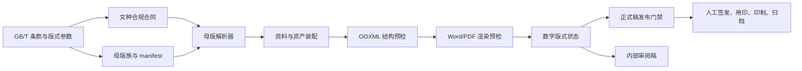

# 公文国标合规双轨整改规划

日期：2026-07-10  
状态：规划已冻结，尚未进入母版和运行时代码实施  
适用范围：公文版数字版式、DOCX 装配、预检、渲染验收与交付声明

## 1. 结论先行

公文国标整改必须同时推进两条建设线，二者缺一不可：

1. **模板 / 母版线**：定义最终页面的物理版式，包括版心、版头、文号、签发人、标题、正文、附件说明、署名日期、印章锚点、版记和页码。
2. **方案 / 系统线**：定义什么文种、什么行文方向、什么用印方式应选择哪一个母版，哪些字段必填，如何装配，如何预检，什么情况下允许交付正式稿。

两条线不是“任选其一”，也不能互相代替：

- 只有母版，没有方案合同，系统仍会把请示按普通下行文生成，漏掉签发人。
- 只有方案规则，没有合规母版，系统即使识别出请示，也只能把正确字段填进错误版式。
- 只有 PNG 基准，没有标准条款检查，只能证明输出没有漂移，不能证明输出符合国标。
- 只有 DOCX 数字版式检查，仍不能证明纸张、油墨、双面印刷、装订和印章合法性。

因此当前 `official_gbt_standard` 的准确状态应定义为：

```text
layout_stability = passed
digital_layout_conformance = failed
official_release_validity = not_certified
```

当前产品不得使用“完全符合 GB/T 9704”“国标合规正式公文”等结论性文案。可以继续使用“GB/T 9704 风格演示版”“内部预检稿”等受限表述，直到本规划的数字版式合规门禁通过。

## 2. 合规基准和边界

### 2.1 主要基准

- [全国标准信息公共服务平台：GB/T 9704—2012](https://std.samr.gov.cn/gb/search/gbDetailed?id=lOIe27f77QU%3D&mode=p)
- [党政机关公文格式标准正文及式样](https://www.ankang.gov.cn/WapContent-2060365.html)

全国标准信息公共服务平台显示 GB/T 9704—2012 当前为现行标准，并在 2025-05-30 复审后继续有效。

### 2.2 本系统可以验证的范围

```text
[x] DOCX 页面尺寸和页边距
[x] 字体、字号、段落、缩进、边框和表格结构
[x] 版头、主体、版记和页脚的对象顺序
[x] 文种和行文方向对应的必填字段
[x] Word/PDF 实际分页、空白页、裁切和重叠
[x] 页码字段、奇偶页位置和特殊首页规则
[x] 母版版本、哈希、渲染器和字体解析证据
```

### 2.3 本系统不能自动认证的范围

```text
[ ] 公文内容和行政决定是否合法
[ ] 签发、会签、编号和归档审批是否真实完成
[ ] 印章或签名章是否合法、有效
[ ] 纸张克重、白度、油墨色值是否符合印制要求
[ ] 双面印刷套正和装订误差是否符合要求
```

最终产品即使通过数字版式门禁，也只能声明“数字版式预检通过”，不能声明“公文正式生效”或“印章合法”。

## 3. 现状证据与根因

### 3.1 已经正确的基础

两份请示/批复样张实测：

```text
纸张：210.01 mm x 297.00 mm
上边距：37.01 mm
下边距：35.00 mm
左边距：27.99 mm
右边距：26.00 mm
正文：16 pt 仿宋
正文首行缩进：约 11.01 mm，接近两个三号汉字
```

这说明 `src/shared/engine/official_document_master.py` 中 A4 和版心基础参数方向正确，正文、主送机关、发文字号的基础字号也基本正确。

### 3.2 当前关键不符合项

| 项目 | 当前实现 | 应达到的目标 | 影响 |
| --- | --- | --- | --- |
| 发文机关标志位置 | 从纸面约 37 mm 处开始 | 上边缘距版心上边缘 35 mm，即距纸面约 72 mm | 版头整体上移 |
| 发文机关标志字体 | 28 pt 加粗宋体 | 红色小标宋体系 | 字体错误 |
| 红色分隔线 | 位于发文字号上方 | 位于发文字号或最后一个签发人下方 4 mm | 版头顺序错误 |
| 请示 / 报告 | 文号居中，无签发人 | 文号居左空一字，签发人居右空一字 | 上行文结构缺失 |
| 标题 | 22 pt 加粗黑体 | 2 号小标宋 | 字体错误 |
| 附件说明 | 与正文紧接 | 正文下空一行、左空二字 | 间距不符 |
| 署名日期 | 简单右对齐 | 按加印章 / 不加印章式样留字距和错位 | 末尾结构错误 |
| 印章 | schema 有资产角色，装配不处理 | 按策略插入用户提供的印章资产或采用合法不加印章式样 | 正本条件不完整 |
| 版记 | 3 行 2 列全框表格、16 pt | 规定的横向分隔线、4 号仿宋；印发机关与日期同一行并加“印发” | 版记结构错误 |
| 页码 | 页脚为空 | PAGE 字段、4 号半角宋体、奇偶页位置和一字线 | 缺少页码 |

### 3.3 代码根因

当前问题不是两个样张的偶发问题，而是母版生成器和方案合同共同造成：

```text
src/shared/engine/official_document_master.py
  _add_first_page()
    -> 宋体加粗红头
    -> 先红线、后文号
    -> 标题使用黑体

  _add_printing_section()
    -> 3 x 2 全框表格
    -> 版记使用 Normal / 3 号仿宋

src/config/official_document_profiles.py
  get_official_document_assembly_contract()
    -> 15 个 profile 全部硬编码到 official_gbt_standard
    -> category=upward 没有转化为签发人 / 文号版式合同

src/config/material_schema_registry.py
  official_document_v1
    -> 已有 signer 字段和 seal 资产角色
    -> 但 assembly field bindings 没有 signer
    -> assembly 也不消费 seal 资产

src/shared/engine/official_document_sample_verification.py
  -> 能证明页数、非空、像素稳定和基准一致
  -> 不能证明标准条款合规
```

### 3.4 历史 PNG 基准的重新解释

当前 `visual_baseline_ok` 的真实含义是：

```text
本次输出与一张已入库 PNG 相同
```

它不等于：

```text
这张已入库 PNG 本身符合 GB/T 9704
```

因此历史 `shared_master_accepted` 只能解释为“同一页壳可稳定复现”，不能继续作为“一个母版可以合规覆盖全部文种”的证据。现有基准应在合规整改期间标为 `stability_reference_legacy`，待新母版通过条款验收后重建。

## 4. 双轨职责边界

| 对象 | 负责什么 | 不负责什么 |
| --- | --- | --- |
| 格式模板 | 字体、字号、颜色、行距、段落和一般格式策略 | 不决定具体文种结构 |
| 公文母版 | 页面对象、锚点、版头、正文块、版记、页脚和特殊格式 | 不决定字段是否真实、印章是否合法 |
| 文种 profile | 文种、类别、行文方向、适用布局族和业务提示 | 不直接操作 OOXML |
| 装配合同 | profile + 字段 + 母版族 + 用印策略 + 交付策略 | 不拥有最终物理尺寸常量 |
| 装配 runtime | 选择母版、填字段、插入资产、删除空块、生成产物 | 不自行发明合规规则 |
| 合规验证器 | 检查标准条款、结构、渲染结果和问题级别 | 不认证行政内容或印章效力 |
| 人工审批 | 签发、会签、编号、用印、印制和归档 | 不由系统自动替代 |

关键原则：同一个标准参数只能有一个权威来源。页边距、版头坐标、字号和版记线宽应进入统一 `OfficialLayoutSpec`，不能分别散落在母版生成器、测试和 UI 文案中。

## 5. 轨道 A：模板 / 母版整改规划

### A0. 先冻结错误声明

在生成新母版之前先完成状态纠偏：

```text
official_gbt_standard
  当前角色：legacy preview shell
  compliance_status：nonconformant
  baseline_role：stability_reference_legacy
```

不删除当前母版，不静默覆盖用户文件；产品中如仍展示，应标注“历史演示版 / 未通过国标版式预检”。

### A1. 建立统一版式参数合同

建议新增 `OfficialLayoutSpec` 或等价只读配置，至少包含：

```text
standard_id = GB/T 9704-2012
paper = A4 / 210 x 297 mm
margins = top 37 / bottom 35 / left 28 / right 26 mm
body_area = 156 x 225 mm

font_roles
  issuing_authority = 小标宋体系 / red
  document_number = 3 号仿宋
  title = 2 号小标宋
  body = 3 号仿宋
  signer_label = 3 号仿宋
  signer_name = 3 号楷体
  imprint = 4 号仿宋
  page_number = 4 号半角宋体

spacing_roles
  issuing_authority_top_from_body = 35 mm
  separator_below_document_number = 4 mm
  title_below_separator = 2 lines
  recipient_below_title = 1 line
  attachment_below_body = 1 line
```

字体合同必须包含实际字体解析结果。若运行环境没有可用的小标宋字体，只能进入 `font_substituted` 警告或阻断状态，不能把宋体/黑体替代后仍判为严格合规。

### A2. 从“一个通用母版”改为“最少五个结构族”

不需要为 15 个文种各复制一份 DOCX，但至少需要覆盖 GB/T 9704 中真实存在的结构差异：

| 母版族 | 建议 ID | 首批文种 | 关键差异 |
| --- | --- | --- | --- |
| 普通行文 | `official_gbt_regular` | 通知、通报、批复、决定、意见等 | 文号居中、普通版头和版记 |
| 上行文 | `official_gbt_upward` | 请示、报告 | 文号居左、签发人居右 |
| 信函 | `official_gbt_letter` | 函 | 红色双线、首页不显示页码、信函版记规则 |
| 命令 | `official_gbt_order` | 命令（令） | 命令标志、令号、签名章布局 |
| 纪要 | `official_gbt_minutes` | 纪要 | 纪要标志、出席 / 请假 / 列席块 |

决议、公报、公告、通告、议案等 profile 在没有真实样张和结构证据前继续保留为 `profile_only / unverified_layout`，不得自动宣称已由普通母版合规覆盖。

### A3. 普通行文母版的结构合同

```text
发文机关标志
  -> 下空二行
发文字号（居中）
  -> 下 4 mm
红色分隔线（与版心等宽）
  -> 下空二行
标题（2 号小标宋）
  -> 下空一行
主送机关
正文
附件说明（可选；正文下空一行）
署名 / 日期 / 印章块
附注（可选）
附件页（可选）
版记
页码字段
```

### A4. 上行文母版的结构合同

```text
发文机关标志
  -> 下空二行
同一版头行
  左：发文字号，左空一字
  右：签发人：姓名，右空一字
  -> 最后一个签发人下 4 mm
红色分隔线
后续主体、末尾、版记和页码规则
```

首批必须用“请示”作为上行文验收样张。`signer` 在 request/report 中不再是全局可选字段，而是 profile 条件必填字段。

### A5. 署名、日期和印章不能继续只有一个右对齐块

母版至少支持两种明确模式：

```text
seal_mode = sealed
  成文日期右空四字
  署名以成文日期为准居中
  用户提供的红色印章资产下压署名和日期

seal_mode = unsealed
  署名右空二字
  日期下一行，首字相对署名右移二字
  日期较长时按标准调整
```

系统不得生成内置假公章。母版只提供印章锚点和占位合同；实际资产只能来自用户资料包，并继续保留“系统不验证印章合法性”的边界。

### A6. 版记必须从全框表格重做

目标不是把现有表格换个颜色，而是改成标准版记结构：

```text
首条粗分隔线：与版心等宽，推荐 0.35 mm
抄送行：4 号仿宋，左右各空一字，末尾句号
中间细分隔线：推荐 0.25 mm
印发行：左侧印发机关，右侧 YYYY年M月D日印发
末条粗分隔线：与最后一面版心下边缘重合
```

不得存在：

```text
左、右竖线
“印发机关”“印发日期”两个字段标签
三行两列表格
日期缺少“印发”二字
```

### A7. 页码必须是真实字段

页脚使用 Word `PAGE` 字段，不使用静态数字：

```text
字体：4 号半角宋体
位置：版心下边缘下 7 mm
单页：居右空一字
双页：居左空一字
数字左右：各一条一字线
附件与正文一起装订：连续编号
信函：首页不显示页码
```

需要启用奇偶页不同页脚，并为信函母版配置首页不同。

### A8. 母版资产和版本策略

建议新增：

```text
config_library/masters/official/builtin/
  official_gbt_regular.docx
  official_gbt_regular.master.json
  official_gbt_upward.docx
  official_gbt_upward.master.json
  official_gbt_letter.docx
  official_gbt_letter.master.json
  official_gbt_order.docx
  official_gbt_order.master.json
  official_gbt_minutes.docx
  official_gbt_minutes.master.json
```

每个 manifest 增加：

```text
standard_id
standard_review_date
layout_family
direction
seal_modes
font_requirements
compliance_status
compliance_evidence_version
master_sha256
```

当前 `official_gbt_standard` 保留兼容读取，但不进入新任务默认解析结果。

### A9. 模板线验收门禁

母版不能只靠打开 Word 人工看看。每个母版族至少需要：

1. OOXML 结构测试：页边距、对象顺序、字体角色、版记线、页脚字段。
2. Word 有效格式测试：读取最终生效字体、字号、段落位置和页数。
3. PDF/PNG 全页渲染：检查裁切、重叠、空白页和字体替代。
4. 条款测量：发文机关标志位置、红线位置、版心、页码位置。
5. 人工对照 GB/T 式样：留下审阅人、日期和结论。
6. 通过后才建立新的像素稳定基准。

## 6. 轨道 B：方案 / 系统整改规划

### B0. profile 不能只保存 category

建议为文种增加显式合规属性：

```text
profile_id
label
direction = upward / downward / parallel / special
layout_family = regular / upward / letter / order / minutes
signer_policy = required / optional / forbidden
seal_policy = required / optional / unsealed_allowed
recipient_policy = required / optional / omitted
page_number_policy
imprint_policy
attachment_policy
joint_issue_policy
```

`category="upward"` 只做展示分类不够，必须真正参与母版解析和必填校验。

### B1. 新增独立的版式装配合同

不要继续让 `OfficialDocumentAssemblyContract.master_id` 对 15 个 profile 都返回同一个常量。建议拆出：

```text
OfficialDocumentLayoutContract
  profile_id
  layout_family
  master_id
  direction
  required_fields
  conditional_fields
  seal_modes
  page_number_policy
  compliance_rules
```

解析流程：

```text
profile
  -> direction / layout_family
  -> seal_mode / joint_issue
  -> master resolver
  -> material contract
  -> assembly contract
```

当前六个内置方案的目标映射应固定为：

| 方案 | 默认文种 | 目标母版族 |
| --- | --- | --- |
| `official` | 通知 | `regular` |
| `official_request` | 请示 | `upward` |
| `official_report` | 报告 | `upward` |
| `official_approval` | 批复 | `regular` |
| `official_letter` | 函 | `letter` |
| `official_minutes` | 纪要 | `minutes` |

这张映射由 profile/layout contract 推导，方案 JSON 只保存默认文种和方案策略；方案不应再次硬编码另一个互相漂移的 `master_id`。

### B2. 资料包需要收敛为首版标准结构 v1

`official_document_v1` 已有 signer 和 seal 的词汇，但不足以表达严格装配。建议新增 `official_document_v2`，不原地破坏 v1：

```text
基础字段
  title / body / organization / document_no / issue_date

行文与版式字段
  document_type
  direction
  signer_name / signer_names
  joint_issuers
  seal_mode

末尾字段
  issuer
  attachment_items
  note
  copy_recipients
  printing_org
  printing_date

可选版头字段
  copy_number
  security_level / secrecy_period
  urgency

资产
  official_seal
  signer_seal
```

未版本化测试资料继续兼容读取；转换器将单值 `attachment_note`、`copy_scope`、`signer` 映射为首版标准结构。未知字段和缺失字段继续非破坏保留并显式报告。

### B3. 条件必填不能再是全局 required 布尔值

示例：

```text
request / report
  signer_name = required
  recipient = required

approval
  recipient = required
  signer_name = forbidden_in_header

sealed
  official_seal asset = required_for_formal

unsealed
  official_seal asset = forbidden

copy_recipients 非空
  printing_org / printing_date = required_for_imprint
```

需要增加条件规则，而不是把所有字段放进 `_COMMON_FIELD_BINDINGS`。

### B4. 装配顺序必须固定

推荐流水线：

```text
1. 读取 profile 和本次任务资料
2. 推导 direction / layout_family / seal_mode
3. 执行资料预检和条件必填校验
4. 解析唯一母版和 manifest
5. 校验母版结构合同及字体能力
6. 填充普通字段
7. 构造签发人、附件、署名日期、版记等条件块
8. 插入用户提供的印章 / 签名章资产
9. 写入页码字段和更新字段
10. 删除空的可选块，但不得删除标准要求的空行
11. 运行 OOXML 合规检查
12. Word/PDF 渲染并运行页面合规检查
13. 生成正式稿 / 内部审阅稿 / 合规报告 / 归档清单
```

当前 `_compact_profile_specific_layout()` 只能视为分页稳定临时措施。新流水线中不能通过删除标准要求的空行来“挤成一页”；特殊情况只能依据标准允许的行距、字距调整规则，并留下证据。

### B5. 建立可解释的合规问题模型

建议使用稳定问题码：

```text
official.page.geometry_mismatch
official.header.organization_position
official.header.organization_font
official.header.separator_order
official.header.separator_position
official.upward.signer_missing
official.upward.document_number_alignment
official.title.font_mismatch
official.attachment.spacing
official.closing.seal_missing
official.closing.alignment
official.imprint.structure
official.imprint.font_size
official.page_number.missing
official.page_number.position
official.font.substituted
official.render.blank_page
official.render.clipped
```

问题级别：

```text
P0 blocker   文种结构、签发人、母版族、页码、版记等决定性错误
P1 error     字体、位置、间距、用印块等明确不符合项
P2 warning   字体替代、人工确认项、物理印制待确认
info         证据和边界说明
```

### B6. 正式稿和内部稿采用不同发布门禁

```text
internal_review_docx
  可在有 P0/P1 时生成
  必须带“未通过国标版式预检”提示
  用于修改和审阅

official_docx / formal
  P0 = 0
  P1 = 0
  数字版式合规检查通过
  仍需提示签发、用印和归档审批未由系统认证

review_pdf
  继承来源 DOCX 的合规状态
  不得把“渲染成功”改写成“合规通过”
```

### B7. UI 规划

方案预览和资料包填充需要增加：

```text
文种
行文方向（由文种推导，可解释）
母版族
用印方式
签发人状态
字体能力状态
国标版式预检状态
阻断问题数 / 警告数
打开逐项问题
```

用户可见状态统一为：

```text
未检查
历史演示版
预检阻断
数字版式预检通过
需人工签发 / 用印 / 印制确认
```

不得继续用“样张生成成功”“baseline_ok”替代合规状态。

### B8. 报告和证据

建议新增正式产物：

```text
official_compliance_report.json
official_compliance_report.md
```

至少记录：

```text
standard_id / standard_status_checked_at
profile / direction / layout_family / seal_mode
master_id / version / sha256
template_config_id
font_resolution
renderer / Word version / Poppler version
structural_checks
render_checks
issues / severities
digital_layout_status
manual_release_requirements
```

归档清单引用该报告，但不把它解释为行政效力证书。

### B9. 视觉基准和合规基准必须拆开

保留两个独立概念：

```text
visual_regression_status
  baseline_ok / mismatch / missing

compliance_status
  not_evaluated / nonconformant / conformant / manual_review_required
```

只有先由条款验收确认的新母版，才允许把 PNG 入库为“合规母版的回归基准”。像素相同只能防回退，不能创建合规事实。

## 7. 两条轨道的汇合合同



汇合门槛：

| 门槛 | 模板线输入 | 方案线输入 | 通过条件 |
| --- | --- | --- | --- |
| G0 标准冻结 | 标准参数 | 文种规则 | 版本和来源已记录 |
| G1 合同完整 | 母版 manifest | profile/layout contract | 一一对应，无静默 fallback |
| G2 结构预检 | OOXML 对象 | 条件必填和装配结果 | 无 P0/P1 |
| G3 渲染预检 | Word/PDF 页面 | 合规检查器 | 无空白页、裁切、坐标错误 |
| G4 回归基准 | 合规 PNG 基准 | 版本和哈希 | 无意外漂移 |
| G5 发布边界 | 数字版式通过 | 人工确认清单 | 只声明数字版式状态 |

## 8. 分阶段执行顺序

### M0. 状态纠偏和防误宣称

目标：先阻止错误结论继续传播。

```text
[ ] 当前母版标记为 legacy_nonconformant
[ ] 当前视觉基准标记为 stability_reference_legacy
[ ] UI / 报告禁用“完全符合国标”类表述
[ ] 新增合规状态和视觉回归状态的概念分离测试
```

退出条件：系统任何入口都不会因为 `visual_baseline_ok` 显示“国标合规”。

### M1. 先做请示 / 批复验收对

目标：用一份上行文和一份普通回复文覆盖最关键差异。

模板线：

```text
[ ] official_gbt_upward
[ ] official_gbt_regular
[ ] 正确版头、标题、末尾、版记和页码
[ ] sealed / unsealed 两种末尾块
```

方案线：

```text
[ ] request -> upward + signer required
[ ] approval -> regular
[ ] master resolver
[ ] 条件必填
[ ] 合规问题模型
[ ] 正式稿阻断门禁
```

退出条件：请示和批复的 OOXML、Word 有效格式、PDF/PNG、人工式样对照全部通过。

### M2. 推广到普通行文和上行文族

```text
[ ] notice / circular / approval / decision / opinion 进入 regular 验证矩阵
[ ] report / request 进入 upward 验证矩阵
[ ] 每个 profile 至少一份短文、一份跨页文和一份带附件样张
[ ] 多页页码、版记最后一面和附件页连续页码通过
```

### M3. 特定格式母版

按标准独立完成：

```text
[ ] letter
[ ] order
[ ] minutes
```

每种特定格式完成前保持 `unverified_layout`，不能回退普通母版后宣称合规。

### M4. 剩余文种和物理交付检查表

```text
[ ] 决议、公报、公告、通告、议案等真实样张复核
[ ] 联合行文、多签发人、多印章和长版记压力样张
[ ] 双面打印、装订、油墨和纸张人工检查表
[ ] 发布前办公室 / 档案人员签字确认流程
```

## 9. 请示 / 批复首批验收清单

### 9.1 请示

```text
[ ] A4 和 156 x 225 mm 版心
[ ] 发文机关标志正确字体和 72 mm 纸面位置
[ ] 文号居左空一字
[ ] 签发人居右空一字，标签仿宋、姓名楷体
[ ] 红线位于最后一个签发人下 4 mm
[ ] 标题 2 号小标宋
[ ] 主送机关和正文 3 号仿宋
[ ] 正文首页可见
[ ] 附件说明下空一行、左空二字
[ ] 署名日期和用印模式符合所选合同
[ ] 标准版记
[ ] 页码字段和奇偶页位置
[ ] 无空白尾页、裁切、占位符残留
```

### 9.2 批复

```text
[ ] A4 和 156 x 225 mm 版心
[ ] 发文机关标志正确字体和位置
[ ] 文号在标志下空二行居中
[ ] 红线位于文号下 4 mm
[ ] 标题 2 号小标宋
[ ] 主送机关和正文 3 号仿宋
[ ] 署名日期和用印模式符合所选合同
[ ] 标准版记
[ ] 页码字段和奇偶页位置
[ ] 无空白尾页、裁切、占位符残留
```

## 10. 测试规划

建议新增或重构以下测试层：

```text
tests/test_official_layout_spec.py
  -> 标准参数唯一来源

tests/test_official_master_contracts.py
  -> 五个母版族和 manifest

tests/test_official_profile_layout_resolution.py
  -> profile / direction / seal_mode -> master

tests/test_official_conditional_material_requirements.py
  -> request signer、sealed asset 等条件必填

tests/test_official_document_compliance.py
  -> OOXML 字体、对象顺序、版记、页脚字段

tests/test_official_document_word_metrics.py
  -> 固定 Word 环境有效格式和坐标

tests/test_official_document_sample_verification.py
  -> 保留像素回归，但不再输出合规结论

tests/test_official_formal_release_gate.py
  -> P0/P1 阻断 formal，允许 internal review
```

固定环境验收至少覆盖：

```text
短单页
正文较长的多页
附件说明
真实附件页
多签发人
抄送机关换行
带印章资产 / 不加印章式样
字体缺失和字体替代
空白尾页回归
```

## 11. 不建议采用的实现方式

```text
1. 不继续让 15 个 profile 硬编码到同一个母版。
2. 不为 15 个文种机械复制 15 份几乎相同的 DOCX。
3. 不把现有 PNG 基准当作国标样张继续扩散。
4. 不用删除标准空行的方式强行压成一页。
5. 不用全框表格模拟版记。
6. 不把 signer 保持为所有文种都可选。
7. 不生成系统自带假印章，不宣称验证印章合法性。
8. 不在字体缺失后静默回退宋体 / 黑体并继续判定合规。
9. 不在母版解析失败时静默回退到其他布局族。
10. 不把 Word 渲染成功、像素一致或自动测试通过写成“正式公文有效”。
```

## 12. 本次规划裁决

```text
[x] 公文整改拆分为模板线和方案线
[x] 两条线使用同一版式参数和合规问题模型汇合
[x] 当前母版只保留为历史稳定性参考
[x] 首批以请示 / 批复作为上行文 / 普通行文验收对
[x] 最少建立 regular / upward / letter / order / minutes 五个结构族
[x] 资料包采用首版 v1 标准格式；未版本化资料只做非破坏转换，不原地覆盖
[x] 视觉回归状态与合规状态永久分离
[x] 正式稿设置 P0/P1 阻断门禁
[x] 数字版式通过仍不替代签发、用印、印制和归档审批
```

下一轮实施应从 M0 和 M1 开始，不先扩充更多文种，也不先重建所有 PNG 基准。
