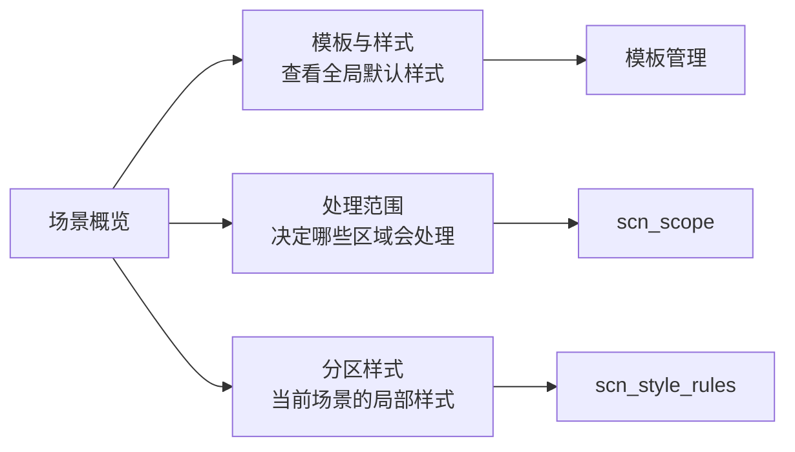

# 分区样式与模板管理一致性深度分析（2026-06-29）

后续进展：第 7.1 节的“同源 owner 状态组件”已在 `docs/refactor-records/样式Owner状态共享化执行记录_2026-06-29.md` 中推进落地；第 7.3 节的批量恢复已在 `docs/refactor-records/分区样式全部跟随模板执行记录_2026-06-29.md` 中推进为 `全部跟随模板` 动作。当前模板管理与分区样式已通过 `StyleOwnerViewState` 和 `StyleOwnerStatusStrip` 共享“来源 / 影响 / 编辑”状态表达。

## 1. 本轮结论

场景规划里的样式功能已经从“处理范围内部的样式覆盖”推进到“独立的分区样式页面”，但距离优秀设计还差在三个点：

1. 用户语言还残留工程词：`样式覆盖`、`覆盖分区`、`已覆盖 0 项` 这类表达解释成本高。
2. 概览链路没有独立入口：用户能看到模板与样式，却不能从概览直接进入当前场景的分区样式调整。
3. 模板管理和场景样式的复用关系还需要显性化：模板管理负责全局默认样式，场景分区样式只负责当前场景的局部偏离。

本轮优化后，用户可见模型统一为：

| 层级 | 用户理解 | 入口 | 控件职责 |
| --- | --- | --- | --- |
| 模板管理 | 全局默认样式 | `模板与样式` / 模板页 | 编辑正文、页面、标题、表格等模板基线 |
| 场景规划 | 当前场景的局部样式 | `分区样式` | 某个分区是否使用独立样式，以及独立样式的具体参数 |
| 处理范围 | 哪些区域会被处理 | `处理范围` | 只控制启用区域，不承载样式编辑 |

## 2. 为什么不再直接叫“样式覆盖”

`override` 是代码实现概念，不适合直接暴露给用户。它的问题是：

- “覆盖”容易被理解成会破坏模板或强制改写全文。
- “已覆盖 0 项”在状态上自相矛盾：既说覆盖，又说 0 项。
- “覆盖分区”没有告诉用户开关打开后会发生什么。

更合适的产品语言是：

| 旧表达 | 新表达 | 原因 |
| --- | --- | --- |
| 样式覆盖 | 分区样式 | 表达功能对象，不暴露实现方式 |
| 覆盖分区 | 独立样式 | 告诉用户开关含义：该分区从模板基线中独立出来 |
| 开启覆盖后可编辑 | 开启独立样式后可编辑 | 解释下一步动作 |
| 已覆盖 0 项 | 已开启独立样式 | 表达状态，不制造数字悖论 |
| 已覆盖 N 项 | 已调整 N 项 | 表达差异数量，更容易理解 |
| 覆盖状态 | 跟随状态 | 对应“跟随模板 / 独立样式”的心智 |

## 3. 板块重新规划

### 3.1 概览页

概览页现在应该承担“分流”职责，而不是堆叠所有规则细节：

- `模板与样式`：查看模板基线，跳到模板管理。
- `分区样式`：编辑当前场景的局部样式，跳到 `scn_style_rules`。
- `处理范围`：只说明多少文档区域会处理，跳到 `scn_scope`。

这让用户能在第一屏就理解：



### 3.2 处理范围页

处理范围页只保留区域开关和范围影响提示。样式说明改为“分区样式在独立页面设置”，避免用户以为样式编辑藏在处理范围下方。

边界：

- 可以做：正文、参考文献、附录等区域是否参与处理。
- 不做：字体、字号、缩进、行距等样式参数。
- 关联：关闭某区域后，对应分区样式会失去编辑条件或被清理。

### 3.3 分区样式页

分区样式页对齐模板管理的控件结构：

1. 顶部摘要：显示跟随状态、当前分区状态、样式边界。
2. 独立样式开关：每个分区一个开关，说明是否从模板基线独立出来。
3. 编辑分区选择器：复用模板样式编辑区的 owner toolbar 模型。
4. 预览：复用 `StylePreview`，展示当前有效样式。
5. 参数表单：复用 `StyleManagementBlock -> StyleEditingSection -> StyleControlSurface -> ParagraphStyleEditor`。

只读态不再铺开完整参数表单，避免用户看到一堆不可编辑控件后不知道为什么不能操作；需要编辑时，先开启对应分区的独立样式。

## 4. 与模板管理保持一致性的策略

一致性不等于把两个页面做成完全一样。真正需要一致的是控件语义和操作节奏：

| 一致性维度 | 模板管理 | 分区样式 | 当前状态 |
| --- | --- | --- | --- |
| 摘要卡 | 模板参数概览 | 跟随状态 / 当前分区 / 样式边界 | 已复用 `SummaryGrid` |
| 样式外壳 | 样式摘要 + 预览 + 参数表单 | 同一套结构 | 已复用 `StyleManagementBlock` |
| 预览控件 | 模板预览 | 分区有效样式预览 | 已复用 `StylePreview` |
| 参数编辑 | 段落样式表单 | 同一套字段与布局 | 已复用 `ParagraphStyleEditor` |
| 所有权表达 | 模板默认样式 | 跟随模板 / 独立样式 | 本轮已修正文案 |
| 导航入口 | 模板页内部入口 | 概览独立入口 + 左侧导航 | 本轮已补齐 |

仍需继续补的不是基础复用，而是更高层的“状态解释复用”：模板页和分区样式页都应该使用同一套 owner 状态展示规则，例如“当前由谁控制”“修改会影响哪里”“为什么不可编辑”。

## 5. 本轮已执行代码调整

### 5.1 用户可见文案

- `SCENE_STYLE_OVERRIDE_SECTION_TITLE` 从 `样式覆盖` 改为 `分区样式`。
- `StyleOverrideToggleList` 默认标题从 `覆盖分区` 改为 `独立样式`。
- readonly hint 从 `开启覆盖后可编辑` 改为 `开启独立样式后可编辑`。
- projection 状态从 `已覆盖 0 项 / 已覆盖 N 项` 改为 `已开启独立样式 / 已调整 N 项`。
- 场景样式摘要从 `覆盖状态` 改为 `跟随状态`。
- 场景样式边界说明改为 `全局默认样式在模板管理中修改。`

### 5.2 概览入口

`build_scene_key_setting_rows()` 新增 `section_style` 行：

- label：`分区样式`
- target：`scn_style_rules`
- status：无独立样式时为 `跟随模板`，有独立样式时为 `已调整`
- summary：无独立样式时为 `全部分区跟随模板`，有独立样式时显示独立分区数量和名称

### 5.3 代码落点

- `src/ui/panels/scene_overview_projection.py`
- `src/ui/panels/scene_summary_projection.py`
- `src/ui/panels/scene_style_override_sections.py`
- `src/config/style_variant_semantics.py`
- `src/shared/ui/style_override_toggle_list.py`
- `src/shared/ui/style_owner_state.py`

### 5.4 测试落点

- `tests/test_scene_overview_projection.py`
- `tests/test_scene_panel_architecture.py`
- `tests/test_style_variant_semantics.py`
- `tests/test_small_widget_architecture.py`

## 6. 验证记录

已通过：

```text
python -X utf8 -m compileall ...
15 passed in 27.03s
39 passed in 10.33s
55 passed in 257.25s
```

其中完整场景面板回归为：

```text
python -X utf8 -m pytest tests/test_scene_panel_architecture.py -q
55 passed in 257.25s (0:04:17)
```

视觉审计截图：

- `docs/visual_audit/2026-06-29/scene_overview_section_style_entry_2026-06-29.png`
- `docs/visual_audit/2026-06-29/scene_style_rules_independent_style_language_2026-06-29.png`

注意：当前截图由 Qt offscreen 生成，布局可验证，但中文字体回退显示为方块，因此文案验证以源码和测试断言为准。

## 7. 后续仍有必要开发的功能

### 7.1 同源 owner 状态组件

现在模板管理和分区样式已经复用底层控件，但“谁控制当前样式”的解释还散在不同状态投影里。建议继续抽出共享 owner 状态组件：

- 控制来源：模板默认 / 当前场景独立样式 / 未启用分区。
- 影响范围：全局模板 / 当前场景 / 当前分区。
- 可编辑原因：可编辑 / 未选择模板 / 分区未启用 / 未开启独立样式。

### 7.2 分区样式与模板预览的对照模式

当前预览只看当前有效样式。优秀设计应支持“和模板对照”：

- 左侧：模板基线。
- 右侧：当前分区有效样式。
- 差异标签：中文字体、字号、缩进、行距等。

这会比单纯显示“已调整 N 项”更可信。

### 7.3 批量恢复和差异确认

当多个分区开启独立样式后，需要：

- 一键恢复全部分区跟随模板。
- 恢复前展示会影响哪些分区。
- 只恢复当前分区或全部分区的明确选择。

### 7.4 概览页状态压缩

后续进展：`模板与样式` 与 `分区样式` 已合并为 `样式来源` 行，并通过 `看模板 / 调分区` 保留两个入口，详见 `docs/refactor-records/场景概览样式来源合并与双跳转执行记录_2026-06-29.md`。

概览页新增分区样式入口后，关键设置从 6 行变成 7 行。后续应继续压缩重复状态：

- 已完成：`风险处理` 与 `人工确认` 已合并为 `风险与确认`，无人工确认时不再单独占一行，详见 `docs/refactor-records/场景概览风险确认合并与第一屏减负执行记录_2026-06-29.md`。
- 已完成：`模板与样式` 与 `分区样式` 已形成一组“样式来源”组合，而不是两个普通列表项。

### 7.5 真实字体截图验证

offscreen 截图无法验证中文文案，需要后续补一个真实 Windows 窗口截图或 Playwright/桌面级截图流程，确保文案、按钮宽度和控件标签在真实字体下也不溢出。

## 8. 当前判断

本轮已经把“样式控件规划与模板管理一致性”的关键链路打通到更合理的层级：

- 模板管理：定义默认样式。
- 场景概览：提供模板样式与分区样式两个入口。
- 处理范围：只管区域是否处理。
- 分区样式：只管当前场景某个分区是否独立，以及独立后如何编辑。

接下来要继续往优秀设计推进，重点不应再是继续堆说明文字，而是做“状态对照、影响范围、批量恢复、真实视觉验证”四件事。
