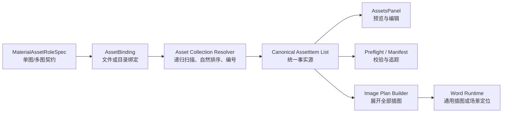

# 图片材料单图/多图分层与链路重构深度分析

日期：2026-07-12

审计对象：当前工作树中的图片材料配置、资料包持久化、目录扫描、运行时插图、试题题图专项链路

文档性质：架构审计、实施记录与验收结论。第 1～21 节保留重构前分析，第 22 节起记录本轮实际落地结果。

## 1. 结论先行

这一块需要重构，但应当做成一次边界清晰的纵向重构，不应推翻整个资料包系统，也不应继续用局部条件分支叠加功能。

用户期望的产品模型是：

1. 图片材料像公文资料字段一样分区展示。
2. 第一类是单图：一个图片角色对应一个文件，例如 Logo、公章、签名、二维码。
3. 第二类是多图文件夹：一个图片角色对应一个目录，目录内允许多层子目录，系统递归收集图片。
4. 多图按稳定、可解释的顺序排列。
5. 系统在资料包内部对图片统一编号和命名，但不破坏用户原始文件。
6. 预览、保存、重新打开、批量执行、Word 插入、Manifest 和问题修复看到的是同一组图片和同一顺序。

当前系统已经具有若干可复用基础：

- `asset_paths` 可以表达角色到单个文件的绑定。
- `asset_items` 可以保存同角色的多条图片记录。
- `scan_asset_collection()` 已经使用 `rglob()` 递归发现图片。
- 资料包导出已经支持复制图片和计算内容摘要。
- Manifest 已经能够按角色聚合同角色的多条 `asset_items`。
- 试题题图已经实现同题多图、`figure_order` 排序和 Word 渲染。

但通用图片链路仍然存在结构性断点：

- Schema 没有表达“单图还是多图”的基数契约。
- UI 没有按单图和多图文件夹分区，也没有角色级文件夹选择器。
- 全局目录扫描只从文件名推断角色，丢失父目录语义。
- 通用运行时按角色构造字典，同角色多张图片最终只剩一张。
- 目录扫描使用普通路径字典序，不是自然顺序。
- 没有递归编号、规范化命名、名称冲突和来源追踪契约。
- 单图槽位显示第一张同角色图片，而通用运行时可能选择最后一张，存在前台与执行结果不一致的风险。
- 试题题图的多图能力是场景专项桥，不是通用图片组能力。

因此，推荐结论为：

> 保留现有资料包、`AssetItem`、Manifest、题图渲染和图片插入模块；重构图片角色契约、角色绑定模型、目录解析服务和通用多图运行时，使“单图/多图”成为从 Schema 到 UI、持久化、预检、执行和报告共同理解的一等语义。

## 2. 本次审计范围

本次按以下链路检查：

```text
Material Schema
    -> AssetsPanel 图片页面
    -> EntityProfile / 资料包 JSON
    -> 目录扫描与 AssetItem 归一化
    -> MaterialExecutionContext
    -> ResolvedConfig.images
    -> image_insertion / 场景专项渲染
    -> Manifest / 预检 / 修复入口
```

重点代码包括：

- `src/config/material_schema_registry.py`
- `src/config/entity.py`
- `src/config/materials.py`
- `src/config/material_context.py`
- `src/config/material_batch.py`
- `src/config/resolved.py`
- `src/ui/panels/assets/image_inventory_presenter.py`
- `src/ui/panels/assets/asset_rows_presenter.py`
- `src/ui/panels/assets/asset_file_operations_presenter.py`
- `src/ui/panels/assets/asset_collection_state_presenter.py`
- `src/ui/panels/assets/scene_spec_presenter.py`
- `src/ui/panels/assets/batch_import.py`
- `src/ui/panels/workbench/exam_question_assets.py`
- `src/ui/panels/workbench/material_artifacts.py`
- `src/modules/insert/image_insertion.py`
- 相关测试文件

审计结论以 2026-07-12 当前工作树为准。当前仓库存在大量未提交改动，因此文档描述的是现场实现，不等同于某个已发布 Tag。

## 3. 需求应如何被准确建模

“单图”和“多图文件夹”不是单纯的两种选择控件，而是两个不同的数据契约。

### 3.1 单图角色

单图角色具备以下语义：

- 一个角色最多绑定一个有效文件。
- 选择入口是文件选择器。
- 运行时生成一个图片插入项。
- 缺失校验按“角色是否有有效文件”判断。
- 典型角色：`logo`、`seal`、`legal_signature`、`qrcode`、`cover`。

### 3.2 多图角色

多图角色具备以下语义：

- 一个角色绑定一个目录或一组显式图片条目。
- 选择入口优先是文件夹选择器，也可以扩展为多文件选择。
- 文件夹支持递归扫描。
- 每张图片必须拥有稳定的组内序号。
- 运行时必须保留全部图片，不能按角色压缩成一张。
- 缺失校验不仅检查角色存在，还可能检查最少张数、文件可读性和顺序冲突。
- 典型角色：资质证书组、产品图片组、案例图片组、附件图片组、试题题图组。

### 3.3 “统一顺序递归命名”的准确含义

建议把它拆成三个独立概念，避免实现混杂：

1. 发现顺序：系统用什么规则遍历目录并得到稳定顺序。
2. 逻辑序号：每张图片在组内的 `sequence`，从 1 开始连续编号。
3. 包内规范名：复制进入资料包后使用的文件名，例如 `qualification_001.jpg`。

原始文件名和原始目录不能直接被修改。规范命名应发生在资料包副本或运行时暂存目录中，并保留 `original_path`、`original_relative_path` 和内容摘要，保证可追溯。

## 4. 当前实现已经具备的能力

### 4.1 数据模型已经隐含单图与重复条目两种形态

`EntityProfile` 当前同时存在：

```python
assets_dir: str
asset_paths: dict[str, str]
asset_items: list[dict[str, Any]]
```

其中：

- `asset_paths` 适合作为单图角色的兼容存储。
- `asset_items` 可以表达同角色的重复图片。
- `assets_dir` 是一个全局集合目录，但没有明确属于哪个角色。

这说明不需要从零创建图片条目模型，但需要解决三套来源并存、语义未分层的问题。

### 4.2 单图选择到 Word 插入的链路已经闭合

现有单图链路为：

```text
角色槽位选择图片
    -> self._asset_paths[role]
    -> asset_items_from_role_paths()
    -> AssetItem
    -> build_image_insertions()
    -> ImageInsertionItem
    -> ResolvedConfig.images
    -> ImageInsertionModule.add_picture()
```

这条链适合保留。需要改变的是它对多图的处理方式，而不是重新实现单图插入。

### 4.3 已经支持递归发现图片

`scan_asset_collection()` 使用：

```python
for path in sorted(root.rglob("*")):
```

因此底层已经具备递归发现能力。缺口不在“能不能递归”，而在：

- 递归结果属于哪个角色；
- 如何做自然排序；
- 如何生成稳定条目 ID；
- 如何保存组信息；
- 如何在运行时保留全部条目。

### 4.4 Manifest 已经可以保存同角色多项

`material_artifacts.py` 会构造 `items_by_role: dict[str, list]`，并把同角色条目完整写入 `asset_roles[].items` 和 `asset_items`。

这部分与目标方向一致，后续只需要补充：

- `cardinality`
- `source_kind`
- `group_id`
- `sequence`
- `normalized_name`
- `original_relative_path`
- 排序与命名策略

### 4.5 试题题图已经证明多图顺序链可行

试题题图专项链已经实现：

```text
同角色多条 question_figure AssetItem
    -> question_id / question_index 定位题目
    -> figure_order 排序
    -> 注入 exam JSON figure list
    -> Word 按顺序渲染全部图片
```

这条链证明 `asset_items + metadata + 稳定排序 + 场景注入` 的方向可行。需要抽取的是通用的“组内排序、条目身份、全部消费”能力，而不是把考试字段直接复制到所有图片类型。

## 5. 当前链路的结构性断点

### 5.1 Schema 只能描述角色，不能描述基数和来源

`MaterialAssetRoleSpec` 当前只有：

```python
role
label
required
accepted_types
archive_dir
```

它无法回答：

- 这是单图还是多图；
- 应选择文件还是文件夹；
- 是否递归；
- 最少需要几张；
- 按什么顺序；
- 资料包内如何命名；
- 多图应该插到哪个锚点，以及锚点出现多次时如何处理。

因此 UI 只能根据“是否接受附件格式”把角色分成图片槽位或附件槽位，不能生成真正的单图区和多图区。

### 5.2 全局图片目录不是角色级多图目录

当前页面顶部存在一个全局“图片目录”。该目录中的图片会被递归扫描，但角色来自 `path.stem`。

例如：

```text
资质证书/
  01.jpg
  A类/02.jpg
```

会得到角色 `01` 和 `02`，不会得到一个角色为 `qualification`、内部有两项的图片组。父目录层级没有进入 `AssetItem`。

因此当前全局图片目录只是“按文件名约定角色的图片集合”，不是“某角色绑定的多图文件夹”。

### 5.3 普通字典序不能代表业务顺序

`sorted(Path)` 是路径字典序。典型结果可能是：

```text
1.jpg
10.jpg
2.jpg
```

目录层级、数字片段、中文名称、大小写和前导零都会影响结果。若不定义自然排序契约，同一组图片的顺序很难让用户预测，也可能因命名调整发生变化。

### 5.4 扫描后条目身份存在碰撞风险

扫描器当前把文件名 stem 同时作为 `item_id` 和 `role`。不同目录下存在同名文件时，例如：

```text
A/01.jpg
B/01.png
```

两个条目会得到相同 `item_id=01`、`role=01`。虽然列表层面可能同时存在，但后续按角色建字典、状态显示、元数据按角色覆盖时会发生语义冲突。

### 5.5 UI 显示与通用执行的取图策略不一致

角色槽位查找路径时，会从 `asset_items` 正向遍历，取第一张匹配图片。

通用运行时 `build_image_insertions()` 则先构造：

```python
by_role = {item.role: item for item in asset_items if item.role and item.path}
```

同角色多条数据会以后面的条目覆盖前面的条目。

因此存在以下风险：

```text
UI 缩略图显示组内第一张
运行时实际插入组内最后一张
```

这不仅是多图缺失，也是前台预览与实际输出不一致的问题，应列为重构的高优先级原因。

### 5.6 通用执行模型只能消费单张

`build_image_insertions()` 对每条规则只从 `by_role` 取一个 `AssetItem`。即使 `asset_items` 保存了十张同角色图片，`ResolvedConfig.images` 通常也只会得到一张。

`ImageInsertionItem` 自身是单张图片载荷，这本身没有问题；问题是上游没有把图片组展开为有序的多个 `ImageInsertionItem`。

正确方向应该是：

```text
一个多图角色绑定
    -> 解析为 N 个有序 AssetItem
    -> 规则解析为 N 个有序 ImageInsertionItem
    -> 插入模块逐项消费
```

而不是让 `ImageInsertionItem` 本身承担目录扫描。

### 5.7 资料包复制存在两套命名语义

现有资料包导出：

- 对 `assets_dir` 中的文件递归复制并保留原相对路径与名称。
- 对显式 `asset_items` 则按 `item_id` 复制到扁平的 `items` 目录。

这两条路径没有共享统一的命名策略。相同业务图片通过不同入口进入资料包，最终目录结构和文件名可能不同。

### 5.8 完整多图能力被锁在考试专项链

`exam_question_assets.py` 可以按 `figure_order` 处理同题多图，但只有使用 `exam_items_v1` Schema 时才执行。

这意味着：

- 题图多图可完整渲染；
- 资质证书组、产品图片组、案例图片组仍会走通用单图路径；
- 新增一种多图业务角色时，容易继续复制专项桥，形成更多平行链路。

应把通用能力下沉到材料资产域，考试层只保留“如何把图片组映射到具体题目”的业务定位逻辑。

### 5.9 缺失校验只认角色存在，不认组完整性

当前必需图片检查主要把已有角色放进集合，再判断必需角色是否存在。它无法表达：

- 多图组最少需要 2 张；
- 目录存在但没有有效图片；
- 部分图片无法读取；
- 顺序重复或断号；
- 规范命名发生冲突；
- 图片组中混入不支持格式；
- 同一角色同时绑定单图和目录。

多图进入主链前，预检模型必须从“角色是否存在”升级为“角色绑定是否满足契约”。

## 6. 是否可以只打补丁而不重构

### 6.1 方案 A：只在 UI 增加文件夹按钮

做法：在资质证书等行旁增加“选择文件夹”，继续把路径放入 `asset_paths`。

问题：

- `asset_paths` 下游按文件路径处理，目录无法直接 `add_picture()`。
- MIME 类型和缩略图逻辑面向文件。
- 通用运行时仍按角色只保留一项。
- 资料包导出、预检、Manifest 和批量执行不会自动获得图片组语义。

结论：不可取。这会形成“界面看起来支持，执行链并不支持”的假闭环。

### 6.2 方案 B：在 `build_image_insertions()` 中遇到目录就扫描

做法：如果 `item.path` 是目录，在运行时临时 `rglob()` 并展开。

问题：

- 扫描和排序发生得太晚，UI、预览、Manifest 和预检看不到最终条目。
- 资料包保存后无法确认顺序是否稳定。
- 无法为单张图片保存元数据、替换记录和来源路径。
- 每次执行重新扫描，目录内容变化可能导致同一资料包输出不同。

结论：不可取。目录解析必须发生在材料归一化阶段，不应隐藏在 Word 插入模块中。

### 6.3 方案 C：为每个多图业务角色写专项逻辑

做法：参考 `question_figure`，分别增加 `qualification_images`、`product_images`、`case_images` 等专项链。

问题：

- 重复实现排序、预览、替换、Manifest、预检和迁移。
- 每新增一个角色都要修改多个层级。
- 角色数量增长后会复制出多套不一致语义。

结论：不可取。考试题图的专项定位逻辑可以保留，但图片组基础设施必须通用化。

### 6.4 推荐方案：边界明确的纵向重构

推荐同时打通以下五层：

1. Schema：声明单图或多图及其策略。
2. Binding：保存角色绑定的是文件还是目录。
3. Resolver：把绑定统一解析成有序 `AssetItem`。
4. Runtime：把同角色全部条目展开为插入计划。
5. UI/Manifest/Preflight：共同消费解析后的事实源。

这一方案改动面比“加一个按钮”大，但可以避免后续持续复制特殊分支，整体风险反而更可控。

## 7. 推荐目标架构



核心原则：

- Schema 决定角色契约。
- Binding 记录用户选择。
- Resolver 负责文件系统到材料条目的转换。
- `AssetItem` 是 UI、预检、报告和运行时共同使用的解析事实。
- Word 插入模块只消费明确的插入计划，不负责扫描目录或猜测角色。

## 8. 推荐数据模型

### 8.1 扩展角色契约

建议为 `MaterialAssetRoleSpec` 增加以下字段：

```python
@dataclass(frozen=True, slots=True)
class MaterialAssetRoleSpec:
    role: str
    label: str
    required: bool = True
    accepted_types: tuple[str, ...] = ("image",)
    archive_dir: str = ""

    cardinality: str = "single"          # single | multiple
    source_kind: str = "file"            # file | directory | files
    recursive: bool = False
    min_items: int = 0
    max_items: int | None = 1
    order_policy: str = "natural_path"   # natural_path | metadata | manual
    naming_template: str = "{role}_{sequence:03d}"
```

约束建议：

- `single` 默认 `source_kind=file`、`max_items=1`。
- `multiple` 默认 `source_kind=directory`、`recursive=True`、`max_items=None`。
- `required=True` 且为多图时，默认 `min_items=1`。
- Schema 加载阶段校验不合法组合，避免 UI 和运行时分别猜测。

### 8.2 引入角色绑定对象

不建议把目录直接塞进 `asset_paths`。建议引入统一绑定：

```python
@dataclass(slots=True)
class AssetBinding:
    role: str = ""
    cardinality: str = "single"
    source_kind: str = "file"
    source_path: str = ""
    recursive: bool = False
    order_policy: str = "natural_path"
    naming_template: str = "{role}_{sequence:03d}"
```

`EntityProfile` 建议新增：

```python
asset_bindings: dict[str, AssetBinding]
```

兼容关系：

- 旧 `asset_paths[role]` 迁移为 `AssetBinding(cardinality="single", source_kind="file")`。
- 旧全局 `assets_dir` 保留为 legacy collection，不自动猜成某个多图角色。
- 旧 `asset_items` 继续可读，并作为显式条目来源。

### 8.3 让 `AssetItem` 具备通用图片组身份

建议把常用的通用字段从自由 `metadata` 提升为明确字段，至少包括：

```python
group_id: str = ""
sequence: int | None = None
source_path: str = ""
original_relative_path: str = ""
normalized_name: str = ""
content_hash: str = ""
```

`metadata` 继续保存场景扩展，例如：

- 题图的 `question_id`、`question_index`、`figure_order`。
- 图片说明、标题、来源和版权提示。
- 业务证书编号等非通用字段。

这样可以避免所有图片组都借用 `figure_order` 这个考试术语。

### 8.4 资料包版本

当前 `ENTITY_PACKAGE_VERSION = 1`，加载器只接受 0 和 1，未来版本会被拒绝。

如果新增 `asset_bindings` 并把它作为正式持久化契约，建议升级资料包版本，而不是在 v1 中静默改变字段语义。迁移应满足：

- v0/v1 继续非破坏性读取。
- 读取旧包时在内存中生成兼容绑定。
- 未明确保存前不回写原文件。
- 保存新包时写入新版本和标准化绑定。
- 对未来未知版本继续拒绝，避免误读。

## 9. 多图目录解析与规范命名算法

### 9.1 扫描阶段

输入：角色绑定、Schema 契约、目录路径。

输出：有序 `AssetItem` 列表和诊断结果。

推荐步骤：

1. 校验目录存在并可读。
2. 根据 `recursive` 选择 `iterdir()` 或 `rglob()`。
3. 仅保留允许的图片扩展名。
4. 计算相对路径并进行路径安全检查。
5. 使用自然排序键排序。
6. 从 1 开始分配连续 `sequence`。
7. 生成稳定 `item_id` 和 `normalized_name`。
8. 计算内容摘要，识别重复内容。
9. 输出可消费条目和非阻断/阻断诊断。

### 9.2 自然排序建议

自然排序应基于规范化相对路径，而不是只看文件名：

```text
一级目录片段
    -> 二级目录片段
        -> 文件名片段
```

每个片段将连续数字转为整数比较：

```text
1.jpg < 2.jpg < 10.jpg
A2/1.jpg < A10/1.jpg
```

同时明确：

- 大小写归一化。
- Unicode 文本使用稳定归一化。
- 原始相对路径作为最终稳定兜底键。
- 排序结果写入条目 `sequence`，资料包保存后不再依赖每次重新猜测。

### 9.3 规范命名建议

默认模板：

```text
{role}_{sequence:03d}{suffix}
```

示例：

```text
qualification_001.jpg
qualification_002.png
qualification_003.jpg
```

需要保留原扩展名，除非后续明确增加格式转换功能。重名处理不能靠覆盖，应在生成计划阶段直接报告冲突。

### 9.4 不修改原文件

禁止在用户选中的源目录中直接批量 `rename()`。推荐流程：

```text
源目录只读扫描
    -> 生成命名预览
    -> 用户确认/自动接受
    -> 复制到资料包暂存目录
    -> 原子替换资料包目标目录
```

理由：

- 用户源目录可能被其他文档引用。
- 重命名失败可能造成半完成状态。
- OneDrive、网络盘和权限环境下原地改名风险更高。
- 复制后命名便于回滚和审计。

### 9.5 增量刷新

重新扫描同一个目录时，优先使用以下身份保持序号稳定：

1. 内容摘要相同且原相对路径相同。
2. 内容摘要相同但路径变化，标记为“疑似移动/重命名”。
3. 新内容追加到序列末尾，除非用户明确选择“按路径重新排序”。

这能避免仅新增一张图片导致整组文件重新编号。如果产品希望每次都严格按路径重排，也应作为显式策略，而不是隐含行为。

## 10. UI 重构建议

### 10.1 复用资料字段的分区语言，不直接复用字段状态

资料页面当前有“固定字段”和“自由字段”两个清晰区块。图片页可以复用同样的视觉分组和动态列表控制器，但语义应改为：

```text
单图
  1 Logo
  2 公章
  3 法人签名

多图文件夹
  1 资质证书组       已发现 12 张
  2 产品图片组       已发现 6 张
```

不要把图片类型写入 `field_scopes`。字段的 fixed/floating 与图片的 single/multiple 是不同领域语义。

### 10.2 单图行

保留现有缩略图、选择、查看原图、打开和清除按钮。增加：

- 明确“单图”标识。
- 当同角色出现多条数据时显示冲突，而不是静默选第一张或最后一张。
- 状态和执行计划使用同一个解析结果。

### 10.3 多图文件夹行

建议包含：

- 文件夹路径。
- 递归开关或由 Schema 固定。
- 图片数量。
- 排序策略摘要。
- 命名预览，例如 `qualification_001 … qualification_012`。
- 打开目录、查看清单、重新扫描、清除。
- 首图缩略图和组预览入口。
- 错误摘要：不支持格式、空目录、重复内容、不可读文件等。

### 10.4 多图清单

建议使用独立明细表或抽屉，列出：

| 序号 | 规范名 | 原相对路径 | 预览 | 状态 |
| --- | --- | --- | --- | --- |
| 1 | qualification_001.jpg | 一级/1.jpg | 缩略图 | 可用 |
| 2 | qualification_002.png | 一级/A类/2.png | 缩略图 | 可用 |

拖动排序如果不是首期必须功能，可以暂缓。首期只要稳定自然排序、顺序预览和重新扫描即可。

### 10.5 全局图片目录的去留

现有全局“图片目录”不应直接删除，以免破坏旧资料包和按文件名角色扫描的使用方式。建议：

- 暂时保留为“兼容图片集合”。
- 在新分区中降低其视觉优先级。
- 新 Schema 角色优先使用明确的单图/多图绑定。
- 当新绑定与兼容目录产生同角色图片时，按明确优先级解析并报告来源冲突。
- 完成迁移后再评估是否隐藏或移除全局入口。

## 11. 运行时重构建议

### 11.1 统一解析事实源

建议新增类似以下服务：

```python
resolve_asset_bindings(profile, schema) -> AssetResolution
```

输出包含：

```python
items: list[AssetItem]
diagnostics: list[AssetDiagnostic]
bindings: list[ResolvedAssetBinding]
```

UI、批量执行、Manifest、预检和 Word 计划都使用该解析结果，避免各层自行扫描或自行决定取第一张/最后一张。

### 11.2 通用插图计划应按角色保留列表

将当前：

```python
by_role: dict[str, AssetItem]
```

改为：

```python
items_by_role: dict[str, list[AssetItem]]
```

然后根据规则和角色基数生成：

```python
list[ImageInsertionItem]
```

每个多图条目都生成独立插入项，并携带：

- `role`
- `item_id`
- `group_id`
- `sequence`
- `path`
- `position`
- `width_cm`

如不希望立即扩展 `ImageInsertionItem`，也至少应保证展开后的顺序和路径完整；但从审计和报告角度看，补充身份字段更稳妥。

### 11.3 明确多图锚点语义

单图占位符 `{{logo}}` 通常替换为一张图。多图占位符需要明确：

- 同一锚点处连续插入全部图片。
- 每张图独立段落还是同段排列。
- 图片间距和分页策略。
- 占位符出现多次时是全部重复插入、只处理第一次，还是报冲突。
- 空图片组时删除占位符、保留占位符还是阻断执行。

建议首期使用保守规则：

```text
一个多图角色对应一个锚点；
处理第一个精确锚点；
每张图片独立段落；
按 sequence 插入；
多个同名锚点报告歧义，不静默重复。
```

后续再通过规则字段扩展布局。

### 11.4 考试题图专项链的保留边界

保留：

- 用 `question_id`、`question_index` 定位具体题目。
- 将图片组映射为题目 `figure` 列表。
- 题图特有的 Alt Text、题号错配和修复诊断。

下沉到通用资产服务：

- 同角色多条条目聚合。
- `sequence` 和稳定排序。
- 文件存在性和格式校验。
- 规范名、原相对路径、内容摘要。
- Manifest 基础条目结构。

这样考试仍然保留业务特性，但不再独占多图基础能力。

## 12. 来源优先级与冲突规则

当前图片可能来自：

1. 新 `asset_bindings`。
2. 旧 `asset_paths`。
3. 显式 `asset_items`。
4. 兼容全局 `assets_dir` 扫描。
5. 批量 CSV/XLSX/JSON 导入。
6. 场景运行时显式 `images`。

如果不定义优先级，重构后仍可能重复或覆盖。建议：

```text
运行时显式 images
    > 新 asset_bindings 的解析条目
    > 显式 asset_items
    > 旧 asset_paths
    > 兼容 assets_dir 扫描
```

但“优先”不等于静默丢弃。发生以下情况时应给出诊断：

- 单图角色有两个不同来源。
- 单图角色解析到多张。
- 多图角色同时绑定目录和显式条目，但没有声明合并策略。
- 相同内容从两个来源重复进入。
- 相同 `item_id` 指向不同内容。

建议默认合并策略：

- 单图：高优先级覆盖，产生可见冲突提示。
- 多图：默认不跨来源自动合并；要求用户选择“替换”或显式允许“追加”。

## 13. 预检、报告和可追溯性

### 13.1 新增通用诊断

建议至少包含：

- `asset_binding_missing`
- `asset_directory_missing`
- `asset_directory_empty`
- `asset_file_unreadable`
- `asset_file_type_unsupported`
- `asset_single_role_multiple_items`
- `asset_group_below_min_items`
- `asset_group_above_max_items`
- `asset_group_sequence_conflict`
- `asset_normalized_name_conflict`
- `asset_duplicate_content`
- `asset_source_conflict`
- `asset_anchor_missing`
- `asset_anchor_ambiguous`

### 13.2 Manifest 补充字段

角色级：

```json
{
  "role": "qualification",
  "cardinality": "multiple",
  "source_kind": "directory",
  "recursive": true,
  "order_policy": "natural_path",
  "naming_template": "{role}_{sequence:03d}",
  "item_count": 12
}
```

条目级：

```json
{
  "item_id": "qualification:001",
  "role": "qualification",
  "group_id": "qualification",
  "sequence": 1,
  "path": ".../qualification_001.jpg",
  "normalized_name": "qualification_001.jpg",
  "original_relative_path": "一级/A类/1.jpg",
  "sha256": "..."
}
```

### 13.3 修复入口

通用多图诊断的修复目标应落到：

- `asset_binding`
- `asset_group`
- `asset_item`
- `image_anchor`

题图可以继续使用 `question_figure_item`，但应与通用 `asset_item` 共享底层路径、顺序和文件诊断。

## 14. 迁移策略

### 14.1 兼容读取

读取旧资料包时：

- `asset_paths` 转为单图绑定。
- `asset_items` 原样归一化为显式条目。
- `assets_dir` 保留为兼容集合来源。
- 不根据目录名自动猜测业务角色，避免错误迁移。

### 14.2 新旧字段并行期

建议至少保留一个兼容周期：

- 内存事实源使用新绑定和解析结果。
- 保存新版资料包时写入 `asset_bindings`。
- 如需旧版兼容，可以同步投影单图到 `asset_paths`，但必须明确它是兼容输出，不再是内部事实源。
- 多图不要降级写入 `asset_paths`。

### 14.3 迁移工具

可提供一个非破坏性迁移预览：

```text
检测到旧单图角色 5 项
检测到兼容图片目录 1 个
检测到重复题图 12 项
可迁移为单图绑定 5 项
可迁移为显式多图条目 12 项
全局目录保持兼容来源，不自动归类
```

只有用户保存时才写新版包。

## 15. 分阶段实施建议

### P0：锁定契约和回归基线

目标：先防止现状继续分叉。

- 为同角色多条图片补充回归测试，明确当前 UI 第一张/运行时最后一张的不一致。
- 为递归扫描的普通字典序补充测试。
- 为不同子目录同名文件补充身份碰撞测试。
- 固定旧资料包 v0/v1 非破坏性读取测试。
- 固定题图同题多图测试。

这一阶段不改 UI。

### P1：领域契约和目录解析服务

目标：建立单图/多图一等语义。

- 扩展 `MaterialAssetRoleSpec`。
- 新增 `AssetBinding`、`AssetResolution`、通用诊断模型。
- 实现自然排序、序号、规范名和内容摘要。
- 统一解析 `asset_paths`、`asset_items`、`assets_dir` 和新绑定。
- 保证解析服务无 Qt 依赖。

### P2：持久化和资料包版本迁移

目标：保证选择结果可稳定重开和跨机器使用。

- 增加新版资料包契约。
- 实现 v0/v1 到新版的内存迁移。
- 多图复制后规范命名，保留来源信息。
- 使用暂存目录和原子替换，避免半成品资料包。
- 更新资源隔离与移动资料包测试。

### P3：图片页面分区

目标：实现用户看到的“单图”和“多图文件夹”。

- 复用资料字段区块的标题、计数、动态列表和分隔样式。
- 保留现有单图行组件。
- 新增多图文件夹行和图片清单。
- UI 只展示 `AssetResolution`，不自行扫描和排序。
- 全局图片目录降级为兼容入口。

### P4：通用运行时多图闭环

目标：让非考试场景也能完整消费多图。

- `build_image_insertions()` 按角色保留列表并全部展开。
- 明确多图锚点、段落和歧义规则。
- `ImageInsertionItem` 补充条目身份信息。
- Manifest、执行报告和 `inserted_images` 保留序号。
- 验证资质、产品、案例等至少一个非考试多图场景。

### P5：题图链路复用与清理

目标：减少平行实现。

- 题图使用通用组内排序和文件诊断。
- 保留题目定位与题图业务诊断。
- 删除通用链已经接管的重复 helper。
- 评估旧全局目录入口和兼容字段的后续去留。

## 16. 预计涉及的代码边界

建议修改或新增：

| 层级 | 主要位置 | 责任 |
| --- | --- | --- |
| Schema | `src/config/material_schema_registry.py` | 单图/多图契约 |
| 持久化 | `src/config/entity.py` | Binding、版本、复制命名、迁移 |
| 解析服务 | 建议新增 `src/config/asset_resolution.py` 或 `src/services/material_assets/collection_resolution.py` | 扫描、排序、编号、诊断 |
| 现有材料服务 | `src/config/materials.py` | 保留基础模型，移除按角色压单张语义 |
| 批量上下文 | `src/config/material_batch.py` | 统一调用解析服务 |
| 运行上下文 | `src/config/material_context.py` | 传递规范化条目和插图计划 |
| UI Schema 投影 | `src/ui/panels/assets/scene_spec_presenter.py` | 根据 cardinality 分区 |
| UI 行 | 建议新增 `asset_group_rows_presenter.py` | 多图文件夹行与清单 |
| UI 文件操作 | `asset_file_operations_presenter.py` | 单图文件与多图目录操作分开 |
| 执行计划 | `src/config/materials.py` 或独立 image plan builder | 同角色多项展开 |
| Word 插入 | `src/modules/insert/image_insertion.py` | 消费有序插图计划 |
| 题图专项 | `src/ui/panels/workbench/exam_question_assets.py` | 只保留题目定位语义 |
| Manifest | `src/ui/panels/workbench/material_artifacts.py` | 输出组、序号和规范名 |
| Preflight | `src/ui/panels/workbench/material_preflight.py` | 通用图片组诊断 |

不建议继续把主要逻辑直接堆入 `assets_panel.py`。目录解析、自然排序、规范命名和迁移必须是无 UI 依赖的服务。

## 17. 测试与验收标准

### 17.1 模型与迁移

- v0/v1 资料包可非破坏性读取。
- 旧 `asset_paths` 正确迁移为单图绑定。
- 新版资料包保存、重新加载后绑定、条目和顺序不变。
- 未知未来版本继续被拒绝。

### 17.2 目录解析

- 递归和非递归行为分别可测。
- `1、2、10` 按自然顺序排列。
- 不同子目录同名文件具有唯一 `item_id`。
- 不支持格式被忽略并产生诊断。
- 空目录、缺目录和不可读文件有明确状态。
- 原始目录没有被重命名或修改。

### 17.3 UI

- 图片页明确显示“单图”和“多图文件夹”两个区块。
- Schema 为 single 的角色只出现文件选择入口。
- Schema 为 multiple 的角色只出现目录/多文件入口。
- 多图计数、顺序预览和执行顺序一致。
- 清除和重新扫描不会残留旧条目。
- 同角色来源冲突可见，不静默覆盖。

### 17.4 运行时

- 单图行为与现有输出一致。
- 多图角色 N 张图片生成 N 个有序插图项。
- 运行结果、`inserted_images`、Manifest 的数量与顺序一致。
- 多图锚点缺失或重复时产生可定位诊断。
- 非考试场景至少有一条真实多图 Word 输出回归。
- 现有考试同题多图测试继续通过。

### 17.5 资料包隔离

- 包内文件使用规范名。
- 包内条目保留原相对路径和摘要。
- 移动整个资料包后仍能解析并执行。
- 同一源目录重新导出不会产生无意义的顺序漂移。

## 18. 风险清单与控制措施

| 风险 | 影响 | 控制措施 |
| --- | --- | --- |
| 旧资料包兼容失败 | 历史资料无法打开 | 版本化迁移、非破坏读取、夹具回归 |
| 单图行为回归 | Logo、公章等输出变化 | 单图黄金测试保持不变 |
| 同角色来源冲突 | UI 与执行不一致 | 单一解析事实源、显式优先级和诊断 |
| 自然排序规则变化 | 多图顺序漂移 | 首次解析写入 sequence，策略版本化 |
| 原地重命名损坏源文件 | 用户数据风险 | 只读扫描、复制后规范命名 |
| 大目录扫描卡 UI | 前台无响应 | 服务层扫描、可取消任务、增量摘要缓存 |
| 重复内容导致资料包膨胀 | 输出体积增加 | 内容摘要诊断，后续可选去重 |
| 题图专项被误泛化 | 考试定位能力回归 | 只下沉组基础能力，保留题目定位层 |
| 规则语义不清 | 多锚点输出不可预测 | 首期采用保守、可报错的确定规则 |

## 19. 不应纳入本轮重构的范围

为控制边界，以下能力不应与单图/多图基础重构捆绑：

- AI 识图或自动判断图片业务含义。
- OCR、证书真实性或资质有效性判断。
- 图片内容质量评分和版权判断。
- 远端素材库写回、企业权限和主数据治理。
- 任意复杂的相册排版设计器。
- 原始图片格式批量转换和压缩。
- 对用户源目录执行原地批量重命名。

这些能力可以以后消费稳定的图片组模型，但不应阻塞本地核心闭环。

## 20. 重构前基线验证证据

重构前审计运行了以下定向测试：

```text
tests/test_material_execution_context.py::test_asset_collection_scan_and_rules_build_image_insertions
tests/test_material_execution_context.py::test_material_context_expands_asset_rules_into_resolve_images
tests/test_material_execution_context.py::test_workbench_runner_maps_multiple_question_figure_assets_by_question_metadata
tests/test_material_execution_context.py::test_workbench_runner_appends_same_question_figure_group_by_order
```

结果：`4 passed`。

这些测试证明：

- 递归图片扫描基础可用。
- 单图规则转换可用。
- 题图多图映射和排序可用。

它们不能证明通用多图目录闭环已经存在；相反，代码审计显示通用 `build_image_insertions()` 仍会把同角色条目压缩为一张。

## 21. 最终建议

建议立项为“图片材料基数与绑定模型重构”，而不是“图片页面增加文件夹按钮”。

推荐优先级：

1. 先修正同角色多图在 UI 与执行中取图不一致的问题。
2. 再建立 Schema 基数和角色绑定契约。
3. 再实现无 UI 依赖的递归扫描、自然排序、编号和复制命名服务。
4. 然后落地单图/多图文件夹双区 UI。
5. 最后打通非考试场景的通用多图 Word 输出，并让题图复用基础服务。

这次重构完成的判断标准不是“界面出现了两个标题”，而是：

> 同一个多图文件夹从选择、扫描、排序、编号、保存、重开、预览、预检、Manifest 到 Word 输出，图片数量、条目身份和顺序始终一致；源目录不被修改；旧单图资料包继续可用。

## 22. 实施结论（2026-07-12）

本轮已按第 15 节 P0～P5 完成图片材料纵向重构，结论由“建议重构”更新为“主链已实施并通过需求级验收”。

最终落地的事实源为：

```text
MaterialAssetRoleSpec
    -> AssetBinding
    -> asset_resolution（无 Qt）
    -> 有序 AssetItem + AssetDiagnostic
    -> UI / MaterialExecutionContext / Preflight / Manifest
    -> 有序 ImageInsertionItem
    -> Word 连续插图
```

完成状态：

| 阶段 | 状态 | 落地结果 |
| --- | --- | --- |
| P0 回归基线 | 完成 | 固定递归扫描、同角色多条、旧包、题图多图等行为 |
| P1 领域契约与解析 | 完成 | 单图/多图、文件/目录、递归、自然排序、编号、规范名、摘要和诊断成为一等语义 |
| P2 持久化与迁移 | 完成 | 资料包升级为 v2；v0/v1 兼容读取；暂存目录、原子替换和失败回滚 |
| P3 UI 分层 | 完成 | 图片页明确拆成“单图”和“多图文件夹”；多图显示路径、数量、顺序、规范名和状态 |
| P4 通用运行时 | 完成 | 非考试多图按序展开并在同一锚点连续插入；预检和 Manifest 同步保留身份 |
| P5 题图复用 | 完成 | 题图复用通用 sequence 解析；题号定位、错配和修复仍保留在考试业务层 |

## 23. 实际代码落点

### 23.1 契约与统一解析

- `src/config/material_schema_registry.py`
  - `MaterialAssetRoleSpec` 增加 `cardinality`、`source_kind`、`recursive`、`min_items`、`max_items`、`order_policy`、`naming_template`。
  - 资质证书、产品图片、案例图片、教学图、技术图等角色声明为多图；Logo、公章、签名等继续为单图。
- `src/config/entity.py`
  - 新增 `AssetBinding`，保存文件或目录来源、扫描策略、计数约束、快照条目和快照修订值。
  - `EntityProfile` 新增 `asset_bindings`。
- `src/config/asset_resolution.py`
  - 新增无 Qt 的统一解析服务。
  - 支持递归/非递归扫描、NFKC + casefold 自然路径排序、连续 sequence、稳定 `role:001` 条目 ID、包内规范名、SHA-256 内容摘要和重复内容识别。
  - 来源优先级落实为：新绑定 > 显式 `asset_items` > 旧 `asset_paths` > 兼容 `assets_dir`；发生冲突时给出可见诊断，不跨来源静默合并。
  - 目录缺失、目录为空、目录不可读、文件不可读、不支持格式、数量越界、内容重复、快照过期等均转为结构化诊断。

### 23.2 持久化与包隔离

- 资料包版本由 v1 升级为 v2。
- v0/v1 加载时仅在内存中把旧 `asset_paths` 投影为单图绑定；加载动作不回写源文件。
- 新包把多图复制到 `assets/<profile>/groups/<role>/`，使用 `role_001.ext` 规范名，同时保留原相对路径和内容摘要。
- 导出先写同级 staging 目录，再交换目标目录；失败时恢复旧目录并清理 staging/backup。
- 单图 `asset_paths` 继续作为兼容投影；多图不降级写入该字段。

### 23.3 UI 分层

- 新增 `AssetGroupSpec` 与 `asset_group_rows_presenter.py`。
- 图片页保留低优先级“兼容图片集合”，并明确增加：
  - “单图”区：继续使用现有文件选择、缩略图、查看、打开和清除链路。
  - “多图文件夹”区：按 Schema 动态生成目录行，支持选择目录、重新扫描、打开、清除和选中条目预览。
- 多图清单列为“序号 / 包内名称 / 原相对路径 / 状态”，显示解析后的真实顺序，不在 UI 内另行扫描或排序。
- 同角色多来源冲突显示在图片材料状态摘要中。
- 批量 JSON 及扁平列（例如 `qualificationFolder`、`productImageDirectory`）可导入角色目录绑定。

### 23.4 运行时、预检和报告

- `AssetItem`、`ImageInsertionItem` 和 `AssetInsertionRule` 已补充组、序号、规范名、基数和锚点策略字段。
- `build_image_insertions()` 改为按角色保留列表：
  - 单图确定性取第一项，保持旧行为；
  - 多图按 sequence 展开全部 N 项。
- `image_insertion.py` 在首个精确锚点处插入首图，后续图片紧随前一图片新增独立段落，保证整组连续，不漂移到文末。
- 多图锚点缺失或重复会产生 `image_anchor` 可定位诊断。
- 通用预检覆盖数量、单图多项、断言冲突、文件状态、来源冲突和目录状态；解析诊断会进入执行结果和 material manifest。
- Manifest 角色级保存基数、来源种类、递归、顺序、命名和数量；条目级保存组、序号、规范名、原相对路径和摘要；`inserted_images` 保存对应身份。

### 23.5 题图复用边界

- 题图排序读取通用 `asset_sequence_value()`，并继续兼容旧 `figure_order` 元数据。
- 同题多图的题目定位、Alt Text、题号错配、人工比对和修复入口仍由考试专项服务负责。
- `question_figure` 保持专用多文件 UI，不再额外生成通用目录行，避免同一题图被两套 UI 或两套插入规则重复消费。

## 24. 第 17 节验收矩阵

### 24.1 模型与迁移

| 验收项 | 结果 | 证据 |
| --- | --- | --- |
| v0/v1 非破坏性读取 | 通过 | 未版本包、v1 包迁移测试 |
| 旧 `asset_paths` -> 单图绑定 | 通过 | v1 读取后 `cardinality=single`、`source_kind=file` |
| 新包保存/重载顺序不变 | 通过 | v2 round-trip、绑定快照与 UI archive round-trip |
| 未知未来版本拒绝 | 通过 | v3 返回 `material_package_version_unsupported:3` |

### 24.2 目录解析

| 验收项 | 结果 | 证据 |
| --- | --- | --- |
| 递归与非递归 | 通过 | 两类扫描用例分别覆盖 |
| `1、2、10` 自然排序 | 通过 | 多层 `A2/A10` 与数字文件名用例 |
| 子目录同名文件身份唯一 | 通过 | `A2/1.jpg`、`A10/1.jpg` 生成不同连续 ID |
| 不支持格式 | 通过 | 跳过并产生 `asset_file_type_unsupported` |
| 空、缺、不可读 | 通过 | `asset_directory_empty`、`asset_directory_missing`、`asset_file_unreadable`；不可读项被跳过后重新连续编号 |
| 源目录不被修改 | 通过 | 导出后原层级、原文件名仍存在 |

### 24.3 UI

| 验收项 | 结果 | 证据 |
| --- | --- | --- |
| 单图/多图两个区块 | 通过 | Qt 面板实例断言标题、计数和角色集合 |
| single 仅文件入口 | 通过 | Logo、公章保留单图槽位 |
| multiple 仅目录/专用多文件入口 | 通过 | 资质进入目录组；题图保持专用多文件表 |
| 计数、预览、执行顺序一致 | 通过 | UI 表、context item 和 runtime rule 同序断言 |
| 重新扫描/清除无旧条目 | 通过 | 新增文件后 1 -> 2 行；清除后绑定、表行和 context 条目均清空 |
| 来源冲突可见 | 通过 | 状态标签显示角色及“图片来源冲突” |

### 24.4 运行时

| 验收项 | 结果 | 证据 |
| --- | --- | --- |
| 单图保持旧行为 | 通过 | 同角色两项时单图规则稳定取第一项 |
| 多图 N -> N | 通过 | image plan、Word inline shapes、Manifest 数量均为 2 |
| `inserted_images` / Manifest 顺序一致 | 通过 | sequence、normalized_name 同序断言 |
| 锚点缺失/重复诊断 | 通过 | missing/ambiguous 两类用例，修复目标为 `image_anchor` |
| 非考试真实 Word 多图 | 通过 | `product_assets_v1` 真实 DOCX + manifest 端到端测试 |
| 考试同题多图未回归 | 通过 | 题图 presenter、repair runtime、material context 等回归集 |

### 24.5 资料包隔离

| 验收项 | 结果 | 证据 |
| --- | --- | --- |
| 包内规范名 | 通过 | `qualification_001.png`、`qualification_002.jpg` |
| 原相对路径和摘要 | 通过 | 重载条目保留中文相对路径及 `sha256:` 摘要 |
| 整包移动后可解析 | 通过 | package 目录改名后重新加载和解析 |
| 同源重复导出不漂移 | 通过 | 连续两次导出的 ID、sequence、规范名、原相对路径完全一致 |
| 导出失败不破坏旧包 | 通过 | 注入复制失败后旧 marker 保留，staging/backup 清空 |

## 25. 验证结果

当前最终代码运行结果：

```text
静态语法检查（相关改动文件）                         passed
Ruff（相关改动文件）                                passed

核心资产/迁移/UI/题图兼容回归：                     152 passed
邻接材料/占位符/执行中心/输出语义/正式材料包回归：  299 passed
包重复导出与移动专项复验：                           1 passed
```

上述集合存在部分重叠，因此不把数字简单相加作为“测试总数”；结论是所有与本次图片链路直接相关及高耦合的回归集合在当前最终代码上均为全绿。

全仓 `pytest -q` 曾运行 904 秒后达到工具超时，未形成最终通过/失败摘要，因此不记为全量通过。另单独复核 `tests/test_assets_panel_helper_modules.py` 得到 `29 passed, 3 failed`，失败项是既有架构测试期待但当前 presenter 中不存在的 `_save_archive_dialog`、`_load_batch_profiles_dialog`、`_load_mapping_dialog` 三个辅助入口；它们不参与本次图片单图/多图链路，本轮未为追求全量绿灯而扩大范围修改。

## 26. 有意保留的兼容边界与未扩项

- 兼容 `assets_dir` 和单图 `asset_paths` 暂不删除，只降级为兼容来源并报告冲突。
- 首期顺序策略固定为稳定自然路径排序；未加入拖拽手工排序器。
- 未对用户源目录执行任何原地重命名、格式转换或压缩。
- 未加入 AI 识图、OCR、图片质量判断、远端素材库、复杂相册布局等第 19 节排除项。
- 大目录后台扫描、取消和增量缓存仍属于性能优化方向，不影响本轮本地同步闭环的正确性验收。

## 27. 最终判定

本轮重构完成。

完成依据不是 UI 出现两个标题，而是以下纵向闭环已经成立并有自动化证据：

> 角色级多图目录从选择、递归扫描、自然排序、连续编号、规范命名、资料包保存、重复导出、移动重开、UI 预览、预检、Manifest 到 Word 连续插入，使用同一组 `AssetItem` 事实；条目数量、身份和顺序一致；源目录不被修改；旧单图资料包继续兼容。

## 28. 图片页面交互二次优化（2026-07-12）

### 28.1 截图暴露的问题

- 单图卡片动作另占一行，卡片高度远大于实际信息量。
- 空状态仍展示查看、打开、刷新、清除等不可用动作，视觉噪声很高。
- 多图按钮使用了图标库中不存在的名称，实际显示为空白方块。
- “用于占位符”和“未选择，将用于占位符”重复表达同一信息。
- 单图、多图、预览标题缺少容器、字重、计数徽标和间距层级。
- 无图片时预览区仍保留大尺寸画布，抢占页面纵向空间。
- 多图状态直接暴露 `natural_path`、命名模板等内部术语，不利于普通用户理解。

### 28.2 优化结果

- 单图动作并入同一横向信息行；空卡受控在 76px，最大高度 96px。
- 主动作改为带图标和文字的“选择图片”“选择文件夹”，不再依赖 tooltip 才能理解。
- 空状态只显示主动作；选中内容后才渐进显示查看、打开、刷新和清除。
- 多图按钮全部切换为图标库真实存在的图标，并补入统一主题装载链路。
- 状态文案改为“必填/可选 · 尚未选择”；占位符单独标记为“模板占位”。
- 单图、多图、图片预览均使用浅底分区标题、计数徽标和次级说明。
- 多图空卡为 76px；选中目录后按清单实际行数展开，表格高度上限 220px。
- 空预览高度降为 88px，只有存在有效图片时才扩展为 180～260px，并显示大图入口。
- 多图状态改为“已收集 N 张 · 递归收集 · 自然顺序 · 包内连续编号”，隐藏实现术语。
- 窄宽度下自动隐藏分区长说明，保留标题、计数和主操作。

### 28.3 验证

```text
图片页面、Schema 投影、增量行与布局规范： 91 passed
图片页面及高耦合材料/UI 回归：             168 passed
相关文件 py_compile / Ruff：                passed
```

离屏真实渲染测得：单图空卡 76px、多图空卡 76px、空预览 88px；选择两张多图后清单动态展开，选择、重扫、打开、清除四个动作图标均非空。
