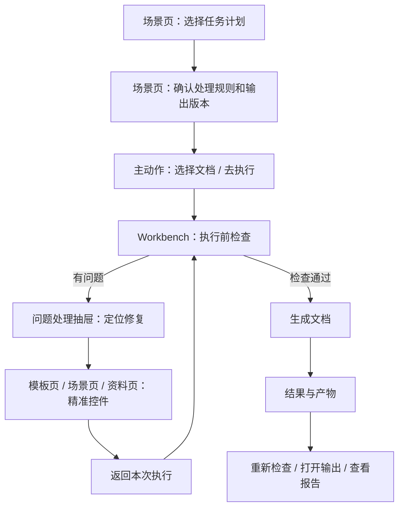

# 场景功能分布边界与文案精简深度分析

日期：2026-06-28

状态说明（2026-07-14）：本文关于独立“导入导出 / 文件管理”页面的内容仅保留为历史审计，不再作为当前实现依据。当前模板概览不提供“导入 / 另存为 / 恢复”三个直接动作：模板入库统一走模板工作区的“待导入”校验链，持久化只保留主“保存”和“创建副本”，草稿放弃由详情局部恢复或关闭事务处理。不得据本文恢复 `tpl_io` 或把三个动作重新铺回“当前模板”首屏。

范围：继续审计场景规划页、模板管理页、Workbench 快速执行页、高级证据入口之间的功能分布、职责边界和可见文案。本文承接：

- `docs/audits/场景规划现状与模板预览样式归一化深度分析_2026-06-27.md`
- `docs/audits/场景概览与模板管理一致性和可读性重构规划_2026-06-27.md`
- `docs/audits/场景链路闭环深度审计_2026-06-28.md`

## 1. 结论

当前版本已经从“审计证据看板”前进到“任务计划页”的雏形，但距离优秀设计仍有明显差距。

核心问题不是单个卡片文案，而是功能边界仍然有工程模块思维：

1. 场景页同时承担任务计划、模板摘要、输出 preset、证据核验、样本查看。
2. Workbench 同时承担执行会话、场景选择、模板选择、处理范围、功能开关、输出目录。
3. 模板管理页已经比较清晰地回答“文档长什么样”，但它和场景页之间缺少稳定的样式预览复用和跳转意图。
4. 高级证据虽然已经折叠，但样本、请求证据、request-cell、manifest 这些审计词仍然会从不同入口泄露到普通用户路径。

优秀设计的方向不是继续加说明，而是减少解释，让页面只回答四件事：

- 当前是什么状态。
- 现在可以做什么。
- 点了以后会去哪。
- 被阻断时缺什么、由谁修。

## 2. 新的职责边界

建议把系统拆成 6 个前台/后台职责层。每层只负责一种用户问题。

| 层 | 一句话职责 | 应该展示 | 不应该展示 |
| --- | --- | --- | --- |
| 场景页 | 这次任务会怎么处理 | 场景、范围、启用模块、风险边界、输出版本、下一步动作 | 运行日志、真实执行进度、request-cell 明细、manifest 路径 |
| 模板页 | 文档最终长什么样 | 页面、字体、标题、表格、页眉页脚、目录、题注、样式预览 | 场景级输出 preset、执行文件路径、问题队列 |
| Workbench | 这次运行到哪了 | 文档选择、执行前检查、进度、问题队列、重新检查、结果 | 完整场景编辑、完整模板编辑、开发证据索引 |
| 资料/素材页 | 还缺什么资料 | 必填字段、图片/附件、资料包状态、缺失修复入口 | Word 样式规则、输出命名规则、发布审计证书 |
| 高级证据 | 为什么这个能力可信 | 样本库、请求证据、覆盖矩阵、manifest、release gate | 普通用户主流程、执行主按钮、业务配置默认入口 |
| Pipeline/Runtime | 真正执行和产物落盘 | 不直接前台展示，只通过状态和结果投影 | 英文阶段名、内部对象名、实现细节 |

这一层边界可以用 5 句人话固化：

- 场景：这次会怎么处理。
- 模板：文档会长什么样。
- Workbench：这次运行现在怎样。
- 资料：缺什么才跑得起来。
- 证据：为什么说它可审计。

## 3. 当前分布问题

### 3.1 场景页仍然偏重“证明自己”

场景概览已经改成“当前任务 / 执行预览 / 关键设置 / 风险与边界 / 高级证据”，比之前可读很多。但高级证据仍然保留了样本库、请求证据、覆盖范围等内部核验能力。

这些能力应该存在，但只能作为二级抽屉或开发/验收入口。它不应该承担普通用户判断“下一步怎么做”的责任。

本轮已把首屏高级证据提示从解释性长句压缩为短状态，避免继续把“为什么它不适合普通用户”写在界面上。

代码位置：

   - 后续进展：入口已从“高级证据”改为“核对依据”，折叠态不再显示常驻提示；展开后提示为“查看场景覆盖、样本文档和请求样本。”，详见 `docs/refactor-records/场景概览核对依据入口减负执行记录_2026-06-29.md`。

### 3.2 Workbench 和场景页仍然像两套系统

Workbench 的快速执行页有自己的场景、模板、结构策略、页码起点、显隐标记、处理范围、处理功能、输出目录。场景页也维护类似配置。

技术上，`QuickExecutionDetail` 内部已经有 `_apply_scene()`，能完整刷新模板、范围、能力开关和请求证据列表。但 Workbench 接收到外部 `scene_changed` 时，只刷新策略摘要和固定卡片，没有调用完整 scene 投影。

这会制造一个信任问题：执行底层可能拿到了新场景，但快速执行页展示的分区、能力开关和模板摘要未必完整同步。

代码位置：

- `src/ui/panels/workbench/quick_execution_detail.py:761`：`_apply_scene()` 能完整应用场景。
- `src/ui/panels/workbench/panel_v2.py:811`：`on_scene_changed()` 只刷新摘要与固定卡片。
- `src/ui/panels/workbench/panel_v2.py:879`：执行时传入 `_current_scene/_current_template`。

### 3.3 模板页比较清楚，但和场景页没有形成样式闭环

模板页的优势是稳定：它围绕“当前模板、参数概览、样式预览、导入导出”展开。问题是场景页里的“关联模板 / 模板与样式”还没有真正变成模板预览闭环。

理想状态：

- 场景页只展示当前模板摘要和差异提示。
- 点击后进入模板页对应模块，或弹出同一套模板预览组件。
- Workbench 只显示“本次运行使用哪个模板”，不做完整模板编辑。

本轮已删除模板概览页里“点击各参数行的编辑可跳转”的冗余提示，因为按钮本身已经表达动作；同时压缩样式预览和模板文件管理说明。

代码位置：

- `src/ui/panels/template_panel.py:1539`：样式预览说明已缩短。
- `src/ui/panels/template_panel.py:1784`：模板文件管理说明已缩短。
- `src/ui/panels/template_panel.py:1882`：占位页不再使用“开发中/后续版本”文案。

### 3.4 输出边界混在一起

输出相关能力现在有两类：

1. 场景页的输出设置：定义交付版本，比如最终 DOCX、对比 DOCX、报告 JSON、报告 Markdown、资料清单、资料包、显隐规则。
2. Workbench 的输出目录：定义这次运行落到哪里。

这两个概念必须分开：

- 场景页负责“会生成哪些版本”。
- Workbench 负责“这次生成到哪里”。

场景页不应该要求普通用户理解变量插入、规则插入、报告 JSON/Markdown 这类实现细节。它们应折叠到“高级命名与报告”里，默认只露出交付版本。

### 3.5 问题修复的边界还不够精确

现在 Workbench 能把 issue 分类路由到模板页、资料页或场景页，但主窗口导航只接收面板 index，不能携带：

- 目标详情页。
- 具体控件。
- 问题上下文。
- 修完后返回哪个执行会话。

这使得“处理问题”只完成了第一跳，没有完成精准修复闭环。

代码位置：

- `src/ui/panels/workbench/panel_v2.py:669`：问题修复路由入口。
- `src/ui/main_window.py:258`：主窗口导航只接收面板 index。

## 4. 推荐的信息架构

建议场景页重新整理为 6 个区，而不是按工程能力堆叠。

| 新区块 | 放什么 | 不放什么 |
| --- | --- | --- |
| 任务计划 | 场景、模板、编号策略、主动作 | 样本、manifest、长解释 |
| 执行检查 | 文档状态、模板状态、资料状态、风险状态 | 真实执行日志 |
| 处理规则 | 处理范围、启用模块、对象保护、边界策略 | 模板字体细节、输出路径 |
| 样式与模板 | 模板摘要、样式预览、跳转模板编辑 | 场景族证据、发布门禁 |
| 输出版本 | 最终稿、审阅稿、报告、资料包、显隐版本 | 目录选择、批量任务状态 |
| 高级证据 | 覆盖矩阵、样本、请求证据、审计文件 | 主动作和普通配置 |

Workbench 推荐改成 4 个区：

| 新区块 | 放什么 |
| --- | --- |
| 本次运行 | 当前场景/模板只读摘要，选择文档，输出目录 |
| 执行前检查 | 页码起点、显隐标记、资料缺失、对象风险 |
| 运行状态 | 阶段 stepper、进度、日志、取消 |
| 问题处理 | 问题队列、定位修复、返回继续、重新检查 |

模板页保持 4 个区即可：

| 新区块 | 放什么 |
| --- | --- |
| 当前模板 | 模板选择、来源 |
| 参数概览 | 页面、排版、标题、表格、页眉页脚等摘要 |
| 样式预览 | A4/页面比例/正文层级预览 |
| 文件管理 | 导入、另存、恢复默认 |

## 5. 主链路应该这样走

这条链路里，高级证据不是主节点。它只在用户需要核验“为什么这么判断”时进入。

## 6. 文案删减规则

前台可见文案只保留四类：

| 类型 | 例子 | 保留原因 |
| --- | --- | --- |
| 状态 | 未选择文档、已完成、需补资料 | 用户判断当前能不能继续 |
| 动作 | 生成文档、重新检查、补资料 | 用户知道下一步点哪里 |
| 阻断 | 缺少资料、模板未绑定、对象风险 | 用户知道为什么不能继续 |
| 结果 | 已输出、执行失败、已生成报告 | 用户知道发生了什么 |

以下文案应删除、折叠或移入 tooltip/高级证据：

| 文案类型 | 处理规则 |
| --- | --- |
| 教用户点哪里 | 如果按钮/图标已经明确，直接删 |
| 解释系统为什么这样设计 | 移到文档或高级帮助 |
| 开发计划与未来承诺 | 不出现在生产 UI |
| 英文内部术语 | 主路径禁止，证据区可保留 |
| 重复标题的说明 | 删除或改成短状态 |
| 超过一行的段落解释 | 改成状态 + tooltip |

第一屏建议禁用或强限制这些词：

- request-cell
- fixture
- manifest
- release gate
- OOXML
- Schema
- L5
- Green
- drilldown
- payload

这些词可以存在于高级证据、开发诊断、审计文档，但不能成为普通用户完成任务的必读词。

## 7. 本轮已做的文案精简

| 位置 | 原问题 | 新处理 |
| --- | --- | --- |
| 模板概览 | “点击各参数行的编辑可跳转...”属于操作说明，重复按钮语义 | 已删除 |
| 模板样式预览 | 描述过长，且覆盖范围和场景入口不一致 | 改为共享预览契约生成的“预览页面、正文、标题、表格、页眉页脚、目录、参考文献和题注在同一页中的效果。” |
| 模板文件管理 | “分享和备份”解释过多，后续短句也缺少动作价值 | 删除说明句，只保留标题、状态和按钮 |
| 模板占位页 | “开发中/后续版本”是内部承诺 | 改为“暂未开放。” |
| 场景核对依据 | 长句解释“不是普通用户入口” | 折叠态只保留 `核对依据` 入口，展开后显示“查看场景覆盖、样本文档和请求样本。” |
| 启用模块 | 说明重复标题，句子偏长 | 改为“关闭的模块不会执行。” |
| 页码提示 | “策略统一定义”偏工程化 | 改为“页码在模板的‘页面元素’中调整。” |
| Workbench 空状态 | “选择文档后可...”重复且啰嗦 | 改为“未选择文档” |
| 通用占位面板 | “面板开发中”是开发视角 | 改为“暂未开放” |

## 8. 必要改造清单

### P0：先把边界打稳

1. 增加带上下文的导航意图

   当前 `navigate_to_panel(index)` 只能跳面板。建议新增类似 `NavigationIntent(panel, card_id, field_id, issue_id, return_target)` 的结构，让问题修复能直接定位到对应详情页和控件。

2. Workbench 完整消费外部场景

   `WorkbenchPanel.on_scene_changed()` 应调用 `QuickExecutionDetail` 的公开场景应用方法，而不只是刷新策略摘要。否则“看起来选了新场景”和“执行用的新场景”之间仍有信任缝隙。

3. 场景页增加主动作

   场景页概览应该出现“选择文档 / 去执行 / 继续检查”之一。用户看懂计划后必须能立即走下一步。

4. 样式与模板改为真实模板预览入口

   “模板与样式”不能回到场景概览自身。它应该进入模板页对应模块，或复用模板样式预览组件。

5. 输出页拆成“输出版本”和“高级命名”

   默认只显示最终稿、审阅稿、报告、资料包等业务版本；变量插入、显隐规则、JSON/Markdown 报告开关放到高级区。

### P1：让链路可读

1. 场景页显示最近一次执行状态和未解决问题数量。
2. Workbench 问题队列做成抽屉，不把请求样本和证据列表直接压在执行按钮下。
3. 资料缺失、对象风险、输出路径问题分别有明确修复页和返回继续按钮。
4. 给模板、场景、Workbench 建统一的“摘要字段字典”，保证同一字段不在三个页面里换三种说法。
5. 增加可见文案禁词/长度测试，避免内部术语回流到主路径。

### P2：再追求优秀视觉

1. 场景页第一屏只保留一条主路径：任务、状态、下一步。
2. 详情页使用同一套摘要组件、同一套按钮密度和同一套空状态。
3. 高级证据改成右侧抽屉或独立高级页，不进入主滚动流。
4. 对桌面和窄宽截图做回归，重点检查文本是否换行挤压、按钮是否自解释、空状态是否过多。

## 9. 验收标准

这个改造不应以“卡片更多”作为完成标准，而应以用户能否走完任务作为标准。

必须满足：

1. 用户不懂 request-cell、manifest、OOXML，也能完成一次生成。
2. 用户从场景页能直接进入 Workbench。
3. Workbench 展示的场景、模板、范围、功能开关与实际执行一致。
4. 问题处理能跳到具体页和具体控件。
5. 修复后能返回同一次执行并重新检查。
6. 模板样式预览在模板页和场景页语义一致。
7. 主路径没有“开发中”“后续版本”“点击这里...”这类说明式文案。

## 10. 最终判断

现在真正要优化的不是更多解释，而是更少、更准、更有边界的界面。

场景页应该像“任务计划书”，模板页应该像“格式规范书”，Workbench 应该像“执行控制台”，资料页应该像“补齐清单”，高级证据应该像“审计柜”。

只要这几个角色不混在一起，文案自然会变短；只要文案变短但链路仍然可走，用户就会觉得系统在说人话。

## 11. 2026-06-28 P0 执行记录

本轮开始把 P0 从文档推进到代码，优先打通“场景计划 -> 执行入口”和“执行问题 -> 精准修复入口”的第一层闭环。

已落地：

1. 新增跨面板导航意图

   `PanelBridge` 在保留旧 `navigate_to_panel(int)` 的同时，新增 `navigate_to_intent(object)`。意图可携带 `panel_id`、`card_id`、`field_id`、`issue_id`、`return_panel_id`、`return_card_id`，主窗口会先切换到目标面板，再调用目标面板的 `handle_navigation_intent()`。

2. 场景概览增加主动作

   场景概览首屏新增“去执行”按钮，点击后发出 `panel_id=workbench`、`card_id=quick_execute` 的导航意图。用户看懂任务计划后不再悬在场景页。

3. “模板与样式”进入真实模板预览

   场景概览中 `template_style` 行的目标从 `scn_overview` 改为 `tpl_overview`，点击后进入模板管理页的模板概览/样式预览，而不是回到场景概览自身。

4. Workbench 完整消费外部场景

   `QuickExecutionDetail` 新增 `set_scene_context(scene)`，由 `WorkbenchPanel.on_scene_changed()` 调用。外部场景变化后，快速执行页会完整刷新场景、模板、处理范围、功能开关、请求证据和显隐 preset，而不是只刷新策略摘要。

5. 问题修复开始携带目标卡片

   Workbench 的 issue repair 路由继续发旧面板跳转信号以兼容现有调用，同时发出更精确的导航意图：

   - 模板样式问题 -> `template / tpl_style`
   - 模板页面问题 -> `template / tpl_page`
   - 输出目标问题 -> `scene / scn_output`
   - 覆盖/样本/参数归属问题 -> `scene / scn_evidence`
   - 对象预检、固定版式、行高、内容控件、文本框问题 -> `scene / scn_cleanup`

6. 审计 marker 同步到新链路

   固定版式 profile 审计不再寻找旧的 `navigate_to_panel.emit(scene_index)` 字符串，而是验证新的 `_emit_panel_navigation()` 与 `scn_cleanup` 目标卡片，避免把更精确的修复路由误判成缺证据。

验证：

- `python -m py_compile src/ui/bridge.py src/ui/main_window.py src/ui/panels/scene_overview_projection.py src/ui/panels/scene_panel.py src/ui/panels/template_panel.py src/ui/panels/workbench/quick_execution_detail.py src/ui/panels/workbench/panel_v2.py tests/test_scene_panel_architecture.py tests/test_workbench_detail_architecture.py`
- `python -m pytest tests/test_scene_panel_architecture.py::test_scene_panel_overview_actions_emit_contextual_navigation_intents tests/test_scene_overview_projection.py::test_scene_overview_projection_shapes_user_first_screen tests/test_workbench_detail_architecture.py::test_workbench_panel_routes_issue_repair_targets_to_existing_surfaces tests/test_workbench_detail_architecture.py::test_workbench_panel_applies_external_scene_to_quick_execution_detail tests/test_scene_panel_architecture.py::test_scene_overview_summary_projects_fixed_layout_batch_evidence -q`
- `python -m pytest tests/test_scene_overview_projection.py tests/test_scene_panel_architecture.py tests/test_workbench_detail_architecture.py tests/test_quick_execution_detail_architecture.py tests/test_template_panel_architecture.py -q`

结果：`112 passed in 253.43s`。

仍需继续：

- 输出页还需要拆成“输出版本”和“高级命名/报告”，默认隐藏变量插入、显隐规则、JSON/Markdown 等高级项。
- 问题修复意图目前已到目标卡片，还没有到具体控件高亮和“修完返回本次执行”的完整 return flow。
- Workbench 问题队列仍需要从主按钮下方进一步收敛成问题处理抽屉。

## 12. 2026-06-28 续推记录：输出边界与返回执行

本轮继续推进上一节的剩余项，把“输出版本”和“高级命名/报告”先拆开，并补上修复页返回执行的最小入口。

已落地：

1. 输出页拆成主路径和高级区

   `ScenePanel` 的输出详情页现在先展示“输出版本”相关控件：默认交付、交付操作、业务模板、交付 ID/名称、最终 DOCX、对比 DOCX、资料清单、资料包。

   变量插入、目标模板、模板选项、输出目录、文件命名、规则插入、报告 JSON、报告 Markdown、显隐规则已进入“高级命名与报告”折叠区，默认收起。

   这使普通用户先理解“会生成哪些版本”，而不是先被命名模板、显隐 selector 和机器报告格式打断。

2. 场景页和模板页新增“返回执行”入口

   当 Workbench 通过带 `return_panel_id=workbench`、`return_card_id=quick_execute` 的导航意图把用户带到场景页或模板页时，目标面板顶部会显示“从执行问题进入 / 返回执行”。点击后回到 Workbench 快速执行页。

   这不是完整的问题修复闭环，但已经补上了“修复页 -> 原执行上下文”的显性返回入口。

3. 保持现有业务逻辑不变

   输出页控件对象、保存逻辑、交付 preset 校验、变量插入、显隐规则插入都保持原有路径；本轮只改变信息层级和默认可见性。

新增/更新验证：

- `python -m py_compile src/ui/panels/scene_panel.py src/ui/panels/template_panel.py tests/test_scene_panel_architecture.py tests/test_template_panel_architecture.py`
- `python -m pytest tests/test_scene_panel_architecture.py::test_scene_panel_output_advanced_naming_and_reports_are_collapsed_by_default tests/test_scene_panel_architecture.py::test_scene_panel_navigation_intent_shows_return_to_execution_action tests/test_template_panel_architecture.py::test_template_panel_navigation_intent_shows_return_to_execution_action tests/test_scene_panel_architecture.py::test_scene_panel_delivery_validation_summary_flags_template_and_rule_issues tests/test_scene_panel_architecture.py::test_scene_panel_delivery_business_preset_templates_create_common_versions tests/test_scene_panel_architecture.py::test_scene_panel_delivery_variable_picker_inserts_into_templates tests/test_scene_panel_architecture.py::test_scene_panel_delivery_visibility_rule_inserter_updates_current_preset -q`

结果：`7 passed in 40.10s`。

追加聚焦回归：

- `python -m pytest tests/test_scene_panel_architecture.py tests/test_template_panel_architecture.py tests/test_workbench_detail_architecture.py -q`

结果：`71 passed in 214.84s (0:03:34)`。

仍需继续：

- “返回执行”目前是返回入口，还没有在 Workbench 中保留/高亮原 issue 行。
- 问题修复意图已到目标卡片，但还没有精确到控件高亮。
- Workbench 问题队列还没有收敛成抽屉式问题处理面板。

## 13. 2026-06-28 续推记录：问题处理面板与 active issue 往返

本轮继续处理上一节的三个缺口，重点不是再增加说明文字，而是把执行问题的处理链路变得更像用户能理解的“待处理事项”。

已落地：

1. Workbench 问题区收敛成“问题处理”面板

   快速执行页原来把筛选、处理按钮、已处理/忽略按钮和长提示散放在执行按钮下方。现在统一进入 `问题处理` 面板：顶部显示问题总数和阻断数，正文包含筛选、处理动作、状态动作和问题列表。

   面板支持展开/收起，默认展示问题列表；收起后保留问题入口，不再把一长串队列摘要直接压在主执行路径下方。

2. 原 issue 可以在修复往返中保留

   点击某个问题的“处理”时，`QuickExecutionDetail` 会记录当前 `WorkbenchIssueItem.issue_id`，`WorkbenchPanel` 发出的导航意图会携带 `active_issue_id` 和 `payload.issue_item_id`。

   从场景页或模板页点击“返回执行”时，返回意图会把 active issue 带回 Workbench。Workbench 收到后切回 quick_execute，并恢复对应问题的筛选和列表选中态。

3. 目标页返回条带上问题语义

   场景页和模板页的返回条不再只显示“从执行问题进入”。当导航意图带有 `issue_title` 或 `field_id` 时，会显示为“从执行问题进入：xxx”，用户能知道自己为什么被带到这个页面。

   这一步已经把“问题 -> 修复页 -> 返回原问题”的主链路打通，但还不是最终控件级高亮。下一步仍应给场景页/模板页补逐卡片 `field_id -> 控件` 映射，让目标输入框获得明确高亮或焦点。

新增/更新验证：

- `python -m py_compile src/ui/panels/workbench/quick_execution_detail.py src/ui/panels/workbench/panel_v2.py src/ui/panels/scene_panel.py src/ui/panels/template_panel.py tests/test_quick_execution_detail_architecture.py tests/test_workbench_detail_architecture.py tests/test_scene_panel_architecture.py tests/test_template_panel_architecture.py`
- `python -m pytest tests/test_quick_execution_detail_architecture.py::test_quick_execution_detail_exposes_material_readiness_issue_queue tests/test_quick_execution_detail_architecture.py::test_quick_execution_detail_filters_issue_queue_by_category tests/test_quick_execution_detail_architecture.py::test_quick_execution_detail_marks_filtered_issue_status tests/test_workbench_detail_architecture.py::test_workbench_panel_round_trips_active_issue_from_repair_navigation tests/test_scene_panel_architecture.py::test_scene_panel_navigation_intent_shows_return_to_execution_action tests/test_template_panel_architecture.py::test_template_panel_navigation_intent_shows_return_to_execution_action -q`

结果：`6 passed in 7.71s`。

- `python -m pytest tests/test_quick_execution_detail_architecture.py -q`

结果：`41 passed in 33.29s`。

- `python -m pytest tests/test_workbench_detail_architecture.py tests/test_scene_panel_architecture.py::test_scene_panel_navigation_intent_shows_return_to_execution_action tests/test_template_panel_architecture.py::test_template_panel_navigation_intent_shows_return_to_execution_action -q`

结果：`17 passed in 13.72s`。

追加四文件聚焦回归：

- `python -m pytest tests/test_quick_execution_detail_architecture.py tests/test_workbench_detail_architecture.py tests/test_scene_panel_architecture.py tests/test_template_panel_architecture.py -q`

结果：`113 passed in 259.57s (0:04:19)`。

仍需继续：

- 场景页/模板页只显示问题语义提示，还没有完成逐控件高亮和焦点跳转。
- 资产页尚未接入同样的 active issue 返回条；资料/资产问题虽然能跳转，但返回体验还不如场景页/模板页完整。
- 问题面板已有列表选中态，但还不是完整的“处理抽屉”：缺少问题详情展开、处理建议说明和修复后自动复检。

## 14. 2026-06-28 续推记录：资产页返回与 field_id 控件定位

本轮继续补上一节的两个明确缺口：资料/资产页返回上下文，以及场景页/模板页从“问题语义提示”推进到“具体字段定位”。

已落地：

1. 资产页接入 active issue 返回条

   `AssetsPanel` 现在支持 `handle_navigation_intent`。当 Workbench 带着 `issue_id`、`field_id`、`active_issue_id` 跳到资料页时，资产页会复用已有 `focus_material_repair_target` 能力，直接定位到字段、图片或题图修复目标。

   页面顶部新增“从执行问题进入 / 返回执行”上下文条；返回时会把 `active_issue_id` 和 payload 带回 Workbench，资料/资产问题不再是单向跳转。

2. 场景输出页支持 field_id 控件定位

   `ScenePanel` 会在导航到目标详情后调用详情页的 `focus_navigation_field(field_id)`。输出页已经支持交付版本、交付 ID/名称、目标模板、输出目录、文件命名、显隐规则、报告开关、资料清单/资料包等字段定位。

   如果目标字段位于“高级命名与报告”，输出页会自动展开高级区再高亮控件，避免用户被带到页面后仍找不到修复点。

3. 模板正文排版支持 body.* 字段定位

   `StyleDetail` 已给正文排版关键控件补 objectName，并支持 `body.font_name`、`body.font_cn`、`body.font_en`、`body.size_pt`、`body.special_indent`、`body.line_spacing_type`、`body.space_before` 等字段定位。

   这使 `template_style_field: body.font_name` 不再只是到达“正文排版”卡片，而是能落到对应字体控件上。

新增/更新验证：

- `python -m py_compile src/ui/panels/assets_panel.py src/ui/panels/scene_panel.py src/ui/panels/template_panel.py src/ui/panels/template_style_detail.py tests/test_assets_panel_architecture.py tests/test_scene_panel_architecture.py tests/test_template_panel_architecture.py`
- `python -m pytest tests/test_assets_panel_architecture.py::test_assets_panel_navigation_intent_focuses_target_and_returns_to_execution tests/test_scene_panel_architecture.py::test_scene_panel_navigation_intent_shows_return_to_execution_action tests/test_template_panel_architecture.py::test_template_panel_navigation_intent_shows_return_to_execution_action -q`

结果：`3 passed in 5.72s`。

- `python -m pytest tests/test_assets_panel_architecture.py::test_assets_panel_focuses_pending_material_repair_asset_target tests/test_assets_panel_architecture.py::test_assets_panel_focuses_pending_material_repair_field_target tests/test_assets_panel_architecture.py::test_assets_panel_navigation_intent_focuses_target_and_returns_to_execution tests/test_assets_panel_architecture.py::test_assets_panel_focuses_pending_material_profile_repair_field_target tests/test_assets_panel_architecture.py::test_assets_panel_focuses_material_repair_asset_target_from_bridge_signal tests/test_assets_panel_architecture.py::test_assets_panel_focuses_material_repair_field_target_from_bridge_signal -q`

结果：`6 passed in 18.57s`。

- `python -m pytest tests/test_quick_execution_detail_architecture.py tests/test_workbench_detail_architecture.py tests/test_scene_panel_architecture.py tests/test_template_panel_architecture.py -q`

结果：`113 passed in 254.22s (0:04:14)`。

仍需继续：

- field_id 映射目前优先覆盖输出页和正文排版；页面设置、表格、页眉页脚、清理、输入资料等卡片还需要逐页补映射。
- 问题处理面板仍是面板化列表，还没有完整的抽屉详情、处理建议、修复说明和一键复检。
- 修复后自动复检尚未闭环；目前用户能返回原 issue，但系统还不会自动刷新该 issue 的状态。

## 15. 2026-06-28 续推记录：问题详情与主动复检

本轮继续推进问题处理面板，把“列表 + 按钮”补成更接近处理抽屉的结构。

已落地：

1. 问题处理面板新增当前问题详情

   `QuickExecutionDetail` 的问题面板现在在列表下方显示当前选中问题的标题、分类/严重度/状态/负责人/阻断信息、明细、来源和处理建议。用户不再需要悬停 tooltip 才能理解问题。

2. 选中问题会同步详情和处理目标

   切换问题列表选中项时，会同步 `active_issue_id`、导航上下文、详情文案和“处理”按钮 tooltip。处理动作仍然复用 `workbench_issue_action_target`，没有新增另一套路由规则。

3. 新增“复检”动作

   当前问题详情内增加“复检”按钮，调用既有 `_emit_summary_changed()` 刷新链路重新计算资料、资产、边界、样本、参数归属和控件契约问题。若原问题仍存在，会保持选中；若问题已消失，会按当前筛选刷新列表。

   这解决的是“修完后用户能主动复检”的闭环。真正的自动复检仍需后续接入跨页修复完成事件。

新增/更新验证：

- `python -m py_compile src/ui/panels/workbench/quick_execution_detail.py tests/test_quick_execution_detail_architecture.py`
- `python -m pytest tests/test_quick_execution_detail_architecture.py::test_quick_execution_detail_issue_panel_shows_detail_and_rechecks_current_issue -q`

结果：`1 passed in 1.14s`。

- `python -m pytest tests/test_quick_execution_detail_architecture.py -q`

结果：`42 passed in 34.72s`。

- `python -m pytest tests/test_workbench_detail_architecture.py -q`

结果：`15 passed in 7.43s`。

- `python -m pytest tests/test_quick_execution_detail_architecture.py tests/test_workbench_detail_architecture.py tests/test_scene_panel_architecture.py tests/test_template_panel_architecture.py -q`

结果：`114 passed in 254.09s (0:04:14)`。

仍需继续：

- 自动复检还没有和场景页、模板页、资产页的保存/修复事件打通；目前是用户点击“复检”。
- field_id 映射仍需覆盖页面设置、表格、页眉页脚、清理、输入资料等更多卡片。
- 问题详情已经可读，但还可以继续升级成更完整的抽屉交互，例如显示推荐修复路径、证据链接和复检历史。

## 16. 2026-06-28 续推记录：自动复检、边界收敛与冗余文案删除

本轮继续按“用户任务优先，内部证据后置”的方向收敛。核心判断是：当前界面不够优秀，不是因为信息少，而是主界面仍混入了过多工程层概念。用户真正需要的是“我现在要去哪里改、改完系统是否知道”，而不是 `field:company_name`、`template_style_field:body.font_name`、`coverage pack` 这类内部标识。

已落地：

1. 配置变更触发自动复检

   `QuickExecutionDetail` 新增 `_issue_queue_source` 和 `recheck_current_context()`。场景或模板出现 dirty 信号时，Workbench 会自动刷新运行前配置问题；资料上下文变化仍沿用已有 `material_context_changed -> set_material_context()` 链路刷新。

   边界重点：自动复检只刷新 `preflight_config` 来源的问题，不会清空对象预检确认、执行中状态或执行结果问题。这样用户刚生成后的警告不会因为顺手改了模板页而消失。

2. 问题处理文案改成用户动作

   问题详情、“处理”按钮 tooltip 和问题队列的“可处理目标”统计不再显示 `target_type:target_key`。可见文案改成“去资料页补齐公司名称”“去资料页补齐企业标志”“查看对象预检结果并确认处理方式”“去模板页调整正文字体”等动作语言。

   内部路由仍保留在 `current_issue_action_targets()` 和 `workbench_issue_action_target()`，用于跳转、定位和测试。也就是说，工程标识继续服务系统，但不再直接暴露给普通用户。

3. 场景详情摘要删除重复的“高级证据”

   普通场景详情页的摘要卡从 3 项收为 2 项，只保留“主要控件”和“风险说明”。原先每个详情页都重复出现“高级证据 / 左侧可查看”，这会误导用户以为每个功能页都有独立证据入口。

   新边界：证据、样本、请求、覆盖信息只归入场景概览的“高级证据”区；普通功能页只讲本页能改什么，以及改动会影响什么。

进一步分析结论：

- 功能分布应继续按四层拆：执行页负责发现问题和回到问题；场景页负责任务范围、风险边界和输出；模板页负责版式预览和模板参数；资料页负责字段、图片、题图和 Schema。任何页面都不应同时承担“配置、证据、日志、运行结果”四种职责。
- 可读性要靠信息取舍，而不是加解释。主界面只保留动作句和结果句；证据、来源、内部 key、契约、样本覆盖放进展开区、tooltip、日志或报告。
- 一致性要靠同一条问题链路：问题列表选中 -> 详情说明 -> 点击处理 -> 跨页定位 -> 返回同一 issue -> 自动或手动复检。当前链路已经基本成形，但还不是最终形态。

新增/更新验证：

- `python -m py_compile src/ui/panels/workbench/quick_execution_detail.py src/ui/panels/workbench/panel_v2.py src/ui/panels/scene_panel.py tests/test_quick_execution_detail_architecture.py tests/test_workbench_detail_architecture.py tests/test_scene_panel_architecture.py`
- `python -m pytest tests/test_workbench_detail_architecture.py::test_workbench_panel_auto_rechecks_config_issue_on_scene_dirty tests/test_workbench_detail_architecture.py::test_workbench_panel_does_not_auto_clear_execution_result_issues_on_dirty -q`

结果：`2 passed in 1.95s`。

- `python -m pytest tests/test_quick_execution_detail_architecture.py::test_quick_execution_detail_issue_panel_shows_detail_and_rechecks_current_issue -q`

结果：`1 passed in 1.20s`。

- `python -m pytest tests/test_scene_panel_architecture.py::test_scene_panel_uses_shared_card_header_and_flow_scope_layout -q`

结果：`1 passed in 0.60s`。

- `python -m pytest tests/test_quick_execution_detail_architecture.py tests/test_workbench_detail_architecture.py tests/test_scene_panel_architecture.py -q`

结果：`105 passed in 243.25s (0:04:03)`。

仍需继续：

- 自动复检目前接入 dirty 信号，仍不是完整的“保存成功 / 修复完成 / 资产更新完成”事件总线；后续应把具体修复结果也纳入复检触发和历史记录。
- 问题详情已经动作化，但还缺“推荐修复路径、证据入口、复检历史、处理后状态变化”的完整抽屉。
- field_id 映射还要覆盖页面设置、表格、页眉页脚、清理、输入资料等更多卡片，否则跨页定位在复杂问题上仍可能只到页面不到控件。
- 模板管理页与场景页的一级信息结构还需要继续统一：概览只讲当前模板状态和预览，导入导出、参数细节、模板文件证据应继续下沉到明确板块。

## 17. 2026-06-28 续推记录：请求样本证据文案去内部化

本轮继续清理“看起来像工程数据结构”的可见文案。上一轮已经把问题处理目标从 `field:company_name` 这类内部键改成用户动作；这一轮处理的是场景概览高级证据和 Workbench 请求样本浏览器中的 `request-cell / coverage / pack / family / fixture / manual gate`。

已落地：

1. Workbench 请求样本浏览器去掉 `request-cell`

   请求样本筛选控件 tooltip 从“按 request-cell 覆盖层级筛选”改为“按请求样本覆盖层级筛选”；数量提示从“本场景共 N 条 request-cell”改为“本场景共 N 条请求样本”。

2. 请求样本 tooltip 改成中文结构

   `QuickExecutionDetail` 和 `ScenePanel` 的请求样本 tooltip 同步改为：

   - `覆盖层级`
   - `资料包`
   - `场景族`
   - `样本文件`
   - `人工确认`

   内部字段名仍然在数据对象和审计测试中存在，但普通 UI 不再直接展示 `coverage / pack / family / fixture / manual gate`。

3. 场景页和执行页保持同一套说法

   两个页面都使用同样的请求样本 tooltip 语义，避免出现“场景页说样本、执行页说 request-cell”的割裂体验。

新增/更新验证：

- `python -m py_compile src/ui/panels/workbench/quick_execution_detail.py src/ui/panels/scene_panel.py tests/test_quick_execution_detail_architecture.py tests/test_scene_panel_architecture.py`
- `python -m pytest tests/test_quick_execution_detail_architecture.py::test_quick_execution_request_cell_browser_filters_scene_cells -q`

结果：`1 passed in 0.92s`。

- `python -m pytest tests/test_scene_panel_architecture.py::test_scene_panel_overview_shows_planning_family_governance tests/test_scene_panel_architecture.py::test_scene_panel_request_cell_list_filters_boundary_levels -q`

结果：`2 passed in 6.27s`。

- `python -m pytest tests/test_quick_execution_detail_architecture.py tests/test_workbench_detail_architecture.py tests/test_scene_panel_architecture.py -q`

结果：`105 passed in 243.33s (0:04:03)`。

仍需继续：

- 问题队列里由审计模块生成的明细仍会出现“覆盖 pack：xxx”等内部证据语句；这类内容应继续区分“用户详情”和“审计证据”，而不是简单全局替换。
- 模板页的“来源”信息还偏工程出处，后续可进一步降级为文件信息或收进导入导出/模板文件板块。
- 高级证据区已经更可读，但仍缺少“为什么这条样本影响本次执行”的解释层，目前只能看到覆盖层级和样本文件。

## 18. 2026-06-28 续推记录：问题队列审计证据展示层翻译

本轮处理上一节留下的缺口：问题队列里由审计模块生成的明细仍会直接出现“覆盖 pack：xxx”“scene_sample_fixture_registry”“control_contract_registry”等工程式证据。这里不能简单改底层 adapter，因为审计测试、报告和追溯链路仍需要原始字段；正确边界是：底层保留原始审计标识，UI 展示层负责翻译成用户可读说明。

已落地：

1. `QuickExecutionDetail` 增加统一展示格式化

   问题汇总 tooltip、问题列表 tooltip、问题详情正文现在都走同一组展示 helper：

   - `覆盖 pack：contract_delivery` -> `覆盖资料包：contract_delivery`
   - `coverage pack：exam_education` -> `覆盖资料包：exam_education`
   - `fixture` -> `样本文件`
   - `manual gate` -> `人工确认`
   - `scene_sample_fixture_registry` -> `样本覆盖登记`
   - `control_contract_registry` -> `控件边界登记`

2. 用户详情和审计来源开始分层

   `WorkbenchIssueItem.details` 和 `source_notes` 保持原始数据；UI 在展示时才转换。这样后续可以继续增加“用户详情 / 审计证据”两个区域，而不需要改动问题生成逻辑。

3. 回归测试锁住“不让 registry 外露”

   测试现在明确要求问题队列 tooltip 出现“覆盖资料包”“样本覆盖登记”“控件边界登记”，并且不出现 `覆盖 pack：contract_delivery`、`scene_sample_fixture_registry`、`control_contract_registry`。

新增/更新验证：

- `python -m py_compile src/ui/panels/workbench/quick_execution_detail.py tests/test_quick_execution_detail_architecture.py`
- `python -m pytest tests/test_quick_execution_detail_architecture.py::test_quick_execution_detail_exposes_control_contract_issue_queue tests/test_quick_execution_detail_architecture.py::test_quick_execution_detail_exposes_contract_boundary_and_sample_fixture_issue_queue -q`

结果：`2 passed in 1.39s`。

- `python -m pytest tests/test_quick_execution_detail_architecture.py -q`

结果：`42 passed in 34.69s`。

- `python -m pytest tests/test_quick_execution_detail_architecture.py tests/test_workbench_detail_architecture.py tests/test_scene_panel_architecture.py -q`

结果：`105 passed in 242.26s (0:04:02)`。

仍需继续：

- 目前只是单行翻译，问题详情还没有视觉上拆成“处理说明”和“审计证据”两个区域。
- 部分详情仍有英文句子，例如 sample fixture 的英文审计消息；后续应在 UI 层补充中文解释，同时保留原文作为审计证据。
- 模板管理页的“来源: 模板库/文件/当前会话”仍是下一个明显的工程化主路径文案。

## 19. 2026-06-28 续推记录：问题详情拆成处理说明与审计证据

本轮继续处理问题面板的“信息堆在一起”问题。上一节已经把审计证据里的内部词翻译成人话，但详情里仍然是建议、明细、来源混在同一块正文中。优秀设计不应该让用户自己判断哪一句是下一步动作、哪一句只是证据。

已落地：

1. 问题详情新增两个明确区域

   `QuickExecutionDetail` 的问题详情面板现在在标题和状态信息下面分成：

   - `处理说明`：显示用户下一步要做什么，例如“点击处理去资料页补齐公司名称，处理完成后点复检”。
   - `审计证据`：显示问题明细、来源登记、覆盖资料包、控件边界等可追溯信息。

2. 处理建议优先于证据

   详情展示顺序从“标题 / 状态 / 明细 / 建议”调整为“标题 / 状态 / 处理说明 / 审计证据”。用户先看到动作，再看依据。

3. 审计证据继续复用展示层翻译

   详情正文仍走上一轮新增的展示 helper，因此 `control_contract_registry` 会显示为“控件边界登记”，不会在详情正文里回流。

新增/更新验证：

- `python -m py_compile src/ui/panels/workbench/quick_execution_detail.py tests/test_quick_execution_detail_architecture.py`
- `python -m pytest tests/test_quick_execution_detail_architecture.py::test_quick_execution_detail_issue_panel_shows_detail_and_rechecks_current_issue tests/test_quick_execution_detail_architecture.py::test_quick_execution_detail_exposes_control_contract_issue_queue -q`

结果：`2 passed in 1.36s`。

- `python -m pytest tests/test_quick_execution_detail_architecture.py -q`

结果：`42 passed in 34.06s`。

- `python -m pytest tests/test_quick_execution_detail_architecture.py tests/test_workbench_detail_architecture.py tests/test_scene_panel_architecture.py -q`

结果：`105 passed in 244.20s (0:04:04)`。

仍需继续：

- 视觉上已经分区，但“审计证据”仍是纯文本段落；后续可以改成可折叠或次级信息，避免默认占用过多主路径空间。
- 部分英文审计句子还需要 UI 层中文摘要，例如 sample fixture 的英文校验消息。
- 模板管理页来源信息仍偏工程化，下一步应处理“当前模板”卡片里的文件出处表达。

## 20. 2026-06-28 续推记录：模板当前文件信息去“来源”化

本轮处理模板管理页的一个主路径文案问题：当前模板卡片原来显示“来源: 模板库 / 文件 / 当前会话”。这类表达更像系统出处，对用户而言真正有用的是“这是模板文件、这是本地文件、这是内置模板，还是还没有保存到文件”。

已落地：

1. 当前模板卡片改成文件/类型语言

   `TemplatePanel` 的当前模板说明现在使用：

   - `模板文件：thesis_gbt.json`
   - `本地文件：thesis_gbt.json`
   - `模板类型：内置模板`
   - `未保存到模板文件`
   - `导入文件：xxx.json`

   不再在模板主路径里显示 `来源:`。

2. 保留信息，改变边界

   这不是隐藏文件信息，而是把“来源”改成用户能直接理解的模板状态。模板文件管理和导入导出仍应归入模板页的导入导出板块，当前模板卡片只做轻量状态提示。

3. 测试锁住文案回流

   `tests/test_template_panel_source_text.py` 现在要求模板来源文本使用文件/类型语言，并明确断言 `src/ui/panels/template_panel.py` 中不再出现 `来源:`。

新增/更新验证：

- `python -m py_compile src/ui/panels/template_panel.py tests/test_template_panel_source_text.py`
- `python -m pytest tests/test_template_panel_source_text.py -q`

结果：`2 passed in 0.66s`。

- `python -m pytest tests/test_template_panel_architecture.py tests/test_template_panel_source_text.py -q`

结果：`13 passed in 4.34s`。

- `python -m pytest tests/test_template_panel_architecture.py tests/test_template_panel_source_text.py tests/test_quick_execution_detail_architecture.py tests/test_workbench_detail_architecture.py tests/test_scene_panel_architecture.py -q`

结果：`118 passed in 256.85s (0:04:16)`。

仍需继续：

- 模板概览仍有“参数概览 / 样式预览 / 导入导出”三块，但和场景页的“当前任务 / 执行预览 / 风险边界”之间还缺一个更稳定的互相跳转和共享预览协议。
- 导入导出页还可以进一步承担模板文件证据、保存路径和发布状态，避免当前模板卡片继续膨胀。
- 模板页与场景页的文案禁词测试还不够系统，目前是围绕已发现问题逐点锁定。

## 21. 2026-06-28 续推记录：导入导出页承接模板文件状态

上一节把“来源”改成“模板文件 / 本地文件 / 模板类型”，但文件状态仍主要显示在当前模板卡片里。这样边界还不够清楚：当前模板卡片应该负责“正在使用哪个模板”，导入导出页才应该负责“这个模板文件在哪里、是否已保存、如何导入或另存”。

已落地：

1. 导入导出页新增稳定文件状态

   `ImportExportDetail` 增加 `tpl_io_file_state`，在导入导出操作按钮上方显示当前模板文件状态：

   - `模板文件：xxx.json`
   - `本地文件：xxx.json`
   - `模板类型：内置模板`
   - `未保存到模板文件`

2. 文件状态同步收束到一个方法

   `TemplatePanel` 新增 `_sync_template_file_status()`，统一刷新当前模板卡片和导入导出页。模板选择、导入、保存、重置、外部模板变更都通过这条同步路径更新文件状态。

3. 导入后不再使用单独的“导入文件”主路径文案

   导入完成后统一进入“本地文件：xxx.json”状态，导入动作结果仍保留在导入导出页的状态消息里。这样“文件状态”和“刚才发生了什么操作”不再混为一个标签。

新增/更新验证：

- `python -m py_compile src/ui/panels/template_panel.py tests/test_template_panel_source_text.py`
- `python -m pytest tests/test_template_panel_source_text.py -q`

结果：`3 passed in 0.74s`。

- `python -m pytest tests/test_template_panel_architecture.py tests/test_template_panel_source_text.py tests/test_template_page_detail.py::test_template_panel_page_save_overwrites_current_file_and_clears_dirty tests/test_template_style_detail.py::test_template_panel_style_save_overwrites_current_file_and_clears_dirty -q`

结果：`16 passed in 8.95s`。

- `python -m pytest tests/test_template_panel_architecture.py tests/test_template_panel_source_text.py tests/test_quick_execution_detail_architecture.py tests/test_workbench_detail_architecture.py tests/test_scene_panel_architecture.py -q`

结果：`119 passed in 257.09s (0:04:17)`。

仍需继续：

- 当前模板卡片仍显示同一份文件状态；后续可以考虑把它降级成更短的状态 chip，导入导出页保留完整文件状态。
- 导入导出页还没有发布状态、模板版本、保存路径展开等更完整的文件管理信息。
- 场景页跳模板页后的共享预览协议仍需要继续加强，尤其是从场景“模板与样式”到模板预览的上下文一致性。

## 22. 2026-06-28 续推记录：当前模板卡片降级为短状态

上一节已经让导入导出页承接完整文件状态，但当前模板卡片仍显示同一份完整文件名。这样会让两个板块职责重叠：概览像文件管理页，导入导出页又像临时操作页。本轮把“当前模板”卡片降级为短状态，把完整文件名保留在导入导出页。

已落地：

1. 当前模板卡片只显示短状态

   `TemplateOverviewDetail` 的状态现在显示：

   - `模板文件`
   - `本地文件`
   - `内置模板`
   - `未保存`

   它不再显示具体文件名，避免当前模板卡片继续承担文件管理职责。

2. 导入导出页保留完整文件状态

   `ImportExportDetail` 继续显示完整状态，例如 `本地文件：custom_style.json`、`模板文件：thesis_gbt.json`、`未保存到模板文件`。用户需要确认文件名或保存位置时，应该看导入导出页。

3. 同步逻辑明确分层

   `_sync_template_file_status()` 现在同时刷新两个不同层级：

   - 概览卡片：`_template_overview_status_text()`
   - 导入导出页：`_template_source_text()`

   这让同一份状态数据在不同页面承担不同信息密度。

新增/更新验证：

- `python -m py_compile src/ui/panels/template_panel.py tests/test_template_panel_source_text.py`
- `python -m pytest tests/test_template_panel_source_text.py -q`

结果：`3 passed in 0.75s`。

- `python -m pytest tests/test_template_panel_architecture.py tests/test_template_panel_source_text.py tests/test_template_page_detail.py::test_template_panel_page_save_overwrites_current_file_and_clears_dirty tests/test_template_style_detail.py::test_template_panel_style_save_overwrites_current_file_and_clears_dirty -q`

结果：`16 passed in 8.04s`。

- `python -m pytest tests/test_template_panel_architecture.py tests/test_template_panel_source_text.py tests/test_quick_execution_detail_architecture.py tests/test_workbench_detail_architecture.py tests/test_scene_panel_architecture.py -q`

结果：`119 passed in 257.11s (0:04:17)`。

仍需继续：

- 当前模板短状态还只是普通文本，后续可升级为状态 chip，让视觉层级更像“状态”而不是解释句。
- 导入导出页还缺模板版本、发布状态、保存路径展开等文件治理信息。
- 场景页与模板页的共享预览协议仍未闭环，尤其是从场景问题跳到模板预览后的上下文保持。

## 23. 2026-06-28 续推记录：模板短状态升级为状态 chip

上一节已经把当前模板卡片降级为短状态，但视觉上仍然是普通说明文字，内部接口也还残留 `source` 命名。本轮继续收敛：概览里的短状态改成状态 chip，导入导出页保留完整文件状态。

已落地：

1. 当前模板卡片改为状态 chip

   `TemplateOverviewDetail` 使用 `tpl_overview_status_chip` 展示短状态：

   - `模板文件`
   - `本地文件`
   - `内置模板`
   - `未保存`

   样式上使用边框、背景和短 padding，让它更像状态标记，而不是一行说明文。

2. 内部同步接口去 source 化

   概览状态同步改为 `set_status_text()`；旧的 `set_source_text()` 已删除。`_sync_template_file_status()` 现在明确把短状态同步到概览 chip，把完整文件状态同步到导入导出页。

3. 测试锁住 chip 边界

   测试断言当前模板概览使用 `tpl_overview_status_chip`，并确认导入导出页仍显示完整文件名。

新增/更新验证：

- `python -m py_compile src/ui/panels/template_panel.py tests/test_template_panel_source_text.py tests/test_template_heading_integration.py`
- `python -m pytest tests/test_template_panel_source_text.py tests/test_template_heading_integration.py::test_heading_detail_save_button_persists_template_via_template_panel -q`

结果：`4 passed in 1.52s`。

- `python -m pytest tests/test_template_panel_architecture.py tests/test_template_panel_source_text.py tests/test_template_heading_integration.py::test_heading_detail_save_button_persists_template_via_template_panel -q`

结果：`15 passed in 8.30s`。

- `python -m pytest tests/test_template_panel_architecture.py tests/test_template_panel_source_text.py tests/test_quick_execution_detail_architecture.py tests/test_workbench_detail_architecture.py tests/test_scene_panel_architecture.py -q`

结果：`119 passed in 254.89s (0:04:14)`。

仍需继续：

- 导入导出页仍缺模板版本、发布状态、保存路径展开等文件治理信息。
- 场景页到模板页的共享预览协议还没闭环；目前能跳转和定位，但还没有统一“从哪个场景问题进入模板预览”的上下文摘要。
- 文案禁词/结构测试仍是局部覆盖，后续应建立更系统的主路径 UI 文案扫描。

## 24. 2026-06-28 续推记录：导入导出页增加保存状态

本轮继续完善模板文件治理边界。上一轮当前模板卡片已经变成短状态 chip，完整文件名归导入导出页；但导入导出页仍缺一个稳定的“保存状态”，用户只能从临时状态消息或保存按钮判断当前模板是否还有未保存改动。

已落地：

1. 导入导出页新增保存状态

   `ImportExportDetail` 增加 `tpl_io_save_state`，显示：

   - `保存状态：已保存`
   - `保存状态：有未保存更改`

2. 保存状态接入模板 dirty 链路

   `TemplatePanel._set_detail_save_enabled()` 现在同步导入导出页保存状态。编辑变脏、保存清脏、导入、重置、模板切换都会更新该状态。

3. 文件状态和保存状态职责分开

   导入导出页现在同时显示：

   - 文件状态：模板文件、本地文件、内置模板、未保存到文件
   - 保存状态：是否存在未保存改动

   当前模板卡片仍只显示短状态 chip，不承担完整文件治理说明。

新增/更新验证：

- `python -m py_compile src/ui/panels/template_panel.py tests/test_template_panel_source_text.py`
- `python -m pytest tests/test_template_panel_source_text.py -q`

结果：`4 passed in 0.96s`。

- `python -m pytest tests/test_template_panel_architecture.py tests/test_template_panel_source_text.py tests/test_template_page_detail.py::test_template_panel_page_save_overwrites_current_file_and_clears_dirty tests/test_template_style_detail.py::test_template_panel_style_save_overwrites_current_file_and_clears_dirty tests/test_template_heading_integration.py::test_heading_detail_save_button_persists_template_via_template_panel -q`

结果：`18 passed in 12.55s`。

- `python -m pytest tests/test_template_panel_architecture.py tests/test_template_panel_source_text.py tests/test_quick_execution_detail_architecture.py tests/test_workbench_detail_architecture.py tests/test_scene_panel_architecture.py -q`

结果：`120 passed in 261.70s (0:04:21)`。

仍需继续：

- 导入导出页还缺模板版本、发布状态、保存路径展开等治理信息。
- 保存状态是稳定文本，但还不是更醒目的状态 chip；后续可以按重要性决定是否视觉强化。
- 场景页到模板页的共享预览上下文仍未闭环。

## 25. 2026-06-28 续推记录：导入导出页承接保存位置并删除冗余说明

本轮继续沿着“功能分布更合理、边界更清晰、删除不必要说明”的方向推进。上一轮已经让导入导出页显示文件状态和保存状态，但用户仍然无法直接判断当前模板保存在哪个文件夹；与此同时，导入导出卡片里还有一句“导入或另存模板配置。”，按钮和标题已经表达了同样含义，这类说明会增加阅读负担。

本轮判断：

1. 当前模板卡片只回答“现在用的模板是什么”

   当前模板区保留模板选择和短状态 chip，例如 `模板文件`、`本地文件`、`内置模板`、`未保存`。它不继续显示文件名、路径、保存状态，否则会重新变成文件管理页。

2. 导入导出页承接模板文件治理

   文件治理应集中在导入导出页，因为这里才是用户执行导入、另存、恢复默认的地方。该页现在承担三类稳定信息：

   - 文件状态：当前是模板库文件、本地文件、内置模板还是未保存文件
   - 保存位置：当前模板对应的文件夹，完整路径放在 tooltip
   - 保存状态：是否还有未保存更改

3. 删除无动作价值的解释句

   `导入或另存模板配置。` 已删除。用户已经能从标题“模板文件管理”和按钮“导入模板 / 另存为 / 恢复为内置默认模板”理解可执行动作，这句不再承担必要信息。

已落地：

1. `ImportExportDetail` 新增保存位置行

   新增 `tpl_io_path_state`：

   - 有文件路径时显示：`保存位置：<所在文件夹>`
   - 没有文件路径时显示：`保存位置：未保存到文件`
   - tooltip 显示完整文件路径；未保存时显示“当前模板还没有保存到文件”

2. 文件状态同步链路补齐保存位置

   `TemplatePanel._sync_template_file_status()` 现在统一同步：

   - 概览短状态：`_template_overview_status_text()`
   - 文件状态：`_template_source_text()`
   - 保存位置：`_template_path_status_text()` 与 `_template_path_tooltip()`

   这样导入、另存、模板切换、恢复默认、外部模板变更都会走同一条状态刷新路径。

3. 测试锁住边界和文案精简

   `tests/test_template_panel_source_text.py` 增加断言：

   - 概览仍只显示短状态 chip
   - 导入导出页显示完整文件状态和保存位置
   - 保存位置行使用 `tpl_io_path_state`
   - tooltip 保留完整路径
   - 源码中不再出现 `导入或另存模板配置。`

新增/更新验证：

- `python -m py_compile src/ui/panels/template_panel.py tests/test_template_panel_source_text.py`

结果：通过。

- `python -m pytest tests/test_template_panel_source_text.py -q`

结果：`4 passed in 0.99s`。

- `python -m pytest tests/test_template_panel_architecture.py tests/test_template_panel_source_text.py tests/test_template_page_detail.py::test_template_panel_page_save_overwrites_current_file_and_clears_dirty tests/test_template_style_detail.py::test_template_panel_style_save_overwrites_current_file_and_clears_dirty tests/test_template_heading_integration.py::test_heading_detail_save_button_persists_template_via_template_panel -q`

结果：`18 passed in 12.25s`。

- `python -m pytest tests/test_template_panel_architecture.py tests/test_template_panel_source_text.py tests/test_quick_execution_detail_architecture.py tests/test_workbench_detail_architecture.py tests/test_scene_panel_architecture.py -q`

结果：`120 passed in 256.86s (0:04:16)`。

仍需继续：

- 场景页到模板页的共享预览上下文仍未闭环。现在能跳转和定位，但模板页还没有明确显示“从哪个场景问题进入、当前要核对哪类模板风险”。
- 导入导出页后续可以继续承接模板版本、发布状态、最近保存时间等治理信息，但这些信息应按实际功能成熟度逐步增加，避免再次堆成说明文本。
- 文案治理还需要从点状禁词测试升级为主路径 UI 文案扫描，尤其扫描 `source`、`fixture`、`pack`、`manual gate`、字段 id 等内部词是否泄漏到用户界面。

## 26. 2026-06-28 续推记录：场景进入模板页的上下文摘要闭环

本轮处理前面多次记录的缺口：场景页和 Workbench 已经能跳到模板页，也能返回来源，但模板页顶部只显示“从执行问题进入 / 返回执行”。这条返回信息不能回答两个关键问题：

1. 我为什么来到模板页？
2. 现在应该核对模板里的哪一类内容？

本轮判断：

1. 返回条只负责“回到来源”

   返回条保留“从执行问题进入 / 返回执行”一类功能，不继续扩展成说明区。它的职责是让用户回到原问题或原场景，而不是承载全部上下文。

2. 入口上下文单独成条

   模板页新增可隐藏的入口上下文条，只在带上下文进入时显示。它负责说明：

   - 来源：来自场景还是执行问题
   - 对象：当前场景、当前模板或当前问题
   - 动作：用户现在应核对什么

3. payload 只传可读语义，不把内部 key 当文案

   新增约定字段：

   - `entry_context_title`
   - `entry_context_detail`
   - `entry_context_action`

   `issue_key`、`field_id`、`repair_target_key` 仍用于定位控件，但不直接成为用户必读文案。

已落地：

1. 模板页新增 `tpl_entry_context_bar`

   `TemplatePanel.handle_navigation_intent()` 现在除了设置返回条，也会设置入口上下文条：

   - 执行问题进入：显示 `来自执行问题：xxx`，详情优先用问题摘要，并提示“调整后返回执行页复检”
   - 场景页进入：显示 `来自场景：核对模板与样式`，详情显示场景、模板和核对范围
   - 普通打开模板页：不显示入口上下文条，避免增加无意义说明

2. 场景页跳模板时发送可读上下文

   `ScenePanel._show_detail_from_overview("tpl_*")` 现在发送 payload：

   - 标题：`来自场景：核对模板与样式`
   - 详情：`场景：...；模板：...`
   - 动作：`核对页面、正文、标题、表格、页眉页脚、目录、参考文献和题注`

   这样模板页不再靠 `return_panel_id=scene` 猜测上下文，发起方会明确告诉目标页用户为什么来到这里。

3. 返回时清理上下文

   用户点击模板页返回按钮时，返回条和入口上下文条都会收起，避免旧上下文残留。

4. 测试锁住链路

   新增/更新断言：

   - 普通跳模板不显示入口上下文
   - 执行问题跳模板显示问题上下文
   - 场景跳模板的 intent 带 `entry_context_*`
   - 模板页能渲染场景入口上下文
   - 返回执行后入口上下文会收起

新增/更新验证：

- `python -m py_compile src/ui/panels/template_panel.py src/ui/panels/scene_panel.py tests/test_template_panel_architecture.py tests/test_scene_panel_architecture.py`

结果：通过。

- `python -m pytest tests/test_template_panel_architecture.py::test_template_panel_navigation_intent_shows_return_to_execution_action tests/test_template_panel_architecture.py::test_template_panel_shows_scene_entry_context_for_template_preview_jump tests/test_scene_panel_architecture.py::test_scene_panel_overview_actions_emit_contextual_navigation_intents -q`

结果：`3 passed in 2.38s`。

- `python -m pytest tests/test_template_panel_architecture.py tests/test_template_panel_source_text.py tests/test_scene_panel_architecture.py tests/test_workbench_detail_architecture.py -q`

结果：`79 passed in 214.95s (0:03:34)`。

仍需继续：

- 场景页和模板页现在有上下文摘要，但还没有共享同一个模板预览组件或同一份预览状态模型；“语义闭环”已推进，“视觉预览复用”仍可继续做。
- 入口上下文目前是文本摘要；后续如果模板详情页能按 `entry_context_action` 或 `field_id` 自动滚动到预览区域，链路会更接近优秀设计。
- 文案治理仍需要更系统的扫描，把内部词泄漏从“发现一个修一个”升级成主路径守门。

## 27. 2026-06-28 续推记录：高级证据字段标签中文化与请求样本去内部词

本轮继续处理上一节留下的文案守门问题。扫描发现高级证据虽然已经折叠，但展开后仍有 `request-cells:`、`fixture=`、`schema=`、`reports=`、`channels=`、`fixture-backed`、`proxy` 等工程结构词。这些词可以作为底层数据字段存在，但不应该成为用户阅读证据时必须理解的界面语言。

本轮判断：

1. 高级证据可以保留证据 id，但字段标签必须中文化

   例如 `contract_delivery_revisions` 这类样本 id 可以作为可追溯证据保留；但 `fixture=`、`cell=`、`level=` 这类结构标签应改为 `样本：`、`用户说法：`、`覆盖层级：`。

2. tooltip 也是用户界面，不是内部日志

   之前 tooltip 里有 `scene_sample_fixture_registry`、`scene_request_cell_fixture_registry`、`fixture-backed`、`coverage pack`。本轮将其改成“样本登记”“请求样本登记”“有证据”“覆盖资料包”等用户可读标签。

3. `proxy` 不再作为普通摘要词

   请求样本摘要从 `0proxy` 改为 `0借用`；筛选项和列表标签里的 `pack_fixture_proxy` 继续作为内部 id，但显示文案改为“借用样本”。

已落地：

1. 样本高级证据正文改为中文字段

   `build_scene_sample_fixture_detail_text()` 现在显示：

   - `样本：...`
   - `场景族：...`
   - `Word 对象：...`
   - `预期发现：...`
   - `预期处理：...`
   - `边界：...`
   - `请求样本：`
   - `用户说法：...`
   - `覆盖层级：直接证据 / 容易误解 / 人工确认 / 借用样本`

2. 高级证据摘要 detail 统一中文字段标签

   新增 `_evidence_detail()`，把多处同类摘要统一成：

   - `资料 Schema：...`
   - `报告：...`
   - `规则来源：...`
   - `业务模板：...`
   - `样本：...`
   - `界面入口：...`
   - `人工确认：...`
   - `风险域：...`
   - `回执：...`
   - `通道：...`

   这避免每个场景族继续手写 `schema=/reports=/fixture=`。

3. 请求样本文案去 `proxy`

   场景页和 Workbench 的请求样本筛选项统一显示“借用样本”。Workbench 场景摘要从 `5请求/5证据/0proxy` 改成 `5请求/5证据/0借用`。

4. 测试锁住禁用词

   测试新增/更新断言：

   - 样本详情不出现 `request-cells:`、`fixture=`、`cell=`、`level=`、`boundary=`
   - 样本 tooltip 不出现 `scene_sample_fixture_registry`、`覆盖 pack`
   - 请求样本 tooltip 不出现 `scene_request_cell_fixture_registry`、`fixture-backed`
   - 固定版式证据不出现 `channels=`
   - Workbench 摘要不出现 `0proxy`

新增/更新验证：

- `python -m py_compile src/ui/panels/scene_summary_projection.py src/ui/panels/scene_panel.py src/ui/panels/workbench/quick_execution_detail.py src/ui/panels/workbench/scene_presets.py tests/test_scene_panel_architecture.py tests/test_quick_execution_detail_architecture.py`

结果：通过。

- `python -m pytest tests/test_scene_panel_architecture.py::test_scene_overview_summary_projects_sample_fixture_coverage tests/test_scene_panel_architecture.py::test_scene_panel_overview_shows_planning_family_governance -q`

结果：`2 passed in 2.51s`。

- `python -m pytest tests/test_scene_panel_architecture.py -q`

结果：`46 passed in 184.00s (0:03:04)`。

- `python -m pytest tests/test_quick_execution_detail_architecture.py::test_quick_execution_scene_summary_includes_profile_contracts tests/test_quick_execution_detail_architecture.py::test_quick_execution_request_cell_browser_filters_scene_cells tests/test_quick_execution_detail_architecture.py::test_quick_execution_request_cell_browser_exposes_manual_boundary_cells tests/test_quick_execution_detail_architecture.py::test_quick_execution_request_cell_browser_opens_fixture_evidence tests/test_scene_panel_architecture.py::test_scene_panel_request_cell_list_filters_boundary_levels -q`

结果：`5 passed in 6.90s`。

仍需继续：

- 高级证据卡标题和值中的英文状态词已在下一轮继续处理；后续重点转为系统化文案扫描和预览复用。
- 近期需要把文案守门从零散 `rg` 升级成自动测试，至少覆盖场景概览、高级证据、模板入口上下文、Workbench 问题详情四条主路径。
- 视觉预览复用仍未闭环：场景页和模板页现在语义上下文一致，但还没有共享同一个预览状态模型。

## 28. 2026-06-28 续推记录：高级证据卡标题和值中文化

上一轮已经把高级证据里的字段标签从 `schema=/reports=/fixture=` 改成中文，但卡片标题和值仍有英文状态词，例如 `Academic rule evidence`、`Journal submission evidence`、`ready`、`missing sample`、`Boundary capability evidence`。这些词虽然来自审计语境，但在场景概览里仍属于用户可见界面，继续保留会让高级证据像开发报表。

本轮判断：

1. 证据卡标题必须说明“证据是什么”，不是说明内部模块名

   例如 `Academic rule evidence` 改为 `学术规则证据`，`Fixed-layout batch evidence` 改为 `固定版式批量证据`。证据 id 可以留在详情里做追溯，但标题要让用户一眼知道这块证据在证明什么。

2. 证据卡状态统一用中文产品语义

   `ready` 改为 `已打通`，`missing sample` 和 `missing fixture` 改为 `待补样本`。这和已有的合同字段证据、标书资质证据保持一致，也避免“同一块高级证据有的说中文、有的说英文”。

3. tooltip 也要从英文审计说明改为中文边界说明

   本轮同步翻译了证据卡 tooltip，例如：

   - 学术规则证据：说明覆盖学校规则来源、章节分类、字数统计和对象预检，不把本地默认规则当成所有学校的权威规则
   - 期刊投稿证据：说明连接投稿规则、引用诊断、投稿包、期刊规则人工确认和对象预检，目标期刊最终版式仍需人工确认
   - 固定版式批量证据：说明固定行高不回流为通用模板表格设置

已落地：

1. 高级证据标题中文化

   已改标题包括：

   - `学术规则证据`
   - `期刊投稿证据`
   - `公文元数据证据`
   - `技术长文档证据`
   - `申报/材料证据`
   - `固定版式批量证据`
   - `边界能力证据`

2. 高级证据状态中文化

   已统一使用：

   - `已打通`
   - `待补样本`
   - `N 项能力`

3. 测试锁住标题和值边界

   `tests/test_scene_panel_architecture.py` 更新断言：

   - 证据卡 `label` 必须是中文标题
   - 证据卡 `value` 必须是中文状态
   - 对应英文旧标题不得回流
   - 固定版式证据继续不允许 `channels=`

新增/更新验证：

- `python -m py_compile src/ui/panels/scene_summary_projection.py tests/test_scene_panel_architecture.py`

结果：通过。

- `python -m pytest tests/test_scene_panel_architecture.py::test_scene_overview_summary_projects_official_archive_profile_defaults tests/test_scene_panel_architecture.py::test_scene_overview_summary_projects_academic_rule_source_evidence tests/test_scene_panel_architecture.py::test_scene_overview_summary_projects_journal_submission_evidence tests/test_scene_panel_architecture.py::test_scene_overview_summary_projects_technical_long_doc_evidence tests/test_scene_panel_architecture.py::test_scene_overview_summary_projects_fixed_layout_batch_evidence tests/test_scene_panel_architecture.py::test_scene_overview_summary_projects_application_report_evidence -q`

结果：`6 passed in 1.19s`。

- `python -m pytest tests/test_scene_panel_architecture.py -q`

结果：`46 passed in 184.88s (0:03:04)`。

- `python -m pytest tests/test_template_panel_architecture.py tests/test_template_panel_source_text.py tests/test_quick_execution_detail_architecture.py tests/test_workbench_detail_architecture.py tests/test_scene_panel_architecture.py -q`

结果：`121 passed in 257.65s (0:04:17)`。

仍需继续：

- 文案守门仍主要靠针对性测试和手动 `rg` 扫描；下一步应把场景概览、高级证据、模板入口上下文、Workbench 问题详情整理成自动化“禁用词/用户可读词”测试。
- 场景页和模板页的语义上下文已经打通，但视觉预览复用仍未闭环；后续应考虑共享同一个模板预览状态模型。
- 部分更深层的审计报告、导出脚本和开发诊断仍保留英文状态词，这是合理的；但它们不能再泄漏到普通主路径界面。

## 29. 2026-06-28 续推记录：主路径文案守门测试与功能边界再收敛

本轮继续处理“功能分布应该更合理、边界应该更加清晰、删除冗余文本描述”的问题。上一轮已经把高级证据卡片中文化，但仍缺一条跨页面的守门线：场景页、模板页、Workbench 各自有局部测试，无法保证后续改动不会把内部枚举、英文审计句或 raw target 再带回主界面。

本轮判断：

1. 主界面必须按职责说话

   - 场景页负责：当前任务、处理范围、风险/边界、高级证据、输入资料和输出策略。
   - 模板页负责：样式参数、模板预览、导入导出和模板文件状态。
   - Workbench 负责：执行前问题、处理建议、复检和执行报告入口。
   - 配置/审计层负责：精确 id、schema、fixture、report、plugin gate 等可追溯信息。

   也就是说，底层可以保留 `contract_delivery`、`plugin_manual_gate`、`scene_sample_fixture_registry`，但主路径 UI 不能要求用户理解这些词。

2. tooltip、列表标题和问题详情都属于主界面

   之前部分修正只覆盖卡片正文，tooltip 或问题列表仍可能显示 `coverage pack`、`missing_surfaces`、`geometry_diagram_generation`。这会造成同一问题在不同位置“时中文、时机器话”。本轮把 Workbench 问题摘要、列表项、tooltip、详情面板统一走显示层翻译。

3. 有些短词不是精简，而是难懂

   `人工门`、`歧义`、`负例` 看似短，但用户不容易理解。本轮主路径统一为：

   - `人工门` -> `人工确认`
   - `歧义` -> `容易误解`
   - `负例` -> `不处理样本`
   - `需要歧义裁决` -> `需要先澄清`
   - `候选包` -> `候选资料包`

已落地：

1. 新增主路径文案守门测试

   新增 `tests/test_ui_copy_guardrails.py`，覆盖四条主路径：

   - 场景概览和高级证据摘要
   - 场景页与 Workbench 的请求样本 tooltip
   - 场景进入模板页的入口上下文
   - Workbench 问题队列、问题列表和问题详情

   守门规则不是禁止底层 id，而是禁止这些 id 泄漏到用户可见主路径。测试明确锁住 `request-cells:`、`fixture=`、`level=`、`pack_fixture_proxy`、英文旧证据标题、`scene_sample_fixture_registry`、`missing_surfaces`、`does not provide legal advice` 等词不得出现在可见文案中。

2. 请求样本显示边界归一

   `scene_panel.py` 和 `quick_execution_detail.py` 的请求样本 tooltip 现在统一显示：

   - `覆盖层级：直接证据 / 人工确认 / 容易误解 / 不处理样本 / 借用样本`
   - `资料包：合同交付`
   - `场景族：合同交付`
   - `边界：...` 走中文边界词典

   这让“请求样本”变成用户能理解的边界说明，而不是 registry 行记录。

3. Workbench 问题显示层继续收敛

   Workbench 现在会把问题摘要、tooltip、详情证据统一翻译：

   - `contract_delivery: missing_surfaces` -> `合同交付：样本缺少 Word 对象`
   - `coverage pack：contract_delivery` -> `覆盖资料包：合同交付`
   - `Sample fixture must declare...` -> `样本需要声明至少一个 Word 对象`
   - `does not guarantee AI content quality or complex diagram generation` -> `不保证 AI 内容质量或复杂图生成`
   - `ai_quality_judgment / geometry_diagram_generation` -> `AI 内容质量判断 / 复杂图生成`
   - `plugin_manual_gate:exam_ai_complex_diagram_gate` -> `人工确认：试卷 AI 与复杂图确认`

   底层 issue item 的 `summary`、`repair_target_type`、`repair_target_key` 仍保留原始值，保证执行链路和审计定位不丢失。

4. 控件契约和摘要词同步

   `plugin.manual_gate` 的控件契约标签从“插件人工门”改为“插件人工确认”；Workbench 场景摘要中的请求样本计数也同步为 `人工确认`、`容易误解`。这避免左侧概览、详情页、Workbench 摘要使用不同词。

新增/更新验证：

- `python -m py_compile tests/test_ui_copy_guardrails.py src/ui/panels/scene_panel.py src/ui/panels/workbench/quick_execution_detail.py src/ui/panels/workbench/scene_presets.py src/ui/panels/scene_summary_projection.py`

结果：通过。

- `python -m pytest tests/test_ui_copy_guardrails.py -q`

结果：`4 passed in 1.47s`。

- `python -m pytest tests/test_quick_execution_detail_architecture.py::test_quick_execution_detail_exposes_coverage_boundary_issue_queue -q`

结果：`1 passed in 1.14s`。

- `python -m pytest tests/test_template_panel_architecture.py tests/test_template_panel_source_text.py tests/test_quick_execution_detail_architecture.py tests/test_workbench_detail_architecture.py tests/test_scene_panel_architecture.py tests/test_ui_copy_guardrails.py -q`

结果：`125 passed in 259.65s (0:04:19)`。

仍需继续：

- 场景页和模板页的视觉预览复用仍未闭环；下一步应评估是否抽出共享模板预览状态模型。
- `recent_run_panel.py`、导出脚本、审计报表仍保留大量 raw id，这是开发/审计层可接受的；但若它们进入普通用户主路径，还需要接入同一套显示层翻译。
- 自动守门目前覆盖主路径文案，尚未覆盖截图级布局质量；如果继续追求优秀设计，应补一层 Playwright/截图或 Qt 渲染检查，验证文案不重叠、卡片信息密度合适。

## 30. 2026-06-28 续推记录：模板预览范围共享契约

本轮继续推进上一节留下的“场景页和模板页视觉预览复用仍未闭环”。审计当前实现后发现：模板页已经有完整的 `TemplateStylePreview` 渲染控件，但预览范围、场景进入模板页的 action 文案、模板页预览说明仍分散在不同位置手写。这样会造成一个隐患：场景页说“核对页面、正文、标题、表格和页面元素”，模板页实际预览却还覆盖页眉页脚、目录、参考文献、题注；用户会以为只是跳到一个泛化页面，而不是进入同一个模板预览契约。

本轮判断：

1. 先闭合“预览契约”，再搬渲染控件

   `TemplateStylePreview` 本体包含 Qt 绘制、布局缓存、页眉页脚、表格、字号、缩进和段距计算，直接外移风险较高。本轮先把可验证的共享状态抽到 `template_format.py`：预览覆盖哪些组、要跳转哪些详情卡、入口 action 怎么说、模板页说明怎么说。

2. 场景页不再手写模板预览范围

   场景页只负责告诉模板页“从哪个场景、哪个模板进入”，预览覆盖范围由模板 preview context 根据当前模板详情分组生成。这样以后模板预览增加或减少分组，场景入口不会继续说旧话。

3. 结构化 payload 为后续视觉闭环留入口

   场景跳转模板页时，现在除了 `entry_context_title/detail/action`，还带：

   - `template_preview_groups`
   - `template_preview_coverage`

   这些字段现在用于测试和契约证明，后续可以用于模板页自动滚动到预览区、按来源高亮对应详情组、或把同一个预览状态模型交给场景页展示。

已落地：

1. `template_format.py` 新增共享预览上下文

   新增：

   - `TemplatePreviewContext`
   - `template_preview_coverage_labels()`
   - `build_template_preview_action_text()`
   - `build_template_preview_description()`
   - `build_template_preview_context()`

   统一输出：

   - action：`核对页面、正文、标题、表格、页眉页脚、目录、参考文献和题注`
   - description：`预览页面、正文、标题、表格、页眉页脚、目录、参考文献和题注在同一页中的效果。`
   - groups：`tpl_page / tpl_style / tpl_heading / tpl_table / tpl_header_footer / tpl_toc / tpl_reference / tpl_caption`

2. 模板页预览说明复用共享 description

   模板概览里的“样式预览”说明不再手写“页面、页边距和正文层级”，改为从 `build_template_preview_description()` 生成。这样说明文字和实际 `build_template_preview_groups()` 保持一致。

3. 场景页跳转模板页复用共享 context

   `ScenePanel._template_navigation_context_payload()` 现在用当前模板配置生成 preview context，并传递结构化 `template_preview_groups` / `template_preview_coverage`。如果当前面板初始化路径还没有 `_current_template`，会回退到模板库或内置默认模板，避免旧路径报错。

4. 模板页 fallback 上下文也复用共享 action

   当模板页收到来自场景的导航但 payload 不完整时，会用 `build_template_preview_context()` 补齐 action，不再回退到旧的“页面、正文、标题和页面元素”。

新增/更新验证：

- `python -m py_compile src/ui/panels/template_format.py src/ui/panels/template_panel.py src/ui/panels/scene_panel.py tests/test_template_format_projection.py tests/test_template_panel_architecture.py tests/test_scene_panel_architecture.py tests/test_ui_copy_guardrails.py`

结果：通过。

- `python -m pytest tests/test_template_format_projection.py::test_template_preview_context_uses_same_groups_for_scene_entry_and_preview_copy tests/test_scene_panel_architecture.py::test_scene_panel_overview_actions_emit_contextual_navigation_intents tests/test_template_panel_architecture.py::test_template_panel_shows_scene_entry_context_for_template_preview_jump tests/test_ui_copy_guardrails.py::test_template_scene_entry_context_copy_stays_task_oriented -q`

结果：`4 passed in 1.93s`。

- `python -m pytest tests/test_template_format_projection.py tests/test_template_panel_architecture.py tests/test_scene_panel_architecture.py::test_scene_panel_overview_actions_emit_contextual_navigation_intents tests/test_ui_copy_guardrails.py::test_template_scene_entry_context_copy_stays_task_oriented -q`

结果：`22 passed in 13.23s`。

- `python -m pytest tests/test_template_format_projection.py tests/test_template_panel_architecture.py tests/test_template_panel_source_text.py tests/test_quick_execution_detail_architecture.py tests/test_workbench_detail_architecture.py tests/test_scene_panel_architecture.py tests/test_ui_copy_guardrails.py -q`

结果：`133 passed in 259.99s (0:04:19)`。

仍需继续：

- `TemplateStylePreview` 渲染控件仍在 `template_panel.py` 内部，尚未抽成真正可被场景页直接挂载的共享 widget；本轮闭合的是预览契约和入口文案，不是完整渲染复用。
- 下一步如果继续推进优秀设计，应把 `TemplateStylePreview` 及其布局 helper 移到独立模块，并用截图/渲染测试确认场景页、模板页使用同一个预览组件时不重叠、不空白。
- 场景页是否需要直接展示小型模板预览，还需要结合信息密度判断；如果直接塞进场景概览，可能再次让场景页变重。更合理的方向是“场景页显示模板预览摘要 + 一键进入模板页同源预览”，而不是复制完整预览面板。

## 31. 2026-06-28 续推记录：TemplateStylePreview 渲染控件外移

上一轮已经把模板预览的“范围契约”统一到 `template_format.py`，但实际渲染控件 `TemplateStylePreview` 仍然内嵌在 `template_panel.py`。这意味着场景页理论上知道要核对哪些模板组，但如果后续想直接展示同源预览，仍必须引用模板面板内部类，边界不干净。

本轮判断：

1. 预览渲染是共享能力，不是模板面板私有实现

   `TemplateStylePreview` 负责根据 `TemplateConfig` 渲染单页预览，包括页面比例、页边距、页眉页脚、正文/标题/非编号标题、表格样例、缩进、行距和主题适配。这些能力服务于“模板预览”，而不只是 `TemplatePanel`。

2. 面板负责组合，预览模块负责渲染

   `TemplatePanel` 应该只做三件事：选择模板、展示分组摘要、把当前模板交给预览 widget。绘制细节、布局缓存、表格边框绘制不应该继续占据模板面板主文件。

3. 测试归属也要跟着迁移

   之前 `tests/test_template_style_preview.py` 从 `template_panel` 导入私有 helper。外移后测试改为从 `template_style_preview` 导入，证明这些 helper 的所有权已经转移。

已落地：

1. 新增独立预览模块

   新文件：

   - `src/ui/panels/template_style_preview.py`

   已迁移：

   - `_PreviewParagraph`
   - `_PreviewHeaderFooterState`
   - `_CachedLineLayout`
   - `_CachedTableLayout`
   - `_CachedPageLayout`
   - `_paper_dimensions_cm()`
   - `_resolve_preview_style()`
   - `_build_template_preview_paragraphs()`
   - `_content_rect_from_page()`
   - `_line_height_px()`
   - `_table_*` helper
   - `TemplateStylePreview`

2. 模板面板改为导入共享 widget

   `template_panel.py` 现在只保留：

   - `from src.ui.panels.template_style_preview import TemplateStylePreview`

   并继续在 `TemplateOverviewDetail._build_preview()` 中实例化该 widget。面板结构和用户行为不变。

3. 架构测试锁住边界

   `tests/test_template_panel_architecture.py` 新增断言：

   - `template_panel.py` 必须导入 `TemplateStylePreview`
   - `template_panel.py` 不得再定义 `class TemplateStylePreview`
   - `template_style_preview.py` 必须定义 `class TemplateStylePreview`
   - `panel._overview_detail._preview` 必须是新模块里的 `TemplateStylePreview`

4. 预览专项测试归属迁移

   `tests/test_template_style_preview.py` 改为从 `src.ui.panels.template_style_preview` 导入预览 widget 和 helper，继续覆盖纸张尺寸、内容区域、页眉页脚状态、标题段落、表格布局、行距、渲染不崩溃等行为。

新增/更新验证：

- `python -m py_compile src/ui/panels/template_style_preview.py src/ui/panels/template_panel.py tests/test_template_style_preview.py tests/test_template_panel_architecture.py`

结果：通过。

- `python -m pytest tests/test_template_style_preview.py -q`

结果：`21 passed in 0.46s`。

- `python -m pytest tests/test_template_panel_architecture.py::test_template_panel_uses_extracted_template_style_preview_widget -q`

结果：`1 passed in 0.68s`。

- `python -m pytest tests/test_template_style_preview.py tests/test_template_format_projection.py tests/test_template_panel_architecture.py tests/test_scene_panel_architecture.py::test_scene_panel_overview_actions_emit_contextual_navigation_intents tests/test_ui_copy_guardrails.py::test_template_scene_entry_context_copy_stays_task_oriented -q`

结果：`44 passed in 12.61s`。

- `python -m pytest tests/test_template_style_preview.py tests/test_template_format_projection.py tests/test_template_panel_architecture.py tests/test_template_panel_source_text.py tests/test_quick_execution_detail_architecture.py tests/test_workbench_detail_architecture.py tests/test_scene_panel_architecture.py tests/test_ui_copy_guardrails.py -q`

结果：`155 passed in 261.51s (0:04:21)`。

仍需继续：

- 渲染控件已经可复用，但场景页目前仍没有直接挂载它。这是有意保留的产品边界：场景页不应再次变成模板详情页。
- 若要进一步追求视觉闭环，应做一个轻量的“模板预览摘要卡”：场景页展示同源 preview context 和跳转入口，模板页展示完整 `TemplateStylePreview`。
- 还缺截图级/像素级检查：当前测试证明 widget 可渲染不崩溃，但没有验证预览内容是否在不同窗口宽度下不重叠、不空白。

## 32. 2026-06-28 续推记录：场景页轻量模板预览摘要与职责再收敛

上一节提出“轻量模板预览摘要卡”，本轮继续审计后做了更保守的产品判断：不新增一整张卡，而是把“模板与样式”这条关键设置行升级为同源预览摘要。原因是场景概览已经有“当前任务 / 执行预览 / 关键设置 / 风险与边界 / 高级证据”五块，再单独增加模板卡会让第一屏变重，也会重新制造“场景页是否承担模板详情”的边界疑问。

本轮判断：

1. 场景页只回答“这次会按哪个模板处理，以及查看模板时会核对什么”

   场景页不渲染完整纸张预览，不展示页边距、段落样式、表格样例等细节。它只显示轻量摘要：当前使用的模板，以及由 `build_template_preview_context()` 生成的同源 action，例如“核对页面、正文、标题、表格、页眉页脚、目录、参考文献和题注”。

2. 模板页继续拥有完整预览与细节解释

   完整的 `TemplateStylePreview` 仍由模板页展示。场景页点击“模板与样式”后，携带同一份 `template_preview_groups` / `template_preview_coverage` 进入模板页，模板页负责展示实际预览、参数概览和分组详情。

3. 执行预览不再重复罗列模板细项

   原来执行预览里有“统一页面、正文、标题、表格和页眉页脚”，模板行里又有“模板与样式”，跳转 payload 里又有完整核对范围。三处各说一遍，既冗余，也容易不一致。本轮把执行预览压缩成“按当前模板统一主要样式”，把具体覆盖范围收敛到模板行和模板页同源 context。

4. 模板解析链路收口

   `ScenePanel` 新增 `_resolve_template_for_scene()` 与 `_template_preview_context_for_scene()`，不再在概览、跳转 payload、页码设置等路径里各自散落读取模板逻辑。优先使用 bridge 中当前绑定模板；没有时读取场景绑定模板；再失败才回退内置默认模板。这样场景页摘要和跳转到模板页时看到的预览范围来自同一条链路。

已落地：

1. `scene_overview_projection.py`

   - `build_scene_overview_spec()` 新增 `template_preview_action`。
   - `build_scene_key_setting_rows()` 的“模板与样式”行在有 preview action 时显示“同源预览”状态。
   - 该行摘要改为“使用“模板名”；核对……”。
   - 执行预览格式化步骤改为“按“模板名”统一主要样式”，删除重复细项。

2. `scene_panel.py`

   - `_SceneOverviewDetail.set_scene()` 接收 `template_preview_action`。
   - `_refresh_summary()` 将该 action 传给场景概览投影层。
   - `ScenePanel._template_navigation_context_payload()` 复用 `_template_preview_context_for_scene()`。
   - `on_template_changed()` 会刷新场景概览里的模板预览摘要，避免模板切换后摘要滞后。

3. 测试锁住产品边界

   - 场景页源码不得引用 `TemplateStylePreview`。
   - 场景页必须通过 `_template_preview_context_for_scene()` 使用共享 context。
   - 投影层必须支持 `template_preview_action`。
   - “模板与样式”行必须显示同源预览摘要。
   - 执行预览不得回退到旧的手写模板细项。

新增/更新验证：

- `python -m py_compile src/ui/panels/scene_panel.py src/ui/panels/scene_overview_projection.py tests/test_scene_panel_architecture.py tests/test_scene_overview_projection.py`

结果：通过。

- `python -m pytest tests/test_scene_overview_projection.py -q`

结果：`4 passed in 0.79s`。

- `python -m pytest tests/test_scene_panel_architecture.py -q`

结果：`46 passed in 216.82s (0:03:36)`。

- `python -m pytest tests/test_template_format_projection.py tests/test_template_panel_architecture.py::test_template_panel_shows_scene_entry_context_for_template_preview_jump tests/test_ui_copy_guardrails.py::test_template_scene_entry_context_copy_stays_task_oriented -q`

结果：`10 passed in 1.15s`。

- `python -m pytest tests/test_ui_copy_guardrails.py -q`

结果：`4 passed in 1.51s`。

- `python -m pytest tests/test_template_style_preview.py tests/test_template_format_projection.py tests/test_template_panel_architecture.py tests/test_template_panel_source_text.py tests/test_scene_overview_projection.py tests/test_quick_execution_detail_architecture.py tests/test_workbench_detail_architecture.py tests/test_scene_panel_architecture.py tests/test_ui_copy_guardrails.py -q`

结果：`159 passed in 300.17s (0:05:00)`。

仍需继续：

- 还缺截图级/像素级检查。当前改动让场景页文案和跳转链路一致，但尚未验证不同窗口宽度下“模板与样式”摘要行是否在真实界面里过长、换行是否自然。

## 33. 2026-06-28 续推记录：场景模板摘要的布局级闭环验证

上一节留下的缺口是“同源预览摘要在真实界面里是否可读”。本轮没有继续改文案，而是先用 offscreen Qt 探针检查真实 widget 几何：在 760 和 620 宽度下，“模板与样式”摘要会自然换行，摘要右边界与“查看”按钮之间保留间距，详情区没有水平滚动；在 520/460 极窄宽度下，出现的是整套 master-detail 容器的最小宽度问题，不是模板摘要单独溢出。

本轮判断：

1. 这次闭环应锁住合理窄桌面宽度

   当前应用是桌面 master-detail 结构，左侧导航和右侧详情天然有最小可读宽度。把 460 像素这类极窄窗口纳入本轮会把局部文案收敛扩大成全局响应式重构，反而模糊目标。因此本轮用 620 像素作为窄桌面验证宽度，验证模板摘要本身不重叠、不裁切、不制造水平滚动。

2. 验证应看真实几何，不只看字符串

   新测试检查：

   - 摘要文本仍来自 `build_template_preview_context()`。
   - 摘要 QLabel 开启换行。
   - 摘要实际高度不小于 `heightForWidth()` 所需高度。
   - 摘要右边界与“查看”按钮保持至少 8px 间距。
   - 场景详情滚动区没有水平滚动。
   - `row.grab().toImage()` 能采样到深色文本像素，证明这一行真实渲染而不是空白。

已落地：

- `tests/test_scene_panel_architecture.py`

  新增 `test_scene_panel_template_preview_summary_renders_without_overlap_at_narrow_width()`。

新增/更新验证：

- `python -m py_compile tests/test_scene_panel_architecture.py`

结果：通过。

- `python -m pytest tests/test_scene_panel_architecture.py::test_scene_panel_template_preview_summary_renders_without_overlap_at_narrow_width -q`

结果：`1 passed in 1.90s`。

- `python -m pytest tests/test_scene_panel_architecture.py -q`

结果：`47 passed in 217.34s (0:03:37)`。

- `python -m pytest tests/test_template_style_preview.py tests/test_template_format_projection.py tests/test_template_panel_architecture.py tests/test_template_panel_source_text.py tests/test_scene_overview_projection.py tests/test_quick_execution_detail_architecture.py tests/test_workbench_detail_architecture.py tests/test_scene_panel_architecture.py tests/test_ui_copy_guardrails.py -q`

结果：`160 passed in 299.17s (0:04:59)`。

仍需继续：

- 520/460 极窄窗口的水平滚动属于全局 master-detail 响应式问题；如果后续要支持类移动端宽度，应单独设计导航折叠或详情最小宽度策略，而不是继续压缩“模板与样式”这一行。
