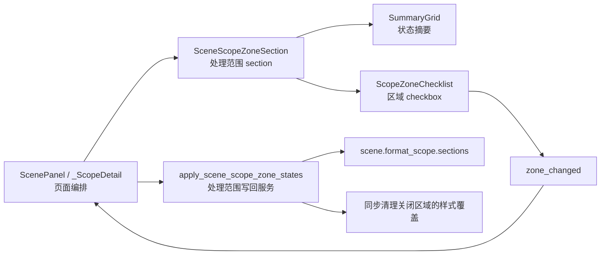

# 场景处理范围 Section 化与模板管理一致性深度分析

日期：2026-06-28

## 本轮结论

上一轮已经把处理范围的 checkbox、summary projection、写回 service 都拆了出来，但整体交互仍然“不像模板管理”。根因不是单个文案不好，而是 `_ScopeDetail` 仍在同一个类里直接拼装两种不同任务：

- 处理范围：决定本场景改哪些文档区域。
- 样式覆盖：决定某个区域是否脱离模板，并编辑局部样式。

这两个任务的用户心智不同、风险不同、控件不同，却被放在一个 detail 里用卡片堆叠。模板管理的体验更稳定，是因为它更接近“语义 section + 共享控件 + projection + preview”的结构，而不是页面类直接拼控件。

因此本轮先补上最缺的一层：新增 `SceneScopeZoneSection`，让“处理范围”成为一个场景语义 section，而不是 `_ScopeDetail` 里的一段 UI 代码。

## 与模板管理的对照

| 维度 | 模板管理现状 | 场景规划之前 | 本轮之后 |
| --- | --- | --- | --- |
| 页面职责 | 组织详情块和切换状态 | 组织页面，同时拼卡片、拼说明、拼 checkbox | 页面只接入处理范围 section |
| Section 职责 | 承载标题、summary、编辑控件、预览 | 不存在明确 section，只是 `_ScopeDetail` 内部代码段 | `SceneScopeZoneSection` 承载标题、说明、summary、区域列表 |
| 小控件复用 | 表单控件、预览、owner toolbar 可复用 | `ScopeZoneChecklist` 已复用，但还被页面直接实例化 | checklist 被 section 包住，页面不再知道 `ScopeZoneOption` |
| 状态投影 | detail summary 由 projection 生成 | 已有 `build_scene_scope_summary_items()` | section 只接收 summary items，不计算业务状态 |
| 业务写回 | 模板详情不直接散写复杂规则 | 已有 `apply_scene_scope_zone_states()` | section 只读写 checkbox 状态，写回仍交给 service |
| 可读性 | 用户看到的是“当前模板、参数概览、样式预览” | 用户看到“处理范围 + 样式覆盖”混在同一大面板里 | 处理范围已有独立语义块，样式覆盖仍待拆 |

真正的一致性不是颜色、圆角或卡片样式一致，而是层级一致：

```text
页面层：决定显示哪些 section
section 层：组合标题、summary、控件、预览
共享控件层：checkbox、toggle、owner toolbar、style surface
projection/service 层：提供可读状态和业务动作
```

## 本轮实现

### 1. 新增 SceneScopeZoneSection

文件：`src/ui/panels/scene_scope_sections.py`

新增：

- `SCENE_SCOPE_ZONE_SECTION_TITLE`
- `SCENE_SCOPE_ZONE_SECTION_DESCRIPTION`
- `SceneScopeZoneSection`

职责：

- 创建“处理范围”卡片标题。
- 管理处理范围说明。
- 持有 `SummaryGrid`。
- 持有 `ScopeZoneChecklist`。
- 把 `ScopeZoneChecklist.checked_changed` 转发为 section 级别的 `zone_changed`。
- 暴露兼容入口：`summary`、`checklist`、`checks`、`checked_states()`、`set_zone_checked()`、`set_summary_items()`。

关键设计点：

- `_ScopeDetail` 不再直接导入 `ScopeZoneChecklist` / `ScopeZoneOption`。
- `_ScopeDetail` 只把 `SCENE_SCOPE_ZONE_DISPLAY_LABELS` 传给 section。
- section 内部把 label mapping 转成 `ScopeZoneOption`。

这让页面层不再关心 checkbox option 的具体对象结构，边界更接近模板管理。

### 2. 迁移 _ScopeDetail

文件：`src/ui/panels/scene_panel.py`

迁移前，`_ScopeDetail` 直接做这些事：

```python
self._scope_card = Card(parent=self)
self._scope_card.set_header("处理范围", icon_name="map-pin")
self._detail_summary = SummaryGrid(...)
self._scope_zone_checklist = ScopeZoneChecklist(...)
self._scope_zone_checklist.set_options(...)
```

迁移后：

```python
self._scope_zone_section = SceneScopeZoneSection(
    self,
    summary_items=build_scene_scope_summary_items(None),
    zone_labels=SCENE_SCOPE_ZONE_DISPLAY_LABELS,
)
```

仍然保留：

- `self._scope_card`
- `self._detail_summary`
- `self._scope_zone_checklist`
- `self._zone_checks`

这些兼容入口保证现有导航高亮、测试和旧面板访问不被打断。内部实现已经换成 section。

### 3. 更新处理范围同步链路

`set_scene()` 不再直接操作 checkbox：

```python
self._scope_zone_section.set_zone_checked(zone_id, checked)
```

`_on_edited()` 不再从 `_zone_checks` 手写 dict：

```python
apply_scene_scope_zone_states(
    self._current_scene,
    self._scope_zone_section.checked_states(),
)
```

这不是功能变化，而是职责变化：页面不再负责理解 checklist 的内部结构。

## 当前链路



这条链路已经比之前更接近模板管理：页面层组织，section 层表达语义，共享控件层负责具体控件，service 层处理业务写回。

## 为什么这能改善可读性

之前“不说人话”的一部分原因，是用户看到的内容组织不符合决策顺序。用户其实是在回答两个问题：

1. 这次要处理哪些区域？
2. 哪些区域要脱离模板单独设置样式？

原结构把这两个问题放在一个 `_ScopeDetail` 类里，视觉上也只是上下堆卡片。开发结构的不清晰会外溢成界面不清晰：文案不得不用解释性句子补救，例如“默认跟随模板；需要单独设置时再开启覆盖”。这种句子不是坏，但它说明界面自己没有把边界讲清楚。

本轮抽出 `SceneScopeZoneSection` 后，第一类问题已经有独立容器。后续应继续把第二类问题抽成 `SceneStyleOverrideSection`，让页面结构直接表达用户决策顺序。

## 仍然不足

### 1. 样式覆盖还没有 section 化

现在 `_ScopeDetail` 仍然直接创建：

- `self._style_override_card`
- `self._style_override_summary`
- `self._style_override_toggle_list`
- owner toolbar
- style preview
- style surface

这意味着“样式覆盖”仍然是页面里的大段拼装代码，而不是可复用 section。它和模板管理的复用关系还不够稳。

### 2. 样式覆盖与处理范围的边界还可以更清晰

处理范围决定“是否进入处理链路”；样式覆盖决定“处理时是否使用局部样式”。两者有关联，但不是同一个功能。

推荐边界：

| 功能域 | 应该拥有 | 不应该拥有 |
| --- | --- | --- |
| 处理范围 section | 区域启停、范围 summary、范围变更 signal | 样式字段、owner toolbar、模板恢复 |
| 样式覆盖 section | 覆盖启停、当前分区、owner 状态、preview、style surface | 区域是否参与处理的业务写回 |
| service | 范围写回、覆盖启停、模板 fallback、清理规则 | QWidget、checkbox、toggle、layout |

### 3. 冗余说明文本仍需要继续删除

优秀设计不应该靠很多说明句来解释基础关系。下一轮应优先删除或压缩这些文本：

- `默认跟随模板；需要单独设置时再开启覆盖。`
- `选择本场景要处理的文档区域。`
- 过长的 toggle tooltip。

保留原则：

- 标题表达“这块是什么”。
- summary 表达“当前是什么状态”。
- 控件标签表达“用户能改什么”。
- tooltip 只解释风险或边界，不重复按钮/开关本身。

### 4. 样式预览还没有完全做到模板管理同款心智

模板管理里，预览是“当前模板参数会形成什么版式”。场景样式覆盖里，预览应该表达：

- 当前分区是谁：正文 / 标题 / 参考文献 / 附录。
- 来源是谁：跟随模板 / 当前场景覆盖。
- 改了什么：已覆盖 0 项 / 已覆盖中文字体、行距等。
- 风险是什么：只影响当前场景，不改模板。

现在这些信息已有 projection 和部分 property，但视觉结构还没从 `_ScopeDetail` 中独立出来。

## 下一步建议

### P0：抽取 SceneStyleOverrideSection

目标文件建议：`src/ui/panels/scene_style_override_sections.py`

建议职责：

- 创建“样式覆盖”section。
- 持有 `SummaryGrid`。
- 持有 `StyleOverrideToggleList`。
- 持有 `StyleControlOwnerToolbar`。
- 持有 `StylePreview`。
- 持有 `StyleControlSurface`。
- 暴露必要兼容入口给 `_ScopeDetail`。

抽取后 `_ScopeDetail` 应该更接近：

```python
self._scope_zone_section = SceneScopeZoneSection(...)
self._style_override_section = SceneStyleOverrideSection(...)
```

它只负责：

- 当前 scene/template 同步。
- 两个 section 之间的联动。
- 导航高亮。
- 发出 `scope_changed`。

### P1：建立 section 状态输入对象

为了避免 `SceneStyleOverrideSection` 构造函数参数爆炸，建议新增一个轻量状态对象，例如：

```python
SceneStyleOverrideSectionState(
    variants=...,
    selected_variant=...,
    owner_state=...,
    preview_projection=...,
    summary_items=...,
)
```

这会更接近模板管理的 `StyleOwnerViewState` 和 `StylePreviewProjection` 思路。

### P2：统一“模板详情”和“场景覆盖”的样式编辑容器

现在已有共享件：

- `StyleControlOwnerToolbar`
- `StyleControlSurface`
- `StylePreview`
- `StyleOwnerViewState`

下一步可以考虑抽一个更高层的 shell，例如：

```text
StyleEditingSection
  ├─ owner toolbar
  ├─ preview
  └─ control surface
```

模板管理和场景覆盖都使用它，只传不同的 owner state 和 projection。这样才是真正的高度复用，而不是几个子控件分别复用。

### P3：按用户决策链重排内容

建议目标顺序：

1. 处理范围：先选哪些区域参与。
2. 样式来源：选择跟随模板还是当前场景覆盖。
3. 当前分区预览：展示当前分区最终效果。
4. 样式编辑：只有开启覆盖后才可编辑。

这比现在“范围卡片 + 覆盖卡片 + 编辑器外置”的分布更容易理解。

## 验收标准

下一轮如果继续优化，建议用这些标准判断是否真的更优秀：

- `_ScopeDetail` 不直接实例化 `StyleOverrideToggleList`、`StyleControlOwnerToolbar`、`StylePreview`、`StyleControlSurface`。
- `_ScopeDetail` 只接入 `SceneScopeZoneSection` 和 `SceneStyleOverrideSection`。
- 处理范围和样式覆盖都有独立 section 测试。
- 场景覆盖和模板管理共享同一套 style editing shell，或者至少共享同一状态输入模型。
- 可见说明文本减少，summary 和控件标签承担主要表达。
- 关闭处理范围时，相关样式覆盖仍会被清理，且 UI toggle、summary、preview 同步刷新。
- 导航高亮仍能定位到区域 checkbox 和具体样式字段。

## 本轮验证

编译通过：

```powershell
python -m compileall src/ui/panels/scene_scope_sections.py src/ui/panels/scene_panel.py tests/test_scene_panel_architecture.py
```

聚焦测试通过：

```powershell
python -m pytest tests/test_scene_panel_architecture.py::test_scene_panel_uses_shared_card_header_and_flow_scope_layout tests/test_scene_panel_architecture.py::test_scene_scope_zone_section_wraps_summary_and_checklist tests/test_scene_panel_architecture.py::test_scene_panel_controls_follow_template_management_contract tests/test_scene_panel_architecture.py::test_scene_panel_scope_style_override_editor_writes_section_styles -q
```

结果：

```text
4 passed in 8.65s
```

## 本轮判断

当前已经不是“单纯文案不够好”的阶段，而是进入组件边界和功能分布需要继续打磨的阶段。处理范围已经完成了从小控件到语义 section 的升级；样式覆盖还停留在“共享小控件已经很多，但缺一个统一 section”的阶段。

如果要继续逼近优秀设计，下一步应该优先做 `SceneStyleOverrideSection`，再考虑是否抽共享的 `StyleEditingSection`。这会比继续微调文案更有效，因为它能从结构上减少解释文本，让界面自己说清楚。
