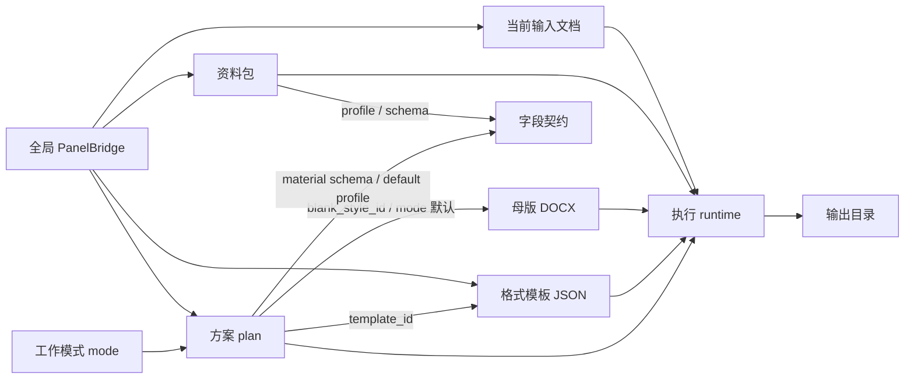
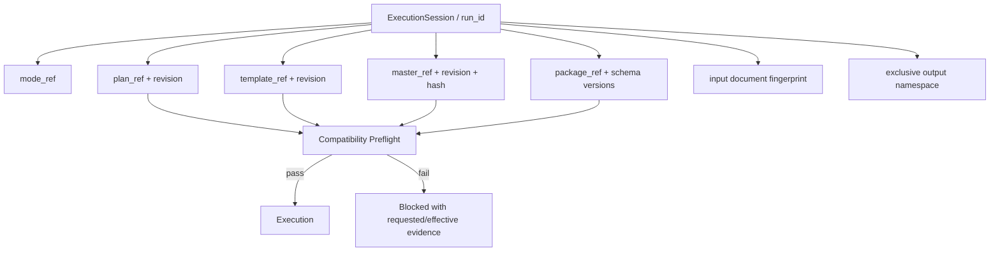
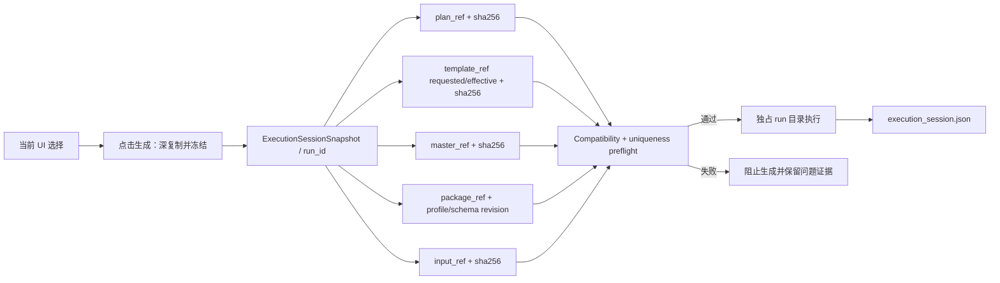

# 场景、方案、模板、母版与资料包资源隔离及链路杂糅深度审计

日期：2026-07-11  
范围：`config_library`、通用资料包、公文资料包、PanelBridge、Workbench 生成链路、输出目录  
审计性质：架构与风险分析 + 整改执行记录  
状态：2026-07-11 已完成 P0-P3 主链路整改；第 1-15 节保留整改前基线与决策依据，第 16-19 节记录整改后的实际实现与验证证据。

## 0. 整改后结论（当前有效）

当前项目仍然不是“每个方案复制一整棵资源目录”，而是**模式命名空间内的显式资源图**。这是有意设计，不是遗漏：方案、模板可以共享；母版与含附件的资料包是复合资源；每次生成由独立执行会话把所选资源冻结。

整改后的隔离边界如下：

| 对象 | 当前存储 / 身份 | 是否会互相干涉 |
|---|---|---|
| 不同 mode 的方案、模板、母版 | `<mode>/<source>` 命名空间 + `mode_id` | 不会跨 mode 静默借用 |
| 同 mode 的多个方案 | 独立 plan JSON；可显式共享 template/master | 方案字段独立；共享依赖修改前显示影响范围 |
| 普通方案副本 | 新 plan JSON，继续引用原 template/master | 共享依赖会共同变化，这是明确语义 |
| 完全独立方案副本 | 新 plan + 新 template；试卷模式同时复制用户 master | 副本依赖不再与原方案共用 |
| 同方案的多个资料包 | 每个 package 有独立 identity/manifest；运行时按 scope/schema/profile 校验 | 不兼容资料会被挂起，不能注入当前链路 |
| 新通用资料包 | `<package_id>/package.json + assets/` 自包含导出 | 移动目录后仍可用；素材哈希变化会阻止批量执行 |
| 新公文用户资料包 | `official/user/<package_id>/package.json` | 每包独立目录；旧平铺包只读兼容 |
| 每次生成 | `ExecutionSessionSnapshot + run_id` | 点击生成后不再读取变化中的 UI 全局状态 |
| 输出 | `<output_root>/<run_id>/...` | 连续运行不共用命名空间；单文件装配也自动加版本后缀 |

因此，“独立”被拆成三种准确语义：

1. **存储独立**：plan/package/run 有自己的身份和落盘位置；
2. **依赖独立**：只有“完全独立副本”复制 template/master；普通副本仍允许共享；
3. **执行独立**：每次生成冻结引用、内容哈希、输入和输出命名空间。

不再依靠“文件夹看起来分开”推断安全，而是由 `ResourceRef`、package manifest、preflight 和 execution receipt 提供可验证证据。

## 1. 结论先行

当前项目不是“一个方案文件夹内完整复制模板、母版和资料包”的树形结构，而是“方案引用共享模板 / 母版，运行时再绑定资料包”的资源图结构。

这种结构本身合理，也比每个方案复制一整套文件更易维护。但当前只完成了较好的**模式级静态隔离**，尚未完成完整的**依赖版本隔离、运行会话隔离和输出隔离**。

总体判断：

| 维度 | 当前状态 | 判断 |
|---|---|---|
| 不同工作模式的方案 / 模板 | `mode/source` 目录隔离，调用方基本都显式传 `mode_id` | 较安全 |
| 同模式 builtin / user | 允许 user 同 ID 覆盖 builtin，并明确显示来源 | 有意覆盖，不是完全独立 |
| 方案与模板 | 方案只保存模板 ID，多个方案可共享同一个模板文件 | 会共享影响 |
| 方案与母版 | 试卷通过 `blank_style_id` 间接绑定；公文按模式隐式使用唯一母版 | 链路不对称，公文绑定过于隐式 |
| 方案与资料包 | 公文只按文种 profile 过滤；通用资料包没有方案绑定 | 不独立 |
| 同方案的多个公文资料包 | 每个资料包是独立 JSON，用户保存时自动生成唯一文件名 | 存储基本独立 |
| 同方案的多个通用资料包 | 由用户自行选择 JSON 路径；界面同时只维护一个当前资料包 | 没有正式资料包库 |
| 图片、附件等资料文件 | 资料包多为路径引用，不自动复制成自包含目录 | 可被多个资料包共同影响 |
| 运行时状态 | Bridge 中只有一份全局资料上下文、批量选择、当前文档 | 存在跨模式 / 跨方案残留 |
| 生成输出 | 默认按输入文件名或实体名称生成，缺少 package/run 唯一命名 | 存在覆盖风险 |

因此，对用户问题的直接回答是：

1. **不是每个场景、方案、模板、资料包都各自拥有独立文件夹。**
2. 内置方案和模板目前不会无缘无故跨模式串用；这一层已有明确保护。
3. 用户模板、用户母版和外部素材是共享引用，修改共享文件会影响所有引用者。
4. 资料包与方案并没有建立强绑定，同方案的不同资料包也没有独立运行会话。
5. 没有 AI 意义上的“幻觉”，但存在静默默认回退、别名归一化和隐式母版选择，会产生类似“系统自己猜了一个”的异常感受。
6. 当前最大的杂糅点不是文件目录，而是：**全局 Bridge 状态、隐式 master 选择、未版本化的共享依赖和可覆盖的输出路径。**

## 2. 必须先区分的四种对象

项目中“模板”一词容易把不同层级混在一起：

| 对象 | 实际作用 | 当前载体 |
|---|---|---|
| 工作模式 mode | 最高层产品入口与资源命名空间 | `src/config/work_mode.py` |
| 方案 plan / scene | 决定模块开关、范围、交付策略、默认模板、资料 schema | `config_library/plans/<mode>/<source>/*.json` |
| 格式模板 template | 字体、段落、页面和样式参数 | `config_library/templates/<mode>/<source>/*.json` |
| 母版 master | 真正用于结构化装配的 DOCX 壳及 placeholder contract | `config_library/masters/<mode>/<source>/` |
| 资料包 material package | 某次或某批次生成要填入的字段和素材引用 | 公文资料库或用户指定 JSON |
| 执行会话 execution session | 本次选中的 mode、plan、template、master、package、input、output | 当前没有独立持久化对象，由 Bridge 临时拼接 |

当前核心关系不是包含，而是引用：



风险来自引用边是否显式、是否带版本，以及一次执行是否把这些引用冻结成不可混淆的会话快照。

## 3. 当前物理目录盘点

### 3.1 实际目录结构

```text
config_library/
  plans/
    <mode>/
      builtin/
        <plan_id>.json
      user/
        <plan_id>.json

  templates/
    <mode>/
      builtin/
        <template_id>.json
      user/
        <template_id>.json

  masters/
    exam/
      builtin/
        <master_id>.master.json
        <master>.docx
      user/
        <master>.docx
    official/
      builtin/
        official_gbt_standard.master.json
        official_gbt_standard.docx
        visual_baselines/

  material_packages/
    official/
      builtin/
        <sample_id>.material.json
      user/
        <sample_id>.material.json
```

通用资料包不在上述统一库中。`EntityArchive` 通过文件对话框导入 / 导出到任意 JSON 路径，素材目录和图片仍以路径字符串引用。

### 3.2 当前库存

审计时实际存在：

| 类型 | 数量 | 备注 |
|---|---:|---|
| 内置方案 | 14 | 分布于 7 个 mode |
| 模板 JSON | 12 | 全局 ID 共 11 个；`default` 同时存在于 custom 和 exam |
| 可选母版 manifest | 4 | exam 3 个，official 1 个 |
| 公文内置资料包 | 6 | 通知、函、纪要、报告、请示、批复各 1 个 |
| 当前同 mode 的 user/builtin 同 ID 覆盖 | 0 | 代码允许，当前工作区没有 |
| 当前缺失的 plan -> template 引用 | 0 | 14 个方案均能在自身 mode 找到引用模板 |

`default` 模板虽然同名，但物理路径分别为：

```text
templates/custom/builtin/default.json
templates/exam/builtin/default.json
```

只要调用方携带 `mode_id`，不会互相串用。现有 UI 还有 AST 回归测试，禁止核心库调用漏传 mode 上下文。

## 4. 哪些地方已经隔离得比较好

### 4.1 mode 是方案和模板的真实命名空间

`src/config/library.py` 的读取顺序为：

```text
<mode>/user
  -> <mode>/builtin
  -> 允许时才读取 legacy
```

资源去重键为 `(mode_id, config_id)`，不是单独 `config_id`。因此不同 mode 可以合法存在同名模板或方案。

当前 UI 中方案、模板和母版的主要调用都显式传递 `mode_id`。针对性检查 `test_ui_config_library_calls_are_mode_scoped` 通过。

### 4.2 跨模式模板引用会被归一化到本模式

加载方案时 `_normalize_scene_templates()` 会检查模板 ID 是否在当前 mode 可用。试卷方案如果错误引用 `official_gbt`，不会跨目录借用公文模板，而会回到 exam 的 `default`。

这是跨模式隔离保护，但同时也是静默回退风险，见第 7 节。

### 4.3 builtin / user 同 ID 不会随机二选一

同一 mode 下，user 同 ID 明确优先于 builtin，并在选择器中标记为“用户模板 / 用户资料包”。

若 user 文件损坏，系统不会偷偷借用同 ID builtin，而是把用户资源标记为不可用。这一点可以防止“明明选了用户配置，实际却跑了内置配置”。

### 4.4 公文资料包使用 qualified identity

公文资料包的选择值是：

```text
builtin/<sample_id>
user/<sample_id>
```

当 builtin 和 user 存在相同 `sample_id` 时，裸 ID 会返回 `sample_ambiguous`，不会静默选择其中一个。

用户保存到公文资料库时，若文件名已经存在，会依次产生：

```text
package.material.json
package_2.material.json
package_3.material.json
```

因此，同一文种、同一方案下的多份公文资料包在**存储文件层面**是独立的。

### 4.5 母版不会跨 mode 回退

`list_masters()` 和 `get_master()` 对 exam / official 分开枚举；其他 mode 不会误拿试卷或公文母版。现有回归测试已覆盖该行为。

## 5. 并非完全独立的地方

### 5.1 方案不是完整快照，而是共享依赖的引用者

方案文件只记录 `template_id`，不会复制模板内容。

例如多个公文方案都引用：

```text
template_id = official_gbt
```

这意味着：

- 修改一次共享用户模板，所有引用该 ID 的方案下次加载都会看到新内容。
- 复制方案只复制方案 JSON，不复制其模板。
- 删除用户模板后，引用它的方案会在加载时被归一化到默认模板。
- 当前没有 `template_revision` 或内容哈希，方案无法重现“上周使用的那一版模板”。

这属于“共享引用影响”，不是跨目录串读，但对用户而言仍可能表现为“我只改了方案 A，方案 B 怎么也变了”。

### 5.2 试卷自定义母版也可能被多个方案共享

试卷方案通过 `exam_paper.custom_blank_styles[*].master_docx_path` 保存母版路径。

复制方案时会深复制配置对象，但路径值不变，不会复制 DOCX 文件。因此两个方案副本可能继续引用同一个用户母版。后续直接编辑该 DOCX，会同时改变两个方案的输出。

### 5.3 公文母版绑定是隐式的

所有公文方案都通过 `default_master("official")` 使用：

```text
official/official_gbt_standard
```

方案 JSON 中没有 `master_id`。公文 master manifest 虽声明：

```text
template_config_id = official_gbt
```

但 `resolve_execution_target()` 并不会根据当前选中的 template 校验或选择 master。

因此当前可能出现：

```text
当前模板 = official_custom
实际结构母版 = official_gbt_standard
```

这不一定立刻生成错误，因为模板 JSON 和 DOCX 母版本来是两个层级；但界面如果不显示“格式模板”和“结构母版”两条来源，用户会认为链路杂糅。

### 5.4 公文资料包绑定文种，不绑定方案

当前公文资料包包含：

```text
kind
version
sample_id
profile_id / official_profile_id
material_schema_ids
entity_data
```

不包含：

```text
mode_id
scene_id / plan_id
template_id
master_id
master_version
```

资料包选择器只按 `profile_id` 过滤。因此一份 `official:notice` 资料包可以用于任何切换到 notice profile 的公文方案。

这是复用能力，但它说明“资料包属于某个方案”目前并不成立。若要限制适配范围，只能依赖 profile/schema 检查，无法判断该资料包是否就是为当前方案、当前模板或当前母版制作的。

### 5.5 通用资料包不是自包含资源

`EntityArchive` 只把下列值写入 JSON：

```text
fields
assets_dir
asset_paths
asset_items
```

图片和附件本体不会复制到资料包目录，也没有内容哈希。两个资料包可以引用同一素材目录或同一图片文件，修改外部文件会同时影响两者。

相对路径也没有基于“资料包 JSON 所在目录”重新解析；运行时直接使用路径字符串。移动资料包、改变启动目录或把资料包复制到另一台机器后，可能找不到素材，或错误解析到另一个同名相对路径。

### 5.6 通用资料包界面实际只维护一个当前包

`_archive_combo` 只同步当前资料包这一项。“新建资料包”和“创建副本”首先创建内存对象，只有用户执行“导出资料包”后才形成独立文件。

“删除资料包”也只是清空当前内存状态，不删除磁盘上的导出 JSON；“打开资料包文件夹”打开的优先是素材目录或当前文档目录，不一定是资料包 JSON 所在目录。

所以当前通用资料页的“资料包库”更多是编辑器语义，而不是完整的持久化资料库。

## 6. 已确认的运行态串链风险

### 6.1 PanelBridge 只有一份全局资料状态

`PanelBridge` 当前保存：

```text
_current_work_mode
_current_scene
_current_template
_current_document_path
_material_context
_material_batch_selection
```

切换 work mode 时，`set_current_work_mode()` 只修改 mode 并刷新 execution target，不会清理或切换：

- 当前资料上下文；
- 当前批量选择；
- 当前输入文档；
- 当前方案和模板。

主窗口随后会加载新 mode 的默认方案和模板，但资料上下文、批量选择和输入文档仍保留。

本轮实际复现：

```text
切换前：official + official plan + official:notice material + source.docx
只切 mode 后：exam + 旧 official plan + 旧 official material + source.docx
新 exam plan 加载后：exam + exam plan + 旧 official material + source.docx
```

execution target 会变成 exam 的结构化目标，因此不会拿公文母版当试卷母版；但旧 `official:notice` 资料仍会继续进入 Workbench，并通过 `MaterialExecutionContext.to_resolve_kwargs()` 合并到 resolved config。

跨模式字段是否最终生效取决于新方案启用的模块和字段是否碰巧匹配。这不是每次必现的错误，但它是明确的状态污染入口。

### 6.2 方案切换也没有资料包所有权检查

同 mode 内切换 plan 时，Bridge 仍保留当前 material context。公文计划的默认 profile 可能是 letter / minutes / report，但当前 context 可能仍是 notice。

`resolve_execution_target()` 会优先读取 material context 的 profile，再读 scene 默认 profile。因此旧资料包可能反过来决定当前公文执行契约。

这使实际优先级变成：

```text
当前资料包 profile
  > 当前方案 default_material_profile_id
```

若 UI 同步及时，用户通常会看到文种随资料变化；若某个入口没有同步，就会出现“选了纪要方案却按通知资料运行”的链路错觉。

### 6.3 批量资料选择同样是全局状态

`MaterialBatchSelection` 没有 `mode_id`、`scene_id` 或 `session_id`。切换方案或模式不会自动使其失效。

它包含独立 clone，能避免对象引用被直接修改，但不能防止“上一方案的批量选择被下一方案继续使用”。

## 7. “异常幻觉”实际来自哪些确定性行为

项目没有调用 AI 去猜资源，但存在以下确定性兜底和归一化行为，用户感受会类似幻觉。

### 7.1 缺失模板 ID 静默加载模式默认模板

实际验证：

```text
load_template_from_library("definitely_missing_template", mode_id="official")
  -> 返回 official_gbt

load_template_from_library("definitely_missing_template", mode_id="exam")
  -> 返回 exam/default
```

调用者如果继续保留原请求 ID，就可能形成：

```text
请求 ID = missing_template
实际对象 = official_gbt
```

当前测试把这种行为视为兼容性策略，但对正式执行链应当显示“requested / effective”差异，不能静默运行。

### 7.2 失效模板引用会在方案加载时被重写

`_normalize_scene_templates()` 会把当前 mode 中不存在的模板 ID替换为默认模板。这能阻止跨模式串用，但也会抹掉原始错误引用。

更稳妥的方式是：

```text
保留 requested_template_ref
标记 unresolved
阻止生成或要求用户确认 fallback
另存 effective_template_ref
```

### 7.3 公文 profile 支持标签别名和空值默认 notice

公文导入允许中文标签和 `函件` 等别名映射；空 profile 会默认 notice。这是明确规则，不是模糊相似度推断，但如果导入文件漏写 profile，系统可能把本应报错的数据当通知处理。

建议将别名仅用于交互式导入迁移，正式 package manifest 必须持久化规范 ID。

### 7.4 `get_master()` 未传 mode 时默认 exam

这属于历史兼容入口。UI 已通过测试确保调用时携带 mode，但核心 API 仍允许无 mode 调用并默认为 exam。未来新增调用者如果忽略作用域，可能产生不易察觉的偏向。

## 8. 输出文件互相覆盖风险

### 8.1 同一输入文档、不同公文资料包

公文单份运行使用：

```text
<source_stem>_official.docx
```

`assemble_official_document_docx()` 直接 `document.save(target)`，不会检查目标是否已经存在。

本轮实际复现：对同一 output dir 和同一 filename 连续装配两个资料包：

```text
same_path = True
hash_changed = True
```

第二次生成覆盖第一次文件。

因此“两个资料包文件独立”并不等于“两个生成结果独立”。

### 8.2 批量 profile 的输出目录也可能冲突

默认 `output_dir_template` 是 `{entity_name}`。如果两个 profile 得到相同 entity name，或 profile ID 重复，`build_material_batch_items()` 会生成相同目录。

`load_entity_archive()` 不验证 profile ID 唯一；`EntityArchive.get_profile()` 对重复 ID 返回第一项，而批量选择会把所有匹配项选中。这会同时造成：

- 修复目标指向第一项；
- 批量结果身份不唯一；
- 输出目录相同；
- 后一份覆盖前一份或混入同一目录。

## 9. 风险矩阵

| 等级 | 风险 | 已确认影响 |
|---|---|---|
| P0 | mode / plan 切换后资料上下文和批量选择不失效 | 旧资料可继续进入新执行链 |
| P0 | 输出路径没有 package/run 唯一性和覆盖保护 | 同输入不同资料包可覆盖结果 |
| P0 | 缺失模板静默 fallback | 请求资源和实际资源不一致 |
| P1 | 用户模板 / 用户母版是共享可变引用 | 修改一个依赖影响多个方案 |
| P1 | 公文 master 按 mode 隐式选择 | template 与 master 来源不透明 |
| P1 | 公文资料包不绑定 plan/template/master/version | 无法证明资料与当前装配链完全兼容 |
| P1 | 通用资料包素材只存路径且不相对 package 解析 | 移动、共享或修改素材会影响多个包 |
| P1 | profile ID 和最终输出目录不做唯一性预检 | 批量身份和输出可能冲突 |
| P2 | 通用资料包无 kind/version/mode/schema manifest | 难以迁移和做兼容性校验 |
| P2 | 方案 / 模板引用无 revision/hash | 无法重现历史执行 |
| P2 | 外部模板可成为当前对象，但场景只持久化其 stem ID | 重启后可能失联并回退默认模板 |
| P2 | 配置文件直接 `write_text`，无临时文件原子替换 | 崩溃时可能留下损坏 user 文件 |
| P3 | 同 mode user 同 ID shadow builtin | 目前有来源标签和损坏阻断，风险可控 |
| P3 | legacy/unscoped API 仍存在 | 当前 UI 有调用检查，新增核心调用需谨慎 |

## 10. 是否应该“全部改成独立文件夹”

不建议把每个方案机械复制成完整孤岛。那会导致模板修复、母版升级和 schema 调整需要重复修改许多副本。

建议采用“资源独立身份 + 显式引用 + 可选完整分叉”的模式。

### 10.1 适合继续一项一文件的资源

纯 JSON 且没有附属文件时，可以保持：

```text
plans/<mode>/<source>/<plan_id>.json
templates/<mode>/<source>/<template_id>.json
```

但引用必须升级为带作用域和版本的 ResourceRef：

```json
{
  "kind": "template",
  "mode_id": "official",
  "source_type": "user",
  "resource_id": "office_custom",
  "revision": "sha256:..."
}
```

### 10.2 应该每项独立文件夹的资源

母版和含素材的资料包是复合资源，建议一项一个目录：

```text
masters/<mode>/<source>/<master_id>/
  master.json
  master.docx
  preview/
  visual_baselines/

material_packages/<mode>/<source>/<package_id>/
  package.json
  assets/
  attachments/
  preview/
```

这样不是为了让 package 隶属于 plan，而是为了让 package 自包含、可移动、可校验。

### 10.3 同方案多资料包的正确关系

不建议目录嵌套为：

```text
plans/<plan_id>/packages/...
```

因为一份资料可能合法复用于多个兼容方案。

建议建立执行绑定：

```text
ExecutionSession
  session_id
  mode_ref
  plan_ref
  template_ref
  master_ref
  package_ref
  input_document_ref
  output_namespace
```

每次生成冻结一份 session snapshot。资料包是否兼容由 manifest 和 preflight 判断，而不是靠它放在哪个方案目录下判断。

## 11. 推荐目标架构



核心原则：

1. 资源可以共享，但引用必须显式。
2. 共享资源修改前必须显示引用者数量和影响范围。
3. “创建方案副本”默认只复制方案；另提供“完整分叉”复制模板和用户母版。
4. 每次执行生成不可变 session snapshot，不直接读取会变化的全局 UI 状态。
5. fallback 必须变成显式诊断，正式执行不能悄悄换资源。
6. 输出路径必须在执行前完成全批次唯一性检查。

## 12. 建议整改顺序

### P0：先阻断真实串链和覆盖

1. 新增 `ExecutionSessionSnapshot`，Workbench 点击生成时一次性冻结：
   - mode_id；
   - plan ID/path/source/revision；
   - template ID/path/source/revision；
   - master ID/path/version/hash；
   - package ID/profile/schema；
   - input path/hash；
   - output root/run_id。
2. mode / plan 切换时对 material context 和 batch selection 做作用域检查：
   - 匹配则保留；
   - 不匹配则挂起到旧 session，不继续注入新方案；
   - UI 明确提示“旧资料未应用到当前方案”。
3. 正式执行入口禁止缺失模板静默 fallback；返回 `template_ref_unresolved`。
4. 输出 preflight 计算所有最终路径，发现重复或已存在时阻止执行，或明确选择版本后缀。
5. 校验 archive 内 `profile_id` 唯一，并校验最终 output path 唯一。

### P1：补齐资源引用和 package manifest

1. 方案增加显式 `template_ref`；需要母版的模式增加 `master_ref`。
2. 公文方案不再仅靠 `default_master("official")`，而由 plan/profile contract 解析明确 master。
3. 公文资料包增加：
   - `mode_id`；
   - `compatible_profile_ids`；
   - `material_schema_versions`；
   - 可选 `compatible_master_families`；
   - created/updated metadata。
4. 通用 `EntityArchive` 升级为正式 package manifest，加入 kind/version/mode/schema。
5. 素材路径改为 package-relative；导出时可选择复制资源并记录 SHA-256。

### P2：补版本、影响分析和完整分叉

1. plan/template 保存内容 hash 或 revision。
2. 修改共享用户模板 / 母版前显示引用它的方案列表。
3. 提供两种复制语义：
   - “创建方案副本”：继续引用共享模板和母版；
   - “创建完全独立副本”：复制用户模板、用户母版并改写引用。
4. 配置保存改为临时文件 + fsync/close + atomic replace。
5. 逐步废弃不带 mode 的库查询和 `get_master()` 默认 exam 行为。

### P3：迁移与兼容

1. 读取旧 plan 的 `template_id` 时生成 ResourceRef，但保留迁移记录。
2. 读取旧 EntityArchive 时建立 package manifest，不修改原文件。
3. 对 legacy 平铺目录只读，禁止继续保存新文件。
4. 在执行报告中同时记录 requested resource 和 effective resource。

## 13. 建议增加的验收用例

```text
[ ] official -> exam 切换后，旧 official material 不进入 exam resolved config
[ ] plan A -> plan B 切换后，不兼容 package 被挂起而不是自动接管 profile
[ ] 同一方案连续选择两个资料包，输出路径不会相同
[ ] 批量 profile ID 重复时阻止生成
[ ] 批量最终目录重复时阻止生成
[ ] 缺失 template_ref 时正式执行失败，不返回默认模板
[ ] current template 与 master.template_config_id 不兼容时阻止公文执行
[ ] 方案普通副本共享模板，并在 UI 明确显示“共享”
[ ] 方案完整副本生成新的 template/master 引用
[ ] 移动自包含资料包目录后，所有 package-relative 素材仍可读取
[ ] 修改共享素材时，hash 变化触发 package preflight
[ ] 执行报告可还原 mode/plan/template/master/package/input/output 全链路
```

## 14. 本轮验证证据

### 14.1 静态引用审计

```text
plan_count = 14
plan -> same-mode template missing = 0
official master -> template_config_id official_gbt exists = true
same-mode user/builtin shadow in current workspace = 0
cross-mode duplicate template id = default(custom, exam)
```

六个公文内置资料包均带 profile/schema，但均不带 scene/template/master 绑定。

### 14.2 运行态复现

```text
before:
  official / official plan / official:notice / source.docx

after set_current_work_mode("exam"):
  exam / old official plan / old official:notice / source.docx

after loading exam scene:
  exam / exam plan / old official:notice / source.docx
```

### 14.3 fallback 复现

```text
missing official template -> GB/T 9704 公文格式
missing exam template     -> 默认格式
missing custom template   -> 默认格式
missing scene             -> ValueError，未静默 fallback
```

### 14.4 输出覆盖复现

```text
同一 output_dir + 同一 filename + 两份不同公文资料：
same_path = true
hash_changed = true
```

### 14.5 既有自动化保护

以下 9 项针对性回归全部通过：

```text
UI 配置库调用必须携带 mode
跨 mode 同 ID 模板隔离
同 mode user 覆盖 builtin 的确定性
损坏 user 模板不静默借用 builtin
损坏 user 方案保持不可用
方案跨 mode 模板引用归一化
公文同 ID 资料包要求 qualified identity
母版不跨 mode fallback
批量单 profile 失败隔离
```

测试结果：`9 passed`。

## 15. 最终判断

当前静态目录结构已经从早期平铺状态进化为合理的 mode-scoped 资源库，**没有证据表明现有内置方案会随机跨目录读取别的模式文件**。

但“目录隔离”不能代替“执行隔离”。当前方案引用共享可变模板 / 母版，资料包没有 plan 所有权，全局 Bridge 又持续保存上一条链路的资料和文档，最终输出还可能复用同一路径。因此系统仍可能出现：

```text
文件没有串
  但引用共享了
  或运行态残留了
  或 fallback 换资源了
  或输出被覆盖了
```

最优方向不是把所有东西机械塞进各自方案文件夹，而是：

```text
mode 负责命名空间
ResourceRef 负责明确引用
revision/hash 负责可复现
package manifest 负责兼容性
ExecutionSession 负责本次链路隔离
exclusive output namespace 负责结果隔离
```

完成 P0 后，才能认为“同方案的不同资料包”和“不同场景之间”在运行意义上真正互不干涉。

## 16. 整改执行结果

### 16.1 P0：运行会话、状态作用域、严格解析、输出隔离

已完成：

- 新增 `ResourceRef` 和不可变 `ExecutionSessionSnapshot`；
- Workbench 点击生成时深复制 scene/template/archive/material context，冻结本次资源图；
- session 固化 mode、plan、template、master、package、input、output 及 SHA-256；
- 每次运行生成 `run_<UTC>_<uuid>`，输出进入独占目录；
- `execution_session.json` 无论成功或异常都随执行结果落盘；
- mode/plan 切换时检查资料上下文和批量选择作用域，不兼容状态进入挂起记录并清空当前注入；
- UI 显示“旧资料已挂起，未应用到当前方案”；
- Workbench 正式加载交付模板使用 `allow_fallback=False`；缺失引用返回 `template_ref_unresolved`；
- 若旧方案的 `requested_id` 与归一化后的 `effective_id` 不同，session 同时记录两者并阻止执行；
- 公文直接装配若目标文件已存在，使用 `_2`、`_3` 后缀，不覆盖原文件；
- 批量 preflight 阻止空/重复 profile ID、非法输出模板和重复最终目录。

关键实现：

```text
src/config/resource_ref.py
src/services/execution_session/__init__.py
src/config/material_context.py
src/config/material_batch.py
src/ui/bridge.py
src/ui/panels/workbench/execution_session_controller.py
src/ui/panels/workbench/execution_worker.py
src/shared/engine/official_document_assembly.py
```

### 16.2 P1：方案显式引用与资料包 manifest

已完成：

- `SceneWorkspace` 增加 `template_ref`、`master_ref`；
- 14 个内置方案均持久化显式 template/master 引用；不需要母版的 mode 使用 `not_applicable`；
- 公文/试卷 master 查询必须携带 mode；`get_master()` 不再无 mode 默认 exam；
- master manifest 可声明 `compatible_template_config_ids`，不兼容组合在 session preflight 阶段阻止；
- 公文资料包正式定义为首版 v1，包含 mode/package/profile/schema/master-family compatibility metadata；
- 新公文用户包改为一包一目录：`<package_id>/package.json`；仍可读取旧 `*.material.json`；
- 通用 `EntityArchive` 正式定义为 `alavette.material_package` v1，加入 mode/package/schema manifest；
- 相对素材路径以 `package.json` 所在目录解析；
- “导出自包含资料包”复制素材到 `assets/`，manifest 不再依赖原始绝对路径；
- 自包含导出记录文件/素材目录 SHA-256；内容被替换或丢失时，batch preflight 返回 `asset_hash_mismatch`。

### 16.3 P2：版本、共享影响、完整分叉、原子保存

已完成：

- plan 加载/保存时为 template/master 引用计算内容 SHA-256；执行时再次按实际文件计算；
- 保存共享模板前列出引用该模板的方案并要求确认；
- 普通“创建方案副本”继续共享依赖；
- 新增“创建完全独立副本”：复制模板并改写引用，试卷模式同时复制当前用户母版；
- scene/template/package/session receipt 保存统一采用同目录临时文件、flush/fsync、`os.replace`；
- 配置中断不会用半写文件覆盖上一份完整版本。

### 16.4 P3：旧格式迁移与证据保留

已完成：

- 旧 plan 的 `template_id` 在内存中生成 ResourceRef；原 requested/effective 身份均可进入执行报告；
- 未版本化 EntityArchive 读取时按 v0 输入处理，并按包目录解析相对素材，不改写源文件；
- 另存时写为首版标准资料包 v1；
- 公文未版本化资料转换采用“另存副本”，源文件和当前 Bridge scene/template/material 均不被修改；
- legacy 平铺路径继续只读兼容，新保存统一进入 mode-scoped/user 或 package 目录；
- Windows 读取 POSIX 绝对路径（如 `/tmp/assets`）时保持原字符串，避免错误改写为 `C:\\tmp\\assets`。

## 17. 整改后的资源与执行链路



运行阶段不再用 package 是否位于 plan 子目录判断归属。资料可以复用，但必须满足 mode、scene、profile、schema、master family 和内容完整性约束。

## 18. 验收清单执行状态

```text
[x] official -> exam 切换后，旧 official material 被挂起
[x] plan A -> plan B 切换后，scene-scoped package 被挂起
[x] 同一方案连续运行两次，session_id 与 output namespace 不同
[x] 批量 profile ID 重复时阻止生成
[x] 批量最终目录重复时阻止生成
[x] 缺失 template_ref 时正式执行失败，不返回默认模板
[x] requested/effective 模板不同被记录并阻止执行
[x] template 与 master compatibility contract 不匹配时阻止执行
[x] 普通副本继续共享依赖，保存共享模板前显示引用方案
[x] 完全独立副本生成新的 template 引用；试卷同时复制 master
[x] 移动自包含资料包目录后，相对素材仍可读取
[x] 修改自包含包素材后，SHA-256 校验触发 preflight 失败
[x] 执行回执记录 mode/plan/template/master/package/input/output 全链路
[x] 公文同名目标文件不会被覆盖
[x] 配置与 manifest 使用原子替换保存
```

## 19. 验证记录与剩余边界

### 19.1 自动化结果

整改核心相关分段回归：

```text
459 passed in 129.49s
```

新增隔离专项包含：

```text
mode 切换挂起旧资料
plan 切换挂起 scene-scoped 资料
缺失引用严格阻断
requested/effective 证据
master-template compatibility
连续运行输出命名空间唯一
执行回执落盘
重复 profile/output 阻断
未版本化资料非破坏转换为首版格式
跨平台绝对路径保持
自包含资料包移动可用
素材哈希篡改阻断
共享模板影响清单
完全独立方案副本
公文输出不覆盖
```

全仓共收集 `2112` 项测试。两次整仓 `pytest -q` 分别受 4 分钟和 10 分钟命令时限终止，终止前没有输出失败摘要，因此不能表述为“2112 项全绿”；改为对本次改动直接影响的 17 个测试文件执行完整分段回归并全部通过。

### 19.2 当前仍有意保留的边界

1. builtin 复合资源暂未机械迁移为每项独立目录；读取层同时支持旧平铺 builtin 和新目录式 user package，避免破坏已发布资源路径。
2. 普通方案副本仍共享模板/母版，这是产品语义；需要隔离时必须选择“创建完全独立副本”。
3. package compatibility 是允许复用的契约，不等于 package 私有隶属于某个 plan。
4. user 同 ID 覆盖 builtin 仍被允许，但来源明确、损坏不静默回退。

这些边界不会导致随机串链；它们是显式、可检查且有失败证据的复用规则。

## 20. 首次发布前的版本语义收口

项目尚未正式发布，因此资料包不存在已发布的“第二版”。本轮进一步统一：

```text
标准公文资料包          version = 1
标准通用资料包          version = 1
缺少 kind/version 的输入  识别为未版本化输入（内部 detected_version = 0）
version > 1             明确拒绝，不作为当前格式读取
```

界面统一使用首版格式的转换措辞：

```text
转换资料包
另存标准公文资料包
已另存为标准资料包
```

这里的“转换”只表示把开发期未版本化 JSON 写成首版规范 manifest，不代表产品已经经历过一次发布升级。

另外排查到的 `WorkbenchPanelV2`、`panel_v2.py`、`default_exam_v20.docx` 属于开发期内部实现名或物理资产修订名，不是产品发布版本；它们没有被用来声明“产品第二版”。其中 Workbench V2 不作为用户文案显示，试卷母版对外通过稳定 `master_id` 解析。后续若清理这些内部文件名，应单独做引用重命名，不能与正式格式版本混为一谈。
