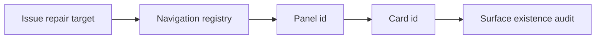
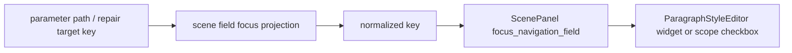

# 场景样式控件与模板管理复用链路再审计

日期：2026-06-28

本轮目标：继续对“场景规划页的样式与控件为什么仍然没有达到模板管理那种一致性和可读性”做深度分析，并记录一轮更靠近实现链路的结论。重点不再是追加说明文字，而是确认复用边界、字段契约、导航链路和控件形态是否真正打通。

相关前置记录：

- `docs/audits/场景规划现状与模板预览样式归一化深度分析_2026-06-27.md`
- `docs/audits/场景概览与模板管理一致性和可读性重构规划_2026-06-27.md`
- `docs/audits/场景样式控件与模板管理高度复用深度分析_2026-06-28.md`
- `docs/audits/场景功能分布边界与文案精简深度分析_2026-06-28.md`
- `docs/audits/场景链路闭环深度审计_2026-06-28.md`
- `docs/refactor-records/工作台问题导航注册表执行记录_2026-06-28.md`
- `docs/audits/工作台导航目标面存在性审计记录_2026-06-28.md`

## 1. 本轮结论

当前系统已经从“同类控件长得相似”推进到了“部分核心控件真实共享”，但距离优秀设计仍有三层差距：

| 层级 | 当前状态 | 判断 |
| --- | --- | --- |
| 段落样式输入控件 | `ParagraphStyleEditor` 已经被模板正文排版和场景分区样式覆盖共同使用 | 已进入共享控件阶段 |
| 字段别名与控件定位 | 共享编辑器有 `canonical_paragraph_style_field_id()`，本轮新增场景字段 focus 投影审计 | 开始闭环，但只覆盖场景 scope/style |
| 详情页骨架 | 模板管理是 `TemplateSummaryCard + InspectorForm + 分组卡片`，场景页仍大量是 `Card + SummaryGrid + 手写行` | 不一致 |
| 状态会话 | 模板管理有保存、恢复、快照、dirty 状态；场景样式覆盖更像即时写入 | 不一致 |
| 预览模型 | 模板正文排版和场景覆盖都有预览，但“模板基线值 + 场景覆盖值 + 最终生效值”的差异表达还没有统一 | 未完全闭环 |
| 问题跳转链路 | 路由到面板/卡片已审计，本轮补到场景字段级 key 审计 | 比上一轮更完整 |
| 资料/schema 细粒度聚焦 | `schema` 已归入资料面板，不再兜底到工作台卡片，但 AssetsPanel 还没有 schema 级 focus 审计 | 仍有缺口 |

所以问题不是“还需要更多文案解释”。真正的问题是：场景页现在只复用了局部零件，还没有复用模板管理那套“详情页会话”和“字段到控件的契约”。继续堆说明文字会让页面更像审计报告，反而离优秀设计更远。

## 2. 与模板管理的再次比对

### 2.1 模板管理已经形成稳定产品语言

模板正文排版页的成熟点集中在这些实现上：

- `src/ui/panels/template_style_detail.py:151`：顶部 `TemplateSummaryCard` 承担当前状态、保存、恢复。
- `src/ui/panels/template_style_detail.py:176`：正文排版已经使用共享 `ParagraphStyleEditor`。
- `src/ui/panels/template_style_detail.py:282`、`300`、`333`：文字样式、对齐缩进、行距段距分别用 `InspectorForm` 建立一致表单节奏。
- `src/ui/panels/template_style_detail.py:394`：`focus_navigation_field()` 能把外部问题定位到具体段落样式控件。
- `src/shared/ui/template_summary_card.py:38`、`src/shared/ui/inspector_form.py:18`、`src/shared/ui/template_form_layout.py:121`、`233`：模板详情页已经有可复用的骨架和表单基础设施。

模板页的用户心智是：

1. 先知道当前模板是什么。
2. 再看当前参数摘要。
3. 进入一个清晰的设置分组。
4. 修改后可保存、恢复、预览。
5. 外部问题可以直接定位到对应控件。

这套心智比单个控件本身更重要。

### 2.2 场景页已经复用了控件，但还没复用会话

场景处理范围和样式覆盖集中在 `_ScopeDetail`：

- `src/ui/panels/scene_panel.py:2202`：`_ScopeDetail` 同时承载处理范围和分区样式覆盖。
- `src/ui/panels/scene_panel.py:2305`：场景内构建“编辑样式”区。
- `src/ui/panels/scene_panel.py:2345`：场景页也使用 `ParagraphStyleEditor`。
- `src/ui/panels/scene_panel.py:2368`：场景页有自己的字段 focus 逻辑。

这说明“控件共享”已经开始落地，但用户感知仍然不够好的原因是：

- 处理范围和样式覆盖仍挤在同一详情里，边界不清。
- 场景页没有复用模板页的顶部状态卡和统一表单节奏。
- 模板页按“当前对象 -> 分组编辑 -> 保存/恢复”组织；场景页更像“把所有运行时开关放在一起”。
- 场景样式覆盖的核心状态是“跟随模板 / 本场景覆盖”，但这没有成为页面主轴。
- 文案还在解释内部契约，控件状态却没有足够承担解释。

优秀设计应让用户不必理解 `scene.section_styles.references_body.font_cn` 这种路径，也能知道“参考文献段落现在跟随模板，还是只在本场景覆盖”。

## 3. 功能分布应该重新划界

建议把场景配置拆成更清晰的五个功能域，而不是继续让“场景概览 / 处理范围 / 功能开关”承担所有含义。

| 功能域 | 回答的问题 | 应放的内容 | 不应放的内容 |
| --- | --- | --- | --- |
| 场景身份 | 这是什么任务、基于哪个模板、产出什么 | 场景预设、关联模板、输出版本摘要 | 大量内部成熟度统计 |
| 处理范围 | 本次处理文档哪些部分 | 正文、参考文献、附录、摘要等开关 | 字体、字号、行距编辑器 |
| 样式覆盖 | 哪些部分不跟随模板默认样式 | 跟随/覆盖状态、分区选择、共享段落样式编辑器、恢复模板 | 普通模块开关、资料 schema |
| 运行能力 | 本场景启用哪些处理能力 | 表格、页眉页脚、公式、参考文献、清理校验等模块 | 与样式覆盖混在一起的解释文本 |
| 资料与交付 | 输入资料、对象保护、输出版本 | accepted formats、material schema、object preflight、delivery preset | 模板正文排版控件 |

其中“样式覆盖”应该从“处理范围”里独立成一个明确板块，原因是两者问题不同：

- 处理范围问“改哪里”。
- 样式覆盖问“这些地方是否临时不同于模板默认格式”。

它们有关联，但不是同一件事。

## 4. 控件复用的正确颗粒度

现在已经有 `ParagraphStyleEditor`，但还需要继续向上抽象三层。

### 4.1 共享字段契约

已有基础：

- `src/shared/ui/paragraph_style_editor.py:102`：`canonical_paragraph_style_field_id()` 负责把 `font_name`、`line_spacing_value`、`left_indent_chars` 等别名归一到共享编辑器字段。
- `src/shared/ui/paragraph_style_editor.py:138`：`ParagraphStyleEditor` 负责段落样式控件本体。

本轮新增：

- `src/ui/adapters/workbench_issue_navigation.py:212`：`workbench_scene_field_focus_projection()` 负责把场景字段 target 归一并判断是否能落到真实控件。
- `src/ui/adapters/workbench_issue_navigation.py:391`：`audit_workbench_scene_field_focus_targets()` 返回无法落地的场景字段目标。
- `src/ui/adapters/workbench_issue_navigation.py:573`：`workbench_issue_parameter_navigation_target()` 现在复用字段投影，参数证据中的别名会归一到共享编辑器字段。

这层回答：“外部 issue/report 传来的字段名，能不能被真实 UI 控件理解？”

### 4.2 共享编辑器

已有：

- 模板正文排版使用 `ParagraphStyleEditor`。
- 场景分区样式覆盖使用 `ParagraphStyleEditor`。

仍缺：

- 一个 owner adapter，把模板 `TemplateConfig.styles["body"]` 和场景 `SceneWorkspace.section_styles[variant_key]` 包成同一套读写接口。
- 一个统一的 enabled/readonly reason 表达，区分“跟随模板所以不能编辑”和“没有关联模板所以不能编辑”。
- 一个统一的 restore action，不要模板页叫恢复、场景页叫恢复模板且状态逻辑各写一套。

建议接口方向：

```python
class ParagraphStyleOwnerAdapter:
    owner_kind: str
    display_name: str
    base_style() -> StyleConfig | None
    editable_style() -> StyleConfig | None
    is_overridden() -> bool
    set_overridden(enabled: bool) -> None
    restore_default() -> None
    focus_prefixes() -> tuple[str, ...]
```

### 4.3 共享详情页壳

模板管理成熟的不是某个按钮，而是“摘要卡 + 分组表单 + 操作区”。场景页应抽一层更通用的 `ConfigDetailShell` 或 `SettingDetailScaffold`：

- 顶部 summary card：当前状态、影响边界、主动作。
- 中部 section cards：按任务语义拆分，不做卡片套卡片。
- 表单统一用 `InspectorForm` / `TemplateFormGrid`。
- 导航高亮、dirty、restore、save/action 状态统一接入。

这层回答：“同一类设置页看起来、读起来、操作起来是否一致？”

### 4.4 共享预览投影

模板页预览回答“模板默认长什么样”；场景样式覆盖预览应回答“本场景最终会用什么样”。二者不应各自讲一套。

建议统一成一个投影：

```text
StylePreviewProjection
- base_source: template/default
- base_style_summary
- override_source: scene/none
- effective_style
- diff_items
- sample_text
```

展示上只保留必要文本：

- 跟随模板
- 本场景覆盖
- 已恢复模板
- 仅影响当前场景

删除长篇解释和内部路径。

## 5. 本轮链路审计补强

之前的审计已经能回答：



但这还不够，因为它只能保证“能进到某张卡”，不能保证“能高亮到某个控件”。

本轮新增字段级链路：



现在覆盖的有效样本包括：

- `format_scope.sections.references` -> 处理范围中的参考文献开关。
- `scene.format_scope.sections.references` -> 归一到 `format_scope.sections.references`。
- `scene.section_styles.references_body.font_cn` -> 参考文献段落样式的中文字体控件。
- `scene.section_styles.*.line_spacing_value` -> 归一到 `scene.section_styles.*.line_spacing_pt`。
- `section_style.left_indent_chars` -> 归一到 `section_style.left_indent`。

现在能被审计出来的坏样本包括：

- 未知处理范围分区：`unknown_scope_zone`。
- 未知样式分区：`unknown_style_variant`。
- 未知段落样式字段：`unknown_style_field`。

这使链路从“卡片存在”推进到了“字段 key 可读且能落到控件”。

## 6. 仍未打通的链路

这轮补强后，仍然不能说已经优秀，原因如下。

### 6.1 模板字段还没有同级 field audit

`template_style_field`、`template_page_field` 等现在能路由到模板面板卡片，但还没有像场景字段一样做“target_key 是否能被模板详情页控件理解”的统一审计。模板正文排版本身支持 `focus_navigation_field()`，但 audit 层还没覆盖模板字段样本。

下一步应增加：

- `workbench_template_field_focus_projection()`
- `audit_workbench_template_field_focus_targets()`
- 覆盖 `template.styles.body.left_indent_chars`、`body.font_name`、`template.styles.body.line_spacing_value` 等别名。

### 6.2 资料/schema 仍缺少具体控件定位

本轮将旧测试从“schema 兜底到 content_fill”修正为“schema 进入资料面板”。这是边界更清晰的方向：资料问题应该回资料管理，而不是留在工作台兜底卡片。

但 AssetsPanel 当前只对 `field`、`asset`、`question_figure_item` 有明确 focus：

- `src/ui/panels/assets_panel.py:4010`

`schema` 仍只能进入资料面板，不能稳定定位到 schema 控件或 schema 区域。这应该作为下一轮资料面板字段审计处理。

### 6.3 issue 生成侧还有路径归一重复

`workbench_execution_adapter.py` 里仍有 `_normalize_scene_scope_field_path()` 和 `_normalize_scene_style_field_path()`。导航侧现在有更完整的字段 focus projection，但 issue 生成侧还没有完全复用它。

下一步应把“路径归一”和“字段能否被 UI 接受”收敛到同一适配器，避免未来一边支持 `line_spacing_value`，另一边只认 `line_spacing_pt`。

### 6.4 UI 视觉一致性还没有截图级验收

本轮验证的是路由、字段归一、实际 ScenePanel 高亮，不是视觉截图验收。场景样式覆盖如果要达到模板管理的优秀水平，还需要对桌面/窄屏截图做检查：

- 左侧导航分组是否过密。
- 样式覆盖板块是否从处理范围中独立出来。
- SummaryCard 是否替代冗余说明文本。
- `ParagraphStyleEditor` 在模板页和场景页的行距、label 对齐、禁用态是否一致。

## 7. 推荐的下一轮开发顺序

1. 抽 `StyleOwnerAdapter`，让模板正文和场景分区样式使用同一套状态会话。
2. 抽 `ConfigDetailShell`，把模板详情页的 summary/action/form 节奏泛化给场景页。
3. 把“处理范围”和“样式覆盖”拆成两个独立详情板块，删除内部契约解释。
4. 增加模板字段 focus audit，让 `template_*_field` 不只到卡片，还到控件。
5. 增加资料/schema focus audit，让资料问题不只进 AssetsPanel，还能定位到 schema 区。
6. 把 issue 生成侧的 scene field path 归一逻辑迁到共享投影。
7. 做一轮视觉截图验收，对比模板正文排版页和场景样式覆盖页的控件节奏。

## 8. 本轮代码落点

本轮为了让文档结论不只停留在设计判断，同步做了最小代码闭环：

- `src/ui/adapters/workbench_issue_navigation.py`
  - 新增 `WorkbenchSceneFieldFocusProjection`。
  - 新增 `workbench_scene_field_focus_projection()`。
  - 新增 `audit_workbench_scene_field_focus_targets()`。
  - `audit_workbench_issue_navigation_routes()` 增加 `invalid_scene_field_targets`。
  - `workbench_issue_parameter_navigation_target()` 复用场景字段投影做 key 归一。
- `tests/test_workbench_issue_navigation.py`
  - 覆盖场景范围字段、样式字段、通配样式字段、共享编辑器别名字段。
  - 覆盖未知 zone、未知 variant、未知 style field。
- `tests/test_workbench_execution_session_architecture.py`
  - 将 schema 问题路由期望从工作台兜底卡片改为资料面板，符合新的边界划分。

## 9. 验证记录

已执行：

```powershell
python -m compileall src/ui/adapters/workbench_issue_navigation.py tests/test_workbench_issue_navigation.py
python -m pytest tests/test_workbench_issue_navigation.py -q
python -m pytest tests/test_workbench_execution_session_architecture.py::test_workbench_panel_routes_schema_issue_repair_to_assets_panel -q
python -m compileall src/ui/adapters/workbench_issue_navigation.py tests/test_workbench_issue_navigation.py tests/test_workbench_execution_session_architecture.py
python -m pytest tests/test_workbench_issue_navigation.py tests/test_scene_repair_routing.py tests/test_workbench_execution_center.py tests/test_quick_execution_detail_architecture.py tests/test_evidence_widgets.py tests/test_ui_copy_guardrails.py tests/test_button_style.py tests/test_workbench_execution_session_architecture.py -q
```

结果：

- 聚焦导航测试：`8 passed`。
- schema 路由单测：`1 passed`。
- 相邻回归：`154 passed`。

## 10. 当前判断

这轮之后，场景样式控件与模板管理的一致性多打通了一层：不只是共享控件，还开始共享字段别名和字段定位审计。

但要达到优秀设计，还必须继续从“共享控件”推进到“共享详情页会话”。模板管理已经有清晰的 summary、分组、保存、恢复、定位和预览心智；场景页必须复用这个心智，而不是把更多解释文字塞进当前卡片。

真正的优化方向是减少文本、加强状态、收敛入口：

- 能用控件状态表达的，不写解释。
- 能用摘要表达的，不堆长段说明。
- 能跳到真实控件的，不暴露内部字段路径。
- 能回模板管理处理的，不在场景页复制模板编辑能力。
- 能共享投影和控件的，不在各面板各写一套判断。
