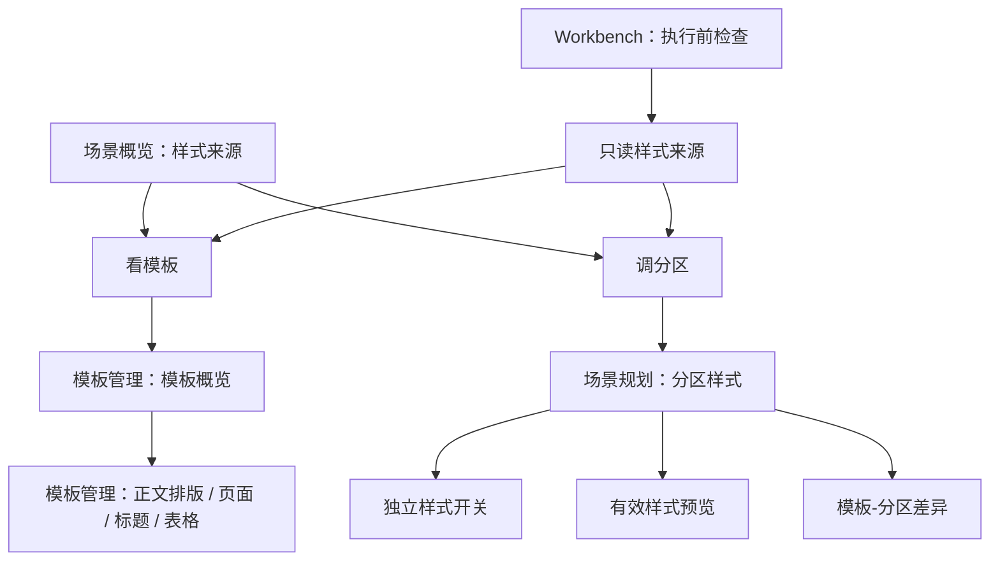

# 场景样式控件与模板管理高度复用深度分析（2026-06-29）

后续进展：第 7 节的 P0“样式来源共享投影”已落地为 `src/ui/panels/style_source_projection.py`，场景概览 `style_source` 行已改为消费共享投影，详见 `docs/refactor-records/样式来源共享投影执行记录_2026-06-29.md`。第 7 节的 P1“样式来源共享控件”已新增 `src/shared/ui/style_source_compact_row.py` 并接入场景概览，详见 `docs/refactor-records/样式来源共享紧凑控件执行记录_2026-06-29.md`。Workbench 快速执行页也已接入同一控件，详见 `docs/refactor-records/Workbench样式来源共享控件接入执行记录_2026-06-29.md`。模板管理概览现已接入模板基线模式，详见 `docs/refactor-records/模板管理样式来源共享控件闭环执行记录_2026-06-29.md`。

## 1. 本轮结论

场景规划的样式能力已经不再是早期那种散在处理范围里的实现状态了：分区样式页已经复用模板管理的 `StyleManagementBlock -> StyleEditingSection -> StyleControlSurface -> ParagraphStyleEditor` 主链路，样式编辑表单、预览、来源状态也已经进入同一套控件体系。

但它还没有达到优秀设计。问题不在“有没有复用组件”，而在更上层的控件规划还没有完全和模板管理同构：

1. 模板管理的用户模型是“当前模板 -> 参数概览 -> 样式预览 -> 具体编辑”，路径稳定。
2. 场景规划的用户模型仍混合了“当前任务、模板来源、处理范围、分区样式、风险、证据”，第一屏需要额外读懂系统在分发什么。
3. 分区样式已经复用底层编辑控件，但概览层的“样式来源 / 看模板 / 调分区”仍是场景自定义行控件，还没有抽成模板管理也能共享的样式来源卡。
4. 当前任务卡里仍有一条重复统计文本，和关键设置里的处理范围、能力状态重复。本轮已把它降级为隐藏兼容状态，避免继续占用首屏。

所以后续方向不是继续加说明，而是把样式链路压成一套更清晰的产品契约：

```text
模板管理定义全局基线。
场景分区只表达当前场景是否偏离基线。
概览只显示来源、状态和两个动作：看模板、调分区。
执行页只消费最终有效样式，不再解释样式规则。
```

## 2. 当前已经打通的复用链路

### 2.1 底层样式编辑已经高度复用

模板正文排版页和场景分区样式页已经共享同一套样式编辑外壳：

| 层级 | 共享组件 | 模板管理用法 | 场景分区样式用法 | 当前判断 |
| --- | --- | --- | --- | --- |
| 页面卡片 | `StyleManagementBlock` | `template_style_detail.py` 用它承载正文排版 | `scene_style_override_sections.py` 用它承载分区样式 | 已复用 |
| 编辑外壳 | `StyleEditingSection` | 隐藏 owner toolbar 和预览，直接编辑模板正文 | 显示 owner toolbar、状态条和预览 | 已复用，但参数不同 |
| 来源状态 | `StyleOwnerStatusStrip` | 显示模板默认来源、影响、编辑状态 | 显示跟随模板/独立样式、当前场景范围、可编辑状态 | 已复用 |
| 参数表单 | `StyleControlSurface` / `ParagraphStyleEditor` | 编辑模板正文样式 | 编辑分区独立样式 | 已复用 |
| 预览 | `StylePreview` | 模板页当前关闭在正文排版页内，模板概览另用 `TemplateStylePreview` | 分区样式页启用有效样式预览 | 部分复用 |
| 摘要 | `SummaryGrid` / `TemplateSummaryCard` | 模板参数摘要 | 分区样式跟随状态、当前分区、样式边界 | 已复用 |

这说明“编辑控件层”已经基本正确。接下来要优化的是“上层信息架构”和“概览控件表达”。

### 2.2 分区样式已经具备正确的产品边界

现在分区样式页的职责已经比较清楚：

- `独立样式` 开关决定某个分区是否从模板基线中独立出来。
- `编辑分区` 选择器决定当前编辑哪个分区。
- `恢复模板` 只恢复当前分区。
- `全部跟随模板` 批量关闭所有独立样式。
- `撤销恢复` 给批量恢复提供回退。
- 只读态会收起参数表单，避免不可编辑控件堆在用户面前。

这个方向是对的，因为它把“处理范围”和“样式参数”拆开了：

| 页面 | 只负责 | 不负责 |
| --- | --- | --- |
| 处理范围 | 哪些文档区域参与处理 | 字体、字号、缩进、行距 |
| 分区样式 | 哪些分区跟随模板，哪些分区独立 | 选择输入文件、输出目录 |
| 模板管理 | 全局默认样式 | 当前场景的局部偏离 |

## 3. 仍然不够好的地方

### 3.1 概览层样式来源仍需继续压缩

后续已经把 `样式来源` 抽成共享 `StyleSourceCompactRow`，并把长模板核对列表压缩为短状态。当前形态更接近：

```text
样式来源
模板：默认格式，8 类参数可核对
分区：1 个分区使用独立样式：参考文献
看模板 / 调分区
```

剩余问题已经从“无法复用”变成“场景页存在独立分区时双按钮竖排仍偏高”：

- 模板管理、场景概览、Workbench 已复用同一控件。
- 模板线和分区线已经拆开。
- Workbench 在全部跟随模板时已隐藏分区动作。
- 场景页有独立分区时仍是双动作，需要真实窗口继续验证高度是否舒服。

更优秀的控件应该是共享的 `StyleSourceSummaryCard` 或 `StyleSourceCompactRow`：

| 区域 | 内容 |
| --- | --- |
| 主标题 | 样式来源 |
| 状态 1 | 模板：默认格式 |
| 状态 2 | 分区：全部跟随模板 / N 个分区独立 |
| 主动作 | 看模板 |
| 次动作 | 调分区 |
| 可选差异 | 中文字体、字号、缩进、行距等差异标签 |

这样模板页、场景页、Workbench 都能消费同一套“样式来源投影”，而不是各写一套文案。

### 3.2 模板预览和分区预览仍是两种心智

模板概览使用 `TemplateStylePreview`，展示页面比例、页边距、页眉页脚和正文层级。分区样式使用 `StylePreview`，展示段落样式效果。

这两者都合理，但用户会问的是同一个问题：

```text
我这次处理出来的文档会长什么样？
```

建议把预览拆成两层契约：

| 预览层 | 组件方向 | 作用 |
| --- | --- | --- |
| 页面级预览 | `TemplateStylePreview` | 看模板基线的整体页面效果 |
| 段落级预览 | `StylePreview` | 看当前分区有效段落样式 |
| 对照预览 | 新增共享投影 | 看模板基线和当前分区差异 |

分区样式不需要复制整个模板页面预览，但必须能一眼说明“当前分区是否和模板不同”。这比继续写“分区：全部分区跟随模板”更可信。

### 3.3 当前任务卡仍承担过多解释

当前任务卡应该回答：

- 这是什么任务。
- 用哪个模板。
- 编号策略是什么。
- 适合处理什么。
- 边界是什么。
- 下一步动作是什么。

它不应该再重复：

```text
本次会处理 9/9 个文档区域，启用 N 类处理能力。
```

因为下面的关键设置已经有：

- `处理范围`：`9/9 个文档区域会处理`
- `样式来源`：模板与分区样式状态
- `风险与确认`：风险和人工确认
- `输出版本`：交付结果

本轮已把 `scn_summary` 设为隐藏兼容状态，只保留内部文本刷新，不再作为首屏文案展示。

## 4. 本轮已执行的小改动

### 4.1 隐藏重复摘要

文件：`src/ui/panels/scene_panel.py`

变更：

- `self._summary` 仍保留 objectName `scn_summary` 和刷新文本。
- 新增 `self._summary.setVisible(False)`。
- 注释说明：处理数量已经由关键设置行展示，这里只保留兼容状态。

用户侧效果：

- 当前任务卡少一行重复解释。
- 首屏主信息只剩任务、模板、适用范围、边界和动作。
- 处理数量仍在 `关键设置 -> 处理范围` 中可见。

### 4.2 测试锁定

文件：`tests/test_scene_panel_architecture.py`

新增断言：

- `panel._overview._summary.isHidden()`
- 隐藏状态仍保留 `本次会处理` 文本，避免内部兼容状态断掉。

这能防止后续误把这条重复统计重新放回首屏。

## 5. 更合理的控件规划

### 5.1 抽出样式来源投影

建议新增一个纯数据投影，供场景概览、模板概览、Workbench 执行前检查复用：

```text
StyleSourceProjection
- template_label
- template_action_summary
- section_status_label
- section_status_detail
- independent_section_count
- independent_section_labels
- primary_action_target
- secondary_action_target
- diff_tags
```

它应该由模板和场景共同生成，而不是散在 `scene_overview_projection.py`、`template_format.py`、Workbench 摘要里。

### 5.2 抽出样式来源紧凑控件

建议新增共享 UI 控件：

```text
StyleSourceCompactRow
- 左侧 icon + 标题
- 中间两行状态：模板 / 分区
- 右侧双动作：看模板 / 调分区
- 支持窄屏自动换行或动作列竖排
```

替代场景概览中 `style_source` 的特殊 `_SceneOverviewSettingRow` 逻辑。

后续如果 Workbench 执行前检查也要显示样式来源，可以直接复用，不再重写。

### 5.3 抽出模板-分区差异条

当前 `StyleComparisonStrip` 已经存在，但它更偏分区样式页内部。建议把差异结果从 UI 里再抽成可复用数据：

```text
StyleDifferenceProjection
- same_as_template: bool
- changed_fields: tuple[str, ...]
- warning_level
- summary
```

然后：

- 概览页显示短标签：`跟随模板` / `3 项差异`
- 分区样式页显示完整对照
- Workbench 显示只读结果：`本次按模板处理` / `含分区独立样式`

### 5.4 统一动作命名

动作建议统一：

| 动作 | 使用位置 | 含义 |
| --- | --- | --- |
| 看模板 | 概览 / Workbench | 跳到模板概览或模板预览 |
| 编辑模板 | 模板页 | 修改全局模板基线 |
| 调分区 | 概览 / Workbench | 跳到当前场景分区样式 |
| 恢复模板 | 分区样式页 | 当前分区重新跟随模板 |
| 全部跟随模板 | 分区样式页 | 所有分区重新跟随模板 |

不要把实现状态词暴露给用户，动作命名必须围绕“模板、分区、跟随、独立样式”表达。

## 6. 建议的最终链路



这条链路的关键是：用户在任何地方看到“样式来源”，都应该理解为同一个东西。

## 7. 后续必要开发优先级

### P0：样式来源共享投影

状态：已完成第一阶段落地。当前已新增 `StyleSourceProjection` 并接入场景概览；Workbench 和模板管理接入仍属于后续范围。

先把数据统一，避免 UI 继续各自拼字。

落点建议：

- 新增 `src/ui/panels/style_source_projection.py`
- 场景概览 `build_scene_key_setting_rows()` 改为消费该投影
- Workbench 后续执行前检查也消费该投影
- 测试覆盖模板标签、分区独立数量、动作 target、禁用内部术语

### P1：样式来源共享控件

状态：已完成第三阶段落地。当前已新增 `StyleSourceCompactRow`，并让模板管理概览、场景概览和 Workbench 快速执行页直接消费 `StyleSourceProjection`；`view_mode` 已区分模板基线、场景编辑、执行复核和只读模式。Qt offscreen 三入口视觉审计已补充，并已压缩长模板摘要、隐藏 Workbench 跟随模板时的分区动作、把场景双按钮改成宽屏横排，详见 `docs/refactor-records/样式来源三入口视觉审计执行记录_2026-06-29.md`、`docs/refactor-records/样式来源摘要压缩与执行复核减负记录_2026-06-29.md` 与 `docs/refactor-records/样式来源双动作响应式布局减负记录_2026-06-29.md`。字段级差异和真实 Windows 字体验证仍属于后续范围。

把 `_SceneOverviewSettingRow` 的双动作特例抽出来。

落点建议：

- 新增 `src/shared/ui/style_source_compact_row.py`
- 支持 `primary_action_requested` / `secondary_action_requested`
- 支持窄屏下动作竖排
- 概览页和 Workbench 共用

### P1：模板-分区差异投影

已有 `StyleComparisonStrip`，但需要把差异摘要变成可复用投影。

目标：

- 概览只显示 `全部跟随模板` / `N 个分区独立`
- 分区样式显示具体差异字段
- Workbench 显示只读状态

### P2：统一预览契约

不要强行把 `TemplateStylePreview` 和 `StylePreview` 合成一个控件，但要统一它们的输出语言：

- 页面级预览回答“模板基线长什么样”。
- 段落级预览回答“当前分区有效样式长什么样”。
- 对照预览回答“和模板哪里不同”。

### P2：真实窗口视觉验证

Qt offscreen 可以验证布局关系，但中文字体回退不够真实。后续应该补一轮真实 Windows 截图检查：

- 首屏是否仍出现过长解释。
- `样式来源` 双动作是否拥挤。
- 分区样式开关、恢复按钮、预览是否在窄宽度下保持稳定。

## 8. 本轮验证

聚焦回归：

```powershell
python -X utf8 -m pytest tests/test_scene_panel_architecture.py::test_scene_panel_overview_shows_planning_family_governance tests/test_scene_panel_architecture.py::test_scene_panel_template_preview_summary_renders_without_overlap_at_narrow_width tests/test_scene_overview_projection.py tests/test_ui_copy_guardrails.py -q
```

结果：

```text
10 passed
```

旧样式实现词检索：

结果：产品代码、共享组件、配置模型和相关测试均无命中。

## 9. 当前判断

这一轮之后，场景规划的第一屏更干净了一点，分区样式和模板管理的底层复用也被重新确认。但距离优秀设计还差一个关键抽象：共享的“样式来源”投影和控件。

只有把“模板基线 + 分区偏离 + 双入口动作 + 差异状态”抽成同一套东西，场景规划、模板管理和 Workbench 才会真正像一个系统，而不是三个页面各自用相似文案解释同一件事。
