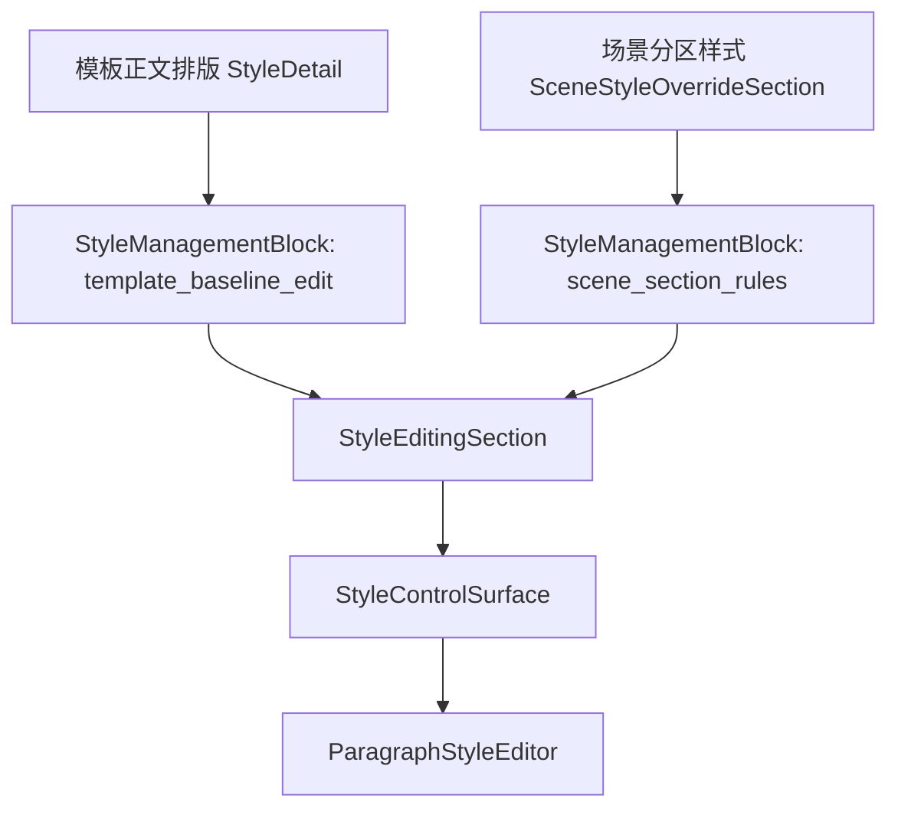

# 场景样式控件成品结构与模板管理复用再审计

日期：2026-06-29

## 1. 本轮结论

这一轮继续看“为什么场景页还是不像模板管理”。结论是：问题已经不主要在底层字段控件，而在更上层的“成品结构”和“任务边界”。

当前项目已经有不少正确基础：

- `StyleManagementBlock` 已经定义了样式管理的模式契约和内容 slot。
- 模板正文排版页已经通过 `StyleManagementBlock(mode="template_baseline_edit")` 进入共享编辑结构。
- 场景分区样式页已经通过 `SceneStyleOverrideSection -> StyleManagementBlock(mode="scene_section_rules")` 进入共享编辑结构。
- 字段控件已经收束到 `StyleEditingSection -> StyleControlSurface -> ParagraphStyleEditor`。

但用户仍会觉得“不统一、不好读、不像模板管理”，根因是：

- 模板管理已经是“对象管理”：当前模板、当前样式、当前预览、当前操作。
- 场景页仍然像“任务混排”：处理范围、样式覆盖、样本证据、风险边界、执行预览和输出设置同时抢主阅读路径。
- 共享控件已经有了，但共享控件没有完全主导页面布局，调用方仍在手工拼出不同阅读顺序。
- 很多说明文字是在替不清楚的结构做解释，所以越写越“不说人话”。

本轮判断：下一步不应该继续微调单句文案，而要把场景页拆成更接近模板管理的“对象化模块”，并让样式管理控件只承担样式任务，不再混入处理范围和证据浏览。

## 2. 当前实现证据

### 2.1 已经打通的共享链路

当前代码链路可以概括为：



对应文件：

- `src/shared/ui/style_management_block.py`
- `src/shared/ui/style_editing_section.py`
- `src/shared/ui/paragraph_style_surface.py`
- `src/shared/ui/paragraph_style_editor.py`
- `src/ui/panels/template_style_detail.py`
- `src/ui/panels/scene_style_override_sections.py`

这说明字体、字号、加粗、斜体、对齐、缩进、行距、段前段后等控件本身已经具备复用基础。

### 2.2 仍然没有完全归一的地方

`StyleManagementBlock` 现在已经有这些内容 slot：

| Slot | 含义 | 当前状态 |
| --- | --- | --- |
| `source` | 样式来源 | 模板和场景已有使用，但场景概览也有一套独立来源摘要 |
| `scope` | 影响范围 | 模板页相对清楚，场景页和处理范围开关仍有概念重叠 |
| `rules` | 规则控制 | 场景分区样式使用了 `StyleRuleControlDeck` |
| `difference` | 与模板差异 | 场景已接入，但与摘要、开关的阅读关系还不够直观 |
| `editor` | 字段编辑 | 已复用 |
| `preview` | 样式预览 | 场景页内有轻量预览，模板概览也有完整预览，层级不一致 |
| `receipt` | 执行回执 | Workbench 和最近结果已有接入 |

问题不是 slot 不够，而是页面没有强制执行同一套阅读顺序。

模板页更像：

```text
当前对象 -> 摘要 -> 字段编辑 -> 保存/恢复
```

场景页更像：

```text
当前任务 -> 执行预览 -> 关键设置 -> 风险边界 -> 样本证据
再进入分区样式 -> 摘要 -> 独立样式开关 -> 差异 -> 编辑分区 -> 预览 -> 字段编辑
```

这个结构功能完整，但用户需要自己判断每块之间的关系。

## 3. 与模板管理的核心差异

### 3.1 模板管理回答的是“我正在管理哪个对象”

模板管理的对象边界清晰：

| 页面 | 核心对象 | 用户问题 |
| --- | --- | --- |
| 模板概览 | 当前模板 | 这个模板长什么样，关键参数是什么 |
| 正文排版 | 正文样式 | 正文字体、缩进、行距如何配置 |
| 页面设置 | 页面规格 | 纸张、边距、页眉页脚如何配置 |
| 标题编号 | 标题层级 | 标题样式与编号如何配置 |

每页基本只围绕一个对象展开。

### 3.2 场景页回答的是“这次任务怎么跑”

场景页天然更复杂，但现在边界还可以继续拆清：

| 当前区域 | 实际混入的任务 |
| --- | --- |
| 场景概览 | 选择场景、绑定模板、编号策略、执行入口、关键设置摘要、风险边界、样本证据 |
| 处理范围 | 处理哪些分区、功能开关、样式相关状态 |
| 分区样式 | 是否覆盖模板、当前编辑分区、差异摘要、预览、字段编辑、恢复操作 |
| 样本证据 | 样本文档、请求说法、证据文件、生成状态、打开动作 |

所以它应该复制模板管理的“对象化表达方式”，而不是复制模板管理每个控件的摆放。

## 4. 目标信息架构

建议把场景页重新规划为四个稳定对象区：

| 对象区 | 用户问题 | 应保留主文案 | 应下沉的信息 |
| --- | --- | --- | --- |
| 当前任务 | 我现在处理什么，按哪个模板处理 | 场景名、模板名、编号策略、执行入口 | config id、template id、descriptor 细节 |
| 处理范围 | 这次处理哪些内容 | 正文、标题、表格、目录等开关和摘要 | 内部 section key、功能计数 |
| 样式规则 | 这些内容跟模板走，还是单独覆盖 | 跟随模板、已覆盖、选择分区、预览、字段编辑 | registry key、差异路径、字段内部 id |
| 核对依据 | 这个场景凭什么可信 | 样本文档、用户说法、证据状态、打开动作 | fixture id、sample id、manifest 路径、manual gate |

这里最重要的是：`样式规则` 应该成为和模板正文排版同等级的对象区，而不是处理范围或场景概览里的附属说明。

## 5. 共享控件边界

### 5.1 应继续复用的控件

| 控件/模块 | 推荐定位 | 复用要求 |
| --- | --- | --- |
| `StyleManagementBlock` | 样式管理成品结构 | 模板、场景、执行回执都必须通过 mode/content plan 表达结构 |
| `StyleEditingSection` | 来源、对象选择、预览、字段编辑外壳 | 不再由页面自行决定字段区前后顺序 |
| `StyleControlSurface` | 字段分组表面 | 模板正文与场景分区必须完全同源 |
| `ParagraphStyleEditor` | 原子字段控件 | 不允许场景页另写字号、行距、缩进控件 |
| `StyleSourceCompactRow` | 样式来源摘要 | 模板概览、场景概览、Workbench 保持同一投影 |
| `StyleDifferenceSummarySlot` | 差异摘要 | 场景分区、Workbench 执行前复核共用 |
| `TemplateFormStack/template_form_row` | 表单行基线 | 对齐、label 宽度、控件高度保持一致 |

### 5.2 需要继续抽象的新控件

| 新控件 | 解决的问题 | 不应承担的内容 |
| --- | --- | --- |
| `SceneTaskBlock` | 场景、模板、编号策略、执行入口 | 不展示样本证据、不展示样式字段 |
| `SceneScopeBlock` | 处理范围和功能开关 | 不展示样式来源，不解释模板差异 |
| `SceneStyleRulesBlock` | 对 `StyleManagementBlock(scene_section_rules)` 再封装，成为稳定页面对象 | 不混入处理范围开关，不混入样本证据 |
| `SampleEvidenceBlock` | 样本覆盖、请求说法、证据动作和明细 | 不展示样式字段，不承载模板预览 |
| `ArtifactActionRow` | 生成、打开、重试、打开目录等产物动作 | 不把路径显示在主文案 |

当前最大缺口是 `SceneStyleRulesBlock` 和 `SampleEvidenceBlock`。前者保证样式规划和模板管理一致，后者保证证据区不再散落在场景概览里。

## 6. 推荐阅读顺序

### 6.1 模板正文排版

```text
正文排版
-> 当前摘要
-> 样式来源
-> 字段编辑
-> 保存 / 恢复
```

### 6.2 场景分区样式

```text
分区样式
-> 当前摘要
-> 样式来源：跟随模板 / 场景覆盖
-> 独立样式开关
-> 与模板差异
-> 编辑分区
-> 当前预览
-> 字段编辑
-> 恢复当前分区 / 全部跟随模板
```

### 6.3 Workbench 执行回执

```text
样式复核
-> 本次实际来源
-> 与模板差异
-> 执行结果
-> 可打开证据
```

三者的共同规则：

```text
先给结论，再给对象，再给控件，最后给证据。
```

## 7. 冗余文本删除规则

### 7.1 主界面只保留决策文本

主界面应该保留：

- `跟随模板`
- `已覆盖`
- `未启用`
- `需要确认`
- `证据已生成`
- `无匹配说法`
- `打开证据`

主界面不应该保留：

- `template 13 / scene 37 / material 6 / output 17`
- `custom_basic`
- `quick_formatting`
- `manual gate`
- `fixture_id`
- `sample_id`
- `manifest: C:\...`
- `registry`
- `schema_id`
- 大段解释“为什么这个控件不可编辑”

这些内容并非删除，而是进入 tooltip、证据明细、日志或测试断言。

### 7.2 不再用说明文字补结构

下面这类文案应该尽量删掉或移到 tooltip：

| 文案类型 | 问题 | 替代方式 |
| --- | --- | --- |
| “手动控制所有功能开关与处理范围” | 解释了两个任务，但没有拆开 | 拆成 `处理范围` 和 `功能开关` 两个 block |
| “开启覆盖后可编辑” | 用文字解释禁用态 | 用状态 chip `跟随模板` + 开关表达 |
| “点击各参数行的编辑可跳转...” | 暴露实现方式 | 行本身可点击，高亮反馈说明结果 |
| “提示 / 跳过高风险模块 / 阻断 macros” | 工程策略过细 | 主文案 `需确认高风险内容`，细节进证据 |
| “未知嵌套不按父级兜底” | 开发判断 | 主文案 `保留未知结构`，细节进审计 |

### 7.3 Tooltip 也要分层

Tooltip 不是垃圾桶。建议统一格式：

```text
结论：当前分区跟随模板
依据：模板默认正文样式
证据：section_styles.body.font_cn
```

不要把路径、id、gate、registry 全部无序拼进同一个 hover。

## 8. 代码落地顺序

### P0：冻结共享控件契约

目标：防止继续分叉。

- 为 `StyleManagementBlock` 的每个 mode 增加结构测试。
- 测试 `template_baseline_edit` 必须包含 `source/scope/editor`，不含 `rules/difference/receipt`。
- 测试 `scene_section_rules` 必须包含 `source/scope/rules/difference/editor/preview`。
- 测试 `execution_prereview` 必须只读，不出现字段编辑器。

### P1：抽 `SceneStyleRulesBlock`

目标：让场景样式成为稳定对象区。

- 把 `_StyleRulesDetail` 中直接暴露的大量内部控件映射收进 block 适配层。
- 对外只暴露 `set_scene(...)`、`focus_navigation_field(...)`、`style_rules_changed`。
- 保留必要测试入口，但不让页面层继续知道 `rule_deck`、`editing_section`、`comparison_strip` 的内部层级。

### P2：处理范围与样式规则彻底分离

目标：让用户不再混淆“处理哪些内容”和“怎么套样式”。

- `scn_scope` 只保留处理范围和功能开关。
- `scn_style_rules` 只保留样式来源、覆盖、预览和字段编辑。
- 场景概览的 `关键设置` 只显示摘要和跳转，不再承载样式解释。

### P3：抽 `SampleEvidenceBlock`

目标：核对依据也和模板管理一样对象化。

- Summary：样本文档、请求说法、需确认项。
- Browser：样本文件列表、请求说法列表。
- Detail：选中项明细。
- Actions：生成样本库、打开样本、打开目录、打开请求证据。
- Evidence：fixture/sample/manifest/manual gate 统一放入 tooltip 或明细区。

### P4：删除主界面冗余文本

目标：让结构替代解释。

- 删除场景概览中的长说明，只保留短状态。
- 所有 raw id 主文案禁用。
- 所有路径主文案禁用。
- 所有“点击某处可以...”类说明优先改成交互反馈或 tooltip。

## 9. 必要测试护栏

建议新增或强化这些测试：

| 测试 | 目的 |
| --- | --- |
| `test_style_management_modes_expose_expected_content_plan` | 防止 mode slot 漂移 |
| `test_scene_style_rules_block_hides_processing_scope_copy` | 防止处理范围文案混入样式规则 |
| `test_scene_scope_block_hides_style_override_editor` | 防止样式字段回流到处理范围 |
| `test_style_main_copy_hides_registry_ids` | 禁止主文案出现 raw id |
| `test_scene_overview_key_settings_use_navigation_only` | 概览只做摘要和跳转 |
| `test_sample_evidence_block_keeps_paths_in_tooltip` | 证据路径不回到主界面 |

这些测试比简单断言某个 QLabel 文本更重要，因为它们保护的是页面边界。

## 10. 验收标准

下一轮做到位后，用户从模板管理切到场景页，应该感到：

- 表单行、按钮、摘要卡、预览和字段编辑顺序一致。
- 场景页不是在展示工程配置，而是在回答当前任务怎么处理。
- 处理范围、样式规则、核对依据三个对象互不抢职责。
- 主界面没有 raw id、路径、registry、schema 这类内部词。
- 高级证据仍然完整可追踪，但不挡普通用户阅读。

最终目标不是让场景页长得和模板页一模一样，而是让两者共享同一条设计语言：

```text
对象清楚，结论在前，控件复用，证据下沉。
```
