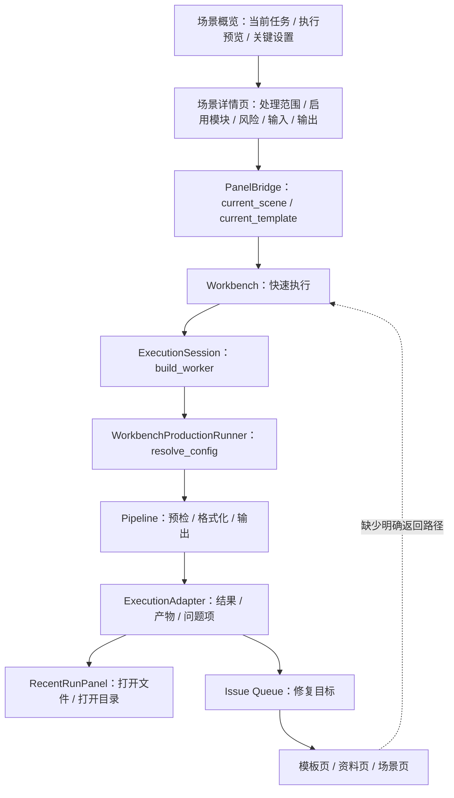

# 场景链路闭环深度审计

日期：2026-06-28

范围：在上一轮“场景概览与模板管理一致性”改造之后，继续审计从场景概览、模板绑定、参数编辑、Workbench 执行、输出结果、问题修复、高级证据之间的完整链路是否真正打通。

结论先说清楚：底层技术链路已经打通了不少，但产品链路还远没有到优秀设计。现在的问题不是再把某个卡片文案改得更顺，而是用户旅程没有形成一个明确闭环。

当前更准确的判断是：

- 场景页已经能说明“这次运行打算做什么”。
- Workbench 已经能拿到当前场景和模板去执行。
- Pipeline 已经能按场景输出多版本产物、报告和问题项。
- 但用户从“看懂场景”到“确认并执行”、从“执行发现问题”到“回到具体设置修复”、从“修复完成”到“重新检查/继续执行”的路径还没有被设计成一条连续路。

换句话说：代码有管道，界面缺旅程。

## 1. 当前链路总图



这张图里实线多，说明技术上不是空的；虚线那段才是用户体验问题的核心：修复以后怎么回到执行上下文，不清楚。

## 2. 链路审计表

| 链路 | 当前状态 | 依据 | 设计问题 |
|---|---|---|---|
| 场景选择 -> 场景详情 | 已打通 | `ScenePanel._on_scene_changed()` 会 load scene、set bridge、同步模板 | 选择后没有明确“下一步” |
| 场景概览关键设置 -> 详情页 | 已打通 | `_SceneOverviewSettingRow.navigate_requested` -> `_show_detail_from_overview()` | `样式来源` 已提供 `看模板 / 调分区` 双跳转，后续只剩更细的字段级定位 |
| 详情页编辑 -> Bridge 当前场景 | 已打通 | `_on_scene_edited()` 调 `bridge.set_current_scene()` 并 mark dirty | 只有状态同步，没有保存/应用/执行意图 |
| 模板绑定 -> Bridge 当前模板 | 已打通 | `_sync_bound_template_from_scene()` 调 `bridge.set_current_template()` | 用户看不出这是运行会用的模板，缺少样式预览对照 |
| 场景页 -> Workbench 执行 | 半打通 | Workbench 启动时读 `bridge.current_scene/current_template` | 场景页没有主按钮跳到执行，用户要自己知道去 Workbench |
| Workbench scene/template 显示 -> 实际执行 scene/template | 半打通 | `_start_execution()` 用 `_current_scene/_current_template` 传入 worker | `on_scene_changed()` 只刷新摘要，没有完整 apply 到 QuickExecutionDetail 的分区/能力控件 |
| 执行预览步骤 -> 运行进度文案 | 已打通静态步骤 | 共用 `execution_flow_projection.py`，概览以步骤行展示，adapter 做阶段映射 | 仍未形成运行时 live stepper 或状态回填 |
| 输出设置 -> Pipeline 输出 | 已打通 | `resolve_config()` 带 `delivery_presets`，Pipeline `_save_delivery_outputs()` 输出多版本 | Workbench 仍有独立“输出目录”入口，和场景输出设置看起来像两套 |
| 输出结果 -> 最近运行产物 | 已打通 | `ExecutionAdapter.build_result_state()` 生成 artifact_items，RecentRunPanel 可打开文件 | 产物能打开，但不解释“与场景输出设置的对应关系” |
| 对象预检/输出目标问题 -> 修复入口 | 半打通 | Workbench `_open_issue_repair_target()` 能路由到 template/assets/scene | 路由到 scene 时只跳面板，不跳具体 card/字段 |
| 核对依据 -> 样本库/请求样本 | 已打通开发核验 | 概览可生成样本文档、打开请求样本 | 仍是开发/审核入口，不是普通用户的问题解决路径 |
| 修复后 -> 重新检查/继续执行 | 半打通 | Workbench 有“重新检查/确认并继续”按钮 | 从其它面板修复后没有“返回本次执行”的显性路径 |

## 3. 关键断点

### 3.1 缺一个中心用户旅程

现在的产品结构像这样：

```text
场景页：解释和配置
Workbench：选择文件和执行
模板页：改模板
资料页：补资料
```

这对开发者清楚，但对用户不够清楚。优秀设计应该让用户一直处在同一个任务里：

```text
选择任务 -> 确认模板 -> 选择文档 -> 执行前检查 -> 修复问题 -> 生成结果 -> 查看产物
```

目前这些步骤分散在多个面板里，没有一个“本次任务状态”把它们串起来。

### 3.2 场景页缺主动作

场景概览已经能告诉用户：

- 当前任务是什么
- 会怎么执行
- 哪些设置可以改
- 哪些风险不会替用户判断

但它没有告诉用户“现在可以做什么”。首屏最重要的动作应该是：

- 选择文档
- 去执行
- 先检查风险
- 继续上次执行

现在场景页只有“编辑/查看”类动作，没有“开始任务”类动作。所以用户理解完之后仍然悬在半空。

### 3.3 Workbench 快速执行页和场景页仍像两套系统

Workbench 内部有自己的场景选择、模板选择、处理范围、功能开关、输出目录。场景页也有一套类似能力。

底层通过 `PanelBridge` 能同步一部分状态，但 UI 上会出现两个心智问题：

1. 用户不知道应该在哪边改。
2. 用户不知道 Workbench 看到的控件是否就是场景页刚改的控件。

尤其要注意这个实现点：

- `WorkbenchPanel.on_scene_changed()` 会更新 `_current_scene`、配置管理详情和策略摘要。
- 但它没有把新 scene 完整 `_apply_scene()` 到 `QuickExecutionDetail`。
- `QuickExecutionDetail.set_strategy_context()` 只处理场景名、模板名、编号策略等局部状态。

这会造成一种风险：执行使用的是新的 `_current_scene`，但快速执行页展示的分区和能力状态可能没有完整跟上。这不是普通 bug，而是信任感 bug。

### 3.4 问题修复只到面板，不到位置

Workbench 的问题队列已经能把不同问题分到不同面板：

- `asset / field / question_figure_item` -> 资料/资产页
- `template_*` -> 模板页
- `object_preflight / output_target / coverage_boundary / sample_fixture` -> 场景页

但跳到场景页时只发 `navigate_to_panel(scene_index)`，没有携带：

- 该打开哪个详情页
- 该聚焦哪个控件
- 这次是从哪个 issue 来的
- 修复后应该回到哪里

这就会让用户到了场景页还要重新找入口。优秀设计应该是直接打开“校验与合规”或“输出设置”，并高亮对应问题。

### 3.5 核对依据不是用户闭环

后续进展：界面入口已从 `高级证据` 改为 `核对依据`，折叠态不再常驻解释文案，详见 `docs/refactor-records/场景概览核对依据入口减负执行记录_2026-06-29.md`。

“核对依据”现在比之前好很多，因为它被降级了，不再用高级审计语言压在首屏。但它仍然更像开发核验工具：

- 样本库
- manifest
- request-cell
- OOXML surface
- fixture

普通用户的问题不是“证据在哪”，而是：

```text
为什么卡住？
我该改哪一项？
改完怎么知道好了？
```

所以高级证据应该继续保留，但真正的用户闭环应该是 issue drawer 或 repair drawer，而不是证据列表。

### 3.6 输出链路技术上通，界面语义上不通

底层输出是相对完整的：

- `resolve_config()` 会把 scene 的 `delivery_presets` 和 `default_delivery_preset_id` 带入 runtime。
- Pipeline 会根据 `delivery_presets` 生成多版本输出。
- Workbench 会写报告、资料清单、资料包，并在最近运行面板里显示产物。

但场景页的“输出设置”和 Workbench 的“输出目录”是两个入口。用户可能会问：

```text
我在场景里设了输出版本，为什么 Workbench 这里又有输出目录？
哪个优先？
生成的 final/review/report 对应哪个设置？
```

优秀设计应该把 Workbench 的输出目录理解成“本次运行保存到哪里”，把场景输出设置理解成“会生成哪些版本”。两者应该在界面上明确分工。

## 4. 对照模板管理，场景页还缺什么

模板管理页的优势是：用户能预览“文档会长什么样”。

场景页要达到同样水准，不能只是列功能，而要预览“任务会怎样完成”。应该有三类预览：

| 预览 | 模板管理已有/类似能力 | 场景页应该补齐 |
|---|---|---|
| 样式预览 | 页面比例、边距、页眉页脚、正文样式 | 当前模板应用到本场景后的关键样式摘要 |
| 执行预览 | 参数概览 | 读取、预检、套用模板、报告、输出的 live 状态 |
| 输出预览 | 模板效果 | final/review/report/material package 的目标路径和风险 |

现在场景页只有静态执行预览，没有 live 状态；有输出摘要，但没有目标路径预览；有模板绑定，但没有把模板样式预览嵌入场景上下文。

## 5. 应该重构成什么样

建议把场景页从“配置页”升级成“任务计划页”。

第一屏建议固定为四块：

1. 本次任务
   - 场景名
   - 关联模板
   - 当前文档状态
   - 主按钮：选择文档 / 去执行 / 重新检查

2. 执行检查
   - 输入是否就绪
   - 模板是否就绪
   - 风险策略是否就绪
   - 输出目标是否安全

3. 会做什么
   - 读取文件
   - 检查风险
   - 套用模板
   - 生成报告
   - 输出文件
   - 这些步骤应该和 Workbench 运行状态共用同一个状态源

4. 需要你处理
   - 当前 issue queue
   - 每个问题都有“去修复”
   - 修复后有“重新检查”

高级证据继续作为开发/审核入口，但不再承担主旅程。

## 6. 必要的技术改造

### P0：必须先打通

| 改造 | 目的 | 验收标准 |
|---|---|---|
| 新增跨面板路由意图 | 让问题能跳到具体 card/控件 | Bridge 不只传 panel index，还能传 detail id、focus key、issue id、return target |
| ScenePanel 消费修复意图 | 跳到“校验与合规/输出设置/输入与资料/高级证据”等具体位置 | object_preflight 自动打开 `scn_cleanup`，output_target 自动打开 `scn_output` |
| Workbench 的 QuickExecutionDetail 完整应用 Bridge scene | 解决显示状态和执行状态不一致 | `on_scene_changed()` 后，快速执行页分区、能力、模板、输出摘要都与 scene 一致 |
| 场景页增加主动作 | 让用户从场景页进入执行 | 场景概览有“选择文档/去执行/重新检查”按钮，能跳到 Workbench quick_execute |
| “模板与样式”行跳到真实模板预览 | 不再停留在概览自身 | 点击后进入模板管理或嵌入共享模板预览 |

建议的数据结构：

```python
@dataclass(frozen=True)
class PanelRouteIntent:
    panel_id: str
    detail_id: str = ""
    focus_key: str = ""
    issue_id: str = ""
    return_panel_id: str = ""
    return_detail_id: str = ""
```

当前的 `navigate_to_panel(int)` 可以保留兼容，但优秀设计需要这个更丰富的 intent。

### P1：让链路可理解

| 改造 | 目的 |
|---|---|
| 场景页显示“本次文档状态” | 用户不用先去 Workbench 才知道有没有选文件 |
| 输出目标预览 | 在运行前看到 final/review/report 会保存到哪里，是否覆盖 |
| Issue drawer | 把对象预检、输出冲突、资料缺失转成“原因 / 影响 / 去修复 / 重新检查” |
| 运行状态回填场景页 | Workbench 跑完后，场景页也能看到最近结果和未解决问题 |
| 模板样式预览复用 | 场景页的模板摘要和模板管理页的预览不再各说各话 |

### P2：再做视觉优秀

视觉层面建议等 P0/P1 打通后再做。否则只是把断链路包装得更漂亮。

可以做：

- 更像任务看板的状态条
- 统一“处理/提醒/阻断/完成”的 badge 系统
- 更清楚的空状态
- 更少的大段说明，更多可点击的具体动作
- 把高级证据变成二级抽屉，不占主滚动流

## 7. 需要补的测试

目前测试覆盖了不少组件级行为，但还缺“用户旅程级”测试。

建议补这些：

1. 从场景概览点击“去执行”，主窗口切到 Workbench quick_execute。
2. ScenePanel 修改处理范围后，Workbench QuickExecutionDetail 的分区 checkbox 同步。
3. Workbench 收到 `object_preflight` issue 后，点击修复能打开 ScenePanel 的 `scn_cleanup`。
4. Workbench 收到 `output_target` issue 后，点击修复能打开 ScenePanel 的 `scn_output`。
5. Workbench 收到 `template_style_field` issue 后，点击修复能打开 TemplatePanel 的具体样式详情。
6. 修复后点击“重新检查”，同一条执行上下文不丢失。
7. 输出目标预览和 Pipeline 实际 `output_paths` 对齐。
8. 场景页和 Workbench 使用同一个 `standard_execution_flow_steps()`，并且 live 状态不会退回英文内部阶段。

## 8. 优秀设计的判断标准

不要再用“卡片是否完整”判断场景页好不好。真正的标准应该是：

```text
用户能不能在不理解内部模块名的情况下，完成一次从选择任务到生成结果的闭环。
```

具体可验收为：

- 用户知道当前任务是什么。
- 用户知道当前缺什么才能执行。
- 用户知道每个风险会导致提醒、跳过还是阻断。
- 用户能一键跳到要修的地方。
- 用户修完后能一键回到本次执行。
- 用户能看懂最终生成了哪些文件，以及每个文件对应哪个输出版本。

## 9. 代码证据索引

本轮审计主要依据这些入口：

| 位置 | 作用 | 审计结论 |
|---|---|---|
| `src/ui/panels/scene_panel.py:4434` | `_show_detail_from_overview()` | 概览行能跳本面板详情，但不能跨面板深链 |
| `src/ui/panels/scene_panel.py:4521` | `_on_scene_edited()` | 场景编辑会写入 Bridge，并标记 dirty |
| `src/ui/panels/scene_panel.py:4536` | `_sync_bound_template_from_scene()` | 场景模板能同步到 Bridge current_template |
| `src/ui/panels/workbench/panel_v2.py:811` | `on_scene_changed()` | Workbench 接收 scene，但没有完整 apply 到 QuickExecutionDetail |
| `src/ui/panels/workbench/quick_execution_detail.py:1088` | `set_strategy_context()` | 只同步场景名、模板和编号策略，不是完整 scene 投影 |
| `src/ui/panels/workbench/panel_v2.py:669` | `_open_issue_repair_target()` | 问题能分流到面板，但 scene 类问题不能定位到具体 card |
| `src/ui/panels/workbench/panel_v2.py:879` | `_start_execution()` | 执行使用 `_current_scene/_current_template`，底层链路存在 |
| `src/ui/panels/workbench/execution_session_controller.py:40` | `build_worker()` | 将 scene/template/material context 传给 runner |
| `src/ui/panels/workbench/execution_runtime.py:77` | `WorkbenchProductionRunner.run()` | 运行时 resolve_config 并进入 Pipeline |
| `src/pipeline/runner.py:941` | `_save_outputs()` | 普通输出链路 |
| `src/pipeline/runner.py:963` | `_save_delivery_outputs()` | DeliveryPreset 多版本输出链路 |
| `src/ui/adapters/workbench_execution_adapter.py:189` | `build_result_state()` | 将 runtime payload 转成产物和问题项 |
| `src/ui/main_window.py:258` | `_navigate()` | 当前跨面板导航只支持 panel index |

## 10. 本轮最终判断

当前版本已经比最初“证据看板式场景概览”前进了一步，但距离优秀设计仍有明显差距。

现在最该做的不是继续增加信息，而是补三条闭环：

1. 场景计划 -> 执行入口闭环。
2. 执行问题 -> 精准修复闭环。
3. 修复完成 -> 重新检查/继续执行闭环。

只要这三条没有打通，场景页就会继续显得“不够完善”，因为用户看到的是很多设置，而不是一条能走完的路。
