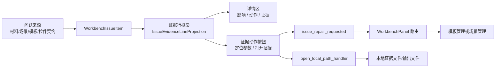

# 工作台问题详情与模板管理控件复用深度分析

日期：2026-06-28

## 结论

当前最大问题不是“缺少更多说明文字”，而是工作台问题详情与模板管理的控件模型没有完全对齐：模板管理已经形成了“当前对象 -> 参数概览 -> 可视预览 -> 可执行入口”的稳定心智，而工作台问题区之前更多是把问题、证据、内部路径一起展示出来，用户需要自己翻译。

本轮调整的方向是：工作台不再继续堆叠描述文本，而是把证据中的可执行信息投影为控件动作，复用已有的详情分区、按钮样式、面板导航和本地文件打开链路。这样用户看到的不是“参数路径：xxx / 证据：xxx”，而是更接近模板管理的操作模型：先知道影响，再看到要做什么，再点击“定位参数”或“打开证据”。

## 与模板管理的对标

| 维度 | 模板管理现状 | 工作台问题区目标 | 本轮落地 |
| --- | --- | --- | --- |
| 顶层对象 | 当前模板、来源、模板库记录 | 当前问题、动作类型、责任域 | 详情标题与 meta 保留对象身份 |
| 参数阅读 | 参数概览按页面、排版、标题、表格等分组 | 问题详情按影响、动作、证据分组 | 继续复用 `IssueDetailSection` |
| 可执行入口 | 左侧条目、编辑入口、导入导出 | 处理、复检、忽略、定位参数、打开证据 | 新增证据动作按钮 |
| 预览/证据 | 样式预览让参数变成可见效果 | 证据文件、输出、替换来源可直接打开 | 证据路径进入本地打开处理器 |
| 路由方式 | 模板面板内部定位到对应设置卡片 | 工作台发出统一修复目标，由主面板路由 | 复用 `issue_repair_requested` |
| 文案原则 | 参数摘要读人话，不暴露内部枚举 | 证据区不展示 raw registry id，不让用户翻译字段 | 继续过滤 raw source note，并用按钮替代说明 |

## 功能边界重新划分

### 工作台

工作台只负责执行前后的判断、排队和跳转，不应该承载真实编辑表单。

工作台应该保留：

- 问题队列：告诉用户现在有哪些阻断、提醒、记录。
- 动作筛选：按“先处理 / 需确认 / 仅记录”组织优先级。
- 详情分区：影响、动作、证据。
- 操作桥接：处理、复检、忽略、定位参数、打开证据。

工作台不应该继续增加：

- 大段规则解释。
- 原始内部字段枚举。
- 与场景/模板重复的参数编辑控件。
- 只有开发者能读懂的 source id、registry id、schema key。

### 场景管理

场景管理负责“当前场景如何处理文档”。因此工作台中的场景参数问题应该跳回场景管理。

场景管理应该承接：

- `scene_scope_field`：处理范围、功能范围。
- `scene_style_field`：场景样式覆盖。
- `control_contract`、`parameter_ownership`、`coverage_boundary`：场景证据、清理、契约区。
- 通用 `parameter_path` 兜底：回到场景清理/契约区域，避免点击无响应。

### 模板管理

模板管理负责“格式模板本身是什么”。工作台不应该复制模板管理的页面、排版、标题、表格等编辑控件，而应该把与模板有关的问题跳回模板管理。

模板管理应该继续作为这些能力的唯一编辑入口：

- 页面设置。
- 正文排版。
- 标题编号。
- 表格样式。
- 页眉页脚。
- 目录、参考文献、题注。
- 模板导入导出。
- 模板样式预览。

### 共享 UI

可以稳定下沉到共享层的只有跨面板复用的展示与控件结构。

已经复用：

- `IssueDetailSection`：详情三分区。
- `apply_button_variant`：按钮状态与层级。
- `StyledComboBox`：筛选控件。
- `workbench_issue_action_visual(...)`：动作优先级视觉投影。

后续应该下沉：

- `EvidenceActionBar`：证据动作条。
- `EvidenceLineList`：证据行的结构化展示。
- `NavigationActionButton`：统一“定位到设置”的按钮。
- `OpenArtifactButton`：统一“打开证据/输出/来源”的按钮。

## 本轮链路检查



链路状态：

- 问题生成：已打通，`WorkbenchIssueItem.details` 可以承载参数路径和证据路径。
- 证据投影：已打通，`参数路径：`、`证据：`、`输出路径：`、`替换来源：` 会形成动作。
- 详情展示：已打通，证据仍保持可读文本，同时不再强迫用户复制内部路径。
- 参数跳转：已打通，场景样式路径跳 `scene_style_field`，场景范围路径跳 `scene_scope_field`，普通参数路径优先复用当前问题自己的修复目标。
- 证据打开：已打通，支持 `src/file.py:120#fragment` 这类证据值解析成本地路径。
- 主面板路由：已补通 `parameter_path` 兜底，避免未来普通参数路径点击无响应。
- 测试：已覆盖控件契约参数定位、证据文件打开、场景样式参数跳转。

## 本轮代码调整

### 工作台详情区

文件：`src/ui/panels/workbench/quick_execution_detail.py`

新增内容：

- 在证据区下方新增轻量动作行。
- 新增“定位参数”按钮。
- 新增“打开证据”按钮，并根据动作类型切换为“打开输出 / 打开来源”。
- 新增 `current_issue_evidence_actions()` 的内部复用路径，不再重复扫描逻辑。
- 新增 `_request_issue_evidence_action(...)`，统一处理证据动作。
- 新增 `_issue_parameter_navigation_target(...)`，把参数路径转换成现有面板路由目标。
- 新增 `_local_path_from_issue_evidence_action_value(...)`，把带行号和 fragment 的证据值解析成本地文件。

### 主面板路由

文件：`src/ui/panels/workbench/panel_v2.py`

新增内容：

- `parameter_path` 进入场景面板兜底路由。
- 默认定位到 `scn_cleanup`，与控件契约、固定版式、内容控件等清理类问题保持一致。

### 测试

文件：`tests/test_quick_execution_detail_architecture.py`

新增覆盖：

- 控件契约问题中，“定位参数”会发出 `control_contract / body.special_indent`。
- 控件契约问题中，“打开证据”会打开 `paragraph_style_inputs.py`。
- 场景样式参数中，“定位参数”会发出 `scene_style_field / scene.section_styles.references_body.font_cn`。
- 动作目标列表按当前动作优先级排序，而不是按原始收集顺序排序。

## 这次为什么比继续加说明更合适

用户说“不说人话”，核心不是字数不够，而是系统把机器字段暴露给了用户。继续追加“这个参数是什么意思”的说明，只会让页面更重。

更合适的方向是：

- 能点击的内容做成按钮。
- 能跳转的内容不要求用户复制路径。
- 能打开的证据不要求用户自己找文件。
- 内部 registry/source id 只用于诊断，不进入主要阅读层。
- 工作台只给判断和入口，真正编辑回到模板管理或场景管理。

这与模板管理的一致性也更高：模板管理不是用长文解释 A4、页边距、标题层级，而是把它们放在稳定控件和预览里；工作台也应该把问题证据变成稳定动作，而不是让用户阅读内部审计日志。

## 仍然不足

### 1. 证据行还是文本，不是结构化列表

现在证据区的主体仍然是 QLabel 文本，按钮只取第一条可执行证据。更好的形态是 `EvidenceLineList`：

- 每行有 label、value、tone、action。
- 可打开的证据行右侧有小图标按钮。
- 参数行右侧有定位按钮。
- source/note 行只读展示。

这样能进一步减少“证据区下面另有按钮”的割裂感。

### 2. 证据动作条还没有下沉共享

当前按钮写在 `QuickExecutionDetail` 内，已经复用按钮样式，但还不是模板管理也能直接使用的共享控件。后续应该抽成：

- `EvidenceActionBar`
- 输入：`EvidenceActionProjection`
- 输出：`navigateRequested`、`openRequested`

这样模板预检、场景预检、输出预检都能复用。

### 3. 路由规则还分散在工作台和主面板

当前参数路径到路由目标的规则在工作台详情区，最终面板卡片选择在 `panel_v2.py`。后续应该建立一个小型路由注册表：

- `issue_type`
- `target_panel`
- `card_id`
- `key_parser`
- `context_builder`

这样模板管理、场景管理、工作台不会各自维护一份近似映射。

### 4. 模板预览与场景样式预览还没有完全统一

模板管理的样式预览已经比较像“最终纸面效果”，场景样式覆盖更多是参数摘要。后续需要统一：

- 同一套段落样式投影。
- 同一套页面比例和边距可视化。
- 同一套标题/正文/表格样例。
- 同一套“模板默认值 + 场景覆盖值”的差异标识。

只有这样，用户才会真正相信“模板管理看到的”和“场景运行会用的”是同一套东西。

### 5. 控件命名还需要进一步产品化

当前已经把 raw source note 过滤掉，但仍有一些问题标题来自内部审计语言。后续建议建立文案映射表：

- `control_contract` -> “控件边界”
- `parameter_ownership` -> “参数归属”
- `sample_fixture` -> “样本覆盖”
- `coverage_boundary` -> “边界覆盖”

映射表不仅用于 tooltip，也用于详情标题、筛选、日志和文档。

## 后续推荐开发顺序

1. 抽 `EvidenceLineList`，把证据文本行变成结构化行。
2. 抽 `EvidenceActionBar`，让工作台、模板预检、场景预检共用。
3. 建 `IssueNavigationRegistry`，集中维护问题类型到面板卡片的映射。
4. 将模板样式预览与场景样式覆盖预览合并成同一套投影模型。
5. 继续删除 raw 技术文本，只保留“用户判断所需”和“可执行动作”。

## 验证记录

已执行：

```powershell
python -m compileall src/ui/panels/workbench/quick_execution_detail.py src/ui/panels/workbench/panel_v2.py tests/test_quick_execution_detail_architecture.py
python -m pytest tests/test_quick_execution_detail_architecture.py::test_quick_execution_detail_exposes_control_contract_issue_queue tests/test_quick_execution_detail_architecture.py::test_quick_execution_detail_evidence_parameter_action_routes_scene_style tests/test_quick_execution_detail_architecture.py::test_quick_execution_detail_issue_panel_shows_detail_and_rechecks_current_issue tests/test_ui_copy_guardrails.py -q
python -m pytest tests/test_quick_execution_detail_architecture.py tests/test_ui_copy_guardrails.py -q
```

结果：

- 编译通过。
- 聚焦测试：7 passed。
- 相关测试：48 passed。

## 当前判断

这轮之后，工作台问题详情已经从“可读性修补”进入“动作模型修补”：用户不需要理解内部路径，也能通过按钮进入对应设置或打开证据。

但距离优秀设计仍有两层差距：

- 展示层还需要从 QLabel 文本升级为结构化证据行。
- 复用层还需要把证据动作和导航规则从工作台里抽到共享/注册表层。

下一轮如果继续做，最值得优先推进的是 `EvidenceLineList + EvidenceActionBar`，它会同时解决可读性、控件一致性和跨模板/场景复用三件事。
