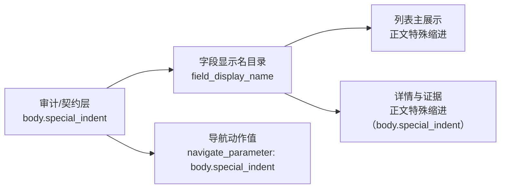

# 工作台问题队列字段显示名与控件复用边界再分析

日期：2026-06-28

## 本轮判断

前几轮已经把场景页、模板页、资料页、导航 tooltip 和证据行逐步接入了同一套字段显示名目录，但工作台“运行前问题”仍然存在一个明显断点：问题队列的主标题和摘要会直接显示 `body.special_indent` 这类内部字段 key。

这不是单纯的文案问题，而是模板管理与场景/工作台之间的复用边界还没有完全拉齐：

- 模板管理侧已经更接近“用户看到参数含义，系统内部保存路径”。
- 工作台问题队列仍然混用了“审计定位 key”和“用户可读标签”。
- 控件契约审计能指出 `body.special_indent`，但 UI 主路径应该先说“正文特殊缩进”，否则用户必须理解内部数据结构才能判断问题。

因此，本轮的重点是继续拆开两个层级：主展示层负责可读，详情/证据层负责可追溯。

## 现状链路复盘

当前链路已经基本打通：

1. 模板管理使用样式字段和页面字段来展示预览、参数概览与跳转高亮。
2. 场景页通过 `field_display_name()` 复用同一批字段名，把 `scene.section_styles.*`、`format_scope.sections.*` 等路径转成可读名称。
3. 工作台证据行已经能把“参数路径：body.special_indent”投影成“参数：正文特殊缩进”，同时保留 `navigate_parameter` 的原始 action value。
4. 导航高亮 tooltip 已经支持“显示名 + 原始字段”的组合，避免定位时丢上下文。
5. 本轮补齐了工作台问题队列：标题/摘要不再把 raw key 当主文案。

现在主链路更清楚：



## 本轮已完成的实现

### 1. 字段显示名目录支持句内替换

新增 `replace_field_keys_with_display_names()`，用于把普通句子里的字段 key 替换成用户可读名称：

- `控件契约缺失：body.special_indent`
- 转为 `控件契约缺失：正文特殊缩进（body.special_indent）`

同时加入路径保护，避免把证据文件路径误判为字段：

- `src/shared/ui/paragraph_style_inputs.py:120#class SpecialIndentInput` 保持不变。

### 2. 工作台问题文案接入统一投影

`workbench_issue_display_text()` 增加两个层级参数：

- `include_raw_field_key=True`：详情/证据里显示 `正文特殊缩进（body.special_indent）`，保留审计定位。
- `include_raw_field_key=False`：队列标题只显示 `正文特殊缩进`，减少噪音。
- `translate_field_keys=False`：证据 action 解析前不翻译 raw key，避免破坏导航动作。

### 3. 问题队列主标题改为用户语言

工作台问题队列现在使用同一投影规则：

- 原来：`控件契约缺失：body.special_indent`
- 现在：`控件契约缺失：正文特殊缩进`

详情与 tooltip 保留可追溯信息：

- `缺少必审控件契约：正文特殊缩进（body.special_indent）`

证据按钮仍然保留原始动作值：

- `("parameter_path", "navigate_parameter", "body.special_indent")`

## 与模板管理的一致性结论

本轮之后，模板管理、场景配置、工作台问题队列之间有了更稳定的三层约定：

| 层级 | 使用对象 | 展示策略 |
| --- | --- | --- |
| 主展示层 | 队列标题、列表行、摘要 | 只显示中文业务名称 |
| 详情层 | tooltip、证据详情、问题说明 | 中文业务名称 + 原始 key |
| 动作层 | 跳转、定位、审计、测试断言 | 只传原始 key |

这个约定能保证：

- 可读性：用户第一眼看到的是“正文特殊缩进”，不是 `body.special_indent`。
- 一致性：模板页、场景页、工作台都使用 `field_display_name()` 作为字段名入口。
- 可追溯：开发与审计仍能从详情中看到原始 key。
- 可导航：action value 不被翻译，跨面板跳转不会失效。

## 仍然不够完善的地方

这轮补齐的是“字段名可读性”这一层，但要真正接近优秀设计，还需要继续处理下面几类结构问题。

### 1. 样式控件还需要描述符化

当前模板样式、场景样式和控件契约已经开始共享字段名，但控件本身还没有完全共享一个声明式描述符。

建议下一步沉淀 `StyleFieldDescriptor`：

- `field_key`
- `display_name`
- `control_type`
- `value_schema`
- `owner_panel`
- `contract_id`
- `template_path`
- `scene_path`
- `default_value`
- `readonly/debug visibility`

这样模板管理和场景规划不再各自维护“这个字段叫什么、用什么控件、跳到哪里”的重复逻辑。

### 2. 控件契约和控件实例还没有完全合并

现在 `control_contract_registry` 能审计缺失契约，但 UI 控件是否真的复用同一个契约描述，还需要继续收敛。

理想边界：

- 契约登记定义“这个参数必须有什么控件能力”。
- 控件描述符定义“界面上用哪个控件实现”。
- 模板/场景页面只消费描述符，不再硬写控件名称和字段路径。

### 3. 普通模式和诊断模式需要分离

当前详情里保留 raw key 是必要的，但长期看应该做成模式分层：

- 普通用户模式：只看业务名称和建议动作。
- 诊断模式：显示原始 key、契约 id、证据路径、source registry。

这会比把所有信息都挤在 tooltip 里更自然。

### 4. 工作台状态卡还需要继续去内部化

这轮处理了问题队列，但工作台其他状态卡、报告摘要、审计矩阵里仍可能暴露 registry、schema、pack、contract 等内部词。

后续应该继续用同一策略清理：

- 主卡片不展示内部 id。
- 详情抽屉展示原始 id。
- 导出报告保留完整审计字段。

## 测试记录

已通过：

```bash
python -m compileall src/ui/adapters/field_display_names.py src/ui/adapters/workbench_execution_adapter.py src/ui/panels/workbench/quick_execution_detail.py tests/test_field_display_names.py tests/test_workbench_execution_center.py tests/test_quick_execution_detail_architecture.py
```

```bash
python -m pytest tests/test_field_display_names.py tests/test_workbench_execution_center.py::test_workbench_issue_evidence_projection_keeps_ui_semantics_in_adapter tests/test_quick_execution_detail_architecture.py::test_quick_execution_detail_exposes_control_contract_issue_queue -q
```

结果：`5 passed`

```bash
python -m pytest tests/test_field_display_names.py tests/test_workbench_execution_center.py tests/test_quick_execution_detail_architecture.py tests/test_ui_copy_guardrails.py tests/test_workbench_issue_navigation.py -q
```

结果：`134 passed`

## 下一步建议

下一轮应该从“字段显示名统一”推进到“控件描述符统一”：

1. 先盘点模板样式页和场景样式页重复的控件字段。
2. 抽出一份 `StyleFieldDescriptor` 或同等结构。
3. 让模板管理、场景规划、控件契约审计都从描述符读取显示名、控件类型和路径。
4. 把工作台问题跳转也改为基于描述符定位，而不是由不同面板各自判断。

这样才算真正接近“样式、控件、模板管理高度复用”的目标。
