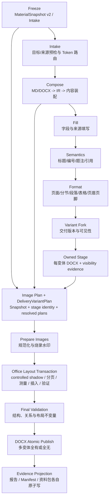

# 文件资料 DOCX 内容装配与图片水印原页自适应顶层规划

> 文档性质：最终“设计 + 实施 + 验收”事实基线  
> 日期：2026-07-12  
> 范围：字段资料、文件资料、图片资料、附件资料、MD/DOCX 内容块、图片烧录水印、Word/WPS 原页自适应落版、交付版本与审计产物  
> 状态：M0-M8 在 generic Workbench 支持域内已完成实现与验收；试卷、公文专用、target-template group 继续显式阻断；全仓脏工作树的无关失败单列，不冒充本链通过  
> 事实口径：本文只把代码、回执或真实 Office 验证能够证明的能力记为“已完成”；配置存在、文件存在或计划生成均不反推执行成功  
> 优先级：后续实现若与本文冲突，先修订本文并记录决策，禁止在代码中形成第二套隐含语义

本文前半部分保留需求二次分析、否决项和设计推导，作为“为什么这样做”的决策依据；第 23 节以后记录实际落点和验收事实。若早期“推荐/待建”措辞与实施事实不一致，以第 23-29 节和对应版本化契约为准。

## 1. 结论先行

这次不能被实现成“在资料页再加一个文件选择器，再给插图函数加几个参数”。正确方案是两条独立纵向链路，在最终交付件阶段汇合：

1. **文件资料链**：`MD/DOCX 源文件 -> 专用绑定 -> 内容导入预检 -> 统一内容 IR -> 目标语义渲染 -> 字段与格式链`。
2. **图片资料链**：`图片绑定 -> 统一插图计划 -> 原图级水印变换 -> 最终交付件锚点测量 -> 原页等比缩小 -> 布局回执`。

二者不能继续混入原有通用 `asset_paths / asset_items`，也不能把精确排版塞进 `ImageInsertionModule`。原有流水线以 `python-docx` 内存文档为中心，真实分页却只能在 Word/WPS 打开最终文件后取得；现已增加独立、文件级的 Office 图片布局事务，并由顶层资料装配编排器在最终变体阶段调用。

最终主链固定为：

```text
冻结资料快照
    -> 目标与来源预检 / Token 路由
    -> 文件资料内容装配
    -> 字段填写
    -> 标题、编号、题注、引用等语义处理
    -> 页面、分节、段落、表格等全部格式处理
    -> 按交付版本分叉并应用内容可见性
    -> 图片规范化与烧录水印
    -> 每个最终版本一次 Office 布局事务
    -> 最终不变量验证
    -> 原子发布、报告与资料包
```

最重要的产品约束已经冻结：

- 不根据标题数量、字号或“母版预留区”猜高度；直接测量最终锚点的真实纵坐标。
- 不把图片或标题主动移到下一页，不插入分页符，不设置 `KeepWithNext` 来搬标题，不裁图。
- 图片按原宽高比缩小到锚点当前页剩余空间；空间极小时继续缩小并给出可读性警告。
- 若数学上没有任何正剩余空间，或无法取得可信几何信息，则阻断并报告，不能静默改回固定宽度后声称正确。
- 正常路径每个交付版本只打开一次文档，不逐图重开、保存、导出 PDF 或完整分页。
- 图片水印只提供“启用 + 文本模板”；浅灰斜向平铺样式固定并版本化，不建设复杂设计器。

## 2. 需求回放与二次裁决

### 2.1 已确认需求

| 编号 | 原始需求/后续纠正 | 最终裁决 | 架构后果 |
| --- | --- | --- | --- |
| R-01 | “填资料”“公文资料”统一改为“字段资料” | 已接受，相关资料卡和导航使用“字段资料” | 不把业务名词“公文资料包”机械全局替换；只统一资料类型名称 |
| R-02 | “选图片”改为“图片资料” | 已接受 | 图片成为独立资料域，不再与附件或内容文件混名 |
| R-03 | 在字段资料下增加“文件资料” | 已接受，导航顺序建议为“字段资料 -> 文件资料 -> 时间计划 -> 图片资料” | 新建内容资料契约和页面，不能复用图片行 |
| R-04 | 文件资料用于项目背景、技术路线、安全健康评估、运维方案等可复用内容 | 已接受 | 输入内容是结构化文档片段，不是字符串字段，也不是附件 |
| R-05 | 来源可能是 `.md` 或 `.docx` | 首版支持这两类；PDF/XLSX 仍是附件 | 两类解析器输出同一个内容中间模型 |
| R-06 | 附件清单可绑定 DOCX/PDF/XLSX，但不能污染图片插入 | 当前图片侧已做后缀和字节隔离；顶层模型仍需继续强类型化 | 图片、附件、内容三类绑定必须拆开 |
| R-07 | 图片插入前需要打水印 | 接受，定义为“图片烧录水印”，与文档页眉水印分离 | 新建图片变换阶段，不修改原图 |
| R-08 | 水印外观采用示例中的浅灰、斜向、重复平铺 | 接受并固定为 `diagonal_tiled_v1` | UI 不开放角度、间距、高度、透明度等高级参数 |
| R-09 | 水印文本既可能是固定文本，也可能来自字段 | 统一为一个 `text_template` | 同一输入框同时支持字面量和现有 `{{field}}`，不建设两套模式 |
| R-10 | 标书没有稳定母版，业主提供的每份 DOCX 版式不同 | 接受为硬事实 | 禁止依赖预设框、标题数量或固定厘米高度 |
| R-11 | 标题可能是 10pt、50pt 或任意段前后距 | 不再推断标题 | 标题真实占高由锚点分页后的 Y 坐标自然体现 |
| R-12 | A/B/C/D 等“移动图片或上方段落”方案不正确 | 全部否决 | 不主动移动标题或前文，只缩图片 |
| R-13 | 图片必须和标题处在同一处/同一页 | 定义为：图片插入到标题之后的专用锚点，最终图片页必须等于该锚点目标页 | 布局事务必须返回可验证页码证据 |
| R-14 | 担心多轮校对导致运行很慢 | 接受为性能硬约束 | 单 Office 会话、批量测量、全局校验、有限修复轮次、主链不导 PDF |
| R-15 | 不只要“做完”，还要正确、链路清晰、避免屎山 | 作为最高工程约束 | 强类型边界、显式阶段、事务性写入、无静默降级、每层单一职责 |

### 2.2 当前完成状态与本文边界

| 能力 | 事实状态 | 证据边界 |
| --- | --- | --- |
| 资料类型统一为“字段资料 / 文件资料 / 图片资料 / 附件资料” | 已完成 | 资料页、持久化和运行 DTO 均按四域拆分；业务专名不做机械替换 |
| 图片来源与附件污染隔离 | 已完成 | 新图片规则只接受强类型 raster 来源并校验扩展名、MIME、真实字节与 SHA-256；附件不进入 DOCX |
| 资料包 v3 | 已完成 | 内容、图片、附件目录隔离，兼容读取 v0-v2，拒绝未知未来版本 |
| 文件资料 MD/DOCX semantic import | 已完成 | 两类来源进入统一 IR；不支持对象在修改目标前阻断；资源经 `ContentResourceKey` 物化 |
| 图片烧录水印 | 已完成并进入生产装配链 | 固定 `diagonal_tiled_v1`，冻结字段文本、字体与变换契约，不修改原图 |
| 交付版本 block visibility | 已完成 | 基于正文 block 顺序原子删除段落/表格/内容图片 marker，产出 receipt 或明确 `not_applicable` |
| Word/WPS 原页自适应布局 | 已完成 | schema v4 的真实 Word/WPS strict Workbench 纵切、原生 PDF、逐页 PNG 与人工视觉检查均通过；WPS 重开后绝对页序重算，但标题与图片同页不变量保持 |
| Workbench 唯一 active 链 | 已完成 | 文件资料规则直接激活；图片资料仅在规则必填，或同角色已选择真实来源时激活。默认存在但尚未选文件的可选图片规则保持 dormant；active 时旧 `image_insertion` 被排除，失败不回退旧链 |
| 报告、Manifest 与失败诊断 | 已完成 | exact receipt 投影为 applied；配置未执行、明确不适用和失败各有独立状态/证据，不从产物存在反推 |
| 全链发布验收 | 支持域完成 | 真实 Office、长路径/隐藏图片、1/10/50 图容量、跨进程锁、崩溃恢复、交叠 final-set 恢复与 focused regression 均已完成；全仓无关失败见 §23.9 |

本文不会把表面字段存在包装成能力完成，也不会把通过 WPS 或单元测试外推为 Word 最终视觉通过。已明确阻断的试卷、公文专用和 target-template group surfaces 也不计入当前支持范围。

### 2.3 对前面讨论中错误抽象的修正

#### 修正一：问题不是“标题有几段”，而是“锚点在最终分页后的真实位置”

标题数量、字号、段前后距、行距、表格、分节、页边距都会影响空间。任何基于“上方 1 段/2 段/连续短标题”的模型都会失真。正确输入只有：

- 当前交付版本；
- 当前节的纸张和页边距；
- 锚点的真实页码和纵坐标；
- 图片的原始宽高比；
- 当前容器的可用宽度。

因此无需识别“一级标题高 10px 还是 50px”，分页引擎已经把这些因素折算进锚点坐标。

#### 修正二：问题不是“给每份模板声明一个预留高度”

标书没有统一母版，且同一文档不同章节也可能有不同分节、边距和纸张方向。预留高度只能作为固定模板场景的可选能力，不能成为标书正确性的前提。

#### 修正三：问题不是“每张图片都反复导 PDF 校对”

PDF/PNG 渲染适合预览或最终抽样验收，不适合逐图热循环。正常路径应在一个 Office 会话中读取局部 Range 几何、插入所有图片，最后统一分页和校验。

#### 修正四：文件资料不是“另一种附件”

附件资料的终点是清单、校验、复制和交付包；文件资料的终点是解析内容并改变目标 DOCX 正文。二者即使都选择 `.docx`，业务语义和风险模型也完全不同。

## 3. 明确否决的实现方式

以下方案不得在后续实现中以“临时兼容”名义进入主链：

| 否决方案 | 否决原因 |
| --- | --- |
| 把文件资料继续塞进 `AssetBinding / asset_items` | 当前图片与附件已经部分依赖“有没有图片规则”来隔离；继续混装会再次产生跨类型污染 |
| 仅在 UI 增加“文件资料”按钮 | 没有解析、计划、执行、报告和迁移闭环，只会形成死入口 |
| 直接 `deepcopy` 源 DOCX 的 XML | 样式、编号、图片关系、超链接关系、书签、脚注、图表和分节均可能冲突 |
| 使用 `altChunk` 作为主合并方案 | 依赖 Word 打开后再转换，执行和验证不可控，也不适合 WPS/库端稳定处理 |
| 同一内容块有时语义导入、有时偷偷原样复制 | 会让同一份文档出现两套编号、样式和风险语义，无法审计 |
| 把考试专用 Markdown 解析器改成通用解析器 | 其语法和业务对象面向试题，不是 CommonMark 文档片段 |
| 在现有 `ImageInsertionModule` 内增加页码循环 | `python-docx` 不负责分页，且该模块当前运行早于页面、段落、分节和目录处理 |
| 找不到图片锚点时追加到文末 | 会生成看似成功但位置错误的产物；新链必须阻断 |
| 只数“包含 Token 的段落数” | 同一段两个相同 Token 会被误判为一次；必须统计实际 occurrence |
| A：只把图片移到下一页 | 违反“标题不动、图片在锚点当前页缩小”的决策 |
| B/C：图片和上方 1/2 段移到下一页 | 依赖错误的标题段数假设，并主动改变业主版式 |
| D：图片与连续短标题块一起移动 | “短标题”无法可靠定义，仍然在搬运原文 |
| 自动插入分页符或修改 `KeepWithNext` | 会改变标题位置；本能力只允许调整图片尺寸 |
| 通过裁剪保证塞入 | 资质证书等图片不能丢失边缘内容 |
| 每张图片重开 Word、保存、分页或导 PDF | 性能复杂度退化为 `N * 全文分页/渲染`，不可接受 |
| 无 Word/WPS 几何能力时静默回退固定宽度 | 无法证明同页，不能把降级结果标成成功 |
| 覆盖用户原始图片或源内容文件 | 破坏可追溯性和复用源，禁止 |

## 4. 实施后的代码事实

### 4.1 已建立的生产边界

1. **四类资料分域**：`EntityProfile` v3 分别持有内容绑定/规则、图片资料规则和附件绑定；新图片 intake 只把新规则拥有的 role 转成 `ImageSourceItem`，附件与非拥有 role 被排除。
2. **一次字段解析**：Workbench 在进入 active 链前解析字段一次，并把 resolution 冻结到 `MaterialExecutionContext`；正文和水印后续只消费同一组冻结值，执行阶段不再次调用时钟或字段 provider。
3. **Intake Freeze 与交付身份分离**：`MaterialSnapshot v2` 只记录来源与冻结策略；每个最终变体在内容装配、Pipeline 和可见性完成后才生成唯一 `DeliveryVariantPlan`。
4. **内容资源强身份**：Markdown 本地资源和 DOCX 内嵌资源统一使用 `ContentResourceKey(content_id, resource_id)`，经哈希、MIME、真实 raster 和尺寸验证后物化到内容寻址缓存；同名资源不会跨内容块串用。
5. **显式阶段与结构失效**：Pipeline 使用 `PhaseGraph` 而非模块名字母序；结构修改后重建文档索引。内容装配、交付分叉、图片计划/变换、Office 布局和发布由顶层编排器串接，不塞回普通模块。
6. **文件级 Office 事务**：Word/WPS child 通过独占 `DispatchEx` 运行；同一变体只打开/保存一次，批量测量、插入、有限稳定轮次后返回版本化 receipt。
7. **全有或全无发布**：编排器拥有 prepared、同目录 stage、Office shadow、候选和备份；全部变体验证通过后才进入多 final 发布，任一替换失败按 journal 恢复已有 final。
8. **事实型报告**：报告和 Manifest 直接投影 `MaterialAssemblyReceipt` 或结构化 `MaterialAssemblyError`，不依据配置、路径或文件存在反推成功。

### 4.2 仍开放但不伪装成已完成的边界

1. Word/WPS 的最终视觉验收已完成；WPS 会在保存后重开时重新编号绝对页序，因此 receipt 页号只作为同一稳定会话内的共置证据，最终持久外观另由原生 PDF 逐页复验。两类证据都必须成立。
2. active 资料装配链当前明确阻断试卷 surface、公文专用 surface 和 target-template group；这些路径尚未接入相同 staging/receipt 所有权契约。
3. 多栏、浮动环绕对象、脚注/尾注、非正文锚点以及首版未建模的复杂 DOCX 对象继续 fail closed，不做近似成功。
4. 一锚多图的 `fixed_box_flow` 不承诺整个组与标题严格同页；严格原页承诺仍限定为可证明的一锚一图。
5. generic report 在没有配置上下文时只能记 `not_run`；是否为 `configured_only` 由拥有配置事实的 material manifest 判定。
6. 全局 feature flag、shadow comparison 和把新链设为所有 surface 默认值属于后续发布治理；当前采用“有效文件/图片规则显式 opt-in”，未激活新规则的 legacy 图片链保留兼容，但 active 链不存在双插或 fallback。

## 5. 领域边界

### 5.1 四类资料必须有四种语义

| 资料类型 | 主要值 | 执行终点 | 是否改变正文 | 允许的首版来源 |
| --- | --- | --- | --- | --- |
| 字段资料 | 标量、日期、表达式结果 | Token 替换 | 是，替换文本 | 表单、映射、资料包 |
| 文件资料 | 结构化内容片段 | 解析后插入正文 | 是，增加段落/表格/图片 | `.md`、`.docx` |
| 图片资料 | 图片像素与插图规则 | 变换并插入 Word | 是，增加 InlineShape | 受支持图片格式 |
| 附件资料 | 原始交付文件 | 清单、校验、复制、打包 | 否 | `.pdf/.docx/.xlsx/...`（按角色限制） |

四类可以共享最低层的 `FileAssetRef(path, mime, size, sha256)`，但不能共享上层绑定、规则、解析结果或运行 DTO。

### 5.2 已落地的核心持久化/执行契约

```python
@dataclass(frozen=True)
class FileAssetRef:
    source_path: str
    original_name: str
    media_type: str
    content_sha256: str
    byte_size: int

@dataclass(frozen=True)
class ContentResourceRef:
    relative_path: str
    media_type: str
    content_sha256: str
    byte_size: int

@dataclass(frozen=True)
class ContentSourceBinding:
    content_id: str
    label: str
    source: FileAssetRef
    source_format: Literal["markdown", "docx"]
    import_strategy: Literal["semantic"] = "semantic"
    parser_contract: str = "content-ir-v1"
    selector_kind: Literal["whole_document"] = "whole_document"
    resources: tuple[ContentResourceRef, ...] = ()
    content_revision: str = ""

@dataclass(frozen=True)
class ContentInsertionRule:
    rule_id: str
    content_id: str
    anchor_token: str
    required: bool = True
    occurrence_policy: Literal["exactly_one", "all"] = "exactly_one"
    anchor_policy: Literal["isolated_body_paragraph"] = "isolated_body_paragraph"
    style_policy: Literal["target_semantic"] = "target_semantic"
    heading_policy: Literal["preserve", "relative_to_anchor"] = "preserve"
    heading_level_offset: int = 0
    page_break_policy: Literal["drop", "preserve_explicit"] = "drop"
    unsupported_policy: Literal["block"] = "block"

@dataclass(frozen=True)
class ImageWatermarkPolicy:
    enabled: bool = False
    text_template: str = ""
    style_version: str = "diagonal_tiled_v1"

@dataclass(frozen=True)
class ResolvedImageWatermark:
    enabled: bool
    resolved_text: str
    resolved_text_sha256: str
    resolved_font_identity: str
    resolved_font_sha256: str
    style_version: str
    transform_contract: str

@dataclass(frozen=True)
class ImagePlacementPolicy:
    mode: Literal["fixed_box", "fixed_box_flow", "fit_remaining_anchor_page"]
    contain: bool = True
    allow_crop: bool = False
    allow_move_preceding_text: bool = False
    allow_page_break: bool = False
    fixed_width_cm: float | None = None
    max_width_cm: float | None = None
    co_location_guard: Literal["none", "preceding_nonempty_paragraph"] = "none"

@dataclass(frozen=True)
class ImageAnchorRef:
    origin: Literal["material_token", "content_resource"]
    stable_marker_id: str
    source_token: str = ""
    guard_marker_id: str = ""

@dataclass(frozen=True)
class ResolvedImageInsertionPlan:
    job_id: str
    image_ref: FileAssetRef
    anchor: ImageAnchorRef
    occurrence_id: str
    watermark: ResolvedImageWatermark
    placement: ImagePlacementPolicy
    source_role: str
    sequence: int | None
```

`AssetItem.width_cm` 属于落版策略，不应继续留在来源事实层；宽度应迁入 `ImagePlacementPolicy`。持久化的 `ImageWatermarkPolicy.text_template` 只存在于配置层；进入 resolved plan 前必须在 Freeze 阶段得到 `ResolvedImageWatermark`，执行层不得再次解释字段。

上述代码片段保留领域形状，实际实现还增加了两条不得合并的身份链：

```text
ImageWatermarkPolicy + 冻结字段 + 字体身份
    -> FrozenImagePolicy
    -> FrozenImageMaterialRule + ImageSourceBinding
    -> MaterialSnapshot v2（Intake Freeze，跨全部变体共享）

MaterialSnapshot v2 + 某变体 staged DOCX 身份 + 该变体 resolved image plans
    -> DeliveryVariantPlan（该变体唯一执行身份）
```

`MaterialSnapshot v2` **不包含** `variant_id/version`、目标 DOCX 哈希/尺寸、目标锚点事实或 resolved insertion plans；否则同一个 intake 会因交付版式而产生多个“快照真相”。`DeliveryVariantPlan` 才持有 `snapshot_id`、`variant_id/version`、staged DOCX SHA-256/byte size 与最终图片计划。`ImagePlanReceipt` 只证明规划步骤发生，不能代替交付变体身份或布局成功回执。

### 5.3 资料包 v3

资料包已升级为 v3：

```text
package.json
assets/<profile>/...                 # 图片资料
attachments/<profile>/...            # 附件资料
content/<profile>/<content_id>/...    # 文件资料原始 MD/DOCX 及其本地资源
```

要求：

- v0/v1/v2 非破坏读取；
- 新增 `content_items/content_rules` 或等价强类型字段；
- 文件资料绝不写入 `assets/`；
- 原始源文件、原名、相对路径、SHA-256 和解析契约版本可追溯；
- Markdown 的依赖资源使用规范化相对路径排序后写入 manifest；`content_revision = hash(source_sha256 + 全部资源路径/sha256/media_type)`；DOCX 的内嵌资源已经包含于源包哈希；
- IR 作为可重建缓存，不作为资料包唯一事实；缓存键为 `content_revision + parser_contract`；
- 资料包未知未来版本继续拒绝，不“尽力猜读”；
- profile 的序列化、反序列化和 clone 均保留新域，避免 presenter 手工重建时丢失字段。

## 6. Token 命名空间与锚点契约

### 6.1 唯一 Token 路由

推荐语法：

```text
{{@content:technical_route}}   -> 文件资料
配置中登记的图片 Token          -> 图片资料
其他 {{key}}                   -> 字段资料
```

规则：

1. `@content:` 是保留命名空间，字段名不得使用该前缀。
2. 一个 Token 若同时被图片规则和内容规则声明，预检阻断。
3. 文件资料源内部允许普通 `{{field}}`，内容插入后统一填写。
4. 文件资料源内部首版禁止再包含 `{{@content:...}}`，避免递归、循环和跨块依赖。
5. 扫描、预检、运行和 Manifest 必须消费同一个 `TokenRoutingResult`，不得各写一套判断。

### 6.2 内容锚点首版约束

- 必须是正文中的独占段落：其 XML 子节点除 `w:pPr` 和共同构成该 Token 的普通 `w:r/w:t` 外不得含有 bookmark、field、drawing、hyperlink、content control、proofing/修订节点或其他对象；只检查可见文本不够。
- 默认 `exactly_one`；重复和缺失均阻断。
- 首版不支持表格单元格、页眉页脚、文本框、内容控件和浮动形状中的内容锚点。
- 不允许“找第一个算了”；若将来支持 `all`，必须产生稳定 occurrence ID 并逐项报告。
- 插入时先在锚点前生成全部块，全部成功后才删除锚点段落。
- 所有内容源和锚点先完整预检，任一阻断错误或中途异常时丢弃整个工作副本，目标文档保持零修改。

### 6.3 图片锚点首版约束

- 精确落版规则必须把 Token 固化为唯一 bookmark/marker，Office 阶段按该稳定身份定位。
- 必须统计 Token 的实际出现次数，包括同段重复、跨 Run 和多故事范围。
- 首版 `fit_remaining_anchor_page` 仅承诺正文普通段落锚点。
- 表格单元格需独立测量 cell/row 分页；通过专项技术探针前不得伪装支持。
- 页眉页脚、文本框、浮动 shape、脚注尾注等先阻断。
- 锚点缺失、重复、位置不支持时绝不追加到文末。
- 专用锚点段落若设置固定值行距、`page_break_before`、`keep_with_next`、`keep_together`、frame 或其他可能移动/裁切 InlineShape 的分页属性，首版阻断；不静默改写这些属性。
- 严格同页模式还必须建立 `preceding_nonempty_paragraph` guard，并在插入前证明 guard 与锚点同页；否则只能声称“定位到锚点”，不能声称“与标题同页”。
- 锚点目标页若存在侵入正文流的浮动环绕对象、脚注/尾注或 provider 无法建模的可用区，首版阻断精确模式。

## 7. 文件资料内容装配设计

### 7.1 采用统一语义中间模型

```text
DocumentFragment
├─ blocks
│  ├─ HeadingBlock(level, inlines)
│  ├─ ParagraphBlock(inlines)
│  ├─ ListBlock(ordered, start, nesting, items)
│  ├─ TableBlock(rows, cells, rowspan, colspan)
│  ├─ ImageBlock(resource_id, size, alt_text, generated_anchor_id)
│  └─ PageBreakBlock
└─ resources
   └─ BinaryResource(resource_id, media_type, sha256, bytes/path)
```

Inline 首版至少包含：

- 文本；
- 粗体、斜体、下划线；
- 软/硬换行；
- 外部超链接；
- 普通字段 Token。

首版图片必须是“独占图片段落”：源段落除一张 inline picture 和可忽略空白外不得混有文本或第二张图片，统一归一化为 `ImageBlock`。混合文本 + 图片、同段多图和浮动图片阻断，不引入同时存在 `InlineImageSpan` 与 `ImageBlock` 的模糊双模。

MD 和 DOCX importer 只负责生成 IR；目标 renderer 只消费 IR，不知道原始来源格式。这样 Markdown 和 DOCX 不会各自发展一套 Word 插入代码。

### 7.2 Markdown 导入策略

- 使用固定版本的 CommonMark AST 解析库，不手写正则解析器。
- 方言冻结为 CommonMark + 明确需要的表格扩展。
- 禁用原始 HTML，避免不可控 OOXML/脚本/远程资源。
- 禁止远程图片；相对图片只从 Markdown 所在目录解析，并随资料包复制。
- 路径必须规范化并限制在允许的源目录范围内，禁止 `../` 越界引用。
- 相对图片及其他允许资源必须形成规范排序的 `ContentResourceRef` manifest；资源内容变化即改变 `content_revision`，即使 Markdown 文本未变也必须使 IR/预览缓存失效。
- 图片进入统一 `ImageJobPlan`，不在 Markdown renderer 内直接落版。
- 当前考试专用 Markdown 解析器保持原边界，不承担通用文件资料。

### 7.3 DOCX 导入策略

首版只建设 `semantic` 后端，目标是保留内容结构并采用目标文档语义样式，而不是承诺任意 DOCX 无损合并。

支持范围冻结为：

- 标题与正文段落；
- 粗体、斜体、下划线和换行；
- 无序列表和十进制有序列表，最多 3 层；有序列表从 1 开始，每个 ListBlock 明确重启；罗马数字、字母、法律编号、样式链接编号、图片项目符号和更深层级阻断；
- 简单矩形表格：不允许横向/纵向合并、嵌套表格、单元格列表/图片/内容控件；单元格只允许受支持的文本 inline 与外部超链接；
- 独占图片段落形式的嵌入图片；混合文本 + 图片、同段多图阻断；
- `http`、`https`、`mailto` 外部超链接；`file://`、UNC、本地文件 relationship 和未知协议阻断；
- 显式分页符；
- 插入后的普通字段填写；
- 目标样式映射。

首版阻断：

- 源页眉页脚和 `sectPr`；
- 浮动图片、文本框、形状、SmartArt、图表；
- OLE、宏、嵌入 Excel 或其他包；
- 修订、批注、隐藏文字、内容控件；
- Word 域和目录域；
- 脚注、尾注；
- 内部书签链接和跨文档引用；
- 嵌套表格及复杂不规则合并；
- 链接图片和远程资源；
- OMML 公式、`altChunk`、legacy VML picture/shape、ActiveX、`mc:AlternateContent`、`subDoc`；
- 除允许外部超链接外的所有 external package relationships；
- “完全保留源格式”。

原因是源 DOCX 的 `pStyle/rStyle/tblStyle`、`numId`、`rId`、bookmark ID、docPr ID、footnote/comment ID 和 package relationships 都是源包局部身份。未经完整 remap 的 XML 复制不是“保真”，而是不可预测。

若未来确有保留源格式需求，应新增完整独立的 `preserve_source` 后端。它可以与 `semantic` 共享输入契约、预检和诊断，但两个后端之间禁止逐块隐式 fallback。

导入诊断必须区分三类：

- `preserved_semantics`：内容和支持的 inline 语义被保留；
- `normalized_presentation`：源字体、字号、颜色、段距、样式 ID 等按设计采用目标样式，不是“静默丢失”，必须写入 receipt；
- `blocking_unsupported`：内容、关系或对象会丢失/失真，执行前阻断。

`unsupported_policy=block` 约束第三类，不把预期的目标视觉归一化误判成普通 DOCX 全部不可用。

### 7.4 目标语义渲染

- 修改目标前先生成完整 `StyleResolutionPlan`。其唯一来源是本次 resolved format config 与目标文档样式清单；renderer 不自行猜样式。
- `heading_policy=preserve` 使用 `source_level + heading_level_offset`；`relative_to_anchor` 以锚点前最近一个已识别标题为基准，把源片段最浅标题映射为其下一层。找不到基准、结果超出 1..9、目标样式缺失且 resolved config 没有显式创建计划时均阻断，不截断到 1/9、不回退 Normal。
- 普通段落使用目标正文样式，不复制源 style ID。
- 列表在目标文档分配新的 numbering 定义，不复制源 `numId`。
- 表格使用目标表格样式和后续 `table_format` 处理。
- 图片转为带系统生成 `content_resource` marker 的延迟 `ImageJobPlan`，不要求用户提供图片 Token。内容图片默认 `watermark.enabled=False + fixed_box_flow/目标内容宽度`，只有内容规则显式覆盖时才可加水印；不得意外继承资质图片的水印或严格原页策略。
- 外部超链接在目标 document part 新建关系。
- 源分页符默认丢弃，只有 `page_break_policy=preserve_explicit` 时才在内容装配阶段保留；“不新增分页符”约束的是后续图片布局阶段，源分节属性始终不导入。
- 内容插入后必须使 `DocumentIndex/doc_tree/heading_map` 失效并重建。

## 8. 图片水印设计

### 8.1 产品面只保留两个输入

每个图片角色/规则配置：

1. `启用图片水印`；
2. `水印文本`。

`水印文本` 本身就是模板，可同时表达自由文本和字段：

```text
示例水印1234567891011
{{company_name}}{{credit_code}}
投标人：{{company_name}}  项目：{{project_name}}
```

UI 提供字段选择器插入 Token 即可，不再增加“固定字段/自由字段”模式开关。若开启水印但模板为空、字段未解析或最终文本为空，预检阻断，不能把原始 `{{...}}` 烧进图片。

水印模板只允许字面量和字段 Token；内容 Token、图片 Token、递归内容表达式和运行时脚本均不允许进入该模板。

### 8.2 固定样式

`diagonal_tiled_v1` 固定为：

- 浅灰；
- 斜向；
- 重复平铺；
- 适度透明；
- 间距和字号随图片像素尺度稳定计算；
- 支持中文字体回退；
- 版本化，样式调整必须升级版本并进入缓存键。

角度、透明度、密度、字号、行高、偏移不进入首版 UI。

### 8.3 正确变换链

```text
读取并验证真实图片字节
    -> EXIF transpose
    -> 色彩/透明通道规范化
    -> 解析冻结后的水印文本
    -> 在原始像素尺寸烧录斜向平铺水印
    -> 规范输出 PNG/JPEG
    -> 产生 PreparedImage
    -> Word 仅通过 Drawing extent 控制物理尺寸
```

约束：

- 源文件只读，永不覆盖。
- 水印先于 Word 缩放，避免小图放大后水印模糊或密度异常。
- WebP 等继续转换为 Word 稳定支持的格式。
- 有透明通道时使用 PNG；不透明照片可使用确定性的 JPEG 编码策略。
- 设置像素数、解压后字节数和作业内存预算；首版 Pillow 变换按受控串行/有限并行完整解码，超过阈值阻断。只有另行实现并测试 tiled pipeline 后才能声称超大图流式处理。
- 作业级缓存键不是明文拼接路径，而是下列规范化元组的 SHA-256：`source_sha256 + resolved_text_sha256 + resolved_font_identity/font_sha256 + style_version + transform_engine_version + orientation/color_contract + codec/quality_params`。
- 同一次批量/多交付版本复用缓存；首版不做长期跨作业敏感缓存。
- 报告保存模板、文本哈希和短预览，不默认暴露完整敏感水印文本。

### 8.4 与整份文档水印的边界

- `DocumentWatermarkPolicy`：页眉/VML，覆盖整份文档背景。
- `ImageBurnInWatermarkPolicy`：改变图片像素，随图片嵌入。

命名、配置、模块、报告和 UI 均必须分开；二者可以同时启用，但不能共享一个 `watermark.enabled`。

## 9. 图片原页自适应落版

### 9.1 三种明确布局模式

| 模式 | 适用 | 行为 |
| --- | --- | --- |
| `fixed_box` | Logo、印章、签名、二维码、封面图等 | 按规则给定宽度，仍需受容器宽度限制 |
| `fixed_box_flow` | 一个锚点对应多张资质/产品/案例图片 | 按序生成独立图片段落并参与正常文档流；不声明全组原页同页 |
| `fit_remaining_anchor_page` | ISO/资质扫描件等需要与上方标题留在同页的图片 | 测量锚点当前页剩余空间，等比 contain 缩小 |

`fit_remaining_anchor_page` 的行为固定为：

- contain；
- 保持宽高比；
- 不裁剪；
- 不移动前文；
- 不插入分页符；
- 不修改标题段落的分页属性；
- 只缩小到 `max_width_cm`（若未配置则为当前容器宽度）和剩余高度共同允许的尺寸；不依据不可信的扫描图 DPI 声称“原始物理尺寸”。

### 9.2 计算模型

全部使用 Word 点值：

```text
geometry = provider.measure_text_container(anchor_sentinel)
available_height = geometry.flow_bottom - geometry.anchor_y
                   - paragraph_reserve - safety_margin
available_width = geometry.available_width
width_cap = min(available_width, configured_max_width_if_present)
aspect_ratio = source_width_px / source_height_px

target_width = min(width_cap, available_height * aspect_ratio)
target_height = target_width / aspect_ratio
```

其中：

- `geometry.anchor_y` 是当前交付版本、当前稳定分页状态下、且已经包含前序插图回流后的即时锚点纵坐标；
- `geometry.available_width` 必须由 provider 返回锚点当前文本容器的真实有效宽度，至少正确区分正文单栏和当前 column；不得用整节纸宽减页边距冒充多栏宽度；
- `geometry.flow_bottom` 只在 provider 能证明当前正文流有效下边界时使用；表格 cell、浮动环绕对象、脚注/尾注等未建模情形首版阻断；
- `paragraph_reserve` 来自锚点段落的实际行高/段前后距和 InlineShape 基线需要，不是标题段数估算；
- `safety_margin` 是内部版本化容差，不进入普通 UI；
- `configured_max_width_if_present` 为空时等于 `available_width`，公式中不会把 `None` 传入 `min()`；
- 多栏只有在 M0 证明 provider 能返回当前栏宽/栏间距后才进入支持矩阵，否则预检阻断；表格单元格仍为首版 unsupported。

若 `available_height <= 0` 或计算尺寸低于 Word 可表示的技术下限，则状态为 `blocked_no_insertable_space`。按用户决策不移动标题、不换页。

若尺寸可插入但过小，则仍保持原页，同时输出 `readability_warning`，报告缩放比和最终物理尺寸。

### 9.3 Office 布局事务

对每个已经完成内容可见性处理的最终交付版本：

```text
1. 创建同目录 staged shadow DOCX
2. 在隔离 broker 子进程启动并证明独占的一次 Office Application
3. 可写打开该版本一次，切换 Print Layout
4. 更新 Fields/TOC，执行初始 Repaginate
5. 按文档顺序处理 ImageJob；每项插入前即时定位稳定 sentinel/guard
6. 即时读取 page/y、Section.PageSetup 和 TextContainerGeometry；该状态必须已包含前序图片造成的回流
7. 校验 guard 与 anchor 同页、锚点段落兼容性和目标页流式对象边界
8. 计算尺寸并 InlineShapes.AddPicture；为本次 shape 写入稳定 job-owned ID
9. 所有图片插入后执行完整 Repaginate，再更新 Fields/TOC
10. 若字段结果改变版面，执行有界的“分页 -> 字段更新 -> 布局复验”全局稳定轮次
11. 只对违规 job 等比缩小，执行有限全局修复轮次；绝不逐图完整 Repaginate
12. 批量验证 guard/anchor/image 页、边界、比例、残留 Token 和 job-owned shape
13. 保存并关闭 staged shadow，返回 LayoutReceipt；Office 阶段不发布 final
14. Phase K 对 staged shadow 完成结构和证据验证后，Phase L 才原子替换最终产物
```

事务失败时丢弃 staged shadow，不覆盖源文件或已有最终产物。M0 必须证明顺序插入时 `Range.Information`/等价 API 能返回包含前序回流的最新局部几何；若不能在不做 N 次全文分页的前提下成立，则该 provider 的精确模式暂停，而不是使用陈旧坐标满足性能数字。

### 9.4 为什么必须放在每个交付版本之后

当前 delivery preset 会克隆文档并删除不同可见性内容；目录/域更新也可能改变页数。若只在公共 base DOCX 上测一次，客户版、内部版、附件版的锚点位置会不同。因此：

- 图片变换可跨版本复用；
- 图片几何必须逐最终版本计算；
- 一个 broker 作业可复用同一 Office Application，但每个具体 DOCX 只打开一次。

### 9.5 “标题同页”与“不移动”的可验证定义

“图片 page == 某个锚点数字页”本身不能证明标题同页。首版不猜标题数量，而是把锚点前最近一个非空普通段落固化为 `co_location_guard`。严格模式的前置条件和最终不变量是：

```text
measurement_guard_page == measurement_anchor_page
final_guard_page == final_anchor_sentinel_page == final_job_owned_image_page
```

LayoutReceipt 必须分别记录 measurement/final 的 guard、anchor 和 image 页码，不能只记录含糊的 `anchor target page`。若目标文档的“标题”不是紧邻锚点的前一非空段落，首版只承诺图片与锚点同页；需要多段标题范围时应增加显式 guard bookmark，而不是重新猜“上方几段”。

本能力同时保证：

- 不重排、不复制、不删除图片锚点之前的标题/正文段落；
- 图片布局阶段不新增分页符；文件资料按显式 `page_break_policy` 在更早阶段导入的源分页符不属于此禁令；
- 不改变前置段落的 `keep_with_next/keep_together/page_break_before`；
- 图片插入到锚点位置；
- 若无法满足则失败，不选择 A/B/C/D 方案。

前序图片或最终字段稳定化可能让 guard、anchor 和图片的数字页码整体变化；只要最终三者仍同页且系统未主动改写前置段落/分页属性，就不等于搬标题。若它们分离，则从最早受影响 job 重测并缩小；有界轮次后仍不稳定即阻断。

### 9.6 多图文件夹的明确边界

“一个锚点绑定 N 张图片，并要求 N 张都与同一个标题留在同一页”在 N 较大时数学上不可满足，也会把证书缩到不可读。

首版裁决：

- `fit_remaining_anchor_page` 只对“一锚点一图片”提供严格同页承诺；
- 多图文件夹只使用 `fixed_box_flow`：第一张消费用户锚点，后续图片在前一图片后生成系统段落/marker，按 sequence 和容器宽度插入，允许正常 Word 文档流，不主动加分页符，也不提供原页同页保证；
- 每张多图仍产生独立 job-owned ID 和 receipt，既有顺序、数量和图片不被吞掉；
- 若多图角色需要严格标题同页，应使用每图独立锚点/独立小标题的显式模板或后续专门的组分页策略；
- 给多图规则错误配置严格原页模式时，预检阻断，不进行无界缩小。

这不是功能缺失的掩饰，而是避免把不可能约束伪装成成功。

## 10. 显式阶段架构

原有按模块名排序的单层 scheduler 已退出新资料链；当前由 `PhaseGraph` 约束普通模块阶段，顶层 `MaterialAssemblyService` 负责跨文件事务，Office 布局保持独立事务而不是 `BaseModule`。



### 10.1 Phase A：Freeze

一次性冻结：

- 解析后的字段值和字段函数结果；
- 水印文本表达式结果；
- 内容、图片和附件绑定；
- Token 类型声明和保留命名空间；
- 来源文件 SHA-256；
- 来源 revision、schema 与规则版本。

产出不可变 `MaterialSnapshot v2`（Intake Freeze）。它跨交付版本共享，不含 preset/variant、目标 DOCX 几何或 resolved plans；正文、水印、预检和报告消费同一 intake，避免时间函数或 UI 状态在执行中漂移。

### 10.2 Phase B：Intake

- 只读打开目标一次；
- 运行 package/object preflight；
- 运行所有内容源的 `ContentImportPreflight`；
- 统计真实 Token occurrence 和支持 surface；
- 生成 `DocumentInventory + ExecutionPlan`；
- 配置完全 resolve 后再驱动预检与执行，避免 scene switch 与 resolved config 不一致。

### 10.3 Phase C：Compose

- 解析/缓存所有内容 IR；
- 先完整生成 `ContentAssemblyPlan`；
- 任一阻断错误时零修改；
- 按目标位置逆序事务性插入，避免前方插入改变后方定位；
- 内容内部图片生成带系统 marker 的延迟 ImageJob；Compose 结束后才形成包含用户图片和内容图片的完整 `ImageJobPlan`；
- 插入结束后标记文档索引失效。

### 10.4 Phase D-F：Fill / Semantics / Format

- 文件资料先插入，确保其内部字段也能填写；
- 所有会改变文本结构的动作完成后再统一标题识别；
- 结构修改后重建 `doc_tree/heading_map`；
- 编号、题注、引用依赖新索引；
- 页面、分节、段落、表格、公式、页眉页脚、空白清理等所有会改变分页的格式必须在 Office 几何前结束；
- 创建/同步 TOC field，但真实页码在 Office 阶段刷新。

### 10.5 Phase G：Variant Fork

- 克隆每个交付版本；
- 应用内容可见性、客户/内部/归档差异；可见性必须升级为按 document body block 顺序处理的 `BlockVisibilityPlan`，能够原子删除 paragraph、table、整个内容块范围及其生成的 image marker，不能继续只删段落文本而留下表格壳或孤儿图片；
- 每个版本删除内容后均使公共索引失效，并重新生成 `DocumentInventory/TokenRoutingResult`、稳定 anchor/guard marker 和版本级 ImageJobPlan；
- 规则明确隐藏的图片 job 记为 `not_applicable`；意外失去必需锚点的 orphan job 阻断；
- 从此每个版本拥有独立 `DeliveryVariantPlan`；
- 禁止在后续把一个版本的 LayoutReceipt 复用给另一个版本。

### 10.6 Phase H：Prepare Images

- 在 Office 外完成，可受控并行；
- 在 variant visibility 后，基于 `DeliveryVariantPlan` 的完整 resolved plans 执行；这样内容源图片、用户图片和已隐藏 job 都已有唯一结论；
- 规范化、烧录水印并缓存；
- 产出不可变 `PreparedImage`；
- 不触碰 DOCX。

### 10.7 Phase I-J：Artifact / Office Layout

- Pipeline 先把逐版本重建索引、visibility 和稳定 sentinel/guard 的结果保存到 orchestrator-owned stage；
- image planner 读取该 stage，固化 `DeliveryVariantPlan`；Office parent 只从 stage 创建同目录 controlled shadow；
- 普通模块到此停止写入；
- Office broker 负责域/TOC、分页、测量、插图、最终验证和保存；
- COM 之后禁止再用 `python-docx` 做任何会改变分页的写入。

### 10.8 Phase K-L：Validation / Publish

- 重开 OOXML 做关系和残留 Token 检查；
- 对照 LayoutReceipt 检查每个 job-owned shape 的稳定 ID 和一一对应关系，并确认执行前既有 InlineShape 清单未被意外删除/替换；不得把 receipt 数量与文档 InlineShape 总数直接比较；
- 可选做最终 PDF/PNG 抽样视觉验收；
- 成功后原子发布、写报告和包；
- 失败保留诊断，不覆盖已存在的成功产物。

## 11. 代码边界与实际落点

以下责任边界已按仓库惯例落地；表中早期建议路径若与实际文件不同，以“实际落点”列为准：

| 层 | 实际落点 | 唯一职责 |
| --- | --- | --- |
| 内容/图片/快照契约 | `src/config/content_materials.py`、`image_materials.py`、`material_snapshot.py` | 配置态、冻结态、Intake 与变体身份分离 |
| Token/可见性 | `src/shared/engine/material_token_router.py`、`block_visibility.py` | occurrence 分类与变体 block 删除计划/回执 |
| 内容 importer/renderer/composer | `src/services/material_content/` | MD/DOCX -> IR -> 目标语义结构；资源物化与事务装配 |
| 图片 intake/freeze/plan/transform | `src/services/material_assets/` | 强来源、冻结策略、目标计划和原图外变换 |
| 顶层编排与事务 | `src/services/material_execution/` | 单向阶段、owned artifacts、多变体原子发布/回滚 |
| Pipeline 接缝 | `src/pipeline/runner.py` | logical/working 路径、精确 stage override、visibility receipt |
| Office 探针/门禁/broker/layout | `src/shared/engine/office_layout_probe.py`、`office_layout_capability_gate.py`、`office_broker_command.py`、`office_image_layout.py` | provider 身份缓存、冻结命令、短路径、几何和 OOXML 图片不变量 |
| Workbench active adapter | `src/ui/panels/workbench/material_assembly_runtime.py` | 唯一生产入口与现有 Pipeline callback 适配 |
| 报告与 Manifest | `src/reporting/material_assembly.py`、`src/report_writer.py`、`src/ui/panels/workbench/material_artifacts.py` | receipt/error 原样投影与原子写入 |

原 `ImageInsertionModule` 仅服务未激活新资料规则的旧链；active 资料装配链显式排除该模块，并拒绝与遗留 `config.images` 混用，不能双插或失败后回退。

### 11.1 防屎山约束

- UI presenter 不扫描目录、不解析 MD/DOCX、不启动 COM。
- config 层不依赖 Qt、Pillow 或 win32com。
- importer 不写目标文档；renderer 不读取源格式。
- Office adapter 不理解业务字段或 UI。
- runner 只编排阶段，不包含图片计算、Markdown 解析或 XML 搬运算法。
- 跨层只传 dataclass/enum/版本化 payload，不继续增加无类型 `dict[str, Any]`。
- 一个事实只由一个 resolver 产生；预览、预检、执行和 Manifest 只做投影。
- 每次结构修改显式失效并重建索引。
- 假能力（只有字段、没有执行语义）要么实现并测试，要么删除。
- feature flag 必须有删除条件和目标里程碑，禁止永久双轨。

## 12. Word/WPS 能力边界与技术探针

### 12.1 为什么必须先做探针

Word 的 `Range.Information` 能返回页码、相对页面纵坐标和是否位于表格等信息，但部分纵向位置在 Range 不可见时可能返回 `-1`。当前 COM 渲染器把 `Application.Visible=False`，不能直接假设几何可用。

M0 必须验证：

- `Visible=False` 与隐藏/最小化 Print Layout 的差异；
- `wdActiveEndPageNumber`；
- `wdVerticalPositionRelativeToPage`；
- 当前 Section/PageSetup；
- bookmark 定位；
- `InlineShapes.AddPicture`；
- `Document.Repaginate`；
- 插入前一张图片后，未显式全文分页时后续 Range 是否能返回包含当前回流的最新 page/y；
- TOC/Fields 更新后的“分页 -> 字段 -> 再分页”收敛行为和调用上限；
- 普通段落、分节、横向页面、当前 column 有效宽度、锚点段落分页属性；
- 表格单元格、浮动环绕对象、脚注/尾注作为 unsupported 探针，确认能够可靠识别并阻断；
- Word 与 WPS 的行为差异。

### 12.2 Provider 策略

- Word provider：首选，只有通过探针才启用精确模式。
- WPS provider：已独立通过 capability probe 和 strict Workbench v4 纵切；仍使用独立 adapter/矩阵，不能从 Word 行为推定等价。
- LibreOffice/PDF：只用于预览、诊断和视觉验收，不作为精确锚点几何引擎。
- 无合格 provider：`fit_remaining_anchor_page` 严格模式阻断；可另提供用户明确接受的 `manual_review` 降级，但产物状态必须是 partial/degraded，不能 success。

### 12.3 进程安全

- COM 放在隔离 broker 子进程，不让 Qt worker 长期直接持有 Office。
- 一个执行作业只启动一个 broker/Office Application，按版本顺序打开文档。
- broker 只能使用可证明由本作业独占的新 Application/PID（如 Word `DispatchEx` 或 provider 等价隔离机制）；禁止 fallback 到可能附着用户现有实例的共享 `Dispatch` 后再 `Quit/kill`。无法证明所有权时 provider 不可用于严格模式。
- 记录本次 Automation PID；取消/超时只清理本次进程，不杀用户已打开的 Word/WPS。
- 使用 shadow 文件和同目录原子替换，处理文件锁、崩溃和超时。
- 每个动作写结构化 receipt，Office 崩溃也能定位到版本/job/阶段。

## 13. 性能模型

### 13.1 候选正常快路径

每个最终版本：

- `Documents.Open = 1`；
- 初始字段/TOC 更新 + 完整 Repaginate = 1；
- N 张图片只做局部 Range 查询、尺寸计算和插入；
- 插入后完整 Repaginate，再更新最终字段/TOC；若字段结果不改变版面，则总完整分页目标为 2；
- 若字段结果改变版面，进入有界的全局稳定轮次，而不是用旧页码直接成功；
- 批量验证 = 1；
- Save = 1；
- PDF export = 0；
- 每图 reopen/save/full render = 0。

时间复杂度目标：

```text
T ≈ T_office_start
  + Σ T_open_each_variant
  + K_provider * Σ T_full_paginate_each_variant
  + N * T_local_measure_insert
  + T_unique_image_transforms
  + Σ T_save_each_variant
```

禁止退化为 `N * T_full_paginate`。

其中 `K_provider` 不是预先拍死的 2。`K=2` 是 M0 要争取并证明的无分页敏感字段快路径；含 TOC/PAGEREF 或字段结果改变版面时，必须通过有界全局收敛得到同时稳定的字段与布局。M0 若不能证明“最新局部几何 + 有界全局收敛”，该 provider 的精确模式暂停，不能为了满足调用计数而使用陈旧坐标。

### 13.2 修复慢路径

- 最终批量验证失败后，只缩小违规图片；
- 默认 1 个修复 pass，绝对上限 2 个全局修复 pass；
- 每个 pass 只做一次全局分页/字段稳定步骤和统一复验；
- 超过上限仍不稳定则阻断，不无限二分或循环；
- 报告记录 `fast_path / repaired / blocked`、repaginate_count、correction_count 和各阶段耗时。

### 13.3 其他性能控制

- 没有精确布局图片且不需要 Office 域刷新时，不启动 geometry provider。
- 图片水印按唯一缓存键只处理一次，多交付版本复用。
- 目录解析增加 binding resolution cache；UI 用 stat signature 判断变化，内容 hash 在变更、执行或打包时统一计算，避免反复扫同一目录。
- 水印并行受最大像素和内存预算限制，不按图片数量无界开线程。
- 数字秒数和“恰好两次分页”不在未实测前拍脑袋承诺；先固定“一次打开、禁止逐图全文分页、全局轮次有界”的复杂度，再在 M0 基准机记录 p50/p95 与 provider 的稳定轮次上限后锁定 SLA。

### 13.4 基准矩阵

```text
页数：10 / 50 / 200 / 500
图片：1 / 10 / 50
来源：PNG / JPEG / WebP / 高像素证书扫描件
布局：A4/A3、横纵向、多节、不同边距、标题 10pt/50pt
缓存：冷水印 / 热水印
引擎：Word / 通过探针的 WPS
版本：单交付 / 多交付可见性分叉
```

记录：Office start、open、field/TOC、paginate、anchor query、transform、insert、verify、save、总耗时、内存峰值和 fast-path 命中率。发布门槛建议为 fast-path 命中率不低于 95%，修复后布局违规率为 0。

## 14. UI 方案

### 14.1 导航

资料准备区顺序：

```text
字段资料
文件资料
时间计划
图片资料
```

“附件清单”仍可以在图片资料或后续独立附件区展示，但模型和执行语义已经与图片分开。

### 14.2 文件资料页面

每条内容资料显示：

- 显示名；
- 目标内容 Token；
- 来源文件名与类型；
- SHA/更新时间状态；
- 解析摘要（标题/段落/表格/图片数）；
- 预检状态；
- 选择、查看、重新解析、清除；
- 诊断详情。

首版文件过滤只允许 `.md/.markdown/.docx`，不显示“所有文件”。选择成功不等于可执行，必须等待内容预检结果。

### 14.3 图片规则页面

主清单保持简洁，规则详情包含：

- 布局：固定尺寸 / 适应锚点当前页；
- 启用图片水印；
- 水印文本模板；
- 字段插入器；
- 解析后文本预览；
- 可读性/布局引擎状态。

不开放标题数量、剩余高度、角度、透明度、密度、裁剪或“移动几段”等设置。

### 14.4 预检与结果

用户在执行前必须看到：

- 内容源是否支持；
- 锚点缺失/重复/不独占；
- 水印字段是否可解析；
- 当前机器是否有合格 Word/WPS provider；
- 多图规则是否错误使用严格原页模式；
- 预计需要布局的图片数和交付版本数。

执行后显示每项 `success / warning / blocked` 及跳转修复入口。

## 15. 报告与可追溯性

### 15.1 ContentAssemblyReceipt

至少记录：

- content_id / rule_id；
- source path（包内相对路径）/ SHA-256 / content_revision / 依赖资源 manifest 摘要；
- parser_contract / import_strategy；
- anchor token / occurrence ID；
- blocks、tables、images、links 数；
- `preserved_semantics / normalized_presentation / blocking_unsupported` findings；
- StyleResolutionPlan 摘要；
- 插入结果和字段展开结果；
- 源到目标的诊断。

### 15.2 ImageTransformReceipt

- job_id / source role / sequence；
- source SHA-256；
- resolved watermark text hash；
- resolved font identity/hash；
- style_version / transform_engine_version / orientation-color contract / codec params；
- output format / pixel size；
- cache hit；
- 源文件哈希复核结果。

### 15.3 ImagePlacementReceipt

- delivery variant；
- job_id / anchor / occurrence ID；
- provider 与 capability 版本；
- anchor/guard stable marker ID 与 job-owned shape ID；
- measurement_guard_page / measurement_anchor_page；
- final_guard_page / final_anchor_sentinel_page / final_job_owned_image_page；
- 即时 anchor Y、section page setup、column/container geometry 和可用宽高；
- 原始宽高比；
- 最终 width/height/scale ratio；
- correction_count；
- readability warning；
- 不变量验证结果。

### 15.4 性能与事务证据

- Office process/session/open/save 次数；
- repaginate_count；
- PDF export count；
- 各阶段耗时；
- shadow/final 路径和原子提升状态；
- 超时、取消、崩溃与清理结果。

Manifest、执行报告和 UI 必须投影同一批 receipt，不另行推导。

## 16. 实施路线图

本节保留最初里程碑及退出条件，用于核对实现是否偏航；实际完成状态和差异以第 23 节为准。

### M0：冻结基线与几何可行性探针

目标：先证明真实页测量和单会话性能可行，再承诺产品能力。

- 固化本文决策和当前相关回归基线。
- 建 Word/WPS capability probe。
- 验证隐藏窗口、Print Layout、Range.Information、分节、横向页、当前 column、顺序插图后的局部几何刷新、字段/TOC 收敛；表格 cell/浮动对象/脚注至少能可靠识别并阻断。
- 做 10/50/200/500 页与 1/10/50 图基准。
- 证明 Office open=1、PDF=0、无逐图全文分页；争取并验证无分页敏感字段快路径完整分页=2，同时为含 TOC/Fields 的 provider 冻结有界全局稳定轮次。
- 冻结首版支持 surface。

退出门槛：Word 至少一个 provider 能稳定返回可信页码/Y、当前容器宽度和包含前序插图回流的即时几何，并能在有界全局轮次内让 Fields/TOC 与布局同时稳定；任一条件不成立时精确原页能力暂停，不用 PDF 猜测冒充。

### M1：领域契约、Token 路由和 PhaseGraph

- 新建四类资料边界和中性 `FileAssetRef`。
- 新建 `MaterialSnapshot`、Content/Image plan 和 receipts。
- 实现唯一 Token router 与实际 occurrence 统计。
- 增加显式阶段和结构索引失效/重建协议。
- 把可见性升级为 block-range 契约，能够原子处理段落、表格、内容块和生成图片 marker。
- 预检与执行改为消费同一 resolved plan。
- 建 profile 唯一 codec。

退出门槛：无 UI 也可通过纯服务测试生成确定性计划；旧字段/图片链不回归。

### M2：资料包 v3 与文件资料后端骨架

- v0/v1/v2 -> v3 兼容迁移。
- `content/attachments/assets` 包目录隔离。
- 内容来源 hash、`ContentResourceRef` manifest、content_revision、复制、相对路径、原子导出和 round-trip。
- ContentImportPreflight 和诊断模型。

退出门槛：移动整个资料包后 MD/DOCX 内容源仍可解析；源失败时目标零修改。

### M3：Markdown 端到端纵切

- CommonMark AST -> IR。
- 标题、段落、限定列表、简单矩形表格、链接、独占图片段落、字段 Token。
- IR -> 目标 DOCX renderer。
- 插入后重新识别标题并进入格式链。
- 内容图片产生统一 ImageJob。

退出门槛：真实 MD 技术路线样例端到端通过 Word/WPS 打开与视觉验收。

### M4：DOCX semantic importer

- 按第 7.3 节冻结范围语义读取段落/run/限定列表/简单表格/独占图片段落/协议白名单超链接/显式分页符。
- 新建目标 numbering 和 relationships。
- 先生成 StyleResolutionPlan；区分 preserved semantics、normalized presentation 和 blocking unsupported。
- 严格阻断复杂对象、关系、混排图片和不支持编号/表格结构。
- golden IR、ZIP relationship 和 Word/WPS 渲染测试。

退出门槛：不泄漏源 style ID/numId/rId；内部关系无悬空；不支持对象不发生静默丢失。

### M5：图片烧录水印

- EXIF、色彩、透明度、中文字体、平铺样式。
- `enabled + text_template` 和冻结字段解析。
- 包含文本哈希、字体身份和全部变换契约的作业级确定性缓存；原图不变；像素/解压/内存阈值保护，首版不虚构流式处理。
- 与文档页眉水印完全分模。

退出门槛：截图基准与示例风格一致；批量 profile 不串文本/缓存；原始哈希保持不变。

### M6：Office 原页布局事务

- shadow file、broker、Word adapter、可选 WPS adapter。
- 每个 variant 删除可见性内容后重建索引、过滤 job、固化 anchor sentinel 与 guard。
- 当前 column/TextContainerGeometry 测量、顺序即时几何、contain 缩放、job-owned InlineShape 插入。
- 字段/TOC 与分页的有界全局稳定协议、有限修复和 receipts。
- 多交付版本逐版本布局；staged shadow 通过 Phase K 后才原子发布。
- 退役当前“找不到就文末”和固定宽度直接落图路径。

退出门槛：所有严格模式 job 均能证明 measurement 时 guard=anchor，同一最终稳定分页上 guard=anchor sentinel=job-owned image；不能证明的 job 不得 success。

### M7：UI 与修复入口

- 增加“文件资料”导航和 presenter。
- 图片规则增加最小水印/布局设置。
- 预检、解析摘要、provider 状态、诊断与修复跳转。
- 批量/导入/保存全部通过 profile codec。

退出门槛：UI 只投影服务事实；无隐藏第二套解析/排序/Token 判断。

### M8：全链硬化与渐进发布

- 全量 fixtures、真实 Word/WPS、性能、取消、超时、锁文件和崩溃恢复。
- 以“有效文件资料规则，或 required/已选择来源的图片资料规则”作为显式 opt-in；active 链排除旧直接插图，失败不 fallback。
- 旧直接插图仅归属未激活新规则的 legacy 请求；不能把兼容保留写成 active 双轨，也不把全局默认开启作为本轮正确性前提。
- 全局 feature flag、shadow comparison 与更多 surface 默认开启留给后续发布治理，须先接入同一 staging/receipt 契约。

退出门槛：完成第 17 节支持域验收；active 请求只有一条生产链；legacy 所有权边界和后续删除条件有明确记录。

## 17. 测试与验收门槛

### 17.1 架构契约

- 阶段顺序固定为 `content < fields < semantics < pagination-changing format < variant visibility < image layout < final fields/TOC < final validation`。
- 任一结构修改后 DocumentIndex 必须失效并重建。
- Office 后没有分页写入。
- 预览、预检、执行、Manifest 使用同一 plan/receipt。
- 资料、图片、附件、内容不能跨类型进入错误 resolver。

### 17.2 资料包与迁移

- v0/v1/v2 无损加载。
- v3 JSON/bundle/移动重开/重复导出确定性通过。
- 图片、附件、内容目录互不污染。
- SHA-256 不匹配时阻断或明确重新解析。
- 未知未来版本拒绝。

### 17.3 Token 与锚点

- 字段、图片、内容命名空间正确分类。
- 类型碰撞阻断。
- 跨 Run、同段双 Token、重复段落、缺失 Token 均有准确 occurrence。
- 内容 Token 非独占段落阻断。
- 图片锚点不支持 surface 阻断。
- 最终无残留内容/图片 Token。
- 锚点恰好消费声明次数。

### 17.4 内容导入

- MD/DOCX -> IR golden snapshot 确定。
- 标题、正文、最多 3 层的 bullet/decimal 列表、无合并矩形表格、协议白名单超链接、独占图片段落和两种分页符策略均有用例；超出冻结范围逐项阻断。
- Markdown 文本不变但依赖图片变化时 content_revision 与 IR/预览缓存必须失效；移动包后依赖资源仍可解析。
- StyleResolutionPlan 的 preserve/relative、缺基准、越界、缺样式均有确定性用例。
- preserved semantics、normalized presentation、blocking unsupported 三类诊断不混淆。
- 插入内容中的字段在后续正确填写。
- 插入标题进入新 heading_map；表格进入格式链。
- 可见性删除包含文件资料表格和内容图片的完整 block range，不留下表格壳、marker 或 orphan job。
- 不泄漏源 style ID/numId/rId。
- ZIP 内部关系目标全部存在，无 dangling relationship。
- 损坏源或不支持对象时目标文档零修改。
- `python-docx` 可重开只是基础门槛，还必须通过真实 Word/WPS 打开和视觉渲染。

### 17.5 图片水印

- PNG/JPEG/WebP/TIFF/BMP、伪后缀、损坏图。
- EXIF 旋转、CMYK、透明通道、像素/解压/内存超限阻断。
- 中文、数字、字段混合水印。
- 水印文本等于冻结快照。
- 规范化缓存 key 含文本哈希、字体身份/哈希和全部变换/编码契约；相同 key 确定性命中，不同 profile 或不同字体结果不串缓存。
- 原图 SHA-256 不变。
- 示例风格视觉基准通过。

### 17.6 页面几何

覆盖：

- A4/A3/Letter；
- 横向/纵向；
- 多分节、不同边距；多栏只有 provider 当前 column 几何探针通过后纳入成功矩阵，否则验证准确阻断；
- 标题 10pt/50pt、多段标题、不同段前后距；
- 锚点距页底 0/5/20/100mm；
- 纵图、横图、极长图；
- TOC 位于锚点之前；
- 交付版本删除锚点前内容；
- 1/10/50 图；
- 专用锚点的固定值行距、keep/page-break 属性；目标页浮动环绕对象、脚注/尾注；这些首版用例必须准确阻断而非误报成功；
- `fixed_box_flow` 多图按序、数量不丢失且不宣称原页同页；多图配置 strict fit 必须阻断；
- Word 与通过探针的 WPS 分开矩阵。

硬不变量：

- 宽高比误差 <= 0.2%；WPS 的点值量化若超过该门槛，必须通过有界候选修正到门槛内，不能放宽规则；
- 无裁剪；
- 图片布局阶段无新增分页符；内容导入显式分页符只按 ContentInsertionRule 计数；
- 不改变前置段落分页属性；
- measurement guard page == measurement anchor page；
- 同一最终稳定分页上的 final guard page == final anchor sentinel page == final job-owned image page；
- 图片边界不越正文可用区，几何容差 <= 1pt；
- 每个 job-owned shape ID 与一条 LayoutReceipt 一一对应；执行前既有 InlineShape 清单保持，不能与文档总 shape 数直接比较；
- 严格模式无法证明同页时不得 success。

### 17.7 性能与可靠性

- 每个最终版本 Open/Save 各 1。
- 无分页敏感字段快路径仅在 M0 证明后要求完整 Repaginate=2；通用正确性门槛是 provider 声明的全局轮次有界、最终 Fields/TOC 与布局同时稳定，并且绝不逐图全文分页。
- 修复 pass 默认 1、绝对上限 2。
- 主链 PDF export = 0。
- 每图 reopen/save/full render = 0。
- 无精确图片任务时不启动 geometry Office。
- broker 必须证明 Application/PID 独占；取消/超时只结束本次 Automation PID，禁止附着或清理用户 Office 实例。
- shadow 失败不覆盖原件或旧成功产物。
- Office 崩溃有结构化诊断。
- 多 final 在跨进程竞争、进程崩溃和 exact/subset/partial-overlap 后能够按 durable claim/journal 恢复；外部改写不覆盖。
- DOCX 已发布后的 artifact writer 失败必须保留 final/receipt 并返回 `partial_success`，不能变成泛化 failed。
- 相同输入、快照和规则版本生成相同计划与缓存键。

### 17.8 现有回归

至少重跑：

- 资料包/迁移/资源隔离；
- 字段资料和直接占位符；
- 单图/多图目录和题图专项；
- 对象预检；
- Workbench 执行与多交付版本；
- TOC/字段刷新；
- 文档预览；
- 报告/Manifest；
- 全量测试。

既有与本需求无关的失败必须单独记录，不能为追求“全绿”扩范围修改无关代码。

## 18. 发布、回滚与兼容

早期曾考虑 `content_materials_v1 / image_burnin_watermark_v1 / office_anchor_fit_v1` 三个全局 feature flag 和新旧 plan shadow comparison。本轮最终没有把“全局默认接管”设为正确性前提，而采用更窄、更可证明的 opt-in：

1. 文件资料规则存在即进入新链；图片资料只有 required 或已选择真实来源才进入新链；dormant 可选规则不抢占普通请求。
2. active 请求只生成并执行新 plan，显式排除旧 `image_insertion`，失败不 fallback；未激活规则的 legacy 请求保持原兼容路径。
3. 精确原页模式只在 provider probe 通过的机器开启；无图片风险不支付探针成本。
4. v0-v2 资料包继续可读，保存升级为 v3；已经写出的 v3 不降级回写。
5. 试卷、公文专用和 target-template group 在接入同一事务契约前显式阻断，不通过 flag 偷偷放行。
6. 全局默认开启、shadow comparison 和 legacy 删除属于后续发布治理；执行前必须增加真实客户模板抽样、容量预算与回滚演练。

## 19. 风险清单

| 风险 | 后果 | 控制 |
| --- | --- | --- |
| 隐藏 Office 窗口返回无效 Y | 错误缩放 | M0 capability probe；无可信值则阻断 |
| Word/WPS COM 行为差异 | 同文档输出不同 | 独立 adapter、独立测试矩阵、能力开关 |
| 内容源包含复杂对象 | 静默丢失或损坏关系 | ContentImportPreflight 严格阻断，不做 XML 捷径 |
| profile 手工复制漏新字段 | 保存/批量后资料消失 | 统一 EntityProfile codec |
| 预检与执行各自解析 | 字段/水印/开关漂移 | 一次字段解析 + `MaterialSnapshot v2` Intake + 每变体唯一 `DeliveryVariantPlan` |
| 内容插入后仍用旧 heading_map | 编号/验证错误 | 结构版本和强制 reindex |
| Markdown 依赖图片变了但正文 hash 未变 | 使用陈旧 IR/预览 | ContentResourceRef manifest + content_revision |
| 可见性只删段落 | 文件资料表格壳/图片 marker 残留 | BlockVisibilityPlan + variant 级 reindex/job 过滤 |
| 多交付版本复用一次几何 | 删除内容后布局失真 | 每个最终版本独立布局事务 |
| 多图组被无界压到同一页 | 资质不可读 | 严格原页模式首版仅一锚一图 |
| 高像素水印内存峰值 | 批量崩溃 | megapixel 限制、受控并行、作业缓存 |
| 水印中文字体缺失 | 方块/乱码 | 字体解析策略、中文视觉 fixture |
| 多栏/浮动对象/脚注被当成普通矩形正文 | 跨栏、重叠或越界 | provider 容器几何能力探针；未建模 surface 阻断 |
| 锚点段落固定行距或分页属性 | 图片裁切或整段跳页 | 锚点格式预检，不兼容即阻断 |
| 只比较图片与锚点数字页 | 标题在上一页仍误报成功 | co-location guard + measurement/final 三方页码证据 |
| TOC 最终更新再次改变分页 | 图片越页 | Office 事务内前后更新并在最后复验 |
| COM 超时/崩溃/锁文件 | 半成品或误杀用户 Word | 独占 broker/PID、staged shadow、Phase K 后原子提升、receipt；禁用共享 Dispatch fallback |
| 缺锚点时“兜底成功” | 产物位置错误 | 全面移除文末 fallback |
| `occurrence_policy` 只存不执行 | UI 与运行不一致 | M1 真正实现并锁测试，否则删除 |
| 缓存跨 profile/字体串水印 | 泄露/错误标识 | 文本哈希、字体身份/哈希和完整变换契约进入 key，作业级隔离 |

## 20. 完成定义

只有同时满足以下条件，才能称为“完成”：

1. “文件资料”从选择、保存、重开、预检、解析、插入、字段填写、格式化、报告到批量输出形成单一事实链。
2. MD 和 DOCX 使用同一个 IR 和 renderer，DOCX 没有未经治理的 XML 复制捷径。
3. 字段、图片、附件、内容四类资料在持久化、运行和报告中强类型隔离。
4. 图片水印不修改原图，文本来自冻结快照，样式符合固定视觉基准。
5. 对每个严格同页图片，都有真实 Office LayoutReceipt 证明 measurement 时 guard=anchor，最终稳定分页时 guard=anchor sentinel=job-owned image。
6. 标题和前文没有被主动搬动，图片布局没有新增分页符，没有裁图；内容源显式分页符只按规则在更早阶段处理。
7. 正常路径没有逐图重开、逐图完整分页或逐图导 PDF。
8. 多交付版本各自布局和验证。
9. 无合格 provider、无空间、锚点异常、来源不支持等情况不会伪装成功。
10. 本链 focused regression、真实 Word/WPS、性能、取消和崩溃恢复通过；全仓回归中的无关既有/并行失败必须逐项归类，不能通过修改无关代码换取表面全绿。
11. active 请求不调用旧直接落图且失败不 fallback；未激活新规则的 legacy 路径有独立所有权，未来删除或迁移条件明确，不形成同一请求双轨。

## 21. 决策记录

| 决策 | 状态 | 内容 |
| --- | --- | --- |
| D-01 | 已定 | 顶层资料类型名称使用“字段资料 / 文件资料 / 图片资料 / 附件资料” |
| D-02 | 已定 | 文件资料与附件资料分模，文件资料首版支持 MD/DOCX 内容插入 |
| D-03 | 已定 | DOCX 首版采用 semantic import，不做原样 XML 合并 |
| D-04 | 已定 | 内容锚点使用 `{{@content:id}}` 保留命名空间，首版独占正文段落 |
| D-05 | 已定 | 图片水印只开放启用和文本模板，样式固定为浅灰斜向平铺 |
| D-06 | 已定 | 字面量和字段水印统一为 `text_template`，不建两套表达式引擎 |
| D-07 | 已定 | 标书不依赖母版预留区，不推断标题数量/字号，测真实锚点 Y |
| D-08 | 已定 | 图片只等比缩小，不搬标题、不主动换页、不裁剪 |
| D-09 | 已定 | 精确布局是每个最终交付件的 Office 文件级事务，不是普通 BaseModule |
| D-10 | 已定 | 每版本一次打开、禁止逐图全文分页、主链不导 PDF；两次完整分页是须经 M0 证明的快路径目标，通用正确性依赖有界全局稳定轮次 |
| D-11 | 已定 | 无可信 Word/WPS 几何能力时严格模式阻断，不静默降级 |
| D-12 | 已定 | 一锚多图首版使用 `fixed_box_flow`，不宣称全组严格同页；严格原页承诺限定一锚一图 |
| D-13 | 已定 | “标题同页”通过紧邻前置段落 guard 条件性证明；无 guard 只能声称图片与锚点同页 |
| D-14 | 已定 | Office 只保存 staged shadow；Phase K 验证后 Phase L 才原子发布 final |
| D-15 | 已定 | `MaterialSnapshot v2` 只表示 Intake Freeze，不携带变体、目标 DOCX 或 resolved plan；`DeliveryVariantPlan` 是唯一变体执行身份 |
| D-16 | 已定 | `FrozenImagePolicy` 在 intake 前一次解析字段模板、字体身份和来源绑定；后续执行不得再次解释水印表达式 |
| D-17 | 已定 | 内容可见性必须返回强 `BlockVisibilityReceipt`；没有可见性变换必须显式 `not_applicable`，不能用“无回执”猜测 |
| D-18 | 已定 | Office provider 能力按安装身份、二进制事实和契约版本缓存；缓存失效才重探，不对每份文档重复探针 |
| D-19 | 已定 | frozen 应用通过同一可执行文件的显式 child command 进入 Office broker；不得依赖源码解释器路径 |
| D-20 | 已定 | Office shadow 与 prepared image 使用受控、长度有界的短路径/短文件名，同时用 SHA-256 维持与原事实的绑定 |
| D-21 | 已定 | Layout Phase K 比较 Office 前后的 OOXML 图片语义不变量，并只允许 job-owned 图片作为精确增量；既有图片不能被替换、隐藏或漂移 |
| D-22 | 已定 | receipt 是执行事实；配置、计划、输出路径和文件存在只说明 configured/planned，不得反推 applied |
| D-23 | 已定 | 可选图片规则只有在 required 或同 role 已选择真实来源时激活；界面预置但未选择文件的规则保持 dormant，纯 Markdown 不探测 Office |
| D-24 | 已定 | Office schema v4 保留 geometry target、首次量化实测、候选修正和最终尺寸四层证据；WPS 超过 0.2% 时做有界点值修正，禁止放宽比例门槛 |
| D-25 | 已定 | 多 final 发布使用 per-final 跨进程锁、持久 claim/journal 和 fixed-point 交叠集合恢复；completed journal 是删除 rollback backup 前的 durable commit point |
| D-26 | 已定 | DOCX 发布成功而报告/Manifest/资料包失败时返回 `partial_success`，保留 final、exact receipt 和逐项 `artifact_failures`；不能伪装成 assembly failed |
| D-27 | 已定 | 每个稳定轮只建立一次 `AlternativeText -> InlineShape[]` 索引，布局验证复杂度为 `O(R·(I0+J))`，不得退回每 job 全量 COM 枚举 |
| D-28 | 已定 | Workbench 必须重建并校验 canonical `BlockVisibilityReceipt`，raw marker 投影与 receipt 不一致即阻断，不接受任意 64 位字符串充当删除证据 |
| D-29 | 已定 | 顶层 Phase K 除 OOXML 图片清单外，还验证 job 边界、比例、strict 三页共置、guard hash、稳定轮和 violation 清零；损坏/伪造 receipt 不进入 publish |

## 22. 参考资料

### 22.1 仓库内依据

- [图片材料单图/多图分层与链路重构深度分析](./图片材料单图多图分层与链路重构深度分析_2026-07-12.md)
- `src/config/entity.py`
- `src/config/asset_resolution.py`
- `src/config/materials.py`
- `src/config/material_context.py`
- `src/config/material_snapshot.py`
- `src/config/image_materials.py`
- `src/config/resolved.py`
- `src/services/material_content/resource_materializer.py`
- `src/services/material_execution/assembly.py`
- `src/shared/io/artifact_transaction.py`
- `src/services/material_assets/image_policy_freezer.py`
- `src/services/material_assets/image_plan_builder.py`
- `src/shared/engine/block_visibility.py`
- `src/shared/engine/office_layout_capability_gate.py`
- `src/shared/engine/office_broker_command.py`
- `src/shared/engine/office_image_layout.py`
- `src/shared/engine/exact_material_placeholders.py`
- `src/shared/engine/object_preflight.py`
- `src/shared/engine/docx_page_renderer.py`
- `src/shared/engine/field_refresh.py`
- `src/modules/insert/image_insertion.py`
- `src/modules/insert/watermark.py`
- `src/shared/engine/image_ops.py`
- `src/pipeline/runner.py`
- `src/pipeline/scheduler.py`
- `src/ui/panels/workbench/material_assembly_runtime.py`
- `src/reporting/material_assembly.py`

### 22.2 Word 官方对象模型

- [Range.Information property](https://learn.microsoft.com/en-us/office/vba/api/word.range.information)
- [WdInformation enumeration](https://learn.microsoft.com/en-us/office/vba/api/word.wdinformation)
- [Document.Repaginate method](https://learn.microsoft.com/en-sg/office/vba/api/word.document.repaginate)
- [ParagraphFormat.KeepWithNext property](https://learn.microsoft.com/en-us/office/vba/api/word.paragraphformat.keepwithnext)

这些 API 说明了 Word 可提供页码/位置与重新分页能力，也说明纵向坐标可见性等条件必须通过真实技术探针验证；本文没有把官方 Word 行为未经验证地推定为 WPS 等价行为。

## 23. 实施进度（持续更新）

### 23.1 M0 Office 几何探针（2026-07-12）

状态：完成并由主任务复跑。

落点：

- `src/shared/engine/office_layout_probe.py`
- `scripts/probe_office_layout.py`
- `tests/test_office_layout_probe.py`

实测结果：

| Provider | exact layout | 主任务复跑耗时 | 页码/Y | 双栏宽度 | 无显式全文分页的后续锚点即时回流 | 独占 PID 清理 |
| --- | --- | ---: | --- | ---: | --- | --- |
| Microsoft Word | qualified | 7.96s | 通过 | 228.65pt | +138.30pt | 通过 |
| WPS Writer | qualified | 12.46s | 通过 | 228.65pt | +138.95pt | 通过 |

两者均使用 `DispatchEx` 创建新进程，不回退共享 `Dispatch`；在隐藏 Print Layout 下完成 Fields、TOC、Repaginate、页码、页面相对 Y、当前栏识别和顺序插图回流探针。探针专项测试 `6 passed`。这证明当前机器/provider 具备准入能力；生产布局事务的实现和验收事实见 §23.7，不能再仅凭本探针声称最终视觉通过。

### 23.2 M1 领域与阶段骨架（2026-07-12）

当前已完成：

- `src/config/content_materials.py`：文件资料来源、资源依赖、插入规则和统一 IR 契约；
- `src/config/image_materials.py`：配置态/冻结态水印、placement、anchor 和 resolved image plan；
- `src/shared/engine/material_token_router.py`：字段/图片/内容唯一分类、真实 occurrence、跨 Run、冲突诊断；
- `src/pipeline/phases.py`：12 个显式阶段、稳定拓扑和结构/分页写入约束；
- `src/pipeline/module_phases.py`：22 个现有模块的完整阶段映射和索引失效事实；
- `src/config/material_snapshot.py`：`material-snapshot-v2` 只冻结字段、内容、冻结图片规则/来源、附件、schema、规则版本与来源 revision；canonical JSON 生成并校验 `snapshot_id`，明确排除变体和目标 DOCX 事实；
- `clone_entity_profile()`：资料档案深复制的唯一基础入口，避免未来字段被手写复制链丢失；
- `rebuild_document_index()`：结构变化后的标题/章节索引重建原语。

当前聚焦证据：主任务复跑 M1/M2 交叉测试 `58 passed`；领域/Token/Phase/档案复制 `31 passed`；资料与相关 UI 回归 `71 passed`。Pipeline 已不再使用旧 alphabetical scheduler，而以 PhaseGraph 作为唯一模块顺序：未知插件必须显式声明 phase，映射冲突阻断；结构失效模块成功后立即重建 DocumentIndex 并写 tracker 证据，失败/跳过不伪造重建。受影响 Pipeline 回归主任务复跑 `167 passed`。

### 23.3 M2 资料包 v3（2026-07-12）

状态：后端完成，主任务复跑通过。

- `ENTITY_PACKAGE_VERSION = 3`，兼容读取 v0/v1/v2/v3，拒绝未来 v4；旧包读取后新域为空，再保存升级为 v3；
- `EntityProfile` 新增强类型 `content_bindings`、`content_rules`、`attachment_bindings`，统一 clone 自动保留；
- 包目录明确隔离为 `content/<profile>/<content_id>/`、`attachments/<profile>/<role>/` 与既有 `assets/`；
- Markdown 来源及依赖资源执行规范相对路径、目录越界、byte size、SHA-256 和 `content_revision` 校验；
- 附件支持 single/multiple、MIME（含 `type/*`）与扩展名白名单，构造和打包双重校验；
- 保留 staging/rollback 原子语义，源校验失败不发布半成品。

主任务复跑 v3、新旧图片链、内容契约、Token 与 clone 组合测试：`48 passed`。

### 23.4 M3/M4 内容导入纵切（2026-07-12）

状态：M3/M4 后端完成；M3 已过本机 Word/WPS 视觉门，M4 已过默认装配路由与严格 golden/relationship 回归。

- 已固定依赖 `markdown-it-py>=4.2.0,<5.0`，CommonMark + table 方言；
- Markdown importer、统一 IR renderer、DOCX semantic importer 分成三个独立组件并行实现；
- `markdown_importer.py` 已实现严格 CommonMark AST、资源 manifest/哈希/真实格式校验、字段 Token、三层列表、矩形表格和独占图片段落；HTML、代码、引用、未知协议、越界/远程/混排图片显式阻断；同一资源多次引用产生不同且确定的 image anchor；
- `docx_renderer.py` 已实现独占正文 content anchor、目标 Heading/Normal/Table Grid 语义、真实独立 numbering、外链 relationship、明确表格几何、分页策略和延迟图片 sentinel/job draft；分节边界 anchor、资源清单漂移及非正文 surface 在写入前阻断；
- 真实 DOCX 纵切的退出门槛采用“保存重开 + Word/WPS 打开 + DOCX 渲染为逐页 PNG 后全页视觉检查”，不以 XML 解析成功代替版式验收。

新增完成：

- `composer.py`：所有来源先导入、所有原目标 anchor 先预检，再在同一内存文档装配；同目录 staging、确定性 DOCX ZIP、保存重开、content token 清零、延迟图片 sentinel 唯一、DocumentIndex 二次稳定性、源文件复核、发布前取消和唯一 `os.replace`；失败保留源与旧输出；
- `docx_importer.py`：正式 binding 入口及只读低层 path 入口；包级 XML/relationship/复杂对象扫描；标题/正文/inline/字段/限定 numbering/简单表格/独占内嵌图片/外链/分页到 source-neutral IR；不支持对象与 orphan/dangling relationship 全部阻断；默认 composer 已直接注册 DOCX importer；
- DOCX 内嵌图片资源进入内容 revision evidence，GIF 等 PrepareImages 不支持的格式在 importer 阶段即阻断，不把不可执行 IR 推迟到落版阶段。

验证证据：内容 importer/renderer/composer 组合 `83 passed`，新增真实 DOCX→默认 composer 路由测试后 composer 专项 `9 passed`；PhaseGraph→Pipeline 接入相关回归 `167 passed`。真实 Markdown 技术路线样例已生成 DOCX：Microsoft Word 导出并逐页检查 1 页 PNG，中文、标题层级、编号、表格无裁切/重叠；WPS Writer 真实打开为 1 页、26 段、1 表。当前机器无 LibreOffice/`soffice`，因此不声称 LibreOffice 兼容；产品严格几何 provider 的当前支持域明确限定 qualified Word/WPS，该项不是 M8 的隐藏替代门槛。

### 23.5 M5 图片烧录水印（2026-07-12）

状态：完成；底层变换、批处理事务、规则 UI、冻结策略和顶层执行链均已接入。

- `image_transformer.py`：冻结模板解析，禁止内容 Token/未解析/递归字段；CJK 字体文件解析与 hash 绑定；EXIF transpose、ICC/sRGB、CMYK、alpha；浅灰 `diagonal_tiled_v1`；PNG/JPEG 确定性编码；原图 hash 不变；像素、解码、工作内存和文本长度硬阈值；
- cache key 包含源 hash、文本 hash、字体 identity/hash、样式/变换/方向色彩/codec、Pillow/FreeType/JPEG 库版本和编码参数；缓存 sidecar、输出 hash、尺寸和契约全部一致才命中；
- `image_transform_batch.py`：全批预检先于像素变换、同 key 去重、不同 profile/字体隔离、受限 worker、组间取消、受控 staging 与整目录原子提升；任何失败不返回部分 receipt；
- 图片域再次校验真实 raster bytes、MIME 与文件后缀，`.docx` 等污染文件即使伪报图片 MIME 也不能进入图片变换/插入链。
- `ImagePolicyFreezer` 将 `ImageWatermarkPolicy`、冻结字段、字体路径/身份和强来源一次变为 `FrozenImagePolicy`；`MaterialSnapshot v2` 只持有冻结结果，计划/变换阶段不再求值模板；
- 图片规则 UI 已支持“启用水印 + 文本模板 + 布局模式”，共享/档案规则按 `rule_id` 确定性覆盖；active 链只接受新规则拥有的图片 role，遗留图片模块不会再次消费同一来源。

主任务复跑单图与批处理 `26 passed`；中文斜向平铺样式已生成真实像素产物并人工查看，文字无缺字、透明度与方向符合用户给出的固定样式基准。

### 23.6 内容资源物化与变体可见性硬化（2026-07-12）

状态：完成并进入顶层编排器。

- `ContentResourceKey(content_id, resource_id)` 是内容图片的唯一资源键；禁止再用裸 `resource_id` 查找资源，因此两个内容块中的同名 `image.png` 不会串用；
- `resource_materializer.py` 从声明的 Markdown source root 读取本地资源，从冻结 DOCX ZIP 读取内嵌 bytes，并验证大小、SHA-256、真实 raster MIME 和尺寸；内容寻址缓存使用原子写入，缓存污染会被识别并修复；
- `ComposeReceipt.resource_materialization` 是 composer 到 image planner 的强交接；`ContentImageJobDraft` 同时携带 `content_id/resource_key`，不存在按文件名猜来源的第二条链；
- `BlockVisibilityPlan` 按 document body 的 `w:p/w:tbl` 顺序解析完整 range，逆序原子删除段落、表格及其 `LarkContentImage_*` marker；孤立、未闭合、嵌套/错配或不支持范围在修改前阻断；
- 每个交付版本必须提供 `PipelineVisibilityEvidence`：真正执行删除时为强 receipt；确实没有可见性动作时为带理由的 `not_applicable`。声明了规则却缺 receipt、删除了未知 marker 或出现 orphan image job 均阻断。

这里的关键语义是：`not_applicable` 是积极证明“此阶段对该变体不适用”，不是 receipt 缺失的别名。

### 23.7 M6 Office 原页布局事务（2026-07-12）

状态：实现与 Word/WPS 真实纵切验收完成。

- `office_image_layout.py` 使用 schema v4：单一 child 会话打开/保存每个变体各一次，先刷新分页敏感事实，再批量测量锚点/guard，按剩余高度和可用宽度等比 contain，最后用有界全局稳定轮次复验；
- strict fit 不修改标题/前文，不插分页符，不裁图；无法证明 guard、anchor sentinel 和 job-owned image 位于同一稳定页时失败；
- receipt 分别保存 geometry target、Office 首次未修正 actual/error、点值候选选择和最终稳定尺寸，禁止把修正后的结果伪装成首次测量；WPS 若把 500×700、5cm 图片量化为 `141.75×198.0pt`（比例误差 0.2273%），仅在每轴距 target <=1.5pt 且不越容器/剩余高度时搜索有界点值桶，实测选择 `+0.75pt` 得到 `142.5×199.5pt`、误差 0；0.2% 门槛不放宽；
- 每个稳定轮只枚举一次 InlineShapes 并建立 shape-id 索引，仍要求每个 job 恰好一个 owned shape；验证由潜在平方级降为 `O(R·(I0+J))`；
- broker 通过 `DispatchEx` 拥有独立 Automation PID；源码运行和 frozen 应用都从同一可执行文件的显式 child command 进入，不附着用户 Office；
- capability gate 按 provider 注册/CLSID/server 路径、文件大小/mtime/版本、平台/架构、probe/layout schema 缓存资格，默认有效期 7 天；安装身份或契约变化才重探；
- Office shadow 名称与 source identity 绑定且长度有界；prepared images 在 child IPC 目录复制为短路径，复制前后 SHA-256 一致才允许 Office 打开；插入 shape 只解除自身继承的 hidden 属性，哨兵文本继续隐藏；
- Phase K 盘点 body、header/footer 等 OOXML parts 中的图片：既有图片以关系目标、media hash、drawing identity、alt/title、可见性和语义位置形成 preservation identity；Office 后只允许与 job/shape/prepared hash 一一对应的新图片增量；顶层另验 `boundary_ok`、最终宽高/比例、strict 三页相等、guard XML/keep hash 前后一致、最后稳定轮为 stable 且无 violation；
- source DOCX、原图、prepared image 任一漂移，或既有图片被替换、隐藏、改语义位置，均使 shadow 失败并清理，不进入 publish。

真实验收事实：Microsoft Word 16.0 build 16.0.20131 的 generic Workbench strict v4 纵切耗时 10.818s，receipt `0ba729699917e0cc53ecaed7f6c573153e1200b6225803b6be75041f1e272406`，Open/Save=1/1、Repaginate=3、稳定轮=2、guard=anchor=image=2；原生 PDF 为 2 页。WPS 同构纵切耗时 5.323s，receipt `92768dbc6c20581bf4cc342db574317f74d27494125ceec21b85ce77ed6a2682`，会话内 guard=anchor=image=3；保存后重开原生 PDF 重新编号为 2 页，但“ISO 9001”标题与水印证书仍在同一实际第 2 页。Word/WPS 四张逐页 PNG 已人工检查：既有图片保持，证书边框完整，水印清晰，无裁切、拉伸、重叠或越界。绝对页序不是跨重开承诺；业务承诺是标题/guard/anchor/image 共置及持久外观复验。

### 23.8 M7 Workbench、唯一 active 链与报告（2026-07-12）

状态：完成。

- `content_rules` 存在即激活 `run_workbench_material_assembly()`；图片规则只有在 `required=true`，或 `source_role` 已绑定带真实路径的 asset item 时才激活。资料页为了展示标准角色而预置、但用户尚未选文件的可选图片规则属于 dormant 配置，不能抢占普通 Workbench，也不能误伤试卷/公文 surface；字段只在进入链前解析一次，随后冻结到 context/snapshot；
- active 链用 `plan_pipeline_output_paths()` 得到最终路径，再由 orchestrator 分配同目录 owned stage；Pipeline 打开 physical prepared DOCX，但报告/命名使用 logical source，且 output override 必须精确命中 owned stage；
- active callback 显式移除 `image_insertion` 模块，并拒绝与遗留 `config.images` 同时运行；新链失败返回结构化 failed `PipelineResult`，不会回退旧链；
- Pipeline 输出每个 preset 的 block visibility receipt；Workbench adapter 必须以完整 payload 重建 canonical `BlockVisibilityReceipt`，校验 receipt ID、contract 和 raw marker 投影一致；顶层服务据此过滤已隐藏的 deferred content image job，再为每个变体分别建立 `DeliveryVariantPlan`；
- 只有 required/已选图片规则、DOCX 文件资料或显式内容图片资源存在时才经过 cached provider gate；纯 Markdown 即使界面预置了 dormant 可选图片规则也不探测 Office；
- 当前没有共同 staging/receipt 契约的三类 surface 被明确阻断：**试卷/考试专用 surface、公文专用 surface、target-template group**。它们不能绕过新链生成产物后再声称资料装配已应用；
- JSON/Markdown report 与 material manifest 均各自原子写入。Material manifest 的顶层执行三态为 `configured_only / applied / failed`；没有任何资料配置时为 `not_run`。每个 applied 变体内部继续区分 `configured / planned / applied / not_applicable / failed`；
- 失败报告直接投影 `MaterialAssemblyError.diagnostics` 的 stage/code/variant/message；成功报告直接投影 exact `MaterialAssemblyReceipt`、snapshot、compose、pipeline、variant plan、transform/layout/publish evidence；`ExecutionWorker` 同样透传 exact receipt/error；
- DOCX 已发布后，任一 compare/report/intermediate/manifest/package writer 失败不会改写 assembly 事实：payload 返回 `partial_success`，保留 `output_paths`、receipt、已成功 artifact 路径并增加结构化 `artifact_failures`。assembly 本身失败时，失败报告再失败也仍保留原始 `MaterialAssemblyError`。

### 23.9 M8 全链硬化与最终验收（2026-07-12）

状态：**generic Workbench 支持域完成**。

#### 23.9.1 发布事务与故障恢复

- `OwnedAssemblyTransaction` 对每个规范化 final 使用全局稳定排序的跨进程锁；Windows 为 `msvcrt`，其他支持平台为 `fcntl`。锁文件不通过“过期时间”抢占；
- 每个 final 有 durable claim 指向 canonical final-set journal。新任务会 fixed-point 扫描相交集合：旧 `{A,B}` 崩溃后，新 `{A}` 或 `{A,C}` 会释放并按统一顺序重取完整并集锁，先恢复旧集合再建立新 baseline；
- journal 在任何 replace 前持久化 baseline、backup、candidate、hash、存在状态与进度；每次 replace 前后原子重写并严格 flush 文件。`completed` 是删除 rollback backup 前的 durable commit point；
- 真实 subprocess 覆盖：同 final-set 锁竞争超时、首次 replace 后 `os._exit` 全 baseline 恢复、subset/partial-overlap 发现、无 baseline 时删除本事务新 final、外部改写 `RECOVERY_CONFLICT` 且不覆盖、completed 后崩溃保留新 finals 并完成清理。transaction + assembly 专项 `42 passed`；
- 目录 fsync 在 Windows 文件系统不提供能力时 best-effort；事务自有文件的 fsync 为严格失败门槛。该平台边界已记录，不伪装为 POSIX 目录持久性。

#### 23.9.2 性能与容量

测试使用同一 500×700 raster、多 job 的 `fixed_box_flow`，因此图片像素变换按唯一 key 去重；这里测的是 Office 布局容量，不把它冒充为独立的图片 cache 冷/热基准。Working Set 通过 Windows Toolhelp32 + `GetProcessMemoryInfo` 每 25ms 采样；combined peak 是同一采样点 Python child 与本次新启动 provider 进程的并发和，不把各 PID 不同时刻峰值相加。

| Provider | 图片数 | wall | sampled combined peak | Open/Save | Repaginate | 稳定轮 | 结果 |
| --- | ---: | ---: | ---: | ---: | ---: | ---: | --- |
| WPS | 1 | 3.927s | 355.4MB | 1/1 | 3 | 2 | success |
| WPS | 10 | 7.521s | 335.7MB | 1/1 | 3 | 2 | success |
| WPS | 50 | 23.581s | 491.7MB | 1/1 | 3 | 2 | success |
| Word 16.0.20131 | 10 | 16.359s | 376.9MB | 1/1 | 3 | 2 | success |
| Word 16.0.20131 | 50 | 45.336s | 436.0MB | 1/1 | 3 | 2 | success |

WPS 50 图在每 job 重扫全部 InlineShapes 时曾为 101.92s；round-local 索引后为 23.58s。Word 50 图由 73.54s 降为 45.34s。图片数仍增加 COM 插入和正常流回排成本，所以不是常数时间；但 Open/Save、Repaginate 和稳定轮数不随图片数增长，不存在“每张图重开 Word、多轮导 PDF 校对”。

#### 23.9.3 最终证据汇总

| 项目 | 结果 | 证据 |
| --- | --- | --- |
| Word strict Workbench v4 | 通过 | Word 16.0 build 16.0.20131；receipt `0ba729699917e0cc53ecaed7f6c573153e1200b6225803b6be75041f1e272406`；guard=anchor=image=2 |
| Word 逐页视觉检查 | 通过 | 原生 PDF 2 页；标题与证书在实际第 2 页；水印、边框、既有图片、中文和表格无裁切/重叠 |
| WPS strict Workbench v4 | 通过 | receipt `92768dbc6c20581bf4cc342db574317f74d27494125ceec21b85ce77ed6a2682`；会话内三方页号均为 3；重开 PDF 归一为实际第 2 页且同页关系保持 |
| hidden-image invariant | 通过 | job-owned image 强制 visible；sentinel 仍 hidden；Word/WPS receipt、OOXML inventory 与逐页图一致 |
| long prepared-path | 通过 | 319 UTF-16 unit 的深 prepared path 经 SHA-256 复核复制到 bounded Office IPC 名；最终 shadow 文件名为 67 UTF-16 units；源/原图/prepared hash 均不变 |
| focused regression | 通过 | 四域/content/image/visibility/Office/orchestrator/report/Workbench 组合 `338 passed in 31.54s`；关键发布组另有 `106 passed in 20.56s` |
| full repository audit | 已审计，非零 | 全仓收集 291 files / 2682 tests；形成最终摘要 285 files / 2560 tests：2498 passed、61 failed、1 skipped；6 files / 122 tests 未完成摘要。资料装配生产链真实回归 0 |

机器可读 QA 证据保存在 `output/_qa_material_e2e_word/qa-result-word-v4.json`、`qa-result-wps-v4.json`、`output/_qa_material_perf/performance-word-v4-indexed-memory.json` 和 `performance-wps-v4-indexed-memory.json`；临时 QA 脚本已删除，只保留 JSON、DOCX、PDF、PNG 证据。

全仓审计当时的 61 个失败中，4 个是相邻 AssetsPanel/UI 静态契约（3 个 presenter mixin 方法缺失、1 个图片资料 presenter 直接设置固定高度）；后者属于本轮资料页边界，已改为 spacer 的 min/max 几何并以 2 个定向 UI 测试复验通过，其余 3 个 mixin 缺口未越权修改。另有 2 个旧测试未接受当前 entity package/official schema ownership，55 个是脏工作树中的 scene release-gate、日志、模板/试卷 UI 与像素阈值等无关失败；其中 47 个由同一 `9/10 requirement dimensions、34/37 ready、material_repair_flow_issues` 根状态级联。未完成摘要的 6 个均为 template panel 组，其中 `test_template_heading_integration.py` 单文件 124 秒超时。定稿后关键 6 文件由独立审计再次得到 `106 passed in 19.17s`。未修改其余无关代码来换取表面全绿。

本机无 LibreOffice/`soffice`，因此没有 LibreOffice 兼容结论。最终视觉门使用真实 Word/WPS 原生 PDF，再由 Poppler 转逐页 PNG 并人工检查；生产热链仍不导 PDF。

## 24. 最终生产链

| 顺序 | 阶段 | 输入事实 | 唯一产出 | 成功门槛 |
| ---: | --- | --- | --- | --- |
| 1 | Workbench resolve | UI/profile/context | frozen field resolution | 字段函数只执行一次 |
| 2 | Image policy freeze | 配置规则、冻结字段、图片来源、字体 | `FrozenImagePolicy` | 模板/字体/来源全部可验证 |
| 3 | Intake freeze | profile + frozen policy | `MaterialSnapshot v2` | canonical `snapshot_id`；无变体/目标事实 |
| 4 | Content compose | source DOCX + snapshot | prepared DOCX + `ComposeReceipt` | 全来源先预检；资源物化；源/旧输出不变 |
| 5 | Pipeline stage | prepared DOCX + formatting config | 每变体 owned stage + visibility evidence | logical/working 路径分离；输出精确命中 stage |
| 6 | Variant image plan | 变体 stage + snapshot + compose drafts | resolved plans + planning receipt | 隐藏 job 已由 receipt 过滤；无 orphan |
| 7 | Delivery identity | 变体、stage hash/size、resolved plans | `DeliveryVariantPlan` | 它是唯一变体计划身份 |
| 8 | Image transform | delivery plans | prepared images + transform receipt | 原图不变；水印/codec/cache identity 完整 |
| 9 | Office layout | stage + prepared images | controlled shadow + layout receipt | Open/Save 各 1；布局和 OOXML 图片不变量通过 |
| 10 | Final validation | candidate + 所有 receipts | verified candidates | source/final 未漂移；job/shape/marker 一一对应 |
| 11 | Durable atomic publish | 全部 verified candidates + final baselines | 全部 final DOCX + durable journal state | per-final 锁；多变体全有或全无；进程异常/崩溃/交叠集合可恢复；外部改写不覆盖 |
| 12 | Report/package | exact receipt 或 structured error | JSON/MD/manifest/package 或 `artifact_failures` | 各自产物原子写；失败不改写 DOCX assembly 事实；不从配置或文件反推 applied |

单向性约束：后一步可以引用前一步的 ID/hash/receipt，前一步不得吸收后一步事实。尤其禁止把变体或目标 DOCX 事实写回 `MaterialSnapshot v2`，也禁止从 final 文件反造 `MaterialAssemblyReceipt`。

## 25. 所有权矩阵

| 事实/产物 | 唯一所有者 | 其他层允许做什么 | 禁止事项 |
| --- | --- | --- | --- |
| 用户配置与资料绑定 | UI presenter / `EntityProfile` | 展示、序列化、校验 | UI 解析 DOCX、变换图片或启动 COM |
| 字段求值 | material context resolver | 消费 frozen values | importer/水印/报告再次求值 |
| Intake 身份 | snapshot builder | 按 `snapshot_id` 引用 | 写入 variant/target/geometry |
| 内容 IR/资源 | importers + materializer | renderer/composer 消费 | 按裸文件名全局查资源 |
| prepared DOCX | composer | Pipeline 只读取/格式化 | 直接覆盖 source/final |
| variant stage/lock/claim/backup/journal | `OwnedAssemblyTransaction` | callback 精确写 owned path | callback 自选 final、接受 foreign shadow、绕过 final-set 锁或删除他人 claim |
| 可见性删除事实 | `BlockVisibilityPlan/Receipt` | orchestrator 过滤 job | 通过“marker 不见了”反推合法删除 |
| 变体计划身份 | `DeliveryVariantPlan` | transform/layout/report 引用 | 复用另一变体的 plan/receipt |
| 图片像素变换 | image transform batch | Office 只读取 prepared image | 改原图、在 Office 中临时打水印 |
| 分页几何与 InlineShape | Office layout child | orchestrator 验证 receipt | 普通 Pipeline 模块在其后改分页 |
| final 发布 | orchestrator transaction | report 读取 final evidence | 任一阶段提前写 final |
| 审计结论 | receipt/error projection | UI/JSON/MD/manifest 展示 | 根据配置、路径或文件存在猜执行状态 |
| 旧 `ImageInsertionModule` | 仅未激活新规则的 legacy 链 | 维持旧配置兼容 | active 链调用、双插、失败回退 |

## 26. 失败与回滚模型

| 失败位置 | 对 source 的影响 | 对旧 final 的影响 | 临时产物 | 对外事实 |
| --- | --- | --- | --- | --- |
| Freeze/预检 | 无修改 | 无修改 | 无或事务目录清理 | structured failed diagnostic |
| Content import/materialize/compose | 无修改 | 无修改 | prepared/staging 清理；缓存仅保留校验成功的内容寻址对象 | 无 compose success receipt |
| Pipeline/visibility | 无修改 | 无修改 | owned stage 清理 | 缺失/非法 receipt 明确失败 |
| Plan/transform | 无修改 | 无修改 | transform staging 不作为部分结果返回 | 无 delivery/layout success |
| Office child 超时/崩溃/不变量失败 | source、原图、prepared image 均校验不变 | 无修改 | controlled shadow 清理；仅结构化诊断保留 | 不发布、不降级固定宽度 |
| final-set 锁竞争 | 无修改 | 无修改 | 他人 lock/claim/journal 不删除 | 结构化 lock timeout/violation |
| 多 final 发布中途异常 | 无修改 | 已替换 final 按 journal 恢复旧版本 | candidate/backup 按事务收尾 | 整次 assembly failed |
| 进程在 replace 中途崩溃 | 无修改 | 下个相交 final-set 持有者先恢复全部 baseline；无 baseline 的本事务新 final 删除 | 未完成 journal/claim/backup 保留到恢复 | 恢复完成前不建立新 baseline |
| 崩溃后 final 被外部改写 | 无修改 | 不覆盖外部版本 | 恢复证据保留 | `RECOVERY_CONFLICT`，要求人工处理 |
| 报告/Manifest 写入失败 | 已发布 DOCX 不被伪造或回滚为旧状态 | DOCX 事务结果保持 | 失败 artifact 的临时文件不提升；其他成功路径保留 | core success 时 `partial_success` + exact receipt + `artifact_failures`；core failed 时仍保留原始 assembly error |

DOCX 多变体发布是一个事务；报告和资料包各自原子写，但当前不与 DOCX final 组成同一个跨产物事务。这是明确边界，不得写成“所有文件在一个原子事务中发布”。

## 27. 性能模型

设 `V` 为交付变体数，`J_v` 为变体图片作业数，`U` 为去重后的图片变换 cache key 数：

| 成本 | 当前模型 | 禁止退化 |
| --- | --- | --- |
| 字段求值 | 每次 Workbench 执行 1 次 | 预检、正文、水印分别求值 |
| provider probe | 每个安装身份/契约缓存周期 1 次，默认最多 7 天；无图片风险为 0 | 每份 DOCX 重跑 Word/WPS 探针 |
| 图片变换 | `O(U)`，相同 key 复用；worker 上限 4 | 每变体无条件重复变换同一像素 |
| Office Open/Save | 每变体各 1，总计 `O(V)` | 每图重开/保存 |
| 几何测量/插入 | 单会话内 `O(sum J_v)`；正常流回排仍由 provider 承担 | 每图导 PDF 或完整重启 Office |
| 稳定轮图片验证 | 每轮一次 InlineShape 索引，`O(R·(I0+J_v))` | 每个 job 再全量枚举全部 InlineShapes |
| 稳定轮次 | provider 声明的有界全局轮次，修复 pass 有硬上限 | 无界“直到看起来稳定”循环 |
| PDF/PNG | 主执行链 0；仅 M8 视觉验收/抽样 | 把逐页渲染放进热循环 |
| report/package | receipt 投影 + 原子文件写入 | 为补报告重新打开 Office 或反扫 final 推断执行 |

因此图片数量增加主要增加同一 Office 会话内的局部测量、插入和 provider 正常流回排，不会演变成“每张图多轮打开 Word 校对”。1/10/50 图时间、轮次与并发 Working Set 实测见 §23.9.2；50 图仍是容量成本，不应包装成常数时间。

## 28. 验收矩阵

| 验收域 | 自动化契约/故障注入 | 真实 Office/视觉 | 当前结论 |
| --- | --- | --- | --- |
| 四域隔离与包 v3 | 已覆盖新旧包、目录污染、未来版本拒绝 | 不适用 | 已通过专项门槛 |
| MD/DOCX semantic import | golden、关系、复杂对象阻断、原子 compose | Word/WPS 内容纵切已有证据 | 已通过 M3/M4 门槛 |
| `ContentResourceKey`/物化 | 同名隔离、cache 污染、drift、真实 MD/DOCX | 内容图片进入最终 Word/WPS 纵切 | 已通过 |
| Snapshot/variant 身份 | canonical v2、无变体事实、plan target hash | 不适用 | 已通过专项门槛 |
| 水印 | CJK、EXIF/色彩/alpha、阈值、缓存键、原图不变 | 固定样式像素样例已检查 | 已通过 M5 门槛 |
| block visibility | paragraph/table/range/marker、非法嵌套、canonical receipt、split-brain marker handoff | 最终交付变体已抽查 | 已通过 |
| orchestrator/publish | foreign shadow、drift、取消、第二 final 失败、跨进程锁、exact/subset/partial-overlap 崩溃恢复 | 真实 subprocess `os._exit` | 已通过 |
| Office capability/broker | cache 失效、frozen child、PID ownership、timeout | Word/WPS probe 均 qualified | 已通过准入门槛 |
| Office layout v4 | 目标/首次实测/量化候选/最终几何、同页、guard、既有图片、job delta、hidden/path | Word/WPS strict 原生 PDF + 4 页 PNG | **已通过** |
| Workbench active 链 | exact stage、dormant activation、legacy 排除、失败无 fallback、surface block | Word/WPS generic Workbench 纵切 | **已通过** |
| 报告/Manifest | configured_only/applied/failed、not_applicable、exact receipt/error、artifact partial_success | 成功/失败 writer fault 测试与最终报告抽查 | **已通过** |
| 回归/性能 | focused `338 passed`；关键组 `106 passed`；全仓分片无关失败归类 | 1/10/50 图、Word/WPS Working Set 与视觉 | **支持域已通过** |

验收原则：unit test 证明契约，真实 Office 证明分页和兼容，逐页视觉检查证明最终交付外观；三者不能互相替代。

## 29. 剩余边界与后续演进规则

### 29.1 已知但不阻断当前支持域的边界

| 边界 | 当前处理 | 为什么不阻断已支持主链 |
| --- | --- | --- |
| LibreOffice 不在本机 | 不声称兼容 | 产品严格几何 provider 当前限定 qualified Word/WPS |
| 试卷、公文专用、target-template group | active 规则时显式阻断 | 防止绕过 staging/receipt；普通未激活资料链的原功能不受影响 |
| 多栏/浮动对象/脚注等未建模 surface | 精确识别后阻断 | 保证支持范围内不做错误近似 |
| strict 一锚多图 | 不支持；可用 `fixed_box_flow` 但无全组同页承诺 | 不损害一锚一图 strict fit 的正确性 |
| generic report 无配置上下文 | 记 `not_run`，不猜 `configured_only` | material manifest 持有配置事实并给出三态 |
| 报告与 final 非同一跨产物事务 | 各自原子写；artifact 失败为 `partial_success` | final DOCX 多变体事务本身仍全有或全无，receipt 不丢失 |
| WPS 重开后绝对页序重算 | receipt 证明同一会话内三方共置；持久文件再用原生 PDF 复验 | 标题与图片同页、边界和比例保持；不承诺跨重开的绝对页号 |
| Windows 目录 fsync 能力有限 | 事务文件严格 flush；目录 flush 不支持时 best-effort | per-final lock、claim、journal、backup 与恢复冲突保护仍成立；不宣称 POSIX 目录语义 |
| 全局 feature flag/shadow rollout | 作为后续发布治理 | 当前有效规则显式 opt-in 已避免未验收 surface 被默认接管 |
| marker grammar 的概念环 | 当前通过延迟导入保持单一运行 parser | 后续将 grammar 下沉中立模块；当前没有第二套执行语义 |
| composer 对 legacy heading/PipelineContext 的依赖 | 当前行为有 focused 回归 | 后续把 index rebuild 抽为 shared service/依赖注入，扩展前先拆边界 |
| 图片 codec 白名单多处声明 | 当前各层都 fail closed 且测试一致 | 后续收敛为单一 codec registry，避免新增格式时漂移 |
| Office COM 内部调用不能即时取消 | 返回后取消门禁、回滚且不发布 | 影响响应时间，不破坏数据正确性 |

### 29.2 后续演进规则

1. 新 surface 只有接入同一 owned staging、canonical receipt、Office/Phase-K 与 durable publish 契约后才能解除显式阻断；不得复制一条近似链。
2. 新图片格式先进入单一 codec registry，再同时开放 intake/snapshot/transform；不能只改 UI 后缀。
3. 若拆分 `office_image_layout.py`、`assembly.py` 或 importer，必须保持 receipt/schema 向后读取和生产精确要求当前版本的边界。
4. 全局默认开启前补 shadow comparison、真实客户模板抽样和容量预算；这些是发布治理，不倒逼当前 active 链保留隐式 fallback。

## 30. 2026-07-13 图片规则全局化修订

逐 Token 的固定厘米宽度与水印编辑器已退出前台。图片页现在只提供一份全局策略，所有单图和多图角色统一继承：

| 前台策略 | 单图运行模式 | 多图运行模式 | 语义 |
| --- | --- | --- | --- |
| 直接插入 | `natural_size` | `natural_size` | 按 96 DPI 自然尺寸插入，超过当前栏宽时只做栏宽安全收缩 |
| 自适应缩放 | `fit_remaining_anchor_page` | `fit_container_flow` | 单图适配锚点页剩余宽高并保持标题同页；多图适配栏宽、按序正常分页 |

前台不再用“直接插入 / 自适应缩放”两个单选项表达同一功能，而使用前置“自适应缩放”复选框：未启用即直接插入，启用才进入自适应链。水印是另一项独立的前置复选框，二者没有联动。

水印启用后必须选择文本来源：

| 来源 | 配置期保存 | 运行期输入 | Freeze 行为 |
| --- | --- | --- | --- |
| 固定字段 | 固定文本或 `{{字段}}` 模板 | 无额外输入 | 用 `frozen_field_values` 解析一次 |
| 自由字段 | 只保存来源类型，不保存本次文本 | `MaterialExecutionContext.image_watermark_text` | 从 `MaterialAssemblyRequest.runtime_image_watermark_text` 固化一次 |

自由字段缺值在 Workbench 预检产生 `runtime_image_watermark_text_missing`，不会进入图片变换；固定字段启用但模板为空同样阻断。未来工作台只需为既有 `image_watermark_text` 运行时槽位设计输入控件，不需要再改装配 DTO 或借用实体字段。UI 仍不显示 Token 列表、固定宽度输入或解释段落。

兼容规则：

1. `fixed_box`、`fixed_box_flow` 继续作为旧资料包和内部内容资源的可读取模式，不再由图片资料前台创建；
2. 旧包只含固定宽度规则时迁移为“直接插入”；只要任一现有角色使用锚点页自适应，整体迁移为“自适应缩放”；
3. 旧包没有 `text_source` 时按“固定字段”读取；存在任一已启用水印时，取首个来源及其合法模板并统一投影到全部图片角色；
4. `ImageMaterialRule` 仍按角色展开，以保持冻结、计划、receipt 和审计链稳定；统一策略只改变前台管理粒度，不新增旁路 DTO；
5. D-12 的“一锚多图使用固定宽度流”被本节替代：多图直接插入使用 `natural_size` 流，自适应使用 `fit_container_flow`，两者均不宣称全组与标题严格同页。
6. 缩放、水印开关及水印来源是三个独立配置事实；禁止通过控件联动或运行时默认值相互推导。
