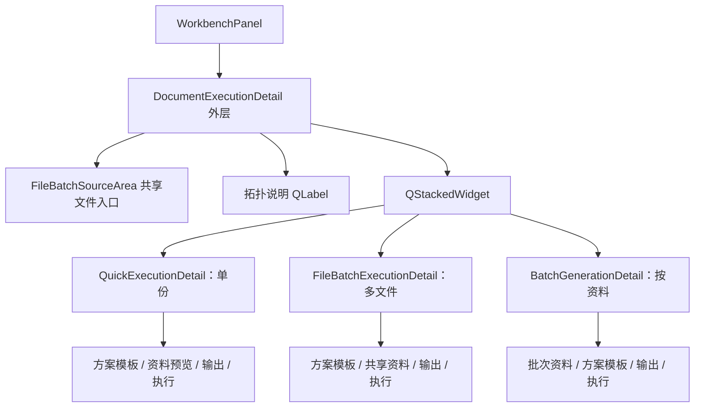

# 文档执行与成套交付页面重构深度分析

日期：2026-07-30

> 实施状态：本文方案已执行。落地边界、兼容门面和回归范围见
> `docs/refactor-records/文档执行与成套交付共享工作区重构落地记录_2026-07-30.md`。
状态：已实施并通过定向回归与发布聚合门禁
范围：工作台「文档执行」与「成套交付」的页面结构、状态所有权、共享组件和后续重构顺序

## 1. 核心结论

当前产品方向已经基本正确：工作台固定保留「文档执行」和「成套交付」两个入口，用户不再手工选择“单份 / 多文件 / 按资料”，系统根据输入静默识别任务形态。

现在需要解决的核心问题不是颜色、圆角或再删几句说明文字，而是：

> 「文档执行」在产品上已经合并为一个入口，但在实现上仍是三个完整旧页面被一个外层容器切换。

这导致以下后果：

1. 文件来源、方案模板、资料、输出目录和执行反馈存在多份 UI 与多份状态。
2. 外层识别任务形态，内层页面又各自判断是否可执行，容易出现状态漂移。
3. 单份、多文件、按资料之间切换时，卡片数量、执行区结构和状态用语明显变化。
4. `WorkbenchPanel` 需要把同一方案、模板和资料状态广播给三个页面，并处理三套信号。
5. 后续继续做“局部统一”会增加兼容代码，不能从根本上降低维护成本。

合理的目标结构应是：

- **一个文档执行工作区**
- **一个权威输入快照**
- **一个方案与模板选择区**
- **一个输出区**
- **一个执行与结果区**
- 单份、多文件、按资料仅作为中间“任务上下文”的不同投影

「成套交付」不应并入文档执行，因为它生成的是一个资料包对应的异构产物集合，而不是同一文档处理任务的数量变化。但两者应复用底层的路径选择、预检提示、执行状态栏和结果日志等表现组件。

## 2. 当前基线与已经出现的偏移

### 2.1 产品入口已经收敛

当前工作台固定入口为：

1. 文档执行
2. 成套交付

这一区分是合理的：

| 入口 | 核心对象 | 输出性质 |
|---|---|---|
| 文档执行 | 文档、方案、模板、当前资料或多条资料 | 同一种文档处理任务的一份或多份结果 |
| 成套交付 | 资料包、交付套件、产物映射 | Word、Excel 等多类产物组成的交付目录 |

不能因为二者都支持批量输出，就把成套交付再次塞回文档执行。

### 2.2 旧落地记录与当前实现已经不完全一致

既有的《文档执行统一入口落地记录》写明“增加单份 / 多文件 / 按资料分段选择”，但当前实现与测试已经明确取消手工模式控件：

- `DocumentExecutionDetail` 根据文档数量和资料记录数量自动确定形态；
- 测试明确断言不存在 `_mode_control`；
- 用户拖入单文件、多文件或文件夹后，系统静默切换；
- 多文档与多资料同时存在时进入 `mapping_required`，不会做笛卡尔积。

因此，本记录在 UI 与交互层面覆盖旧记录的“分段选择”描述。后续文档应统一使用“静默识别任务拓扑”，避免开发时又恢复模式标签。

### 2.3 当前实现仍由三个完整页面组成

当前结构可概括为：



值得注意的实现事实：

- `FileBatchSourceArea` 先由 `FileBatchExecutionDetail` 创建，再通过 `take_source_area()` 被外层容器取走和重新挂载；
- 单份、多文件、按资料分别保存 `_execution_running`、`_actions_enabled`、`_last_result_status` 等执行反馈状态；
- 三个页面分别维护方案、模板、资料上下文和输出目录；
- `WorkbenchPanel` 需要向三个页面同步相同的场景、模板、资料和工作模式；
- 三个页面合计约 3550 行、197 个实例方法，还不包含外层路由和执行控制器。

这些数据不意味着文件必须机械合并，而是说明当前“一个入口”仍没有形成“一个页面状态模型”。

## 3. 当前页面设计审计

本轮对空态、双文件态和三条资料态进行了本地离屏渲染对照。视觉皮肤已经大体统一，但信息结构仍有明显差异。

### 3.1 已经做对的部分

1. 顶部重复的“文档执行”标题已删除，导航卡已经足以说明当前页面。
2. 空态下“等待文档或批次资料”不再单独占一行。
3. 文件或文件夹共用一个拖放入口，符合静默识别的产品定义。
4. 多文档与多资料同时出现时明确阻断，不按顺序猜测映射。
5. 三种模式都开始使用相同的 Card、主题色和方案模板选择语言。

这些部分应保留，不应在重构中退回手工模式选择。

### 3.2 独立拓扑说明行仍显得游离

当前拓扑摘要位于输入区和内容卡片之间，例如：

- 单份执行：1 份文档 → 预计生成 1 份
- 多文档执行：2 份文档共享当前资料 → 预计生成 2 份
- 按资料批量：1 份底稿 × 3 条记录 → 预计生成 3 份

这些信息本身有价值，但使用一个无容器的独立文本行会产生两个问题：

1. 它在视觉上既不属于输入区，也不属于后续预检。
2. 导航卡副标题也会展示相同拓扑，形成重复。

建议取消独立拓扑行，将拓扑压缩为输入卡中的状态徽标或次级摘要：

- `单份 · 预计 1 份`
- `多文件 · 2 个输入 / 2 个输出`
- `按资料 · 3 条记录 / 3 个输出`
- 阻断时才使用完整 InlineAlert 解释为什么需要映射

### 3.3 “按资料”实际上有两类来源，当前展示容易混淆

按资料模式可能同时涉及：

1. 共用源文档；
2. 资料包中的多条记录。

当前外层先展示文档拖放区，内层再展示批次资料摘要。这两块都使用相似的大型来源卡，用户容易把它们理解成重复输入。

更重要的是，部分正式公文场景可以由资料表直接生成，并不要求源文档。当前拓扑解析只看“文档数量”和“资料记录数量”，不知道当前方案的源文档要求，因此可能出现：

- 页面仍突出显示文档拖放入口；
- 摘要显示“待确认共用底稿”；
- 实际执行规则却允许无底稿生成。

这是比文案更重要的基线偏移。任务拓扑不能只由数量决定，还必须包含：

```text
source_requirement = required | optional | generated
```

建议：

- `required`：显示“共用底稿”，未选择时阻断；
- `optional`：显示可选底稿，不作为主阻断；
- `generated`：折叠文档入口，明确显示“由方案直接生成，无需底稿”；
- 资料记录始终作为按资料模式的主输入。

### 3.4 方案与模板被实现了三遍

单份、多文件和按资料都有自己的方案、模板选择控件，并各自发出 `binding_changed`。外层再把变化同步回其他页面。

从用户视角看，方案和模板属于“本次文档执行”，不属于某一种数量模式。用户从一个文件变成两个文件时，不应该感知到方案控件被换成另一套实例。

目标应是：

- 方案和模板只存在一组控件；
- 当前绑定由工作台权威状态提供；
- 改变绑定后，任务拓扑重新预检；
- 模式切换不销毁、不复制、不反向同步绑定状态。

### 3.5 资料区缺少统一的语义层级

三种模式分别使用：

- 单份：完整的资料包内容预览、缺口与自由字段；
- 多文件：一行“共享资料”摘要；
- 按资料：批次资料来源卡。

差异本身合理，但不应该让三个页面分别发明表现形式。

建议统一为“任务资料”区域，并按任务形态投影：

| 任务形态 | 资料区内容 |
|---|---|
| 单份 | 当前资料摘要、缺口、自由字段或时间流 |
| 多文件 | 当前资料摘要，并明确“将共享应用到 N 个文档” |
| 按资料 | 记录数量、来源、可执行/阻断数量和记录处理入口 |

资料为空时，不应放置大段解释。只保留一个可行动的空态，例如“未选择资料”与“前往资料包”。

### 3.6 输出区高度相似，适合真正共享

三种模式都使用“默认 / 自定义”输出方式，但目前各有一套：

- 单份输出一个结果目录；
- 多文件需要为每个源文件建立隔离目录；
- 按资料根据记录建立独立目录。

共同部分应由一个 `OutputLocationCard` 承担，模式差异由只读预览提供：

- 单份：`输出到 <目录>`
- 多文件：`预计 N 个独立目录`
- 按资料：`预计 N 个记录目录`

输出卡只管理“根目录策略”，不管理具体文件命名。具体路径矩阵仍应由各模式的预检模型生成。

### 3.7 执行区是当前最明显的不一致点

当前存在至少三种执行区：

1. 单份：左侧主按钮、中间状态、右侧取消/修复，底部 4px 进度条；
2. 按资料：与单份接近，但拥有批次重试；
3. 多文件：状态在左、执行按钮在右，进度条另起一行，标题为“执行与结果”。

状态词也没有完全统一：

- `partial_success` 在部分页面显示“已完成”；
- 部分页面显示“需查看”；
- 成套交付已经改为“部分完成 / warning”；
- `cancelled` 有时被归入“需处理”。

应提取一个共享的 `WorkbenchExecutionFooter`，统一：

- 主操作按钮位置和尺寸；
- 状态文字与颜色；
- 4px 进度条；
- 取消按钮；
- 可选的失败项重试；
- 可展开日志；
- 结果文件回执。

统一状态语义：

| 状态 | 文案 | 视觉语义 |
|---|---|---|
| idle + 缺输入 | 不额外显示，输入区已经说明 | neutral |
| ready | 可生成 | success |
| ready_with_warning | 可生成，存在提示 | warning |
| confirmation_required | 确认后生成 | warning |
| running | 正在生成 | info |
| success | 已完成 | success |
| partial_success | 部分完成 | warning |
| failed | 需处理 | error / warning |
| cancelled | 已取消 | neutral |

空态下不应在执行按钮旁再次重复“请选择文档”。只有警告、阻断、确认、运行进度和结果才需要独立状态文本。

## 4. 根本架构问题

### 4.1 共享来源控件的所有权方向反了

`FileBatchExecutionDetail` 创建 `_source_area`，随后外层调用 `take_source_area()` 将其取走。这种“子页面先拥有、父页面再夺取”的方式会带来：

- 父子生命周期难以判断；
- 源控件语义被错误绑定到“多文件页面”；
- 后续懒加载多文件页面时无法先创建公共输入；
- 测试需要了解内部重挂载行为。

正确方向应是：

> 文档执行工作区创建并拥有公共输入区，再将不可变输入快照传给任务适配器。

### 4.2 拓扑模型只包含数量，不包含执行要求

当前 `DocumentExecutionTopology` 包含：

- `kind`
- `document_count`
- `record_count`
- `expected_output_count`
- `summary`
- `blocking_reason`

它足以处理简单数量分支，但不足以表达：

- 当前方案是否要求源文档；
- 输入格式是否符合当前方案；
- 多条记录中有多少可执行、多少阻断；
- 输出是否存在命名冲突；
- 是否需要用户确认；
- 当前拓扑为什么选择某一种执行适配器。

建议将“任务形态”和“执行准备度”分开：

```text
DocumentExecutionTopology
  - kind
  - source_requirement
  - document_count
  - record_count
  - expected_output_count
  - mapping_state

DocumentExecutionReadiness
  - state
  - blocking_reasons
  - warning_reasons
  - confirmation_key
```

### 4.3 同一状态被多个 QWidget 保存

当前方案、模板、资料上下文、运行状态和结果状态同时存在于：

- Bridge；
- `WorkbenchPanel`；
- QuickExecutionDetail；
- FileBatchExecutionDetail；
- BatchGenerationDetail；
- 各执行 Controller。

这使得 `WorkbenchPanel` 中出现大量“把 A 页面状态同步给 B 页面，再回写 Bridge”的代码。

重构后应遵循：

1. Bridge / Workspace State 是权威业务状态；
2. QWidget 只持有显示所需的轻量 presentation；
3. 用户操作产生 command；
4. coordinator 更新状态并重新投影；
5. 不再通过三个页面互相同步来保持一致。

### 4.4 工作台面板承担过多路由细节

`WorkbenchPanel` 当前既是组合根，又直接处理：

- 三套页面信号；
- 三种执行启动；
- 方案模板同步；
- 资料上下文同步；
- 文档路径同步；
- 对象预检确认；
- 批次失败重试。

产品尚未正式发布，适合在此阶段把这些职责收口为一个 `DocumentExecutionCoordinator`。`WorkbenchPanel` 最终只负责：

- 创建工作区与 coordinator；
- 连接 Bridge；
- 注册导航页面；
- 将执行结果交给统一反馈组件。

## 5. 重新定义“文档执行”

建议使用以下稳定定义：

> 文档执行是：在一个确定的方案、模板、资料上下文和输出策略下，对一个已解析的文档任务拓扑执行一次可预检、可取消、可追踪的生成任务。

任务形态不是用户手工选择的模式，而是输入关系的结果：

| 形态 | 关系 | 行为 |
|---|---|---|
| single | 1 个文档，至多 1 条当前资料 | 生成 1 份 |
| files | N 个文档，至多 1 份共享资料 | 独立处理并生成 N 份 |
| records | 至多 1 个共用底稿，N 条资料记录 | 按记录生成 N 份 |
| mapping_required | N 个文档与 N 条资料同时存在 | 阻断，等待显式映射 |

该定义还必须结合 `source_requirement`：

- 方案可直接生成文档时，records 可以是 `0 个底稿 × N 条记录`；
- 方案必须处理已有文档时，records 必须是 `1 个底稿 × N 条记录`；
- files 始终要求至少两个可读取文档；
- mapping_required 不允许静默按顺序或笛卡尔积配对。

## 6. 目标页面结构

推荐页面骨架：

```text
文档执行工作区（不重复显示页面标题）
│
├─ 输入来源
│  ├─ 拖入文件 / 文件夹
│  ├─ 当前资料记录摘要（仅按资料时）
│  └─ 紧凑拓扑徽标：单份 / 多文件 / 按资料 / 需映射
│
├─ 处理方案与模板（全模式共享、唯一实例）
│
├─ 任务资料与预检（模式上下文插槽）
│  ├─ 单份：范围、资料预览、自由字段
│  ├─ 多文件：文件清单、共享资料、逐文件阻断
│  └─ 按资料：记录清单、可执行/阻断、共用底稿要求
│
├─ 输出目录（全模式共享、模式化路径预览）
│
└─ 执行输出（全模式共享）
   ├─ 主操作
   ├─ 状态 / 确认 / 取消
   ├─ 进度
   ├─ 失败项重试（按能力显示）
   └─ 结果回执 / 日志
```

### 6.1 页面文案保留规则

后续删减说明文字时，应按以下规则处理：

1. 导航已经说明页面名称时，不再显示同名页标题。
2. 卡片标题已经说明功能时，不再添加同义描述。
3. 格式、数量上限、文件夹递归等不可见规则，应在输入区保留一条短提示。
4. “等待、尚未、请选择”等中性空态不在多个位置重复。
5. 数量、输出关系、风险和阻断属于决策信息，必须保留。
6. 错误和警告必须靠近可修复操作，不能只放在按钮 Tooltip。
7. 技术日志默认折叠，结果回执优先展示。

### 6.2 模式切换时保持稳定的部分

以下区域不应因为 1 个文件变成 2 个文件而重新创建或明显跳动：

- 输入卡外框；
- 方案与模板卡；
- 输出目录卡；
- 执行栏；
- 页面左右边距与卡片间距。

只允许“任务资料与预检”区域根据拓扑变化。

## 7. 建议的目标代码结构

不建议直接把三个大文件合成一个更大的 QWidget。目标应是“共享状态 + 共享骨架 + 小型模式适配器”。

### 7.1 权威状态

新增不可变或克隆隔离的工作区快照：

```text
DocumentExecutionSnapshot
  - input_manifest
  - material_selection
  - material_context
  - scene_binding
  - template_binding
  - source_requirement
  - output_policy
  - execution_state
```

其中 `MaterialBatchSelection` 等现有可变对象必须在进入快照时 clone，不能由多个 QWidget 共享可变引用。

### 7.2 纯投影

由纯函数生成：

```text
resolve_topology(snapshot) -> DocumentExecutionTopology
inspect_readiness(snapshot, topology) -> DocumentExecutionReadiness
present_workspace(snapshot, topology, readiness) -> DocumentExecutionPresentation
```

UI 不再从标签文本反推状态。

### 7.3 模式适配器

三种模式只负责差异：

```text
SingleDocumentAdapter
FileBatchAdapter
RecordBatchAdapter
```

每个适配器负责：

- 该形态特有的预检；
- 中间上下文区的 presentation；
- 构建执行 request；
- 失败项重试能力声明。

它们不再拥有方案模板控件、输出卡和执行反馈控件。

### 7.4 共享表现组件

建议优先提取三个组件，避免一次拆得过碎：

1. `ExecutionBindingCard`
2. `OutputLocationCard`
3. `WorkbenchExecutionFooter`

暂不建议把所有 Label、Badge、空态都抽象成新组件。已经存在的 `Card`、`InlineAlert`、`Badge`、按钮尺寸和主题系统应继续复用。

## 8. 成套交付如何与新基线对齐

成套交付应保持独立页面和独立运行计划，但接受以下统一：

### 可以共享

- 路径选择与拖放反馈；
- 输出根目录选择；
- 执行按钮、状态、进度、取消、重试和日志；
- `success / partial_success / failed / cancelled` 状态语义；
- 预检提示的 InlineAlert 和指标 Badge；
- 工作台卡片边距、字号和动态文案规则。

### 不应共享

- 文档执行的数量拓扑；
- 文档方案与模板选择器；
- 文档处理范围确认；
- 资料包记录到异构产物的映射表；
- 交付套件的 package/group/record emit scope。

### 成套交付页面仍需后续精简

当前成套交付顶部仍有“成套交付”页标题和一行独立拓扑摘要。与文档执行的新基线一致后，建议：

1. 删除重复页标题；
2. 将拓扑数量移入“输出与预检”的指标区域；
3. 删除重复卡片标题的静态说明；
4. 保留资料包基准、可执行/阻断数量、跳过产物和输出矩阵；
5. 使用共享 `WorkbenchExecutionFooter` 替换页面私有执行栏。

## 9. 分阶段执行方案

不建议一次性重写全部流程。应保持每一阶段都可运行、可回归。

### 阶段 0：冻结行为合同

目标：先固定现有正确行为，不改 UI。

补充测试：

- 0 / 1 / N 文档与 0 / 1 / N 资料的完整拓扑矩阵；
- `source_requirement` 为 required / optional / generated 的行为；
- 切换拓扑后方案模板和输出策略不变；
- partial_success、cancelled 等状态语义一致；
- 无源文档公文批次不会被错误提示“等待底稿”。

退出条件：新测试能够指出当前数量模型的不足，但不破坏现有生产执行测试。

### 阶段 1：统一表现组件

目标：不改执行请求，只统一 UI。

执行：

1. 从单份执行区提取 `WorkbenchExecutionFooter`；
2. 让多文件、按资料、成套交付依次接入；
3. 提取统一的输出卡；
4. 统一状态词、按钮位置、进度条、日志和结果回执。

退出条件：四个页面的执行区几何和状态语义测试一致。

### 阶段 2：建立文档执行权威快照

目标：停止三个 QWidget 之间的状态广播。

执行：

1. 新建 `DocumentExecutionSnapshot`；
2. 外层工作区拥有输入 manifest 和资料选择；
3. 方案模板只保留一组控件；
4. Bridge 更新先进入 snapshot，再投影到当前页面；
5. 保留旧详情 API 作为短期 facade，降低迁移风险。

退出条件：切换模式不再调用三套 `set_scene_context()` 和 `set_strategy_context()`。

### 阶段 3：重组页面骨架

目标：一个页面，只替换中间上下文。

执行：

1. 外层创建输入、绑定、输出和执行区；
2. QuickExecutionDetail 缩减为单份特有的范围、资料与预检内容；
3. FileBatchExecutionDetail 缩减为文件清单与逐文件预检；
4. BatchGenerationDetail 缩减为资料记录与批次预检；
5. 删除 `take_source_area()`。

退出条件：三种形态使用同一套绑定、输出和执行控件实例。

### 阶段 4：统一执行调度

目标：`WorkbenchPanel` 不再直接维护三套启动函数。

执行：

1. 引入 `DocumentExecutionCoordinator`；
2. 根据 topology 选择 adapter；
3. adapter 构建 single / file batch / record batch request；
4. coordinator 统一处理确认、取消、结果和导航刷新；
5. 将失败项重试作为 adapter capability，而不是页面私有逻辑。

退出条件：`WorkbenchPanel` 只负责组合和 Bridge 连接，不包含模式特有执行分支。

### 阶段 5：成套交付表现层对齐

目标：共享表现，不合并领域。

执行：

1. 接入共享执行 Footer；
2. 删除重复标题和静态说明；
3. 保留成套预检表和资料包记录列表；
4. 对齐部分可执行、部分完成和取消状态。

退出条件：两个一级入口视觉语言一致，但业务模型和运行计划仍然独立。

### 阶段 6：启动与生命周期优化

目标：减少初始构建成本和隐藏页面状态。

执行：

1. 工作台默认只创建共享骨架与单份上下文；
2. 多文件、按资料上下文首次命中时再创建；
3. 新建上下文从 snapshot 一次性 hydrate；
4. 不再为了公共输入区而提前创建多文件完整页面。

退出条件：默认进入工作台时不实例化按资料和多文件的完整旧页面。

## 10. 预期文件边界

建议新增或重组：

| 文件 | 职责 |
|---|---|
| `document_execution_state.py` | snapshot、topology、readiness、presentation |
| `document_execution_workspace.py` | 唯一页面骨架与模式上下文插槽 |
| `document_execution_coordinator.py` | 拓扑选择、确认、执行调度与结果 |
| `execution_binding_card.py` | 唯一方案与模板控件 |
| `output_location_card.py` | 唯一输出根目录策略 |
| `workbench_execution_footer.py` | 统一执行、状态、取消、重试、日志和回执 |

现有文件的目标变化：

| 文件 | 目标 |
|---|---|
| `quick_execution_detail.py` | 只保留单份特有内容，继续拆分过大的资料与考试题源区域 |
| `file_batch_execution_detail.py` | 只保留多文件清单和逐文件预检 |
| `batch_generation_detail.py` | 只保留按资料记录与批次预检 |
| `panel_v2.py` | 回归组合根，不再负责三套状态同步 |
| `material_suite_generation_detail.py` | 保留领域页面，接入共享表现组件 |

文件名不是强制要求，职责边界才是验收重点。

## 11. 验收标准

### 11.1 产品与交互

1. 工作台固定入口仍只有“文档执行”和“成套交付”。
2. 不出现单份、多文件、按资料的手工模式开关。
3. 单文件、多文件、文件夹和按资料均由输入静默识别。
4. 多文件与多资料同时存在时继续阻断，不自动配对。
5. 无需底稿的场景不显示“等待底稿”。
6. 页面不重复显示导航标题。
7. 空态不重复“等待 / 请选择”说明。
8. 动态数量、风险、阻断和修复入口始终可见。
9. 模式切换时方案模板、输出策略和执行栏位置稳定。
10. partial_success 统一显示“部分完成 / warning”。

### 11.2 架构

1. 公共输入区由工作区拥有，不再通过 `take_source_area()` 转移。
2. 方案模板只存在一个 QWidget 实例。
3. 输出卡只存在一个 QWidget 实例。
4. 执行 Footer 只存在一个 QWidget 实例。
5. QWidget 不互相同步业务状态。
6. topology 和 readiness 可以脱离 Qt 做纯函数测试。
7. `WorkbenchPanel` 不再包含模式特有的 UI 状态复制逻辑。
8. 成套交付不依赖文档执行 topology。

### 11.3 回归

至少覆盖：

- 文档执行拓扑矩阵；
- 单份真实 DOCX 执行；
- 多文件真实双 DOCX 执行；
- 按资料真实批次执行与失败项重试；
- 无底稿正式公文批次；
- 映射阻断；
- 对象预检确认；
- 取消与部分成功；
- 输出目录隔离；
- 工作台导航副标题和 Badge；
- 成套交付部分可执行和部分完成；
- 主题切换、紧凑窗口与大窗口几何。

## 12. 明确不做的事情

1. 本轮分析不执行代码重构。
2. 不重新增加手工模式选择器。
3. 不实现多文件与多资料的一对一映射编辑器。
4. 不把多文件理解为文档合并。
5. 不把成套交付并入文档执行。
6. 不修改现有文档生产引擎和成套运行计划。
7. 不为了“组件化”拆出大量只有一处调用的小控件。

## 13. 推荐执行顺序

如果后续开始实施，优先级应是：

1. **先修正 source requirement 与 topology 的定义**；
2. **再统一执行 Footer 和状态语义**；
3. **再建立权威 snapshot，停止三页面状态广播**；
4. **最后重组页面骨架和做懒加载**；
5. **成套交付只在共享组件稳定后接入**。

最不推荐的方式是继续在三个旧页面分别删文案、调卡片和复制按钮样式。那会让视觉短期接近，但状态与架构继续分叉。
