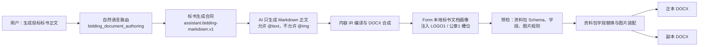
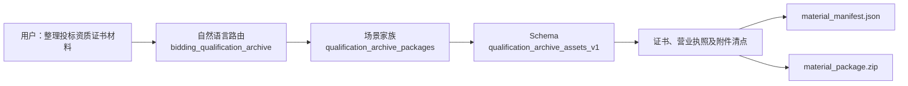

# 标书场景 AI 生成与资料包装配完整性审计

> 日期：2026-07-29  
> 范围：AI 生成标书正文、标书资料包、Logo／公章装配、正副本交付、投标资质附件归档  
> 关联审计：`AI对话窗口Design与Flow样式迁移差异深度审计_2026-07-28.md`

## 1. 最终结论

本轮已把“标书正文生成”和“投标资质归档”从同一个模糊入口拆成两条独立链路，并完成真实产物级验证。

当前可确认：

1. “生成投标标书正文”进入 `bidding_document_authoring`，由 AI 生成可审阅正文，再由 Form 本地装配资料字段、Logo 和公章。
2. “整理投标资质证书材料”进入 `bidding_qualification_archive`，不调用正文生成，直接交付资料清单和附件 ZIP。
3. 标书资料包必须声明 `bid_materials_v1`；资质归档资料包必须声明 `qualification_archive_assets_v1`，两者不再互相冒充。
4. AI 内容编译器仍只接收正文及 `@text`／`@time` Token；`@img` Token 不再由模型输出，而是在 DOCX 边界由 Form 确定性注入。
5. 标书正文中的公司名称、项目名称、法定代表人可由资料包替换，Logo、公章可由资料包图片规则装配。
6. 带有多段扩展 stem 的 AI 生成稿，例如 `draft.bidding.docx`，现在仍会得到合法的 `draft.bidding_original.docx` 与 `draft.bidding_copy.docx`。
7. 资质归档不再错误继承标书正文的 `company_name`、`legal_person`、`logo`、`seal` 必填约束。
8. `AssistantPanel` 的 Provider 选择职责已抽到独立协调器，方法数从 96 收敛到项目门禁要求的 92，没有通过放宽预算掩盖结构问题。

因此，标书相关链路已从“UI 有入口、底层局部可用”提升为“路由、计划、资料合同、内容编译、本地装配、交付和阻断可相互证明”的闭环。

## 2. 最终链路

资质附件归档使用另一条链：

两条链共享 Form 的执行框架，但不共享生成合同、资料 Schema 或交付预设。

## 3. 本轮确认并修复的真实断点

### 3.1 标书正文与资质归档混成一条路由

原问题：

- “标书”“投标文件”“资质证书材料”都可能落到资质归档；
- 用户要求生成标书正文时，系统可能不启动正文生成；
- 资质归档与标书正副本的交付语义不一致。

修复：

- 新增 `bidding_document_authoring`；
- `bidding_qualification_archive` 只保留资质、证照、附件包相关词；
- “证书材料”仍保留与批量套打证书之间的歧义确认；
- 通用词“生成”“起草”“排版”不再单独触发标书路由，避免“生成一份项目报告”误入 bidding。

### 3.2 AI 直接输出 `@img`，违反内容编译边界

原问题：

- 标书 Prompt 要求模型输出 `{{@img:LOGO1}}` 和 `{{@img:公章1}}`；
- 内容 IR 明确只允许 `@text` 和 `@time` 内联 Token；
- 结果会被 `recursive_content_token` 正确阻断。

本轮没有放宽内容编译器，而是修正职责：

| 层级 | 允许内容 | 禁止内容 |
| --- | --- | --- |
| AI Markdown | 标题、正文、列表、表格、`@text` | `@img`、OOXML、DOCX、base64 |
| 内容 IR | 正文语义、文本字段 Token | 资料图片规则 |
| Form DOCX 画像 | `LOGO1`、`公章1` 槽位 | 模型自由决定资料绑定 |
| 生产装配 | 资料包字段、图片、交付版本 | 修改不可变 AI 源稿 |

这种分层保证模型无法越过资料授权边界，也避免给通用编译器增加标书特例。

### 3.3 当前标书资料包声明了错误 Schema

原问题：

- `config_library/material_packages/bidding/user/未命名资料包/package.json` 声明 `official_document_v1`；
- 标书场景实际要求 `bid_materials_v1`；
- UI 显示“已选资料包”，但执行合同并不匹配。

修复：

- 当前资料包迁移为 `bid_materials_v1`；
- 字段作用域迁移为标书字段；
- 新建资料包会继承当前场景主 Schema；
- Workbench 会显示“资料包类型不匹配”，修复动作是更换资料包；
- Assistant 快照现在携带 `material_schema_ids`，不会只凭“3 个字段、2 个附件”误判资料包可用。

### 3.4 资质归档错误继承标书正文必填项

原问题：

- 从 bidding 基础场景投影 `qualification_archive_packages` 时，Schema 被追加而不是替换；
- 最终清单同时要求：
  - `organization`、`package_name`；
  - `company_name`、`project_name`、`legal_person`；
  - `certificate`、`business_license`；
  - `logo`、`seal`。
- 证书和营业执照齐全时，ZIP 能产出，但回执仍为 `incomplete`。

修复：

- 资质归档家族把 Schema 集合替换为 `qualification_archive_assets_v1`；
- 清空基础 bidding 的附加必填字段和图片角色；
- 删除 bidding 的 `original`、`copy` 交付预设；
- 最终只保留：
  - `attachment_package`；
  - `missing_items_report`；
  - `archive_manifest`。

### 3.5 AI 生成稿的带点号 stem 丢失 `.docx`

原问题：

- AI 标书文档画像输出 `draft.bidding.docx`；
- `{stem}_{preset_id}` 生成 `draft.bidding_original`；
- 旧 `_ensure_suffix` 把 `.bidding_original` 当成已有扩展名；
- 资料装配预检报错：`every final output must be a DOCX file`。

修复：

- 输出规划器不再判断“是否存在任意 suffix”，而是判断“是否已经是期望的 `.docx`”；
- 非 `.docx` 结尾统一追加 `.docx`；
- 新增 dotted-stem 回归测试。

### 3.6 有图片 Token，但资料包没有可执行图片规则

原问题：

- 仅有 `AssetItem(role=logo)` 并不能证明它绑定 `{{@img:LOGO1}}`；
- 旧链可能直到图片模块才发现无法装配。

修复：

- 执行预检扫描 DOCX 中的严格 `@img` Token；
- 与 `image_material_rules` 及兼容的 legacy image rules 比对；
- 未声明规则时产生 `preflight_image_rule_missing`；
- 在 `failure_policy=block` 下阻止执行，不再静默丢图。

## 4. 场景完整性矩阵

| 用户场景 | 路由 | 输入要求 | 交付 | 当前结果 |
| --- | --- | --- | --- | --- |
| 生成投标标书正文 | `bidding_document_authoring` | 标书资料包；3 个核心字段；Logo、公章 | 正本、同源副本 | 已闭环 |
| 根据参考 DOCX 起草标书 | `bidding_document_authoring` | 参考材料授权 + 标书资料包 | 正本、同源副本 | 已闭环 |
| 整理投标资质证书材料 | `bidding_qualification_archive` | 输入索引 DOCX + 资质归档资料包 | 清单 + ZIP | 已闭环 |
| 只说“证书材料” | 歧义 | 需确认资质归档或批量套打 | 确认后进入对应链 | 已阻断歧义 |
| 资料包类型错误 | 标书路由 | 当前包不是 `bid_materials_v1` | 不允许最终装配 | 已阻断 |
| 资料字段不全 | 标书路由 | 缺公司／项目／法人 | 不允许最终装配 | 已提示 |
| 图片文件存在但规则缺失 | 标书路由 | 缺 Token→角色规则 | 不允许执行 | 已阻断 |
| 无 Logo／公章 | 标书路由 | 缺资产 | 不允许最终装配 | 已提示 |
| 资质附件缺证书或执照 | 资质归档 | 缺必填附件角色 | 生成缺项证据，不冒充完整包 | 已分层 |

## 5. 当前资料包名称的来源

资料包名称不是由 AI 临时生成：

1. `archive_name`／`package_id` 来自持久化资料包；
2. 当前标书用户资料包位于 `config_library/material_packages/bidding/user/未命名资料包/package.json`；
3. Profile 名称来自该资料包的 `profiles[].profile_name`；
4. Assistant 只读取当前 `MaterialExecutionContext` 的 `package_id`、`profile_id` 和 Schema 摘要；
5. AI 不得改名、创建或替换资料包；
6. 输出文件名来自交付预设，而不是资料包名称的自由拼接。

因此，资料卡片展示的主名称应使用 `archive_name`，副信息使用 Profile 名称和 Schema 状态；AI 对话中只引用这个已持久化身份。

## 6. 未宣称具备的能力

以下内容仍是明确边界，不应在 UI 中写成“已自动完成”：

- 不验证营业执照或资质证书真伪；
- 不判断资质是否满足某次招标的法律或行业要求；
- 不自动作出投标报价、法律承诺或商务策略；
- 不在用户未授权时把本地资料发送给云端模型；
- 不允许模型直接绑定本地图片、附件或输出目录；
- 不保证第三方 Office/WPS 在所有机器上的分页完全一致，严格图片布局仍受本机 Office 能力门禁约束。

## 7. 防止继续堆补丁的结构约束

本轮保留以下单一事实源：

| 事实 | 唯一所有者 |
| --- | --- |
| 自然语言场景归属 | `scene_natural_request_router.py` |
| Assistant 生成／生产／交付合同 | `capability_registry.py` |
| AI 内容编译 | `content_generation_adapter.py` |
| 标书本地 DOCX 画像 | `content_generation_adapter.py` 的显式 profile |
| 资料 Schema | `material_schema_registry.py` + 资料包声明 |
| 家族投影 | `scene_family_application.py` |
| 资料预检 | `material_preflight.py`／Workbench issue adapter |
| 图片装配 | transactional material assembly |
| Provider UI 同步 | `ProviderSelectionCoordinator` |
| 输出文件名 | `pipeline.runner` |

禁止继续采用：

- 在 `AssistantPanel` 内新增标书专用分支；
- 让 AI 输出本地路径、`@img` 或附件 Token；
- 只按资料数量判断 Schema 是否匹配；
- 资质归档和标书正文共用一组必填字段；
- 在 UI 文案层伪造“完整”状态；
- 为通过测试直接提高 UI 协调器方法预算。

## 8. 验证证据

已通过的验证包括：

- Assistant capability pipeline：31 个场景测试全部到达 `PASSED`；
- Assistant plan／production／content／form tools：19 个测试通过；
- Pipeline staging、output semantics、output safety：60 个测试通过；
- Workbench execution center：85 个测试通过；
- Scene family 与自然语言路由：33 个测试通过；
- 标书资料包 Schema 继承：1 个定向测试通过；
- 未声明图片规则阻断：1 个定向测试通过；
- AI 文档集成结构门禁：5 个测试通过；
- Assistant Provider／UI 定向回归：相关失败用例与偏好设置回归通过；
- Python `compileall`：本轮涉及模块通过；
- `git diff --check`：本轮文件无新增空白错误。

产物级验证确认：

1. 标书 AI 稿包含 3 个文本 Token；
2. 本地画像写入 `LOGO1` 和 `公章1`；
3. 资料包字段被替换为实际值；
4. 两个图片 Token 被消费；
5. 输出 DOCX 中不存在残留 `{{@text:...}}` 或 `{{@img:...}}`；
6. 正本与副本均生成；
7. 资质归档 ZIP 包含证书、营业执照和 `manifest/material_manifest.json`；
8. 资质归档回执状态为 `complete`。

全局 Scene Matrix release gate 在本机运行到文档夹具阶段时，测试进程被外部 Office／子进程生命周期直接终止，未返回可归因的 Python 断言结果。因此本审计不把它写成“通过”，也不把它误报成业务链失败；本轮相关的高频词典报告自身为 `passed`，计数已更新为 30 个任务、32 个短语、36 个请求样本。

## 9. 最终判定

标书资料包不再只是一个“显示已选择”的壳，而是同时参与：

- 路由决策；
- Assistant 计划阻断；
- Schema 兼容判断；
- AI 文本字段生成；
- 本地图片槽位注入；
- 字段与图片装配；
- 正副本交付；
- 资料清单与附件包交付；
- 回执完整性判定。

在上述范围内，本轮链路可判定为功能闭环。后续若继续扩展报价清单、联合体多主体签章或章节级资料引用，应新增明确 Schema／生成合同／交付合同，不应在当前标书路由上继续追加条件分支。
