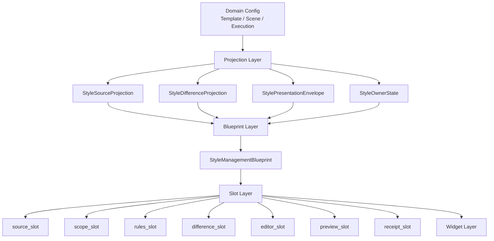

# 样式控件与模板管理一致性复用深度规划

日期：2026-06-29

## 1. 本轮结论

当前已经不是“没有共享控件”的阶段。项目里已经有：

- `StyleManagementBlock`
- `StyleManagementContentPlan`
- `StyleRuleControlDeck`
- `StyleDifferenceSummarySlot`
- `StyleSourceCompactRow`
- `StylePresentationEnvelope`
- `StyleReceiptSlotFrame`
- `ParagraphStyleEditor` / `StyleControlSurface`

但用户仍会觉得“不像模板管理”“不说人话”“功能分布不清楚”，根因是：

```text
共享已经推进到控件层和局部 slot 层，
但还没有推进到页面蓝图层、信息架构层和统一文案治理层。
```

也就是说，现在很多地方“用了同一个控件”，但并没有保证：

1. 同一个样式概念在模板管理、场景配置、Workbench 中出现于同一层级。
2. 同一个样式状态使用同一套人能理解的词。
3. 同一个内容计划真正对应实际 slot，而不是只作为 Qt 属性存在。
4. 页面主界面只展示用户决策信息，技术 key、审计计数和长边界说明下沉到详情或报告。

本轮的核心判断：

```text
下一步不能继续只抽小控件。
必须把“模板管理的成熟阅读结构”提升成 Style Management Page Blueprint，
让模板、场景、执行前复核、执行后回执都选择同一套板块组合。
```

## 2. 代码现状复盘

### 2.1 模板管理当前结构

相关文件：

- `src/ui/panels/template_panel.py`
- `src/ui/panels/template_style_detail.py`
- `src/ui/panels/template_style_preview.py`
- `src/ui/panels/template_format.py`

模板管理已经有较稳定的信息顺序：

```text
当前模板
-> 参数概览
-> 样式预览
-> 具体参数编辑
```

模板概览页已经接入：

- `StyleSourceCompactRow`
- `TemplateStylePreview`
- `StyleManagementBlock(mode="template_overview_preview", preview_slot=...)`

模板正文详情页已经接入：

```python
StyleManagementBlock(
    ...,
    mode="template_baseline_edit",
)
```

优点：

- 模板管理的用户心智清晰：先选模板，再看它定义了什么，最后编辑基线。
- `TemplateStylePreview` 已经通过 `StylePresentationEnvelope.from_template_page(...)` 统一预览语义。
- `StyleDetail` 已经复用 `StyleManagementBlock` 和 `ParagraphStyleEditor`，没有再单独造一套正文样式控件。

不足：

- `template_baseline_edit` 的 `StyleManagementContentPlan` 声明为 `source|scope|editor`，但 `StyleManagementBlock` 当前没有正式的 `source_slot` 和 `scope_slot`。
- 模板概览中的 `StyleSourceCompactRow` 是放在 selector card 里，而不是作为 `StyleManagementBlock` 的 source 板块进入统一蓝图。
- 模板详情页虽然说自己有 source/scope，但实际展示主要是 summary + editor，这会让 content plan 停留在“属性说明”，不是完整页面契约。

结论：

```text
模板管理是目前最像产品的地方，但它自身还没有完全蓝图化。
后续不能只让场景去模仿模板页面外观，而要把模板页面的结构抽象成可复用蓝图。
```

### 2.2 场景分区样式当前结构

相关文件：

- `src/ui/panels/scene_style_override_sections.py`
- `src/ui/panels/scene_panel.py`
- `src/shared/ui/style_rule_control_deck.py`
- `src/shared/ui/style_difference_summary_slot.py`
- `src/config/style_difference_projection.py`

场景分区样式已经接入：

```python
StyleManagementBlock(
    ...,
    mode="scene_section_rules",
    rule_control=self._rule_control_deck,
)
```

`scene_section_rules` 当前内容计划：

```text
source|scope|rules|difference|editor|preview
```

优点：

- `StyleRuleControlDeck` 已经收束“独立样式开关、差异摘要、全部跟随模板、撤销恢复”。
- `StyleDifferenceSummarySlot` 已经把“差异摘要”从普通对比条提升成语义 slot。
- `StyleEditingSection` 继续承接 owner 状态、编辑对象、恢复模板、段落预览和字段表单。
- `scene_panel.py` 已经使用 projection 同步 preview / comparison / owner state。

不足：

- `rules` 和 `difference` 的 slot 已比较清楚，但 `source` / `scope` 仍没有一等 slot。
- `source` 信息有时出现在场景概览或 Workbench，样式编辑块内部没有统一承载。
- `scope` 信息一部分在处理范围，一部分在独立样式开关，一部分在 summary grid，用户难以判断“我改的是哪些分区”。
- `StyleRuleControlDeck` 仍把“规则开关”和“差异摘要”放在同一个 deck 内部，虽然已有 `difference_slot`，但页面蓝图上还没有强制它们分区。

结论：

```text
场景分区样式已经复用了模板管理的控件，但没有完全复用模板管理的阅读秩序。
用户看到的仍像“功能控制台”，而不是“基线 -> 覆盖 -> 差异 -> 预览 -> 编辑”的自然链路。
```

### 2.3 Workbench 执行前当前结构

相关文件：

- `src/ui/panels/workbench/quick_execution_detail.py`
- `src/ui/panels/style_source_projection.py`

Workbench 执行前的“场景与模板”卡目前接入：

```python
StyleSourceCompactRow(
    ...,
    object_name_prefix="wb_style_source",
)
```

数据由：

```python
build_style_source_projection(..., view_mode="execution_review")
```

生成。

优点：

- 执行前已经能看到模板与分区来源。
- `StyleSourceProjection` 已经复用模板/场景来源语义，并携带 `section_differences`。

不足：

- 这部分没有进入 `StyleManagementBlock`，因此没有 `content_plan`、没有统一标题/摘要/slot 秩序。
- `StyleSourceProjection.section_differences` 还没有聚合成用户可读的执行前差异摘要。
- 有独立分区时，用户只能知道“有几个分区独立设置”，很难快速理解“这次到底会和模板差在哪里”。
- Workbench 执行前属于“只读复核”，但当前没有正式使用 `readonly_review` 或新的 `execution_prereview` 模式。

结论：

```text
Workbench 执行前是当前链路最大的断点。
它使用了样式来源行，却没有进入样式管理蓝图。
```

### 2.4 Workbench 执行后当前结构

相关文件：

- `src/ui/panels/workbench/execution_center.py`
- `src/ui/panels/workbench/recent_run_panel.py`
- `src/shared/ui/style_receipt_slot_frame.py`
- `src/shared/ui/style_result_receipt_row.py`

执行中心已经接入：

```python
StyleManagementBlock(
    ...,
    mode="execution_receipt_review",
    receipt_slot=self._style_receipt_slot,
)
```

最近结果面板直接使用：

```python
StyleReceiptSlotFrame(...)
```

优点：

- 执行后样式回执已经有 `receipt` slot。
- `StyleReceiptSlotFrame` 自身设置了 `style_management_content_plan = "receipt"`。
- `StyleResultReceiptRow` 消费 `StylePresentationEnvelope`，文案生成已开始收束。

不足：

- 执行中心进入了 `StyleManagementBlock`，最近结果面板没有进入完整 block，只是使用 receipt frame。
- 执行后回执仍以 summary 为主，缺少“本次是否使用了场景分区差异”的结构化摘要。
- 执行前差异和执行后回执还没有形成同一条证据链。

结论：

```text
执行后比执行前更接近蓝图化，但仍缺少 difference -> receipt 的连续表达。
```

## 3. 最关键的不一致

### 3.1 ContentPlan 没有完全映射到真实 slot

现在 `StyleManagementContentPlan` 已经有：

```text
source / scope / rules / difference / editor / preview / receipt
```

但 `StyleManagementBlock` 当前正式参数只有：

```text
rule_control
preview_slot
receipt_slot
management_widgets legacy
```

缺失：

```text
source_slot
scope_slot
difference_slot 独立入口
```

虽然 `difference` 通过 `StyleRuleControlDeck` 内部间接出现，但从蓝图角度看，它仍然不是 `StyleManagementBlock` 的一等插槽。

这会造成两个问题：

1. content plan 声明了 source/scope，但页面可以不显示或散落显示。
2. 新页面接入时容易继续“临时塞 widget”，而不是按板块复用。

### 3.2 模板管理是页面结构，场景样式是控件组合

模板管理的结构更像：

```text
用户任务页
```

场景样式当前更像：

```text
控件组合区
```

这是体验差距的真正来源。

用户需要的是：

```text
这套样式从哪里来？
影响哪些内容？
哪里偏离模板？
我现在能改什么？
改完长什么样？
执行时实际用了什么？
```

当前场景样式区能回答这些问题，但回答顺序和语言不够稳定。

### 3.3 状态词和动作词仍有分叉

已经集中了一部分词：

- `模板基线`
- `本次使用`
- `样式来源`
- `调分区`
- `当前模板`

但仍有一些展示词分布在不同模块：

- `看模板`
- `编辑正文`
- `全部跟随模板`
- `撤销恢复`
- `独立样式`
- `分区已调整`
- `有独立样式`
- `待比较`

这些词不是错误，但必须由共享 projection/envelope 层统一输出，否则页面越多，语言越容易漂移。

### 3.4 主界面仍夹杂开发者语言

截图和现有记录中暴露过的典型问题：

- `custom_basic`
- `quick_formatting`
- `Green/L5`
- `template 9 / scene 3 / material 1 / output 2`
- `OOXML`
- `registry`
- 过长的英文风险说明
- “手动控制所有功能开关与处理范围”这类泛化说明

这些信息不是没有价值，但不应该出现在主决策界面。

主界面的职责是：

```text
给用户一个能马上判断和行动的结论。
```

技术细节应进入：

- tooltip
- 二级详情
- 审计报告
- 开发者模式
- md/json 证据文件

## 4. 应采用的统一页面蓝图

建议将样式相关页面统一抽象为：

```text
StyleManagementBlueprint
```

它不是一个大而全的新控件，而是一套页面板块契约。

### 4.1 板块定义

| 板块 | 用户问题 | 组件建议 | 主界面文案原则 |
| --- | --- | --- | --- |
| `source` | 样式从哪里来 | `StyleSourceCompactRow` 或升级版 `StyleSourceSlot` | 只说模板、跟随、独立状态 |
| `scope` | 影响哪些内容 | `StyleScopeSummarySlot` | 只说分区数量和名称，不说内部 key |
| `rules` | 如何继承或覆盖模板 | `StyleRuleControlDeck` 的开关部分 | 动作短、状态短 |
| `difference` | 与模板差在哪里 | `StyleDifferenceSummarySlot` | 显示字段差异摘要，详情进 tooltip |
| `editor` | 我能改哪些字段 | `StyleEditingSection` / `StyleControlSurface` | 不重复解释控件用途 |
| `preview` | 最终看起来怎样 | `TemplateStylePreview` / `StylePreview` | 用 envelope 统一标题/来源/摘要 |
| `receipt` | 本次实际用了什么 | `StyleReceiptSlotFrame` | 只读回执，和执行报告可追溯 |

### 4.2 模式映射

| mode | source | scope | rules | difference | editor | preview | receipt | 用途 |
| --- | --- | --- | --- | --- | --- | --- | --- | --- |
| `template_overview_preview` | 是 | 否 | 否 | 否 | 否 | 是 | 否 | 模板概览页，看基线效果 |
| `template_baseline_edit` | 是 | 是 | 否 | 否 | 是 | 可选 | 否 | 模板正文基线编辑 |
| `scene_section_rules` | 是 | 是 | 是 | 是 | 是 | 是 | 否 | 场景分区覆盖编辑 |
| `execution_prereview` | 是 | 是 | 否 | 是 | 否 | 可选 | 否 | Workbench 执行前复核 |
| `execution_receipt_review` | 是 | 是 | 否 | 可选 | 否 | 否 | 是 | Workbench 执行后回执 |
| `readonly_review` | 是 | 是 | 否 | 是 | 否 | 是 | 是 | 后续报告/只读复核 |

需要注意：

```text
当前代码还没有 execution_prereview。
这是建议新增的模式，用于弥合 Workbench 执行前断点。
```

### 4.3 推荐视觉顺序

统一顺序应为：

```text
Header / Summary
-> Source
-> Scope
-> Rules
-> Difference
-> Editor Chrome
-> Preview
-> Editor Fields
-> Receipt
```

但不同模式可以折叠或跳过。

对于用户阅读，更建议的实际顺序是：

```text
模板基线在哪里
-> 当前影响哪些分区
-> 有哪些独立覆盖
-> 与模板差异是什么
-> 当前对象怎么改
-> 预览结果
```

这与模板管理的心智一致：

```text
先理解基线，再理解当前对象，最后编辑和预览。
```

## 5. 功能分布重划

### 5.1 模板管理

职责：

```text
定义稳定文档外观基线。
```

应保留：

- 页面设置
- 正文排版
- 标题编号
- 表格
- 页眉页脚
- 目录
- 参考文献
- 题注
- 模板导入导出

不应承担：

- 场景处理范围
- 执行策略
- 输出版本
- 资料 Schema
- 插件人工门
- 对象预检
- 风险审计长说明

### 5.2 场景配置

职责：

```text
定义业务场景如何使用模板，并声明哪些地方允许覆盖模板。
```

建议重分组：

| 当前感觉 | 建议板块 | 原因 |
| --- | --- | --- |
| 场景概览 | 场景总览 | 只展示选择、成熟度、关键状态，不编辑大量参数 |
| 处理范围 | 范围与结构 | 只放分区、章节、对象范围，不混入样式字段 |
| 功能开关 | 执行能力 | 只放 pipeline 能力开关，不放样式覆盖 |
| 样式相关散落项 | 样式与模板 | 统一承载 source/scope/rules/difference/editor/preview |
| 输出设置 | 交付与输出 | 只放输出路径、交付版本、水印状态等 |

最重要的调整：

```text
样式覆盖不应该被用户理解成“功能开关”。
它应该被理解成“在这个场景中，哪些分区不完全跟随模板”。
```

### 5.3 Workbench

职责：

```text
本次运行前确认、运行中反馈、运行后回执。
```

应分成：

| 阶段 | 样式信息 |
| --- | --- |
| 执行前 | 当前场景使用哪个模板、哪些分区有独立样式、主要差异是什么 |
| 执行中 | 不需要重复样式配置，只保留状态 |
| 执行后 | 本次实际使用的样式来源、是否使用了分区覆盖、报告可追溯 |

Workbench 不应承载完整样式编辑。编辑入口应跳转到：

- 模板管理：改基线
- 场景配置：改分区覆盖

## 6. 需要删除或下沉的冗余文本

### 6.1 主界面禁止项

主界面不应展示：

| 类型 | 示例 | 处理方式 |
| --- | --- | --- |
| 内部 key | `custom_basic`、`quick_formatting` | 转成人话标签，key 进 tooltip |
| 成熟度代号 | `Green/L5` | 显示“可直接使用”，代号进详情 |
| registry 计数 | `template 9 / scene 3 / output 2` | 只在审计页/报告展示 |
| 技术协议词 | `OOXML`、`Schema` | 主界面改为“Word 对象”“资料字段规则” |
| 长边界说明 | 超过两行的风险解释 | 放入“查看详情”或报告 |
| 操作说明句 | “点击各参数行的编辑可跳转” | 改成明确按钮/行内动作 |

### 6.2 主界面保留项

主界面只保留：

- 当前模板名称
- 当前状态：跟随模板 / 独立样式 / 已调整 N 项
- 影响范围：全部分区 / N 个分区 / 具体前两项
- 主要差异：字体、字号、缩进、行距等
- 下一步动作：看模板 / 调分区 / 编辑正文 / 全部跟随模板

### 6.3 文案准则

建议统一成：

```text
结论在前，原因在后。
主界面短句，详情里解释。
用户词优先，技术词下沉。
动作必须是按钮，不用说明句代替按钮。
```

## 7. 复用架构建议

### 7.1 分层模型



当前项目已经有 Projection Layer 和 Widget Layer 的一部分。

缺的是：

```text
Blueprint Layer
```

也就是页面级的强约束。

### 7.2 StyleManagementBlock 应升级的接口

建议逐步补齐：

```python
StyleManagementBlock(
    ...,
    source_slot=...,
    scope_slot=...,
    rule_control=...,
    difference_slot=...,
    preview_slot=...,
    receipt_slot=...,
)
```

并建立规则：

```text
content_plan 中为 True 的板块，必须有明确的 slot 或由 block 自己生成。
```

如果短期不能全部实现，也应至少增加测试：

```text
source/scope 如果还没有真实 slot，不允许把它们当作“已完成”状态。
```

### 7.3 StyleRuleControlDeck 应拆出更清晰的子边界

当前：

```text
StyleRuleControlDeck
-> toggle_list
-> difference_slot
-> restore_all / undo_restore_all
```

建议蓝图层视角改成：

```text
rules_slot:
  override toggles
  batch actions

difference_slot:
  template/current/diff summary
```

实现上可以继续由 `StyleRuleControlDeck` 创建 `difference_slot`，但 `StyleManagementBlock` 应能认识这个 slot，而不是只知道 `rule_control`。

### 7.4 Workbench 执行前需要新增差异摘要聚合

`StyleSourceProjection` 已有：

```text
section_differences
```

但 Workbench 执行前需要的是聚合摘要：

```text
模板基线
当前：3 个分区独立样式
差异：2 个分区有字段调整
详情：参考文献改了行距，题注改了字号等
```

建议新增：

```text
StyleDifferenceSummaryProjection
build_style_difference_summary_projection(...)
```

用途：

- Workbench 执行前差异复核
- 执行后回执中的差异摘要
- Markdown/JSON 报告中的样式差异证据

## 8. 建议的目标页面

### 8.1 模板概览

```text
当前模板
  source: 模板基线 / 文件来源

参数概览
  页面、正文、标题、表格、页眉页脚、目录、参考文献、题注

样式预览
  preview: 页面级预览
```

主界面不显示：

- 内部模板 id
- 配置文件技术路径长串
- 风险长说明

### 8.2 模板正文详情

```text
正文排版
  source: 当前模板作为基线
  scope: 默认正文，供场景分区继承
  editor: 字体 / 字号 / 对齐 / 缩进 / 行距 / 段前段后
  actions: 保存 / 恢复
```

可选增强：

```text
preview: 收起式段落预览
```

但不建议在正文详情页重复塞太多说明文字。

### 8.3 场景样式与模板

```text
分区样式
  source: 使用哪个模板作为基线
  scope: 哪些分区参与处理
  rules: 哪些分区启用独立样式
  difference: 当前分区与模板差异
  editor: 当前分区字段编辑
  preview: 当前分区段落预览
```

关键调整：

```text
“独立样式”不再被表达成一个工程开关，
而是表达成“这个分区是否偏离模板基线”。
```

### 8.4 Workbench 执行前

```text
场景与模板
  source: 本次使用哪个模板
  scope: 本次处理哪些分区
  difference: 如果有独立样式，展示聚合差异
  actions: 看模板 / 调分区
```

不展示：

- 完整编辑器
- 全量规则开关
- 过多审计说明

### 8.5 Workbench 执行后

```text
样式回执
  receipt: 本次实际样式来源
  difference: 可选展示本次实际使用的分区差异摘要
  report link: 详细证据进入报告
```

这样执行前和执行后能闭环：

```text
执行前确认将使用哪些样式
-> 执行后确认实际使用了哪些样式
```

## 9. 实施路线

### P0.1 补齐 StyleManagementBlock 的真实 slot

新增：

- `source_slot`
- `scope_slot`
- `difference_slot`

并约束：

- `content_plan.source=True` 时必须有 source slot 或 block 内建 source。
- `content_plan.scope=True` 时必须有 scope slot 或 block 内建 scope。
- `content_plan.difference=True` 时必须有 difference slot，不能只藏在普通 widget 内。

验收：

- 模板详情、场景分区、Workbench 执行前都能读出真实 slot。
- 测试不只断言 Qt 属性，还断言 widget 层级。

### P0.2 新增 execution_prereview 模式

新增模式：

```text
execution_prereview = source|scope|difference
```

用于：

- Workbench QuickExecutionDetail 的“场景与模板”卡。

它不显示 editor，不显示规则开关，只做执行前复核。

验收：

- 有独立分区时显示差异摘要。
- 无独立分区时不增加空白说明。
- “看模板 / 调分区”动作仍保留。

### P0.3 聚合差异 projection

新增：

- `StyleDifferenceSummaryProjection`
- `build_style_difference_summary_projection(...)`

输入：

- `tuple[StyleDifferenceProjection, ...]`

输出：

- `template_status`
- `current_status`
- `difference_status`
- `detail`
- `variant`

验收：

- 单个分区时沿用原差异。
- 多个分区时聚合成人话摘要。
- 无差异时返回 `None`，页面不显示多余区块。

### P1.1 收束状态词和动作词

建立共享常量或 resolver：

- `open_template = 看模板`
- `edit_body = 编辑正文`
- `adjust_section = 调分区`
- `follow_template = 跟随模板`
- `independent_style = 独立样式`
- `changed_fields = 已调整 N 项`
- `pending_compare = 待比较`

验收：

- UI 类不再各自散写这些词。
- 业务页面只消费 projection/envelope。

### P1.2 主界面文案清理守门

新增测试或静态检查：

- 主界面默认文案不出现裸 key。
- 主界面默认文案不出现 `OOXML`、`registry`、`Green/L5` 等开发者词。
- 卡片内说明超过指定长度时必须进入 tooltip/detail。

### P1.3 视觉一致性截图审计

需要至少保留以下截图：

- 模板概览
- 模板正文详情
- 场景样式与模板
- Workbench 执行前
- Workbench 执行后

审计维度：

- 标题层级是否一致
- slot 顺序是否一致
- 按钮 variant 是否一致
- 文案是否短
- 是否有内部 key 泄漏
- 预览高度和卡片节奏是否稳定

## 10. 测试守门建议

建议新增或扩展：

| 测试 | 目标 |
| --- | --- |
| `test_style_management_blueprint_modes` | 每个 mode 的 slot 组合固定 |
| `test_style_management_block_materializes_content_plan_slots` | content plan 和真实 widget 一致 |
| `test_workbench_prereview_uses_style_management_blueprint` | Workbench 执行前不再裸放 source row |
| `test_style_difference_summary_projection_aggregates_sections` | 多分区差异可读 |
| `test_ui_copy_hides_internal_style_keys` | 主界面不出现内部 key |
| `test_template_scene_workbench_style_terms_are_shared` | 状态词来源一致 |

已有测试应继续保留：

- `tests/test_small_widget_architecture.py`
- `tests/test_scene_panel_architecture.py`
- `tests/test_template_style_preview.py`
- `tests/test_workbench_execution_center.py`
- `tests/test_recent_run_panel.py`
- `tests/test_style_difference_projection.py`

## 11. 最终设计判断

优秀版本不应该让用户学习“模板管理是一套，场景配置又是一套，Workbench 再来一套”。

它应该让用户自然理解：

```text
模板管理：默认长什么样。
场景样式：哪些地方偏离默认。
Workbench：这次将使用什么，实际用了什么。
```

三者共用同一套：

- 来源语言
- 范围语言
- 差异语言
- 预览语言
- 回执语言
- 控件视觉
- 页面板块顺序

当前项目已经具备底层基础，但要真正优秀，下一步必须从“控件复用”升级到“蓝图复用”。

最小可行闭环是：

```text
StyleManagementBlock 补齐 source/scope/difference slots
-> 新增 execution_prereview
-> Workbench 执行前接入聚合差异摘要
-> 清理主界面内部 key 和长说明
-> 用截图和测试守门模板/场景/Workbench 一致性
```

这条路线比继续局部改文案更有效，因为它会让功能边界自然变清楚：

- 模板负责基线。
- 场景负责覆盖。
- Workbench 负责复核和执行回执。
- 报告负责证据细节。

用户界面只保留用户需要马上判断和行动的信息。
