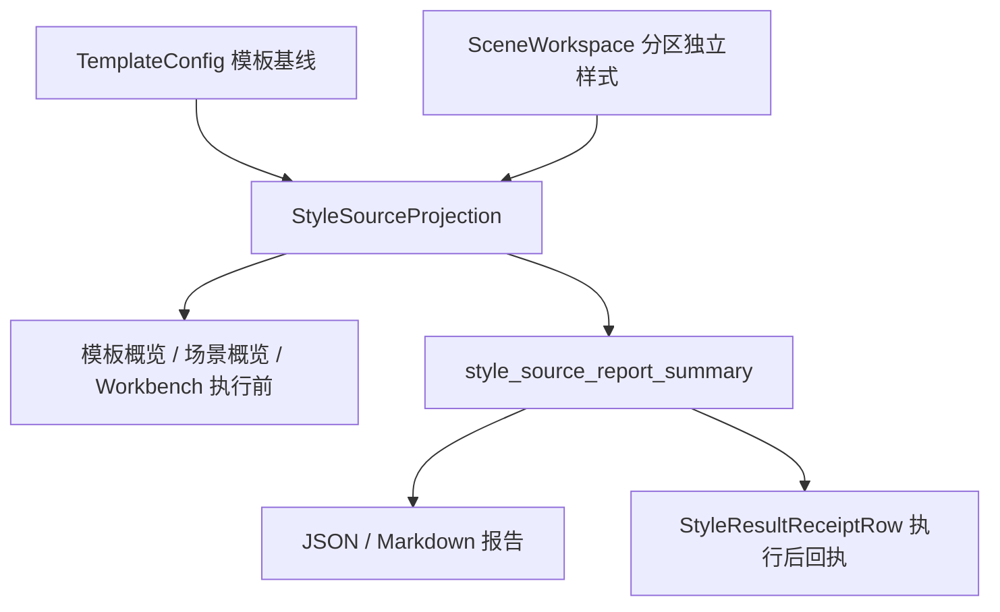

# 样式控件与模板管理一致性复用第三轮深度审计

日期：2026-06-29

后续进展：

- 第 5 节 P0 “把 `management_widgets` 升级为命名 slot”已先落地规则控制区：`StyleManagementBlock` 新增 `rule_control` 参数，`SceneStyleOverrideSection` 已改为 `rule_control=self._rule_control_deck`，详见 `docs/refactor-records/StyleManagementBlock规则控制命名Slot执行记录_2026-06-29.md`。
- 第 5 节 P0 “逐步减少 `SceneStyleOverrideSection` 的字段级兼容出口”已完成第一步：新增 `management_block` 稳定入口，并把 `_StyleRulesDetail` 的取值来源迁移到 `management_block / rule_control_deck / editing_section`，详见 `docs/refactor-records/SceneStyleOverrideSection稳定入口收束执行记录_2026-06-29.md`。
- 第 5 节 P1 “泛化 `TemplateSummaryHeader`”已完成：新增 `DetailSummaryHeader`，`TemplateSummaryHeader` 作为同对象别名保留，`DetailSummaryCard` 内部已改用 `DetailSummaryHeader`，详见 `docs/refactor-records/DetailSummaryHeader通用标题行命名边界执行记录_2026-06-29.md`。
- 第 5 节 P1 “建立统一预览 envelope”已完成第一片：新增 `StylePresentationEnvelope`，`StylePreview` 和 `StyleResultReceiptRow` 均已提供 envelope 入口，详见 `docs/refactor-records/StylePresentationEnvelope预览回执语义层执行记录_2026-06-29.md`。
- Workbench 执行状态链路已接入 envelope：`ExecutionResultState` / `RecentRunState` 新增 `style_source_envelope`，执行中心与最近结果优先按 envelope 渲染样式回执，详见 `docs/refactor-records/Workbench样式回执Envelope状态链路执行记录_2026-06-29.md`。
- 模板页面级预览已接入 `template_page` envelope：`build_template_page_presentation_envelope(...)` 成为模板预览说明与 `TemplateStylePreview.presentation_envelope` 的共同来源，详见 `docs/refactor-records/TemplateStylePreview页面级Envelope接入执行记录_2026-06-29.md`。
- 场景分区段落预览已接入 `section_paragraph` envelope：`StyleEditingSection` 自动把 preview projection 映射为 envelope，`StylePreview` 补全 presentation 属性，详见 `docs/refactor-records/SceneSectionParagraphEnvelope接入执行记录_2026-06-29.md`。

## 1. 本轮结论

当前项目已经从“场景页自己拼样式控件”推进到了“模板、场景、Workbench、报告共同消费样式投影和共享控件”的阶段。底层链路已经明显打通，但还没有到优秀设计。

核心问题已经不是某个按钮不好看，也不是再补几句说明文字就能解决。真正的问题是：

```text
模板管理已经像“基线对象管理”。
场景分区样式正在接近“基线差异管理”。
Workbench 已经开始做“执行前复核 / 执行后回执”。

但三个入口的控件命名、板块 slot、预览层级和兼容暴露边界还没有完全收束。
```

所以后续优化的方向应该继续从“页面文案调整”上移到“产品语法与组件契约统一”：让模板、场景、执行页都只是在不同 mode 下使用同一套样式管理能力。

## 2. 当前已经打通的链路

### 2.1 样式来源链路已经闭合

当前样式来源已经贯穿：

| 入口 | 当前实现 | 判断 |
| --- | --- | --- |
| 模板管理概览 | `StyleSourceCompactRow` + `build_template_style_source_projection(...)` | 已能表达“模板基线” |
| 场景概览 | `StyleSourceCompactRow` + `build_style_source_projection(...)` | 已能表达“模板 + 分区独立样式” |
| Workbench 执行前 | `StyleSourceCompactRow` | 已能复核执行基线 |
| Workbench 执行后 | `StyleResultReceiptRow` | 已能回执本次实际样式来源 |
| JSON/Markdown 报告 | `style_source_report_summary` | 已有结构化追溯 |

这条链路是正确的：



### 2.2 样式编辑链路已经共享

模板正文和场景分区样式已经共同经过：

```text
StyleManagementBlock
-> StyleEditingSection
-> StyleControlSurface
-> ParagraphStyleEditor
```

这保证了字体、字号、缩进、行距、段前段后等字段不会在模板页和场景页各写一套。

### 2.3 分区规则控制区已经从场景页抽离

`SceneStyleOverrideSection` 已经不再直接管理独立样式开关、差异条、全部跟随模板、撤销恢复等布局，而是交给：

```text
StyleRuleControlDeck
```

这一步很关键。它让“分区样式规则”成为一个可复用控制区，而不是场景详情页内部的临时布局。

### 2.4 通用摘要卡命名已经开始收束

`StyleManagementBlock` 已经改为实例化：

```text
DetailSummaryCard
```

旧的 `TemplateSummaryCard` 保留为模板详情页兼容名称。这样模板详情页仍然语义正确，而跨模板、场景、Workbench 的共享 block 不再背着模板专属命名。

本轮继续补了同类残留：

```text
apply_detail_summary_action_button
```

并让 `StyleRuleControlDeck` 使用这个通用按钮样式入口。旧的 `apply_template_summary_action_button` 仍作为兼容别名保留给模板详情页。

## 3. 为什么现在仍然“不够优秀”

### 3.1 复用了控件，但 slot 语义还不够强

`StyleManagementBlock` 现在支持 mode：

- `template_baseline_edit`
- `scene_section_rules`
- `readonly_review`

但它仍然通过 `management_widgets` 接收任意插入控件。短期这很灵活，长期会导致新调用方继续把任意 widget 塞进摘要卡，破坏模板管理的阅读节奏。

更合适的方向是把自由插槽升级成命名 slot：

| 目标 slot | 允许承载 |
| --- | --- |
| `source_slot` | 样式来源、owner 状态 |
| `rule_control_slot` | 独立样式开关、差异条、批量恢复 |
| `preview_slot` | 页面级预览、段落级预览、差异预览 |
| `field_surface_slot` | 可编辑字段表单 |
| `receipt_slot` | 执行后只读回执 |

这样组件复用的不是“把 widget 放进去”，而是“每个板块回答固定问题”。

### 3.2 模板预览、分区预览、执行回执还不是同一套 envelope

现在有三类展示：

| 展示类型 | 现状 | 回答的问题 |
| --- | --- | --- |
| 模板页面级预览 | 模板管理自己的预览区域 | 这个模板整体长什么样 |
| 分区段落预览 | `StylePreview` | 当前分区有效样式长什么样 |
| 执行后回执 | `StyleResultReceiptRow` | 刚才实际按什么样式执行 |

它们不应该强行合并成同一个控件，但应该共享一层 envelope，例如：

```text
StylePresentationEnvelope
- kind: template_page / section_paragraph / execution_receipt
- title
- source_label
- summary
- detail
- actions
```

这样用户在不同入口看到的是同一套产品语言，而不是三个相似但各自命名的展示块。

### 3.3 场景分区样式仍然暴露了过多兼容属性

`SceneStyleOverrideSection` 为了兼容旧测试和旧页面，仍然暴露：

- `toggle_list`
- `toggles`
- `rows`
- `comparison_strip`
- `owner_toolbar`
- `selector`
- `preview`
- `style_surface`
- `editor`
- `unit_labels`

这些属性本身不是 bug，但它们会让外部继续把这个 section 当成“控件仓库”。长期应该逐步迁移到：

```text
section.rule_control_deck
section.editing_section
section.card
```

再进一步则应该收束为：

```text
section.management_block
```

优秀设计里的页面不应该知道内部有多少个具体字段控件，只应该知道当前区块提供哪些稳定能力。

### 3.4 命名边界还剩下一层历史痕迹

本轮已经新增 `DetailSummaryCard` 与 `apply_detail_summary_action_button`，但仍有历史命名是合理保留的：

| 名称 | 当前处理 | 判断 |
| --- | --- | --- |
| `TemplateSummaryCard` | 保留给模板详情页 | 合理兼容 |
| `apply_template_summary_action_button` | 作为旧别名 | 合理兼容 |
| `TemplateSummaryHeader` | 已作为 `DetailSummaryHeader` 同对象别名保留 | 已收束 |

`TemplateSummaryHeader` 已泛化成 `DetailSummaryHeader`，但文件名和旧导入暂保留为兼容入口。当前最需要继续守住的是：新共享控件不得再依赖模板专属命名。

### 3.5 用户“不懂”的根因不是文案，而是对象边界

用户觉得“不说人话”，主要不是因为中文句子不够顺，而是页面在同一层展示了太多不同性质的东西：

| 用户真正关心 | 不该放在主阅读层的内容 |
| --- | --- |
| 当前是否跟随模板 | registry 计数、工程 key |
| 哪些分区单独调整了 | 原始字段名、配置来源路径 |
| 这个分区现在长什么样 | 长风险解释 |
| 改了以后影响哪里 | 内部 payload 或 schema 明细 |
| 执行时最终用了什么 | 全量报告 JSON |

所以后续删除冗余文本时，不要只删字。应该先确认这些信息是否应该属于当前板块；如果不是，就移动到 tooltip、诊断详情或报告里。

## 4. 建议的最终功能分布

### 4.1 模板管理：基线中心

模板管理只回答：

```text
我的标准格式是什么。
这些标准会影响哪些场景。
我要如何编辑这个基线。
```

推荐结构：

```text
当前模板
-> 样式来源：模板基线
-> 页面级预览
-> 参数章节入口
-> 正文 / 标题 / 表格 / 页眉页脚等详情编辑
```

模板详情页继续允许使用 `TemplateSummaryCard` 这个语义名称。

### 4.2 场景规划：基线差异中心

场景规划只回答：

```text
这个场景采用哪个模板。
哪些分区跟随模板。
哪些分区有独立样式。
这些差异执行时会怎样生效。
```

推荐结构：

```text
场景概览
-> 样式来源：模板 + 分区差异摘要
-> 看模板 / 调分区

分区样式
-> DetailSummaryCard
-> StyleRuleControlDeck
-> StyleEditingSection
-> 字段表单仅在可编辑时展开
```

场景分区样式不应继续被理解成“处理范围的附属参数”。它已经是模板使用方式的一部分。

### 4.3 Workbench：执行复核与执行回执

Workbench 不应该成为新的编辑页。它只回答：

```text
执行前按什么样式跑。
执行后实际用了什么样式。
```

推荐结构：

```text
执行前：StyleSourceCompactRow
执行后：StyleResultReceiptRow
报告：style_source 结构化明细
```

Workbench 的主界面不应该显示模板管理里的全部字段，也不应该显示场景规划里的所有开关。

## 5. 后续必要开发项

### P0：把 `management_widgets` 升级为命名 slot

目标：

```text
StyleManagementBlock(..., rule_control=StyleRuleControlDeck(...))
```

而不是：

```text
StyleManagementBlock(..., management_widgets=(some_widget,))
```

验收：

- 场景分区样式只能把 `StyleRuleControlDeck` 放入规则控制位。
- 新共享区块不能随意把长文案、临时卡片塞进摘要卡。
- 测试检查 `SceneStyleOverrideSection` 使用命名 slot。

当前状态：

- 第一轮已落地：规则控制区已落地为 `rule_control` 命名 slot。
- 第二轮已落地：`_StyleRulesDetail` 已从 `management_block / rule_control_deck / editing_section` 三个稳定入口取值。
- `management_widgets` 暂保留为兼容入口。
- `SceneStyleOverrideSection` 字段级属性暂保留为兼容出口。
- 后续还需继续评估是否抽 `source_widget`、`preview_widget`、`receipt_widget` 等 slot。

### P0：逐步减少 `SceneStyleOverrideSection` 的字段级兼容出口

目标：

```text
外部访问 section.rule_control_deck / section.editing_section
```

而不是直接访问 `section.toggles`、`section.editor`、`section.preview`。

验收：

- 新测试优先依赖 `management_block / rule_control_deck / editing_section`。
- 旧属性可先保留，但标记为兼容层。
- 场景页状态更新集中走 section API。

当前状态：

- 已新增 `management_block` 入口。
- `_StyleRulesDetail` 已停止从 `self._style_override_section.editor`、`style_surface`、`toggle_list` 等字段级属性取值。
- 部分测试仍会验证字段级兼容属性存在，后续可继续迁移。

### P1：泛化 `TemplateSummaryHeader`

目标：

```text
DetailSummaryHeader
TemplateSummaryHeader = DetailSummaryHeader
```

验收：

- `DetailSummaryCard` 内部不再直接使用模板专属 header 命名。
- 模板详情页旧导入不受影响。
- 新共享组件只使用 `DetailSummaryHeader`。

当前状态：

- 已新增 `DetailSummaryHeader`。
- `TemplateSummaryHeader = DetailSummaryHeader`。
- `DetailSummaryCard` 内部已改用 `DetailSummaryHeader`。

### P1：建立统一预览 envelope

目标：

```text
StylePresentationEnvelope
```

承载模板页面预览、分区段落预览、执行后回执的共同元信息。

验收：

- 模板预览和分区预览不强行合并 UI，但共享标题、来源、摘要、动作语义。
- Workbench 回执能从同一 envelope 渲染更细的只读摘要。

当前状态：

- 已新增 `StylePresentationEnvelope`。
- `StyleResultReceiptRow.apply_envelope(...)` 已可渲染执行后只读回执，旧 `set_summary(...)` 继续兼容。
- `StylePreview.apply_envelope(...)` 已可接收同一语义层，但绘制仍委托 `StylePreviewProjection`。
- `ExecutionResultState` / `RecentRunState` 已携带 `style_source_envelope`，Workbench 两个结果面板优先消费 envelope。
- `TemplateStylePreview` 已迁移到 `template_page` envelope，模板概览说明文本和页面级预览控件共享同一摘要来源。
- `StyleEditingSection` 已把段落 preview projection 映射为 `section_paragraph` envelope，场景分区预览获得完整 presentation 属性。

### P1：主界面文案守门

建议写入测试或静态规则：

- 主界面不显示 `template 9 / scene 3 / material 1 / output 2` 这种工程计数。
- 主界面不显示字段原始 key。
- 禁用原因超过 12 个中文字符进入 tooltip。
- 状态词统一使用：`模板基线`、`跟随模板`、`独立样式`、`可编辑`、`只读复核`、`本次使用`。

## 6. 本轮已执行的小落点

本轮没有大幅重排视觉界面，而是先处理两个会持续诱发分叉的命名残留：

1. `StyleManagementBlock` 使用 `DetailSummaryCard`，不再直接实例化 `TemplateSummaryCard`。
2. 新增 `apply_detail_summary_action_button`，并让 `StyleRuleControlDeck` 使用通用按钮样式入口。
3. 新增 `StylePresentationEnvelope`，先把样式预览和执行回执的标题、来源、摘要、详情、动作语义统一到同一层。
4. Workbench 执行结果状态新增 `style_source_envelope`，执行中心和最近结果面板已从“字符串优先”改为“envelope 优先、summary 兼容”。
5. 模板页面级预览新增 `template_page` envelope，概览说明和 `TemplateStylePreview` 不再各自生成预览语义。
6. 场景分区段落预览新增 `section_paragraph` envelope，分区预览的标题、来源、摘要、详情和动作语义已统一进入 `StylePreview` 属性。

兼容策略：

- `TemplateSummaryCard(DetailSummaryCard)` 继续存在。
- `apply_template_summary_action_button = apply_detail_summary_action_button` 继续存在。
- 模板详情页仍可使用模板语义名称。
- 新共享控件优先使用通用语义名称。

相关代码：

- `src/shared/ui/template_summary_card.py`
- `src/shared/ui/style_management_block.py`
- `src/shared/ui/style_rule_control_deck.py`
- `src/shared/ui/style_presentation_envelope.py`
- `src/shared/ui/style_preview.py`
- `src/shared/ui/style_editing_section.py`
- `src/shared/ui/style_result_receipt_row.py`
- `src/shared/ui/__init__.py`
- `src/ui/panels/template_format.py`
- `src/ui/panels/template_style_preview.py`
- `src/ui/panels/template_panel.py`
- `src/ui/panels/workbench/state.py`
- `src/ui/panels/workbench/execution_center.py`
- `src/ui/panels/workbench/recent_run_panel.py`
- `src/ui/adapters/workbench_execution_adapter.py`

相关测试：

- `tests/test_summary_grid.py`
- `tests/test_template_style_detail.py`
- `tests/test_small_widget_architecture.py`
- `tests/test_ui_exports.py`
- `tests/test_template_format_projection.py`
- `tests/test_template_style_preview.py`
- `tests/test_template_panel_architecture.py`
- `tests/test_workbench_execution_center.py`
- `tests/test_recent_run_panel.py`
- `tests/test_scene_panel_architecture.py`
- `tests/test_scene_panel_architecture.py`
- `tests/test_small_widget_architecture.py`
- `tests/test_ui_exports.py`

已验证：

```powershell
python -X utf8 -m py_compile src/shared/ui/template_summary_card.py src/shared/ui/style_rule_control_deck.py src/shared/ui/__init__.py tests/test_summary_grid.py tests/test_small_widget_architecture.py tests/test_ui_exports.py
```

结果：通过。

```powershell
python -X utf8 -m pytest tests/test_summary_grid.py tests/test_template_style_detail.py tests/test_scene_panel_architecture.py tests/test_small_widget_architecture.py tests/test_ui_exports.py -q
```

结果：

```text
117 passed
```

## 7. 一致性守门建议

后续每次改样式链路，都建议守住这些规则：

| 守门点 | 规则 |
| --- | --- |
| 创建链路 | `StyleControlSurface` 只能由 `StyleEditingSection` 创建 |
| 管理区块 | 模板正文和场景分区样式必须走 `StyleManagementBlock` |
| 摘要卡 | 跨域共享组件使用 `DetailSummaryCard` |
| 模板兼容 | 模板详情页可以继续使用 `TemplateSummaryCard` |
| 规则控制 | 分区独立样式开关和差异条必须走 `StyleRuleControlDeck` |
| 执行回执 | 执行后样式来源必须走 `StyleResultReceiptRow` |
| 文案 | 主界面不展示工程 key、registry 计数、长风险解释 |

## 8. 本轮判断

这轮之后，样式控件和模板管理的复用边界更清楚了：底层字段、编辑外壳、管理 block、规则 deck、来源行、执行回执和摘要卡都已经开始形成完整链路。

但距离优秀设计还差两步：

1. 把 `StyleManagementBlock` 的自由插槽变成命名 slot，避免共享 block 再被当成普通容器使用。
2. 把预览和回执统一成 envelope，让模板、场景、Workbench 的展示语言完全一致。

只有这两步继续推进，界面才会从“用了很多相同控件”变成“用户感觉这就是同一套功能”。这才是真正的高度复用。
