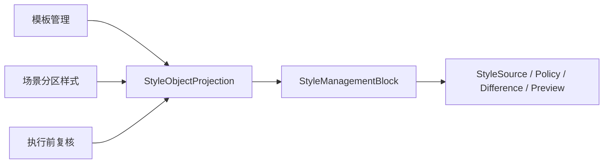

# 样式控件与模板管理一致性复用第五轮深度分析

日期：2026-06-30

本轮结论：当前问题已经不是“完全没有复用”，而是复用层级还不够清晰。底层已经开始共享 `StyleManagementBlock`、`StyleObjectProjection`、`StylePolicyControlDeck`、`StylePolicyToggleList`、`StylePreviewSurface`，但用户第一屏仍会看到工程证据、比例读数和内部词汇。这会让场景配置看起来不像模板管理的自然延伸，而像一个测试矩阵页面。

## 1. 当前走到哪一步

已经打通的主链路：



已经完成的复用能力：

| 层级 | 当前状态 | 判断 |
| --- | --- | --- |
| 样式对象投影 | 模板、场景、执行复核已开始进入 `StyleObjectProjection` | 主链路方向正确 |
| 策略控制 | `StylePolicyControlDeck` 已抽象，`StyleRuleControlDeck` 变薄 | 控件结构比之前更通用 |
| 策略开关列表 | `StylePolicyToggleList` 已替代场景专属 Override 命名 | 命名边界更准确 |
| 样式预览 | `StylePreviewSurface` 已覆盖模板和场景部分预览 | 预览骨架可复用 |
| 首屏理解 | 仍混入比例、样本、证据和内部 registry 词汇 | 这是当前最大体验问题 |

所以“距离优秀设计还远”的原因，不是缺一个新控件，而是缺一条严格的信息分层规则：

1. 第一屏只回答用户要做什么、会处理哪里、按哪个模板、有什么风险。
2. 样式区只处理模板基线、分区覆盖、差异、恢复和预览。
3. 证据区只在需要追溯时展开，不抢主任务位置。
4. 内部模型可以保留 `request_cell`、`fixture`、`policy` 等稳定命名，但界面必须翻译成人能理解的词。

## 2. 与模板管理比对后的核心差距

| 对比项 | 模板管理的成熟做法 | 场景页之前的问题 | 本轮处理 |
| --- | --- | --- | --- |
| 主文案 | “当前模板 / 参数概览 / 样式预览”直接面向用户任务 | “请求样本、请求证据、9/9 文档区域”更像研发读数 | 改成“常见说法、说法依据、全部 N 个区域会处理” |
| 控件命名 | 同一件事在摘要、详情、预览中叫法一致 | 场景页叫请求样本，执行复核也叫请求样本，用户不知和“常见说法”关系 | 场景页、执行复核、共享状态统一为“常见说法 / 说法依据” |
| 信息层级 | 概览只放摘要，细节进入编辑页或预览页 | 核对依据容易被误认为主功能 | 高级入口改成“需要追溯时再看” |
| 范围表达 | 模板页用自然语言说明参数状态 | 场景页使用 `enabled/total` 比例 | 范围摘要改为自然语言 |
| 守门方式 | 模板管理有较多结构化测试 | 场景首屏旧词容易回流 | 新增测试约束首屏不出现斜杠比例和内部术语 |

## 3. 本轮执行改动

### 3.1 首屏范围摘要改成人话

文件：`src/ui/panels/scene_overview_projection.py`

之前：

```text
9/9 个文档区域会处理
```

现在：

```text
全部 9 个区域会处理
已选 3 个区域会处理
未选择处理区域
```

这不是单纯改文案，而是把“矩阵完成度读数”从第一屏拿掉。第一屏要告诉用户结果，不要让用户解码比例。

### 3.2 扩大第一屏术语黑名单

文件：`src/ui/panels/scene_overview_projection.py`

新增守门词包括：

- `custom_basic`
- `quick_formatting`
- `template `
- `scene `
- `material `
- `output `
- `plugin `
- `manual /`
- `field/comment`

这些词不是不能存在，而是不能出现在第一屏。它们应该进入 tooltip、导出证据、调试报告或高级核对区。

### 3.3 高级证据入口降级为追溯入口

文件：`src/ui/panels/scene_panel.py`

之前：

```text
查看场景覆盖、样本文档和请求样本。
```

现在：

```text
需要追溯时再看：场景覆盖、样本文档和常见说法。
```

这样用户不会把“核对依据”误认为必须先配置的主步骤。

### 3.4 请求样本词表归一为常见说法

涉及文件：

- `src/ui/panels/scene_overview_projection.py`
- `src/ui/panels/scene_panel.py`
- `src/ui/panels/scene_summary_projection.py`
- `src/ui/panels/workbench/quick_execution_detail.py`
- `src/ui/panels/workbench/scene_presets.py`

界面层改为：

| 原词 | 新词 |
| --- | --- |
| 请求样本 | 常见说法 |
| 请求筛选 | 说法筛选 |
| 请求证据 | 说法依据 |
| 打开证据 | 打开依据 |
| 可以打开请求证据 | 可以打开说法依据 |
| 已打开请求证据 | 已打开说法依据 |

内部模型仍保留 `request_cell` 命名。原因是它已经是运行时 fixture、筛选、证据打开和 Workbench 汇总的稳定技术对象，强行重命名会扩大风险。正确做法是：内部模型稳定，用户界面翻译。

## 4. 当前链路是否打通

| 链路 | 当前状态 | 缺口 |
| --- | --- | --- |
| 模板页样式摘要 -> 场景样式来源 | 已打通，`StyleSourceProjection` 复用 | 需要继续保证所有入口都走同一投影 |
| 场景样式策略 -> 共享策略控件 | 已打通，Policy 命名已成主链路 | 旧 Override 兼容别名仍存在，后续可逐步退场 |
| 场景分区预览 -> 模板预览样式 | 已部分打通 | preview slot 协议还没有强制化 |
| 执行前复核 -> 样式对象投影 | 已接入样式对象和预览 | 执行前复核尚未充分使用策略区 |
| 常见说法证据 -> 场景页/Workbench | 本轮统一可见词表 | 底层 tooltip 仍有部分工程读数，需继续限制在高级层 |

## 5. 后续必要功能

下一步不建议继续堆新卡片，而是按三个方向做深：

1. 样式字段编辑器描述符化
   模板正文、场景分区、执行复核如果出现同名字段，必须同控件、同单位、同禁用态、同保存路径。需要继续把字段控件收敛到描述符和共享编辑器，而不是在页面里手写一套。

2. Preview Slot 协议强制化
   `StyleManagementBlock.preview_slot` 目前可以消费统一投影，但还没有强制要求 slot 实现统一协议。后续应增加测试：模板页、场景页、执行前复核传入同一类 projection 时，预览组件行为一致。

3. 高级证据分层守门
   `核对依据` 可以保留 coverage、fixture、registry、request cell 等证据，但默认折叠，且标题和主文案必须翻译成用户语言。工程词只允许出现在 tooltip 或导出证据。

4. 旧兼容 API 退场计划
   当前仍保留 `override_toggled`、`set_override_row_visible` 等兼容别名。短期合理，长期会让开发继续误以为“场景覆盖”是独立体系。建议在测试全覆盖后逐步把新代码全部迁到 `policy_*`。

5. 执行前复核补齐策略区
   执行前复核已经接入样式对象和预览，但策略控制还没有像场景分区一样完整使用 `StylePolicyControlDeck`。这是模板管理和执行链路真正一致的下一块。

## 6. 本轮验证

已通过：

```powershell
python -X utf8 -m py_compile src\ui\panels\scene_overview_projection.py src\ui\panels\scene_panel.py src\ui\panels\scene_summary_projection.py src\ui\panels\workbench\quick_execution_detail.py src\ui\panels\workbench\scene_presets.py tests\test_scene_overview_projection.py tests\test_scene_panel_architecture.py tests\test_quick_execution_detail_architecture.py tests\test_ui_copy_guardrails.py
```

```powershell
python -X utf8 -m pytest tests\test_scene_overview_projection.py tests\test_ui_copy_guardrails.py::test_request_cell_evidence_status_projection_keeps_paths_out_of_main_copy -q
```

结果：`7 passed`

```powershell
python -X utf8 -m pytest tests\test_scene_panel_architecture.py -q
```

结果：`59 passed`

```powershell
python -X utf8 -m pytest tests\test_quick_execution_detail_architecture.py::test_quick_execution_scene_summary_includes_profile_contracts tests\test_quick_execution_detail_architecture.py::test_quick_execution_request_cell_browser_filters_scene_cells tests\test_quick_execution_detail_architecture.py::test_quick_execution_request_cell_browser_opens_fixture_evidence -q
```

结果：`3 passed`

## 7. 最终判断

这轮把一个关键分叉收住了：场景页、模板管理和 Workbench 不应该因为内部模型不同，就在界面上发明三套说法。

当前已经有复用骨架，但要达到优秀设计，还必须继续把“同名字段同控件、同类状态同文案、同一预览同协议”做成硬约束。否则 UI 看起来会越来越丰富，用户理解却越来越吃力。
