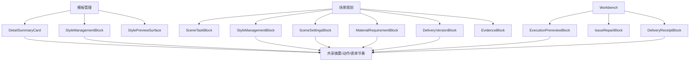

# 样式控件与模板管理结构同构第八轮深度分析

日期：2026-06-30

## 1. 本轮结论

这轮继续回应“样式、控件规划还是没能和模板管理保持一致性与高度复用”。更准确的判断是：

```text
样式控件的底层复用已经基本打通；
页面级结构复用还没有成为硬约束；
非样式控件仍停留在视觉复用，而不是产品语义复用。
```

模板管理目前比较优秀的地方，不只是它用了统一表单行，而是它已经有稳定的对象结构：

```text
当前对象 -> 摘要 -> 来源/范围 -> 策略 -> 编辑 -> 预览/回执
```

场景页目前的问题是：部分区域已经使用了这些共享控件，但输出版本、输入资料、功能规则、对象保护仍由页面自己拼装。用户看到的是一组表单，而不是一个清晰任务流程。因此后续不应该继续堆解释文字，而应该把场景页拆成和模板管理同构的业务 block，并让每个 block 暴露可测试的内容计划。

本轮建议的目标不是“场景页长得和模板页一模一样”，而是三端使用同一套对象语法：

```text
模板管理：文档默认长什么样。
场景规划：这类任务如何处理、哪些地方覆盖模板。
Workbench：本次运行实际用了什么、输出了什么。
```

## 2. 已经走到哪一步

### 2.1 样式链路已经接近正确形态

| 链路 | 当前证据 | 评价 |
| --- | --- | --- |
| 模板正文排版 | `src/ui/panels/template_style_detail.py` 使用 `StyleManagementBlock(mode="template_baseline_edit")` | 已进入共享样式对象模型 |
| 场景分区样式 | `src/ui/panels/scene_style_override_sections.py` 使用 `StyleManagementBlock(mode="scene_section_rules")` | 已和模板管理共用外壳、编辑器、预览槽 |
| 字段布局 | `src/shared/ui/paragraph_style_surface.py` 通过 `style_field_layout_rows()` 生成字段行 | 已避免页面层手写“中文字体/字号/行距”等字段 |
| 内容计划 | `StyleManagementContentPlan.sections()` / `encoded_slots()` | 已有可测试的结构合同 |
| 模板预览 | `TemplatePanel` 使用 `StyleManagementBlock(mode="template_overview_preview")` 包住 `StylePreviewSurface` | 预览已进入同一套 block 思路 |
| 执行前/执行后 | Workbench 已开始使用 `StyleManagementBlock`、`StylePreviewSurface`、回执 slot | 运行链路已接上，但还需要继续收口 |

这里说明项目方向是对的。真正的问题已经从“有没有共享控件”升级为“所有页面是否必须服从共享结构”。

### 2.2 场景页仍没有完全同构

`src/ui/panels/scene_panel.py` 的 `_SimpleFormDetail` 会统一生成标题、说明、摘要和表单栈，但它不是模板管理那种强语义 block。它更像一个便利外壳：

```text
Card
-> desc label
-> SummaryGrid
-> TemplateFormStack(rows)
```

这会带来两个问题：

- 每个详情页都可以自由决定 row 顺序、label、主路径和高级区边界。
- 测试只能检查“有没有这些控件”，很难检查“这些控件是否属于正确语义槽位”。

输出设置是当前最明显例子。`_OutputDetail` 已经有 `primary_rows` 和 `advanced_rows`，但这只是局部变量，不是公开结构合同：

```text
primary_rows:
默认交付 / 版本管理 / 版本模板 / 交付名称 / 最终 Word / 对比 Word / 资料清单 / 资料包

advanced_rows:
交付编号 / 目标模板 / 模板选项 / 输出目录 / 文件命名 / 命名信息 / 添加内容块 / 报告 JSON / 报告 Markdown / 内容块规则
```

它已经比之前清楚，但还没有达到模板管理的复用标准，因为外部无法通过 `content_plan` 或 `slot_plan` 验证这套结构。

### 2.3 资料规则走了一半

`_MaterialRequirementBlock` 已经把资料规则选择、主规则、多规则、必填字段、图片签章、预览摘要、未识别修复收在一个 block 里。这是正确方向。

但它仍有三个不足：

- 仍是 `scene_panel.py` 内部私有类，不是像 `StyleManagementBlock` 那样的共享组件。
- 它暴露的是控件属性和 `form_rows()`，还没有 `content_plan` / `slot_plan`。
- `_ContentDetail` 仍把 Markdown、LaTeX、资料包必需、失败策略、水印和资料规则混在同一个表单路径里。

所以资料规则不是“没做”，而是“还没有完全升格为模板管理同等级的 block”。

## 3. 为什么用户仍觉得“不说人话”

### 3.1 复用层级不够深

现在有三种复用层级：

| 层级 | 例子 | 用户感知 |
| --- | --- | --- |
| 视觉复用 | `template_form_row()`、`TemplateFormStack()` | 看起来整齐，但仍像配置表 |
| 控件复用 | `ParagraphStyleEditor`、`StyleControlSurface` | 字段、单位、禁用态一致 |
| 结构复用 | `StyleManagementBlock` + `content_plan` | 用户能按同一套逻辑理解页面 |

样式区已经进入第二、第三层。输出版本、资料规则、功能规则多数还停在第一层。

### 3.2 主路径混入了技术对象

即使高级区折叠，输出相关文案仍容易把用户带回工程视角：

| 当前文案/概念 | 问题 | 建议主路径表达 |
| --- | --- | --- |
| 版本模板 | 容易和文档模板混淆 | 交付模板 |
| 模板选项 | 不清楚是文档模板还是交付模板 | 使用文档模板 |
| 报告 JSON | 技术格式暴露 | 结构化报告 |
| 报告 Markdown | 技术格式暴露 | 可读报告 |
| 内容块规则 | 抽象偏强 | 隐藏哪些内容 |
| 添加内容块 | 像在编辑代码块 | 添加隐藏内容 |
| 交付编号 | 已下沉高级区，方向正确 | 高级区保留 |
| 输出目录/文件命名 | 属于高级命名 | 高级区保留 |

这里的原则是：主路径只说“我要交付什么”，高级层才说“系统如何命名、如何记录、如何匹配”。

### 3.3 说明文字仍有冗余

场景页的说明文字应该服务决策，而不是重复控件名。建议删除或下沉：

- 重复标题的描述，例如标题已经是“输出设置”，说明就不必再说“选择需要生成的输出文件”。
- 教用户点哪里的话，如果按钮本身已经明确。
- raw id、schema、preset、JSON、Markdown、contract 这类工程词。
- 能由状态条表达的长段解释。
- 审计证据、样本数量、矩阵读数，不进入主配置路径。

更好的说明形态是短状态：

```text
将生成 2 类文件
已隐藏 3 类内容
缺资料会先提醒
跟随当前模板
```

## 4. 与模板管理保持一致的真正标准

一致性不等于每个页面都有同样按钮，而是每个业务对象都遵守同一套 block 协议。

### 4.1 统一 block 协议

建议所有可配置业务块最终都暴露以下协议：

```text
content_plan: 当前 block 包含哪些语义段
slot_plan: 用户实际看到的槽位顺序
primary_rows: 普通用户必须处理的控件
advanced_rows: 高级命名、证据、兼容和内部参数
summary_items: 当前状态短摘要
apply_projection(): 从模型生成 UI 状态
apply_to_model(): 从 UI 写回模型
navigation_widget_for_field(): 问题队列可定位到控件
```

样式已经有类似能力：

```text
StyleManagementBlock
-> style_management_content_plan
-> style_management_slot_plan
-> StyleControlSurface
-> StylePreviewSurface
```

非样式 block 也应补上同等级合同，而不是只返回一组表单行。

### 4.2 页面级统一槽位

场景规划页建议使用这套稳定顺序：

```text
当前任务
模板与样式
处理范围
功能规则
资料与边界
输出版本
核对依据
```

其中“核对依据”默认折叠，用来放样本、审计、覆盖矩阵和发布证据。普通用户完成任务不应被迫读懂这些内容。

### 4.3 样式对象统一槽位

样式相关仍沿用已有成熟槽位：

```text
source -> scope -> policy -> difference -> editor -> preview -> receipt
```

不同入口只开不同槽：

| 入口 | 必要槽位 |
| --- | --- |
| 模板正文排版 | `source / scope / policy / editor` |
| 场景分区样式 | `source / scope / policy / difference / editor / preview` |
| 模板概览预览 | `preview` |
| 执行前复核 | `source / scope / difference` |
| 执行后回执 | `receipt` |

这件事已经有测试守门，后续要把非样式 block 也补到同样强度。

## 5. 推荐的内容板块重规划

### 5.1 当前任务

只放用户开始前必须确认的东西：

- 场景预设
- 关联文档模板
- 编号策略
- 当前场景短摘要
- 关键风险短状态

不放样本数量、发布矩阵、能力等级、raw scene id。

### 5.2 模板与样式

承接模板管理的同构体验：

- 当前文档模板来源
- 哪些分区跟随模板
- 哪些分区单独调整
- 与模板差异
- 样式预览
- 恢复模板

这块应只通过 `StyleManagementBlock` 系列表达，不再由场景页手写样式字段。

### 5.3 处理范围

只回答“哪些内容会被处理”：

- 正文
- 标题
- 表格/图表
- 页面元素
- 公式
- 参考文献
- 输入清理

不要把每个功能参数都塞进这个层级。范围是开关，规则是下一层。

### 5.4 功能规则

把表格与图表、页面元素、公式、参考文献、校验与合规收进同一类 `SceneSettingsBlock`：

```text
summary -> primary_controls -> advanced_controls -> preview_or_impact
```

用户在这里看到的是“规则”，不是一堆分散的参数页。

### 5.5 资料与边界

拆成两个 block：

```text
MaterialRequirementBlock:
资料规则 / 必填字段 / 图片签章 / 预览 / 修复未识别

InputBoundaryBlock:
Markdown / LaTeX / 资料包必需 / 失败策略 / 水印
```

这样资料规则不会和输入清理、水印混成一个大表单。

### 5.6 输出版本

输出区应升级为 `DeliveryVersionBlock`：

```text
content_plan:
version -> artifacts -> template -> visibility -> naming -> reports

slot_plan:
版本 -> 输出内容 -> 使用模板 -> 隐藏内容 -> 高级命名 -> 报告
```

主路径只保留：

- 默认交付
- 交付名称
- 交付模板
- 最终 Word
- 对比 Word
- 资料清单
- 资料包

高级区保留：

- 交付编号
- 使用文档模板
- 输出目录
- 文件命名
- 命名信息
- 隐藏内容
- 结构化报告
- 可读报告

### 5.7 核对依据

核对依据不是主配置页。它应该承接：

- 样本文档
- 常见说法
- 覆盖矩阵
- 发布闸门证据
- 运行时审计结果
- raw id 和 contract 追踪

默认折叠；只有需要查证或排错时展开。

## 6. 必要开发项优先级

### P0：给输出版本建立真正的 block

新增或抽出 `DeliveryVersionBlock`，目标不是换名字，而是建立结构合同：

- `delivery_version_content_plan`
- `delivery_version_slot_plan`
- `primary_row_labels()`
- `advanced_row_labels()`
- `navigation_widget_for_field()`
- 报告显示名和 raw 格式分层

首轮可以先保持 UI 外观不变，只把 `_OutputDetail` 里的局部 `primary_rows/advanced_rows` 变成可测试对象。

### P0：把资料规则 block 从页面私有类升格

`_MaterialRequirementBlock` 已经很接近，应继续做：

- 移到独立模块，命名为 `MaterialRuleSelectorBlock` 或 `MaterialRequirementBlock`。
- 增加 `content_plan = schema|requirements|preview|repair`。
- `_ContentDetail` 只负责组合，不再知道资料规则内部控件。

### P0：删除主路径冗余文案

立刻可做的文案收敛：

| 当前 | 建议 |
| --- | --- |
| 版本模板 | 交付模板 |
| 模板选项 | 使用文档模板 |
| 报告 JSON | 结构化报告 |
| 报告 Markdown | 可读报告 |
| 添加内容块 | 添加隐藏内容 |
| 内容块规则 | 隐藏内容 |

raw `JSON/Markdown/preset/schema` 可以留在 tooltip、高级说明或报告文件名中，不进入主标签。

### P1：功能规则抽象为 SceneSettingsBlock

表格、页面元素、公式、参考文献、校验与合规目前都像独立表单。建议抽统一协议：

```text
SceneSettingsBlock(
  title,
  summary_items,
  primary_controls,
  advanced_controls,
  impact_preview,
)
```

这能减少左侧导航碎片感，也能让每个功能页和模板管理一样有稳定结构。

### P1：对象保护单独成块

对象预检、高风险跳过、扫描目标、保护模式、失败策略应形成 `ObjectProtectionBlock`。它属于边界保护，不应该长期混在“校验与合规”的普通参数里。

### P2：统一执行前和执行后回读

Workbench 应继续沿用同一套 block 协议：

```text
计划使用什么 -> 执行中发现什么 -> 实际输出什么 -> 哪里可回修
```

输出版本、资料规则、样式对象都应该能从执行问题跳回同一个 `navigation_widget_for_field()`。

## 7. 验收守门建议

后续测试不应只检查文案存在，应检查结构合同：

| 守门 | 目的 |
| --- | --- |
| `StyleManagementBlock` 所有入口必须有 `style_management_slot_plan` | 防止样式页重新散装 |
| `DeliveryVersionBlock` 必须有 `delivery_version_slot_plan` | 防止输出区再次混主路径和高级项 |
| 输出主路径不得出现 `JSON / Markdown / 编号 / 输出目录 / 文件命名` | 防止技术项上浮 |
| 资料规则 block 必须有 `schema|requirements|preview|repair` | 防止资料规则重新散回 `_ContentDetail` |
| 场景页新增详情块不得直接手写样式字段 label | 防止绕过 `style_field_descriptors.py` |
| 核对依据以外的首屏不得出现 `schema/preset/contract/manifest/release gate/L5/Green` | 防止工程证据污染普通路径 |

## 8. 最终目标形态



真正优秀的设计应该让用户不需要理解系统内部术语，也能自然完成判断：

```text
我选哪个模板。
我要处理哪些内容。
哪些样式跟随模板，哪些单独调。
缺什么资料。
最后交付哪几个版本。
需要查证时再看依据。
```

这条链路全部打通之后，模板管理和场景规划才算是“高度复用”：不是仅共享控件皮肤，而是共享同一套业务对象、同一套槽位、同一套可读语言。
