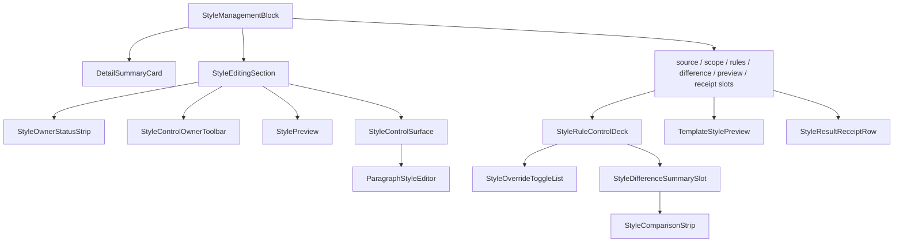

# 样式控件与模板管理高度复用规划深度分析

日期：2026-06-30

## 1. 本轮结论

当前项目已经不是“完全没有复用”。真正的问题是：

```text
底层字段控件已经复用，
样式管理外壳已经复用，
但模板管理、场景分区样式、模板预览、执行回执之间还没有形成同一套产品级信息架构。
```

也就是说，现在的复用更像工程复用：

- `ParagraphStyleEditor` 复用字段控件。
- `StyleControlSurface` 复用字段分组。
- `StyleEditingSection` 复用 owner、预览、字段区外壳。
- `StyleManagementBlock` 复用摘要卡、slot 和 content plan。
- `StylePresentationEnvelope` 复用预览和回执文案模型。

但用户看到的仍然像几套不同系统拼在一起：

- 模板管理像“参数页”。
- 场景概览像“能力矩阵/工程审计页”。
- 分区样式像“开关、差异、编辑器混合页”。
- 模板预览像另一个独立的视觉块。

优秀设计不应该继续增加解释文字，而应该让结构本身说人话：

```text
当前对象是谁
它跟随谁
哪些地方可改
改了什么
改完长什么样
这次执行实际用什么
```

## 2. 现有链路状态

### 2.1 模板管理链路

当前路径：

```text
TemplateConfig
-> TemplatePanel 当前模板 / 参数概览 / 样式预览
-> TemplateStylePreview 全页预览
-> StyleDetail 正文排版详情
-> StyleManagementBlock(template_baseline_edit)
-> StyleControlSurface
-> ParagraphStyleEditor
```

已打通：

- 模板概览里已经有 `StyleSourceCompactRow`，可以说明“当前模板作为样式基线”。
- 模板概览里已经有 `StyleManagementBlock(template_overview_preview)` 包住 `TemplateStylePreview`。
- 正文排版详情已经通过 `StyleManagementBlock(template_baseline_edit)` 进入共享样式管理外壳。
- 字段区已经通过 `StyleControlSurface` 和 `ParagraphStyleEditor` 复用。

未完全打通：

- 模板详情编辑区和模板预览区仍是两个体验位置。用户在“正文排版”里改字段时，没有在同一个样式管理对象内看到同规格预览。
- 模板预览使用 `TemplateStylePreview`，场景分区使用 `StylePreview`，两者都接入了 envelope 思路，但视觉外壳、标题区、状态区还没有完全归一。
- `StyleDetail` 仍保留 `_font_cn`、`_line_value` 等直接控件别名。它比场景侧更接近旧模板页写法，后续如果重排字段区，模板详情仍会拖住复用边界。

### 2.2 场景分区样式链路

当前路径：

```text
SceneWorkspace + TemplateConfig
-> _StyleRulesDetail
-> SceneStyleRulesBlock
-> SceneStyleOverrideSection
-> StyleManagementBlock(scene_section_rules)
-> StyleRuleControlDeck
-> StyleEditingSection
-> StyleControlSurface
-> ParagraphStyleEditor
-> StylePreview
```

已打通：

- 场景侧已经不直接创建 `ParagraphStyleEditor`。
- `SceneStyleRulesBlock` 已经成为场景分区样式的对象级入口。
- 独立样式开关、差异摘要、恢复模板、预览、字段编辑已经在 `StyleManagementBlock(scene_section_rules)` 下聚合。
- 未启用独立样式时，字段区可以折叠，并通过 `style_management_editor_collapsed_by_readonly` 表达语义。

未完全打通：

- `_StyleRulesDetail` 仍保存大量 block 内部子控件别名，如 `_style_variant_combo`、`_section_style_preview`、`_style_owner_status` 等。这些不是用户可见问题，但会限制后续重新规划版面。
- `StyleRuleControlDeck` 仍带有较强场景语义，标题、按钮、开关文案基本写死为“独立样式 / 全部跟随模板 / 撤销恢复”。
- `source`、`scope`、`difference`、`preview` 虽然在 content plan 里存在，但还没有各自稳定的产品级 slot 规范。

### 2.3 场景概览链路

当前路径：

```text
SceneWorkspace
-> build_scene_overview_spec(...)
-> _SceneOverviewDetail
-> key_settings / risk_notices / run_steps / profile_summary
-> build_scene_overview_summary_items(...)
```

已打通：

- 概览页已经使用 `StyleSourceCompactRow` 展示模板和分区样式来源。
- `style_source` 已从普通设置行独立为共享样式来源行。
- 一部分工程词已经通过投影层替换为用户可读词。

未完全打通：

- 概览页仍同时承担“选择场景、解释执行步骤、展示能力矩阵、展示证据/样本、展示样式来源”。这会导致首屏很容易过载。
- 截图里的 `custom_basic`、`quick_formatting`、`Green/L5`、`template 13 / scene 37 / material 6 / output 17` 这类信息，本质是工程状态，不应该直接出现在主阅读层。
- “功能开关、处理范围、样式来源、核对依据”仍在概览和详情之间有混排感，边界还不够清晰。

### 2.4 执行回执链路

当前路径：

```text
Execution result
-> StylePresentationEnvelope.from_execution_result(...)
-> StyleResultReceiptRow
```

已打通：

- 执行回执已经开始使用 `StylePresentationEnvelope`。
- 可以表达“本次使用”的样式来源。

未完全打通：

- 执行前差异摘要和执行后实际回执还没有完全闭合。
- `execution_receipt_review` 的 content plan 以 receipt 为主，尚未把 `difference_slot` 纳入最终闭环。

## 3. 和模板管理保持一致，不等于照抄模板页

模板管理和场景分区样式的业务对象不同：

| 页面 | 用户正在编辑的对象 | 应该稳定展示的问题 |
| --- | --- | --- |
| 模板管理 | 模板基线样式 | 这个模板默认长什么样 |
| 场景分区样式 | 场景里的某个分区覆盖层 | 这个分区是否跟随模板，是否有局部覆盖 |
| 场景概览 | 本次任务的整体策略 | 这次会处理什么，哪里需要确认 |
| 执行回执 | 本次实际使用的样式事实 | 运行时到底用了哪套样式 |

所以一致性应该体现在同一套对象语言，而不是同一套页面内容：

```text
Style Object
  source: 来源
  scope: 影响范围
  owner: 当前编辑对象
  policy: 跟随/独立/只读/执行态
  difference: 与基线差异
  fields: 可编辑字段
  preview: 视觉预览
  receipt: 执行结果
```

模板管理只是 `Style Object` 的 `template_baseline` 形态。

场景分区样式是 `Style Object` 的 `scene_section_override` 形态。

执行回执是 `Style Object` 的 `execution_receipt` 形态。

## 4. 当前组件复用地图



这张图说明基础很好，但也暴露了问题：

- `StyleManagementBlock` 是真正的中心，但它现在更多是容器，不是完整的样式对象呈现器。
- `source`、`scope`、`rules`、`difference`、`preview`、`receipt` 是布尔 content plan，还不是强约束的产品板块。
- `TemplateStylePreview` 和 `StylePreview` 都能展示样式，但外壳不统一。
- `StyleRuleControlDeck` 只适配场景分区，不适配模板基线、执行前复核、执行后回执。

## 5. 建议的目标信息架构

### 5.1 样式管理块统一顺序

所有样式对象页面采用同一套顺序：

```text
1. 对象标题和动作
2. 来源与影响范围
3. 当前状态摘要
4. 策略控件
5. 差异摘要
6. 字段编辑
7. 样式预览
8. 执行回执
```

不同 mode 只决定哪些板块出现：

| mode | 来源/范围 | 状态摘要 | 策略控件 | 差异 | 字段编辑 | 预览 | 回执 |
| --- | --- | --- | --- | --- | --- | --- | --- |
| `template_baseline_edit` | 有 | 有 | 无 | 无 | 有 | 有 | 无 |
| `scene_section_rules` | 有 | 有 | 有 | 有 | 条件显示 | 有 | 无 |
| `template_overview_preview` | 有 | 简短 | 无 | 无 | 无 | 有 | 无 |
| `execution_prereview` | 有 | 有 | 无 | 有 | 无 | 可选 | 无 |
| `execution_receipt_review` | 有 | 有 | 无 | 有 | 无 | 可选 | 有 |
| `readonly_review` | 有 | 有 | 无 | 可选 | 无 | 有 | 有 |

当前 `StyleManagementContentPlan` 已经有这些字段，但还缺三点：

1. 缺少固定顺序和 slot 角色说明。
2. 缺少统一 `apply_projection(...)`，导致各页面自己拼状态。
3. 缺少“同一个 preview 外壳容纳不同 preview renderer”的抽象。

### 5.2 模板管理详情页应该补预览，而不是只在概览页预览

模板正文排版详情建议调整为：

```text
正文排版
  来源与影响：模板基线 / 影响全文正文
  摘要：文字样式 / 对齐缩进 / 行距段距
  字段编辑：文字样式、对齐与缩进、行距与段距
  样式预览：同一个 block 内展示正文段落预览，必要时可跳转全页预览
```

这里不要求把 `TemplateStylePreview` 完全塞进正文详情。更合适的是：

- 详情页用轻量 `StylePreviewSurface` 展示当前正文段落效果。
- 概览页继续用 `TemplateStylePreview` 展示整页效果。
- 两者都使用 `StylePresentationEnvelope(template_page/template_body)` 生成标题、来源和详情。

这样用户修改字号、缩进、行距时，不必切回概览页才能确认效果。

### 5.3 场景分区样式应减少“控件仓库感”

场景分区样式目标结构：

```text
分区样式
  来源与影响：模板基线 / 当前分区
  状态摘要：跟随模板 / 已独立设置 / 与模板不同 N 项
  策略控件：分区选择 + 独立样式开关
  差异摘要：模板基线 vs 当前分区
  字段编辑：仅独立样式开启后展开
  样式预览：始终显示，跟随模板时显示模板效果，独立时显示覆盖效果
```

用户不需要先读长句才知道为什么不能编辑：

- 跟随模板：字段区折叠，只显示“跟随模板”和“启用独立样式”。
- 已独立：字段区展开，显示“恢复模板”和差异摘要。
- 分区未处理：显示“此分区未纳入处理范围”，主动作应是“去处理范围开启”。

### 5.4 场景概览只保留决策，不展示工程矩阵

场景概览应该回答四件事：

```text
这是什么任务
这次会处理哪里
样式从哪里来
还有什么需要确认
```

不应该在首屏展示：

- 内部 key。
- registry / schema / fixture / OOXML 这类工程词。
- `template 13 / scene 37 / material 6 / output 17` 这种系统覆盖计数。
- `Green/L5` 这种成熟度代号。

这些信息可以保留，但位置应该下沉：

| 信息类型 | 主界面显示 | 下沉位置 |
| --- | --- | --- |
| 内部 key | 不显示 | tooltip / 高级证据 |
| 覆盖计数 | 显示为“已覆盖/需确认” | 详情展开显示来源统计 |
| 成熟度 | 显示“可直接使用/需确认” | 证据详情保留等级 |
| 样本/fixture | 显示“有样本可核对” | 高级证据 |
| schema | 显示“资料结构已识别/需补齐” | 资料详情 |

## 6. 建议新增的共享投影模型

为了让模板管理、场景样式、执行回执真正高度复用，需要增加一个上层投影，而不是继续让每个页面分别给控件喂数据。

建议新增：

```python
@dataclass(frozen=True)
class StyleObjectProjection:
    kind: str
    object_label: str
    source_label: str
    scope_label: str
    edit_state_label: str
    status_items: tuple[SummaryGridItem, ...]
    policy: StylePolicyProjection
    difference: StyleDifferenceProjection | None
    editor_state: StyleControlSurfaceState
    preview: StylePresentationEnvelope
    receipt: StylePresentationEnvelope | None
    actions: tuple[StyleActionSpec, ...]
```

对应 builder：

```text
build_template_body_style_projection(template)
build_scene_section_style_projection(scene, template, variant_key)
build_execution_style_projection(result)
```

然后 `StyleManagementBlock` 提供：

```text
apply_projection(projection)
```

页面层只负责：

- 选择当前 template / scene / variant。
- 接收用户动作。
- 写回数据。

页面层不再负责：

- 拼装来源文案。
- 拼装预览标题。
- 判断字段区为什么折叠。
- 直接找内部字段控件。
- 直接操纵开关动画细节。

## 7. 需要重新规划的控件边界

### 7.1 保留为原子控件

这些控件继续作为底层原子能力：

- `ParagraphStyleEditor`
- `ToggleSwitch`
- `StyledComboBox`
- `SummaryGrid`
- `StylePreview`
- `TemplateStylePreview`

要求：原子控件不理解模板/场景业务。

### 7.2 保留为共享样式对象组件

这些组件应该成为高复用主体：

- `StyleManagementBlock`
- `StyleEditingSection`
- `StyleControlSurface`
- `StyleOwnerStatusStrip`
- `StylePresentationEnvelope`
- `StyleDifferenceSummarySlot`
- `StyleResultReceiptRow`

要求：组件理解样式对象语义，但不理解某个具体场景业务。

### 7.3 需要从场景专属升级为通用组件

`StyleRuleControlDeck` 当前偏场景专属。建议升级为：

```text
StylePolicyControlDeck
```

它支持：

- 模板基线：无策略控件。
- 场景分区：跟随模板 / 独立样式。
- 执行前复核：只读策略摘要。
- 执行回执：只读实际策略。

原来的 `StyleRuleControlDeck` 可以作为兼容名称，内部转发到新 deck。

### 7.4 需要限制外部访问

`SceneStyleRulesBlock` 目前有大量 pass-through property。建议保留少量语义 API：

```text
set_scene_style_projection(...)
set_override_checked(...)
set_current_variant(...)
current_variant_key()
navigation_widget_for_field(...)
apply_editor_to_style(...)
set_editor_values(...)
```

逐步减少外部直接访问：

- `selector`
- `preview`
- `style_surface`
- `editor`
- `comparison_strip`
- `toggles`
- `rows`

这些可以先在测试中改为语义断言，再删除生产页面对内部控件的依赖。

## 8. 可见文案与冗余文本规则

### 8.1 主阅读层只用用户语言

主界面允许：

```text
可直接使用
需人工确认
全部分区跟随模板
3 个分区已独立设置
还有 2 项不能自动处理
资料结构已识别
```

主界面不允许：

```text
custom_basic
quick_formatting
Green/L5
schema
fixture
registry
template 13 / scene 37 / material 6 / output 17
OOXML
```

### 8.2 说明句减少，状态和动作增加

不推荐：

```text
手动控制所有功能开关与处理范围
策略：重建编号 · 9/9 个分区 · 0 项功能
General formatting must preserve field/comment awareness...
```

推荐：

```text
处理范围：全部区域
编号：重新编号
样式：全部分区跟随模板
风险：字段和批注会保留
```

详细说明进入：

- tooltip
- 高级证据
- 样本详情
- 审计文档

### 8.3 一个板块只表达一类问题

| 板块 | 只表达 | 不表达 |
| --- | --- | --- |
| 场景概览 | 总体策略和风险 | 字段编辑、工程证据 |
| 处理范围 | 文档区域是否处理 | 分区样式字段 |
| 分区样式 | 样式来源、覆盖、预览 | 输入资料、输出策略 |
| 模板管理 | 模板基线参数和预览 | 场景执行策略 |
| 输出设置 | 文件、命名、交付 | 样式覆盖逻辑 |

## 9. 落地优先级

### P0：先统一样式对象投影

目标：

- 新增 `StyleObjectProjection`。
- 让模板正文、场景分区、执行回执都能输出同一类 projection。
- 给 `StyleManagementBlock` 增加 `apply_projection(...)`。

验收：

- 模板正文详情和场景分区样式都不再自己拼 `source/scope/edit/preview` 文案。
- `StylePresentationEnvelope` 由 projection 统一生成。
- content plan 不只是属性，而能驱动同一顺序的可见板块。

### P1：把预览外壳归一

目标：

- 新增 `StylePreviewSurface`。
- 支持 paragraph renderer 和 full-page renderer 两种内容。
- 统一标题、来源、摘要、空状态、tooltip、动作入口。

验收：

- 模板详情页可以在字段编辑旁边看到正文段落预览。
- 模板概览页的整页预览和场景分区预览共享同一外壳语义。
- 预览文案不再由各页面私有拼接。

### P2：把场景策略控件升级为通用策略 deck

目标：

- 将 `StyleRuleControlDeck` 抽象为 `StylePolicyControlDeck`。
- 把“独立样式”作为一种 policy，而不是场景硬编码控件。
- 支持只读策略摘要，用于执行前复核和执行后回执。

验收：

- 场景分区、执行前复核、执行后回执可以使用同一套 policy 视觉语言。
- `StyleRuleControlDeck` 中不再硬编码只能服务场景的标题和按钮文案。

### P3：清理页面层内部控件别名

目标：

- 模板详情减少 `_font_cn`、`_line_value` 等字段别名。
- 场景 `_StyleRulesDetail` 减少 `_style_variant_combo`、`_section_style_preview` 等内部子控件别名。
- 测试改用语义属性和对象 API。

验收：

- 页面层不再像控件仓库。
- 重排样式管理块时，不需要同步改大量页面私有字段。

### P4：场景概览首屏减负

目标：

- 概览页只保留任务、范围、样式来源、风险确认。
- 工程矩阵、覆盖计数、样本证据、schema 细节进入“高级证据”。
- 主阅读层建立 banned terms 测试。

验收：

- 首屏不出现内部 key、工程等级、registry/schema/fixture 等词。
- 同一信息不在概览和详情重复解释。
- 卡片数量减少，用户能在 10 秒内判断下一步动作。

## 10. 建议的最终页面分布

### 场景概览

```text
当前场景
  场景预设
  关联模板
  编号策略

本次会做
  处理范围短摘要
  样式来源短摘要
  需要确认的风险

动作
  开始处理
  看模板
  调分区
```

删除或下沉：

- 大面积能力矩阵。
- 工程覆盖来源统计。
- 长英文边界说明。
- 内部 ID。

### 模板管理

```text
当前模板
  模板选择
  样式来源：模板基线

参数概览
  页面
  正文
  标题
  表格
  页眉页脚
  目录
  参考文献
  题注

样式预览
  全页预览
```

正文排版详情：

```text
正文排版
  来源与影响
  摘要
  字段编辑
  段落预览
  保存 / 恢复
```

### 分区样式

```text
分区样式
  来源与影响
  当前分区
  跟随/独立策略
  差异摘要
  字段编辑
  分区段落预览
```

### 执行前复核

```text
执行前复核
  模板基线
  分区覆盖
  与模板不同项
  不能自动处理项
```

### 执行回执

```text
执行回执
  本次实际使用的样式
  与模板不同项
  输出文件
  风险保留项
```

## 11. 不建议继续走的方向

### 11.1 只改文案

只把 `custom_basic` 替换成“基础格式检查”是不够的。用户仍然会看到太多卡片、太多状态、太多不属于当前决策的问题。

### 11.2 把模板页整套复制到场景页

模板管理和场景样式不是同一对象。复制模板页会让场景的“跟随/独立/差异/只读”没有位置，反而更乱。

### 11.3 继续让页面层访问内部控件

只要页面还依赖内部控件名，就无法放心做板块重排。后续要优先把页面层改成调用对象级 API。

### 11.4 在主界面堆更多解释文字

用户觉得“不说人话”，通常不是因为解释不够，而是因为界面把工程过程暴露给用户。解决方式是减少主界面信息密度，把证据下沉。

## 12. 本轮判断

当前链路已经具备继续向优秀设计推进的基础：

- 字段控件复用已经成立。
- 样式管理外壳复用已经成立。
- 场景分区对象区已经成立。
- 预览 envelope 和回执 envelope 已经有初始统一入口。

但距离优秀设计还差一个关键层：

```text
StyleObjectProjection + StylePreviewSurface + StylePolicyControlDeck
```

这三者补齐后，模板管理、场景分区样式、模板预览和执行回执才能真正共用同一套产品语言。

后续不要再围绕单个卡片文案局部打磨，而应该按以下顺序推进：

```text
统一投影
-> 统一预览外壳
-> 统一策略控件
-> 清理页面内部控件别名
-> 精简场景概览首屏
```

这样才能同时保证一致性、可读性和高度复用。
