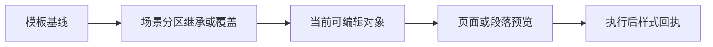
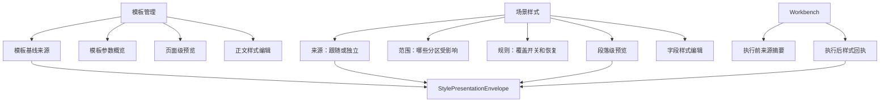

# 样式控件与模板管理语义复用边界深度审计

日期：2026-06-29

## 1. 本轮判断

目前的问题已经不是“有没有复用控件”，而是“复用停在了控件外观层，没有完全进入内容规划和语义生成层”。

模板管理已经形成了较清楚的用户心智：先看当前模板，再看参数概览，再看页面级预览，最后进入具体参数编辑。场景样式区虽然逐步接入了共享控件，但仍然容易给用户一种工程看板感，原因有三类：

1. 同一类信息在不同入口被不同函数生成，用户看到的标题、来源、摘要、动作词不稳定。
2. 样式控件区仍然混合了“范围、开关、编辑、预览、回执”多个任务，边界不如模板管理清楚。
3. 一些面向开发者的计数、key、风险解释还出现在主界面，稀释了用户要做的动作。

优秀设计不只是把视觉卡片调得更像，而是让模板管理、场景分区、执行回执共用同一条语义链路。

## 2. 应统一的产品链路

样式链路应该被统一成一条用户能理解的路径：



这条链路对应的代码边界应该是：

| 用户看到的层 | 共享语义 | 当前主要实现 | 后续方向 |
| --- | --- | --- | --- |
| 模板基线 | 模板作为默认样式来源 | `TemplateConfig`、`build_template_page_presentation_envelope` | 收到 envelope 工厂或独立 projection 层 |
| 场景覆盖 | 分区是否跟随模板，是否独立调整 | `StyleOwnerState`、`StyleRuleControlDeck`、`StyleEditingSection` | 由同一个内容计划决定显示区块 |
| 当前编辑 | 控件归属、可编辑状态、恢复动作 | `StyleEditingSection`、`StyleControlSurface` | 保持控件完全复用，减少业务页私有拼装 |
| 预览 | 标题、来源、摘要、详情、动作 | `StylePresentationEnvelope`、`StylePreview`、`TemplateStylePreview` | 所有 preview 语义只从 envelope 派生 |
| 执行回执 | 本次使用的样式来源和结果说明 | `StyleResultReceiptRow`、`ExecutionResultState.style_source_envelope` | 禁止回退到自由字符串优先 |

## 3. 目前已经打通的部分

本轮之前已经具备的基础：

- `StyleControlSurface` 承担正文排版类字段编辑，不再让模板页和场景页各写一套字段控件。
- `StyleEditingSection` 把归属工具条、状态条、预览、编辑表面包成统一外壳。
- `StyleManagementBlock` 承担样式管理区块的标题、摘要、规则控制、编辑表面。
- `StyleRuleControlDeck` 承担分区独立样式开关和差异提示。
- `StylePresentationEnvelope` 开始承载预览和回执共用的标题、来源、摘要、详情、动作。
- `TemplateStylePreview` 已接入 `template_page` envelope。
- `StylePreview` 已接入 `section_paragraph` envelope。
- Workbench 执行结果状态已带 `style_source_envelope`，执行中心和最近结果面板优先消费 envelope。

这些动作说明底层控件已经开始复用，但还不足以形成优秀体验，因为内容规划仍有分散点。

## 4. 仍然不够好的关键原因

### 4.1 语义生成点还没有完全收束

理想状态是：页面只选择场景和上下文，不直接拼展示文案。当前仍有几个位置会生成展示语义：

- 模板页面级预览由 `src/ui/panels/template_format.py` 的 `build_template_page_presentation_envelope(...)` 生成。
- 场景分区段落预览已经改为由 `StylePresentationEnvelope.from_preview_projection(...)` 生成。
- Workbench 执行回执由 `WorkbenchExecutionAdapter` 根据执行结果生成。

这比之前好，但还不是最终形态。最终应该明确：

- `StylePresentationEnvelope` 或同级 projection 模块负责所有 preview/receipt 文案结构。
- 业务页面只传模板、场景、执行结果，不直接关心标题怎么叫、动作词怎么写。
- `StylePreview`、`TemplateStylePreview`、`StyleResultReceiptRow` 都只消费 envelope，不再自行推断文案。

### 4.2 控件规划还没有完全对齐模板管理

模板管理的结构是“当前对象 -> 参数概览 -> 样式预览 -> 编辑详情”。场景样式区更像“开关、范围、策略、卡片、预览、说明”混在一起。

建议把样式相关功能重新规划为四个稳定板块：

| 板块 | 用户问题 | 应出现的内容 | 不应出现的内容 |
| --- | --- | --- | --- |
| 来源 | 现在样式从哪里来 | 模板名称、跟随或独立、跳转动作 | registry 计数、内部 key |
| 范围 | 影响哪些分区 | 分区列表、全跟随、独立覆盖数量 | 过长实现解释 |
| 编辑 | 我要改哪一组参数 | 选择对象、恢复模板、字段控件 | 与当前对象无关的说明 |
| 预览 | 改完是什么效果 | 页面级或段落级预览、差异摘要 | 技术风险长文案 |

这样才能和模板管理保持一致：模板管理是编辑基线，场景样式是编辑覆盖层，Workbench 回执是执行使用结果。三者不是三个 UI，而是同一条链路的三个状态。

### 4.3 文案还需要继续减负

主界面必须删除或下沉这些内容：

- `template 9 / scene 3 / material 1 / output 2` 这类工程计数。
- `quick_formatting`、`green_l5`、`custom_basic` 这类内部 key。
- “点击各参数行的编辑可跳转”这类说明性句子，应改成明确按钮或行内动作。
- 超过一行半的风险说明，应进入 tooltip、详情弹窗或审计报告。
- 同一区块反复出现“手动控制所有功能开关与处理范围”这类泛化描述。

主界面应该只留下用户决策所需的短句：从哪里来、影响哪里、现在能不能改、改了有什么变化、下一步点哪里。

## 5. 本轮落地调整

本轮做了一个语义边界收口：

1. 在 `src/shared/ui/style_presentation_envelope.py` 新增 `StylePresentationEnvelope.from_preview_projection(...)`。
2. `src/shared/ui/style_editing_section.py` 不再自己拼 `title/source_label/detail/action_label`。
3. `StyleEditingSection.apply_preview_projection(...)` 仍然负责把 projection 交给 `StylePreviewProjection` 绘制，但展示语义统一由 envelope 工厂生成。
4. `tests/test_small_widget_architecture.py` 新增测试，锁定 `section_paragraph` projection 到 envelope 的结果。

追加执行：

5. 新增 `StylePresentationEnvelope.from_template_page(...)`，模板页预览不再由业务页直接构造 envelope。
6. 新增 `StylePresentationEnvelope.from_execution_result(...)`，Workbench 执行回执不再在适配器里拼固定展示词。
7. `TemplateStylePreview` 默认态和 `build_template_page_presentation_envelope(...)` 均改走模板页工厂。
8. `WorkbenchExecutionAdapter` 的样式来源回执改走执行结果工厂。

这个调整的意义是：`StyleEditingSection` 回到控件容器职责，不再承担文案和语义决策。后续模板页、场景页、Workbench 都可以逐步收敛到同一套 envelope 工厂。

追加后，业务代码中已经没有 `StylePresentationEnvelope(...)` 直接构造点；直接构造只保留在共享 envelope 内部和测试样例中。

再次追加：

9. 固定展示词已经集中为 `STYLE_PRESENTATION_*` 常量，包括 `template_page`、`section_paragraph`、`execution_receipt`、`样式预览`、`模板基线`、`样式来源`、`本次使用`、`调分区`、`当前模板`。
10. 新增业务直构守门测试，禁止 `src/shared` 和 `src/ui` 中重新出现 `StylePresentationEnvelope(...)`。

这意味着后续改文案、改状态词、改动作词时，不需要再搜业务页面；共享语义层成为唯一入口。

继续追加：

11. 新增 `StyleManagementContentPlan` 和 `style_management_content_plan(...)`，把样式管理区的内容板块显式声明为 `source/scope/rules/editor/preview/receipt`。
12. `StyleManagementBlock` 会同步 `style_management_content_plan` 与 `style_management_has_*` Qt 属性。
13. `template_baseline_edit` 当前计划为 `source|scope|editor`；`scene_section_rules` 当前计划为 `source|scope|rules|difference|editor|preview`。

这一步还没有重排 UI，但已经把“模板正文、场景分区、只读复核分别应该有哪些板块”变成可测试契约。

继续追加：

14. `StyleManagementBlock` 新增 `preview_slot` 和 `receipt_slot` 命名槽位。
15. 传入命名槽位时，`StyleManagementContentPlan` 会自动开启 `preview` / `receipt` 板块。
16. 新增架构测试锁定命名槽位，后续页面不必再用 `management_widgets` 承载预览或回执。
17. `management_widgets` 降级为 legacy 兼容入口，新增 `legacy_management_widgets` 与 `style_management_has_legacy_widgets` 审计属性。
18. 新增业务代码守门测试，禁止 `src/shared` 和 `src/ui` 调用方继续使用 `management_widgets=`。
19. 模板正文详情真实页面已锁定 `source|scope|editor`，且不允许 legacy 自由插入。
20. 场景分区样式真实页面已锁定 `source|scope|rules|difference|editor|preview`，且不允许 legacy 自由插入。

## 6. 下一轮最必要的功能与重构

### P0：把所有 preview/receipt 语义生成收进共享层

新增或迁移以下工厂：

- `StylePresentationEnvelope.from_template_page(...)`
- `StylePresentationEnvelope.from_execution_result(...)`
- `StylePresentationEnvelope.from_style_source_projection(...)`

目标是让这些文件少做展示文案拼接：

- `src/ui/panels/template_format.py`
- `src/ui/adapters/workbench_execution_adapter.py`
- `src/ui/panels/style_source_projection.py`

验收标准：

- 业务页面不直接实例化 `StylePresentationEnvelope(...)`，除非是在共享语义工厂内部。
- 模板预览、分区预览、执行回执的 Qt 属性名一致。
- 同一个样式来源在三个入口显示同一组状态词。

### P0：建立样式管理内容计划

建议新增一个轻量内容计划对象，例如：

```text
StyleManagementContentPlan
```

它不负责渲染，只负责告诉页面应该出现哪些板块：

- source：样式来源
- scope：影响范围
- rules：覆盖规则
- editor：字段编辑
- preview：预览
- receipt：执行后回执

模板管理、场景分区、Workbench 只选择不同 plan，而不是各自组织控件。

### P1：统一状态词和动作词

建议集中维护状态词：

| 语义 | 标准文案 |
| --- | --- |
| template_baseline | 模板基线 |
| follows_template | 跟随模板 |
| independent_style | 独立样式 |
| editable | 可编辑 |
| readonly_review | 只读复核 |
| current_run | 本次使用 |
| adjust_section | 调分区 |
| open_template | 看模板 |
| edit_body | 编辑正文 |

这些词不应散落在 UI 类里。至少要由 projection 或 envelope 统一生成。

### P1：统一预览控件的层级职责

`TemplateStylePreview` 和 `StylePreview` 不需要长得完全一样，但需要共享同一层语义：

- `kind`
- `title`
- `source_label`
- `summary`
- `detail`
- `action_label`

页面级预览负责纸张、页边距、页眉页脚；段落级预览负责字体、行距、缩进、对齐。差异只在绘制层，不在文案层。

### P2：继续清理主界面冗余文本

建议下一轮用静态检查或测试约束这些规则：

- 主界面不显示裸 key。
- 主界面不显示 registry 计数。
- 主界面卡片正文不超过两行，超出进入详情。
- 操作入口用按钮或行内动作，不用说明句替代按钮。
- `Tooltip` 可以解释原因，主界面只给结论。

## 7. 建议的最终信息架构



优秀版本的感受应该是：

- 模板管理告诉用户“默认长什么样”。
- 场景样式告诉用户“这个场景哪里偏离默认”。
- Workbench 告诉用户“这次实际用了哪套样式”。

三处都说同一种话，只是站在不同阶段。

## 8. 本轮验证

已执行：

```powershell
python -X utf8 -m py_compile src/shared/ui/style_presentation_envelope.py src/shared/ui/style_editing_section.py tests/test_small_widget_architecture.py
```

结果：通过。

```powershell
python -X utf8 -m pytest tests/test_small_widget_architecture.py::test_style_presentation_envelope_builds_section_paragraph_from_projection tests/test_small_widget_architecture.py::test_style_editing_section_wraps_owner_preview_and_surface -q
```

结果：

```text
2 passed
```

## 9. 本轮结论

本轮把分区预览的语义生成从控件外壳移到了共享 envelope，这是向“模板管理和样式控件高度复用”迈出的必要一步。

但距离优秀设计还差两件事：

1. 所有 preview/receipt 语义必须继续收进共享层。
2. 样式管理区必须从“控件堆叠”升级为“来源、范围、规则、编辑、预览、回执”的内容计划。

只有做到这两点，界面才会从“工程功能很多”变成“用户一眼知道自己在调哪套样式、影响哪里、结果是什么”。
