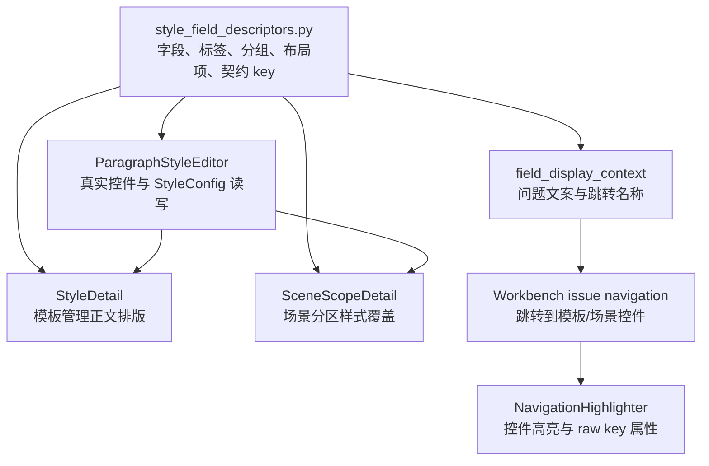

# 样式控件表面与模板管理同构复用深度分析

日期：2026-06-28

## 结论

当前已经不是“完全没有复用”的状态。项目里已经有共享字段描述符、共享段落样式编辑器、字段显示上下文、工作台跳转投影和导航高亮属性，说明底层链路开始打通。

但距离优秀设计仍有明显差距：现在复用停在“字段和控件”这一层，用户真正看到的“样式板块表面”还没有和模板管理同构。模板管理把正文排版拆成“文字样式 / 对齐与缩进 / 行距与段距”三张清晰卡片；场景规划虽然复用了 `ParagraphStyleEditor`，但把它放进“样式覆盖”这张混合卡里，再叠加覆盖分区、编辑分区、提示、段落预览和摘要。结果是：代码知道两边是同一套控件，用户却看不出来。

下一步应该把复用层级上移：从“复用控件”升级为“复用样式控件表面”。模板管理和场景规划都不直接拼装字段行列，而是共同投影到一套 `StyleControlSurface`。模板管理注入“保存 / 恢复正文默认样式”，场景规划注入“选择分区 / 启用覆盖 / 恢复模板”，控件板块、字段顺序、标签、预览语义、跳转高亮都来自同一个源。

## 当前链路盘点



### 已经打通的部分

| 链路 | 状态 | 依据 |
| --- | --- | --- |
| 字段归一 | 已打通 | `src/config/style_field_descriptors.py` 能把 `template.styles.body.font_name`、`scene.section_styles.*.line_spacing_value` 等归一为同一字段 |
| 控件实例 | 已打通 | `src/shared/ui/paragraph_style_editor.py` 统一创建 `FontCombo`、`SizeCombo`、`SpacingInput`、`IndentInput`、`ToggleSwitch` |
| 模板详情字段布局 | 基本打通 | `src/ui/panels/template_style_detail.py` 通过 `style_field_layout_rows()` 构造三组卡片 |
| 场景样式编辑字段布局 | 基本打通 | `SceneScopeDetail` 内嵌 `ParagraphStyleEditor`，字段顺序来自同一描述符 |
| 问题跳转和显示名 | 已打通 | `field_display_context()` 和 `workbench_issue_navigation.py` 能携带 `layout_item_id`、`field_ids`、`control_contract_key` |
| 高亮诊断属性 | 已打通 | `NavigationHighlighter` 将普通显示名和 raw key 分层保存到 widget property |

### 仍未真正打通的部分

| 断点 | 现在的问题 | 应该达到的状态 |
| --- | --- | --- |
| 样式板块表面 | 模板是三张卡，场景是一个混合卡内嵌编辑器 | 两边都由同一个 `StyleControlSurface` 渲染三组字段 |
| 容器层复用 | `StyleDetail` 手工建 `InspectorForm`，场景直接使用 `ParagraphStyleEditor` 默认布局 | owner 只传配置，卡片、表单、行列、suffix、启停状态都由共享表面负责 |
| 预览层 | 模板用页面级 `TemplateStylePreview`，场景用轻量 `StylePreview`，缺少共同预览契约 | 保留两类预览，但共享 `StylePreviewProjection`，明确“页面效果”和“分区覆盖效果”的边界 |
| 状态摘要 | 模板摘要、场景覆盖摘要、工作台问题摘要各自拼文案 | 摘要项从同一个字段/覆盖投影生成，普通 UI 不出现 raw key |
| 控件定位 | `ParagraphStyleEditor.widget_for_field()` 已可用，但 layout item 到 widget 的映射仍有重复实现 | 暴露 `widget_for_layout_item()` 或统一 mapping，页面不再复制 `_layout_widget_for_item()` |
| 模式字段 | descriptor 里已有 `visible_in_standard_mode` / `visible_in_diagnostic_mode`，但 UI 还未真正使用 | 普通模式、诊断模式、只读模式由表面层统一控制 |

## 为什么用户仍觉得“不像同一套系统”

### 1. 复用的是底层控件，不是用户看见的结构

模板管理的用户模型是：

1. 文字样式
2. 对齐与缩进
3. 行距与段距

场景规划的用户模型现在更像：

1. 处理范围
2. 样式覆盖
3. 覆盖分区
4. 编辑分区
5. 一段提示
6. 小预览
7. 一整块样式编辑器

这些控件确实来自同一个 `ParagraphStyleEditor`，但用户要自己推理“这里的编辑样式，其实就是模板管理里的正文排版”。优秀设计不应该让用户做这种翻译。

### 2. 场景覆盖同时承载了三种职责

`SceneScopeDetail` 的“样式覆盖”区域现在混合了：

- 处理范围的派生状态：当前分区是否启用。
- 样式覆盖的所有权状态：跟随模板还是当前场景独立覆盖。
- 样式字段编辑：字体、字号、缩进、行距等具体控件。

这三件事都需要存在，但不应该挤在同一层文案里。更清晰的边界是：

| 层级 | 用户问题 | UI 组件 |
| --- | --- | --- |
| 分区选择 | 我要改哪个部分？ | 分区下拉/列表 |
| 覆盖关系 | 它是跟随模板，还是只在本场景独立？ | 覆盖开关 + 状态摘要 |
| 样式编辑 | 具体改哪些排版项？ | 与模板管理同构的三组样式控件 |

### 3. 模板预览和场景预览的关系没有说明清楚

模板管理的 `TemplateStylePreview` 负责页面级结果：纸张、页边距、页眉页脚、标题层级、表格和正文在同一页上的整体效果。

场景里的 `StylePreview` 负责分区段落覆盖：当前分区的字体、字号、字形、缩进、行距是否跟模板一致。

这两个预览职责不同，不需要合并成一个控件。但它们需要共享一套“预览投影语义”：

- 预览的是哪个 owner：模板正文 / 场景分区。
- 当前样式来源：模板有效样式 / 当前场景覆盖。
- 差异项：中文字体、字号、行距等字段名必须来自 `style_field_descriptors.py`。
- 阻断状态：未启用分区、未开启覆盖时，编辑控件只读，预览仍显示有效样式。

## 目标架构

### 新增共享表面层

建议新增一个共享表面模块，例如：

`src/shared/ui/paragraph_style_surface.py`

核心对象可以是：

```python
@dataclass(frozen=True)
class StyleControlSurfaceSpec:
    owner_kind: str
    title: str
    subtitle: str
    style: StyleConfig | None
    editable: bool
    readonly_reason: str
    active_variant_key: str
    active_variant_label: str
    source_label: str
    summary_items: tuple[SummaryGridItem, ...]
    actions: tuple[StyleSurfaceAction, ...]
    preview_mode: str
```

共享表面负责：

- 使用 `style_field_group_descriptor()` 渲染板块标题和图标。
- 使用 `style_field_layout_rows()` 渲染字段行列。
- 使用 `ParagraphStyleEditor` 提供真实控件。
- 统一设置字段启停、Tooltip、高亮属性。
- 统一处理 `line_spacing_pt` suffix。
- 统一输出 `widget_for_field()` / `widget_for_layout_item()`。

owner 只负责：

| owner | 负责内容 |
| --- | --- |
| 模板管理 | 传入 `TemplateConfig.styles["body"]`，处理保存、恢复、dirty state |
| 场景规划 | 传入有效分区样式，处理分区选择、启用覆盖、恢复模板、scope_changed |
| 工作台 | 传入 target key，使用 surface 暴露的定位 API 高亮控件 |

### 同构后的模板管理

模板管理仍保留当前信息架构：

- 顶部：`正文排版` 摘要卡，动作是“恢复”“保存”。
- 主体：共享样式表面，三组字段完全由 descriptor 决定。
- 预览：页面级 `TemplateStylePreview` 继续服务模板总览或样式预览区。

这里的变化主要是删掉模板详情里重复的行列拼装，让 `StyleDetail` 不再自己实现 `_layout_widget_for_item()` 和 `_add_style_layout_grid()`。

### 同构后的场景规划

场景规划建议重排为：

1. 处理范围：只回答“哪些文档分区会被处理”。
2. 样式覆盖：只回答“哪个分区跟随模板，哪个分区独立覆盖”。
3. 共享样式表面：在“样式覆盖”内显示，与模板管理同构。

具体结构：

| 区域 | 内容 | 文案原则 |
| --- | --- | --- |
| 分区选择栏 | 分区下拉 + 覆盖开关 + 恢复模板 | 不写长说明，状态用摘要表达 |
| 状态摘要 | 跟随模板 / 已覆盖 N 项 / 未处理 | 不显示 raw key |
| 分区预览 | `StylePreview`，显示当前有效样式 | Tooltip 只说来源和差异项 |
| 样式字段 | 文字样式、对齐与缩进、行距与段距 | 与模板管理完全同序、同名、同控件 |
| 跳转动作 | “去模板管理调整正文默认样式” | 只在跟随模板时强调 owner 边界 |

应删除或收敛的冗余文本：

- “编辑样式”：可以由板块标题和分区选择表达。
- “覆盖分区”：可以并入分区选择栏。
- “默认跟随模板；只有需要让某个分区不同于模板时开启覆盖。”：改为状态摘要或开关 Tooltip。
- 多处重复的“只影响当前场景，不修改模板默认格式”：保留一处，在 owner boundary 摘要或 Tooltip 中即可。

## 功能边界重新划分

### 模板管理是样式母版

模板管理拥有：

- 正文默认样式。
- 标题、表格、目录、参考文献等模板级样式。
- 页面级预览。
- 样式保存和模板库写回。

场景不应该重新定义“正文字体是什么”，只能在必要时创建“当前场景的分区覆盖”。

### 场景规划是样式覆盖投影

场景规划拥有：

- 当前场景处理哪些分区。
- 哪些分区需要覆盖模板默认样式。
- 覆盖值只影响当前场景，不反写模板库。
- 输出前问题定位到同一组样式控件。

场景页不应该承担模板母版说明，不应该把模板字段重新命名为另一套概念。

### 工作台是修复入口，不是字段解释器

工作台只需要告诉用户：

- 问题影响哪个样式板块。
- 应该去模板管理还是场景规划处理。
- 点击后能定位到对应控件。

工作台不应该自己拼“中文字体 / 正文字号 / 行距值”等文案。所有文案必须来自 `field_display_context()`，所有诊断身份必须留在上下文或高级证据里。

### 高级证据承接工程细节

普通 UI 不显示：

- raw field path
- layout item id
- control contract id
- source file
- fixture/sample id
- registry id

这些信息应该保存在 widget property、issue context、高级证据和测试断言里。

## 迁移路线

### 第一阶段：抽共享表面，不改变行为

新增 `StyleControlSurface`，内部仍使用 `ParagraphStyleEditor`。先让它能渲染三组字段、返回字段控件、支持只读状态和高亮。

验收：

- `StyleControlSurface` 渲染出的三组字段与 `style_field_layout_rows()` 完全一致。
- `widget_for_field("template.styles.body.bold")` 能返回字形控件。
- `widget_for_layout_item("line_spacing_pt")` 能返回行距值控件。

### 第二阶段：模板管理切换到共享表面

`StyleDetail` 保留摘要卡、保存、恢复、dirty state，但字段卡片交给共享表面。

验收：

- 模板管理视觉顺序不变。
- 现有 `test_template_style_detail.py` 布局测试继续通过。
- `StyleDetail` 中不再出现重复的 `_layout_widget_for_item()`。

### 第三阶段：场景样式覆盖切换到共享表面

`SceneScopeDetail` 保留处理范围和分区覆盖逻辑，但样式字段区改为共享表面。分区选择和覆盖开关作为 owner toolbar 注入。

验收：

- 场景页字段顺序、板块标题、控件类型与模板管理一致。
- 跟随模板时控件只读，预览仍显示有效样式。
- 开启覆盖后控件可编辑，写回 `scene.section_styles[variant_key]`。
- 恢复模板后删除对应 section style。

### 第四阶段：预览投影统一

抽出样式预览投影，保留两个渲染器：

- `TemplateStylePreview`：页面级。
- `StylePreview`：段落级。

它们共享字段差异、样式来源、sample text 和只读状态描述。

验收：

- 场景预览 Tooltip 不再自己拼字段名。
- 模板预览和场景预览都能显示同一套差异字段名称。

### 第五阶段：工作台和高级证据收口

所有 `template_style_field` / `scene_style_field` 的普通文案只使用 `FieldDisplayContext.label_with_group()`。

验收：

- 普通问题卡片不出现 `template.styles.*`、`scene.section_styles.*`、`body.line_spacing`。
- 高级证据仍能看到 raw key、layout item、contract key。
- 点击工作台问题能跳转到同一个共享表面内的同一个控件。

## 测试护栏

建议补以下测试，避免后续再次漂移：

1. 源码护栏：除 `style_field_descriptors.py` 外，禁止页面硬编码“中文字体 / 英文字体 / 字号 / 字形 / 对齐 / 特殊缩进 / 左缩进 / 右缩进 / 行距类型 / 行距值 / 段前 / 段后”这一组样式字段标签。
2. 源码护栏：除 `ParagraphStyleEditor` 或共享表面外，禁止页面直接实例化 `FontCombo`、`SizeCombo`、`SpacingInput`、`SpecialIndentInput`、`IndentInput`、`ToggleSwitch`。
3. 结构测试：模板管理和场景规划的样式字段 rows、labels、item ids 完全一致。
4. 跳转测试：同一个字段在 `template_style_field` 和 `scene_style_field` 下得到相同 `layout_item_id`。
5. 视觉测试：窄屏下三组样式字段不换成另一套顺序，不出现文本重叠。
6. 文案测试：普通 UI 不出现 raw key、contract id、registry id；诊断上下文必须保留。

## 优先级

| 优先级 | 项目 | 原因 |
| --- | --- | --- |
| P0 | 抽共享 `StyleControlSurface` | 这是让模板管理和场景规划真正一致的关键 |
| P0 | 删除模板/场景重复布局映射 | 避免字段新增后两边漂移 |
| P1 | 场景样式覆盖区重排 | 直接改善用户“不说人话”的感受 |
| P1 | 统一预览投影 | 让“页面预览”和“分区预览”边界清晰 |
| P2 | 高级证据收口 | 防止工程语继续污染普通界面 |

## 本轮判断

链路并不是没打通，而是只打通到了“可执行”和“可跳转”，还没有打通到“可感知的一致”。用户不关心 `ParagraphStyleEditor` 是否被复用，用户只看见两个页面是不是同一个语言体系、同一个板块秩序、同一个控件行为。

因此后续优化的判断标准应该从“代码是否复用了控件类”提升为：

1. 用户看到的板块是否同构。
2. 字段顺序是否同源。
3. 预览语义是否同源。
4. 问题跳转是否落到同一控件。
5. 普通文案是否只说用户能行动的内容。
6. 工程诊断是否完整保留但不打扰普通路径。

做到这一层，场景规划的样式区才会真正像模板管理的自然延伸，而不是另一个披着相同控件的页面。
