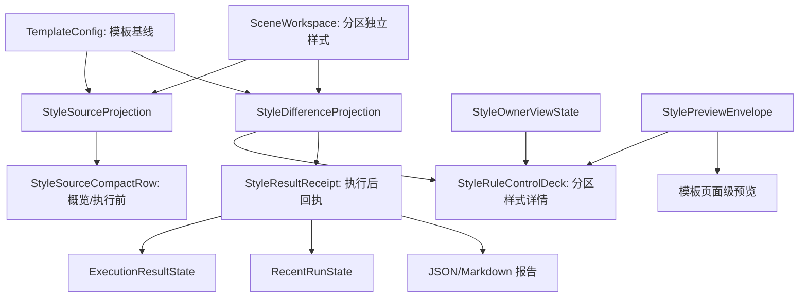

# 样式控件规划与模板管理一致性复用再审计

日期：2026-06-29

## 1. 本轮结论

这一轮重新对比了模板管理、场景规划和 Workbench 的样式链路。当前已经不是“完全没有复用”的阶段：`StyleManagementBlock`、`StyleEditingSection`、`StyleSourceProjection`、`StyleSourceCompactRow`、`StyleDifferenceProjection` 都已经存在，并且已经分别接入模板管理、场景概览、分区样式和 Workbench 执行前复核。

但用户仍会觉得“不像一套东西”，原因是复用停在了控件零件层，还没有上升为统一的“样式管理产品语法”：

```text
模板管理负责定义基线。
场景规划只表达当前场景相对基线的偏离。
Workbench 只做执行前复核和执行后回执。
```

现在三者在代码里已经有交集，但页面板块、状态语言、预览层级、执行结果回流仍没有完全同构。真正要继续推进的不是继续加说明文字，而是把“来源、差异、预览、编辑、回执”收成同一套契约。

## 2. 当前已经做对的部分

| 层级 | 当前实现 | 判断 |
| --- | --- | --- |
| 样式字段表单 | `StyleControlSurface -> ParagraphStyleEditor` | 已经由共享外壳创建，方向正确 |
| 样式编辑外壳 | `StyleEditingSection` | 已承载 owner 状态、分区选择、预览和字段表单 |
| 样式管理块 | `StyleManagementBlock` | 已成为模板正文和场景分区样式的共同入口 |
| 样式来源投影 | `StyleSourceProjection` | 已统一模板、场景、Workbench 执行前样式来源 |
| 字段差异投影 | `StyleDifferenceProjection` | 已从 UI 下沉到 config 层，可供概览、详情和报告复用 |
| 执行报告 | `style_source_report_summary` 写入 JSON/Markdown | 文件回执已经有样式来源 |

这说明底层方向是对的。下一步不能推翻这些组件，而是要给它们补一个更清楚的上层规划。

## 3. 仍然不够好的根因

### 3.1 复用了控件，没有复用页面语法

模板正文排版页使用 `StyleManagementBlock` 时关闭了 owner toolbar 和预览，用户看到的是“摘要 + 字段表单 + 保存/恢复”。

场景分区样式页也使用 `StyleManagementBlock`，但额外插入了独立样式开关、差异条、编辑分区、恢复模板、全部跟随模板、预览和折叠字段区。

Workbench 只使用 `StyleSourceCompactRow`，执行前能看到来源，但执行后结果面板还没有样式来源字段。

因此三者不是同一套阅读顺序：

| 入口 | 当前阅读顺序 | 问题 |
| --- | --- | --- |
| 模板管理 | 当前模板 -> 参数概览 -> 模板预览 -> 字段编辑 | 稳定，但样式来源/owner 语法在正文页被弱化 |
| 场景规划 | 当前场景 -> 关键设置 -> 样式来源 -> 分区样式详情 | 能跳转，但样式规则仍像场景特有配置 |
| Workbench | 场景模板选择 -> 样式来源 -> 执行结果 | 执行前有样式来源，执行后没有同源回执 |

用户感受到的不一致，来自这套阅读顺序没有统一。

### 3.2 “模板预览”和“分区预览”仍是两套心智

模板管理的 `TemplateStylePreview` 是页面级预览，回答的是：

```text
这个模板整体长什么样。
```

分区样式里的 `StylePreview` 是段落级预览，回答的是：

```text
当前分区有效样式长什么样。
```

两者都合理，不应该强行合成一个控件。但它们必须被放进同一个预览契约里：

| 预览类型 | 回答的问题 | 应该出现的位置 |
| --- | --- | --- |
| 页面级预览 | 模板基线的整体页面效果 | 模板概览、看模板入口 |
| 段落级预览 | 当前分区有效样式效果 | 场景分区样式详情 |
| 差异预览 | 当前分区和模板哪里不同 | 场景详情、Workbench 复核、执行报告 |

当前缺的是第三类“差异预览”的稳定产品位置。概览已有字段级短标签，详情已有差异条，但还没有被统一包装成一个跨入口的 `StyleDiffPreview` 或 `StyleDifferenceReceipt`。

### 3.3 执行链路没有完全闭合

执行报告已经能写入：

```text
本次按模板“默认格式”处理；参考文献（行距）使用场景独立样式。
```

但 Workbench 的状态对象仍没有样式来源字段：

- `ExecutionResultState` 没有 `style_source_summary`
- `RecentRunState` 没有 `style_source_summary`
- `WorkbenchExecutionAdapter.build_result_state()` 不接收样式来源 payload
- `ExecutionCenter.set_result_state()` 不展示样式来源回执
- `RecentRunPanel.set_state()` 不展示样式来源回执
- `WorkbenchProductionRunner._payload_from_result()` 当前写报告时使用 `style_source_summary`，但返回 payload 时没有把它带回 UI

这会造成用户执行完成后只能去报告里找“到底按哪个模板、哪些分区独立了”。优秀交互不应该让用户执行后丢失执行前看到的关键信息。

### 3.4 控件名称仍带着历史边界

`TemplateSummaryCard` 已经被 `StyleManagementBlock` 用作共享摘要卡，但名字仍是模板专属。短期不影响运行，长期会让新增页面误以为这是模板私有组件。

同类问题还有：

| 当前命名/位置 | 风险 |
| --- | --- |
| `TemplateSummaryCard` | 实际已是通用详情摘要卡，但命名仍指向模板 |
| `StyleSourceCompactRow` | 适合 50px 行，但不足以承载执行后回执和差异详情 |
| `management_widgets` | 可插入任意控件，缺少“独立样式控制区 / 差异区”的类型约束 |
| Workbench 高级摘要长串 | 仍混有能力数、证据、成熟度等系统信息，和模板管理的清爽结构不一致 |

组件名和 API 不清晰时，后续开发会继续把“相似但不一样”的小控件塞进页面。

## 4. 应重新规划的四层契约

### 4.1 L0：样式语义投影层

这一层必须完全脱离 UI，供模板、场景、Workbench、报告共同消费。

建议形成下面几类稳定对象：

| 投影 | 当前状态 | 后续目标 |
| --- | --- | --- |
| `StyleSourceProjection` | 已有 | 继续作为“模板基线 + 分区状态 + 动作”的轻量摘要 |
| `StyleDifferenceProjection` | 已有 | 成为概览、详情、Workbench、报告唯一差异来源 |
| `StyleOwnerViewState` | 已有 | 统一“谁控制、影响哪里、是否可编辑” |
| `StylePreviewProjection` | 已有段落级 | 补页面级/差异级的统一 envelope |
| `StyleResultReceipt` | 缺失 | 执行后 UI 和报告共用的样式来源回执 |

这里的核心原则是：任何入口都不应该再手写“模板：默认格式；分区：1 个分区独立设置”这类字符串。

### 4.2 L1：共享控件层

共享控件不应只提供散件，而要提供稳定组合。

| 控件 | 职责 | 调整建议 |
| --- | --- | --- |
| `StyleSourceCompactRow` | 50px 轻量来源入口 | 保留，用于概览和执行前复核 |
| `StyleManagementBlock` | 摘要、控制、预览、字段表单的组合块 | 增加 mode 语义，避免模板和场景各自关闭/插入控件后失去同构 |
| `StyleEditingSection` | owner、预览、字段表单外壳 | 保持底层，不继续扩大职责 |
| `StyleRuleControlDeck` | 缺失 | 新增，用于承载独立样式开关、差异条、批量恢复 |
| `StyleResultReceiptRow` | 缺失 | 新增或扩展，用于执行结果展示样式来源 |

`management_widgets` 目前太自由。分区样式现在把 toggle list 和 comparison strip 都作为普通 widget 插进 summary card，短期可用，但长期应被收束为 `StyleRuleControlDeck`，这样模板页和场景页可以复用同一套板块位置。

### 4.3 L2：页面适配层

模板、场景、Workbench 不应该各自决定控件结构，只应该选择模式。

| 页面 | 模式 | 应显示 |
| --- | --- | --- |
| 模板管理概览 | `template_baseline_overview` | 样式来源、页面级预览、参数章节入口 |
| 模板正文排版 | `template_baseline_edit` | owner 状态、摘要、字段表单、保存/恢复 |
| 场景概览 | `scene_style_summary` | 样式来源轻量行、看模板、调分区 |
| 场景分区样式 | `scene_section_rules` | 独立样式控制、差异、段落预览、字段表单 |
| Workbench 执行前 | `execution_review` | 只读样式来源、必要跳转 |
| Workbench 执行后 | `execution_receipt` | 本次实际使用的模板和分区独立样式 |

这样页面差异来自 mode，而不是每个页面手动拼布局。

### 4.4 L3：守门测试层

一致性必须靠测试守住，不能靠开发者记忆。

建议新增或强化这些守门：

| 守门类型 | 规则 |
| --- | --- |
| 结构守门 | `StyleControlSurface` 只能由 `StyleEditingSection` 创建 |
| 投影守门 | 样式来源主界面只能来自 `StyleSourceProjection` |
| 差异守门 | 分区字段差异只能来自 `StyleDifferenceProjection` |
| 文案守门 | 主界面不得出现工程 key、registry 计数、长风险解释 |
| 状态守门 | 统一状态词：`跟随模板`、`分区已调整`、`模板基线`、`只读复核` |
| 回执守门 | 执行前看到样式来源，执行后 UI 和报告必须能看到同一摘要 |
| 视觉守门 | 模板概览、模板正文、场景概览、分区样式、Workbench 执行前/后都要有截图审计 |

## 5. 建议的新信息架构

### 5.1 模板管理

模板管理应该始终是“基线中心”：

```text
当前模板
-> 样式来源：模板基线
-> 页面级预览
-> 参数章节：页面 / 正文 / 标题 / 表格 / 页眉页脚 / 目录 / 参考文献 / 题注
-> 具体编辑页
```

正文排版页不一定要展示完整分区选择，但应该保留同一套 owner/status 位置，让用户知道：

```text
当前编辑的是模板默认正文样式，会影响所有跟随此模板的场景。
```

这比完全隐藏 owner chrome 更一致。

### 5.2 场景规划

场景规划只表达“当前场景怎么使用模板基线”：

```text
场景概览
-> 样式来源：模板 + 分区差异短摘要
-> 看模板：回到模板基线
-> 调分区：进入分区样式
```

分区样式详情建议固定为：

```text
分区样式
-> 来源与影响：当前场景 / 当前分区 / 是否跟随模板
-> 独立样式控制：哪些分区从模板中独立出来
-> 差异：和模板不同的字段
-> 预览：当前分区有效样式
-> 字段表单：仅在可编辑时展开
```

不要把样式规则再塞回“处理范围”。处理范围只回答“哪些区域会处理”，分区样式只回答“这些区域样式是否跟随模板”。

### 5.3 Workbench

Workbench 应该分成执行前和执行后两种样式表达。

执行前：

```text
样式来源
模板：默认格式，作为执行基线
分区：参考文献（特殊缩进、行距）
```

执行后：

```text
样式回执
本次按模板“默认格式”处理；参考文献（特殊缩进、行距）使用场景独立样式。
```

执行前可以有“看模板 / 调分区”，执行后不应该再把结果摘要变成编辑入口堆叠。执行后主要是确认和追溯，必要时提供报告入口。

## 6. 冗余文本删除边界

主界面只保留用户决策需要的信息：

| 保留 | 移入 tooltip / 诊断 / 报告 |
| --- | --- |
| 模板名 | 模板文件路径、配置 id |
| 分区跟随状态 | registry 数量 |
| 差异字段短标签 | 原始字段 key |
| 当前影响范围 | 审计证据来源 |
| 看模板 / 调分区 / 恢复模板 | 复杂规则解释 |
| 执行后样式回执 | 全量 JSON payload |

建议强制限制：

- 样式来源主行最多两行。
- 分区差异最多显示两个字段，超过后用“等”。
- 禁用原因超过 12 个中文字符进入 tooltip。
- Workbench 高级摘要不再把能力数、证据、成熟度全部拼成一行。
- 任何“template 9 / scene 3 / material 1 / output 2”这类工程统计不进入首屏主文案。

## 7. P0/P1 落地计划

### P0：执行后样式回执回流 UI

目标：执行前看到的样式来源，执行后仍能在 UI 里看到。

建议改动：

- `WorkbenchProductionRunner._payload_from_result()` 成功和失败 payload 都带上 `style_source`。
- `WorkbenchExecutionAdapter.build_result_state()` 接收 `style_source` 或 `style_source_summary`。
- `ExecutionResultState` 增加 `style_source_summary` 和可选结构化 payload。
- `RecentRunState` 同步增加样式来源摘要。
- `ExecutionCenter` 与 `RecentRunPanel` 在结果摘要中展示“样式回执”。

验收：

```text
执行前：样式来源显示模板和分区差异。
执行后：执行摘要显示同一模板和同一分区差异。
报告：JSON/Markdown 的 style_source 与 UI 摘要一致。
```

### P0：统一 StyleManagementBlock 的模式契约

目标：模板正文和场景分区样式不是各自拼参数，而是选择不同 mode。

建议新增：

```text
StyleManagementMode
- template_baseline_edit
- scene_section_rules
- readonly_review
```

或者先用轻量配置对象：

```text
StyleManagementContract
- summary_kind
- source_kind
- preview_kind
- rule_controls_kind
- editable_policy
```

验收：

- 模板正文页和场景分区样式页的主结构顺序一致。
- 模板页不再完全隐藏 owner/status 语义，只是以模板基线模式展示。
- 场景页不再把 toggle/diff 当任意 `management_widgets` 插入。

### P1：抽 StyleRuleControlDeck

目标：把分区样式的独立样式开关、差异条、全部跟随模板、撤销恢复收成一个共享控制区。

验收：

- `SceneStyleOverrideSection` 不直接管理 toggle list 和 comparison strip 的布局。
- 后续如果模板管理要展示“哪些场景覆盖了此模板”，可以复用只读 deck。
- 批量恢复、差异确认、只读提示都在 deck 内统一。

### P1：统一预览 envelope

目标：不合并 `TemplateStylePreview` 和 `StylePreview`，但统一它们的输出语义。

建议：

```text
StylePreviewEnvelope
- kind: page / paragraph / difference
- title
- source_label
- projection
- empty_text
```

验收：

- 模板概览的页面预览和分区样式的段落预览都能声明自己回答的问题。
- Workbench 执行前不需要展示完整预览，只展示差异摘要。
- 场景分区详情可以扩展对照预览，而不改概览行。

### P2：泛化 TemplateSummaryCard 命名

目标：组件名与实际用途一致。

建议：

- 新增 `DetailSummaryCard` 或 `ManagementSummaryCard`。
- `TemplateSummaryCard` 保留兼容别名。
- 新代码优先使用泛化名称。

验收：

- 样式管理、场景管理、Workbench 详情页不再依赖模板专属命名。
- 测试逐步从模板名迁移到通用名。

## 8. 推荐最终链路



这条链路里，模板、场景和 Workbench 不再各自解释“样式来源”。它们只是在不同上下文消费同一套投影。

## 9. 本轮最终判断

当前项目已经把“样式控件复用”推进到中后段，但距离优秀设计还差最后一层产品契约。

不要再只改字、调 spacing、继续压缩单个卡片。下一轮应该优先做两件事：

1. 把执行报告里的样式来源回流到 Workbench 结果 UI，闭合“配置 -> 执行 -> 回执”。
2. 把 `StyleManagementBlock` 从“共享布局容器”升级为“模板基线 / 场景分区 / 执行只读”的模式化契约。

只有这样，样式、控件、页面板块才会真正和模板管理保持一致，并且后续新增功能不会继续分叉成相似但不复用的局部实现。
