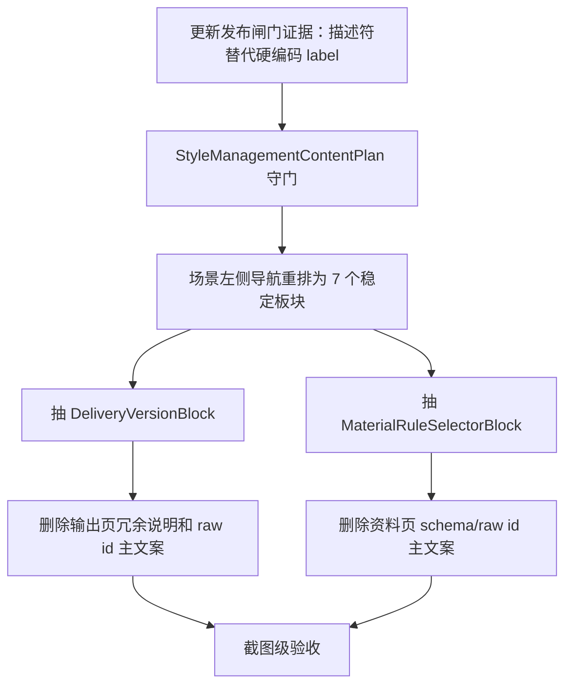

# 样式控件规划与模板管理一致性复用第七轮深度分析

日期：2026-06-30

## 1. 本轮结论

这轮继续沿着用户反馈“样式、控件规划仍没有和模板管理保持一致性与高度复用”往下审。结论比前几轮更明确：

当前项目已经不是“没有共享控件”，而是“共享控件没有成为页面规划的硬约束”。底层已经出现了 `StyleManagementBlock`、`StylePolicyControlDeck`、`StylePolicyToggleList`、`StylePreviewSurface`、`ParagraphStyleEditor`、`TemplateFormStack` 这些复用对象；但场景规划页仍允许很多详情页自由拼装说明、摘要、表单、证据和高级配置。结果是代码上复用了控件，用户感知上仍像在读一张工程配置表。

要真正接近优秀设计，下一步不应该继续增加解释文本，而应该把页面重新规划为稳定槽位：

```text
来源 -> 对象/范围 -> 策略 -> 编辑 -> 预览 -> 结果/回执 -> 高级证据
```

模板管理、场景规划、Workbench 执行前复核都应按同一套槽位表达，只是可编辑性和内容密度不同。

## 2. 本轮证据

### 2.1 已经具备的复用基础

| 复用层 | 代码证据 | 当前判断 |
| --- | --- | --- |
| 样式页面容器 | `src/shared/ui/style_management_block.py` | 已有模式契约和内容计划，是后续统一页面蓝图的核心 |
| 样式策略控件 | `src/shared/ui/style_policy_control_deck.py`、`src/shared/ui/style_policy_toggle_list.py` | 已从场景 override 语义泛化为 policy 语义 |
| 样式编辑器 | `src/shared/ui/paragraph_style_editor.py` | 模板正文排版和场景分区样式共用同一编辑器 |
| 字段描述符 | `src/config/style_field_descriptors.py` | 字段标签、控件属性、布局槽位已经集中化 |
| 模板样式详情 | `src/ui/panels/template_style_detail.py` | 模板正文排版已通过 `StyleManagementBlock` 接入共享编辑器 |
| 场景分区样式 | `src/ui/panels/scene_style_override_sections.py`、`src/ui/panels/scene_style_rules_block.py` | 场景样式已用共享 block 和共享 policy deck 包装 |
| 场景范围 | `src/ui/panels/scene_scope_sections.py` | 处理范围已从散装 checkbox 收束为 section |
| 表单行 | `src/shared/ui/template_form_layout.py` | 场景多处已复用模板管理的表单行样式 |

这说明方向是对的。真正的短板不是“控件库缺失”，而是“哪些页面必须使用哪些槽位”没有成为不可绕过的规范。

### 2.2 当前发布闸门暴露的关键问题

本轮大回归中，`scripts/verify_scene_matrix_release_gate.py --json` 仍失败。和本轮主题直接相关的失败包括：

| 失败 check | 关键含义 | 判断 |
| --- | --- | --- |
| `scene_control_runtime_consistency_audit` | 认为模板和场景共享样式控件的源码证据不足 | 这里有真实风险，也有审计标记滞后 |
| `scene_business_capability_matrix_audit` | 多个业务能力阻塞在 `missing_scene_control_style_alignment` | 场景能力矩阵仍认为样式控件一致性未闭合 |
| `scene_release_acceptance_certificate_audit` | `scene_board_control_style_consistency` 等维度失败 | 发布验收仍把样式控件一致性当成硬门槛 |
| `scene_report_artifact_drilldown_audit`、`scene_delivery_preset_execution_audit` | 产物/交付链路源码标记漂移 | 前几轮 helper 下沉后，审计证据需要同步 |
| `scene_matrix_dashboard`、`scene_matrix_drilldown` | 聚合看板继承上述问题 | 聚合失败不是独立问题，是上游证据失败投影 |

特别要注意：`scene_control_runtime_consistency_audit` 仍在查找旧式源码标记，例如：

```text
template_form_row("中文字体"
template_form_row("英文字体"
template_form_row("字号"
```

但当前 `ParagraphStyleEditor` 已经改为：

```text
style_field_layout_rows(...)
-> item.label
-> template_form_row(item.label, ...)
```

字段标签来源已下沉到 `style_field_descriptors.py`。所以发布闸门失败的一部分不是“没有复用”，而是“审计仍按旧硬编码证据验收”。这件事需要修，否则每次抽象升级都会被旧证据标记误判。

## 3. 与模板管理的结构比对

### 3.1 模板管理为什么更好理解

模板管理的心智模型很稳定：

```text
当前模板
-> 参数概览
-> 具体参数页
-> 样式预览
-> 导入导出
```

它的优势是：

- 用户先知道“当前模板是谁”。
- 参数按文档对象分组：页面、正文、标题、表格、页眉页脚、目录、参考文献、题注。
- 每个参数页基本是“摘要 + 表单 + 少量动作”。
- 样式预览回答“文档会长什么样”。
- 高级证据和执行结果不抢占主路径。

### 3.2 场景规划为什么仍显得不统一

场景规划虽然声明和模板管理同构，但实际仍混了三种页面模型：

| 页面模型 | 典型位置 | 问题 |
| --- | --- | --- |
| 模板式参数页 | 表格与图表、页面元素、公式、参考文献 | 复用了表单行，但仍是页面自由拼装 |
| 样式对象页 | 分区样式 | 复用程度较高，但周边信息架构没有统一 |
| 审计/矩阵页 | 场景概览、核对依据、输出校验 | 容易出现契约数、样本数、内部 ID、英文证据 |

用户感到“不说人话”的根因，是这些模型没有被清晰分层。场景页一边让用户规划任务，一边展示审计证据，一边暴露输出 preset 和运行时边界，导致用户不知道哪些是必须配置，哪些只是系统证明。

## 4. 应重新规划的页面边界

### 4.1 三个核心页面只回答各自的问题

| 页面 | 只回答 | 不回答 |
| --- | --- | --- |
| 模板管理 | 文档最终长什么样 | 不编辑场景任务、不选择执行文件、不展示运行日志 |
| 场景规划 | 这类任务会怎么处理 | 不展示完整执行状态、不让用户理解发布矩阵 |
| Workbench | 这一次运行到哪了 | 不承担完整模板编辑、不承担完整场景编辑 |

更直白的用户语言：

```text
模板：文档长什么样。
场景：这次要怎么处理。
Workbench：这次处理到哪了。
证据：为什么系统说它能这样处理。
```

### 4.2 场景页建议改成七个稳定板块

| 新板块 | 放什么 | 删除/下沉什么 |
| --- | --- | --- |
| 当前任务 | 场景预设、关联模板、编号策略、关键风险 | 不放样本、manifest、coverage |
| 处理范围 | 正文、标题、表格、页面元素等区域是否处理 | 不放样式字段细节 |
| 样式与模板 | 模板来源、分区是否单独调整、差异、预览、恢复模板 | 不放运行日志、不放发布证据 |
| 功能规则 | 表格与图表、页面元素、公式、参考文献、校验与合规 | 不把每个功能都挤成左侧一级导航 |
| 资料与边界 | 输入格式、资料规则、对象保护、缺资料修复 | 不展示 raw schema 作为主文案 |
| 输出版本 | 默认交付、最终 Word、对比 Word、资料清单、资料包、版本模板 | 不把 JSON/Markdown/变量规则放在主控件密度里 |
| 核对依据 | 样本文档、常见说法、覆盖矩阵、发布证据 | 默认折叠，不参与普通配置路径 |

这比当前的“场景概览 / 处理范围 / 分区样式 / 启用模块 / 各功能参数 / 输入与资料 / 输出设置”更清晰。核心差异是：动态功能参数不再全部挤占左侧导航，而是归入“功能规则”内部，用分组列表或 tabs 展开。

## 5. 样式控件应采用的统一槽位

当前 `StyleManagementContentPlan` 已经有：

```text
source / scope / rules / difference / editor / preview / receipt
```

建议把用户可感知槽位统一命名为：

| 用户槽位 | 当前代码对应 | 含义 |
| --- | --- | --- |
| 来源 | `source` | 当前样式来自模板、场景覆盖还是执行快照 |
| 对象 | `scope` / owner toolbar | 当前查看正文、标题、参考文献等哪个对象 |
| 策略 | `rules` / `policy` | 这个对象是否单独调整、是否跟随模板 |
| 编辑 | `editor` | 可编辑参数，必须复用 `ParagraphStyleEditor` |
| 预览 | `preview` | 同一套 `StylePreviewSurface` 或 envelope |
| 差异 | `difference` | 和模板基线相比哪里不同 |
| 回执 | `receipt` | 执行后实际用了什么 |

### 5.1 三种页面的同槽位差异

| 槽位 | 模板管理 | 场景规划 | Workbench 执行前复核 |
| --- | --- | --- | --- |
| 来源 | 当前模板 | 关联模板 + 场景覆盖 | 本次运行使用的模板/场景 |
| 对象 | 正文排版 | 正文、标题、参考文献等分区 | 只读对象 |
| 策略 | 只读显示哪些场景覆盖它 | 单独调整/跟随模板 | 只读显示本次将使用什么 |
| 编辑 | 可编辑模板基线 | 仅单独调整时可编辑 | 不编辑 |
| 预览 | 模板预览 | 分区有效样式预览 | 执行前有效样式预览 |
| 差异 | 可选 | 必须显示与模板差异 | 必须显示执行差异摘要 |
| 回执 | 不需要 | 不需要 | 执行后结果 |

这套槽位可以让用户在三个页面看到同一件事的不同状态，而不是学习三套 UI。

### 5.2 必须收紧的协议

后续应把以下内容变成测试守门：

- 所有样式页必须能返回 `StyleManagementContentPlan.encoded_slots()`。
- 所有样式页必须用 `StyleObjectProjection` 驱动主状态。
- 所有样式页的字段行必须来自 `style_field_descriptors.py`。
- 不允许页面层重新手写“中文字体/英文字体/字号/左缩进/行距”等同类字段。
- `template_baseline_edit`、`scene_section_rules`、`execution_prereview` 需要共享 `source -> policy -> editor/preview -> difference` 的槽位顺序。
- 发布闸门需要检查描述符证据，而不是旧的硬编码 `template_form_row("中文字体")`。

## 6. 非样式控件也需要同样的复用层级

当前场景页很多非样式控件已经复用 `template_form_row`，但这只是视觉级复用，不是产品级复用。

### 6.1 仍然散装的区域

| 区域 | 当前问题 | 应抽成 |
| --- | --- | --- |
| 功能开关 | `FeatureToggleRow` 逐行拼装，摘要和说明重复 | `CapabilityRuleBlock` |
| 资料规则 | combo、主规则、多规则、未识别修复、预览混在 `_ContentDetail` | `MaterialRuleSelectorBlock` |
| 输出版本 | 版本管理、模板、命名、内容块、产物开关混在一个详情页 | `DeliveryVersionBlock` |
| 对象保护 | 对象预检、扫描目标、保护模式、高风险跳过和失败策略混在校验页 | `ObjectProtectionBlock` |
| 功能参数 | 表格/页面/公式/参考文献各自继承 `_SimpleFormDetail` | `SceneSettingsBlock` |

这些 block 不需要一开始做得很复杂，但必须有同一个基本协议：

```text
summary_items
primary_controls
advanced_controls
repair_actions
preview_or_impact
navigation_widget_for_field(field_id)
```

这样场景页不再直接关心一堆按钮和输入框怎么排，而是像模板管理一样声明“这个业务对象有哪些参数”。

## 7. 冗余文案删除规则

### 7.1 立即删除或下沉

| 文案类型 | 处理 |
| --- | --- |
| 重复标题的说明 | 删除，例如标题已经是“启用模块”，就不需要再解释一遍 |
| 教用户点哪里 | 如果按钮/下拉/开关已经明确，删除 |
| 工程证据读数 | 下沉到核对依据或 tooltip |
| 英文内部规则原文 | 主路径改中文摘要，原文放证据层 |
| raw id 示例 | 主路径不展示，必要时放高级输入或 tooltip |
| 过长的边界段落 | 改为短状态 + 查看依据 |

### 7.2 主界面禁用词

普通用户主路径应避免出现：

```text
schema
preset
module
payload
contract
request-cell
fixture
manifest
release gate
OOXML
L5
Green
custom_basic
quick_formatting
manual /
field/comment
```

这些词不是不能存在，而是只能存在于高级证据、审计导出、tooltip、日志或测试文档里。

### 7.3 动作词统一

| 内部/旧表达 | 用户表达 |
| --- | --- |
| override | 单独调整 |
| restore template | 跟随模板 |
| preset | 版本 / 交付版本 |
| schema | 资料规则 |
| unknown | 未识别 |
| cleanup unknown | 移除未识别 |
| manual boundary | 需要人工确认 |
| report json/md | 运行报告 / 详细报告 |

按钮最好只保留动词 + 对象，不写解释句。

## 8. 后续开发优先级

### P0：把发布闸门改成描述符证据

`scene_control_runtime_consistency_audit` 应从“查找硬编码中文 label”改为“查找共享描述符 + 共享编辑器 + 模板/场景接入”。

验收标准：

- 证据允许 `style_field_layout_rows(...)` + `STYLE_FIELD_LABELS` 作为标签来源。
- 证据检查 `ParagraphStyleEditor` 被模板和场景共同使用。
- 不再要求 `paragraph_style_editor.py` 里出现 `template_form_row("中文字体")`。
- `scene_control_runtime_consistency_audit` 能区分“复用已抽象”和“复用缺失”。

### P0：强制样式页面槽位协议

把 `StyleManagementContentPlan` 变成测试和发布闸门的硬证据。

验收标准：

- 模板正文排版、场景分区样式、执行前复核都能暴露内容槽位。
- 三者的 source/policy/editor/preview/difference 行为由 projection 驱动。
- 页面层不再直接拼 legacy management widgets。

### P0：场景左侧导航重排

把动态能力卡从左侧一级导航收束为“功能规则”内部区域。

建议左侧只保留：

```text
当前任务
处理范围
样式与模板
功能规则
资料与边界
输出版本
核对依据
```

这样更接近模板管理的稳定导航密度，也避免用户看到十几个看起来同等重要的配置入口。

### P1：抽出非样式业务 block

优先顺序：

1. `DeliveryVersionBlock`
2. `MaterialRuleSelectorBlock`
3. `CapabilityRuleBlock`
4. `ObjectProtectionBlock`
5. `SceneSettingsBlock`

原因是输出版本和资料规则最容易暴露 raw id，也是用户最容易误解的地方。

### P1：清理重复说明

先处理这些位置：

- `_SimpleFormDetail` 的描述和 summary 重复。
- `_FeaturesDetail` 的说明和 summary 重复。
- `_OutputDetail` 的高级命名、报告、内容块规则与主交付开关密度过高。
- `_ContentDetail` 的资料规则输入和资料字段/图片角色混在同一阅读层。

### P2：截图级验收

结构测试只能证明控件存在，不能证明页面好懂。后续应补：

- 模板正文排版 vs 场景分区样式首屏对照截图。
- 场景“功能规则”重排前后截图。
- 输出版本主控件与高级配置折叠截图。
- Workbench 执行前复核与场景样式同一对象定位截图。

## 9. 建议的实施顺序



## 10. 本轮验证记录

已完成的代码级验证来自上一轮交付显示名和报告链路：

```powershell
python -m py_compile src\report_writer.py src\ui\panels\workbench\execution_runtime.py tests\test_output_runtime_semantics.py
```

结果：通过。

```powershell
pytest tests\test_output_runtime_semantics.py -q
```

结果：`28 passed`。

```powershell
pytest tests\test_output_runtime_semantics.py tests\test_workbench_execution_center.py tests\test_quick_execution_detail_architecture.py -q
```

结果：`154 passed`。

大范围发布闸门相关回归：

```powershell
pytest tests\test_execution_diagnostics_reporting.py tests\test_count_engine_semantics.py tests\test_exam_question_schema_runtime.py tests\test_fixed_layout_text_runtime.py tests\test_journal_citation_runtime.py tests\test_journal_rule_source_governance.py tests\test_material_field_consistency.py tests\test_object_preflight_semantics.py tests\test_scene_journey_runtime.py tests\test_scene_sample_fixture_regression.py -q
```

结果：`78 passed, 1 failed`。

失败项：

```text
tests/test_scene_sample_fixture_regression.py::test_scene_matrix_release_gate_script_covers_samples_readiness_and_cells
```

单独调试 `build_scene_matrix_release_gate_payload(...)` 后，主要失败 check 包括：

```text
scene_ambiguity_clarification_ui_audit
scene_control_runtime_consistency_audit
scene_business_capability_matrix_audit
scene_release_acceptance_certificate_audit
scene_material_repair_flow_audit
scene_report_artifact_drilldown_audit
scene_delivery_preset_execution_audit
scene_matrix_dashboard
scene_matrix_drilldown
```

其中和本轮主题最直接相关的是 `scene_control_runtime_consistency_audit`。它说明“样式控件与模板管理一致性”仍是发布闸门硬问题；同时它也暴露出审计证据跟不上当前描述符化实现，需要优先修正。

## 11. 最终判断

这轮的核心判断是：不要再把“复用”理解成多个页面用了同一个按钮、同一个 form row、同一个 editor。优秀设计要求用户在不同页面看到同一套对象语言。

下一阶段要做的是三件事：

1. 用槽位协议约束样式页。
2. 用业务 block 约束非样式页。
3. 用文案守门把内部证据赶出主路径。

做到这三点后，场景规划才会真正像模板管理的延伸，而不是一个披着模板控件外观的工程矩阵。
