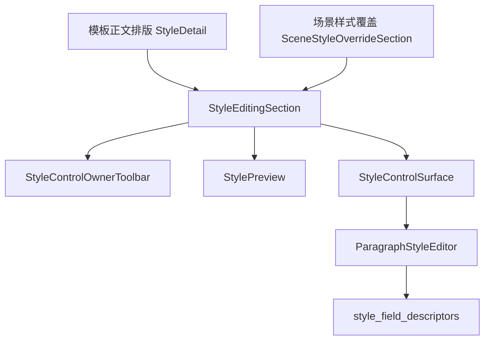
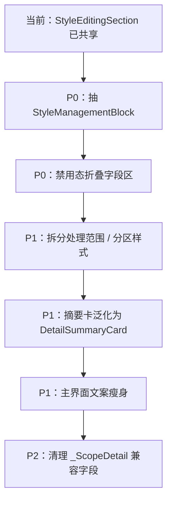

# 样式控件规划与模板管理高复用深度分析

日期：2026-06-29

## 1. 本轮结论

当前实现已经完成了“控件层复用”的关键一步：模板正文排版与场景样式覆盖都不再直接创建底层样式控件，而是共同通过 `StyleEditingSection` 进入 `StyleControlSurface`。这说明字号、字体、缩进、行距、段前段后等字段的控件来源已经开始统一。

但用户仍然会觉得“不像模板管理”“不好读”，原因不在单个控件，而在页面任务编排仍不一致：

| 层级 | 当前状态 | 问题判断 |
| --- | --- | --- |
| 字段控件 | 已复用 `StyleControlSurface` / `ParagraphStyleEditor` | 基础正确 |
| 编辑外壳 | 已复用 `StyleEditingSection` | 仍缺统一布局策略 |
| 摘要与操作区 | 模板用 `TemplateSummaryCard`，场景用普通 `Card + SummaryGrid + toggle list` | 视觉节奏不一致 |
| 功能边界 | 场景把处理范围、样式覆盖、编辑对象、预览、禁用态控件串在同一详情链路里 | 用户需要读太多才能理解 |
| 可读性 | 场景页仍保留不少状态解释、工程词和长句 | 需要让结构表达含义，而不是靠文字解释 |

所以，下一步不应该继续只调小文案或微调 spacing。真正要做的是把“样式管理”从场景处理范围里抽成更像模板管理的共享功能块，让模板页和场景页共享同一套信息结构。

## 2. 已经打通的复用链路

### 2.1 控件实例化边界已经收紧

当前搜索结果显示：

- `StyleControlSurface(` 只在 `src/shared/ui/style_editing_section.py` 里创建。
- `StyleEditingSection(` 同时出现在：
  - `src/ui/panels/template_style_detail.py`
  - `src/ui/panels/scene_style_override_sections.py`
- `SceneStyleOverrideSection` 不再直接创建 `StyleControlOwnerToolbar`、`StylePreview`、`StyleControlSurface`。

这条链路是好的：



它保证了模板和场景在字段数量、字段顺序、单位、控件类型上不会继续分叉。

### 2.2 状态投影也开始共享

`src/shared/ui/style_owner_state.py` 已经把模板正文和场景分区样式都投影成 `StyleOwnerViewState`：

- `template_body_style_owner_state(...)`
- `scene_section_style_owner_state(...)`

这意味着 UI 不必各自判断“可编辑、只读、恢复按钮是否可用、提示文字是什么”。这个方向正确。

### 2.3 视觉几何验证已补上

上一轮已经生成并审查了离屏 Qt 截图：

- `docs/visual_audit/2026-06-29/template_style_panel.png`
- `docs/visual_audit/2026-06-29/template_style_detail.png`
- `docs/visual_audit/2026-06-29/scene_scope_panel.png`
- `docs/visual_audit/2026-06-29/scene_scope_detail.png`

并补了布局测试，确认 owner、preview、surface 的顺序不会再重叠。这里需要注意：离屏环境缺少中文字体，截图中文字显示为方块；这不代表真实应用中文异常，用户截图中的中文显示是正常的。

## 3. 仍然不够好的核心原因

### 3.1 模板管理是“对象管理”，场景页还是“参数堆叠”

模板正文排版页的阅读方式是：

```text
当前配置摘要
-> 正文样式字段编辑
-> 保存/恢复
```

用户理解的是“我正在编辑这个模板的正文排版”。

场景处理范围页现在的阅读方式更像：

```text
处理范围摘要
-> 处理分区开关
-> 样式覆盖摘要
-> 样式覆盖分区开关
-> 编辑分区选择
-> 轻量预览
-> 三组样式字段
```

用户需要自己推断：

- 处理范围和样式覆盖是什么关系？
- 勾选某个范围是否等于启用样式？
- 为什么下面的字段是灰的？
- “恢复模板”是恢复整个场景，还是恢复当前分区？
- 预览的是模板样式还是场景覆盖后的样式？

这些问题不是靠增加说明文字能解决的。越解释越“不说人话”。

### 3.2 `StyleEditingSection` 复用了控件，但还没有复用布局契约

现在 `StyleEditingSection` 支持：

- owner toolbar
- preview
- style surface
- chrome 是否嵌入当前 layout
- chrome 是否挂到外部 card

这让它很灵活，但也把“布局策略”继续留给调用方。模板页隐藏 chrome，场景页把 chrome 放进 card、surface 放在 card 外，这样会产生一个观感问题：

| 页面 | 用户看到的结构 | 问题 |
| --- | --- | --- |
| 模板正文排版 | 摘要卡 + 三张字段卡 | 简洁，但缺少和场景同款预览/编辑对象层 |
| 场景样式覆盖 | 摘要、开关、对象选择、预览在一张卡里，字段卡在下一层 | 链路长，控制区和编辑区关系不够直观 |

这说明我们复用了“零件”，还没有复用“成品结构”。

### 3.3 场景页的功能边界仍然偏宽

`scn_scope` 当前同时承载：

- 处理哪些文档区域
- 哪些分区启用独立样式
- 当前编辑哪个分区
- 当前分区是否跟随模板
- 当前分区的有效样式预览
- 当前分区的样式字段编辑

这些都和“格式与模板”有关，但不是同一个任务。优秀设计里应该拆成两个更清楚的任务：

| 任务 | 用户问题 | 应该放什么 |
| --- | --- | --- |
| 处理范围 | 这次处理哪些区域？ | 分区开关、范围摘要 |
| 样式规则 | 这些区域的样式跟模板走，还是单独覆盖？ | 样式来源、覆盖开关、编辑对象、预览、字段编辑 |

如果继续把这两件事放在同一个长链路里，就算控件都复用了，用户仍然会觉得乱。

### 3.4 冗余文本来自边界不清，而不是文案本身

场景页里很多解释文字的真实作用，是替不清楚的结构补课。例如：

- “手动控制所有功能开关与处理范围”
- “提示 / 跳过高风险模块 / 阻断 macros”
- “template 13 / scene 37 / material 6 / output 17”
- “跟随模板 / 开启覆盖后可编辑”

这些信息不是都没用，但它们不应该同时出现在主阅读层。主界面只应保留决策所需的短句：

| 当前倾向 | 建议改成 |
| --- | --- |
| 长状态说明 | `跟随模板` / `已覆盖` / `未启用` |
| 工程计数 | 放到 tooltip、诊断详情或高级证据 |
| 风险解释 | 只在风险模块或 hover 中展开 |
| 禁用原因长句 | 禁用态旁显示一个短状态 chip，详细原因进 tooltip |

## 4. 建议的目标结构

### 4.1 抽一层真正的样式管理成品结构

建议在 `StyleEditingSection` 之上再抽一个更高阶的共享结构，例如：

```text
StyleManagementBlock
  Summary header
  Source / owner strip
  Preview
  Field surface
```

它不是替代 `StyleEditingSection`，而是规定模板和场景共同遵守的页面顺序。

建议 API 方向：

```python
StyleManagementBlock(
    mode="template_body" | "scene_section_override",
    summary_items=...,
    owner_options=...,
    preview_projection=...,
    owner_state=...,
    actions=...,
)
```

目标不是做一个万能巨型控件，而是把下面这些规则收口：

- 摘要永远在最上方。
- 来源/编辑对象永远在字段之前。
- 预览永远紧贴来源之后。
- 字段区只展示真正可编辑的内容。
- 禁用时默认折叠字段区，只保留“跟随模板/启用覆盖”的入口。

### 4.2 模板和场景统一成同一阅读顺序

目标阅读顺序应统一为：

```text
这是什么
-> 当前结果是什么
-> 来源是谁
-> 可以编辑什么
-> 编辑后效果如何
```

落到页面上：

| 区域 | 模板正文排版 | 场景样式规则 |
| --- | --- | --- |
| 标题 | 正文排版 | 分区样式 |
| 摘要 | 当前正文样式摘要 | 当前覆盖状态摘要 |
| 来源 | 模板默认样式 | 跟随模板 / 当前场景覆盖 |
| 对象 | 正文 | 标题、正文、表格等分区 |
| 预览 | 可选完整模板预览入口或轻量正文预览 | 当前分区有效样式预览 |
| 字段 | 字体、缩进、间距 | 同一组字段 |
| 操作 | 保存、恢复 | 启用覆盖、恢复模板 |

这样用户会感到两个页面是同一个产品，而不是两个拼起来的配置页。

### 4.3 场景页建议拆分导航或拆分详情区

有两个可选方案。

方案 A：新增独立导航卡。

```text
格式与模板
  - 处理范围
  - 分区样式
```

优点：边界最清楚。缺点：导航项会增加。

方案 B：保留一个 `处理范围` 导航卡，但详情内部拆成两个独立 section。

```text
处理范围
  Section 1: 处理哪些区域
  Section 2: 分区样式规则
```

优点：改动小。缺点：仍然会偏长。

本轮判断：如果目标是“优秀设计”，更建议方案 A。样式规则已经不是处理范围的附属功能，它是场景与模板关系的核心配置，应该有独立入口。

## 5. 具体优化方案

### P0：统一样式管理布局契约

新增共享结构，收口摘要、来源、预览、字段区的布局策略。

验收标准：

- 模板正文和场景分区样式都通过同一高阶 block 渲染。
- `StyleControlSurface` 仍只允许被 `StyleEditingSection` 创建。
- 调用方不再手动决定 chrome 在 card 内、surface 在 card 外这种结构。
- 自动化测试检查模板页和场景页的子控件顺序一致。

### P0：禁用态不展示大面积灰色字段

场景分区未启用覆盖时，不应该直接显示三大块灰色字段。建议改为：

```text
当前跟随模板
[启用独立样式]
轻量预览
```

只有启用覆盖后才展开字段编辑区。

这样可以同时减少解释文字和视觉长度。

### P1：把“处理范围”和“分区样式”拆开

如果新增导航卡：

```text
scn_scope        -> 处理范围
scn_style_rules  -> 分区样式
```

如果先低风险推进，可以保留现有 `scn_scope`，但内部必须拆成两个独立 section，并让样式 section 有清楚标题和摘要，不再像处理范围的尾巴。

### P1：统一摘要卡类型

模板详情大量使用 `TemplateSummaryCard`。场景样式规则也应使用同等级摘要卡，而不是普通 `Card + SummaryGrid`。

建议把名字进一步泛化，例如：

```text
DetailSummaryCard
```

再让模板管理继续通过别名或轻量 wrapper 使用它。这样“模板专属组件”就能变成真正的详情页摘要规范。

### P1：压缩主界面文字层

主界面只保留：

- 标题
- 状态 chip
- 当前值
- 用户可操作按钮

移入 tooltip / 诊断详情：

- registry 计数
- template/scene/material/output 数量
- 工程 key
- 风险说明长句
- 只读原因的完整解释

### P2：清理 `_ScopeDetail` 兼容字段

当前 `_ScopeDetail` 仍暴露不少历史字段给测试或外部访问，例如样式预览、样式 surface、owner toolbar、具体字段控件等。短期能兼容，长期会让页面继续像“字段仓库”。

建议迁移到：

```python
scope._style_override_section.editing_section
```

或未来的：

```python
scope._style_rules_block.editing_section
```

验收标准是 `_ScopeDetail` 不再直接成为样式字段的访问入口。

## 6. 一致性守门规则

后续开发要把下面规则写进测试，而不是只靠人工记忆。

### 6.1 结构守门

- `StyleControlSurface(` 只能出现在 `style_editing_section.py`。
- `StyleControlOwnerToolbar(` 和 `StylePreview(` 只能由共享样式编辑 shell 创建。
- 模板正文排版和场景分区样式必须走同一高阶样式管理 block。
- 场景页不得直接手写字体、缩进、行距字段布局。

### 6.2 文案守门

- 主界面不显示工程 key 组合。
- 主界面不显示长风险解释。
- 禁用原因超过 12 个中文字符时进入 tooltip。
- 状态统一使用：`跟随模板`、`已覆盖`、`未启用`、`可编辑`、`只读`。

### 6.3 截图守门

每次改样式管理链路，都应生成至少两张截图：

- 模板管理 -> 正文排版
- 场景配置 -> 分区样式

检查项：

- 摘要是否在第一屏清楚出现。
- owner/source 是否在字段之前。
- 预览是否贴近被编辑对象。
- 未启用覆盖时是否避免大面积灰色字段。
- 场景页是否仍然比模板页明显更杂。

## 7. 推荐落地顺序



不建议的顺序：

- 继续只改中文文案。
- 继续给现有长卡片加更多说明。
- 继续把新能力塞进 `scn_scope`。
- 为场景页单独做一套看起来更漂亮但不复用模板管理的控件。

## 8. 本轮最终判断

现在的实现已经比最初好很多：底层样式字段、编辑 surface、owner 状态、轻量预览都在往共享化走。但距离优秀设计还差一层关键抽象：共享的不是控件本身，而是“样式管理这件事”的完整交互结构。

要真正做到和模板管理一致，下一步应从 `StyleEditingSection` 上移到 `StyleManagementBlock`，并把场景页中的“处理范围”和“分区样式”切开。这样界面才会从“解释很多参数”变成“清楚管理一个对象”，冗余文字也会自然减少。
