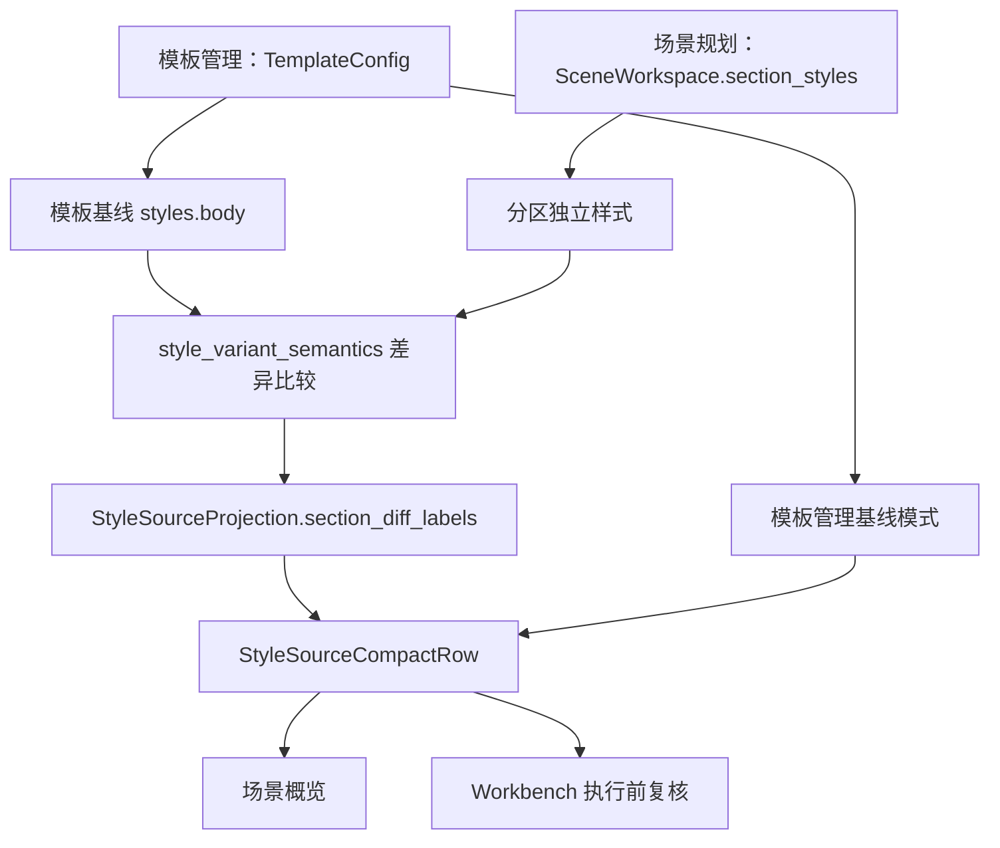

# 样式来源字段级差异与模板管理复用链路深度分析

日期：2026-06-29

## 1. 本轮结论

上一轮已经把 `StyleSourceProjection + StyleSourceCompactRow` 接入了模板管理、场景概览和 Workbench，三入口在视觉审计中也都压到了 50px。这个方向是正确的，但仍然不够优秀，因为当场景存在分区独立样式时，主界面只说“有独立样式”，用户仍然不知道到底哪里和模板不同。

本轮核心判断：

```text
只复用控件外壳，不等于复用模板管理的样式语义。
真正的一致性必须同时复用：模板基线、场景覆盖、字段差异、导航动作和执行前复核。
```

所以本轮把“样式来源”从“模板 + 分区数量”推进到“模板 + 分区字段差异”。用户现在可以在概览层直接看到：

```text
分区：1 个分区独立设置：参考文献（行距）
```

或在真实内置模板比较中看到：

```text
分区：1 个分区独立设置：参考文献（特殊缩进、行距）
```

这比“1 个分区使用独立样式：参考文献”更接近人话，也更接近模板管理的心智：模板是基线，场景只表达偏离基线的地方。

## 2. 对既有记录的再判断

本轮对照了这些已有记录：

- `docs/audits/样式控件规划与模板管理高复用深度分析_2026-06-29.md`
- `docs/audits/场景样式控件与模板管理高度复用深度分析_2026-06-29.md`
- `docs/refactor-records/模板管理样式来源共享控件闭环执行记录_2026-06-29.md`
- `docs/refactor-records/样式来源三入口视觉审计执行记录_2026-06-29.md`
- `docs/refactor-records/样式来源摘要压缩与执行复核减负记录_2026-06-29.md`
- `docs/refactor-records/样式来源双动作响应式布局减负记录_2026-06-29.md`

它们已经解决了三件事：

| 已解决 | 当前状态 |
| --- | --- |
| 三入口控件统一 | 模板管理、场景概览、Workbench 都使用 `StyleSourceCompactRow` |
| 三入口投影统一 | 都消费 `StyleSourceProjection` |
| 视觉密度 | Qt offscreen 审计中三入口行高都是 50px |

但仍缺一层关键能力：

| 缺口 | 用户感知 |
| --- | --- |
| 没有字段级差异 | 只知道有独立样式，不知道差在哪 |
| Workbench 初始场景未同步到 QuickExecutionDetail | 执行前复核可能看见默认场景，而不是桥接当前场景 |
| 样式来源状态 chip 过泛 | “有独立样式”无法表达“已经改了字段” |

本轮主要补这三个缺口。

## 3. 当前链路是否打通

### 3.1 已打通链路



这条链路现在有两个重要变化：

1. `StyleSourceProjection` 不再只调用 `is_section_style_overridden()` 统计分区，而是在拿到 `TemplateConfig` 时复用 `build_section_style_override_projection()` 的 `changed_labels`。
2. Workbench V2 bootstrap 会把桥接当前场景同步给 `QuickExecutionDetail`，并把当前模板通过 `set_template_context()` 传进去。

### 3.2 仍未完全打通的链路

| 链路 | 当前状态 | 后续建议 |
| --- | --- | --- |
| 模板管理字段编辑页 -> 样式来源差异 | 模板页只展示基线，不展示“被哪些场景覆盖” | 后续可做场景引用列表，但不应塞进概览主层 |
| 场景分区样式页 -> 概览差异来源 | 概览已展示字段差异，详情页已有 `StyleComparisonStrip` | 后续应共用一个 `StyleDifferenceProjection`，避免概览和详情各算各的 |
| 执行结果报告 -> 样式来源 | 执行前可复核，执行后报告仍主要走问题队列 | 后续可在执行报告摘要中写入最终有效样式来源 |

## 4. 本轮代码落点

### 4.1 共享投影增加字段级差异

文件：

- `src/ui/panels/style_source_projection.py`

新增语义：

- `section_diff_labels`
- `diff_tags` 改为字段级标签，例如 `参考文献：行距`
- 有模板对象时使用 `build_section_style_override_projection()`
- 无模板对象时保守显示 `参考文献：独立设置`
- 状态 chip 在真实字段差异存在时显示 `分区已调整`

显示规则：

| 状态 | 主界面文案 |
| --- | --- |
| 无分区覆盖 | `全部分区跟随模板` |
| 有覆盖但没有模板对象 | `1 个分区独立设置：参考文献` |
| 有覆盖且与模板一致 | `1 个分区独立设置：参考文献（与模板一致）` |
| 有字段差异 | `1 个分区独立设置：参考文献（行距）` |
| 多字段差异 | `参考文献（特殊缩进、行距）`，超过两项用 `等` |

### 4.2 场景概览传入模板对象

文件：

- `src/ui/panels/scene_overview_projection.py`
- `src/ui/panels/scene_panel.py`

变更：

- `build_scene_overview_spec()` 增加可选 `template`
- `build_scene_key_setting_rows()` 增加可选 `template`
- `_SceneOverview.set_scene()` 接收 `template`
- `ScenePanel._apply_scene()` 和 `_on_scene_edited()` 都把解析出的模板对象传入概览

意义：

```text
场景概览不再只知道模板名称，而是能拿模板基线做真实字段比较。
```

### 4.3 Workbench 补齐场景和模板同步

文件：

- `src/ui/panels/workbench/quick_execution_detail.py`
- `src/ui/panels/workbench/panel_v2.py`

变更：

- `QuickExecutionDetail` 新增 `_current_template`
- 新增 `set_template_context(template)`
- `_sync_style_source_row()` 传入模板对象
- Workbench V2 初始化时把桥接当前场景灌回 `QuickExecutionDetail`
- Workbench V2 初始化和模板变更时同步模板对象

意义：

```text
执行前复核不再只看 QuickExecutionDetail 自己的默认状态，而是看桥接当前场景 + 当前模板。
```

## 5. 控件规划再判断

### 5.1 当前已经不是“控件不复用”的问题

当前复用层级已经是：

```text
StyleSourceProjection
-> StyleSourceCompactRow
-> 模板管理 / 场景概览 / Workbench
```

底层样式编辑链路也已经是：

```text
StyleManagementBlock
-> StyleEditingSection
-> StyleControlSurface
-> ParagraphStyleEditor
```

所以后续不要再为场景页单独造一套“看起来像模板管理”的卡片。真正的问题已经上移为：

```text
同一个样式对象，在不同入口下的任务边界是否一致。
```

### 5.2 仍然需要重新规划的板块

| 板块 | 当前问题 | 推荐方向 |
| --- | --- | --- |
| 样式来源 | 已经轻量，但仍混在关键设置里 | 保留概览入口，详情跳到独立 `分区样式` |
| 分区样式详情 | 有编辑器和对照，但概览差异与详情差异不是同一个投影 | 抽 `StyleDifferenceProjection` |
| 模板管理概览 | 能表达基线，但不能表达“谁覆盖了它” | 后续可在高级信息中列场景引用，不放主层 |
| Workbench 执行前 | 现在能看到字段差异，但动作仍是 `看模板 / 调分区` | 后续可按执行风险显示只读复核态，不应变成编辑入口堆叠 |

## 6. 冗余文本删除原则

这轮再次确认：冗余文本不是靠继续删字解决，而是靠结构承载含义。

建议守门：

| 主界面保留 | 移入 tooltip / 详情 / 诊断 |
| --- | --- |
| 模板名 | 工程 key |
| 分区是否跟随模板 | registry 数量 |
| 字段差异短标签 | 长风险解释 |
| 两个动作：看模板、调分区 | 参数路径、底层字段 ID |

样式来源主行应维持两行：

```text
模板：默认格式，8 类参数可核对
分区：1 个分区独立设置：参考文献（行距）
```

不要再扩展成三行、四行，也不要把全部字段差异塞进去。超过两个差异时用 `等`，完整列表交给分区样式详情页。

## 7. 后续必要功能

### P0：抽 `StyleDifferenceProjection`

现在概览层复用了 `build_section_style_override_projection()`，但详情页和概览页还没有共享同一个差异投影对象。

建议新增：

```text
StyleDifferenceProjection
- scope_label
- follows_template
- changed_labels
- compact_label
- detail_label
- variant
```

使用位置：

- 样式来源概览：`参考文献（行距）`
- 分区样式详情：`不同：行距、特殊缩进`
- Workbench：执行前只读复核
- 后续执行报告：最终有效样式来源摘要

### P1：模板管理增加“场景覆盖引用”高级区

模板管理作为基线源头，不应该在主层显示所有场景差异，但可以在高级区显示：

```text
当前有 3 个场景存在分区独立样式
```

点击后进入场景，不在模板页直接编辑场景覆盖。

### P1：执行后报告写入样式来源

执行前已经能看样式来源，执行后也应能追溯：

```text
本次按模板“默认格式”处理；参考文献使用场景独立样式（特殊缩进、行距）。
```

这能闭合“配置 -> 执行 -> 报告”的链路。

### P2：真实 Windows 字体验证

Qt offscreen 已能证明布局边界和行高，但真实 Windows 字体仍需要人工或桌面截图确认：

- `参考文献（特殊缩进、行距）` 是否仍能在 50px 高度内自然阅读；
- 双动作横排在 1220px 宽度下是否拥挤；
- 窄窗口下动作竖排是否仍不压缩正文。

## 8. 本轮验证

语法编译：

```powershell
python -X utf8 -m py_compile src/ui/panels/style_source_projection.py src/ui/panels/scene_overview_projection.py src/ui/panels/scene_panel.py src/ui/panels/workbench/quick_execution_detail.py src/ui/panels/workbench/panel_v2.py scripts/export_style_source_visual_audit.py tests/test_style_source_visual_audit.py tests/test_scene_overview_projection.py tests/test_small_widget_architecture.py tests/test_quick_execution_detail_architecture.py
```

结果：通过。

聚焦回归：

```powershell
python -X utf8 -m pytest tests/test_style_source_visual_audit.py tests/test_scene_overview_projection.py tests/test_small_widget_architecture.py::test_style_source_compact_row_projects_template_section_and_actions tests/test_small_widget_architecture.py::test_style_source_compact_row_projects_template_baseline_without_section_action tests/test_small_widget_architecture.py::test_style_source_compact_row_omits_section_action_for_execution_review_when_following_template tests/test_quick_execution_detail_architecture.py::test_quick_execution_detail_uses_shared_style_source_row -q
```

结果：

```text
11 passed
```

视觉审计：

```powershell
python -X utf8 scripts/export_style_source_visual_audit.py
```

关键结果：

| 入口 | 高度 | 状态 | 分区行 |
| --- | --- | --- | --- |
| 模板管理 | 50px | 模板基线 | `场景分区：默认跟随此模板` |
| 场景概览 | 50px | 分区已调整 | `分区：1 个分区独立设置：参考文献（特殊缩进、行距）` |
| Workbench | 50px | 分区已调整 | `分区：1 个分区独立设置：参考文献（特殊缩进、行距）` |

## 9. 最终判断

这一轮把“样式来源”从共享控件推进到了共享语义：模板是基线，场景表达偏离，Workbench 复核同一套结果。

但距离优秀设计还差最后一层：差异投影要成为独立产品契约，而不是藏在样式来源投影里。下一步应抽 `StyleDifferenceProjection`，让概览、详情、Workbench 和执行报告共享同一个差异对象。这样才能真正做到一致、可读、可维护，而不是每个入口都各自学会一点“模板管理的语言”。
