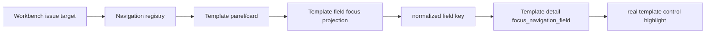

# 模板字段定位与场景复用链路审计记录

日期：2026-06-28

本轮目标：在上一轮“场景字段能否落到真实控件”的基础上，继续补齐模板管理侧的字段级闭环。核心问题是：工作台问题跳转到模板管理时，不能只证明“能进入模板面板/卡片”，还必须证明 target_key 能被模板详情页理解，并能定位到真实控件。

## 1. 本轮结论

模板管理已经有较成熟的详情页结构，但工作台导航审计之前只覆盖到面板和卡片：

```text
template_style_field -> template / tpl_style
template_page_field  -> template / tpl_page
```

这还不够。优秀设计要求用户点击“定位参数”后，系统能把问题落到具体控件，而不是只把用户扔到一张页面里继续寻找。

本轮补齐后，链路提升为：



现在模板正文排版和页面设置都进入字段级审计：

- `template_style_field`：通过共享 `ParagraphStyleEditor` 字段别名定位。
- `template_page_field`：通过页面设置字段别名定位到纸张、方向、分节、边距、页眉页脚距离控件。

这和上一轮的 `scene_style_field` / `scene_scope_field` 形成对称闭环。也就是说，场景页和模板页不再只是共享一部分控件，而开始共享“问题字段 -> 可定位控件”的产品链路。

## 2. 为什么这轮必要

前一轮已经确认：

- 场景样式覆盖使用 `ParagraphStyleEditor`。
- 模板正文排版也使用 `ParagraphStyleEditor`。
- 场景字段新增了 `workbench_scene_field_focus_projection()`。

但仍有一个不一致：模板字段虽然是模板管理的核心能力，却没有同等级别的 focus audit。

如果不补这一层，会出现三种设计断层：

| 断层 | 用户感受 | 工程风险 |
| --- | --- | --- |
| 只到模板卡片 | 用户还要自己找控件 | issue target 看似可用，实际不可定位 |
| style/page 规则分散 | 正文排版能定位，页面设置不能定位 | 模板管理内部体验不一致 |
| scene 有审计、template 没审计 | 场景链路反而比模板链路更强 | 复用关系倒挂 |

所以这轮不是补一个测试小洞，而是把模板管理重新放回“字段定位契约”的基准位置。

## 3. 代码落点

### 3.1 导航适配器

文件：`src/ui/adapters/workbench_issue_navigation.py`

新增：

- `WorkbenchTemplateFieldFocusProjection`
- `WORKBENCH_TEMPLATE_FIELD_FOCUS_AUDIT_SAMPLES`
- `workbench_template_field_focus_projection()`
- `audit_workbench_template_field_focus_targets()`
- `invalid_template_field_targets`

审计范围：

| target_type | 示例 target_key | 归一化结果 |
| --- | --- | --- |
| `template_style_field` | `template.styles.body.font_name` | `template.styles.body.font_cn` |
| `template_style_field` | `body.line_spacing_value` | `template.styles.body.line_spacing_pt` |
| `template_page_field` | `template.page_setup.margin.left_cm` | `template.page_setup.margin.left_cm` |
| `template_page_field` | `template.page_setup.header_distance_cm` | `template.page_setup.header_distance_cm` |

错误原因：

- `unknown_style_field`
- `unknown_page_field`
- `unsupported_target_type`
- `empty_target_key`

### 3.2 页面设置详情

文件：`src/ui/panels/template_page_detail.py`

新增：

- `NavigationHighlighter`
- `PageSetupDetail.focus_navigation_field()`
- `_page_focus_field_id()`
- `_page_focus_widget()`

现在 `PageSetupDetail` 能识别：

- `template.page_setup.paper_size`
- `template.page_setup.orientation`
- `template.section.section_break_type`
- `template.page_setup.margin.top_cm`
- `template.page_setup.margin.bottom_cm`
- `template.page_setup.margin.left_cm`
- `template.page_setup.margin.right_cm`
- `template.page_setup.gutter_cm`
- `template.page_setup.header_distance_cm`
- `template.page_setup.footer_distance_cm`

这让页面设置页跟正文排版页一样，成为可被外部问题定位的详情页。

### 3.3 测试

文件：`tests/test_workbench_issue_navigation.py`

新增覆盖：

- 模板字段审计结果进入总导航审计。
- `template_style_field` 字段别名归一。
- `template_page_field` 页面字段归一。
- 未知 style/page 字段能被审计为 invalid。

文件：`tests/test_template_page_detail.py`

新增覆盖：

- `PageSetupDetail.focus_navigation_field("template.page_setup.margin.left_cm")` 能高亮左边距控件。
- `template.page_setup.header_distance_cm` 能高亮页眉距离控件。
- `template.section.section_break_type` 能高亮分节方式控件。
- 未知字段返回 `False`。

文件：`tests/test_workbench_execution_session_architecture.py`

新增覆盖：

- 工作台对 `template_style_field` 发出的 intent 包含 `tpl_style` 和原始 field_id。
- 工作台对 `template_page_field` 发出的 intent 包含 `tpl_page` 和原始 field_id。

## 4. 与场景/模板一致性的关系

这轮补齐后，三条链路的责任更清晰：

| 链路 | 当前状态 | 意义 |
| --- | --- | --- |
| 工作台 -> 场景字段 | 已有 scene field projection | 场景问题能落到范围开关或分区样式控件 |
| 工作台 -> 模板字段 | 本轮新增 template field projection | 模板问题能落到正文排版或页面设置控件 |
| 工作台 -> 资料字段 | 仍需补 schema/asset profile field audit | 资料/schema 还需要下一轮继续 |

这让“场景页要和模板管理保持一致”不再只是视觉要求，而变成可测试的链路要求：

- 同类字段必须有统一命名。
- 同类字段必须能归一。
- 同类字段必须有可定位控件。
- 同类字段必须进入总导航审计。

## 5. 仍未完成

### 5.1 模板其他详情页还没有字段级 audit

本轮覆盖了 `template_style_field` 和 `template_page_field`。但模板管理还有：

- 标题编号
- 表格
- 页眉页脚
- 目录
- 参考文献
- 题注

这些详情页有些已经具备内部控件结构，有些还没有统一 `focus_navigation_field()`。下一步应按模板详情页成熟度逐个纳入，而不是一次性为所有 target 写兜底。

### 5.2 页面字段归一 helper 仍有轻微重复

`workbench_issue_navigation.py` 和 `template_page_detail.py` 里都维护了页面字段别名。当前通过测试保证一致，但长期更合理的是抽成共享 helper，例如：

```text
src/shared/ui/template_page_field_ids.py
```

或放在更偏语义的 adapter 层，让 UI 和导航审计共用同一份字段表。

### 5.3 资料/schema 仍只到面板

上一轮已经把 `schema` 从工作台兜底卡片改为进入资料面板。但 `AssetsPanel.focus_material_repair_target()` 目前主要覆盖：

- `field`
- `asset`
- `question_figure_item`

`schema` 还没有字段级 focus audit。下一轮建议优先补 `schema` 的资料面板定位，否则资料问题链路仍弱于模板和场景。

## 6. 验证记录

已执行：

```powershell
python -m compileall src/ui/adapters/workbench_issue_navigation.py src/ui/panels/template_page_detail.py tests/test_workbench_issue_navigation.py tests/test_template_page_detail.py tests/test_workbench_execution_session_architecture.py
python -m pytest tests/test_workbench_issue_navigation.py tests/test_template_page_detail.py::test_page_setup_detail_focus_navigation_field_highlights_page_controls tests/test_workbench_execution_session_architecture.py::test_workbench_panel_routes_template_field_issue_repair_to_template_panel -q
python -m pytest tests/test_workbench_issue_navigation.py tests/test_template_page_detail.py tests/test_template_panel_architecture.py tests/test_workbench_execution_session_architecture.py tests/test_scene_repair_routing.py tests/test_workbench_execution_center.py tests/test_quick_execution_detail_architecture.py tests/test_evidence_widgets.py tests/test_ui_copy_guardrails.py tests/test_button_style.py -q
```

结果：

- 聚焦验证：`12 passed`
- 相邻回归：`188 passed`

## 7. 当前判断

本轮之后，模板管理重新成为字段定位契约的基准：模板 style/page 不只可以被工作台导航到卡片，也可以被审计到具体控件。场景页要继续向模板管理靠拢，下一步不应再增加解释文字，而应继续补齐这些可测试契约：

1. 模板其他详情页字段级 focus audit。
2. 资料/schema 字段级 focus audit。
3. 页面字段别名 helper 抽成共享源。
4. 场景“处理范围”和“样式覆盖”拆成两个更清晰的详情板块。
5. `StyleOwnerAdapter` 与共享详情页壳，统一模板和场景的保存、恢复、跟随/覆盖状态。
