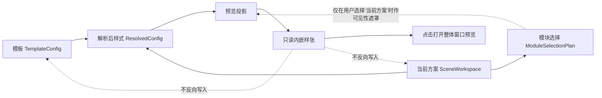

# 模板样式预览链路深度修复与后续优化方案

日期：2026-07-13

## 1. 结论

本次问题不是单纯的“预览不完整”，而是一度出现了依赖方向错误：预览模型参与决定功能开关和导航状态，并且有方案时自动用“本次执行结果”覆盖“模板样式基线”。这会造成用户看到的标题、表格、正文等状态与模板真实配置不一致。

修正后的核心原则是：

> 模板/解析后样式决定预览；预览只读、只投影，不决定样式、模块开关或保存策略。

补充边界：模板基线也不是“全部后台能力陈列”。通用版概览只展示页面、正文、标题、页眉页脚、表题和表格这些能共同构成一张紧凑样张的核心内容。目录、图题、公式、参考文献、水印和输出不进入该样张。

## 2. 正确的责任链

约束：

1. `template_feature_specs.py` 是功能、导航和模块控制的域注册表，不得导入预览类型。
2. 模板概览的摘要始终来自模板基线，不被当前方案的执行开关污染。
3. 默认显示“模板基线”；只有用户主动切换到“当前方案”时，才按本次模块选择隐藏已跳过项。
4. 预览画布整体点击只打开只读窗口预览，不承担字段或详情导航；配置编辑由摘要行的“编辑”入口负责。

## 3. 此前做错的主要问题与修复

| 问题 | 根因 | 修复结果 |
|---|---|---|
| 有方案时自动变成执行预览 | 面板协调器把“有方案”等同于“看执行结果” | 默认固定为模板基线，用户手动切换当前方案 |
| 标题整体显示已启用，但级别默认发灰 | 运行库读取了旧的空 `level_bindings` 内置文件 | 读取内置模板时只补齐缺失的标题绑定，保留模式定制名称和其他参数 |
| 执行开关变成大块占位卡片 | 将预览参与状态解释做成详情正文 | 恢复为摘要头部的独立紧凑开关，多模块页保持各自独立 |
| 点击预览错误跳到配置页 | 把“恢复点击”误解成内容块导航，并将错误结论写入测试 | 删除预览块导航字段与命中链；鼠标、Enter、Space 均打开同一个整体窗口预览，摘要行继续负责编辑导航 |
| 有“放大查看”和悬停卡片弹窗 | 混淆显式按钮、悬停浮层和画布主交互 | 删除文字按钮和悬停卡片，但保留画布点击打开整体预览；内嵌样张不再承担放大职责 |
| 页边距标注松散且左右文字竖排 | 重写渲染器时用整页旋转标签和点线替代了尺寸标注 | 恢复边距带内的双端箭头、短尺寸线和水平数值标签；页眉页脚距离复用同一视觉语言 |
| 三线表/颜色表与执行结果不同 | 预览使用了自己的颜色和线型 | 共用 `table_style_presets` 语义；三线表黑色无填充，颜色表按色板/变体绘制 |
| 正文字号、缩进、行距偏离 | 屏幕 DPI 和文档点数重复缩放，且所有纸张按 A4 宽度换算 | 按当前纸张物理宽度统一换算字号、缩进、段距和线宽 |
| 页眉页脚只显示普通页 | 忽略首页/偶数页变体 | 投影 default/first/even 变体，必要时自动提供 2–3 页来呈现差异 |
| 目录、图题、公式、参考文献被塞进通用样张 | 把“模板基线”误解为全部后台能力陈列 | 通用样张改为核心内容白名单；目录和图题不画，表题移到表格前，公式和参考文献保留底层实现但重新隐藏 |
| 水印与输出被加入模板导航 | 混淆纸面样式、执行能力和交付产物 | 从公开模板功能注册表和导航移除；输出不再被解释为预览功能，水印不进入默认样张 |
| 主保存被强制改成“创建副本并保存” | 错误地把 `builtin` 来源标记等同于只读，忽略当前项目中已有可写 JSON | 主按钮恢复为“保存”；有真实 JSON 路径时原位原子写入，无路径时才以同 ID 落盘；“创建副本”保留为独立操作 |

## 4. 预览显示规则

| 功能 | 模板基线 | 当前方案中模块执行 | 当前方案中模块跳过 |
|---|---|---|---|
| 页面设置 | 显示纸张、页边距、页眉/页脚距离导线 | 显示 | 导线和距离标注消失，页面只作中性承载面 |
| 正文/标题样式 | 按模板有效样式显示 | 显示 | 正文隐藏；若仅编号模块执行，标题保留编号结果并明示“保留原文样式” |
| 标题编号 | 按每级 `enabled/start_at/format`显示 | 显示编号 | 仅显示标题文本 |
| 表格 | 显示当前三线/全框/颜色/无框/保留语义 | 显示 | 整块表格消失 |
| 页眉页脚 | 显示普通、首页和偶数页变体 | 显示 | 页眉、页脚及其距离导线消失 |
| 目录 | 不进入概览样张；目录编辑功能仍保留 | 不进入样张 | 不进入样张 |
| 题注 | 只显示表题，并紧邻表格之前；不显示图题 | 表格与题注均执行时显示表题 | 表格或题注跳过时不显示表题 |
| 公式 | 通用版重新隐藏，等待论文版专属入口 | 不进入样张 | 不进入样张 |
| 参考文献 | 通用版重新隐藏，等待论文版专属入口 | 不进入样张 | 不进入样张 |
| 水印 | 不注册为通用模板导航功能，不进入样张 | 不进入样张 | 不进入样张 |
| 输出产物 | 属于交付链，不属于模板样式预览 | 不进入样张 | 不进入样张 |

## 5. 交互与持久化链

1. 预览头部不再有“放大查看”文字按钮；内嵌样张页宽上限为 640px，避免在概览中形成超长 A4 页面。
2. 预览无悬停弹窗，避免遮挡和重复信息。
3. 点击样张任意纸面区域，或聚焦后按 Enter/Space，打开统一整体预览窗口；重复点击复用现有窗口。
4. 整体窗口使用同一份只读投影，支持适应窗口、缩放和平移，不改变当前模板导航选中项。
5. 页面、正文、标题、表格、页眉页脚、目录和题注的编辑跳转只由参数概览行及导航卡承担。
6. 模块执行开关位于对应详情摘要头，修改的是当前方案的 `module_switches`，不修改模板样式。
7. 保存能力由当前 JSON/YAML 路径决定，不由 `builtin/user/external` 来源标签决定；当前内置 JSON 有真实路径时同样原位保存。
8. 模板概览不提供直接“导入 / 另存为 / 恢复”动作：外部模板统一放入当前工作模式模板工作区的“待导入”目录，经校验后入库；模板复用使用“创建副本”；草稿放弃只通过详情局部恢复或关闭事务处理。
9. “重命名”只修改当前内存草稿，名称与其他样式参数均在用户明确点击“保存”后才写入 JSON。
10. 原位保存保持当前逻辑模板 ID；“保存全部”在写盘前拒绝重复物理目标和草稿身份碰撞，并以预暂存、统一替换、失败回滚处理多文件提交。

补充编辑事务边界：参数编辑器只修改模板面板持有的草稿；草稿可以即时驱动当前编辑区的只读预览，但只有显式保存成功后才发布到 Bridge、Workbench 和真实执行链。切换详情、主面板、模板或工作模式只更换编辑上下文，不写盘、不发布草稿、不强制创建副本；草稿按工作模式和模板身份保留在内存。只有关闭程序时统一提供“保存全部 / 放弃全部 / 取消”。详见《[模板草稿暂存与 JSON 显式保存语义修正记录](../refactor-records/模板草稿暂存与JSON显式保存语义修正记录_2026-07-13.md)》。

## 6. 已完成的验证

已覆盖的自动化验证包括：

- 模板基线不受方案模块遮罩影响。
- 切换“当前方案”后，已跳过的页面导线、表格、表题和页眉页脚正确消失。
- 默认内置模板 1–8 级标题绑定得到修复，且不覆盖模式定制参数。
- 三线表和颜色表投影使用共享预设语义。
- A3/A4/B5/Letter 等纸张按自身物理宽度换算字号。
- 页眉页脚普通页、首页和偶数页变体得到投影。
- 预览点击和键盘激活均打开整体窗口，重复激活不创建重复窗口，当前导航保持不变。
- 内嵌样张与整体窗口使用 640px/900px 两级页面宽度上限；缩放只改变展示，不改变投影内容。
- 页边距使用双端尺寸线和水平数值标签，不再绘制左右整页旋转文字。
- 目录、图题、公式、参考文献和水印不会被通用样张生成；公式、参考文献、水印与输出不出现在通用模板导航。
- 表题是唯一题注样例，并且块顺序严格位于表格之前。
- 模板概览不存在直接导入、导出或全局恢复入口；待导入校验入库、内置 JSON 原位保存和外部修改冲突保护已分别验证。
- 详情/面板/模板/工作模式切换不触发保存或放弃，返回原编辑上下文后草稿恢复。
- 文件名与逻辑模板 ID 不同的原位保存不会改变方案绑定；重命名不会隐式提交草稿。
- 多模板保存发生后项失败时，已替换目标恢复原文件，所有相关草稿继续保持未保存状态。

## 7. 后续优化顺序

### P1：真实 DOCX 对照样本

为下列组合生成最小 DOCX，与预览截图做稳定对照：

- 三线表的外线/表头下线线宽。
- 8 种颜色表变体，特别是彩色三线表和浅网格。
- 正文首行/悬挂/左右缩进和固定行距。
- 首页、偶数页、普通页页眉页脚与页码阶段。
- 表题独立样式以及表题与表格的前后间距。

### P1：论文版专属能力入口

公式和参考文献后续只通过论文版的能力配置显式接入。实现时应使用工作模式能力白名单，不得再次加入全局模板功能注册表；通用版、试卷版、公文版等模式继续保持隐藏。

### P1：“保留原样”的不确定性表达

`table.layout_mode=keep`、页眉页脚 `preserve`、本次跳过段落样式等情况无法仅从模板推断原文最终外观。预览应继续明示“取决于原文”，不应伪造一个确定样式。

### P2：双形态视觉基线

分别为内嵌样张和整体窗口建立稳定截图基线，至少覆盖 620/900/1200 三种容器宽度、横向纸张、双页以及深色主题。视觉测试重点检查纸张比例、页边距尺寸线、表格位置和窗口适应缩放，不再通过内部成员是否存在来替代产品交互验收。

## 8. 防回归验收条件

1. 当前方案绑定后，打开模板概览仍默认看到模板基线。
2. 关闭页面设置后，当前方案预览不显示页边距、装订线和页眉/页脚距离导线。
3. 跳过表格、页眉页脚或题注时，对应表格、页眉页脚或表题在当前方案预览中消失。
4. 模板草稿立即驱动当前编辑区摘要和预览刷新；保存成功后才更新全局模板与执行链，预览交互不得反向改写模板。
5. 三线表不带蓝色填充；颜色表色板、网格、隔行和表头规则与执行模块一致。
6. 预览无“放大查看”文字按钮、无悬停弹窗；点击或键盘激活必须打开整体窗口，不能切换配置页。
7. 有真实配置文件路径的当前模板（包括项目内置 JSON）必须由主“保存”原位写入；“创建副本”不得替代主保存，模板概览不得重新加入直接“导入 / 另存为 / 恢复”动作。
8. 通用样张不得出现目录、图题、公式、参考文献、水印或输出；表题必须位于表格之前。
9. 通用模板导航不得出现公式、参考文献或水印与输出；其底层配置只能由未来的模式专属能力白名单重新开放。
10. 内嵌样张不得因窗口变宽无限放大；左右页边距不得使用整页旋转文字，页边距和页眉页脚距离必须使用统一尺寸线样式。
11. 未点击保存时，切换页面、面板、模板和工作模式不得改写 JSON 或全局执行模板；返回时必须恢复对应内存草稿。
12. 未点击保存时，重命名同样不得写入 JSON；保存后逻辑模板 ID 必须与保存前一致。
13. “保存全部”不得对同一物理路径执行多次写入，也不得在失败时留下部分 committed Session 或部分新 JSON。
