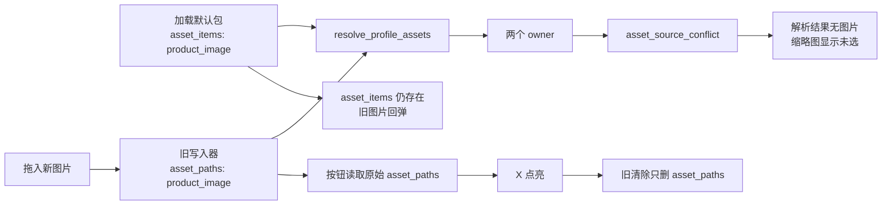

# 资料包、批量生成与五类资料链路基线偏移总审计及重构方案

日期：2026-07-31
状态：审计结论与最终实施方案已冻结；单图替换/清除已有局部稳定修复，其余顶层重构尚未按本文完整实施
范围：工作台文档执行、按资料批量生成、成套交付、资料包管理、资料预览、字段/时间/文件/图片/附件五类资料、保存恢复与默认测试基线

## 1. 文档目的与效力

本文把前序讨论、既有审计、已经出现的回归、当前图片问题及最终重构方案合并为一个入口，用于：

1. 固定产品定义，防止再次恢复已经取消的模式开关或重复页面；
2. 解释资料包、记录、Token、时间流、文件、图片、附件与输出数量之间的关系；
3. 记录已经出现的 UI、状态、保存和资源所有权问题；
4. 还原本轮图片冲突的提交与运行时因果；
5. 给出不再依赖 Presenter 局部补丁的最终架构；
6. 建立实施顺序、验收矩阵和禁止偏移规则。

发生冲突时，本文对以下范围具有优先级：

- 文档执行与按资料批量生成的产品定义；
- 资料包记录与输出基数的定义；
- 五类资料的规范 Token 与预览合同；
- 图片资源所有权、替换、清除和持久化合同；
- 工作台、资料管理页和默认测试资料包之间的状态关系。

本文继承但不重复替代以下既有记录：

- `docs/audits/文档执行与成套交付页面重构深度分析_2026-07-30.md`
- `docs/refactor-records/文档执行与成套交付共享工作区重构落地记录_2026-07-30.md`
- `docs/refactor-records/资料Token双层语义与五类资料链路统一重构记录_2026-07-13.md`

## 2. 一页结论

### 2.1 产品结论

- 工作台只保留“文档执行”和“成套交付”两个一级能力。
- “单份 / 多文件 / 按资料”不是用户选择的模式，而是系统根据输入关系静默解析出的文档执行拓扑。
- 用户拖入单文件、多文件或文件夹均应进入同一个文档执行入口。
- 批量生成的数量由输入文档或资料记录决定，绝不由 Token 数量、非空字段数量或产品名称重复次数推断。
- 一个资料包通常管理一套 schema、资源和多条记录；只有 schema、模板、时间规则或资源生命周期真正不同才拆为多个资料包。
- 成套交付不是“另一种文档数量模式”，而是按资料记录生成异构产物集合，必须保持独立领域模型。

### 2.2 资料结论

- 五类资料使用完整规范 Token：`@text`、`@time`、`@file`、`@img`、`@attach`。
- 资料预览必须展示“名称 + 完整 Token + 当前值/绑定摘要 + 状态”，并覆盖全部五类资料。
- 内置默认测试资料包必须是稳定、只读、自包含的五域测试基线。
- 内置资料包不能直接保存或删除；编辑需求通过“创建副本”进入用户包。
- 恢复和保存是编辑器级操作，应在可编辑对象上稳定存在；没有变更时可以禁用，但不能随局部重构消失。

### 2.3 技术结论

当前图片异常不是拖拽控件单点失效，而是：

> 读取侧已经升级为“每个资源角色只能有一个来源”，写入、清除、状态显示和测试侧却没有同步迁移。

直接表现为：

- 同一图片角色同时进入 `asset_items` 与 `asset_paths`；
- 严格解析器拒绝有多个 owner 的角色；
- 缩略图读取解析结果，显示“未选”；
- X 按钮读取原始路径，仍然点亮；
- 清除逻辑只删除一个容器，旧图片仍在另一个容器中，造成“点击无反应”或回弹。

单图局部修复在行为上正确，但最终方案必须建立统一资源命令层和唯一规范存储，不能继续在各 Presenter 中复制清理逻辑。

## 3. 产品基线：文档执行、批量生成与成套交付

### 3.1 文档执行的稳定定义

文档执行是：

> 在一个确定的方案、模板、资料上下文和输出策略下，对系统解析出的文档任务拓扑执行一次可预检、可取消、可追踪的生成任务。

系统根据输入静默识别：

| 拓扑 | 输入关系 | 输出基数 | 处理方式 |
| --- | --- | --- | --- |
| `single` | 1 份文档，0 条批次记录 | 1 | 单份处理 |
| `files` | N 份文档，0 条批次记录 | N | 每份文档独立处理 |
| `records` | 0/1 份共用底稿，N 条记录 | N | 每条记录生成一份 |
| `mapping_required` | 多文档与多记录同时存在 | 未确定 | 阻断，要求显式映射 |

`mapping_required` 禁止静默采用：

- 文件顺序与记录顺序配对；
- 文件名模糊猜测；
- 笛卡尔积；
- 取最短数量；
- 只使用第一份资料或第一份文档。

### 3.2 源文档要求

方案必须声明：

| 状态 | 含义 |
| --- | --- |
| `required` | 必须有一份源文档或共用底稿 |
| `optional` | 可以无底稿；存在时作为共用输入 |
| `generated` | 方案直接生成文档，不需要源文档 |

拓扑解析、页面提示和执行准备度都必须使用该声明，不能仅凭文件数量猜测。

### 3.3 批量生成的合理定义

批量生成不是“让一个模板循环所有 Token”，而是：

> 使用一套稳定资料结构和模板合同，对多条独立资料记录逐条冻结、预检、执行，并产生相互隔离的输出。

因此：

- 列或字段定义 Token；
- 每一行/每个对象定义一条记录；
- Token 数量只描述记录结构，不描述输出数量；
- 输出数量等于最终可执行记录数量；
- 每条记录必须有稳定 `record_id`，不能依赖当前排序；
- 同一产品名称下不同项目序号仍是不同记录；
- 重复章节或表格明细应建模为结构化集合，不用重复 Token 或拼接字段伪装。

### 3.4 一个资料包还是多个资料包

默认选择“一套资料包，多条记录”：

```text
资料包
├─ schema / Token 合同
├─ 共用模板与资源规则
├─ 共用图片、文件、附件定义
├─ 时间流定义
└─ records
   ├─ record-001
   ├─ record-002
   └─ record-003
```

只有以下条件成立时才拆包：

- 字段/Token schema 不同；
- 模板族或成套产品定义不同；
- 时间流规则不同且不能由参数表达；
- 权限、归档、版本或资源生命周期不同；
- 需要独立发布、迁移或审计。

不能因为要生成 N 份文件就创建 N 个资料包。批次单位是记录，不是资料包副本。

### 3.5 记录、时间流和输出目录

每条记录应形成独立冻结快照：

```text
MaterialRecordSnapshot
  - record_id
  - scalar values
  - timeline inputs and resolved values
  - content bindings
  - image bindings
  - attachment bindings
  - source revisions / hashes
```

时间流属于记录上下文：

- 资料包保存时间流定义；
- 记录提供开始时间、结束时间或阶段参数；
- 冻结时计算该记录的时间结果；
- 输出使用冻结结果，不在渲染器中重新计算。

输出目录由路径计划明确生成，例如：

```text
输出根目录/
├─ record-001_项目名称/
├─ record-002_项目名称/
└─ record-003_项目名称/
```

文件夹名必须经过冲突消解和非法字符规范化。输出目录数量来自执行计划，不从 UI 标签或 Token 推断。

### 3.6 成套交付的边界

成套交付以资料记录为项目基准，将一个记录映射成 Word、Excel 等异构产物集合。

它可以复用：

- 资料记录快照；
- 输出根目录；
- 预检、进度、取消、重试和结果回执组件；
- 主题、卡片和状态语义。

它不能复用或混入：

- 文档执行的 single/files/records 数量拓扑；
- 文档处理范围；
- 单一文档模板的执行请求；
- 文档数量与记录数量的映射猜测。

成套交付的输出基数由预检矩阵明确给出：

```text
选中记录 × 对每条记录实际 emit 的产物
```

页面必须同时显示记录数、计划产物数、可执行数、阻断数和最终目录计划，不能只显示一个含糊的“预计 N 份”。

## 4. 五类资料与预览基线

### 4.1 规范 Token

| 资料域 | 示例 | 运行含义 |
| --- | --- | --- |
| 字段 | `{{@text:company_name}}` | 标量文本替换 |
| 时间 | `{{@time:issue_date}}` | 时间流冻结后的标量替换 |
| 文件 | `{{@file:project_brief}}` | 插入结构化内容块 |
| 图片 | `{{@img:product_image}}` | 插入图片或图片集合 |
| 附件 | `{{@attach:validation_notes}}` | 正文附件清单引用并参与交付 |

必须保留完整 `{{`、`}}`、`@`、命名空间和稳定 identifier。预览不能只显示英文键的空格化形式，也不能把内部 Python/JSON 实现暴露给用户。

### 4.2 统一预览合同

资料包内容预览必须来自一个不可变 `MaterialPreviewSnapshot`，覆盖：

- 字段值；
- 时间定义、时间输入与冻结结果；
- 文件资料名称、源、编译状态和摘要；
- 图片名称、Token、缩略图、来源与校验状态；
- 附件名称、Token、数量、路径/哈希和交付状态。

每行至少包含：

| 名称 | 完整 Token | 当前内容或绑定摘要 | 状态 |
| --- | --- | --- | --- |
| 公司名称 | `{{@text:company_name}}` | 示例科技有限公司 | 已填写 |
| 出具日期 | `{{@time:issue_date}}` | 2026-10-01 | 已计算 |
| 项目说明 | `{{@file:project_brief}}` | Markdown，已编译 | 已载入 |
| 产品图片 | `{{@img:product_image}}` | 1 张，显示缩略图 | 已绑定 |
| 验证附件 | `{{@attach:validation_notes}}` | 1 个文件 | 已绑定 |

折叠摘要必须包含五域数量，展开后不能被字段列表挤占到完全看不到文件、时间、图片和附件。

### 4.3 默认测试资料包

`builtin/default_test_package` 是通用版确定性测试基线，应包含：

- 13 个固定字段；
- 1 个时间流和可验证的冻结结果；
- 1 个已编译文件资料；
- 1 张真实可解码图片；
- 1 个附件；
- 全部相对路径、哈希、manifest 和规范 Token。

标准测试路径：

1. 工作台资料包下拉选择“默认测试资料包”；
2. 默认加载“默认测试记录”；
3. 展开资料包内容预览；
4. 同时检查五类 Token、值、绑定和状态；
5. 执行替换、保存副本、重载、清除和回滚测试。

默认包是暴露兼容问题的基线，不允许为了让测试通过而删除其中的 `asset_items`、图片或附件。

## 5. 已经识别的 UI、UX 与状态偏移

### 5.1 文档执行页面

已经确认的正确基线：

- 不显示“单份 / 多文件 / 按资料”手工切换控件；
- 文件和文件夹使用一个统一输入入口；
- 方案、模板、输出目录和执行 Footer 全拓扑共享；
- 不重复显示导航已经表达的页面标题；
- 不在多个位置重复“等待、尚未、请选择”等空态；
- 数量、风险、阻断、格式与文件夹递归等决策信息必须保留；
- 技术日志默认折叠；
- 中性空态不占用大型说明卡。

禁止重新把三个旧详情页完整塞进 `QStackedWidget`，再靠广播保持方案和资料一致。

### 5.2 资料包选择器

资料包、处理方案和模板属于同一级绑定，应使用一致的选择交互：

- 正常下拉列出内置包与用户包；
- 完整身份使用 `builtin/<id>`、`user/<id>`，不能按显示名折叠；
- 显示“内置/自定”来源徽标；
- 选择后发布真实 `MaterialExecutionContext`；
- 工作台当前选择优先于资料管理页未提交草稿。

把资料包做成只读文本框、点击后跳转另一个页面，属于交互基线偏移。

### 5.3 内置包编辑与按钮语义

内置资料包：

- 只读；
- 不能直接保存；
- 不能删除；
- 可以“创建副本”；
- 不应因为用户查看它就在主工具栏出现“保存为副本 / 放弃修改”两个持久按钮。

用户资料包：

- 支持保存、恢复/放弃未保存修改、重命名、删除；
- 保存和恢复应由统一 Dirty State 决定；
- 成功保存后 Dirty State 清零；
- 发布失败时恢复编辑器、Bridge 和资料选择三层状态。

“正文排版”等配置编辑器中的“恢复 / 保存”属于稳定编辑合同。按钮无变更时可以禁用，但不能在界面精简时删除。

### 5.4 加载资料包后页面塌缩

曾出现加载资料包后工作台只剩“已准备 1 份批次资料”大卡，其余绑定、输出与执行区域消失。

根因类型是：

- 资料选择触发拓扑切换；
- 外层切换到旧按资料详情；
- 共享工作区和旧详情分别保存页面状态；
- 页面可见性与拓扑状态不再来自同一快照。

正确行为是：资料加载只替换“任务资料与预检”投影，方案、模板、输出和 Footer 不能消失或重新创建。

### 5.5 非必要说明文本

删除原则：

- 页标题和导航重复时删页标题；
- 卡标题与下方静态说明同义时删说明；
- 空态已由禁用按钮表达时不再重复一行；
- 影响决策或解释阻断原因的文字必须保留；
- Token、数量、来源和状态不能以“精简”为由隐藏。

## 6. 当前图片问题的完整复现与因果

### 6.1 用户可见症状

- 内置图片已经存在，但点击 X 不能真正解除关联；
- 新增图片行后拖拽图片，X 会点亮，但缩略图仍可能显示“未选”；
- 点击 X 后图片回弹，或重新加载又出现；
- 同一角色可能同时显示“未选”和“可删除”两个互相矛盾的状态。

### 6.2 当前资源模型

`EntityProfile` 同时保存：

- `assets_dir`
- `asset_paths`
- `asset_bindings`
- `asset_items`

代码位置：

- `src/config/entity_models.py`
- `src/config/asset_resolution.py`

`resolve_profile_assets()` 对每个 role 统计 owner。只要同一 role 在两个来源出现，就记录 `asset_source_conflict` 并拒绝解析该角色。

该严格规则本身合理；错误在于写入侧仍能制造多 owner。

### 6.3 实际冲突序列

默认测试资料包已经包含：

```text
asset_items:
  role = product_image
```

旧 UI 拖入新图片时执行：

```text
asset_paths[product_image] = 新路径
```

于是：



这是一种 Split-Brain UI：

- 缩略图信任规范解析结果；
- X 的启用状态信任原始兼容字段；
- 清除操作只修改其中一个字段；
- 保存快照可能包含另一个未清理来源。

### 6.4 提交层责任链

Git 可验证的相关提交作者均为 `Codex Local`，不能由此归责具体自然人。技术责任链如下：

| 提交 | 时间 | 作用 |
| --- | --- | --- |
| `e76c0f0` | 2026-07-07 23:22 | 引入资产面板，多种资源来源并存；旧解析以合并/优先级容忍冲突 |
| `521943e` | 2026-07-30 08:52 | 引入规范资源迁移和严格 owner 冲突解析，但未迁移全部 UI writer/clear |
| `c640dd5` | 2026-07-30 08:59 | 重构工作台和事务接口，将不完整写入包装成事务，但没有补齐资源所有权 |

结论：

- 原始结构债务来自多来源长期并存；
- 主要回归来自 `521943e` 的读取/写入合同不对称；
- `c640dd5` 固化并扩大了问题影响面；
- 当前未提交的默认测试资料包使用规范 `asset_items`，是稳定触发器而非根因；
- 用户拖拽、点击 X 和选择默认包都是正常操作，不是问题来源。

## 7. 已完成的局部稳定修复及其边界

单图路径此前已调整为：

### 替换

- 验证文件存在；
- 规范化 role；
- 创建或替换 typed `AssetItem`；
- 计算 MIME、名称、相对路径和内容哈希；
- 同一事务删除相同 role 的 `asset_paths` 与 `asset_bindings`；
- 快照包含 `asset_paths`、`asset_bindings`、`asset_item_payloads`；
- 发布失败时完整回滚。

### 清除

- 清除相同 role 的 `asset_paths`；
- 清除相同 role 的 `asset_bindings`；
- 清除相同 role 的 `asset_items`；
- 保留槽位定义，不删除 Token 规格；
- 发布失败时恢复全部本地状态。

此前定向回归结果记录为 `141 passed, 1 skipped`。该数字只代表当时的定向范围，不替代后续全库与 UI 生命周期验收。

局部修复的边界：

- 解决单图显式来源冲突；
- 未消除四个容器作为长期可编辑来源的结构；
- 未自动修复 `assets_dir` 中同 role 的扫描结果；
- 多图文件夹、逐题题图及其他资源操作仍需迁移到统一服务；
- 只按扩展名判断图片仍不足以阻止损坏或伪装图片。

## 8. 相邻链路风险

### 8.1 多图文件夹

当前多图操作主要修改 `asset_bindings`。如果同 role 已存在：

- `asset_items`
- `asset_paths`
- `assets_dir` 扫描结果

仍可能产生同样的 owner 冲突。清除多图目录也不能只 `pop(asset_bindings)`。

### 8.2 逐题题图

替换路径时若只修改 `path`，而没有同步更新：

- `source_path`
- `normalized_name`
- `original_relative_path`
- MIME
- hash/revision

就会形成元数据与真实文件不一致，影响缓存、持久化和审计。

### 8.3 图片真实性验证

扩展名 `.png/.jpg` 只表示候选类型，不等于可解码图片。必须在 intake 时实际解码或读取媒体头，并统一返回：

- unsupported type
- file missing
- decode failed
- hash failed
- source conflict

否则仍可能出现“X 可用但缩略图空白”，但那将是另一类校验问题。

### 8.4 文件资料

文件资料应只指向编译后的内容 artifact。源文件、编译产物、manifest 与 hash 必须由一个 binding 管理，不能由 UI 同时保存源路径和另一份临时内容。

### 8.5 时间资料

时间定义、记录输入和冻结结果应分层。编辑时间计划后必须重新冻结记录，不能只刷新页面文本而继续执行旧时间值。

### 8.6 附件资料

附件 typed binding 方向基本正确，但旧 `asset_paths` 兼容迁移、清除和保存仍必须使用同一资源命令，避免附件正文引用与随包交付清单不一致。

### 8.7 编辑器与 Bridge

资料页编辑器、工作台执行上下文和 Bridge 不能共享同一个可变对象。正确关系应是：

```text
Editor Draft --保存/发布--> Canonical Package
Canonical Package --冻结--> Execution Snapshot
Execution Snapshot --只读--> Workbench / Runner
```

工作台不得直接消费未保存草稿；切包不得把上一包草稿写入下一包。

## 9. 为什么原测试没有阻止问题

现有测试存在四类缺口：

1. 冲突展示测试只验证能看到 `asset_source_conflict`，没有要求替换/清除主动治愈冲突；
2. mutation gate 测试曾把“单图只修改 `asset_paths`”作为预期，保护了事务形状而非业务完整性；
3. 大部分 UI fixture 使用空包或单一旧来源，没有覆盖“内置 typed item → 替换 → 保存 → 重载 → 删除”；
4. 部分测试依赖当前用户选中的活动资料包，默认包变化会让测试结果随本机状态漂移。

另外，规范资源迁移和工作台重构在很短时间内连续落地，改动面较大，缺少“每个 reader 规则必须对应全部 writer、clear、restore、preview、test”的迁移清单。

测试通过不等于链路闭环，后续测试必须验证用户生命周期结果。

## 10. 最终目标架构

### 10.1 唯一规范资源模型

产品尚未发布，建议进行一次性 schema 收敛。运行时和保存格式只保留一种规范资源绑定：

```text
MaterialResourceBinding
  - role
  - namespace: file | img | attach
  - cardinality: one | many
  - source_kind: file | directory | items | artifact
  - items[]
      - resource_id
      - display_name
      - canonical_path / artifact_id
      - source_path
      - relative_path
      - mime_type
      - content_hash
      - sequence
      - metadata
  - revision
```

约束：

- 一个 package/profile + role 只存在一个 binding；
- 单图是 `cardinality=one`；
- 多图文件夹冻结后仍投影成一个 binding 下的多个 item；
- 文件资料引用不可变 artifact；
- 附件 binding 同时服务正文引用和交付清单；
- `asset_paths`、`assets_dir`、旧 `asset_items` 只作为导入格式，不作为编辑期并行事实来源。

### 10.2 加载边界归一化

```text
Legacy/Current Package
        |
        v
normalize_material_resources()
        |
        +-- 无冲突：生成 canonical bindings
        +-- 可确定冲突：迁移并记录 warning
        +-- 不可确定冲突：阻断并提供修复动作
        |
        v
Editor / Preview / Execution 只读取 canonical model
```

禁止在页面打开后继续保留四套 live 容器，再让每个按钮分别同步。

### 10.3 唯一资源命令层

建立领域服务，例如：

```text
MaterialResourceService
  - replace_single(role, file)
  - replace_many(role, directory_or_files)
  - clear(role)
  - rename(role, display_name)
  - validate(role)
  - migrate_legacy(profile)
```

每条命令必须：

1. 校验文件/目录与真实媒体；
2. 构造规范 binding；
3. 原子替换整个 role；
4. 更新 hash、MIME、路径和修订；
5. 生成新 package draft；
6. 通过统一 transaction 发布；
7. 失败时恢复 draft、Bridge、选择和 UI projection。

Presenter 只发命令，不直接操作 `_asset_paths`、`_asset_bindings` 或 `_asset_item_payloads`。

### 10.4 单一读模型

建立：

```text
Canonical Material Package
        |
        +--> MaterialEditorProjection
        +--> MaterialPreviewSnapshot
        +--> MaterialExecutionSnapshot
```

- 编辑器显示状态、X 启用、缩略图和错误来自 `MaterialEditorProjection`；
- 工作台五域预览来自 `MaterialPreviewSnapshot`；
- runner 只消费冻结的 `MaterialExecutionSnapshot`；
- 不允许三个消费者重新拼装或猜测资源。

### 10.5 Dirty State 与保存恢复

统一状态机：

```text
clean
  -> edit -> dirty
dirty
  -> save success -> clean
  -> restore -> clean
  -> switch request -> confirm/discard/save
  -> publish failure -> dirty + original published state unchanged
```

内置包的编辑操作应先创建用户副本；内置包本体永远保持 clean/read-only。

### 10.6 严格解析器保留

不应通过给 `resolve_profile_assets()` 增加“最后写入优先”来掩盖冲突。

原因：

- 静默优先级会隐藏数据丢失；
- 保存顺序可能改变最终图片；
- 同一包在不同版本上可能得到不同结果；
- 审计无法解释选择了哪个来源。

正确做法是在写入和加载边界保证唯一 owner，解析器继续作为防腐层和诊断门禁。

## 11. 分阶段执行方案

### 阶段 0：冻结合同与复现

- 固定本文产品与 UI 基线；
- 为当前默认测试资料包建立不可变测试副本；
- 建立单图冲突、X 回弹、多图冲突、加载页面塌缩等失败复现；
- 测试隔离用户活动包、缓存和本机历史状态。

退出条件：所有已知问题均有先失败的自动化测试或明确视觉验收脚本。

### 阶段 1：建立 canonical schema 与迁移器

- 新增统一 `MaterialResourceBinding`；
- 编写旧四来源到 canonical binding 的迁移；
- 定义冲突分类、可自动修复规则和阻断规则；
- 升级 package schema 版本；
- 默认测试资料包迁移到新格式。

退出条件：旧包可确定迁移，新包保存后不再产生并行 owner。

### 阶段 2：建立资源领域服务

- 实现 replace/clear/rename/validate；
- 接入统一事务和回滚；
- 完成真实图片解码、hash、MIME 和路径规范化；
- 禁止 Presenter 直接修改资源容器。

退出条件：单图、多图、题图、文件和附件操作都经过同一命令边界。

### 阶段 3：迁移资料管理页

- 单图、多图、文件、附件和时间操作接入统一服务；
- 编辑器所有状态改为 projection 驱动；
- 统一 Dirty State、保存、恢复和切包确认；
- 内置包只读和副本语义收敛；
- 删除旧局部 fallback。

退出条件：按钮状态、缩略图、错误、保存和重载永远来自同一模型。

### 阶段 4：迁移工作台预览与执行快照

- 五域预览只消费 `MaterialPreviewSnapshot`；
- 文档执行只消费冻结记录快照；
- 资料加载不重建共享方案、模板、输出和 Footer；
- 成套交付只复用资料快照与共享表现组件。

退出条件：加载、切包和拓扑切换不再改变页面骨架或丢失绑定。

### 阶段 5：删除兼容运行时

- 删除编辑期 `asset_paths/assets_dir` fallback；
- 删除 Presenter 内资源归并代码；
- 删除依赖本机当前包的测试；
- 更新文档和 schema 示例。

退出条件：仓库搜索不到绕过资源服务的生产写入点。

### 阶段 6：全链路验证

- 单元、领域服务、持久化、UI、执行和发布门禁；
- 默认包与用户副本真实操作；
- Windows 文件锁、中文路径、长路径和损坏图片；
- 视觉核验浅色/深色、宽/窄窗口、空态/已载入/冲突态；
- `ruff`、`compileall`、`git diff --check` 和发布聚合门禁。

## 12. 验收矩阵

### 12.1 五域生命周期

每个资料域都必须覆盖：

| 场景 | text | time | file | img-one | img-many | attach |
| --- | --- | --- | --- | --- | --- | --- |
| 加载内置包 | 必测 | 必测 | 必测 | 必测 | 必测 | 必测 |
| 创建用户副本 | 必测 | 必测 | 必测 | 必测 | 必测 | 必测 |
| 新增/替换 | 必测 | 必测 | 必测 | 必测 | 必测 | 必测 |
| 拖拽 | 不适用 | 不适用 | 必测 | 必测 | 必测 | 必测 |
| 清除 | 必测 | 必测 | 必测 | 必测 | 必测 | 必测 |
| 保存并重载 | 必测 | 必测 | 必测 | 必测 | 必测 | 必测 |
| 恢复未保存修改 | 必测 | 必测 | 必测 | 必测 | 必测 | 必测 |
| 发布失败回滚 | 必测 | 必测 | 必测 | 必测 | 必测 | 必测 |
| 工作台预览 | 必测 | 必测 | 必测 | 必测 | 必测 | 必测 |
| 执行快照 | 必测 | 必测 | 必测 | 必测 | 必测 | 必测 |

### 12.2 图片专项

- 内置 item 被新图片替换；
- legacy path 被新图片替换；
- binding 与 item 冲突能在加载边界修复或阻断；
- X 清除后立即无缩略图、按钮禁用；
- 保存重载后仍为空；
- 发布失败后旧图片、按钮和缩略图全部恢复；
- 新行拖入图片后缩略图、Token、名称、hash 一致；
- 多图目录重复文件、非图片污染和排序；
- 损坏 `.png`、扩展名伪装文件、文件删除和权限失败；
- 中文路径、空格路径、超长名称；
- 同 role 任何时刻只有一个 canonical binding。

### 12.3 文档执行拓扑

覆盖 `0/1/N 文档 × 0/1/N 记录 × required/optional/generated`，并验证：

- 期望输出数量；
- 是否阻断；
- 显式映射要求；
- 方案、模板、输出设置不因拓扑切换丢失；
- 页面共享骨架不重建；
- 每个输出目录相互隔离；
- 部分成功、取消、重试和结果回执语义一致。

### 12.4 资料包持久化

- 内置包不可直接保存/删除；
- 创建副本后完整复制五域；
- 用户包保存、恢复、重命名、删除；
- 切包前 Dirty State 处理；
- CAS/版本冲突不覆盖其他更新；
- 失败后 Bridge、编辑器、下拉选择一致；
- 不依赖用户上一次活动资料包。

## 13. 禁止再次偏移的架构守卫

后续代码评审和自动化门禁应明确禁止：

1. 在 Presenter 中直接赋值资源容器；
2. 同一 role 同时存在两个 live owner；
3. 缩略图与按钮分别读取不同状态源；
4. 使用 Token 数量推断批次数量；
5. 多文档与多记录静默顺序配对；
6. 工作台重新出现“单份/多文件/按资料”手工模式标签；
7. 加载资料后隐藏或重建共享方案、模板、输出和 Footer；
8. 内置包直接进入可保存状态；
9. 通过移除默认包真实图片/附件规避失败；
10. 只用扩展名认定图片有效；
11. 测试读取用户本机当前活动包；
12. 为兼容旧字段继续增加新的读取优先级。

建议增加静态守卫：

- 生产代码中资源容器写入只允许出现在 migration 和 resource service；
- 所有资料变更入口必须经过一个 checked publish gate；
- preview、execution 和 editor projection 必须接受 canonical package/snapshot；
- package schema 保存器拒绝多 owner。

## 14. 实施优先级

| 优先级 | 内容 | 原因 |
| --- | --- | --- |
| P0 | 单图替换/清除稳定、冲突复现、默认包测试隔离 | 当前用户操作直接失败 |
| P0 | canonical schema 与资源服务 | 阻止继续堆局部补丁 |
| P1 | 多图、题图、附件、文件链路迁移 | 与单图共享根因 |
| P1 | 五域预览单一快照 | 当前工作台校验入口 |
| P1 | Dirty State、保存/恢复与内置包副本 | 防止数据和 UI 状态漂移 |
| P2 | 删除旧兼容容器和 fallback | 在迁移验证完成后收口 |
| P2 | 完整视觉与发布门禁 | 发布前最终质量保证 |

## 15. 最终完成定义

只有同时满足以下条件，才可以宣布本问题完成：

1. 资料包、记录、Token、时间流和输出基数定义不再冲突；
2. 单文件、多文件、文件夹和按资料记录都从同一文档执行入口静默解析；
3. 五类资料在管理页、工作台预览和执行快照中一致；
4. 任意图片替换/清除后，缩略图、X、保存和重载状态一致；
5. 同一资源 role 在运行时和保存格式中都只有一个 canonical binding；
6. 多图、题图、附件和文件不再各自维护相似但不完整的清除逻辑；
7. 内置默认资料包可以完成五域端到端测试；
8. UI 不再因加载资料或拓扑切换丢失共享卡片；
9. 自动化覆盖生命周期而不仅是单方法字段改动；
10. 旧并行数据源和 Presenter fallback 已删除，而不是被新优先级掩盖。

最终原则：

> 资料包是规则和记录的容器，记录决定批次数量，Token 定义映射位置，资源 binding 定义唯一来源，快照冻结执行事实，UI 只投影同一份权威状态。

## 16. 2026-07-31 实施收口

本文阶段 0～6 已按“先冻结所有权，再迁移写入口，最后删除运行期猜测”的顺序完成。实现没有用新的读取优先级掩盖旧冲突，也没有把工作台重新变成资料包编辑器。

### 16.1 最终确认的根因链

本轮问题不是单个 X 按钮或拖拽事件失效，而是以下所有权冲突叠加后的表现：

1. 图片曾同时存在于 `asset_paths`、顶层 `asset_items`、`asset_bindings[*].items` 和 UI 临时 payload，清除一个容器后会被另一个容器重新投影出来。
2. Presenter 曾自行归组、迁移或直接修改资源容器，图片、附件和文件形成了相似但不等价的局部实现。
3. 图片规则 UI 在“加载/同步控件”期间调用全局策略写入器，空资料包只要打开页面就会被补出场景默认规则；这是加载即变脏和空包出现图片 Token 的直接原因。
4. 工作台传回的 `MaterialExecutionContext` 曾把时间、图片、文件和附件反写当前资料包；执行快照因此越权成为编辑输入。
5. 旧附件和旧图片共用 `asset_paths`。若图片规范化先执行，附件角色路径会被图片迁移器抢先消费，导致附件迁移丢失。
6. 部分测试通过伪造图片字节或直接修改 Presenter 私有容器，绕开了真实解码和命令事务，因而无法代表用户点击、拖拽、保存和恢复链路。
7. 资料预览、资料管理页和工作台曾分别拼装摘要，字段量较大时文件、图片或附件会被挤掉，并且显示名、Token 和稳定代码混在一起。

### 16.2 已关闭的用户可见问题

- 单图已有绑定可以清除，X 的启用状态、缩略图、资料包模型和保存结果读取同一 canonical binding。
- 新增图片行后选择或拖入真实图片，会同时建立资源 binding 与可执行图片规则；Token 修改只更新对应 role，不会物化全部场景默认规则。
- 多图文件夹使用同一图片资源服务完成真实解码、自然排序、内容修订和目录刷新。
- 加载空资料包不再静默生成图片规则，也不会因为打开图片页而变脏。
- 旧附件路径先按附件 role 分流，再执行图片规范化，不再被图片迁移抢占。
- 加载或接收执行快照不会把时间、图片、文件、附件反写资料包。
- 既有图片规则的 placement、watermark、required 等持久化意图在加载和导出之间保持不变。
- 内置默认测试资料包继续保留真实的字段、时间、文件、图片和附件五域内容；内置包只读，修改通过用户副本完成。
- 工作台文档执行继续静默支持单文件、多文件和文件夹；输出数量由输入文档集合与资料记录拓扑决定，不由 Token 数量决定。
- 五域预览统一展示完整 `{{@namespace:key}}`、当前值或绑定摘要、状态和领域类型。

## 17. 实施后的权威边界

### 17.1 图片

权威 live owner 为 `EntityProfile.asset_bindings[role]`。`asset_paths`、顶层 `asset_items` 和旧 payload 只允许在加载迁移边界出现；迁移完成后必须为空，保存器拒绝多 owner。

核心实现：

- `src/services/material_assets/resource_bindings.py`
  - 单图替换、目录替换、清除、刷新和 item inventory 替换；
  - 使用真实图片解码而不是只看扩展名；
  - 统一调用 `canonicalize_profile_asset_bindings()`；
  - 刷新时保留稳定 item 身份并更新内容修订。
- `src/ui/panels/assets/image_rules_presenter.py`
  - `_sync_image_material_rule_rows()` 只投影控件；
  - `_ensure_image_material_rule_for_spec()` 只在明确的新增 Token、改 Token、选图或选目录命令中写入一个 role。
- `src/ui/panels/assets/scene_spec_presenter.py`
  - Token inventory 与对应图片规则在同一个 checked transaction 中发布和回滚。

### 17.2 附件

权威 live owner 为 `EntityProfile.attachment_bindings[role]`。旧共享路径通过 `migrate_legacy_attachment_sources()` 在加载入口一次性迁移。附件迁移必须先于图片迁移。

核心实现：

- `src/services/material_attachments/bindings.py`
  - replace、clear、rename、relabel 和 legacy migration；
  - Presenter 不再自行构造迁移结果。

### 17.3 文件资料

权威 live owner 为 `EntityProfile.content_bindings[content_id]`，内容产物身份由 artifact/manifest 修订冻结。

核心实现：

- `src/services/material_content/bindings.py`
  - replace、clear、rename、relabel；
  - 文件 Token、内容产物和插入规则不再由不同 UI 分支分别维护。

### 17.4 时间与字段

- 固定字段属于资料包记录；
- 自由字段属于本次任务输入；
- 时间输出由资料包时间计划计算；
- 资料包预览只显示规范 Token 代码，不使用场景全局字典制造资料包显示名；
- 公文编辑区保留历史中文别名兼容，但它不是五域预览的数据源。若未来修改 Token 代码，必须作为显式 Schema 迁移单独实施。

### 17.5 预览与执行

```text
EntityArchive / EntityProfile
        |
        +--> MaterialEditorProjection
        +--> MaterialPreviewSnapshot
        +--> freeze --> MaterialExecutionContext
                           |
                           +--> Workbench runner
```

约束：

1. 编辑器查询不得提交模型。
2. `MaterialPreviewSnapshot` 是五域预览唯一输入。
3. `MaterialExecutionContext` 由资料包显式冻结，不能反向写资料包。
4. 选择资料包、切换输入拓扑和刷新预览不得重建处理方案、模板、输出目录或 Footer。

## 18. 防回退门禁

新增 `tests/test_material_resource_architecture_guard.py`，持续约束：

- Presenter 不得对受保护资源容器执行原地 `append/pop/update/...` 或下标写入；
- 图片 legacy 迁移只有一个 canonicalizer；
- 图片 item inventory 必须调用领域命令；
- 附件 legacy 迁移必须由服务层拥有；
- 执行快照处理器不得出现非字段资料反向写入；
- 图片规则 hydration 不得调用全局规则物化器或显式命令写入器。

行为门禁同时覆盖：

- 空资料包加载后仍为空；
- 显式图片 Token/图片源命令会创建对应规则；
- 清除、恢复和发布失败可完整回滚；
- 单记录不会被错误显示成批次；
- 五域执行快照在启动后保持不可变；
- 工作台运行上下文不能污染当前资料包；
- 旧附件路径不会被图片迁移吞掉；
- canonical 保存/重载后不再恢复旧 owner。

## 19. 验证记录

本轮在 Windows 本机、真实 Qt 事件循环和临时隔离资料库上完成以下回归：

| 验证组 | 结果 | 覆盖范围 |
| --- | --- | --- |
| 规范模型、archive codec、迁移与三类命令服务 | `106 passed, 1 skipped` | canonical binding、冲突阻断、保存重载、图片/文件/附件命令 |
| 文档执行、静默输入识别、五域冻结、批量与成套生成 | `186 passed` | 单文件/多文件/文件夹、记录拓扑、路径拖放、工作台会话 |
| 资料包编辑生命周期与五域 UI | `135 passed, 2 skipped` | 图片/附件/文件/时间、Dirty State、保存、恢复、内置包、副本和发布回滚 |
| 最终架构与命令门禁 | `9 passed` | 静态所有权边界与领域命令 |
| 定向根因复现 | `8 passed` | 显式图片规则、空包纯加载、旧附件迁移、快照不反写 |

合计核心回归：`427 passed, 3 skipped`。3 项跳过均是当前 Windows 进程缺少创建文件/目录符号链接权限（`WinError 1314`）；不是功能失败，相关路径穿越拒绝逻辑在有权限环境继续作为测试门禁。

静态验证：

- `ruff`（`I,F401,F821,F822`）：通过；
- `python -m compileall`：通过；
- `git diff --check`：通过，仅显示工作区既有 CRLF/LF 提示；
- 真实无效图片字节会被拒绝，测试素材已改为 PIL 生成的有效图片。

## 20. 完成状态与发布边界

本文所列功能性重构和已知回归已完成。运行期允许保留旧字段作为“读取迁移输入”，但不允许其成为第二 live owner；这不是新的 fallback 优先级。

发布前仍建议执行两项环境性验收：

1. 在启用 Windows Developer Mode 或管理员符号链接权限的 CI 上补跑 3 项 symlink 防护测试。
2. 用一份含 `@text/@time/@file/@img/@attach` 的真实 DOCX 完成最终 Word 排版目视验收。该项验证版式和打印效果，不改变本轮已经冻结的资料所有权与执行拓扑。

若后续再次出现“X 亮但无效、加载后自动多出 Token、执行后资料包内容变化”，应首先检查本节架构门禁是否被绕过，而不应再增加读取优先级或 Presenter 局部补丁。

## 21. 大图关联与首次进入性能补正

### 21.1 新增症状

后续实机核验发现两项仍未闭环的问题：

1. 高像素、强压缩图片可能只有几十 KB，但 Qt 按完整 32 位画布估算后超过默认 256 MiB 分配上限。旧缩略图链先执行 `QPixmap(path)` 完整解码，再缩小到 52px，因此会把“缩略图无法解码”错误显示成“未选”，甚至让用户误以为绑定没有建立。
2. 资料包页首次进入会在 GUI 线程连续完成资料库重复枚举、资料包激活、三次全量摘要刷新及数千次相同样式投影，事件循环在这段时间不能响应。

文件磁盘大小不是大图风险的可靠指标。8200×8200 的单色 PNG 可压缩到约 80 KB，但按 4 字节像素计算的完整画布约为 256.5 MiB，已经超过本机 Qt 的默认分配限制。

### 21.2 修订后的边界

- 原图绑定、缩略图和大图预览是三个不同状态。缩略图失败不得清除或隐藏已经建立的 canonical binding。
- 行缩略图通过 `QImageReader.setScaledSize()` 尝试解码器侧降采样；对不支持该能力或仍按原图分配限制拒绝的格式，使用 Pillow 的有界降采样回退。
- 交互式大图预览保留原文件，但把显示画布限制在 1200 万像素以内，避免因为预览动作重新触发数百 MiB 分配。
- 图片尺寸提示只读取文件头，不再为了显示宽高第二次完整解码。
- 缩略图缓存键包含规范路径、文件大小和纳秒修改时间；文件变化后自动失效。
- 原图内容 SHA-256 仍是资料绑定的持久化身份，但同一路径、大小、修改时间和变更时间未变化时只计算一次。
- Pillow 的解压炸弹和内存错误转成明确的领域错误，不再以未捕获异常或无反馈方式失败。
- 资料包首次初始化进入摘要刷新批处理窗口。加载过程中产生的刷新请求只登记一次，初始化完成后执行一份全量投影。
- 首次资料库枚举结果同时用于默认包选择、下拉投影和激活后刷新，不再重复解析相同 `package.json`。
- 复合字段控件缓存已应用的主题签名；内容变化但视觉状态未变化时不重新下发相同 QSS。

### 21.3 实测结果

本机 Windows、Qt offscreen、同一默认测试资料包的性能采样：

| 指标 | 修订前 | 修订后 |
| --- | ---: | ---: |
| `AssetsPanel` 首次初始化（cProfile） | 4.08 s | 2.96 s |
| 资料包库初始化与激活 | 2.89 s | 1.39 s |
| 首次有效全量摘要构建 | 3 次 | 1 次 |
| `setStyleSheet()` 调用 | 4198 次 | 1906 次 |
| 无 profiler 首次初始化 | 未留基线 | 2.59 s |

大图反例使用 8200×8200、约 80 KB 的 PNG：

- canonical binding 建立成功；
- 52×52 缩略图生成成功；
- 资料包页面可执行选择、显示、清除完整交互；
- 大图预览自动降采样为约 3464×3464；
- 即使模拟缩略图失败，行状态仍显示“已关联”，清除语义保持可用。

### 21.4 验证说明

新增 `tests/test_assets_large_image_and_startup.py`，覆盖：

- 超过 Qt 原全尺寸画布阈值的大图绑定、缩略图和预览；
- 资料包页面大图绑定与清除闭环；
- 缩略图失败不伪装成“未选”；
- 未变化文件哈希复用；
- 首次进入只构建一次全量摘要、只枚举一次资料包库。

定向资产、资料包、预览、架构、保存与回滚回归均通过。扩大并行回归曾因多个 pytest 进程共同写入 `content_artifacts` 产生仓库快照隔离冲突；该冲突在单进程复测中通过，不能归因于本轮功能代码。另有两项旧式执行上下文测试仍直接写入已经废弃的 `asset_paths` 或期待导入后反向形成旧快照，和第 17 节已冻结的 canonical binding / 单向快照边界冲突，未通过恢复旧 fallback 语义掩盖。

## 22. “资料包打开失败”冷启动回归

### 22.1 根因

实机截图中的失败窗口由 08:46 启动的旧进程产生，时间早于本轮资料包 Presenter 与大图链修改。资料包是按需加载面板，旧进程已经缓存主窗口与部分配置模块，点击资料包后才导入新的面板模块，因而形成“旧运行时 + 新按需模块”的混合版本。当前源码中直接构造 `AssetsPanel` 一直成功，说明失败不是大图解码或资料绑定逻辑本身。

冷启动核验同时发现内置模板 JSON 曾短暂包含代码模型尚未支持的 `section.roles` 与 `section.semantics_version`。现行测试契约仍以 `section_break_type` 为唯一字段，因此最终选择清理半升级字段，不在资料包修复中引入新的模板角色模型。所有 13 套内置模板已恢复到当前代码可无损物化的结构。

### 22.2 修复

- 面板加载日志统一归入 `alavette.gui.main_window`，可被 GUI 文件日志处理器捕获；
- 加载异常仍保持简洁的“打开失败”界面，但完整异常会写入面板状态、Tooltip 和无障碍描述；
- 重试继续沿用统一的 `FAILED → SCHEDULED → LOADING → READY` 状态机，不创建第二套资料包专用加载路径；
- 内置模板配置与当前 `SectionConfig` 契约重新对齐，解除全新主窗口启动阻断；
- 保留旧进程，不由修复程序强制终止，避免未保存的资料包或模板草稿丢失。

### 22.3 验证

- 内置模板、面板加载状态机与大图启动链：`26 passed`；
- 失败诊断、重试与大图回归复核：`6 passed`；
- 全新进程实测：`ASSETS_STATE=ready`、实际面板类型为 `AssetsPanel`、加载错误为空。

旧窗口不能获得已经修改的 Python 类定义。保存或放弃旧窗口中的草稿后，必须关闭 08:46 启动的旧实例并重新启动应用，才能进入上述已验证的冷启动基线。
