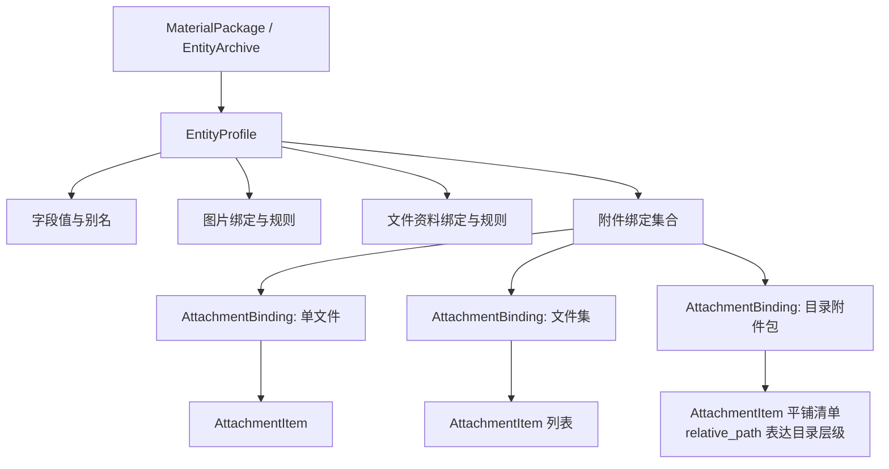
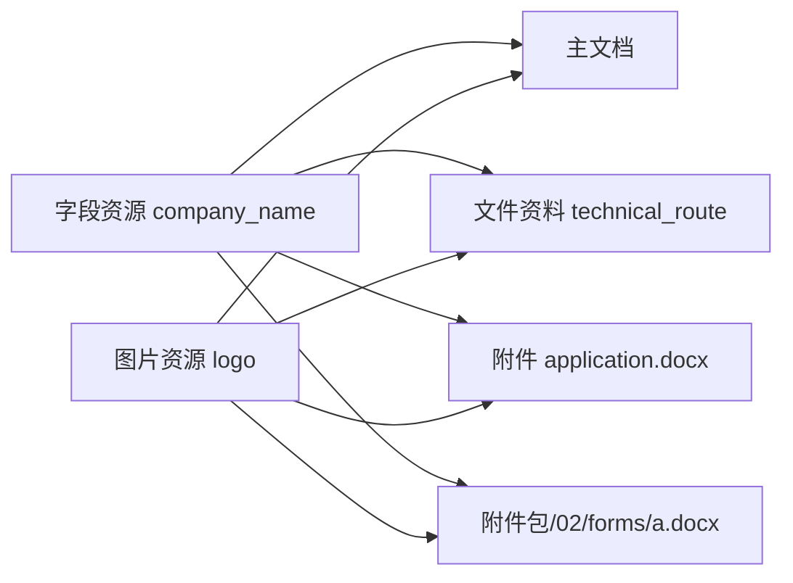
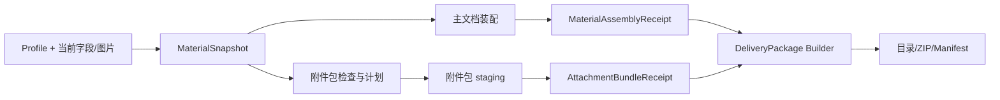

# 附件单文件与文件包嵌套关系及占位符联动深度设计

日期：2026-07-13

审阅范围：附件资料、文件资料、字段资料、图片资料、资料包持久化、Material Snapshot、Token 路由、交付包生成及其 UI 投影边界。

文档性质：目标架构与重构约束。本文先确定领域嵌套和执行所有权，控件外观、尺寸、间距和最终交互样式放到后续阶段。

相关既有文档：

- `docs/audits/图片材料单图多图分层与链路重构深度分析_2026-07-12.md`
- `docs/audits/文件资料DOCX内容装配与图片水印原页自适应顶层规划_2026-07-12.md`
- `docs/audits/场景方案模板母版资料包资源隔离与链路杂糅深度审计_2026-07-11.md`

## 0. 结论先行

附件深化不能只在页面上复制“单图 / 多图文件夹”的控件。正确方向是一次边界较小、语义完整的纵向重构：

1. `EntityProfile` 继续分别拥有字段、图片、文件资料和附件资料，四个领域不合并。
2. 附件来源明确分为单文件、显式文件集和目录文件包；目录文件包是一个逻辑绑定，内部包含多项文件。
3. 目录层级不建递归领域对象，只用每个文件的规范化 `relative_path` 表达；UI 需要树时再按路径投影。
4. 包内占位符不是附件的子字段。它们是“附件文件消费字段/图片资源”形成的多对多依赖，必须由独立依赖索引表达。
5. 字段值和图片来源只保留一份；主文档、文件资料和附件文件共同消费同一次冻结快照。
6. 文件资料仍在主文档内完成 Compose 后统一填充；附件 DOCX 在只读原件的工作副本上执行轻量替换，不进入完整排版 Pipeline。
7. 同一个 `{{@img:LOGO1}}` 出现在多个文件中是多个消费者各自的一次出现，不能把整个文件包的出现次数合并后套用 `exactly_one`。
8. 附件在 `MaterialSnapshot` 中必须恢复强类型，不能继续退化为无类型 `attachment_refs`。
9. 交付包的复制、目录重建和 ZIP 生成必须从 UI 层下沉到服务层；UI 只投影计划、状态和回执。
10. 控件样式最后处理。服务、计划、事务和回执未闭合前，不新增假完成的文件夹按钮。
11. Token 必须使用注册命名空间：`@text`、`@time`、`@file`、`@img`、`@attach`。裸 `{{LOGO1}}` 只作为旧资料迁移输入，运行时不再靠名称或声明顺序猜类型。

推荐原则可以压缩为一句话：

> 所有权用树，资源联动用图，执行过程用单向阶段；不要把三种关系硬塞进同一个嵌套 JSON。

## 1. 先统一术语，避免“包”字继续混用

当前讨论中至少存在三种“包”，必须在代码和文档中分开命名。

| 中文名 | 建议英文名 | 含义 | 是否拥有 Profile |
| --- | --- | --- | --- |
| 资料包 | `MaterialPackage` | 输入配置资源，当前对应 `EntityArchive` | 是 |
| 附件包 | `AttachmentBundle` | 一个附件角色绑定的文件夹或文件集合 | 否 |
| 交付包 | `DeliveryPackage` | 最终输出目录/ZIP，包含文档、附件、清单和报告 | 否 |

由此得到以下明确边界：

- 附件文件夹不是嵌套的 `EntityArchive`。
- 附件文件夹中的 `package.json` 不自动成为下一级资料包。
- 交付包不是输入资料包的回写版本。
- 一个附件 DOCX 含有字段，不会因此变成“文件资料”；领域由它的执行终点决定。

执行终点仍按以下定义判断：

| 领域 | 执行终点 |
| --- | --- |
| 字段资料 | 替换文本 Token |
| 文件资料 | 解析为内容片段并插入主文档 |
| 图片资料 | 作为图片资源插入某个文档消费者 |
| 附件资料 | 独立文件或文件包进入交付包 |

## 2. 当前代码事实与主要断点

### 2.1 已有基础是可复用的

当前已经存在：

- `FileAssetRef`：路径、原名、MIME、SHA-256、大小的强文件身份。
- `AttachmentItem` 与 `AttachmentBinding`：附件条目和角色绑定。
- `MaterialAssetRoleSpec.source_kind/recursive`：Schema 层已经具备文件或目录来源词汇，但当前附件 UI 投影没有把它们带入 `AttachmentRoleSpec` 和附件 binding。
- `EntityProfile.attachment_bindings` 与 `MaterialExecutionContext.attachment_bindings`：配置态和运行上下文中的强类型附件事实。
- `MaterialSnapshotBuilder._freeze_attachment_domain()`：冻结前的文件存在性、扩展名、大小和哈希校验。
- `replace_document_exact_placeholders()`：纯 DOCX 精确字段替换能力。
- `route_material_tokens()`：字段、图片、文件资料和附件引用 Token 的单一路由器。
- `ImageInsertionPlanBuilder`：图片 Token 到稳定 marker 和插图计划的现有主链。
- 文件资料 `Compose -> Fill -> Image Plan` 的阶段顺序，能让插入内容中的普通字段继续被统一填充。

因此不需要重写资料包、Token 路由、字段替换或图片变换。需要补的是附件集合语义、消费者作用域和独立附件处理事务。

### 2.2 `AttachmentCardinality` 不能表达“一个文件夹包”

当前：

```text
AttachmentBinding
  cardinality = single | multiple
  items = tuple[AttachmentItem, ...]
```

且 `single` 明确禁止多于一个 `items`。

但“一个资质材料文件夹”在业务上是一个逻辑附件包，内部可以有 30 个文件。若直接把它写成 `multiple`，会把以下两个概念混为一谈：

- 用户绑定了几个逻辑来源；
- 一个目录来源中解析出多少文件。

因此来源形态必须从 cardinality 中拆出。

### 2.3 当前附件没有相对路径，无法表达目录树

`AttachmentItem` 当前只有文件身份、标签和序号，没有 `relative_path`。自包含资料包导出时又把附件扁平复制为：

```text
attachments/<profile>/<role>/001_<original_name>
```

这会丢失：

- 原子目录层级；
- 同名文件的来源位置；
- 包内文档间的相对引用关系；
- 用户对文件包结构的认知。

目录文件包必须以相对路径作为稳定结构事实。

### 2.4 Snapshot 中的附件事实发生了类型降级

当前链路为：

```text
EntityProfile.attachment_bindings: dict[str, AttachmentBinding]
    -> MaterialExecutionContext.attachment_bindings: dict[str, AttachmentBinding]
    -> MaterialSnapshot.attachment_refs: Mapping[str, object]
```

`MaterialSnapshotBuilder` 已经得到 `AttachmentBinding`，但又调用 `to_dict()` 写进无类型映射。结果是：

- Snapshot 无法直接校验附件绑定内的嵌套不变量；
- 后续服务需要重复解析字典；
- 报告只能统计 role 数量，不能消费强类型条目；
- 新增 `source_kind/relative_path/processing_mode` 时容易在某个字典投影中丢失。

这是实现新功能前应先修复的边界。

### 2.5 交付包业务逻辑位于 UI 层

`src/ui/panels/workbench/material_artifacts.py` 当前负责：

- 删除已有 package 目录；
- 复制字段、图片、内容、附件和输出引用；
- 处理文件名冲突；
- 写 package manifest；
- 写 Markdown 报告；
- 生成 ZIP。

这已经不属于 presenter。若继续在该文件中添加目录递归、DOCX 替换、占位符诊断、包内事务和回滚，UI 会成为第二个装配引擎。

此外，当前目录产物先 `rmtree()` 再重建；ZIP 虽使用临时文件替换，但目录本身不是“成功后整体提升”的事务。附件包深化前应把这条链下沉并改为 staging 目录发布。

### 2.6 当前 Token occurrence 身份没有文档作用域

`MaterialTokenOccurrence.occurrence_id` 当前由以下信息生成：

```text
story_id + surface + block_id + start/end + token + token_ordinal
```

这些信息在一份 DOCX 内稳定，但不包含“这是哪个文件”。两个附件 DOCX 若结构相同、Token 位置相同，会得到相同 occurrence ID。

图片 job 和 marker 的身份继续使用 occurrence ID。如果多文件包直接复用同一 snapshot 和同一图片来源，跨文件回执可能出现身份碰撞。

因此附件多文档链必须引入稳定 `consumer_id`，并把它加入 occurrence、job、plan 和 receipt 的身份空间。

## 3. 不要把四种“嵌套”混成一种

### 3.1 所有权关系：严格树形

所有权回答“谁负责持久化和生命周期”。目标树为：



所有权不允许反向：

- `AttachmentItem` 不拥有字段值或图片文件。
- 字段资料不拥有消费者文件。
- 图片规则不拥有附件包。
- UI 行不拥有领域模型，只保存稳定 role/item ID。

### 3.2 文件系统层级：路径投影，不是递归领域树

目录附件包应保存一个平铺且稳定排序的条目清单：

```text
AttachmentBinding(role="qualification_bundle")
  items:
    - relative_path = "01_主体/营业执照.pdf"
    - relative_path = "02_资质/一级资质.docx"
    - relative_path = "02_资质/专业资质/证书A.pdf"
```

不建议创建：

```text
AttachmentFolder
  children: tuple[AttachmentFolder | AttachmentItem, ...]
```

原因：

- 递归对象增加序列化、迁移、增量更新和删除的复杂度；
- 文件夹本身没有独立处理策略和业务身份；
- 相对路径已经完整表达层级；
- UI 可以按 `/` 分段实时构造树，无需把展示树持久化；
- 平铺清单更容易做排序、哈希、冲突检测和并行处理。

因此“树”只存在于 UI 投影，不进入领域持久化。

### 3.3 字段/图片联动：多对多依赖图

一个字段可以被主文档、多个文件资料和多个附件文件使用；一个附件文件也可以同时使用多个字段和图片。

这不是父子关系，而是多对多图：



禁止把解析后的值复制进每个附件条目：

```text
AttachmentItem.fields = {...}       # 禁止
AttachmentItem.logo_path = ...      # 禁止
```

正确方式是保存派生依赖索引：

```text
consumer + token occurrence -> field key / image role
```

字段或图片值变更时，不修改附件绑定；下一次执行使用新的冻结快照重新生成副本。

### 3.4 执行关系：单向阶段图

执行关系回答“谁先生成什么事实”。它不是所有权树，也不能写回配置模型：



计划、staging 路径、输出哈希和回执不得写回 `EntityProfile` 或 `MaterialSnapshot`。

## 4. 推荐附件数据契约

### 4.1 来源类型

```python
class AttachmentSourceKind(str, Enum):
    SINGLE_FILE = "single_file"
    FILE_SET = "file_set"
    DIRECTORY_PACKAGE = "directory_package"
```

语义：

- `SINGLE_FILE`：一个角色绑定一个文件。
- `FILE_SET`：兼容现有多文件选择；多项文件没有共同目录语义。
- `DIRECTORY_PACKAGE`：一个角色绑定一个根目录，内部递归发现多项文件并保留相对路径。

不要再用 `cardinality=multiple` 推断来源是文件夹。

### 4.2 处理模式

首版只需要两个模式：

```python
class AttachmentProcessingMode(str, Enum):
    PASSTHROUGH = "passthrough"
    SUBSTITUTE_COPY = "substitute_copy"
```

- `PASSTHROUGH`：校验后原样复制。
- `SUBSTITUTE_COPY`：在工作副本中处理受支持 DOCX；不支持处理的文件仍按明确策略原样复制。

首版不增加文件级覆盖模式。一个附件包只有一份默认处理策略，减少 UI 和计划分支。确有例外时优先拆成两个附件绑定，而不是在每个文件上叠开关。

### 4.3 条目契约

建议扩展而不是另建平行附件条目：

```python
@dataclass(frozen=True, slots=True)
class AttachmentItem:
    item_id: str
    relative_path: str
    file_ref: FileAssetRef
    sequence: int = 0
    label: str = ""
```

核心不变量：

1. `relative_path` 必须是规范化 POSIX 相对路径。
2. 禁止绝对路径、`..`、空段、驱动器前缀和目录逃逸。
3. 同一 binding 内 `relative_path.casefold()` 唯一。
4. `item_id` 建议由 `role + normalized relative_path` 生成，不包含内容哈希；文件内容变化时身份保持，revision 变化。
5. `sequence` 由规范化相对路径自然排序生成，只负责稳定显示和处理顺序，不改写文件名。
6. `file_ref` 继续持有内容哈希与大小。

### 4.4 绑定契约

```python
@dataclass(frozen=True, slots=True)
class AttachmentBinding:
    role: str
    label: str = ""
    source_kind: AttachmentSourceKind = AttachmentSourceKind.SINGLE_FILE
    source_path: str = ""
    recursive: bool = False
    processing_mode: AttachmentProcessingMode = AttachmentProcessingMode.PASSTHROUGH
    items: tuple[AttachmentItem, ...] = ()
    required: bool = False
    min_items: int = 0
    max_items: int | None = 1
    accepted_media_types: tuple[str, ...] = ()
    accepted_extensions: tuple[str, ...] = ()
    binding_revision: str = ""
```

不变量：

| source_kind | source_path | items |
| --- | --- | --- |
| `single_file` | 文件路径 | 恰好 0 或 1 项；required 时必须 1 项 |
| `file_set` | 可为空或仅作来源说明 | 0..N 项 |
| `directory_package` | 根目录路径 | 0..N 项，全部具有根目录内相对路径 |

`binding_revision` 应由以下规范事实计算：

```text
role
+ source_kind
+ recursive
+ processing_mode
+ 每项 relative_path/media_type/size/content_sha256
+ 合同版本
```

绝对 `source_path` 不进入可移植 revision；否则同一附件包移动目录后会被误判为不同内容。

### 4.5 不新增递归 `AttachmentPackage` 子对象

`AttachmentBinding(source_kind=directory_package)` 本身就是一个附件包。不要再嵌一层：

```text
AttachmentBinding -> AttachmentPackage -> AttachmentFolder -> AttachmentItem
```

这三层没有额外业务含义，只会增加转换和空状态。推荐保持：

```text
AttachmentBinding -> tuple[AttachmentItem]
```

## 5. 共享依赖索引，而不是把占位符塞进附件条目

### 5.1 为什么占位符索引不能持久化在 `AttachmentItem`

扫描结果依赖：

- scanner contract 版本；
- Token 声明版本；
- 字段别名；
- 图片规则；
- 文件内容哈希；
- 支持 surface 的能力版本。

如果把 `placeholders` 直接写入 `AttachmentItem`，每次规则升级都要迁移资料包，而且极易出现“文件已变化但旧扫描结果还在”的双真相。

因此扫描结果应是派生索引/回执，可缓存但不作为 Profile 事实源。

### 5.2 最小消费者身份

建议增加一个很小的跨领域身份对象：

```python
class MaterialConsumerKind(str, Enum):
    MAIN_DOCUMENT = "main_document"
    CONTENT_SOURCE = "content_source"
    ATTACHMENT_ITEM = "attachment_item"

@dataclass(frozen=True, slots=True)
class MaterialConsumerRef:
    kind: MaterialConsumerKind
    owner_id: str
    item_id: str = ""

    @property
    def consumer_id(self) -> str:
        ...
```

示例：

```text
main:source-docx
content:technical_route
attachment:qualification_bundle:att-02-forms-a-docx
```

它只负责身份，不负责打开文件、路由 Token 或持久化值，因此不会成为新的“万能对象”。

### 5.3 平铺依赖 occurrence

```python
@dataclass(frozen=True, slots=True)
class MaterialDependencyOccurrence:
    occurrence_id: str
    consumer: MaterialConsumerRef
    token: str
    kind: MaterialTokenKind
    resource_key: str
    surface: str
    replaceable: bool
    reason: str = ""
```

`MaterialDependencyIndex` 只需要：

```python
@dataclass(frozen=True, slots=True)
class MaterialDependencyIndex:
    scanner_contract: str
    occurrences: tuple[MaterialDependencyOccurrence, ...]
    diagnostics: tuple[...]
```

UI 可按 `consumer`、文件路径或 Token 分组展示，但领域层仍保持平铺。

### 5.4 occurrence 和 job 必须带 consumer scope

跨文档稳定身份建议为：

```text
scoped_occurrence_id = hash(consumer_id + router_occurrence_id)
image_job_id = hash(snapshot_id + consumer_id + rule_id + scoped_occurrence_id + image_item_id)
```

同一个 `{{@img:LOGO1}}` 出现在两个附件文件中时：

- 两个文件各有一个 occurrence；
- 每个文件分别执行自己的 occurrence policy；
- 聚合页显示“2 个文件、2 处”；
- 不产生“全包出现两次，违反 exactly_one”的错误；
- 两个图片 job 和回执身份不同。

## 6. Token 路由与联动规则

### 6.1 类型由命名空间唯一决定

最终采用注册命名空间，不再使用“先看图片声明、否则当字段”的顺序判定：

| Token | 内部 kind | producer | 在附件 DOCX 内 |
| --- | --- | --- | --- |
| `{{@text:company_name}}` | `FIELD` | 手工值/函数值 | 可替换 |
| `{{@time:issue_date}}` | `FIELD` | 时间线 | 可替换 |
| `{{@file:technical_route}}` | `CONTENT` | 文件资料绑定 | 阻断递归 |
| `{{@img:LOGO1}}` | `IMAGE` | 图片绑定 | 满足 surface 门禁时可替换 |
| `{{@attach:evidence}}` | `ATTACHMENT` | 附件绑定 | 阻断递归 |

资源存在性仍由依赖索引验证：

- `@text/@time` 必须解析到 `field_values` 和冻结映射；
- `@img` 必须解析到冻结图片规则和图片来源；
- `@file` 必须有文件资料声明，且只能由主文档 Compose 消费；
- `@attach` 必须有附件绑定，且只能由主文档的附件清单渲染器消费；
- 附件 DOCX 内出现 `@file` 或 `@attach` 时，`SUBSTITUTE_COPY` 直接阻断，避免递归装配。

命名空间使“同名字段与图片冲突”在结构上消失：`{{@text:LOGO1}}` 与 `{{@img:LOGO1}}` 是两个明确资源，可以同时存在且互不遮蔽。不要根据名字包含 `LOGO`、`签名` 或 `图片` 猜类型，也不要恢复运行时裸 Token 兼容分支。

### 6.2 字段别名必须进入冻结边界

`MaterialSnapshot` 必须冻结 `EntityProfile.field_aliases`。若附件中使用 `{{@text:企业名称}}`，仅凭运行时 UI 状态无法证明它应读取 `company_name`。

推荐 Snapshot 增加：

```python
field_aliases: Mapping[str, str]
```

或等价的已解析映射：

```python
field_token_bindings: Mapping[str, str]  # @text/@time key -> canonical field key
```

首选后者，因为它已经完成冲突校验，附件处理器不需要重新解释 UI 别名。

### 6.3 处理顺序

单个附件 DOCX 的顺序应固定为：

```text
打开工作副本
    -> 扫描并路由全部 Token
    -> 校验字段/图片资源与 surface
    -> 替换字段 Token
    -> 重新扫描结构/图片 Token
    -> 建立图片计划与 consumer-scoped job
    -> 图片变换与 Office 插入
    -> 残留 Token / OOXML / 图片回执校验
    -> 保存候选文件
```

必须先路由再做字段替换。精确替换器只接收依赖索引已经判定为 `FIELD` 且可替换的 occurrence；图片、文件资料和附件引用不会进入文本替换映射。

### 6.4 支持格式边界

首版建议：

| 文件类型 | 扫描 | 替换 | 处理方式 |
| --- | --- | --- | --- |
| DOCX | 精确 Token + surface | 字段；满足能力门禁的图片 | 工作副本处理 |
| PDF | 不做 OCR Token 判断 | 不替换 | 原样复制 |
| XLSX/XLS | 不在首版扫描 | 不替换 | 原样复制 |
| 图片 | 无内部 Token | 不替换 | 原样复制 |
| MD/TXT/CSV | 附件域首版不处理 | 不替换 | 原样复制 |
| ZIP/嵌套压缩包 | 视为不透明文件 | 不展开 | 原样复制 |

不要因为 TXT 替换看似简单就立即开放。编码、换行、CSV 引号和签名校验都需要独立合同；应在 DOCX 主链稳定后单独加入。

### 6.5 DOCX 图片的当前真实边界

现有图片计划首版只允许直接正文中的独占 Token 段落。表格单元格、页眉页脚、文本框和其他 story 会被识别但阻断图片插入。

这意味着：

- `{{@img:LOGO1}}` 放在普通正文独立段落，可进入现有能力复用评估。
- Logo 常见的页眉/表格位置仍需专项扩展。
- UI 不能只显示“发现 Logo”，必须同时显示“发现但当前 surface 不可替换”。

支持新 surface 时应扩展同一个 planner/Office 事务，不另写附件专用 `add_picture()` 快捷路径。

## 7. MaterialSnapshot 的最小重构

### 7.1 从无类型 attachment_refs 恢复强类型

推荐：

```python
@dataclass(frozen=True, slots=True)
class MaterialSnapshot:
    ...
    field_values: Mapping[str, object]
    field_token_bindings: Mapping[str, str]
    content_bindings: tuple[ContentMaterialBinding, ...]
    content_rules: tuple[ContentInsertionRule, ...]
    frozen_image_rules: tuple[FrozenImageMaterialRule, ...]
    image_source_bindings: tuple[ImageSourceBinding, ...]
    attachment_bindings: tuple[AttachmentBinding, ...]
    source_revisions: Mapping[str, str]
```

`AttachmentBinding` 已是 frozen 强类型，不需要仅为了名字再复制一套 `FrozenAttachmentBinding`。只有未来配置态真的需要保留未解析目录表达式时，才引入单独 Source Spec。

### 7.2 Snapshot 不保存哪些内容

继续禁止写入：

- UI 展开/折叠状态；
- 文件树节点；
- 扫描缓存对象；
- 输出路径；
- per-file staging 路径；
- resolved image job；
- 替换数量；
- 生成结果哈希。

这些属于计划或回执。

### 7.3 合同版本

强类型附件、不可变内容制品引用和命名空间 Token 已使 Material Snapshot 提升到 `material-snapshot-v4`。旧 Snapshot 不在运行期猜测迁移。

实体资料包当前写入 v5。v5 同时冻结内容制品引用和新 Token 合同；直接加载非 v5 包会明确拒绝，迁移应由独立导入/升级流程完成，不能在 v5 loader 中静默改变旧 `cardinality` 或裸 Token 的含义。

## 8. 文件资料中的内部字段如何联动

文件资料与附件文件看似都可能是 DOCX，但执行语义不同。

### 8.1 文件资料

```text
ContentMaterialBinding + ContentArtifactRef
    -> MD/DOCX importer
    -> DocumentFragment
    -> 插入主文档
    -> 主文档统一 Fill
    -> 主文档统一 Image Plan
```

因此文件资料中的普通字段不应预先写回源文件，也不应生成独立副本。它们在 Compose 后随主文档一起填充。

需要补充的是：

- 在选择文件资料时生成 `MaterialDependencyIndex`；
- 预览能提前显示文件资料中的字段和图片依赖；
- 未识别或裸 Token 在执行前阻断，而不是等 Compose 后才暴露；
- 依赖 occurrence 归属于 `content:<content_id>`，但运行仍发生在主文档。
- 文件资料内部只允许 `@text/@time` 行内字段；再次出现 `@file`、`@img` 或 `@attach` 不作为递归子资料解释。

### 8.2 附件文件

```text
AttachmentItem
    -> 保持完整 DOCX
    -> 工作副本轻量替换
    -> 作为独立文件进入附件包/交付包
```

附件 DOCX 不应进入 `ContentMaterialComposer`：

- Composer 面向“内容片段”，会拒绝或降解页眉、复杂分节、形状等整文档对象；
- 附件需要保持完整文档身份和原始版式；
- 附件不应被主文档的标题识别、编号、页面、段落和表格格式模块重排。

附件内部允许消费共享的 `@text/@time` 和 `@img`，但不允许继续消费 `@file` 或 `@attach`。后两者会把轻量副本处理升级成递归 Compose/递归附件包，首版必须在依赖预检阶段阻断。

### 8.3 共同点只在资源和检查层

两者可以共享：

- `FileAssetRef`；
- Token 语法和类型路由；
- 字段冻结值；
- 图片来源；
- 依赖索引的数据形状；
- 残留 Token 诊断语义。

两者不能共享完整装配执行器。

## 9. 附件处理服务，不复用完整 MaterialAssemblyService

### 9.1 为什么不能把附件 DOCX 当主文档再跑一次

`MaterialAssemblyService` 还负责：

- 内容资料 Compose；
- 普通 Pipeline；
- 标题、编号、题注和引用；
- 页面、段落、表格、页眉页脚格式；
- 变体分叉；
- 主文档 final 发布。

附件只需要替换和保持版式。直接复用完整服务会让一个“替换 Logo”的附件意外被重新排版。

### 9.2 推荐服务边界

```text
AttachmentBundleService
  输入：MaterialSnapshot + AttachmentBinding
  责任：检查、计划、工作副本处理、目录 staging、验证、原子发布
  输出：AttachmentBundleReceipt
```

服务内部可复用纯能力：

- `replace_document_exact_placeholders()`；
- `route_material_tokens()`；
- 图片 source/rule freeze 结果；
- `ImageInsertionPlanBuilder` 的计划能力；
- 图片 transform 与 Office layout 基础设施；
- `FileAssetRef` 和哈希验证。

需要一个小的附件文档适配器，负责：

1. 给文档分配 `consumer_id`；
2. 只选择本文件实际出现的图片规则；
3. 把 occurrence/job 身份加上 consumer scope；
4. 构造附件专用 document plan；
5. 不让“其他文件没有某个图片锚点”触发全局 required 错误。

### 9.3 不应复用的部分

- 不调用 `ContentMaterialComposer`。
- 不调用完整格式 Pipeline。
- 不把附件伪装成 main document variant。
- 不从 UI presenter 循环处理文件。
- 不在失败时降级为“把图片追加到文末”。

### 9.4 计划和回执

推荐最小计划：

```python
@dataclass(frozen=True, slots=True)
class AttachmentDocumentPlan:
    plan_id: str
    snapshot_id: str
    consumer_id: str
    binding_role: str
    item_id: str
    input_ref: FileAssetRef
    output_relative_path: str
    dependency_index_id: str
    resolved_image_plans: tuple[ResolvedImageInsertionPlan, ...] = ()
```

推荐回执：

```python
@dataclass(frozen=True, slots=True)
class AttachmentFileReceipt:
    consumer_id: str
    item_id: str
    relative_path: str
    input_sha256: str
    output_sha256: str
    status: str              # passthrough | substituted
    field_replacement_count: int
    image_job_count: int
    unresolved_tokens: tuple[str, ...]

@dataclass(frozen=True, slots=True)
class AttachmentBundleReceipt:
    snapshot_id: str
    binding_role: str
    binding_revision: str
    files: tuple[AttachmentFileReceipt, ...]
    bundle_sha256: str
```

回执是交付 Manifest 的事实来源，Manifest 不再根据文件是否存在反推“已处理”。

## 10. 与主文档装配和交付包的关系

### 10.1 共用一次 Snapshot

附件处理不得重新求值字段函数、日期或时间计划。最稳妥的调用关系为：

```text
MaterialAssemblyService 成功
    -> 从 MaterialAssemblyReceipt 取得同一 intake_snapshot
    -> AttachmentBundleService 消费该 snapshot
```

没有主文档的纯附件场景，可以由顶层入口单独调用同一个 Snapshot Builder，但一次执行仍只允许产生一份 snapshot。

### 10.2 附件默认是 Profile 级，不随主文档 variant 复制事实

首版建议附件绑定属于 Profile，对所有主文档交付变体共用。

如果未来需要“内部版包含附件 A，客户版不包含”，应新增变体到附件 role 的显式包含策略，不复制第二份 AttachmentBinding，也不把附件绑定嵌进 `DeliveryVariantPlan`。

### 10.3 原子边界

推荐明确三条事务：

1. 主文档多变体事务：沿用现有 `MaterialAssemblyService`。
2. 每个附件包事务：所有必需文件处理成功后整体发布该包。
3. 交付包目录/ZIP 事务：在 staging 中收集已成功的文档和附件回执，完成后提升。

这三条目前不宣称是一个跨产物原子事务。若附件包失败：

- 已成功发布的主文档不伪装回滚；
- 交付包不发布或标记为 `partial_success`；
- 报告准确记录附件包失败。

### 10.4 主文档中的 `@attach` 只渲染清单引用

附件绑定派生唯一 Token：`{{@attach:<role>}}`。它不是把二进制文件嵌入 DOCX，也不是把附件包变成内容资料；它只在主文档直接正文的独占段落渲染确定性的附件清单行：

```text
{{@attach:qualification_evidence}}
    -> 附件：ISO9001质量管理体系认证证书（evidence.pdf）
```

约束如下：

- Token 只能位于主文档直接正文的独占段落；表格、页眉、页脚和混排段落阻断；
- 同一 role 最多出现一次，缺席是合法 no-op；
- Token 存在但 binding 为空时阻断，避免正文声称有附件而实际无文件；
- 渲染回执进入 `ComposeReceipt.attachment_render_receipts`；
- 实际附件文件仍由 `AttachmentBundleService` 和交付包回执负责，DOCX 渲染器不复制文件；
- 附件包失败时顶层结果为 `partial_success`，不能把原件冒充成功处理结果。带附件清单的部分成功产物不可视为可直接交付，UI 必须同时展示失败 role。

## 11. 必须先做的两项链路重构

### 11.1 P0-A：Snapshot 附件强类型化

改造范围：

```text
src/config/material_snapshot.py
src/config/material_snapshot_builder.py
src/reporting/material_assembly.py
相关 snapshot / assembly tests
```

目标：

- `attachment_refs` 退出新合同；
- Snapshot 保存排序后的 `tuple[AttachmentBinding, ...]`；
- canonical JSON 直接调用 typed binding 的 `to_dict()`；
- Snapshot 自身校验 role、item ID、relative path 和 revision 唯一性；
- 旧合同只读迁移。

这是小而高价值的重构，可避免后续所有附件服务重复解析 dict。

### 11.2 P0-B：交付包构建器退出 UI

当前 `material_artifacts.py` 中的目录复制、冲突处理、ZIP 和 manifest 生成应下沉，例如：

```text
src/services/material_delivery/package_builder.py
```

UI 保留：

- 是否请求产物；
- 调用服务；
- 保存返回路径；
- 展示回执/错误。

服务负责：

- staging 目录；
- 路径安全；
- 复制与树结构；
- manifest；
- ZIP 临时文件；
- 原子提升和失败清理。

只有完成该下沉后，附件处理结果才接入交付包；否则业务逻辑会继续堆在 presenter。

## 12. 建议代码边界，避免模块爆炸

不建议为每个小步骤创建一个文件，也不建议创建通吃四个资料域的 `GenericMaterialBinding[T]`。

推荐保持有限边界：

| 文件/模块 | 唯一职责 |
| --- | --- |
| `src/config/attachment_materials.py` | 附件来源、条目、绑定、处理模式、计划/回执基础契约 |
| `src/services/material_attachments/intake.py` | 单文件/文件集/目录枚举、字节校验、相对路径、revision |
| `src/services/material_attachments/processing.py` | DOCX 检查、consumer-scoped 计划、字段/图片替换、附件包 staging 与回执 |
| `src/shared/engine/material_dependency_index.py` | 纯消费者身份和 occurrence 聚合；不做 I/O |
| `src/services/material_delivery/package_builder.py` | 最终交付目录/ZIP 的事务构建 |

可共享的只应是底层纯函数：

- 自然路径排序；
- 规范化相对路径；
- 文件哈希；
- 路径是否位于根目录；
- Token 路由。

不要因为图片和附件都有 `source_kind=directory` 就让附件继承图片 `AssetBinding`。同形字段不等于同一领域语义。

## 13. 文件包 intake 与结构规则

### 13.1 枚举

目录包 intake 应：

1. 验证根目录存在且可读。
2. 按 `recursive` 决定遍历深度。
3. 拒绝符号链接、junction/reparse point 越界和循环。
4. 生成规范化 POSIX `relative_path`。
5. 按自然相对路径稳定排序。
6. 验证扩展名和真实文件字节。
7. 计算每项 SHA-256 和 aggregate revision。
8. 一次性返回完整 binding 或结构化诊断；不返回半个 binding。

### 13.2 冲突

以下情况阻断，不静默改名：

- Windows 大小写折叠后相同的相对路径；
- `a/../b` 等逃逸路径；
- FILE_SET 中两个不同来源使用同一输出相对路径；
- 输出路径与 manifest/report 保留名冲突；
- 文件数或总大小超过限制；
- 选择过程中源文件发生变化。

当前交付包构建器的 `_unique_package_path()` 会自动增加 `_2`。对普通报告副本可能可接受，但对附件包目录树不应使用；因为静默改名会破坏用户结构和文件间引用。

### 13.3 原始文件只读

禁止：

- 在源目录内 rename；
- 在源 DOCX 上直接保存；
- 为“同步”方便把字段值写回资料包源文件；
- 清理用户源目录中的临时文件。

所有处理只发生在 orchestrator-owned staging。

## 14. 预检和失败语义

### 14.1 处理模式决定错误级别

| 情况 | PASSTHROUGH | SUBSTITUTE_COPY |
| --- | --- | --- |
| PDF/图片等不可处理格式 | 正常原样复制 | 正常原样复制，并报告 opaque |
| DOCX 无 Token | 正常复制 | 正常复制或 substituted=0 |
| DOCX 有已知且资料齐全字段 | 不替换 | 替换 |
| DOCX 有已知图片 Token，surface 支持 | 不替换 | 进入图片计划 |
| DOCX 有已知图片 Token，surface 不支持 | 不替换，信息提示 | 阻断该必需文件 |
| 未知 `{{...}}` | 信息/警告 | 默认阻断，防止拼写错误漏出 |
| 已知字段但值缺失 | 信息/警告 | 阻断 |
| 文件哈希在 Freeze 后变化 | 阻断发布 | 阻断发布 |

### 14.2 文件级与包级失败

- 可选文件失败：是否允许跳过必须由 Schema/Binding 明确，不能运行时猜测。
- required binding 中任一计划内必需文件失败：整个附件包不发布。
- 任何失败都不能留下“部分更新的同名附件包目录”。
- 回执必须区分 `passthrough`、`substituted`、`not_applicable`、`failed`。

## 15. UI 信息架构，只定层级不定样式

本轮只冻结信息层级：

```text
附件资料
  ├─ 单文件
  │   └─ AttachmentBinding 行
  └─ 文件包
      └─ AttachmentBinding 行
          └─ 详情
              ├─ 概览
              ├─ 包内文件树（relative_path 投影）
              ├─ 字段/图片依赖
              └─ 问题与修复入口
```

主行只显示稳定摘要：

- 角色/名称；
- 来源；
- 文件数量；
- 可处理/原样文件数量；
- Token 总数；
- 已关联/待关联/不支持数量；
- 最近扫描 revision。

不要在顶层展开所有包内文件，也不要给附件角色伪造 `{{附件1}}` Token。附件 role 是结构化 ID，不是正文锚点。

字段资料和图片资料只增加反向使用摘要，例如：

```text
公司名称：主文档 1、文件资料 2、附件文件 5
Logo：主文档 1、附件文件 3
```

点击后按依赖索引定位消费者。值编辑仍回到字段/图片资料，不在附件详情复制编辑器。

控件类型、按钮数量、行高、图标和响应式策略待领域服务与回执落地后再设计。

## 16. 迁移策略

### 16.1 旧 v3/v4 资料包升级

```text
cardinality=single
    -> source_kind=single_file
    -> relative_path=original_name

cardinality=multiple
    -> source_kind=file_set
    -> 每项 relative_path=original_name
```

上述是独立升级器应执行的确定性映射，不是 v5 loader 的隐式兼容分支。若 multiple 中出现大小写折叠同名，升级器不能自动加 `_2`；应生成迁移诊断并要求用户重新选择或确认目标名。

旧格式没有可靠根目录信息，不能自动猜成 `directory_package`。

旧 Token 必须按已有声明做一次性迁移：

```text
已绑定字段 {{company}}      -> {{@text:company}}
时间线字段 {{issue_date}}   -> {{@time:issue_date}}
图片规则 {{LOGO1}}          -> {{@img:LOGO1}}
文件资料 @content:route     -> @file:route
附件 role evidence          -> 可新增 {{@attach:evidence}}，但不自动插入模板
```

无法由旧声明唯一判定类型的裸 Token 必须留作迁移诊断，不能按名称猜测。

### 16.2 自包含资料包目录

新包保存为：

```text
attachments/<profile>/<role>/<relative_path>
```

不再按序号扁平化。`sequence` 写入 manifest，但物理路径保留相对结构。

### 16.3 旧 Snapshot

- 运行时只接受 `material-snapshot-v4`，旧 `attachment_refs` 不在 `from_dict()` 内猜测转换。
- 若后续提供离线升级器，它必须输出全新的 v4 Snapshot/资料包且不改写原回执文件。
- 新运行只生成新合同版本。
- 旧合同和未知未来合同都明确拒绝。

## 17. 分阶段实施顺序

### P0：契约和层级收口

1. 本文评审通过。
2. Snapshot 附件强类型化。
3. 冻结 field token binding/alias。
4. 交付包 Builder 从 UI 下沉。
5. 增加架构测试，禁止 UI 层继续新增附件文件处理算法。

### P1：单文件/目录包 intake

1. 增加 source kind 和 processing mode。
2. 增加 `relative_path` 和 binding revision。
3. 实现安全目录枚举；旧包升级规则与严格 v5 loader 分离。
4. 自包含资料包保留目录树。

### P2：统一依赖索引

1. 增加 `MaterialConsumerRef` 和 consumer-scoped occurrence。
2. 主模板、文件资料、附件 DOCX 使用同一 Token 路由语义。
3. 预览/预检/Manifest 只投影一个依赖事实源。
4. 先不改控件样式，只提供结构化状态。

### P3：附件 DOCX 字段副本

1. `PASSTHROUGH` / `SUBSTITUTE_COPY` 闭环。
2. 复用精确字段替换。
3. 残留 Token、源漂移和包级事务验证。
4. 生成 `AttachmentBundleReceipt`。

### P4：附件 DOCX 图片 Token

1. 为 planner 增加 consumer scope。
2. 每个文件只选择实际出现的图片规则。
3. 复用图片变换和 Office 插入。
4. 先支持正文独占段落；表格/页眉等能力通过专项门禁逐步开放。

### P5：UI 与控件样式

1. 单文件/文件包信息分区。
2. 文件树和依赖详情投影。
3. 修复导航和反向使用统计。
4. 最后统一控件样式、密度和响应式布局。

该顺序可以避免“控件先完成、服务仍是假能力”的返工。

## 18. 验收矩阵

### 18.1 模型与持久化

```text
[x] 单文件 binding 只能拥有 0/1 项
[x] 目录包 binding 可以拥有多项且保持一个逻辑 role
[x] relative_path 规范、唯一、不可逃逸
[x] item_id 在内容修改后稳定，binding revision 改变
[x] 同一目录移动位置后 portable revision 不变
[x] v5 合同严格拒绝未知旧/未来版本；旧包升级规则已明确隔离
[x] 新自包含包保留目录树
```

### 18.2 依赖和身份

```text
[x] 主文档、文件资料和附件使用同一 Token 类型判定
[x] 同一 Token 在两个文件中产生不同 scoped occurrence ID
[x] exactly_one 以单个 consumer 为作用域
[x] `@img:LOGO1` 不会被字段替换器误当文本
[x] 字段别名使用冻结映射，不在附件处理时重新解释
[x] 未知 Token 在 SUBSTITUTE_COPY 下阻断
[x] `@text:LOGO1` 与 `@img:LOGO1` 可同名共存且互不遮蔽
[x] `@attach` 进入统一声明、依赖索引和 consumer scope
```

### 18.3 文件资料

```text
[x] 文件资料 DOCX/MD 中的字段在 Compose 后统一填充
[x] 文件资料源不被改写
[x] 文件资料依赖在执行前可见
[x] 文件资料内部 `@file/@attach` 递归嵌套继续阻断
```

### 18.4 附件副本

```text
[x] 原附件哈希始终不变
[x] 处理后的 DOCX 保持独立文件和相对路径
[x] 字段值与主文档使用同一 snapshot
[x] 支持 surface 的 `@img:LOGO1` 使用同一图片来源
[x] 不支持 surface 明确阻断，不追加文末
[x] 附件内部 `@file/@attach` 在依赖预检阶段阻断
[x] PDF/XLSX/图片按 opaque passthrough 记录
[x] Freeze 后源文件变化阻断发布
```

### 18.5 事务和交付包

```text
[x] 附件包失败不留下半成品目录
[x] 交付包目录在 staging 完成后整体提升
[x] ZIP 使用临时文件和原子替换
[x] Manifest 直接投影主文档与附件回执
[x] 文件名冲突预检阻断，不静默加 _2
[x] UI presenter 不包含目录递归、DOCX 处理或 ZIP 算法
[x] 主文档独占段落 `@attach` 渲染确定性附件清单并生成 Compose 回执
```

## 19. 明确不做的事情

首轮不做：

- 递归 `AttachmentFolder` 领域对象；
- 把附件包做成嵌套 `EntityArchive`；
- 附件内继续嵌套 `{{@file:...}}` 或 `{{@attach:...}}`；
- 在运行时把裸 `{{LOGO1}}` 猜成字段或图片；
- OCR 扫描或编辑 PDF；
- XLSX 内部字段和图片替换；
- 文件名/文件夹名 Token 替换；
- 每个文件一套字段覆盖；
- 每个文件一套处理开关；
- 让附件继承图片 `AssetBinding`；
- 为附件复制完整主文档 Pipeline；
- 在 UI 层处理目录、DOCX 或 Office；
- 在支持 surface 失败时静默降级或追加文末。

这些不是永久否决，而是防止首版同时引入递归模型、格式矩阵和大量例外分支。

## 20. 最终裁决

最合理的嵌套关系不是“附件包里再存一套字段资料”，而是：

```text
EntityProfile
  ├─ 一份字段/图片资源事实
  ├─ 文件资料消费者
  └─ 附件绑定
       └─ 平铺 AttachmentItem 清单
            └─ 通过 consumer-scoped occurrence 引用字段/图片资源
```

其中：

- `AttachmentBinding -> AttachmentItem` 是所有权；
- `AttachmentItem -> 字段/图片` 是依赖，不是嵌套；
- `relative_path` 表达目录，不建递归对象；
- `@text/@time/@file/@img/@attach` 由命名空间决定类型，不由所在页面或名称猜测；
- 主文档 `@attach` 只渲染附件清单引用，附件内部的 `@attach` 是禁止的递归；
- `MaterialSnapshot` 冻结共享值和强类型附件来源；
- `AttachmentBundleService` 生成独立副本和回执；
- `DeliveryPackageBuilder` 负责最终目录/ZIP；
- UI 最后只做投影。

按这一结构实施，新增单文件、文件包和包内同步替换只需要扩展一个附件纵向切片，不会再复制一套字段系统、图片系统或主文档装配系统。

## 21. 实施收口复审

本节记录 2026-07-13 的实际落地结果。它是实现回执，不改变前文的领域裁决。

### 21.1 已闭合的纵向链路

```text
Profile / MaterialExecutionContext
    -> MaterialSnapshot v4
    -> MaterialDependencyIndex
    -> 主文档 MaterialAssemblyReceipt
    -> 每个 role 独立 AttachmentBundleReceipt
    -> Material Manifest
    -> DeliveryPackage directory + ZIP
    -> Workbench 结构化结果投影
```

- P0：Snapshot 使用强类型 `AttachmentBinding`，字段别名冻结为 `field_token_bindings`；交付包构建算法已退出 UI。
- P1：单文件、文件集、目录包、`relative_path`、portable revision 和自包含目录树已落地；实体包使用严格 v5 合同，旧包升级与运行 loader 隔离。
- P2：主文档、文件资料和附件使用同一命名空间 Token Router；occurrence 身份包含 consumer scope；依赖索引成为预检、Manifest 和反向使用统计的唯一事实源。
- P3：`PASSTHROUGH` 与 `SUBSTITUTE_COPY` 在整包 staging 中执行；字段替换只修改副本；源漂移或任一必需文件失败时不发布半包。
- P4：附件 DOCX 复用 `ImageInsertionPlanBuilder -> ImageTransformBatch -> Office layout`；主文档与附件共用强回执校验器，生产代码没有附件专用 `add_picture()` 快捷路径。
- P5：顶层运行结果聚合附件回执但不改写主装配回执；Manifest 和最终 ZIP 从附件回执复制处理后文件；工作台投影显示包状态、文件数、字段替换数、图片 job 数和资源反向使用摘要。

### 21.2 最终嵌套与联动规则

1. `AttachmentBinding` 只拥有平铺 `AttachmentItem`；目录层次仅由规范化 `relative_path` 投影成树。
2. 字段和图片仍是 Profile 级共享资源，不复制到附件、文件资料或包内文件节点。
3. `MaterialDependencyIndex` 表达多对多联动：资源页可查看消费方，附件详情可查看本文件消费的字段/图片。
4. 每个附件文件独立执行 occurrence policy；两个文件各有一个 `{{@img:LOGO1}}` 时，各自合法且 job ID 不同。
5. 每个文件只选择本文件实际出现的图片规则；其他文件或主文档的 required anchor 不参与本文件计划。
6. 字段替换发生在图片计划之前，但 Token 类型在替换前已由命名空间冻结；`@text:LOGO1` 与 `@img:LOGO1` 可以同名而不会互相遮蔽。
7. 附件包失败不伪回滚已发布主文档；顶层状态为 `partial_success`，交付包标记同名状态且不把失败 role 的原件冒充处理结果。
8. 主文档 `@attach:<role>` 只生成附件清单引用和 Compose 回执；附件文件内部的 `@file/@attach` 递归在预检阶段阻断。

### 21.3 保留的能力边界

- 首版只处理 DOCX 内部字段与受支持正文独占段落图片 Token。
- 表格、页眉页脚、文本框等图片 surface 会被识别并明确阻断，不降级为文末追加。
- PDF、XLSX、图片及压缩包仍是不透明文件；不做 OCR、解压递归或内容改写。
- 控件视觉密度、按钮布局与详情抽屉样式仍可单独迭代；领域模型、执行回执和投影接口不再依赖这些样式决策。

### 21.4 防止继续堆叠的架构护栏

- 图片计划、转换和 Office 布局的证据校验集中在 `image_execution_verifier.py`，主文档和附件不各存一份。
- 附件图片适配器只编排共享图片链，不承担字段系统、内容 Compose 或完整排版 Pipeline。
- 依赖树与反向使用统计由纯投影生成，不写回 Profile、Snapshot 或附件回执。
- 交付 Builder 对回执声明的附件文件重新校验大小和 SHA-256；证据漂移会阻断新目录/ZIP 发布并保留旧版本。
- 架构测试禁止附件生产链调用 `add_picture()`，并验证 UI presenter 不重新承接目录、DOCX 或 ZIP 算法。

### 21.5 命名空间合并后的最终复审

2026-07-13 的后续合并把原先依赖“声明优先级”的裸 Token 升级为严格注册命名空间。该变化没有改变附件所有权模型，反而消除了最危险的歧义分支：

- 字段/时间、文件资料、图片、附件引用的类型由 Token 自身携带；
- `AttachmentBinding.anchor_token` 由 role 派生，不额外持久化第二份可漂移事实；
- `AttachmentReferenceDocxRenderer` 只负责主文档附件清单，`AttachmentBundleService` 只负责独立文件副本，二者通过 snapshot/receipt 关联而不互相复制职责；
- 内容合成器导入附件引用渲染器时，附件包顶层对重执行服务采用惰性导出，避免 `entity -> composer -> attachment -> image -> entity` 循环依赖；
- 附件内部允许 `@text/@time/@img`，禁止 `@file/@attach`，从执行图上保持一层、无递归。

因此最终展示建议是“同页联动、分域编辑”：附件行/文件树显示本文件消费的字段与图片摘要；字段和图片仍回到各自资料区编辑；主文档是否使用 `@attach` 只显示为附件 role 的引用状态，不在附件节点复制一套字段控件。

### 21.6 验证记录

最终验证采用“相关链强验证 + 全仓基线透明披露”，没有用无关 UI 失败掩盖本功能结果：

- 资料四域、附件、内容制品、图片计划、Snapshot、装配、报告、交付包和工作台组合回归：`287 passed, 1 skipped`；唯一跳过项是当前 Windows 账户不提供符号链接能力。
- 最后一段仓库回归：`480 passed, 1 skipped, 4 failed`；4 个失败位于模板详情缺失旧文件、固定高度 UI 审计、标题面板可见性和场景参数归属计数，与附件/文件资料链无关。
- 全仓收集到 `2889 tests`，另有 1 个非本链收集错误：旧标题样式测试仍导入已经删除的 `src.ui.panels.template_style_preview`。
- 相关生产文件和测试通过 `compileall`；聚焦 Ruff 检查结果为 `All checks passed!`。
- 关键端到端证据包括：主文档 `@attach` 清单渲染与附件文件打包同次成功、附件 role 失败时主文档保留且交付包标记 `partial_success`、两个附件文件相同 `@img` 产生不同 scoped job、`@text:LOGO1` 与 `@img:LOGO1` 同名独立、附件内部 `@file/@attach` 递归阻断、交付回执哈希漂移阻断发布。

### 21.7 附件面板归一化实施记录

2026-07-13 完成附件资料卡片的第二轮纵向归一化，修正第一轮只统一分区外壳、没有统一数据生命周期和真实行组件的问题：

1. 删除卡片内“用于附件清单、原文件校验和资料包交付；不会插入 Word 正文”的说明行。领域边界由页面归属、Token 命名空间和执行回执保证，不再用重复文案占据主操作区。
2. 顶层改为与图片资料一致的双区块：`独立附件` 与 `附件文件夹`。两段各自拥有标题、计数、列头和新增按钮，不再把不同 source kind 混在一张表中。
3. 分类只做投影，不新增平行模型：`single_file` 进入独立附件；`directory_package` 进入附件文件夹；旧 `file_set` 为保证兼容也进入附件文件夹侧展示。
4. `新增独立附件` / `新增附件文件夹` 现在只创建持久化的未绑定行，不再强迫用户先选来源。选择器只由行内选择按钮触发；取消选择保持未绑定行，清空只移除 binding，删除才同时移除定义和 binding。
5. 现有 `AttachmentRoleSpec` 已提升为配置契约并进入 `EntityProfile.attachment_role_specs`。定义保存 role、名称、来源类型、处理模式和约束；`AttachmentBinding` 只保存已经选择并通过 intake 的来源，两者不再互相冒充。
6. 新建 Token 使用用户可读的严格命名空间，例如 `{{@attach:附件1}}`、`{{@attach:附件文件夹1}}`；不回退裸 Token。自定义 Token 可重命名并原子重键定义和 binding，Schema 固定角色保持不可删除。
7. 附件行改用图片资料相同的分隔线行、预览框、Token/名称控件和操作顺序。独立附件为“清空、选择文件、打开目录、新增同类、删除”；附件文件夹增加“选择目录、重新扫描”和包内条目表。
8. 删除附件专用圆角大卡片主题覆盖，避免同步行与主题刷新两套样式互相抢占；两个区块的列宽度量也按 scope 隔离，不再由任一表头重排全部附件行。
9. 整行原生 Tooltip 已移除，不再浮动展示 `source_kind/processing_mode/DOCX/opaque` 技术字段。处理模式和可处理计数改为稳定的中文行内摘要，文件夹条目进入固定表格，原始详情只保留无视觉干扰的可访问描述。
10. 附件字段/图片联动仍保持“同页摘要、分域编辑”：本次没有把字段编辑器或图片绑定复制进附件行，也没有改变包内依赖索引与替换执行链。

聚焦验证覆盖：未绑定定义持久化、先新增后选源、取消保持行、清空/删除分离、友好 Token 重命名、来源绑定重键、单文件/目录包 intake、文件夹详情、无整行 Tooltip、图标语义、动态行增量更新、Profile 克隆、v5 资料包往返及面板架构护栏。当前组合结果为 `172 passed, 1 skipped`；跳过项仍是当前 Windows 账户不提供符号链接能力。相关变更文件 Ruff 检查通过；`assets_panel.py` 仍有仓库既有的未使用导入基线，不在本次清理范围。

### 21.8 真实 ISO 文件包 Token 提取与批量数据闭环

2026-07-13 使用 `tests/TEST-1/py版 优选/ISO一键生成` 真实样本完成第三轮复审。该样本不是“一个附件目录加一张无关表”，而是明确的消费关系：项目基础数据每一行代表一份生成实例；人员配置和自定义文本是所有实例共享的字段；6 个 Word 模板共同消费这些字段并生成一组附件副本。

本轮采用以下最终交互与所有权裁决：

1. 附件 Token 的值继续归字段资料、时间节点和图片资料所有，附件面板不保存第二份值。附件行只投影 `Token / 当前内容 / 资料来源 / 使用文件 / 状态`，因此同一个字段在主文档和 6 个附件模板中仍只填写一次。
2. 需求表同时用于独立附件和附件文件夹；原“序号/文件/相对路径/处理方式”清单退出默认主视图。文件数、DOCX 数和处理模式保留在行摘要，主空间用于回答“这个附件包还缺什么”。
3. 严格 `@text/@time/@img` 会被提取并联动现有资料值；用户自建附件绑定检测到这些 Token 后，自动切换为 `SUBSTITUTE_COPY`，只处理生成副本，不改写来源。
4. 裸 `{{字段}}` 不在运行时猜类型，也不自动修改源文件。面板仍会把它列为“旧 Token”，给出确定的迁移建议；本样本中 `项目开始日期/项目结束日期/节点_*` 迁移为 `@time`，其余迁移为 `@text`。
5. 附件内 `@file/@attach` 继续显示为不支持嵌套并在执行前阻断；没有为了展示需求而放宽递归边界。
6. Office/LibreOffice 明确的 `~$*`、`.~lock.*#` 锁文件从目录包清单排除，普通损坏文件、未知扩展和路径链接仍按原安全门禁拒绝。

真实样本还发现并修复了两个执行层缺口：

- Excel 批量导入过去只读活动工作表，导致“人员配置”和“自定义文本”完全丢失。现在规则是：活动工作表仍是多行批次表；其他工作表只有且仅有一条非空数据行时，作为共享字段合并到每个批次行；多行辅助表不做隐式笛卡尔积。行级非空值优先于共享值，日期统一进入 ISO 文本值。
- 依赖扫描器能看到内容控件、表格深层和文本框 Token，而字段替换器过去只处理普通 runs，形成“预览可见、执行残留”。现在精确字段扫描和替换统一遍历同一组 WordprocessingML 段落 `w:t` 文本面，跨 run Token、表格、内容控件、页眉页脚和文本框使用同一事实边界。

为保留原样本，原 6 个 DOCX 未修改；新建测试目录：

`tests/TEST-1/py版 优选/ISO一键生成/模板文件/Word文档_严格Token测试`

该目录的 6 个副本已迁移为严格 Token。验证事实如下：

- 6 个 DOCX；
- 41 个唯一 Token；
- 114 次 Token 出现；
- 原数据表导入 18 个批次实例；
- 第一实例成功合并项目字段、8 个人员字段和 17 个自定义文本字段；
- 6 个生成 DOCX 全部为 `substituted`；
- 114 次字段替换完成，残留 Token 为 0；
- 源模板 SHA-256 未变化；
- 相关回归 `97 passed, 1 skipped`，跳过项仍为当前 Windows 账户不提供符号链接；
- 聚焦 Ruff 与 `compileall` 通过。

文档渲染门禁已尝试，但当前环境没有 LibreOffice/`soffice`，因此未声称完成 PNG 视觉验收。本轮使用 OOXML 全面扫描、原文件哈希、实际附件包生成、回执和生成后残留 Token 扫描完成结构与执行验证；后续在具备 LibreOffice 或 Word 渲染环境时，应补一次 6 个严格 Token 模板的逐页视觉回归。

### 21.9 附件 Token 需求表最终收敛

后续视觉复审否定了 21.8 中 `Token / 当前内容 / 资料来源 / 使用文件 / 状态` 的展示方案。该方案把同一个解析结果拆成“当前内容”和“状态”两份表述，又逐行重复“字段资料/时间节点”，增加了认知成本。本节覆盖 21.8 中对应的 UI 展示结论，最终采用：

```text
序号 | 占位符 | 当前值 | 使用范围 | 处理
```

最终约束如下：

1. 占位符始终保存和展示完整真实 Token，例如 `{{@text:项目名称}}`、`{{@time:时间节点1-1}}`；点击占位符只复制真实值，不生成缩写或第二套显示名称。
2. `@text/@time/@img` 已经表达资料类型，需求表不再重复“字段资料”“时间节点”“图片资料”等来源首行。
3. “当前值”只负责显示真实解析值；没有值统一显示 `—`，不得再写“待填写”“未创建”“待配置”等状态文案。
4. “处理”是唯一状态出口：已解析显示 `✓ 已对应`；已有字段但为空显示“填写”；字段未创建显示“创建字段”；时间未配置显示“配置节点”；同步未启用显示“启用同步”；源 Token 错误显示“修改源文件”。
5. 后端只保留一个 `AttachmentRequirementState`，处理动作由该状态单向派生；UI 不维护“内容状态”和“处理状态”两套状态机。
6. “使用范围”只显示静态聚合文本，例如 `6文件·12处`。该单元格不点击、不展开、无 Tooltip、无悬浮卡片，也不展示被截断的文件名。
7. 表格关闭斑马纹、选择态、焦点框、圆角外框和浮层详情，仅保留低强调表头、行分隔线和最多六行的稳定滚动视口。
8. 处理文本可以点击并路由到原资料所有者：字段创建/填写进入字段资料，时间配置进入时间计划，图片处理进入图片资料；附件面板不复制字段或图片编辑器。
9. 已创建但为空与尚未创建必须分别投影为 `empty/fill_field` 和 `missing/create_field`；点击“创建字段”后同一行立即刷新为“填写”，不等待重新绑定附件。
10. 旧 Token 和附件内部递归 Token 仍保持错误态，但不把迁移建议塞进“当前值”；用户假定输入严格 Token 时，正常主流程不会出现该分支。

本轮专项回归为 `40 passed`；附件处理、真实 ISO 文件包、依赖索引和资料面板主体扩展回归为 `63 passed`。另一次包含既有 helper 架构断言的组合回归为 `91 passed, 3 failed`，3 个失败均是本轮未触碰的旧归档、批量导入和映射对话框方法已被删除，未通过补回废弃接口掩盖。相关文件通过 `compileall`；当前 Python 环境未安装 Ruff，因此本节不声称完成 Ruff 验证。
