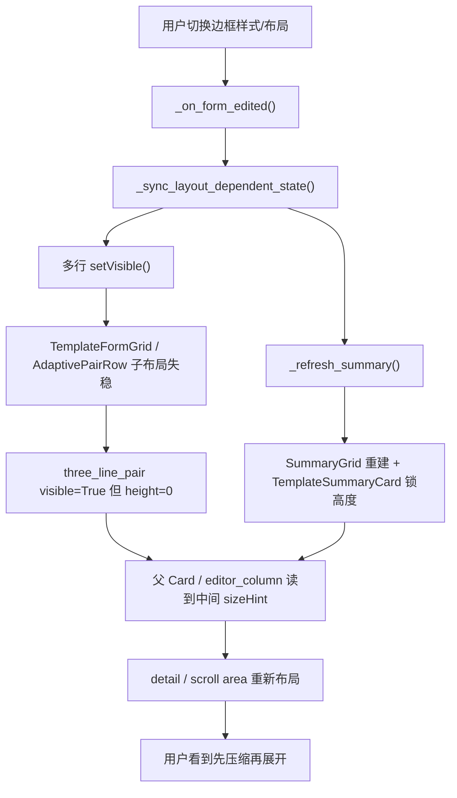

# 高度切换闪烁深度定位

日期：2026-06-04

## 结论摘要

当前看到的“先压缩一下，然后又展开”的闪动，不是 CSS/Qt 动画导致的，也不是下拉框弹层本身导致的。它更像 Qt 布局系统暴露了一个短暂中间态：

1. 用户切换某个选项。
2. 业务代码同步执行多次 `setVisible()`、`setMinimumHeight()`、`setMaximumHeight()`、`updateGeometry()`。
3. 子控件在一次切换中出现 `visible=True` 但实际 `height=0`，或者 `sizeHint()` 先给出旧高度、下一轮事件循环才给出新高度。
4. 父级布局、摘要卡、滚动详情容器继续同步这些中间高度。
5. 用户肉眼看到整块区域先被压缩，随后又按最终高度展开。

截图里的“边框样式与布局”只是最明显的现场。相同结构还出现在页眉页脚、目录、标题编号折叠区、参考文献独立样式切换、页面编号高级规则，以及资产面板详情区。

## 复现与证据

使用 `QT_QPA_PLATFORM=offscreen` 实例化真实 Qt 组件，未修改代码，只记录控件高度、最小高度和 `sizeHint()`。

### 表格详情页

目标面板：

- `src/ui/panels/template_table_detail.py`
- 类：`TableCaptionDetail`
- 截图对应区域：`_border_layout_card`

关键现象：从 `full_grid`、`color_table`、`none` 等模式切回 `three_line` 时，三线表宽度双列行会先进入一个非法视觉中间态。

摘取关键记录：

```text
border=three_line immediate
  panel            min=692  hint=692
  border_card      h=184    hint=184
  three_line_pair  visible=True h=0  hint=44 minHint=44

border=three_line after_events_1
  three_line_pair  visible=True h=0  hint=44 minHint=44

border=three_line after_events_2
  three_line_pair  visible=True h=33 hint=44 minHint=44
```

这里的重点不是最终高度是多少，而是：

- `_three_line_width_pair` 已经可见；
- 它声明自己应该占 `44px`；
- 但实际绘制高度仍是 `0px`，并且可持续至少一轮事件循环。

这正对应用户看到的“压缩一下”。该行后续被布局系统重新分配高度，所以又“展开”。

切到彩色表格也有独立证据：

```text
border=color_table immediate
  panel        min=1002 hint=1002
  border_card  h=494   hint=494
  gallery      visible=True h=222 hint=222

border=color_table after_events_2
  panel        min=958  hint=958
  border_card  h=450   hint=450
```

同一次切换里，面板高度先按 `1002px` 估算，随后修正到 `958px`。这说明切换期间存在两套高度结果。

### 真实 TemplatePanel 外层

目标外层：

- `src/ui/panels/template_panel.py`
- `src/ui/panels/workbench/detail_controller.py`

在真实 `TemplatePanel` 内显示 `tpl_table` 后重复同样切换，外层也能看到中间高度传播：

```text
border=color_table immediate
  detail_container h=1026 min=1026 hint=1028
  table_detail     h=1000 hint=1002

border=color_table after_events_1
  detail_container h=1028 min=1026 hint=984
  table_detail     h=1002 hint=958

border=three_line immediate
  table_detail      hint=692
  border_card       hint=184
  three_pair        visible=True h=0 hint=44
```

外层滚动容器本身不一定是根因，但它会把子组件的中间高度同步到可见滚动区域，因此放大了闪动。

## 直接触发点

### 1. 表格详情页批量 setVisible

文件：`src/ui/panels/template_table_detail.py`

相关位置：

- `_border_combo.currentIndexChanged.connect(self._on_form_edited)`
- `_layout_combo.currentIndexChanged.connect(self._on_form_edited)`
- `_sync_layout_dependent_state()`
- `_sync_width_controls_state()`

核心代码形态：

```python
self._smart_levels_row.setVisible(is_smart)
self._color_gallery.setVisible(is_color_table)
self._border_width_row.setVisible(uses_general_width)
self._header_width_row.setVisible(uses_three_line_widths)
self._bottom_width_row.setVisible(uses_three_line_widths)
self._three_line_width_pair.setVisible(uses_three_line_widths)
```

风险点：

- `_header_width_row`、`_bottom_width_row` 是 `_three_line_width_pair` 的子内容；
- 当前同时控制父容器和子行可见性；
- 从隐藏切回显示时，父容器会先可见，但子布局高度还没有稳定；
- 复现实验确认 `_three_line_width_pair` 可见后实际高度仍为 `0px`。

### 2. ColorTableGallery 固定自然高度同步

文件：`src/shared/ui/table_style_gallery.py`

相关位置：

- `ColorTableGallery._relayout_variants()`
- `ColorTableGallery._sync_natural_height()`
- `_PreviewGridHost.set_columns()`

核心代码形态：

```python
self._preview_row.setMinimumHeight(preview_height)
self._preview_row.setMaximumHeight(preview_height)
self.setMinimumHeight(height)
self.setMaximumHeight(height)
```

风险点：

- 彩色图库从隐藏到显示时一次性加入约 `222px`；
- 它还会根据宽度重算列数；
- 高度锁定发生在自身、预览行和内部网格多个层级；
- 与表格详情页的批量 `setVisible()` 叠加后，会形成“先按一个高度估算，再按另一个高度修正”。

### 3. AdaptivePairRow 对 Show/Hide 只局部 updateGeometry

文件：`src/shared/ui/adaptive_pair_row.py`

相关位置：

- `eventFilter()`
- `_sync_direction()`

核心代码形态：

```python
if watched in self._widgets and event.type() in (QEvent.Show, QEvent.Hide):
    self._last_stacked = None
    self._sync_direction()
    self.updateGeometry()
```

风险点：

- `AdaptivePairRow` 是 `TemplateFormGrid` 的实际行容器；
- 子控件 show/hide 后，它只刷新自己；
- 父级 `TemplateFormGrid -> TemplateFormStack -> Card -> detail` 不一定在同一帧完成布局；
- 表格三线宽度行正是通过 `TemplateFormGrid([rows])` 包出的 `AdaptivePairRow`。

### 4. TemplateSummaryCard 绑定 min/max 高度并激活父布局

文件：`src/shared/ui/template_summary_card.py`

相关位置：

- `TemplateSummaryCard._sync_content_height_limit()`
- `SummaryGrid.set_items()`
- `SummaryGrid._sync_parent_summary_height()`

核心代码形态：

```python
self.setMaximumHeight(height)
self.setMinimumHeight(height)
self.updateGeometry()
parent_layout.invalidate()
parent_layout.activate()
```

风险点：

- 摘要卡每次刷新内容都会锁定自己的高度；
- `SummaryGrid.set_items()` 会重建 tile；
- 摘要卡主动激活父布局；
- 如果同一次用户切换还在修改编辑区可见性，摘要卡会抢先把父布局推进一次。

这不一定单独造成闪动，但它会参与传播中间态。

### 5. WorkbenchDetailController 同步详情容器高度

文件：`src/ui/panels/workbench/detail_controller.py`

相关位置：

- `show_detail()`
- `_sync_detail_container_geometry()`

核心代码形态：

```python
for _ in range(3):
    self._detail_layout.invalidate()
    self._detail_layout.activate()
    detail.updateGeometry()
    hint = self._detail_container.sizeHint()
    content_height = max(1, hint.height())
    self._detail_container.setMinimumHeight(content_height)
    self._detail_container.resize(width, height)
```

风险点：

- 该逻辑本意是稳定详情页切换；
- 但它会连续读取 `sizeHint()`；
- 如果子详情页此时仍处在中间态，就会把中间高度同步到滚动容器；
- `AssetsPanel` 里也有近似逻辑，说明这是一个跨面板风险模式。

## 其它同类风险点

这些位置未必都已经被用户肉眼观察到，但结构上属于同类问题。

### 页眉页脚详情

文件：`src/ui/panels/template_elements_header_footer.py`

相关位置：

- `HeaderFooterDetailSection.sync_dependent_state()`
- `_sync_variant_rows()`

典型代码形态：

```python
self._header_text_row.setVisible(header_mode == "fixed")
self._styleref_level_row.setVisible(header_mode == "styleref")
self._footer_text_row.setVisible(footer_text_enabled)
self._suppress_selector_row.setVisible(self._hide_cover_toggle.isChecked())
grid.setVisible(enabled)
row.setVisible(enabled)
header_text_row.setVisible(...)
footer_text_row.setVisible(...)
```

风险原因：

- 一次切换会影响多行；
- 还包含变体网格整体显隐；
- 与顶部摘要卡刷新同发生。

### 页面编号高级规则

文件：`src/ui/panels/template_elements_page_plan.py`

相关位置：

- `_PageNumberPlanEditor.set_enabled_visible()`
- `FlowSection` 展开/折叠
- `_sync_chips_height()`

风险原因：

- 同时控制 `section`、说明文字、预设行、高级折叠区；
- `_sync_chips_height()` 会按 `heightForWidth()` 改 `minimumHeight/maximumHeight`；
- 如果页面编号开关切换时触发高级区折叠，可能出现高度二次求解。

### 标题编号专家编辑器

文件：`src/ui/panels/heading_numbering_panel.py`

相关位置：

- `_toggle_expert_editor()`
- `_refresh_inspector_toggles()`
- `_sync_input_heights()`

典型代码形态：

```python
self._expert_editor_container.setVisible(self._expert_editor_expanded)
self._expert_editor_divider.setVisible(self._expert_editor_expanded)
```

风险原因：

- 这是明显的高度展开/收起场景；
- 面板内部又有多个固定高度输入控件；
- 目前缺少统一的批量布局提交。

### 参考文献独立样式切换

文件：`src/ui/panels/template_reference_detail.py`

相关位置：

- `_update_mode_visibility()`

典型代码形态：

```python
self._style_container.setVisible(independent)
self._inherit_card.setVisible(not independent)
```

风险原因：

- 两个大块互斥显示；
- 若二者高度不同，会触发同类压缩/展开。

### FlowSection

文件：`src/shared/ui/flow_section.py`

相关位置：

- `_apply_expanded_state()`
- `_refresh_layout_chain()`

现状：

- `FlowSection` 已经比很多地方更谨慎，会刷新父链；
- 但它仍然同步执行 `setVisible()` 和 `setMaximumHeight(0/16777215)`；
- 如果外层同时刷新摘要或滚动容器，仍可能发生突兀高度变化。

## 非根因排除

### StyledComboBox 弹层不是主要原因

文件：`src/shared/ui/styled_combo_box.py`

`StyledComboBox` 的下拉弹层是 `ComboPopupPanel`，它作为窗口内 overlay 显示，不会正常占据表单布局高度。真正触发高度变化的是：

- 选项改变后发出 `currentIndexChanged`；
- 业务面板响应信号；
- 业务面板执行显隐和高度同步。

因此，下拉框“打开”本身不是压缩闪动的主因；“选择后联动布局”才是。

### 不是通用动画 duration 问题

主题里有动画 token，例如 `anim_duration_fast/normal/slow`，但当前这些高度变化路径没有使用 `QPropertyAnimation` 做高度动画。肉眼看到的闪，是布局中间态被绘制，而不是动画曲线不顺滑。

## 根因链路

以截图里的表格详情页为例：



## 修复建议

### P0：表格详情页先做批量布局提交

目标文件：

- `src/ui/panels/template_table_detail.py`

建议：

1. 给 `_sync_layout_dependent_state()` 增加批量更新保护。
2. 修改可见性时用 helper 避免重复触发无意义 `setVisible()`。
3. 对 `_three_line_width_pair` 显示场景，先恢复内部子行，再显示父容器，最后统一刷新布局链。
4. 在刷新期间临时关闭 `_border_layout_card` 或 `_editor_column` 的 updates，避免中间态绘制。

示意：

```python
def _set_explicit_visible_if_changed(widget: QWidget, visible: bool) -> bool:
    hidden = not visible
    if widget.isHidden() == hidden:
        return False
    widget.setVisible(visible)
    return True

def _refresh_layout_chain(widget: QWidget) -> None:
    for _ in range(3):
        current = widget
        while current is not None:
            layout = current.layout()
            if layout is not None:
                layout.invalidate()
                layout.activate()
            current.updateGeometry()
            current = current.parentWidget()
```

实际实现时要注意：不要直接照抄 `isVisible()` 判断，因为隐藏父容器时子控件 `isVisible()` 会受父级影响。更稳的是比较 `isHidden()` 或保留一个明确状态。

### P0：AdaptivePairRow 向上刷新布局链

目标文件：

- `src/shared/ui/adaptive_pair_row.py`

建议：

- 在子控件 `Show/Hide` 后，不只 `self.updateGeometry()`；
- 增加类似 `FlowSection._refresh_layout_chain()` 的父链刷新；
- 最好抽成共享 helper，避免每个组件重复实现。

收益：

- 表格页、页眉页脚页、样式页、标题编号页都会受益；
- 这是共享组件级修复，能减少同类闪动。

### P1：TemplateSummaryCard 延迟合并高度同步

目标文件：

- `src/shared/ui/template_summary_card.py`
- `src/shared/ui/summary_grid.py`

建议：

- `SummaryGrid.set_items()` 后不要立即多次同步父级高度；
- 可以用 `QTimer.singleShot(0, ...)` 合并本轮事件循环内的多个高度请求；
- 或在 `TemplateSummaryCard._sync_content_height_limit()` 中避免主动 `parent_layout.activate()` 过早介入编辑区联动。

收益：

- 减少摘要卡参与中间态传播；
- 对所有模板详情页都有影响。

### P1：ColorTableGallery 显示前预稳定高度

目标文件：

- `src/shared/ui/table_style_gallery.py`
- `src/ui/panels/template_table_detail.py`

建议：

- 显示图库前，先按当前可用宽度调用一次 `_relayout_variants()`；
- 让 `heightForWidth()`、`minimumSizeHint()`、`sizeHint()` 在显示前返回一致结果；
- 或者在表格面板里为图库保留稳定 slot，高度变化由内容透明度/内部可见性处理。

取舍：

- 保留 slot 最稳，但会牺牲紧凑度；
- 显示前预稳定更轻，但不能完全消除从无图库到有图库的自然高度变化。

### P1：详情容器避免同步下降中的中间高度

目标文件：

- `src/ui/panels/workbench/detail_controller.py`
- `src/ui/panels/assets_panel.py`

建议：

- 详情切换时读取 `sizeHint()` 前，先让新 detail 完成一次本地布局刷新；
- 对高度下降可以延迟一轮事件循环提交；
- 对高度增长可立即提交，避免内容被裁切。

这能减少“先缩后展”的视觉，但不应替代子控件修复。

## 回归测试建议

### 表格详情页

新增测试方向：

1. 实例化 `TableCaptionDetail`。
2. 从 `full_grid` 切到 `three_line`。
3. 断言 `_three_line_width_pair.isVisible()` 后高度不能长期为 `0`。
4. 至少检查一轮 `processEvents()` 后高度大于等于 `minimumSizeHint().height()` 的合理下限。

需要注意：

- offscreen 下真实 `height()` 可能受父容器伸缩影响；
- 更稳的断言是“可见父行不应出现 `height == 0` 且 `sizeHint > 0`”。

### 共享组件

对 `AdaptivePairRow` 增加：

- 子控件 hide/show 后，父容器 `minimumSizeHint()` 与 `sizeHint()` 在一轮事件内稳定；
- 包含它的 `TemplateFormGrid` 不出现可见行 `height == 0`。

### 外层详情容器

对 `TemplatePanel` 增加：

- 显示 `tpl_table`；
- 切换 `border_mode`；
- 记录 `detail_container.sizeHint().height()` 在连续事件循环中的差异；
- 修复后差异应显著减少，尤其不应出现先高估再回落再局部展开的组合。

## 推荐落地顺序

1. 先修 `TableCaptionDetail._sync_layout_dependent_state()` 和 `_sync_width_controls_state()`。
2. 再修 `AdaptivePairRow` 的父链刷新。
3. 跑表格页复现实验和相关测试。
4. 若仍能看到摘要卡参与跳动，再处理 `TemplateSummaryCard` 的高度同步合并。
5. 最后评估 `ColorTableGallery` 是否需要稳定 slot 或轻量展开动画。

这样做的原因是：截图中的直接问题可以先用局部批量布局提交解决；共享组件修复会覆盖更多潜在场景；摘要卡和详情容器属于放大器，适合在直接触发点收敛后再调整。

## 当前定位等级

- 直接根因：已定位到 `TableCaptionDetail` 中父子可见性同步导致的可见 0 高度中间态。
- 传播路径：已定位到 `TemplateFormGrid/AdaptivePairRow`、`TemplateSummaryCard/SummaryGrid`、`WorkbenchDetailController`。
- 同类风险点：已定位到页眉页脚、页面编号、标题编号、参考文献、资产面板。
- 推荐下一步：先做表格详情页和 `AdaptivePairRow` 两处低风险修复。

## 2026-06-04 P1 扩展治理记录

用户反馈表格之外还有多处频闪后，进一步全局扫描了 `setVisible()`、折叠区、动态 summary、详情页切换和动态行重建路径。结论是：表格不是孤点，而是同一类 Qt 布局中间态在不同面板里的表现。

本轮已落地的机制性修复：

1. 新增 `src/shared/ui/layout_sync.py`
   - `refresh_layout_chain()`：从发生变化的 widget 向上逐级 `invalidate/activate/updateGeometry`。
   - `refresh_layout_chain_later()`：补一轮事件循环后的 settle。
   - `updates_suspended()`：批量显隐期间暂停绘制，避免半同步状态被画出来。
   - `set_visible_if_changed()` 与 `reserve_visible_height()`：减少重复 layout churn，并在必要时提前保留可见高度。

2. 共享组件修复
   - `AdaptivePairRow`：子控件 Show/Hide 后刷新父级布局链。
   - `FlowSection` / `CollapsibleSection`：展开/折叠后刷新父级布局链。
   - `SummaryGrid` / `TemplateSummaryCard`：summary 重建和高度锁定期间暂停绘制并刷新父级链，减少顶部摘要卡高度抖动。

3. 模板相关热点
   - `TemplateCaptionDetail`：表格边框/颜色表/三线表宽度切换继续使用预留高度和父链刷新。
   - `HeaderFooterDetailSection`：页眉页脚普通页面、页码、分区隐藏、首页/奇偶页变体一起纳入刷新范围。
   - `PageNumberPlanSection`：页码计划启用/禁用、阶段行重建后执行同步 settle。
   - `TocDetailSection`：目录样式大块显隐时暂停绘制并刷新编辑列。
   - `ElementsDetail`：整列编辑区显隐时刷新父级链。
   - `ReferenceDetail`：参考文献“继承/独立设置”互斥大块显隐时批量 settle。
   - `HeadingNumberingPanel`：专家编辑器、链式分隔符、重启触发行、原始模板错误提示、非编号标题自定义样式显隐接入统一刷新。

4. 其它面板热点
   - `QuickExecutionDetail`：移除高级区展开时的 `QApplication.processEvents()`，改为 layout settle，避免重入事件循环放大频闪。
   - `AssetsPanel`：批量输出自定义命名行、未知占位符建议区显隐后刷新。
   - `ScenePanel`：样式变体行和颜色表图库显隐后刷新。

验证结果：

- `python -m py_compile ...`：通过。
- `python -m pytest tests/test_ui_layout_hardening.py -q`：33 passed。
- `python -m pytest tests/test_template_secondary_details.py -q`：50 passed。
- `python -m pytest tests/test_summary_grid.py tests/test_feature_toggle_row.py -q`：19 passed。
- `python -m pytest tests/test_workbench_detail_architecture.py tests/test_scene_panel_architecture.py -q`：14 passed。
- `python -m pytest tests/test_assets_panel_architecture.py -q`：38 passed。

剩余建议：

- 继续观察真实窗口中的视觉感受，尤其是“自然高度确实发生大变化”的场景。这类场景不会再出现 0 高度中间帧，但内容高度从小到大仍会有真实重排。
- 如果仍觉得突兀，下一步可以考虑对大块区域使用占位高度或轻量淡入，而不是继续追逐单个 `setVisible()`。
