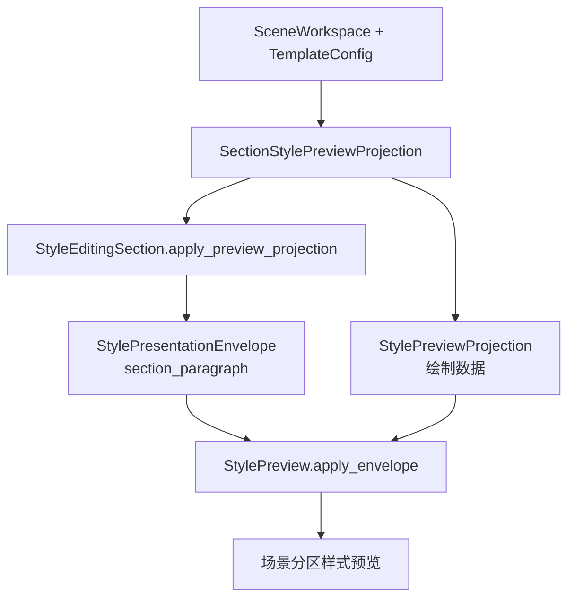

# Scene Section Paragraph Envelope 接入执行记录

日期：2026-06-29

## 1. 本轮判断

前几轮已经把 envelope 链路推进到：

```text
TemplateStylePreview -> template_page
StyleResultReceiptRow -> execution_receipt
Workbench 状态对象 -> style_source_envelope
```

剩下的核心缺口是场景分区段落预览。场景页虽然已经复用 `StylePreview`，但链路仍是：

```text
SectionStylePreviewProjection
-> StyleEditingSection.apply_preview_projection(...)
-> StylePreview.apply_projection(...)
```

也就是说它能画出“参考文献样式预览”，但没有完整声明：

```text
kind = section_paragraph
title = 参考文献
source_label = 跟随模板 / 已开启独立样式 / 已调整 N 项
detail = 使用模板样式 / 与模板一致 / 不同：...
action_label = 调分区
```

本轮目标是补齐这个语义层，让模板页面预览、场景分区预览和执行后回执真正形成三端一致。

## 2. 设计边界

本轮没有把 `StylePresentationEnvelope` 写进 `src/config/style_variant_semantics.py`。

原因：

```text
config 层应该描述样式事实与业务投影；
UI 层才负责把投影组织成展示 envelope。
```

因此保留：

```text
SectionStylePreviewProjection
```

作为纯数据投影；在共享 UI 外壳 `StyleEditingSection` 中把它映射为：

```text
StylePresentationEnvelope(kind="section_paragraph")
```

这样既不会把 config 反向依赖到 UI，也能让所有段落编辑外壳共享同一套展示语义。

## 3. 已完成改动

### 3.1 `StyleEditingSection` 自动生成段落 envelope

文件：

- `src/shared/ui/style_editing_section.py`

`apply_preview_projection(...)` 新增可选参数：

```text
envelope=None
```

当调用方没有显式传入 envelope 时，会根据 projection 自动生成：

```text
kind = section_paragraph
title = projection.label
source_label = projection.source_label
summary = projection.source_label
detail = projection.detail
action_label = 调分区（当 projection 带 variant_key）
```

然后统一调用：

```text
StylePreview.apply_envelope(...)
```

而不是只调用旧的：

```text
StylePreview.apply_projection(...)
```

旧 projection 仍然负责字体、字号、缩进、行距等绘制数据。

### 3.2 `StylePreview` 补全 presentation 属性

文件：

- `src/shared/ui/style_preview.py`

`apply_envelope(...)` 原来只写：

```text
style_presentation_kind
style_presentation_title
style_presentation_action_label
```

本轮补齐：

```text
style_presentation_source_label
style_presentation_summary
style_presentation_detail
```

这样 `StylePreview` 和 `TemplateStylePreview`、`StyleResultReceiptRow` 的属性语义更一致。

### 3.3 场景页自然接入

文件：

- `src/ui/panels/scene_style_override_sections.py`
- `src/ui/panels/scene_panel.py`

这些调用点不需要大改，因为它们已经通过：

```text
SceneStyleOverrideSection.apply_preview_projection(...)
-> StyleEditingSection.apply_preview_projection(...)
```

走到共享外壳。共享外壳升级后，场景页预览自然获得 `section_paragraph` envelope。

## 4. 当前链路



现在三类展示的统一状态是：

| 展示 | 控件 | Envelope kind | 当前状态 |
| --- | --- | --- | --- |
| 模板页面级预览 | `TemplateStylePreview` | `template_page` | 已接入 |
| 场景分区段落预览 | `StylePreview` | `section_paragraph` | 已接入 |
| 执行后样式回执 | `StyleResultReceiptRow` | `execution_receipt` | 已接入 |

## 5. 用户可读性收益

场景分区预览现在不再只是一个“能画样式的 QLabel”，而是能明确回答：

```text
这是哪个分区？
它现在跟随模板还是独立？
详情是什么？
用户下一步动作是什么？
```

这让后续删除冗余解释文案更有底气。页面不需要继续堆“手动控制所有功能开关与处理范围”之类说明句，而可以让控件属性和简短状态承担语义。

## 6. 当前未完成

本轮不把以下事项视为完成：

1. `StyleRuleControlDeck` 还没有直接读取 envelope 来统一差异摘要和动作文案。
2. `StyleManagementBlock` 还没有正式增加 `preview_slot` 命名 slot。
3. 主界面冗余说明文案还没有做最后一轮删除。
4. 场景跳转到模板预览时，还没有系统性传递 `template_page` envelope。

## 7. 验证

新增和更新测试：

- `tests/test_small_widget_architecture.py::test_style_editing_section_wraps_owner_preview_and_surface`
- `tests/test_scene_panel_architecture.py::test_scene_panel_scope_style_override_editor_writes_section_styles`

聚焦验证：

```text
2 passed
```

## 8. 追加收口：projection 到 envelope 的共享入口

追加日期：2026-06-29

后续复用审计发现，虽然场景分区段落预览已经接入 `section_paragraph` envelope，但 `StyleEditingSection` 内部仍然私有拼装 `title/source_label/detail/action_label`。这会让样式控件与模板管理只在外观上复用，语义生成仍然分叉。

已追加调整：

- `StylePresentationEnvelope.from_preview_projection(...)` 统一生成分区段落预览 envelope。
- `StyleEditingSection` 不再直接实例化 `StylePresentationEnvelope(...)` 来拼展示语义。
- 新增 `tests/test_small_widget_architecture.py::test_style_presentation_envelope_builds_section_paragraph_from_projection` 锁定转换结果。

新的边界是：`StyleEditingSection` 只负责控件外壳和 projection 转发，展示标题、来源、摘要、详情、动作词由共享 envelope 层负责。
