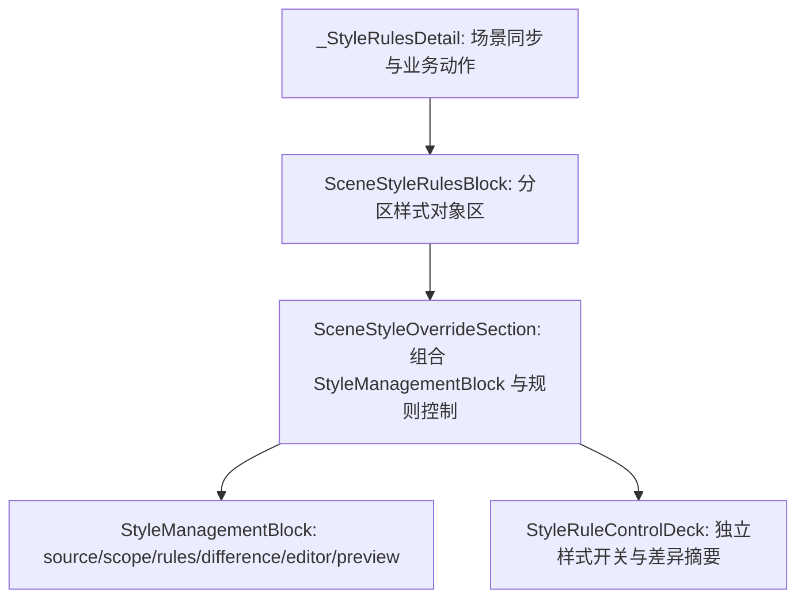

# SceneStyleRulesBlock 稳定对象区首片执行记录

日期：2026-06-29

## 1. 本轮目标

上一轮已经把 `StyleManagementBlock` 的 `readonly_review` 模式纳入测试契约。本轮继续执行 P1：把场景分区样式从 `_StyleRulesDetail` 直接拼装 `SceneStyleOverrideSection` 的状态，推进为一个稳定对象区 `SceneStyleRulesBlock`。

目标不是重写样式规则逻辑，而是先把页面层和控件组合层切开：

```text
_StyleRulesDetail
  负责：场景数据同步、样式投影、恢复模板业务动作、导航高亮

SceneStyleRulesBlock
  负责：分区样式这一整块 UI 对象的稳定入口

SceneStyleOverrideSection
  负责：StyleManagementBlock + StyleRuleControlDeck 的具体组合
```

## 2. 原问题

改动前，`_StyleRulesDetail` 直接认识三层内部对象：

```text
SceneStyleOverrideSection
-> management_block
-> rule_control_deck
-> editing_section
```

它会直接拆出：

- `management_block.card`
- `management_block.summary`
- `rule_deck.toggle_list`
- `rule_deck.toggles`
- `rule_deck.comparison_strip`
- `editing_section.selector`
- `editing_section.action_button`
- `editing_section.preview`
- `editing_section.style_surface`
- `editing_section.editor`

这说明虽然底层控件已经复用，但场景页仍知道太多内部结构。后续如果继续在 `_StyleRulesDetail` 里删冗余文案、调整布局、抽样式预览，很容易再次把模板管理和场景页的成品结构弄分叉。

## 3. 本轮代码变更

### 3.1 新增 SceneStyleRulesBlock

文件：`src/ui/panels/scene_style_rules_block.py`

新增：

- `SceneStyleRulesBlock`

它包住 `SceneStyleOverrideSection`，并向外暴露稳定属性和方法：

- `management_block`
- `rule_control_deck`
- `summary`
- `toggle_list`
- `toggles`
- `rows`
- `owner_toolbar`
- `owner_status`
- `selector`
- `restore_button`
- `restore_all_button`
- `undo_restore_all_button`
- `comparison_strip`
- `preview`
- `style_surface`
- `editor`
- `unit_labels`
- `set_summary_items(...)`
- `set_override_row_visible(...)`
- `set_current_variant(...)`
- `current_variant_key()`
- `apply_preview_projection(...)`
- `apply_comparison_projection(...)`
- `apply_owner_state(...)`

同时转发这些信号：

- `override_toggled`
- `current_variant_changed`
- `restore_requested`
- `restore_all_requested`
- `undo_restore_all_requested`
- `style_changed`

### 3.2 _StyleRulesDetail 改为接入 block

文件：`src/ui/panels/scene_panel.py`

调整：

- 不再直接导入 `SceneStyleOverrideSection`。
- 改为导入 `SceneStyleRulesBlock`。
- `_StyleRulesDetail` 中创建 `self._style_rules_block = SceneStyleRulesBlock(...)`。
- 业务同步仍在 `_StyleRulesDetail` 内，但所有 UI 入口从 `self._style_rules_block` 读取。

保留兼容字段：

- `_style_override_summary`
- `_variant_toggles`
- `_style_variant_combo`
- `_section_style_editor`
- `_section_style_preview`
- `_style_surface`
- `_restore_section_style_btn`
- `_restore_all_section_styles_btn`
- `_undo_restore_all_section_styles_btn`

这些兼容字段是为了不一次性打断现有测试和导航逻辑。后续可以继续收窄，但这一轮先保证行为稳定。

### 3.3 架构测试更新

文件：`tests/test_scene_panel_architecture.py`

新增：

- `test_scene_style_rules_block_wraps_override_section_as_stable_object`

验证：

- `SceneStyleRulesBlock` 包住 `SceneStyleOverrideSection`。
- `management_block` 仍是 `scene_section_rules`。
- 信号转发可用。
- 预览、差异、开关、选择分区、恢复按钮都能从 block 访问。

更新：

- 场景面板源码应出现 `SceneStyleRulesBlock`。
- 场景面板源码不再出现 `SceneStyleOverrideSection`。
- 场景面板源码不再出现：

```text
management_block = self._style_override_section.management_block
rule_deck = self._style_override_section.rule_control_deck
editing_section = self._style_override_section.editing_section
```

这把“页面层不再拆内部三层对象”写进测试。

## 4. 验证结果

先跑新增/相关目标测试：

```powershell
python -X utf8 -m pytest tests\test_scene_panel_architecture.py::test_scene_style_rules_block_wraps_override_section_as_stable_object tests\test_scene_panel_architecture.py::test_scene_panel_controls_follow_template_management_contract tests\test_scene_panel_architecture.py::test_scene_panel_uses_shared_card_header_and_flow_scope_layout -q
```

结果：

```text
3 passed in 2.25s
```

随后跑完整场景面板架构测试：

```powershell
python -X utf8 -m pytest tests\test_scene_panel_architecture.py -q
```

结果：

```text
58 passed in 260.32s (0:04:20)
```

补跑 layout 相关测试：

```powershell
python -X utf8 -m pytest tests\test_ui_layout_hardening.py::test_template_and_scene_style_shells_keep_summary_preview_surface_order tests\test_ui_layout_hardening.py::test_scene_style_management_block_collapses_readonly_surface -q
```

结果：

```text
2 passed in 1.18s
```

## 5. 当前边界

本轮之后，结构变成：



这比之前更接近模板管理的方式：页面层先面对一个对象区，而不是面对一堆内部控件。

## 6. 仍未完成的部分

这一轮还不是最终态，原因有三点：

1. `_StyleRulesDetail` 仍保留很多兼容字段。
   - 这是为了稳定测试和导航链路。
   - 后续应逐步改成通过 `SceneStyleRulesBlock` 的明确 API 完成。

2. 业务同步仍在 `_StyleRulesDetail`。
   - `set_scene(...)`
   - `_sync_style_editor(...)`
   - `_selected_style_preview_projection(...)`
   - 恢复当前分区 / 全部跟随模板
   - 导航高亮

   这些逻辑是否继续留在 detail 层，还是收进 `SceneStyleRulesBlock` 的 controller，需要下一轮再切。

3. 处理范围和样式规则仍只是结构上分离。
   - `scn_scope` 和 `scn_style_rules` 已经是两个导航项。
   - 但场景概览和关键设置里仍有样式来源、处理范围、核对依据的摘要混排。
   - 后续仍需要继续删除冗余解释，把主界面压缩成短状态和跳转。

## 7. 下一步

建议继续做 P2：

- 让 `_StyleRulesDetail` 更少暴露兼容字段。
- 把样式规则的公开操作收敛为：

```text
set_scene(...)
focus_navigation_field(...)
discard_restore_all_style_snapshot()
style_rules_changed
```

- 场景概览里保留 `分区样式：跟随模板 / N 个独立样式` 这类短摘要。
- 详细差异、预览、编辑入口都回到 `SceneStyleRulesBlock`。

同时可以并行准备 P3：

- 抽 `SampleEvidenceBlock`。
- 把核对依据里的样本文件、请求说法、证据状态、打开动作收成一个对象区。

## 8. 本轮结论

本轮完成了 `SceneStyleRulesBlock` 首片落地。场景页已经不再直接持有 `SceneStyleOverrideSection`，而是通过稳定对象区访问分区样式能力。这是从“控件复用”继续走向“页面对象复用”的一步。
