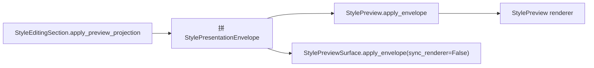
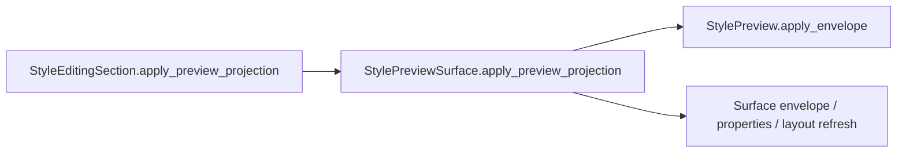
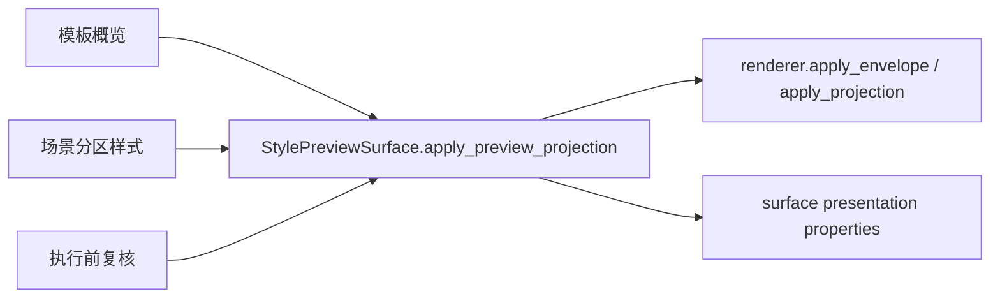

# StyleEditingSection 预览 Surface 委托执行记录

日期：2026-06-30

后续进展：`StylePreviewSurface` 内部 renderer 已新增 `style_preview_renderer_protocol(...)`、`style_preview_surface_renderer_protocol` 和 `style_preview_surface_renderer_ready`，详见 `docs/refactor-records/StylePreviewSurface渲染器协议观测执行记录_2026-06-30.md`。

上一轮已经通过 `effective_preview_slot` 证明：模板概览、场景分区样式、执行前复核都存在可消费统一预览投影的有效预览入口。本轮继续处理下一层问题：场景分区样式虽然使用内置 `StylePreviewSurface`，但 `StyleEditingSection.apply_preview_projection(...)` 仍然绕过 surface，直接更新内部 `StylePreview` renderer，再把 envelope 同步给 surface。

这会造成结构上已经统一，调用路径上仍有分叉。

## 1. 之前的调用路径

旧路径：



问题：

1. `StyleEditingSection` 自己负责 envelope 拼装。
2. renderer 更新和 surface 更新分两步做。
3. 外部 preview slot 走 `StylePreviewSurface.apply_preview_projection(...)`，内置 preview 走另一条路径。
4. 后续如果 `StylePreviewSurface.apply_preview_projection(...)` 扩展 renderer kind、空态、metadata 逻辑，内置 preview 不一定自动受益。

## 2. 本轮目标

把内置预览调用路径改成：



也就是说，`StyleEditingSection` 不再自己拼 projection/envelope，也不再直接调用 renderer 的 `apply_envelope(...)`。

## 3. 实现改动

文件：`src/shared/ui/style_editing_section.py`

### 3.1 删除直接 renderer 更新

旧逻辑中存在：

```python
self._preview.apply_envelope(...)
self._preview_surface.apply_envelope(..., sync_renderer=False)
```

现在统一改成：

```python
self._preview_surface.apply_preview_projection(
    projection,
    envelope=envelope,
    empty_text=empty_text,
)
```

`StylePreviewSurface` 负责：

- 从 projection 或 envelope 得到 `StylePresentationEnvelope`
- 把 envelope 和 projection 传给 renderer
- 同步 surface 自身的 presentation property
- 刷新布局链

### 3.2 移除重复 envelope helper

旧的 `_style_preview_presentation_envelope(...)` 被删除。

原因：这套逻辑已经属于 `StylePreviewSurface.apply_preview_projection(...)` 的职责，继续留在 `StyleEditingSection` 会造成两套投影解释器。

### 3.3 移除 `StylePreviewProjection` 依赖

`StyleEditingSection` 不再导入 `StylePreviewProjection`，也不再调用 `StylePreviewProjection.from_object(...)`。

这让 `StyleEditingSection` 退回到真正的 shell 角色：组合 owner、preview surface、style surface，而不是自己解释 preview projection。

## 4. 测试守门

文件：`tests/test_small_widget_architecture.py`

`test_style_editing_section_wraps_owner_preview_and_surface` 现在增加三类守门：

### 4.1 空态保持一致

```text
shell.preview.text() == "选择分区后预览样式"
shell.preview.isEnabled() is False
shell.preview.property("style_presentation_kind") == ""
shell.preview_surface.property("style_presentation_kind") == "section_paragraph"
```

说明 renderer 的空态仍然保持轻量，而 surface 仍然持有规范 envelope。

### 4.2 投影态保持一致

```text
shell.preview.property("style_presentation_title") == "参考文献"
shell.preview_surface.property("style_presentation_title") == "参考文献"
```

说明 renderer 和 surface 仍然同步到同一份 presentation。

### 4.3 源码路径守门

```text
"self._preview_surface.apply_preview_projection(" in source
"self._preview.apply_envelope(" not in source
"StylePreviewProjection.from_object" not in source
```

这防止以后又把内置预览绕回 renderer 直连路径。

## 5. 当前统一链路



当前状态：

| 入口 | 有效预览入口 | 调用路径 | 状态 |
| --- | --- | --- | --- |
| 模板概览 | 外部 `StylePreviewSurface` | `apply_preview_projection` | 已统一 |
| 场景分区样式 | 内置 `StylePreviewSurface` | 本轮改为 `apply_preview_projection` | 已统一 |
| 执行前复核 | 外部 `StylePreviewSurface` | `apply_preview_projection` | 已统一 |

## 6. 本轮验证

已通过：

```powershell
python -X utf8 -m py_compile src\shared\ui\style_editing_section.py tests\test_small_widget_architecture.py
```

```powershell
python -X utf8 -m pytest tests\test_small_widget_architecture.py::test_style_editing_section_wraps_owner_preview_and_surface tests\test_small_widget_architecture.py::test_style_preview_surface_wraps_renderer_and_envelope_metadata tests\test_scene_panel_architecture.py::test_scene_style_override_section_wraps_owner_preview_and_surface -q
```

结果：`3 passed`

## 7. 剩余边界

1. `StylePreviewSurface.apply_preview_projection(...)` 支持的 renderer 协议已在后续推进中显式化为 `envelope_projection`、`projection`、`presentation_envelope`。
2. `StyleEditingSection` 现在已经不解释 preview projection；后续如果还有其它页面手动调用 `StylePreview.apply_envelope(...)`，需要继续判断是否应该收敛到 surface。
3. 模板页的 `TemplateStylePreview` 仍有专用 `apply_presentation_envelope(...)`，这是页面级预览 renderer 的合理差异；后续已通过 `presentation_envelope` 协议将其纳入可观测范围。

## 8. 本轮判断

这一轮把场景分区内置预览从“看起来也是 StylePreviewSurface”推进到“实际更新也走 StylePreviewSurface”。

这意味着模板管理、场景分区、执行前复核不只是在结构上共享预览表面，也在运行路径上共享同一个 projection/envelope 入口。后续继续做样式预览统一时，改 `StylePreviewSurface` 就能影响三端，而不是每端各维护一条更新逻辑。
