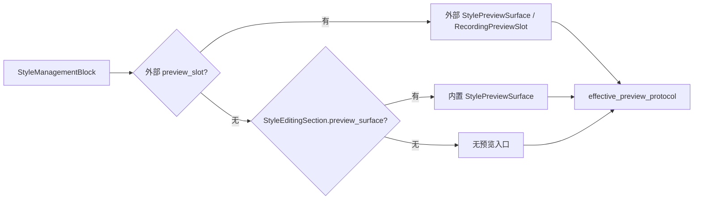

# StyleManagementBlock 有效预览协议观测执行记录

日期：2026-06-30

后续进展：`StyleEditingSection.apply_preview_projection(...)` 已改为委托 `StylePreviewSurface.apply_preview_projection(...)`，内置预览和外部 preview slot 的调用路径进一步同构，详见 `docs/refactor-records/StyleEditingSection预览Surface委托执行记录_2026-06-30.md`。

上一轮已经把外部 `preview_slot` 从软约定收紧为协议守门：外部 slot 必须实现 `apply_preview_projection(...)` 或 `apply_envelope(...)`。本轮继续推进剩余缺口：场景分区样式的预览并不是外部 `preview_slot`，而是 `StyleEditingSection` 内置的 `StylePreviewSurface`。如果只观察外部 slot，场景页会显示 `preview_slot_protocol = none`，但实际上用户仍然有可用预览。

本轮目标是把“页面真实可用的预览入口”也纳入统一观测。

## 1. 之前的问题

`StyleManagementBlock` 现在有两种预览来源：

| 来源 | 例子 | 之前观测结果 |
| --- | --- | --- |
| 外部 `preview_slot` | 模板概览、执行前复核传入 `StylePreviewSurface` | 可观测 |
| 内置 `StyleEditingSection.preview_surface` | 场景分区样式、只读复核内置段落预览 | 不在 preview slot 协议里 |

因此上一轮虽然解决了“外部 preview slot 不能是普通 QWidget”，但还没有回答一个更产品化的问题：

> 这个 `StyleManagementBlock` 当前到底有没有一个可消费统一预览投影的真实预览入口？

这就是本轮补的 `effective_preview_slot`。

## 2. 实现改动

### 2.1 新增有效预览入口

文件：`src/shared/ui/style_management_block.py`

新增属性：

```python
@property
def effective_preview_slot(self) -> QWidget | None:
    if self._preview_slot is not None:
        return self._preview_slot
    return self._editing_section.preview_surface
```

含义：

1. 如果页面显式传了外部 `preview_slot`，它就是有效预览入口。
2. 如果没有外部 slot，但 `StyleEditingSection` 内置了 `preview_surface`，内置 surface 就是有效预览入口。
3. 如果两者都没有，说明当前模式没有可用预览入口。

### 2.2 新增有效预览协议 property

`StyleManagementBlock` 现在会同步：

```text
style_management_effective_preview_protocol
style_management_effective_preview_ready
```

它们与上一轮的外部 slot property 区分如下：

| property | 含义 |
| --- | --- |
| `style_management_preview_slot_protocol` | 仅描述外部 `preview_slot` |
| `style_management_preview_slot_ready` | 仅描述外部 `preview_slot` 是否可用 |
| `style_management_effective_preview_protocol` | 描述当前 block 最终可用的预览入口 |
| `style_management_effective_preview_ready` | 描述当前 block 是否真的有可用预览协议 |

这样可以避免误判：

- 场景分区没有外部 preview slot，所以 `preview_slot_protocol = none` 是正确的。
- 场景分区有内置 `StylePreviewSurface`，所以 `effective_preview_protocol = preview_projection` 也是正确的。

### 2.3 初始化顺序守住

`_sync_content_plan_properties()` 在构造早期也会运行，所以 `effective_preview_slot` 使用 `getattr(self, "_preview_slot", None)` 和 `getattr(self, "_editing_section", None)` 兜住早期状态。

这保证 property 可以在构造早期安全同步，也能在 `StyleEditingSection` 创建后再次同步为真实状态。

## 3. 测试覆盖

### 3.1 小组件层

文件：`tests/test_small_widget_architecture.py`

新增/加强断言：

| 模式 | 外部 slot | 有效预览入口 | 期望 |
| --- | --- | --- | --- |
| `template_baseline_edit` | 无 | 无 | `effective = none` |
| `scene_section_rules` | 无 | 内置 `preview_surface` | `effective = preview_projection` |
| `template_overview_preview` | 外部 `RecordingPreviewSlot` | 外部 slot | `effective = preview_projection` |
| `execution_prereview` 无 slot 测试块 | 无 | 无 | `effective = none` |
| `readonly_review` | 无 | 内置 `preview_surface` | `effective = preview_projection` |

### 3.2 场景分区真实组件

文件：`tests/test_scene_panel_architecture.py`

`SceneStyleOverrideSection` 现在必须证明：

```text
management_block.preview_slot is None
management_block.effective_preview_slot is editing_section.preview_surface
style_management_effective_preview_protocol == "preview_projection"
style_management_effective_preview_ready is True
```

这证明场景分区样式没有外部 slot，但仍然进入统一预览协议观测。

### 3.3 模板管理真实组件

文件：`tests/test_template_panel_architecture.py`

模板概览必须证明：

```text
effective_preview_slot is _preview_slot
style_management_effective_preview_protocol == "preview_projection"
style_management_effective_preview_ready is True
```

### 3.4 执行前复核真实组件

文件：`tests/test_quick_execution_detail_architecture.py`

执行前复核必须证明：

```text
effective_preview_slot is _style_prereview_preview_slot
style_management_effective_preview_protocol == "preview_projection"
style_management_effective_preview_ready is True
```

## 4. 当前链路



当前入口状态：

| 入口 | 外部 slot 协议 | 有效预览协议 | 状态 |
| --- | --- | --- | --- |
| 模板概览 | `preview_projection` | `preview_projection` | 已守门 |
| 场景分区样式 | `none` | `preview_projection` | 本轮补齐 |
| 执行前复核 | `preview_projection` | `preview_projection` | 已守门 |
| 模板正文编辑 | `none` | `none` | 无预览，符合当前模式 |
| 只读复核 | `none` | `preview_projection` | 已纳入观测 |

## 5. 本轮验证

已通过：

```powershell
python -X utf8 -m py_compile src\shared\ui\style_management_block.py tests\test_small_widget_architecture.py tests\test_scene_panel_architecture.py tests\test_template_panel_architecture.py tests\test_quick_execution_detail_architecture.py
```

```powershell
python -X utf8 -m pytest tests\test_small_widget_architecture.py::test_style_management_block_named_modes_project_shared_contracts tests\test_small_widget_architecture.py::test_style_management_block_named_slots_update_plan tests\test_scene_panel_architecture.py::test_scene_style_override_section_wraps_owner_preview_and_surface tests\test_template_panel_architecture.py::test_template_panel_uses_extracted_template_style_preview_widget tests\test_quick_execution_detail_architecture.py::test_quick_execution_detail_uses_shared_style_source_row -q
```

结果：`5 passed`

## 6. 剩余边界

1. `StyleEditingSection.apply_preview_projection(...)` 直接更新内部 `StylePreview` 的旧路径已在后续推进中移除，当前委托给 `StylePreviewSurface.apply_preview_projection(...)`。
2. 后续仍可继续收敛 renderer 协议本身，例如为 renderer 侧的 `apply_envelope(...)` / `apply_projection(...)` 增加可观测 property。
3. 当前已经足够证明：模板管理、场景分区、执行前复核三类入口都有可观测的有效预览协议，并且场景分区内置预览也走统一 surface 调用入口。

## 7. 本轮判断

这一轮把“预览一致性”从外部 slot 扩展到了真实有效预览入口。

这对模板管理和场景样式一致性很关键：用户不关心预览是外置 slot 还是内置 surface，产品层只需要保证当前页面的预览入口能消费同一种样式投影。现在这个事实已经可以由 `style_management_effective_preview_protocol` 证明。
