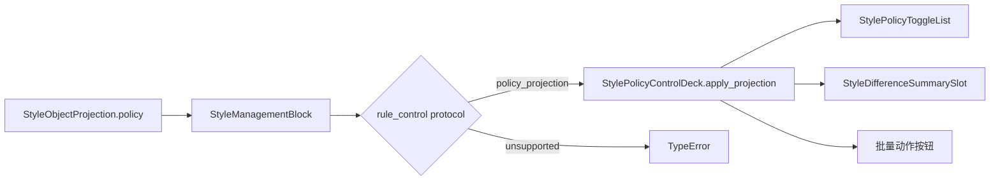

# StyleManagementBlock 策略控制槽协议守门执行记录

日期：2026-06-30

前几轮已经把预览链路从外部 slot、有效入口、surface、renderer 四层逐步收紧。本轮把同样的方法用到策略控制区：`StyleManagementBlock.rule_control` 之前已经是命名 slot，但它仍然只是 `QWidget | None`，能不能消费 `StylePolicyProjection` 主要靠运行时 `getattr(..., "apply_projection")` 试探。

本轮目标：让 `rule_control` 从“可插入控件”变成“必须能消费策略投影的策略控制槽”。

## 1. 之前的问题

已有进展：

- `StyleRuleControlDeck` 已变成 `StylePolicyControlDeck` 的场景薄包装。
- `StyleObjectProjection.policy` 已进入 `StyleManagementBlock.apply_style_object_projection(...)`。
- 场景分区样式真实使用 `StyleManagementBlock(rule_control=self._rule_control_deck)`。

仍然存在的问题：

1. `rule_control` 类型仍是普通 `QWidget`。
2. `StyleManagementBlock` 不知道 rule control 是否真的能消费 `StylePolicyProjection`。
3. 如果传错控件，策略区可能静默不更新。
4. 测试只能证明“控件被挂进来了”，不能证明“控件具备策略投影协议”。

## 2. 本轮协议

新增：

```python
def style_policy_control_protocol(widget: QWidget | None) -> str:
    if widget is None:
        return "none"
    if callable(getattr(widget, "apply_projection", None)):
        return "policy_projection"
    return "unsupported"
```

协议含义：

| 协议 | 含义 |
| --- | --- |
| `policy_projection` | 可消费 `StylePolicyProjection` 或兼容对象 |
| `none` | 当前模式没有策略控制区 |
| `unsupported` | 有 widget，但不是策略控制槽 |

## 3. 实现改动

### 3.1 协议函数归属策略控件模块

文件：`src/shared/ui/style_policy_control_deck.py`

协议函数放在这里，而不是放在 `StyleManagementBlock` 中。原因是“谁能消费策略投影”属于策略控件能力，`StyleManagementBlock` 只负责识别和守门。

### 3.2 `StyleManagementBlock` 构造期拒绝无协议 rule control

文件：`src/shared/ui/style_management_block.py`

现在传入 `rule_control` 时，如果它没有 `apply_projection(...)`，会抛出 `TypeError`：

```text
rule_control must implement apply_projection(...).
```

这样避免后续页面把普通容器塞进规则控制区，造成“有 rules 区但策略不更新”的假复用。

### 3.3 策略投影应用改为协议分发

旧逻辑：

```text
_apply_slot_projection(self._rule_control, style_object.policy)
```

新逻辑：

```text
_apply_rule_control_projection(style_object.policy)
```

该方法会重新识别协议并同步 property，然后只在 `policy_projection` 协议下调用：

```python
self._rule_control.apply_projection(projection)
```

### 3.4 新增可观测 property

`StyleManagementBlock` 现在同步：

```text
style_management_rule_control_protocol
style_management_rule_control_ready
```

这让真实页面可以证明自己的策略区不是普通 widget，而是可消费统一策略投影的控制槽。

### 3.5 共享导出

文件：`src/shared/ui/__init__.py`

新增：

```python
style_policy_control_protocol
```

## 4. 测试守门

### 4.1 小组件测试

文件：`tests/test_small_widget_architecture.py`

新增/加强：

- `StyleRuleControlDeck` 必须报告 `policy_projection`。
- `StyleManagementBlock` 使用场景规则区时必须报告：

```text
style_management_rule_control_protocol == "policy_projection"
style_management_rule_control_ready is True
```

- `StyleManagementBlock.apply_style_object_projection(...)` 应通过 rule control 协议把 `StylePolicyProjection` 落到 `StyleRuleControlDeck`。
- 普通 `QWidget` 作为 `rule_control` 会被拒绝。

新增测试：

```text
test_style_management_block_rejects_rule_control_without_policy_protocol
```

### 4.2 场景分区真实组件

文件：`tests/test_scene_panel_architecture.py`

`SceneStyleOverrideSection` 现在必须证明：

```text
section.management_block.rule_control is section.rule_control_deck
style_management_rule_control_protocol == "policy_projection"
style_management_rule_control_ready is True
```

### 4.3 共享导出测试

文件：`tests/test_ui_exports.py`

新增：

```text
style_policy_control_protocol(None) == "none"
```

## 5. 当前策略链路



当前真实入口：

| 入口 | rule control | 协议 | 状态 |
| --- | --- | --- | --- |
| 场景分区样式 | `StyleRuleControlDeck` | `policy_projection` | 已守门 |
| 模板正文编辑 | 无 | `none` | 合理 |
| 模板概览预览 | 无 | `none` | 合理 |
| 执行前复核 | 后续接入只读 `StylePolicyControlDeck` | `policy_projection` | 见后续记录 |

## 6. 本轮验证

已通过：

```powershell
python -X utf8 -m py_compile src\shared\ui\style_policy_control_deck.py src\shared\ui\style_management_block.py src\shared\ui\__init__.py tests\test_small_widget_architecture.py tests\test_scene_panel_architecture.py tests\test_ui_exports.py
```

```powershell
python -X utf8 -m pytest tests\test_small_widget_architecture.py::test_style_management_block_applies_unified_style_object_projection tests\test_small_widget_architecture.py::test_style_management_block_named_modes_project_shared_contracts tests\test_small_widget_architecture.py::test_style_management_block_rejects_rule_control_without_policy_protocol tests\test_scene_panel_architecture.py::test_scene_style_override_section_wraps_owner_preview_and_surface tests\test_ui_exports.py -q
```

结果：`5 passed`

## 7. 剩余边界

1. 后续已经把执行前复核接入只读 `StylePolicyControlDeck`，详见 `docs/refactor-records/ExecutionPrereview策略控制槽接入执行记录_2026-06-30.md`。
2. `rule_control` 目前只允许直接实现 `apply_projection(...)`。这比递归查找 child 更严格，目的是避免重新回到“普通容器里藏控件”的假复用。
3. 后续如果出现复合策略容器，应让容器自身实现 `apply_projection(...)`，而不是依赖 `StyleManagementBlock` 搜索子控件。

## 8. 本轮判断

这一轮把策略控制区补到和预览区相似的协议水平：

- 不是普通 widget。
- 有明确协议。
- 有 ready property。
- 有错误输入拒绝。
- 有真实场景组件测试。

这会让后续继续对齐模板管理、场景配置和执行复核时更稳。只要一个页面声称自己有 `rules`，就必须能证明它的 rule control 能消费统一策略投影。
