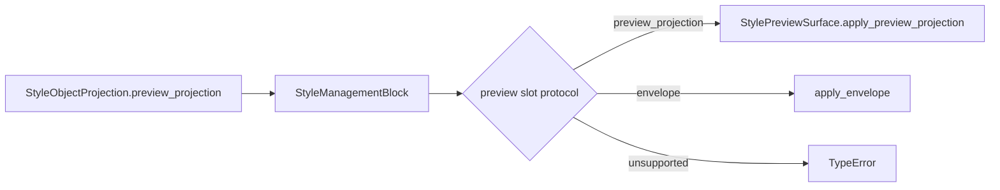

# StyleManagementBlock 预览槽协议守门执行记录

日期：2026-06-30

后续进展：场景分区样式的内置 `StyleEditingSection.preview_surface` 已通过 `effective_preview_slot` 和 `style_management_effective_preview_protocol` 纳入同一套观测，详见 `docs/refactor-records/StyleManagementBlock有效预览协议观测执行记录_2026-06-30.md`。

上一轮已经确认：场景页、模板管理和 Workbench 的首屏文案需要统一成人能理解的产品语言。本轮继续向结构层推进，处理 `StyleManagementBlock.preview_slot` 的复用边界。

## 1. 为什么要做这一轮

此前 `StyleManagementBlock` 已有 `preview_slot`，模板概览和执行前复核也已经传入 `StylePreviewSurface`。但这个 slot 的约束仍然偏软：

- 构造参数类型只是 `QWidget | None`。
- 任意普通 `QWidget` 都会让内容计划显示 `preview`。
- 真正应用投影时再通过 `getattr(..., "apply_preview_projection")` 试探。
- 如果 slot 没有方法，系统不会明确失败，只是静默不更新。

这会造成一个隐藏风险：页面结构看上去复用了 `StyleManagementBlock`，但预览能力可能没有复用 `StylePreviewSurface` 或统一投影协议。也就是说，测试看到了“有 preview slot”，用户却可能看不到一致的预览行为。

## 2. 本轮目标

把 preview slot 从“传一个 widget”收紧为“传一个实现预览协议的 slot”。

预览 slot 当前允许两类协议：

| 协议 | 含义 | 优先级 |
| --- | --- | --- |
| `apply_preview_projection(projection, envelope=..., empty_text=...)` | 完整预览协议，可接收 projection 和 envelope | 首选 |
| `apply_envelope(envelope)` | 兼容协议，只能接收展示 envelope | 兼容 |

普通 `QWidget` 不再被允许作为 `preview_slot`。

## 3. 实现改动

### 3.1 新增协议识别函数

文件：`src/shared/ui/style_management_block.py`

新增：

```python
def style_preview_slot_protocol(widget: QWidget | None) -> str:
    if widget is None:
        return "none"
    if callable(getattr(widget, "apply_preview_projection", None)):
        return "preview_projection"
    if callable(getattr(widget, "apply_envelope", None)):
        return "envelope"
    return "unsupported"
```

这个函数把 slot 的能力从隐式 duck typing 变成可读、可测试、可被文档引用的契约。

该函数已进入 `src/shared/ui/__init__.py` 导出表，后续页面或测试可以直接从共享 UI 入口复用同一判断。

### 3.2 构造期拒绝无协议 preview slot

文件：`src/shared/ui/style_management_block.py`

现在如果传入 `preview_slot`，但它既没有 `apply_preview_projection(...)`，也没有 `apply_envelope(...)`，会直接抛出 `TypeError`。

这样可以阻止后续开发把普通容器塞进 preview slot，造成“结构上有预览、行为上没有预览”的假复用。

### 3.3 增加可观察属性

`StyleManagementBlock` 现在会同步：

```text
style_management_preview_slot_protocol
style_management_preview_slot_ready
```

模板页、场景页、执行前复核都可以通过 property 验证自己是不是接入了统一预览协议。

### 3.4 `_apply_preview_slot` 走协议分发

之前逻辑是每次直接查找方法。现在逻辑是：

1. 识别 slot 协议。
2. 同步 property。
3. `preview_projection` 协议走 `apply_preview_projection(...)`。
4. `envelope` 协议走 `apply_envelope(...)`。

这让 `StyleManagementBlock` 对 preview slot 的处理和 content plan 的语义保持一致。

## 4. 测试守门

### 4.1 小组件测试

文件：`tests/test_small_widget_architecture.py`

新增 `RecordingPreviewSlot`，用于测试合法 preview slot。

新增拒绝测试：

```text
test_style_management_block_rejects_preview_slot_without_protocol
```

该测试证明普通 `QWidget` 不能再作为 preview slot 进入 `StyleManagementBlock`。

### 4.2 模板管理断言

文件：`tests/test_template_panel_architecture.py`

模板概览的 preview block 现在必须满足：

```text
style_management_preview_slot_protocol == "preview_projection"
style_management_preview_slot_ready is True
```

这证明模板管理走的是完整预览协议，而不是一个静态容器。

### 4.3 执行前复核断言

文件：`tests/test_quick_execution_detail_architecture.py`

Workbench 执行前复核的 `_scene_card` 同样必须满足：

```text
style_management_preview_slot_protocol == "preview_projection"
style_management_preview_slot_ready is True
```

这证明执行前复核和模板管理共享同一类预览槽协议。

## 5. 链路状态



当前真实链路：

| 入口 | preview slot | 协议 | 状态 |
| --- | --- | --- | --- |
| 模板概览 | `StylePreviewSurface` | `preview_projection` | 已守门 |
| 执行前复核 | `StylePreviewSurface` | `preview_projection` | 已守门 |
| 场景分区样式 | 内置 `StyleEditingSection.preview_surface` | 不走外部 `preview_slot` | 后续可继续统一 |
| 执行后回执 | `receipt_slot` | `apply_envelope` | 不属于 preview slot |

## 6. 本轮验证

已通过：

```powershell
python -X utf8 -m py_compile src\shared\ui\style_management_block.py tests\test_small_widget_architecture.py tests\test_template_panel_architecture.py tests\test_quick_execution_detail_architecture.py
```

```powershell
python -X utf8 -m pytest tests\test_small_widget_architecture.py::test_style_management_block_named_modes_project_shared_contracts tests\test_small_widget_architecture.py::test_style_management_block_named_slots_update_plan tests\test_small_widget_architecture.py::test_style_management_block_rejects_preview_slot_without_protocol tests\test_template_panel_architecture.py::test_template_panel_uses_extracted_template_style_preview_widget tests\test_quick_execution_detail_architecture.py::test_quick_execution_detail_uses_shared_style_source_row -q
```

结果：`5 passed`

## 7. 剩余缺口

1. 场景分区样式仍主要通过 `StyleEditingSection` 内置 preview surface，不是外部 `preview_slot`。后续已经通过 `effective_preview_slot` 将它纳入有效预览协议观测；是否进一步改成显式外部 preview slot 可继续评估，但不再是协议观测缺口。
2. `apply_envelope(...)` 目前作为兼容协议保留。长期理想状态是所有 preview slot 都支持 `apply_preview_projection(...)`，receipt slot 才使用 envelope-only。
3. `StylePreviewSurface` 可以继续扩展为更明确的跨页面预览承载层，例如登记 renderer kind、projection kind、empty state 的一致性测试。

## 8. 本轮判断

这一轮没有改变用户直接看到的大面积界面，但补上了非常关键的结构守门：预览槽不再只是一个可以放任意 widget 的位置，而是一个必须实现共享预览协议的能力入口。

这会让后续继续做模板管理、场景样式、执行前复核的一致化时更稳：只要页面声称接入 `StyleManagementBlock.preview_slot`，就必须能消费同一种预览投影。
