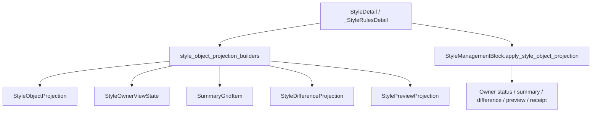

# StyleObjectProjection Builder 下沉执行记录

日期：2026-06-30

## 1. 本轮目标

上一轮已经新增 `StyleObjectProjection`，并让模板正文详情和场景分区样式都能把一个统一投影交给 `StyleManagementBlock`。

但当时还有一个临时状态：

```text
页面层仍在自己组装 StyleObjectProjection。
```

这会让页面继续知道太多投影细节。后续如果要做 `StylePreviewSurface`、`StylePolicyControlDeck` 或执行回执闭环，页面层仍会变成投影拼装仓库。

本轮目标是把 projection 生成下沉到稳定 builder：

```text
页面层：选择当前对象，调用 builder，交给 block
builder：组合 owner / summary / difference / preview / receipt
shared block：只消费 StyleObjectProjection
```

## 2. 新增 builder 模块

新增文件：

```text
src/ui/panels/style_object_projection_builders.py
```

新增两个 builder：

```python
build_template_body_style_projection(template, style)
build_scene_section_style_projection(scene, template, variant_key)
```

它们的定位是 UI 投影层，不是底层控件层。

这样做的原因：

- `StyleObjectProjection` 本身在 `src/shared/ui`，应该保持通用。
- 模板正文投影需要 `build_template_detail_summary_items(...)`。
- 场景分区投影需要 `scene_section_style_override_service` 和 style difference projection。
- 这些都属于 panel/projector 边界，不应该反向塞进 shared UI。

## 3. 模板正文详情迁移

文件：

```text
src/ui/panels/template_style_detail.py
```

删除页面内临时方法：

```text
_template_body_style_projection()
```

现在同步路径变为：

```text
StyleDetail
-> build_template_body_style_projection(...)
-> StyleManagementBlock.apply_style_object_projection(...)
```

页面层不再直接引用：

```text
StyleObjectProjection
template_body_style_owner_state
SummaryGridItem
build_template_detail_summary_items
```

这些都被收到 builder 里。

## 4. 场景分区样式迁移

文件：

```text
src/ui/panels/scene_panel.py
```

`_StyleRulesDetail._sync_style_editor()` 现在只做三件事：

1. 找到当前 variant。
2. 调用 `build_scene_section_style_projection(...)`。
3. 把结果交给 `SceneStyleRulesBlock.apply_style_object_projection(...)`。

页面层不再直接组装：

```text
scene_section_style_owner_state(...)
scene_section_style_preview_projection(...)
scene_section_style_comparison_projection(...)
scene_section_effective_style(...)
StyleObjectProjection.from_owner_state(...)
```

这些投影细节已经进入 builder。

这让页面层更接近对象控制器，而不是控件/投影仓库。

## 5. 新边界

当前边界变为：



这一步继续把“页面知道控件细节”往“页面知道业务对象”推进。

## 6. 测试更新

新增行为测试：

```text
tests/test_small_widget_architecture.py::test_style_object_projection_builders_cover_template_and_scene_styles
```

覆盖：

- 模板未选择状态。
- 模板正文样式状态。
- 场景分区跟随模板状态。
- 场景分区独立覆盖状态。
- 场景投影能生成 preview 和 difference。
- 独立覆盖后 `edit_state_label` 变为“可编辑”。

架构测试更新：

- 模板详情必须调用 `build_template_body_style_projection(...)`。
- 模板详情不再直接引用 `template_body_style_owner_state`。
- 场景页必须调用 `build_scene_section_style_projection(...)`。
- 场景页不再直接引用 `StyleObjectProjection`。
- 场景页不再直接引用 `scene_section_style_owner_state`。
- 场景页不再直接引用 `scene_section_style_comparison_projection`。
- builder 必须承接这些投影职责。

## 7. 本轮验证

已执行语法检查：

```powershell
python -X utf8 -m py_compile src\ui\panels\style_object_projection_builders.py src\ui\panels\template_style_detail.py src\ui\panels\scene_panel.py tests\test_small_widget_architecture.py tests\test_template_style_detail.py tests\test_scene_panel_architecture.py
```

结果：通过。

已执行聚焦测试：

```powershell
python -X utf8 -m pytest tests\test_small_widget_architecture.py::test_style_object_projection_builders_cover_template_and_scene_styles tests\test_template_style_detail.py::test_style_detail_reuses_shared_controls tests\test_scene_panel_architecture.py::test_scene_panel_uses_shared_card_header_and_flow_scope_layout tests\test_scene_panel_architecture.py::test_scene_panel_controls_follow_template_management_contract -q
```

结果：

```text
4 passed
```

追加执行共享小控件、模板详情和导出回归：

```powershell
python -X utf8 -m pytest tests\test_small_widget_architecture.py tests\test_template_style_detail.py tests\test_ui_exports.py -q
```

结果：

```text
58 passed
```

追加执行完整场景架构回归：

```powershell
python -X utf8 -m pytest tests\test_scene_panel_architecture.py -q
```

结果：

```text
59 passed in 241.52s (0:04:01)
```

## 8. 当前未完成

本轮仍不把以下事项视为完成：

1. `StylePreviewSurface` 尚未新增。
2. 模板正文详情仍未加入同规格段落预览。
3. `StylePolicyControlDeck` 尚未从 `StyleRuleControlDeck` 抽象出来。
4. 执行前复核和执行后回执仍未全面接入 `StyleObjectProjection` builder。
5. 场景概览首屏工程信息下沉仍未完成。
6. 模板详情和场景详情仍保留部分内部控件别名，需要继续收束。

## 9. 下一步建议

下一步应继续沿同一条线推进：

```text
执行前复核 / 执行回执
-> build_execution_style_projection(...)
-> StyleObjectProjection
-> StyleManagementBlock
```

这样执行前差异、执行后实际使用样式、模板基线和场景分区覆盖才能形成完整闭环。

在这之后，再做 `StylePreviewSurface` 会更自然，因为 preview 的来源已经统一到 projection builder，而不是散在页面里。

## 10. 本轮结论

本轮没有直接改变视觉，但把统一投影从“对象存在”推进到“生成职责稳定”：

```text
模板正文详情不再拼投影
场景分区样式不再拼投影
builder 负责组合 owner / summary / difference / preview
StyleManagementBlock 负责消费统一投影
```

这让后续做真正的控件规划、板块重排和文案减负更可靠。
