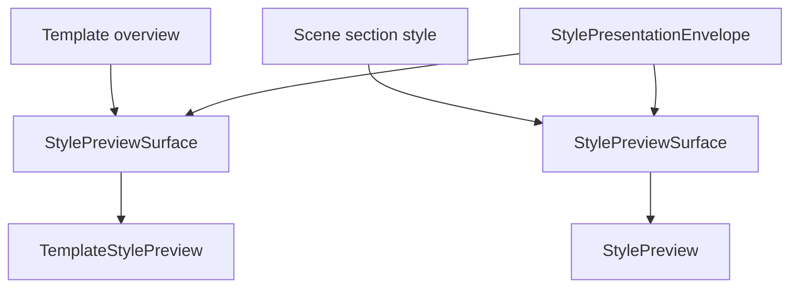

# StylePreviewSurface 模板场景首片接入记录

日期：2026-06-30

后续进展：Workbench 执行前复核已接入轻量 `StylePreviewSurface`，并由 `StyleObjectProjection.preview_projection` 驱动，详见 `docs/refactor-records/ExecutionPrereviewStylePreviewSurface接入记录_2026-06-30.md`。

后续进展：`StylePolicyControlDeck` 已作为通用策略控制外壳落地，详见 `docs/refactor-records/StylePolicyControlDeck抽象接入记录_2026-06-30.md`。

## 1. 本轮目标

上一轮已经把样式来源三入口收束到 `StyleSourceSlot`。本轮继续推进同一条样式对象链路，把“样式预览”从零散 widget 组合升级为显式预览外壳：

```text
StylePreviewSurface
-> StylePresentationEnvelope
-> renderer widget
```

目标不是重写预览绘制，而是先统一外壳边界：

- 模板页面级预览仍由 `TemplateStylePreview` 绘制。
- 场景分区段落预览仍由 `StylePreview` 绘制。
- 新外壳负责 envelope、摘要/详情显示、renderer 承载和统一属性。

## 2. 新增共享控件

新增文件：

```text
src/shared/ui/style_preview_surface.py
```

新增类：

```python
StylePreviewSurface
```

它的职责：

- 持有 `StylePresentationEnvelope`。
- 暴露 `summary_label`、`detail_label`、`renderer_widget`。
- 通过 `set_renderer(...)` 承载具体 preview renderer。
- 通过 `apply_envelope(...)` 同步外壳属性，并可选择是否同步 renderer。
- 通过 `show_metadata` 控制是否展示额外摘要文本。

关键设计：

```text
页面级预览：show_metadata=True
段落内联预览：show_metadata=False
```

这样模板概览可以继续显示页面预览摘要，场景分区不会因为加外壳而多出一层重复文字。

## 3. 模板概览接入

涉及文件：

```text
src/ui/panels/template_panel.py
```

迁移前：

```text
QWidget preview_slot
-> QLabel desc
-> TemplateStylePreview
```

迁移后：

```text
StylePreviewSurface preview_slot
-> summary_label
-> detail_label
-> TemplateStylePreview
```

仍然保持：

- `TemplateStylePreview` 负责页面级绘制。
- `StyleManagementBlock(mode="template_overview_preview")` 负责把 preview slot 放入样式管理块。
- `_cached_preview_desc` 仍指向摘要 label，兼容既有测试和刷新逻辑。

## 4. 场景分区段落预览接入

涉及文件：

```text
src/shared/ui/style_editing_section.py
```

迁移前：

```text
StyleEditingSection.chrome
-> StylePreview
```

迁移后：

```text
StyleEditingSection.chrome
-> StylePreviewSurface(show_metadata=False)
   -> StylePreview
```

这样场景分区仍然只看到原来的段落预览，不增加额外解释文本；但架构上已经有了统一预览外壳。

## 5. 当前预览链路

本轮之后，预览链路变为：



这说明模板页面预览和场景段落预览没有强行合并 renderer，但已经共用同一套 presentation shell。

## 6. 测试更新

新增/更新测试：

```text
tests/test_small_widget_architecture.py
tests/test_template_panel_architecture.py
tests/test_scene_panel_architecture.py
tests/test_ui_exports.py
```

新增覆盖点：

- `StylePreviewSurface` 能包装 renderer。
- `StylePreviewSurface.apply_envelope(...)` 会同步摘要、详情和 presentation 属性。
- `show_metadata=False` 时，外壳保留属性但不展示额外摘要/详情。
- `StyleEditingSection.preview_surface` 可访问。
- 场景分区段落预览通过 `StylePreviewSurface(show_metadata=False)` 承载。
- 模板概览 preview slot 是 `StylePreviewSurface`。
- `StylePreviewSurface` 通过 `src.shared.ui` 导出。

## 7. 本轮验证

已执行语法检查：

```powershell
python -X utf8 -m py_compile src\shared\ui\style_preview_surface.py src\shared\ui\style_editing_section.py src\ui\panels\template_panel.py tests\test_small_widget_architecture.py tests\test_scene_panel_architecture.py tests\test_template_panel_architecture.py tests\test_ui_exports.py
```

结果：通过。

已执行聚焦测试：

```powershell
python -X utf8 -m pytest tests\test_small_widget_architecture.py::test_style_preview_surface_wraps_renderer_and_envelope_metadata tests\test_small_widget_architecture.py::test_style_preview_surface_can_hide_metadata_for_inline_renderer tests\test_small_widget_architecture.py::test_style_editing_section_wraps_owner_preview_and_surface tests\test_template_panel_architecture.py::test_template_panel_uses_extracted_template_style_preview_widget tests\test_scene_panel_architecture.py::test_scene_panel_uses_shared_card_header_and_flow_scope_layout tests\test_scene_panel_architecture.py::test_scene_panel_scope_style_override_editor_writes_section_styles tests\test_ui_exports.py::test_shared_ui_exports_include_unified_controls -q
```

结果：

```text
7 passed in 5.20s
```

已执行模板与共享预览相关回归：

```powershell
python -X utf8 -m pytest tests\test_small_widget_architecture.py tests\test_template_panel_architecture.py tests\test_template_style_preview.py tests\test_ui_exports.py -q
```

结果：

```text
80 passed in 7.47s
```

已执行完整场景架构回归：

```powershell
python -X utf8 -m pytest tests\test_scene_panel_architecture.py -q
```

结果：

```text
59 passed in 53.47s
```

追加执行布局硬化聚焦测试：

```powershell
python -X utf8 -m pytest tests\test_ui_layout_hardening.py::test_template_and_scene_style_shells_keep_summary_preview_surface_order -q
```

结果：

```text
1 passed in 1.02s
```

## 8. 当前未完成

本轮仍不声明以下事项完成：

1. 执行前复核已经接入一个代表性分区的轻量样式预览，但不是多分区预览列表。
2. `StyleManagementBlock.preview_slot` 已可驱动 `StylePreviewSurface`，但尚未强制 preview slot 必须实现统一协议。
3. `TemplateStylePreview` 与 `StylePreview` 仍是不同 renderer，只是外壳统一。
4. `StylePolicyControlDeck` 已落地，执行前复核已在后续以只读策略区接入；模板管理是否需要策略区仍待后续模板级策略场景确认。
5. 目录、题注等专用小预览还没有接入 `StylePreviewSurface`。

## 9. 下一步建议

下一轮最直接的产品改善是：

```text
执行前复核
-> 增加轻量 StylePreviewSurface
-> 复用场景有效样式 projection
-> 让用户在执行前看到“本次大概会长什么样”
```

如果优先收紧架构边界，则下一步可以：

```text
StyleManagementBlock.preview_slot
-> 接受 StylePreviewSurface
-> apply_style_object_projection(...) 可直接驱动 preview_slot
```

这会让模板、场景、执行前复核三处预览都走同一条投影入口。
