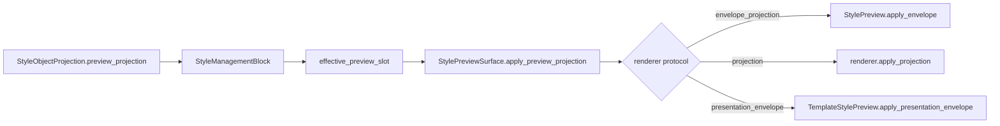

# StylePreviewSurface 渲染器协议观测执行记录

日期：2026-06-30

上一轮已经把 `StyleEditingSection.apply_preview_projection(...)` 委托给 `StylePreviewSurface.apply_preview_projection(...)`。至此，模板概览、场景分区样式、执行前复核都走同一个 surface 入口。但 surface 内部仍然靠局部 `getattr(...)` 判断 renderer 能力，没有形成可观测协议。

本轮继续下探一层：把 renderer 能力也变成明确协议和测试守门。

## 1. 之前的问题

`StylePreviewSurface` 内部 renderer 目前有不同类型：

| renderer | 位置 | 能力 |
| --- | --- | --- |
| `StylePreview` | 场景分区样式、执行前复核段落预览 | `apply_envelope(...)` + `apply_projection(...)` |
| `TemplateStylePreview` | 模板概览页面级预览 | `apply_presentation_envelope(...)` |

旧逻辑的问题：

1. `StylePreviewSurface` 只在调用时临时查找方法。
2. 测试只能证明 renderer 存在，不能证明它能消费哪种协议。
3. 如果后续有人传入普通 `QWidget`，surface 会接收，但 renderer 不会真正更新。
4. 模板页 renderer 和段落 renderer 的差异没有被命名，容易被误认为“没有统一”。

## 2. 本轮目标

新增 renderer 协议识别函数：

```python
def style_preview_renderer_protocol(widget: QWidget | None) -> str:
    ...
```

协议分类：

| 协议 | 含义 | 典型 renderer |
| --- | --- | --- |
| `envelope_projection` | 可同时消费 envelope 和 projection | `StylePreview` |
| `projection` | 只消费 projection | 轻量投影 renderer |
| `presentation_envelope` | 只消费展示 envelope | `TemplateStylePreview` |
| `none` | 没有 renderer | 空 surface |
| `unsupported` | 有 widget 但无预览协议 | 非法 renderer |

## 3. 实现改动

文件：`src/shared/ui/style_preview_surface.py`

### 3.1 新增协议函数

```python
def style_preview_renderer_protocol(widget: QWidget | None) -> str:
    if widget is None:
        return "none"
    if callable(getattr(widget, "apply_envelope", None)):
        return "envelope_projection"
    if callable(getattr(widget, "apply_projection", None)):
        return "projection"
    if callable(getattr(widget, "apply_presentation_envelope", None)):
        return "presentation_envelope"
    return "unsupported"
```

### 3.2 `set_renderer(...)` 拒绝无协议 renderer

现在传入没有上述任一能力的 renderer，会抛出 `TypeError`。

这和前面 `StyleManagementBlock.preview_slot` 的守门一致：结构上声称是预览 renderer，就必须能消费预览协议。

### 3.3 `apply_preview_projection(...)` 改为协议分发

旧逻辑：

```text
先找 apply_envelope
找不到再找 apply_projection
```

新逻辑：

```text
envelope_projection -> renderer.apply_envelope(envelope, projection, empty_text=...)
projection -> renderer.apply_projection(projection, empty_text=...)
presentation_envelope -> renderer.apply_presentation_envelope(envelope)
```

这样模板页 renderer 即使不消费段落 projection，也能在统一 surface 入口下拿到 presentation envelope。

### 3.4 新增 surface property

`StylePreviewSurface` 现在同步：

```text
style_preview_surface_renderer_protocol
style_preview_surface_renderer_ready
```

这让模板页、场景页、执行前复核都能证明自己的 renderer 能力。

### 3.5 共享导出

文件：`src/shared/ui/__init__.py`

新增导出：

```python
style_preview_renderer_protocol
```

## 4. 测试守门

### 4.1 小组件测试

文件：`tests/test_small_widget_architecture.py`

新增/加强：

- `StylePreview` renderer 必须报告 `envelope_projection`。
- metadata 隐藏时 renderer 协议仍然 ready。
- 普通 `QWidget` renderer 会被 `StylePreviewSurface.set_renderer(...)` 拒绝。

### 4.2 模板页真实入口

文件：`tests/test_template_panel_architecture.py`

模板概览的 `TemplateStylePreview` 必须报告：

```text
style_preview_surface_renderer_protocol == "presentation_envelope"
style_preview_surface_renderer_ready is True
```

这说明模板页预览不是段落 projection renderer，但它是合法的 envelope renderer。

### 4.3 场景分区真实入口

文件：`tests/test_scene_panel_architecture.py`

场景分区内置 `StylePreview` 必须报告：

```text
style_preview_surface_renderer_protocol == "envelope_projection"
style_preview_surface_renderer_ready is True
```

### 4.4 执行前复核真实入口

文件：`tests/test_quick_execution_detail_architecture.py`

执行前复核段落预览同样必须报告：

```text
style_preview_surface_renderer_protocol == "envelope_projection"
style_preview_surface_renderer_ready is True
```

### 4.5 共享导出测试

文件：`tests/test_ui_exports.py`

新增：

```text
style_preview_renderer_protocol(None) == "none"
```

## 5. 当前完整预览协议链



当前真实入口：

| 入口 | surface 协议 | renderer 协议 | 状态 |
| --- | --- | --- | --- |
| 模板概览 | `preview_projection` | `presentation_envelope` | 已守门 |
| 场景分区样式 | `preview_projection` | `envelope_projection` | 已守门 |
| 执行前复核 | `preview_projection` | `envelope_projection` | 已守门 |

## 6. 本轮验证

已通过：

```powershell
python -X utf8 -m py_compile src\shared\ui\style_preview_surface.py src\shared\ui\__init__.py tests\test_small_widget_architecture.py tests\test_scene_panel_architecture.py tests\test_template_panel_architecture.py tests\test_quick_execution_detail_architecture.py tests\test_ui_exports.py
```

```powershell
python -X utf8 -m pytest tests\test_small_widget_architecture.py::test_style_preview_surface_wraps_renderer_and_envelope_metadata tests\test_small_widget_architecture.py::test_style_preview_surface_can_hide_metadata_for_inline_renderer tests\test_small_widget_architecture.py::test_style_preview_surface_rejects_renderer_without_protocol tests\test_scene_panel_architecture.py::test_scene_style_override_section_wraps_owner_preview_and_surface tests\test_template_panel_architecture.py::test_template_panel_uses_extracted_template_style_preview_widget tests\test_quick_execution_detail_architecture.py::test_quick_execution_detail_uses_shared_style_source_row tests\test_ui_exports.py -q
```

结果：`7 passed`

## 7. 剩余边界

1. `projection` 协议目前是兼容通道，真实主路径还没有单独的只投影 renderer。保留它是为了后续轻量预览扩展。
2. `TemplateStylePreview` 仍是页面级绘制 renderer，只消费 presentation envelope。它和段落预览不是同一个 renderer 类型，但现在差异可观测。
3. 后续如果接入目录、题注、表格等专用预览，必须先选择 renderer 协议，不能绕过 `StylePreviewSurface`。

## 8. 本轮判断

这一轮把预览统一继续向内推进了一层：不仅 surface 是统一入口，surface 里面的 renderer 能力也有了明确协议。

这对后续继续对齐模板管理、场景配置和执行复核很关键。以后出现“预览不一致”时，可以沿着三层证据定位：

1. `StyleManagementBlock.effective_preview_slot`
2. `StylePreviewSurface.renderer_protocol`
3. renderer 自身的 presentation property

不再只能靠人工看界面猜是哪一层断了。
