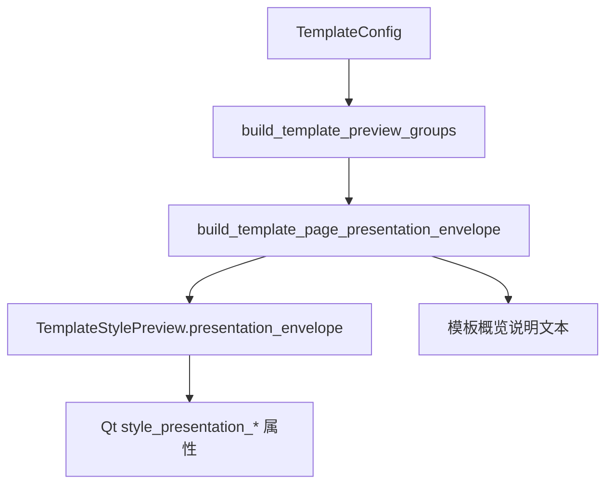

# TemplateStylePreview 页面级 Envelope 接入执行记录

日期：2026-06-29

后续进展：

- 场景分区段落预览已接入 `section_paragraph` envelope：共享 `StyleEditingSection` 会把段落 preview projection 映射为 envelope，详见 `docs/refactor-records/SceneSectionParagraphEnvelope接入执行记录_2026-06-29.md`。

## 1. 本轮判断

前两轮已经完成：

```text
StylePresentationEnvelope
-> StylePreview 段落预览入口
-> StyleResultReceiptRow 执行回执入口
-> Workbench ExecutionResultState / RecentRunState 状态链路
```

继续对照模板管理后，剩下的关键断点是：

```text
模板页面级预览仍然没有声明自己的展示语义。
```

`TemplateStylePreview` 本身是优秀的页面级画布：它绘制纸张比例、页边距、页眉页脚、标题、正文、表格、非编号标题等真实效果。它不应该被改成段落级 `StylePreview`，也不应该和执行回执合并控件。

真正需要统一的是这层语义：

```text
这是模板页面级预览
来源是模板基线
覆盖页面、正文、标题、表格、页眉页脚、目录、参考文献、题注
动作是核对这些模板模块
```

所以本轮只接入 `kind=template_page` 的 `StylePresentationEnvelope`，不重排视觉。

## 2. 已完成改动

### 2.1 模板格式层新增 envelope builder

文件：

- `src/ui/panels/template_format.py`

新增：

```text
build_template_page_presentation_envelope(cfg)
```

它复用已有模板预览分组函数：

```text
build_template_preview_groups
build_template_preview_description
build_template_preview_action_text
```

生成：

```text
kind = template_page
title = 样式预览
source_label = 模板基线
summary = 预览页面、正文、标题、表格、页眉页脚、目录、参考文献和题注在同一页中的效果。
detail = 当前模板：...
action_label = 核对页面、正文、标题、表格、页眉页脚、目录、参考文献和题注
```

这样模板管理页、场景跳转模板预览、后续只读复核都能从同一份模板预览语义取值。

### 2.2 `TemplateStylePreview` 暴露页面级 envelope

文件：

- `src/ui/panels/template_style_preview.py`

新增：

```text
preview.presentation_envelope
preview.apply_presentation_envelope(...)
```

`refresh(cfg)` 时会自动生成 `template_page` envelope，并同步到 Qt 属性：

- `style_presentation_kind`
- `style_presentation_title`
- `style_presentation_source_label`
- `style_presentation_summary`
- `style_presentation_detail`
- `style_presentation_action_label`

这些属性让模板预览可以和分区预览、执行回执用同一套检测和编排语言，但不改变现有页面绘制逻辑。

### 2.3 模板概览说明改为读取同一 envelope

文件：

- `src/ui/panels/template_panel.py`

模板概览里的说明标签现在不再直接调用：

```text
build_template_preview_description(...)
```

而是从：

```text
build_template_page_presentation_envelope(...).summary
```

取值。刷新模板后，也以 `TemplateStylePreview.presentation_envelope.summary` 回写说明标签。

这让“说明文字”和“预览控件语义”不会再分叉。

## 3. 当前链路



现在三种展示已经有共同语义层：

| 展示 | 控件 | Envelope kind |
| --- | --- | --- |
| 模板页面级预览 | `TemplateStylePreview` | `template_page` |
| 分区段落预览 | `StylePreview` | `section_paragraph` |
| 执行后样式回执 | `StyleResultReceiptRow` | `execution_receipt` |

它们仍然是不同 UI，因为回答的问题不同；但标题、来源、摘要、详情、动作已经可以走同一套字段。

## 4. 为什么这比继续加说明文案更合适

用户觉得“不说人话”的根源不是缺少一句说明，而是同一件事在不同入口被拆成不同内部语言：

- 模板页说“样式预览”
- 场景页说“当前分区有效样式”
- Workbench 说“样式来源”
- 报告里说 `style_source_summary`

本轮的意义是把模板页面级预览也纳入统一产品语法。以后要删冗余文本时，页面不需要再堆解释句，而是可以读取：

```text
title / source_label / summary / detail / action_label
```

让控件自己说清楚它在表达什么。

## 5. 当前未完成

本轮不把以下事项视为完成：

1. 场景分区预览已系统性产出 `section_paragraph` envelope，但 `StyleRuleControlDeck` 还没有读取 envelope 来统一“独立样式 / 跟随模板 / 差异摘要”。
2. `StyleManagementBlock` 还没有正式提供 `preview_slot`。
3. 主界面冗余说明文案还没有做最后一轮删除。

## 6. 验证

新增和更新测试：

- `tests/test_template_format_projection.py::test_template_page_presentation_envelope_uses_preview_groups`
- `tests/test_template_style_preview.py::test_template_style_preview_exposes_template_page_presentation_envelope`
- `tests/test_template_panel_architecture.py::test_template_panel_uses_extracted_template_style_preview_widget`
- `tests/test_template_panel_architecture.py::test_template_panel_builtin_selection_loads_real_template_config`

聚焦验证：

```text
4 passed
```
