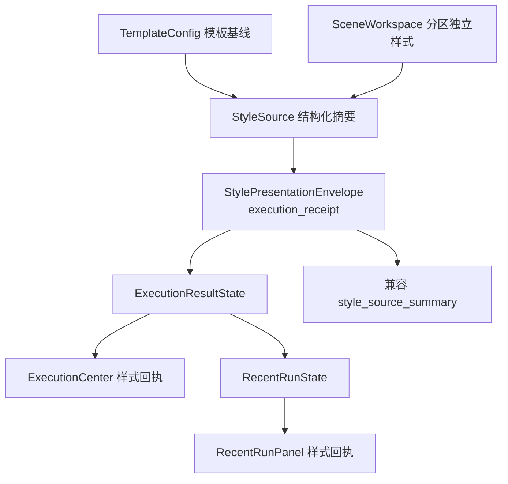

# Workbench 样式回执 Envelope 状态链路执行记录

日期：2026-06-29

后续进展：

- 模板页面级预览已产出 `kind=template_page` 的 envelope：`build_template_page_presentation_envelope(...)` 成为模板预览说明与 `TemplateStylePreview.presentation_envelope` 的共同来源，详见 `docs/refactor-records/TemplateStylePreview页面级Envelope接入执行记录_2026-06-29.md`。
- 场景分区段落预览已接入 `section_paragraph` envelope：共享 `StyleEditingSection` 会把段落 preview projection 映射为 envelope，详见 `docs/refactor-records/SceneSectionParagraphEnvelope接入执行记录_2026-06-29.md`。

## 1. 本轮判断

上一轮已经新增 `StylePresentationEnvelope`，并让 `StylePreview`、`StyleResultReceiptRow` 都能消费 envelope。但继续审计 Workbench 链路后发现：

```text
ExecutionResultState / RecentRunState
仍然只携带 style_source_summary 字符串。
```

这意味着 UI 控件虽然已经具备统一语义入口，但执行数据层仍在传一段文案。结果是：

1. 执行中心和最近结果只能靠字符串判断样式回执。
2. 模板、场景、Workbench 之间仍缺少同一个展示对象。
3. 后续如果要删除冗余说明文本，状态层无法表达“标题、来源、摘要、详情、动作”等结构。

所以本轮推进的目标不是换文案，而是把执行结果状态升级为：

```text
结构化 style_source
-> StylePresentationEnvelope
-> 兼容 style_source_summary
-> StyleResultReceiptRow
```

## 2. 已完成改动

### 2.1 状态对象新增 envelope

文件：

- `src/ui/panels/workbench/state.py`

新增字段：

```text
ExecutionResultState.style_source_envelope
RecentRunState.style_source_envelope
```

两者默认是空 envelope，不会让空状态误显示回执。

新增 helper：

```text
effective_style_source_envelope(envelope, summary)
```

用途：

- 优先使用结构化 envelope。
- 如果 envelope 没有可展示回执，则回落到旧的 `style_source_summary`。
- 保证旧调用方和旧测试不需要一次性迁移。

### 2.2 执行适配器改为先生成 envelope

文件：

- `src/ui/adapters/workbench_execution_adapter.py`

执行结果现在先生成：

```text
_style_source_receipt_envelope(style_source, fallback=style_source_summary)
```

再由 envelope 生成兼容文本：

```text
state.style_source_summary = envelope.receipt_summary(...)
```

旧函数 `_style_source_receipt_summary(...)` 保留，但已变成 envelope 的包装器，避免继续存在第二套摘要规则。

当前结构化输入：

```text
template_label = 默认格式
summary = 本次按模板“默认格式”处理；参考文献（行距）使用场景独立样式。
section_status = 1 个分区独立设置
```

会得到：

```text
kind = execution_receipt
title = 样式来源
source_label = 本次使用
summary = 本次按模板“默认格式”处理；参考文献（行距）使用场景独立样式。
```

同时兼容输出：

```text
样式来源：本次按模板“默认格式”处理；参考文献（行距）使用场景独立样式。
```

### 2.3 执行中心和最近结果优先渲染 envelope

文件：

- `src/ui/panels/workbench/execution_center.py`
- `src/ui/panels/workbench/recent_run_panel.py`

原来：

```text
StyleResultReceiptRow.set_summary(state.style_source_summary)
```

现在：

```text
StyleResultReceiptRow.apply_envelope(
    effective_style_source_envelope(
        state.style_source_envelope,
        state.style_source_summary,
    )
)
```

这意味着两个 Workbench 出口都已经从“字符串回执”升级为“结构化展示语义优先”。

## 3. 和模板管理一致性的关系

模板管理的优势是“对象明确”：当前模板、参数概览、样式预览、导入导出。

Workbench 如果只显示一段 `style_source_summary`，就会退回“日志文本”。本轮升级后，Workbench 也能表达一个明确对象：

```text
本次使用的样式来源
```

它和模板/场景的关系变成：



这比上一轮更接近最终目标：模板、场景、执行页并不是用同一个视觉控件，而是共享同一套展示语义。

## 4. 当前未完成

本轮只闭合 Workbench 状态链路，不把以下事项视为完成：

1. `ExecutionResultState` 仍保留 `style_source_summary`，因为报告、日志和旧调用方还需要它。
2. 模板页面级预览和场景分区段落预览已分别产出 `template_page` / `section_paragraph` envelope，但场景跳转、只读复核和规则控制区还没有系统性读取同一套 envelope。
3. 场景分区样式页还没有把所有预览说明、owner 状态和动作全部由 envelope 驱动。
4. `StyleManagementBlock` 还没有正式提供 `preview_slot` / `receipt_slot`。

## 5. 后续建议

### P0：模板页面级预览接入 `template_page`（已完成第一片）

让模板管理页面输出：

```text
kind = template_page
title = 当前模板
source_label = 模板基线
summary = 页面、正文、标题、表格等关键样式
```

已完成第一片：页面级预览控件本身不变，但已经声明语义。

### P1：场景分区预览接入 `section_paragraph`

场景分区样式页应把“跟随模板 / 独立样式 / 当前有效样式 / 差异摘要”组织成 envelope，再交给 `StylePreview` 和 `StyleRuleControlDeck`。

### P1：日志只读文本继续下沉

当回执和预览都能从 envelope 渲染后，执行日志里不必重复输出完整样式来源，只保留结构化报告和必要诊断。

## 6. 验证

新增和更新测试：

- `tests/test_workbench_execution_center.py::test_execution_result_state_defaults_are_safe`
- `tests/test_workbench_execution_center.py::test_recent_run_state_defaults_are_safe`
- `tests/test_workbench_execution_center.py::test_execution_center_result_state_renders_style_source_receipt`
- `tests/test_workbench_execution_center.py::test_execution_adapter_builds_success_result_state`
- `tests/test_recent_run_panel.py::test_recent_run_panel_includes_style_source_summary`
- `tests/test_recent_run_panel.py::test_recent_run_panel_accepts_style_source_envelope`

聚焦验证：

```text
6 passed
```
