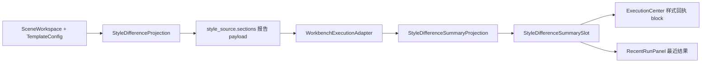

# Workbench 样式差异回执与模板管理高复用闭环记录

日期：2026-06-29

## 本轮结论

前几轮已经把模板管理、场景分区和 Workbench 执行前复核逐步接到同一套样式控件体系，但距离“优秀设计”还差一段关键链路：执行完成后，用户只能看到“样式来源回执”，看不到“本次结果与模板预期是否一致、哪些分区用了独立样式、差异是什么”。

这会造成三个问题：

1. 执行前能看差异，执行后看不到差异，链路断裂。
2. 模板管理页已经有 `source / scope / difference / preview / editor` 这些语义板块，Workbench 结果态却退回普通文本和单一回执。
3. 用户会被迫读“custom_basic / quick_formatting / section_status”这类实现语言，无法直接回答“我该不该放心交付”。

本轮把 Workbench 执行后链路补齐到同一套差异投影和差异 slot：



## 当前链路状态

| 入口 | 目标问题 | 当前状态 |
| --- | --- | --- |
| 模板管理 | 模板基线是什么 | 已有 `StyleManagementBlock(template_baseline_edit)` |
| 场景分区样式 | 当前分区是否跟随模板 | 已有 `StyleManagementBlock(scene_section_rules)`，包含 `difference` |
| Workbench 执行前 | 执行前是否会按模板走 | 已有 `StyleManagementBlock(execution_prereview)`，包含 `source / scope / difference` |
| Workbench 执行后 | 执行完是否仍能追溯差异 | 本轮补齐，执行中心为 `difference / receipt` |
| 最近运行 | 最近一次结果是否可快速复核 | 本轮补齐差异 slot，但外层仍是 `Card`，后续可继续升级为完整 block |

## 本轮代码调整

### 1. 状态契约补齐

文件：`src/ui/panels/workbench/state.py`

新增字段：

```python
style_difference_summary: StyleDifferenceSummaryProjection | None = None
```

覆盖对象：

- `ExecutionResultState`
- `RecentRunState`

意义：

- 执行结果状态不再只携带 `style_source_summary`。
- 差异摘要从普通文本提升为明确投影对象。
- UI 可以只关心“有没有差异投影”，不需要理解报告 JSON 的字段结构。

### 2. Adapter 成为执行后差异投影入口

文件：`src/ui/adapters/workbench_execution_adapter.py`

新增转换职责：

- 从 `style_source["sections"]` 或 `style_source["section_differences"]` 还原 `StyleDifferenceProjection`。
- 聚合为 `StyleDifferenceSummaryProjection`。
- 兼容未来直接传入 `difference_summary` / `style_difference_summary`。
- `build_recent_run_state()` 继续把同一份差异投影传给最近结果。

这让数据链路变成：

```text
报告 style_source.sections
-> _style_difference_projection_from_payload()
-> build_style_difference_summary_projection()
-> ExecutionResultState.style_difference_summary
-> RecentRunState.style_difference_summary
```

关键边界：

- `style_source_summary` 只负责“本次样式来源”。
- `style_difference_summary` 只负责“和模板基线差在哪里”。
- `summary_box` 继续只放执行状态、对象预检、字段一致性、批量隔离和诊断摘要。

### 3. 执行中心复用 StyleManagementBlock

文件：`src/ui/panels/workbench/execution_center.py`

之前：

```text
StyleManagementBlock(execution_receipt_review)
└── receipt
```

现在：

```text
StyleManagementBlock(execution_receipt_review)
├── difference
└── receipt
```

具体变化：

- 新增 `_style_difference_slot = StyleDifferenceSummarySlot(...)`
- 传入 `StyleManagementBlock(..., difference_slot=..., receipt_slot=...)`
- block 的有效内容计划变为 `difference|receipt`
- 有差异或有回执时显示整个 block
- 没有差异且没有回执时隐藏整个 block

这保持了模板管理语义的一致性：执行后也不是“又一段说明文字”，而是同一套样式管理内容板块。

### 4. 最近运行补齐差异摘要

文件：`src/ui/panels/workbench/recent_run_panel.py`

新增：

- `_style_difference_slot = StyleDifferenceSummarySlot(...)`
- `RecentRunState.style_difference_summary` 驱动显隐和内容

当前仍保留原 `Card` 结构，因为最近运行面板还承载产物清单、打开文件按钮、错误摘要等非样式内容。本轮先保证差异控件和投影一致，后续再评估是否把样式区域单独升级成完整 `StyleManagementBlock`。

## 功能边界重新规划

优秀的设计不应靠更多解释文字来解决理解问题，而应让每个板块只回答一个清楚问题：

| 板块 | 回答的问题 | 控件/投影 |
| --- | --- | --- |
| `source` | 这套样式来自哪个模板或场景 | `StyleSourceProjection` / `StyleSourceCompactRow` |
| `scope` | 哪些处理范围会参与执行 | 场景范围投影 |
| `difference` | 当前设置和模板基线差在哪里 | `StyleDifferenceProjection` / `StyleDifferenceSummarySlot` |
| `preview` | 套用后大致长什么样 | 样式预览投影 |
| `receipt` | 本次执行实际按什么来源处理 | `StylePresentationEnvelope` / `StyleReceiptSlotFrame` |

这轮最重要的边界修正是：`receipt` 不再承担差异说明，`difference` 不再混进来源说明。

## 可读性优化方向

当前截图里的“custom_basic / quick_formatting / Green/L5 / template 13 / scene 37”属于实现语言。它们可以存在于调试属性或 tooltip，但不应该成为用户主要阅读路径。

建议后续把可见文本收敛为三层：

1. 首行：人话结论
   例如：`参考文献使用独立样式`

2. 次行：用户关心的变化
   例如：`和模板不同：行距`

3. 详情：必要时展开或 tooltip
   例如：`模板基线：默认格式；当前分区：独立样式；差异：已调整 1 项`

不建议继续增加解释段落。冗余说明会让界面看起来更“专业”，但用户读起来更累。

## 仍需继续优化的点

### P0：统一最近结果的样式区域容器

`RecentRunPanel` 现在已经复用 `StyleDifferenceSummarySlot` 和 `StyleReceiptSlotFrame`，但外层仍不是完整 `StyleManagementBlock`。

建议下一轮把最近结果里的样式相关区域抽成：

```text
RecentRunStyleReviewBlock
├── difference
└── receipt
```

这样最近运行、执行中心和执行前复核都能通过同一种板块模型被测试。

### P0：清理用户可见的实现语言

应把以下内容从主界面降级：

- `custom_basic`
- `quick_formatting`
- `Green/L5`
- `template 13 / scene 37 / material 6 / output 17`
- `manual / 提示`

替代方式：

- 主界面显示用户动作或结论。
- ID、key、计数进入 tooltip、审计详情或开发诊断。
- 单个卡片最多表达一个判断，不再同时塞来源、策略、计数、英文 key。

### P1：差异摘要支持多分区展开

`StyleDifferenceSummarySlot` 当前是单条比较 strip，适合“一眼知道有差异”。当差异来自多个分区时，后续可以增加只读明细区：

```text
差异：2 个分区已调整
- 参考文献：行距
- 致谢：字号、中文字体
```

注意这个明细应作为 `difference` slot 的内部展开态，不要新造一个和模板管理无关的文本列表。

### P1：执行报告与 UI 的字段名继续统一

报告 payload 当前有 `sections`，adapter 已经能读取。但后续应明确：

- `sections` 是执行报告和 UI 差异回执的唯一标准入口。
- 新增字段必须先进入 `StyleDifferenceProjection`，再给 UI 使用。
- UI 不直接读取 `changed_count / compact_label` 等低层字段。

## 本轮验证

已通过：

```powershell
python -X utf8 -m pytest tests\test_workbench_execution_center.py tests\test_recent_run_panel.py -q
```

结果：

```text
97 passed
```

已通过共享控件回归：

```powershell
python -X utf8 -m pytest tests\test_small_widget_architecture.py tests\test_quick_execution_detail_architecture.py tests\test_style_difference_projection.py tests\test_design_system_refactor.py tests\test_ui_exports.py tests\test_workbench_execution_center.py tests\test_recent_run_panel.py -q
```

结果：

```text
202 passed
```

## 本轮判断

这轮不是单纯“多显示一行差异”，而是把执行后结果重新纳入模板管理的同一套内容模型：

- 执行前：看来源、范围、差异。
- 执行后：看差异、回执。
- 最近结果：快速回看差异和回执。

后续真正要冲“优秀设计”，重点不是继续堆说明，而是清掉实现语言，把每个板块压缩成用户能立即判断的结论。
