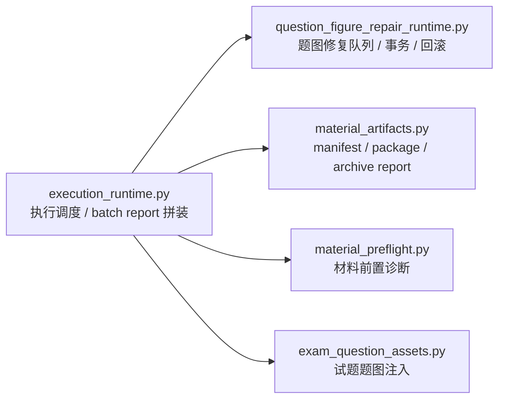

# Workbench 题图修复运行时拆分规划（阶段 4）

日期：2026-07-07

## 当前结论

远程题图缓存删除已经稳定到阶段 3。当前更值得继续做的不是再扩大战场删控件，而是把 `execution_runtime.py` 中仍然合理存在、但体量过大的本地题图批量修复事务拆出来。

当前基线：

- `src/ui/panels/workbench/execution_runtime.py`：约 5001 行。
- `src/ui/panels/workbench/material_preflight.py`：约 490 行。
- `src/ui/panels/workbench/exam_question_assets.py`：约 383 行。
- `src/ui/panels/workbench/material_artifacts.py`：约 865 行。
- 阶段 4 目标函数集中在 `execution_runtime.py` 约 1474-4173 行。
- 直接导入这些私有题图修复函数的外部文件主要是 `tests/test_material_execution_context.py`。
- `src/config` 中目前看到的是题图修复 artifact / drilldown 的类型审计，不是对这些运行时私有函数的直接导入。

## 下一步目标

新增独立模块：

- `src/ui/panels/workbench/question_figure_repair_runtime.py`

把题图批量修复队列、确认计划、dry-run、执行计划、Word media 写入、审计记录、事务 manifest、回滚、冲突裁决等逻辑从 `execution_runtime.py` 中迁出。

完成后应形成这样的边界：



## 不做的事

本阶段不做这些动作：

- 不删除本地题图批量修复能力。
- 不改 `question_figure_repair_queue`、`batch_apply_transaction_manifest` 等 payload 字段语义。
- 不改 Workbench adapter / UI 展示逻辑，除非测试证明引用路径必须同步。
- 不重命名产品文案或控件。
- 不恢复任何远程下载、远程缓存、远程写回能力。
- 不同时拆 `tests/test_material_execution_context.py`，测试拆分放到阶段 5。

## 必迁函数清单

第一组：batch report 和队列入口。

- `_batch_question_figure_comparison_matrix`
- `_batch_question_figure_repair_queue`
- `_apply_question_figure_repair_queue_conflict_guard`
- `_refresh_question_figure_repair_queue_status`
- `_resolve_question_figure_repair_queue_conflict`

第二组：确认计划、冻结、dry-run、执行计划。

- `_question_figure_repair_batch_confirmation_plan`
- `_question_figure_repair_batch_plan_fingerprint`
- `_freeze_question_figure_repair_batch_confirmation_plan`
- `_dry_run_question_figure_repair_batch_apply_guard`
- `_plan_question_figure_repair_batch_apply_execution`
- `_question_figure_repair_batch_apply_execution_plan_fingerprint`

第三组：Word media 批量替换、审计、事务 manifest、回滚。

- `_apply_question_figure_repair_batch_execution_to_docx`
- `_question_figure_batch_apply_audit_record`
- `_append_question_figure_batch_apply_audit_record`
- `_read_question_figure_batch_apply_audit_payload`
- `_question_figure_batch_apply_transaction_manifest_from_audit`
- `_question_figure_batch_apply_transaction_task_summary`
- `_write_question_figure_batch_apply_transaction_manifest`
- `_question_figure_batch_apply_transaction_manifest_markdown`
- `_rollback_question_figure_repair_batch_apply_from_audit`
- `_question_figure_batch_apply_rollback_audit_record`
- `_batch_apply_audit_output_dir`

第四组：随迁辅助函数。

- `_question_figure_repair_target_payload`
- `_question_figure_repair_apply_plan`
- `_file_sha1`
- `_is_local_file`
- `_repair_queue_token`
- `_comparison_matrix_question_index`
- `_comparison_matrix_item_payload`
- `_comparison_question_sort_key`

## 依赖处理策略

新模块允许依赖：

- 标准库：`copy`、`hashlib`、`json`、`re`、`zipfile`、`datetime`、`timezone`、`Path`、`Mapping`、`Sequence`。
- 报告写入：`write_json_report`、`write_markdown_report`。
- Word 对比输出：`write_compare_docx`。
- 既有本地 artifact 辅助：`_path_map`。

新模块不允许依赖：

- `PySide6`。
- `WorkbenchProductionRunner` / `WorkbenchBatchProductionRunner`。
- UI widget、controller、adapter。
- 任何远程下载、远程缓存、远程写回 API。

`_clean_text`、`_clean_list`、`_utc_now_iso` 建议在新模块内保留小型本地 helper，避免为了几个通用清洗函数反向依赖 `execution_runtime.py`，也避免形成循环 import。

## 执行步骤

### 1. 做迁移前守门扫描

确认当前函数和调用点：

```powershell
rg -n "^def (_batch_question_figure|_apply_question_figure|_question_figure_repair|_freeze_question_figure|_dry_run_question_figure|_plan_question_figure|_rollback_question_figure|_resolve_question_figure|_refresh_question_figure|_append_question_figure_batch|_read_question_figure_batch|_write_question_figure_batch|_comparison_matrix|_repair_queue|_file_sha1|_is_local_file)" src\ui\panels\workbench\execution_runtime.py
rg -n "(_batch_question_figure_comparison_matrix|_batch_question_figure_repair_queue|_apply_question_figure_repair_queue_conflict_guard|_question_figure_repair_batch_confirmation_plan|_freeze_question_figure_repair_batch_confirmation_plan|_dry_run_question_figure_repair_batch_apply_guard|_plan_question_figure_repair_batch_apply_execution|_apply_question_figure_repair_batch_execution_to_docx|_question_figure_batch_apply_audit_record|_append_question_figure_batch_apply_audit_record|_read_question_figure_batch_apply_audit_payload|_question_figure_batch_apply_transaction_manifest_from_audit|_write_question_figure_batch_apply_transaction_manifest|_rollback_question_figure_repair_batch_apply_from_audit|_question_figure_batch_apply_rollback_audit_record|_resolve_question_figure_repair_queue_conflict|_refresh_question_figure_repair_queue_status|_question_figure_repair_apply_plan)" src tests -g "*.py"
```

预期：

- 运行时代码中只有 `execution_runtime.py` 定义和内部调用。
- 测试中主要是 `tests/test_material_execution_context.py` 直接导入。
- `src/config` 不应直接导入这些函数；若审计测试靠源码路径断言，需要在迁移后同步 evidence path。

### 2. 新建 `question_figure_repair_runtime.py`

迁移方式：

- 以函数块为单位从 `execution_runtime.py` 迁出，不做语义重写。
- 保留现有私有函数名，降低测试和审计迁移成本。
- 新模块顶部只放运行时纯逻辑依赖，不引入 Qt。
- 对 `_clean_text`、`_clean_list`、`_utc_now_iso` 使用本地 helper。

迁移后检查：

- 新模块可以单独 `compileall`。
- 新模块没有 `PySide6` 字符串。
- 新模块没有 `WorkbenchProductionRunner` 字符串。

### 3. 改 `execution_runtime.py` 为调度层导入

`execution_runtime.py` 应只 import 这些题图修复入口：

- `_batch_question_figure_comparison_matrix`
- `_batch_question_figure_repair_queue`

如果现有运行时内部还需要暴露 apply / rollback 测试入口，不在 `execution_runtime.py` 做兼容 re-export，优先把测试导入改到新模块。

同时清理迁移后未使用 import：

- `hashlib`
- `zipfile`
- `re`
- `copy`
- `write_compare_docx`

是否能删除以实际 `compileall` / `ruff` 风格扫描为准，不凭肉眼一次性删干净。

### 4. 更新测试导入

`tests/test_material_execution_context.py` 保留：

- `WorkbenchBatchProductionRunner`
- `WorkbenchProductionRunner`
- `_render_batch_markdown_report`

这些仍从 `execution_runtime.py` 导入。

题图修复事务函数改从新模块导入：

- `_apply_question_figure_repair_batch_execution_to_docx`
- `_batch_question_figure_repair_queue`
- `_dry_run_question_figure_repair_batch_apply_guard`
- `_freeze_question_figure_repair_batch_confirmation_plan`
- `_plan_question_figure_repair_batch_apply_execution`
- `_resolve_question_figure_repair_queue_conflict`
- `_rollback_question_figure_repair_batch_apply_from_audit`

阶段 5 再考虑把这部分测试整体拆到 `tests/test_question_figure_repair_runtime.py`。

### 5. 增加架构守门

在 `tests/test_workbench_execution_architecture.py` 增加：

- `test_workbench_question_figure_repair_runtime_lives_in_dedicated_module`

断言内容：

- `execution_runtime.py` 不再定义迁移函数。
- `question_figure_repair_runtime.py` 定义必须存在的核心函数。
- `execution_runtime.py` 包含 `from .question_figure_repair_runtime import`。
- 新模块不包含 `PySide6`。
- 新模块不包含 `WorkbenchProductionRunner`。

### 6. 聚焦验证

先跑编译和架构守门：

```powershell
python -m compileall -q src\ui\panels\workbench\question_figure_repair_runtime.py src\ui\panels\workbench\execution_runtime.py tests\test_workbench_execution_architecture.py tests\test_material_execution_context.py
python -m pytest -q tests/test_workbench_execution_architecture.py
```

再跑题图修复事务聚焦测试：

```powershell
python -m pytest -q tests/test_material_execution_context.py -k "question_figure_repair or batch_apply or rollback"
```

再跑消费方聚焦测试：

```powershell
python -m pytest -q tests/test_workbench_execution_center.py -k "question_figure_repair_queue or batch_apply_transaction"
python -m pytest -q tests/test_quick_execution_detail_architecture.py -k "question_figure_repair_queue or batch_apply_transaction"
python -m pytest -q tests/test_recent_run_panel.py -k "question_figure_repair_queue or batch_apply_transaction"
python -m pytest -q tests/test_scene_report_artifact_drilldown_audit.py
```

最后跑远程缓存回归扫描，确认没有误把删除能力带回来：

```powershell
rg -n "remote_question_asset|remote_asset_cache|remote_asset_download_auth|asset_auth|urlopen|Request\(|remote_asset_items" src\ui\panels\workbench src\ui\adapters src\services\material_assets src\ui\panels\assets -g "*.py"
rg -n "QuestionFigureSharedCache|question_figure_shared_cache|asset_item_shared_cache_dir|asset_item_cache_status|cache_projection|asset_item_remote_asset_id|_asset_item_remote_asset_id" src tests -g "*.py"
```

## 验收标准

阶段 4 完成时必须满足：

- `src/ui/panels/workbench/question_figure_repair_runtime.py` 存在。
- `execution_runtime.py` 不再定义题图修复事务细节函数。
- `execution_runtime.py` 只调用题图修复模块的入口函数拼装 batch report。
- 题图修复 payload 字段保持兼容：
  - `question_figure_repair_queue`
  - `batch_confirmation_plan`
  - `batch_apply_dry_run`
  - `batch_apply_execution_plan`
  - `batch_apply_execution_result`
  - `batch_apply_transaction_manifest`
  - `batch_apply_rollback_result`
- apply / rollback 审计 artifact 名称保持兼容：
  - `question_figure_batch_apply_audit.json`
  - `question_figure_batch_apply_transaction_manifest.json`
  - `question_figure_batch_apply_transaction_manifest.md`
- 新模块不依赖 Qt。
- 远程缓存相关扫描仍然只剩允许项和测试守门项。
- 聚焦测试通过。

## 失败处理

如果 `compileall` 失败：

- 优先检查迁移函数缺少的本地 helper。
- 不回滚整个阶段，按缺失符号逐个补齐依赖。

如果题图修复测试失败：

- 先比较迁移前后 payload 字段，不做产品语义调整。
- 对路径、sha1、zip 写入、audit path 相关失败，优先检查 `Path`、`zipfile`、`_file_sha1`、`_batch_apply_audit_output_dir` 是否完整迁移。

如果审计测试失败：

- 只更新 evidence source path，不改审计口径。
- 若审计只是消费 artifact type，不应改源码。

如果远程缓存扫描出现新命中：

- 优先判断是否来自新模块误带入旧缓存字段。
- 新模块不得包含 `_remote_asset_cache`、`remote_asset_items`、下载鉴权、`urlopen`、`Request(`。

## 阶段 4 完成后的阶段 5

阶段 4 验证通过后，再进入测试结构拆分：

- 新增 `tests/test_question_figure_repair_runtime.py`。
- 把 `tests/test_material_execution_context.py` 中 题图修复事务的直接单元测试迁过去。
- `tests/test_material_execution_context.py` 只保留 Workbench 跨模块集成路径。

阶段 5 不应和阶段 4 同时混做。先稳定运行时边界，再调整测试布局。

## 执行记录

### 2026-07-07 阶段 4

已完成：

- 新增 `src/ui/panels/workbench/question_figure_repair_runtime.py`。
- `execution_runtime.py` 不再定义题图修复队列、确认计划、dry-run、执行计划、Word media 写入、审计、事务 manifest 和回滚函数。
- `execution_runtime.py` 只从新模块导入 `_batch_question_figure_comparison_matrix` / `_batch_question_figure_repair_queue`，用于 batch report 拼装。
- 清理 `execution_runtime.py` 中迁移后不再使用的 `hashlib`、`zipfile`、`Sequence` 导入。
- `tests/test_material_execution_context.py` 的题图修复私有函数导入改到新模块。
- `tests/test_workbench_execution_architecture.py` 新增阶段 4 架构守门，防止题图修复运行时逻辑回流到 `execution_runtime.py`。

结构结果：

- `execution_runtime.py` 当前约 2294 行。
- `question_figure_repair_runtime.py` 当前约 2733 行。
- 新模块不依赖 Qt，也不依赖 `WorkbenchProductionRunner`。
- 题图修复 payload 和 artifact 名称保持兼容。

验证结果：

```powershell
python -m compileall -q src\ui\panels\workbench\question_figure_repair_runtime.py src\ui\panels\workbench\execution_runtime.py tests\test_workbench_execution_architecture.py tests\test_material_execution_context.py
# passed

python -m pytest -q tests/test_workbench_execution_architecture.py
# 6 passed in 0.47s

python -m pytest -q tests/test_material_execution_context.py -k "question_figure_repair or batch_apply or rollback"
# 8 passed, 39 deselected in 39.17s

python -m pytest -q tests/test_workbench_execution_center.py -k "question_figure_repair_queue or batch_apply_transaction"
# 6 passed, 74 deselected in 0.90s

python -m pytest -q tests/test_quick_execution_detail_architecture.py::test_quick_execution_detail_emits_question_figure_repair_candidate_action tests/test_quick_execution_detail_architecture.py::test_quick_execution_detail_emits_transaction_task_summary_action tests/test_quick_execution_detail_architecture.py::test_quick_execution_detail_emits_question_figure_conflict_selection_action
# 3 passed in 0.94s

python -m pytest -q tests/test_recent_run_panel.py -k "question_figure_repair_queue or batch_apply_transaction"
# 1 passed, 21 deselected in 0.69s

python -m pytest -q tests/test_scene_report_artifact_drilldown_audit.py
# 4 passed in 276.39s
```

远程缓存删除守门：

```powershell
rg -n "remote_question_asset|remote_asset_cache|remote_asset_download_auth|asset_auth|urlopen|Request\(|remote_asset_items" src\ui\panels\workbench src\ui\adapters src\services\material_assets src\ui\panels\assets -g "*.py"
# only field_editor_state_presenter.py legacy auth blacklist entries

rg -n "QuestionFigureSharedCache|question_figure_shared_cache|asset_item_shared_cache_dir|asset_item_cache_status|cache_projection|asset_item_remote_asset_id|_asset_item_remote_asset_id" src tests -g "*.py"
# only negative guard tests
```

### 2026-07-07 阶段 5

已完成：

- 新增 `tests/test_question_figure_repair_runtime.py`。
- 将 `tests/test_material_execution_context.py` 中题图修复事务的 7 个直接单元测试迁入新文件。
- `tests/test_material_execution_context.py` 只保留 Workbench material 执行上下文和跨模块集成路径。
- 旧集成文件不再直接导入题图修复事务私有函数。

结构结果：

- `tests/test_material_execution_context.py` 当前约 2176 行。
- `tests/test_question_figure_repair_runtime.py` 当前约 1087 行。

验证结果：

```powershell
python -m compileall -q tests\test_material_execution_context.py tests\test_question_figure_repair_runtime.py src\ui\panels\workbench\question_figure_repair_runtime.py src\ui\panels\workbench\execution_runtime.py
# passed

python -m pytest -q tests/test_question_figure_repair_runtime.py
# 7 passed in 0.74s

python -m pytest -q tests/test_material_execution_context.py -k "question_figure_repair or batch_apply or rollback"
# 1 passed, 39 deselected in 37.01s

python -m pytest -q tests/test_material_execution_context.py tests/test_question_figure_repair_runtime.py
# 47 passed in 534.62s

python -m pytest -q tests/test_workbench_execution_architecture.py tests/test_material_asset_services.py::test_material_asset_service_does_not_expose_shared_cache_projection_api tests/test_assets_panel_architecture.py::test_assets_panel_does_not_reintroduce_question_figure_shared_cache_presenter tests/test_assets_panel_helper_modules.py::test_assets_panel_does_not_expose_question_figure_shared_cache_helpers tests/test_assets_panel_question_figures.py
# 12 passed in 0.60s
```
