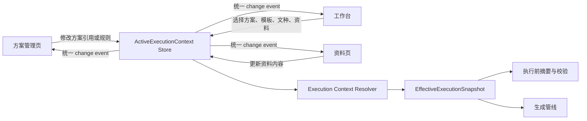

# 公文方案、文种、资料单一状态源重构设计

日期：2026-07-11  
状态：核心链路已执行；旧资源兼容层保留

## 1. 结论

公文版应当与试卷版、论文版使用同一套产品心智：

```text
内置基础方案
→ 用户创建或选择自己的方案
→ 选择本次任务的模板、文种和资料
→ 执行前生成唯一、不可变的执行快照
→ 按快照生成交付文档
```

必须取消当前“方案默认文种、资料文种、工作台缓存文种、运行时回退文种同时决定结果”的多权威模型。

最终只允许一个事实来源：

> 本次任务采用什么方案、模板、母版、文种和资料，全部由同一个 `ActiveExecutionContext` 管理；真正执行时再冻结为 `EffectiveExecutionSnapshot`。方案页、工作台和资料页只能读取或修改这一个上下文，不能各自保存一份有效状态。

## 2. 当前问题的本质

### 2.1 “文种预设”被误建模成“处理方案”

当前公文版存在以下内置方案：

- 公文默认方案，对应 `official:notice`
- 函件方案，对应 `official:letter`
- 纪要方案，对应 `official:minutes`
- 报告方案，对应 `official:report`
- 请示方案，对应 `official:request`
- 批复方案，对应 `official:approval`

这些资源基本共用：

- `official_gbt` 模板；
- `official_gbt_standard` 母版；
- 相近的模块开关、交付配置和格式规则。

主要差异只是 `default_material_profile_id`。这说明它们本质上更接近“文种预设”，不是六套真正独立的处理方案。

结果是用户看到“方案”时，不知道它指的是：

- 一组可自定义的处理规则；
- 一种公文文种；
- 一套模板；
- 还是一次任务的资料装配方式。

### 2.2 同一概念存在多个权威来源

当前文种可能同时存在于：

1. `SceneWorkspace.default_material_profile_id`；
2. `MaterialExecutionContext.profile_id`；
3. `MaterialExecutionContext.entity_data["document_type"]`；
4. 工作台组件自己的缓存；
5. 运行时缺省回退值 `notice`。

当前工作台的有效文种优先级是：

```text
资料上下文 profile_id
→ 资料 document_type
→ 方案 default_material_profile_id
→ notice
```

运行管线也优先读取资料中的 `document_type`，再回退到方案默认文种。因此界面选中的方案不一定决定最终装配文种。

### 2.3 页面间状态通知不完整

方案页面在用户选择方案后，会更新 Bridge 内部状态，但使用 `emit_signal=False`。工作台面板又是缓存复用的，因此可能继续持有旧的：

- `_current_scene`；
- 资料上下文；
- 快速执行摘要；
- 模板和文种投影。

这会导致以下状态同时出现：

```text
方案页面：函件方案
Bridge：official_letter
工作台显示：公文默认方案
工作台资料：notice
运行时文种：取决于残留 document_type
```

### 2.4 执行阶段从不同对象拼装状态

当前执行阶段分别读取工作台缓存方案、Bridge 方案 ID、资料组件上下文和当前模板。它们没有在执行前被验证为同一版本，因此可能形成“混合快照”。

这类错误不能仅靠刷新下拉框解决，必须收束状态模型。

## 3. 最终职责边界

### 3.1 方案 Plan

方案回答：

```text
这类任务启用哪些处理模块？
使用哪些规则和例外？
默认绑定哪套模板和母版？
输出哪些交付物？
执行失败、风险对象和校验问题如何处理？
```

方案拥有：

- 规则配置；
- 模块开关；
- 格式例外；
- 作用边界；
- 默认模板引用；
- 默认母版引用；
- 输出策略；
- 校验与风险策略；
- 用户自定义名称、版本和来源信息。

方案不拥有本次任务的最终文种和具体资料。

方案可以带一个“推荐文种”，但只能用于新建任务时初始化，不能在执行时与任务文种竞争。

### 3.2 模板 Template

模板回答：

```text
页面、段落、标题、表格、页眉页脚等默认格式是什么？
文档结构如何识别和格式化？
```

模板是格式与结构基线，不是任务方案，也不是公文文种。

### 3.3 母版 Master DOCX

母版回答：

```text
最终文档使用哪个真实 DOCX 外壳？
有哪些页眉页脚、节、占位符、固定对象和版心？
```

母版是可打开、可复制、可替换的真实文件资产。用户修改母版后，可以将其绑定到方案，但不应在母版管理页面完成任务装配。

### 3.4 文种 Document Type

文种回答：

```text
本次任务是通知、函、纪要、报告、请示还是批复？
需要哪些字段？
采用哪套公文装配契约？
```

文种属于当前任务，而不是方案本身。

文种决定：

- 必填字段；
- 可选字段；
- 字段分组；
- 占位符映射；
- 公文装配契约；
- 文种特有校验。

### 3.5 资料 Material

资料回答：

```text
标题、正文、发文机关、发文字号、日期、收文单位等内容是什么？
```

资料只保存内容和素材，不应再保存一个能够静默覆盖当前任务文种的第二权威值。

兼容期可以继续读取资料包中的 `document_type`，但导入时必须将其解析为“候选文种”，经确认后写入任务上下文；执行阶段不能再次动态回退到资料字段。

### 3.6 执行快照 Execution Snapshot

执行快照回答：

```text
这一次生成到底使用哪些确定版本的方案、模板、母版、文种和资料？
```

它必须是不可变对象，并包含：

- `mode_id`；
- `plan_id`、来源、路径和修订号；
- `template_id`、来源、路径和修订号；
- `master_id`、真实 DOCX 路径和修订号；
- 唯一的 `document_type_id`；
- 已规范化的资料字段；
- 输出目录和交付策略；
- 创建时间及可选快照摘要/hash。

运行管线只能消费执行快照，不再直接读取 UI 控件或多个全局对象。

## 4. 目标状态模型

建议新增两个领域对象。

### 4.1 ActiveExecutionContext

这是用户当前正在编辑的任务上下文，可以变化：

```python
@dataclass
class ActiveExecutionContext:
    mode_id: str
    plan_ref: ResourceRef
    template_ref: ResourceRef
    master_ref: ResourceRef
    document_type_id: str
    material_context: MaterialExecutionContext
    output_target: OutputTarget
    revision: int
```

约束：

- 当前任务只能有一个 `document_type_id`；
- `material_context` 不得拥有覆盖 `document_type_id` 的能力；
- 每次有效修改增加 `revision`；
- 页面只能通过统一服务修改上下文；
- 不允许 UI 直接拼装执行参数。

### 4.2 EffectiveExecutionSnapshot

这是点击“生成文档”后冻结的只读对象：

```python
@dataclass(frozen=True)
class EffectiveExecutionSnapshot:
    mode_id: str
    plan: ResolvedPlan
    template: ResolvedTemplate
    master: ResolvedMaster
    document_type_id: str
    normalized_material: Mapping[str, object]
    output_target: ResolvedOutputTarget
    source_revision: int
```

冻结过程必须一次完成：

1. 解析所有资源引用；
2. 检查资源是否存在；
3. 验证方案、模板、母版兼容性；
4. 按唯一文种校验资料；
5. 生成只读快照；
6. 工作台展示快照摘要；
7. 运行管线消费同一快照。

## 5. 单一状态源与页面关系



关键原则：

- Bridge/Store 是唯一可变状态源；
- 所有页面都是状态投影；
- 用户操作必须广播；
- 内部刷新可以阻断控件自身信号，但不能阻断领域状态事件；
- 页面切换本身不改变任务状态；
- 页面重新显示时必须按当前 revision 重新投影。

## 6. 正确的交互设计

### 6.1 工作台

“处理方案与模板”建议改为四个清楚的字段：

```text
处理方案  [公文基础方案 / 我的行政通知方案]
文种      [通知 / 函 / 纪要 / 报告 / 请示 / 批复]
格式模板  [GB/T 9704 公文格式]
DOCX 母版 [GB/T 9704 通用公文母版]
```

默认情况下模板和母版由方案带入；只有方案允许覆盖时才开放修改。

“公文资料与装配”摘要应显示：

```text
处理方案：我的行政通知方案
文种：通知
格式模板：GB/T 9704 公文格式
DOCX 母版：GB/T 9704 通用公文母版
资料状态：缺 5 个必填字段
状态来源：当前任务
```

不再显示“方案是公文默认、装配却是函”而没有解释的状态。

### 6.2 方案管理页

方案管理页只负责：

- 新建方案；
- 从基础方案创建副本；
- 修改模块、规则、作用边界和输出策略；
- 绑定默认模板与母版；
- 保存、重命名、删除用户方案；
- 打开方案文件夹。

它不负责填写本次任务资料，也不负责把某一份通知直接装配成交付文件。

如果保留“推荐文种”，必须标记为：

```text
新任务推荐文种：通知
仅用于创建任务时的初始选择，不覆盖已经选择的任务文种。
```

### 6.3 文种切换

用户切换文种时：

1. 保留所有通用字段，例如标题、正文、机关、日期；
2. 将旧文种特有字段放入暂存区，不直接删除；
3. 按新文种重新计算必填项；
4. 更新装配预览；
5. 增加上下文 revision；
6. 所有页面同步更新。

不允许文种切换顺带修改方案。

### 6.4 导入资料包

资料包含文种声明时：

- 当前任务尚未选择文种：采用导入候选并明确显示；
- 与当前任务文种一致：直接导入；
- 与当前任务文种冲突：提示用户选择“切换任务文种”或“按当前文种导入通用字段”；
- 禁止资料包静默覆盖方案或任务文种。

## 7. 内置资源调整方案

### 7.1 推荐方案

公文内置资源调整为：

```text
内置方案
└── 公文基础方案

文种
├── 通知
├── 函
├── 纪要
├── 报告
├── 请示
└── 批复

模板
└── GB/T 9704 公文格式

母版
└── GB/T 9704 通用公文母版.docx
```

用户可以从“公文基础方案”创建：

```text
我的行政通知方案
我的会议纪要方案
某单位红头文件方案
内部简报方案
```

这些用户方案应当因为规则、模板、母版或输出策略不同而成为方案，而不是仅仅因为文种不同。

### 7.2 兼容旧方案 ID

旧 ID 不应立即删除。建议增加迁移表：

```text
official          → plan=official_base, suggested_document_type=notice
official_letter   → plan=official_base, suggested_document_type=letter
official_minutes  → plan=official_base, suggested_document_type=minutes
official_report   → plan=official_base, suggested_document_type=report
official_request  → plan=official_base, suggested_document_type=request
official_approval → plan=official_base, suggested_document_type=approval
```

迁移只在加载旧配置时执行一次。完成迁移后，运行时只保留新的 `plan_id + document_type_id`。

## 8. 状态变更规则

### 8.1 用户选择方案

必须执行一个原子操作：

```text
解析方案
→ 解析方案默认模板和母版
→ 检查与当前文种兼容性
→ 生成新的 ActiveExecutionContext revision
→ 广播 execution_context_changed
→ 所有页面刷新
```

切换方案不能使用静默的 `emit_signal=False`。为了避免控件递归触发，应使用来源标识或 reentrancy guard，而不是禁止领域事件。

### 8.2 用户选择文种

只修改 `ActiveExecutionContext.document_type_id` 和资料投影，不修改 `plan_ref`。

### 8.3 用户选择模板或母版

只修改相应资源引用，并执行兼容性检查。不得复制或创建另一套方案状态。

### 8.4 页面导航

页面导航不修改任何执行上下文。页面显示时按 Store 当前 revision 重新渲染。

### 8.5 点击执行

执行按钮不得直接使用：

- 工作台 `_current_scene`；
- 控件当前文本；
- Bridge 中零散的 ID；
- 资料组件自己的缓存。

它只能调用：

```python
snapshot = execution_context_resolver.freeze(active_context)
worker = build_worker(snapshot)
```

## 9. 推荐代码边界

建议逐步形成以下边界，文件名可按项目规范调整：

```text
src/config/active_execution_context.py
    ActiveExecutionContext
    EffectiveExecutionSnapshot

src/services/execution_context_store.py
    当前上下文
    revision
    原子更新
    change event

src/services/execution_context_resolver.py
    资源解析
    兼容性校验
    文种与资料规范化
    执行快照冻结

src/config/official_document_types.py
    文种目录
    字段契约
    装配契约

src/ui/bridge.py
    只转发统一上下文事件
    逐步废弃零散 set_current_scene/set_current_template 状态组合
```

UI 中的 `ScenePanel`、`WorkbenchPanel` 和资料编辑器不得再各自实现有效文种解析函数，应统一调用领域层投影。

## 10. 分阶段实施计划

### Phase 0：阻止继续产生混合状态

目标：先保证页面与执行结果一致，不立即改资源结构。

- 用户在方案页选择方案时发出全局领域事件；
- 工作台收到事件后同时刷新方案、模板、资料和摘要；
- 页面显示时主动校对 Bridge revision；
- 执行前从单一来源重新读取全部状态；
- 集中一个临时 `resolve_effective_official_profile()`，删除 UI 和运行时各自不同的优先级实现；
- 冲突时阻止执行并显示原因，禁止静默回退。

完成标准：方案页选择的方案、工作台显示的方案、执行记录中的方案完全一致。

### Phase 1：引入统一任务上下文

- 新增 `ActiveExecutionContext`；
- 新增原子更新和 revision；
- Bridge 统一发布 `execution_context_changed`；
- 工作台与方案页改成上下文投影；
- 新增不可变执行快照；
- 运行管线只消费快照。

完成标准：执行代码不再从 UI 控件、工作台缓存和 Bridge 零散字段拼装参数。

### Phase 2：拆分方案和文种

- 工作台新增独立“文种”选择；
- 将六个内置公文方案迁移为一个基础方案加六个文种；
- `default_material_profile_id` 降级为旧配置迁移字段；
- 资料中的 `document_type` 降级为导入候选字段；
- 增加旧方案 ID 迁移。

完成标准：选择文种不会改变方案，选择方案不会静默覆盖已经确认的文种。

### Phase 3：完善用户自定义闭环

- 用户从基础方案创建副本；
- 用户方案保存到用户方案目录；
- 用户可以绑定自定义模板和真实 DOCX 母版；
- 用户方案在方案页与工作台使用同一资源列表；
- 删除只在某个页面可见的临时方案状态。

完成标准：用户保存一个方案后，无需刷新或重新进入应用，即可在工作台选中并执行同一版本。

### Phase 4：清理兼容字段和旧逻辑

- 移除 UI 内的文种优先级函数；
- 移除运行时对 `entity_data.document_type` 的动态回退；
- 移除旧六方案的直接展示；
- 清理 `emit_signal=False` 导致的跨页面静默状态；
- 对旧配置只保留明确的加载迁移器。

## 11. 测试与验收矩阵

### 11.1 页面一致性

- [ ] 方案页选择用户方案 A，工作台立即显示方案 A；
- [ ] 工作台选择方案 B，方案页立即显示方案 B；
- [ ] 多次往返页面，方案、模板、母版和文种不漂移；
- [ ] 页面延迟加载或已缓存时结果一致；
- [ ] 应用重启后恢复同一任务上下文。

### 11.2 方案与文种独立性

- [ ] 同一方案可分别生成通知、函和报告；
- [ ] 切换文种不改变方案 ID；
- [ ] 切换方案不静默改变已确认文种；
- [ ] 推荐文种只影响新任务初始化；
- [ ] 资料包文种冲突必须获得用户确认。

### 11.3 执行一致性

- [ ] 执行前摘要中的方案 ID 与运行记录一致；
- [ ] 摘要中的文种与装配器实际 profile 一致；
- [ ] 摘要中的模板、母版与最终 DOCX 来源一致；
- [ ] 执行期间修改 UI 不影响已经冻结的快照；
- [ ] 缺失资源、版本变化或不兼容时阻止执行；
- [ ] 禁止默认回退到 `notice` 后继续生成而不告知用户。

### 11.4 迁移兼容

- [ ] 六个旧内置方案 ID 都能迁移；
- [ ] 旧资料包的 `document_type` 可以导入；
- [ ] 旧用户方案不会丢失规则、模板和母版绑定；
- [ ] 迁移后保存为新模型，不再重复迁移；
- [ ] 迁移过程有明确日志和可诊断错误。

## 12. 必须建立的架构守门测试

现有“资料文种覆盖方案默认文种”的测试应被替换为以下守门规则：

1. UI 不得各自实现文种优先级；
2. 运行管线不得直接读取 `entity_data.document_type` 决定文种；
3. 用户方案切换必须发布统一上下文事件；
4. 执行只接受 `EffectiveExecutionSnapshot`；
5. 工作台执行参数不得混合本地缓存和 Bridge 零散状态；
6. 方案选择器与方案管理页必须来自同一个资源目录；
7. 文种选择器必须来自文种目录，不能复用方案目录。

## 13. 不建议采用的补丁式方案

以下做法只能暂时掩盖问题，不应作为最终修复：

- 只在工作台切换页面时调用一次刷新；
- 只修改“公文默认方案”的显示名称；
- 把资料文种优先级改成方案优先，但仍保留多个状态源；
- 在每个页面各写一套同步代码；
- 继续把通知、函、纪要等复制为六个近似方案；
- 发生冲突时静默清空资料；
- 执行阶段继续使用 `notice` 作为无提示兜底。

这些补丁无法保证真正执行的方案、文种和资料来自同一版本。

## 14. 最终用户体验

合理的最终流程应当是：

```text
1. 用户在方案管理中基于“公文基础方案”创建“某单位公文方案”。
2. 用户调整规则，并绑定自己的模板或 DOCX 母版。
3. 用户回到工作台，立即看到同一个“某单位公文方案”。
4. 用户选择本次文种，例如“函”。
5. 用户填写或导入函件资料。
6. 工作台明确显示方案、文种、模板、母版和缺失字段。
7. 点击生成时冻结执行快照。
8. 预览、生成结果和执行记录全部引用同一个快照。
```

验收这套重构最重要的一句话是：

> 用户在任何页面看到的“当前方案”和“当前文种”，都必须与最终生成文档实际采用的方案和文种完全一致；任何覆盖、迁移或冲突都必须显式发生，不能静默发生。

## 15. 2026-07-11 实施记录

本轮已经完成核心可运行闭环。

### 15.1 已完成

- 公文方案选择器只展示真正的处理方案；五个旧文种包装方案不再出现在工作台和方案页；
- 内置入口改名为“公文基础方案”；
- 工作台增加独立文种选择，首批显示通知、函、纪要、报告、请示、批复；
- Bridge 增加任务级唯一文种状态和变更事件；
- 工作台、方案预览和资料填写页消费同一文种状态；
- 用户在方案页切换方案时会广播全局方案变更，不再静默更新；
- 清空资料只清空内容，不再把用户已选择的文种重置为通知；
- 导入资料包时，只有当前文种仍是系统初始默认值才采纳资料包声明；用户明确选择后的文种不会被资料静默覆盖；
- 旧 `official_letter`、`official_minutes`、`official_report`、`official_request`、`official_approval` 会迁移为 `official + document_type_id`；
- 单次执行会把唯一 `document_type_id` 冻结进 `ExecutionSessionSnapshot`；
- 运行前将该文种投影到旧版资料载荷，保证现有装配器使用的也是同一个文种；
- 公文表格批量任务在快照中明确标记为 `per_item`，由每一行资料决定文种；
- 原来保护“资料文种覆盖方案”的测试已经替换为“资料不能覆盖任务文种”的守门测试。

### 15.2 当前兼容层

以下旧结构暂时保留，用于读取历史配置，不再作为新交互入口：

- 五个旧文种方案 JSON 文件；
- `SceneWorkspace.default_material_profile_id`；
- `MaterialExecutionContext.profile_id` 和 `entity_data.document_type`；
- 运行时对旧资料字段的兼容读取。

新工作台执行路径以 Bridge 的任务文种和执行会话快照为准。旧字段只作为迁移输入或传给旧装配器的兼容投影，不再作为 UI 的独立权威状态。

### 15.3 后续清理条件

满足以下条件后，可以删除旧兼容字段和五个旧方案文件：

1. 已发布至少一个能够自动迁移旧方案 ID 的稳定版本；
2. 用户方案和资料包完成一次新格式保存；
3. CLI 与批处理入口也全部显式接收 `document_type_id`；
4. 不再存在直接依赖旧方案 ID 的外部配置；
5. 全量迁移与执行回归持续通过。

本轮没有强行删除旧文件，目的是确保已有用户配置仍可打开；但这些文件已经退出方案选择器，不会继续引导用户创建六套重复方案。

### 15.4 验证结果

- `compileall`：通过；
- 公文方案、文种、方案页、工作台、执行会话、资源隔离及装配核心回归：`243 passed`；
- 工作台布局、组合框架构、设计系统与文案守门：`128 passed`；
- 参数所有权、公文样张、场景边界及交付策略审计：`59 passed`；
- 相关文件 `git diff --check`：通过，仅有仓库既有 CRLF/LF 提示；
- 全量测试曾运行至 10 分钟工具上限后被终止，未取得最终汇总，因此本记录不宣称全量套件已经完整跑完。
