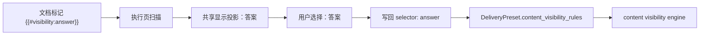

# 内容块显隐 Selector 共享投影执行记录 2026-06-30

## 本轮结论

上一轮已经把场景输出设置里的显隐规则从 `answer / analysis` 这类内部 selector，改成“答案 / 解析”等业务名。但执行页扫描文档显隐标记时，仍然直接显示 selector，并且状态文案仍出现“selector / marker / preset”。

这会造成一个链路断点：

- 场景规划页：用户看到“答案”。
- 执行页扫描：用户看到 `answer`。
- 规则写回：底层仍用 `answer`。

本轮把“内容块显示名投影”抽成共享 adapter，让规划页和执行页共用同一套 selector -> display label 规则。真实 selector 继续留在数据层、tooltip 和 `ContentVisibilityRule.selector` 中。

## 新增共享边界

新增：

```text
src/ui/adapters/content_visibility_display.py
```

职责：

- 定义常用内容块选项。
- 将 selector 映射为业务显示名。
- 生成保留 raw selector 的 tooltip。
- 格式化扫描状态中的内容块列表。
- 将执行页扫描问题文案从“selector/marker/preset”转换为“内容块/文档标记/交付”。

该 adapter 不依赖 Qt，不参与执行引擎，只负责 UI 投影。

## 接入点

### 场景规划页

`ScenePanel` 不再维护本地 `_VISIBILITY_SELECTOR_OPTIONS`，改为从共享 adapter 读取常用内容块选项。

结果：

- 场景输出设置下拉继续显示“答案 / 解析 / 解题过程”等业务名。
- item data 仍是 `answer / analysis / solution`。
- tooltip 仍显示 `{{#visibility:answer}}`。

### 执行页

`QuickExecutionDetail` 扫描文档后：

- 下拉显示“答案”，不是 `answer`。
- tooltip 保留 `answer` 和 `{{#visibility:answer}}`。
- 状态条显示“已识别 1 个内容块：答案”，不再显示“selector：answer”。
- 规则缺失时显示“规则内容块未在文档中找到: 答案 (answer)”。
- 文档多余标记显示“文档标记未被任何交付使用: draft”。

## 链路验证

链路保持不变：



本轮只改变 B 到 D 的显示层，不改变 E 到 G 的执行合同。

## 测试证据

已补充/更新测试：

- 场景规划页：内容块下拉显示“答案”，raw `answer` 只留在 tooltip/data。
- 执行页：扫描 `{{#visibility:answer}}` 后下拉显示“答案”。
- 执行页：状态条显示“内容块：答案”，不再要求“selector：answer”。
- 执行页：点击添加规则后仍写入 `ContentVisibilityRule(selector="answer", action="remove")`。
- 执行页：重复添加时提示“答案 已在…规则中”。
- 执行页：缺失/未使用标记文案改为业务可读，同时保留必要 raw key。

已运行：

```text
python -X utf8 -m py_compile src\ui\adapters\content_visibility_display.py src\ui\panels\scene_panel.py src\ui\panels\workbench\quick_execution_detail.py tests\test_scene_panel_architecture.py tests\test_quick_execution_detail_architecture.py
python -X utf8 -m pytest tests\test_scene_panel_architecture.py::test_scene_panel_controls_follow_template_management_contract tests\test_scene_panel_architecture.py::test_scene_panel_delivery_visibility_rule_inserter_updates_current_preset tests\test_quick_execution_detail_architecture.py::test_quick_execution_detail_scans_visibility_markers_for_current_scene tests\test_quick_execution_detail_architecture.py::test_quick_execution_detail_flags_visibility_marker_rule_mismatches tests\test_quick_execution_detail_architecture.py::test_quick_execution_detail_adds_scanned_selector_to_default_delivery_preset tests\test_quick_execution_detail_architecture.py::test_quick_execution_detail_adds_selector_to_selected_delivery_preset tests\test_quick_execution_detail_architecture.py::test_quick_execution_detail_adds_selector_to_all_delivery_presets -q
python -X utf8 -m pytest tests\test_scene_panel_architecture.py tests\test_quick_execution_detail_architecture.py -q
```

结果：7 个聚焦链路测试通过；场景页 + 执行页整组 108 个测试通过。

## 继续推进建议

1. 将执行页显隐扫描的“添加规则”按钮与场景页“添加内容块”文案进一步统一。
2. 将 `ContentVisibilityRule.label` 的默认值也改为业务名，同时保留 selector 字段不变。
3. 把输出设置中的 `交付 ID` 继续下沉到高级区，主路径只保留“交付名称 / 业务模板 / 输出物”。
4. 对显隐规则文本区增加结构化列表视图，文本规则作为高级编辑入口。
